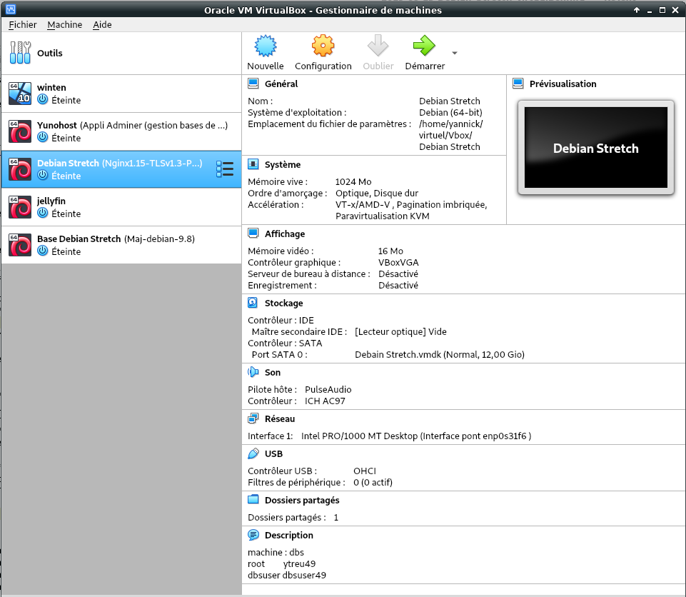

+++
title = 'Virtuel "Debian Stretch" ouestline.net (VirtualBox/PC1)'
date = 2019-07-06 00:00:00 +0100
categories = ['virtuel']
+++
# VirtualBox

## Debian Stretch VirtualBox

{:width="100"}

* Serveur virtuel 64 bits VirtualBox : **Debian Stretch** 
* machine : **dbs** 
* domaine :   
* root : **ytreu49** 
* Utilisateur : **dbsuser** 
* Mot de passe : **dbsuser49** 
* Adresse IP : **192.168.0.47**
* Accès 
    * SSH : <s>**ssh dbsuser@192.168.0.47**</s>
    * SSH + clé : **ssh -i ~/.ssh/vbox-dbs-ed25519 dbsuser@192.168.0.47**  
    * Transfert de fichier : **scp -P 55022 -i ~/.ssh/vbox-dbs-ed25519 fichiera fichierb dbsuser@192.168.0.47:/home/dbsuser**  
* Mot de passe root mariadb : **mariadb49**

>Le domaine **ouestline.net** pointe sur l'adresse IPV6 **2a01:e34:ee6a:b274::1**  
Ce debian virtuel est utilisé pour des tests avec la possibilité de créer des images à un instant donné pour y revenir si besoin... 

Image debian stretch avec VirtualBox

{:width="600"}

**Pour info**  

```
VBoxManage startvm 'Debian Stretch' --type headless  # Lancement VM sans l'application graphique 
VBoxManage controlvm 'Debian Stretch' poweroff        # Pour arrêter une VM
VBoxManage controlvm 'Debian Stretch' pause           # Pour mettre en pause une VM
VBoxManage controlvm 'Debian Stretch' reset           # Pour réinitialiser une VM
```

### Connexion SSH

	ssh dbsuser@192.168.0.47

Passer en root

	su # sudo -s

Mise à jour

    apt update && apt upgrade -y

Installer sudo

	apt install sudo

Visudo pour les accès root via utilisateur dbsuser

	echo "dbsuser     ALL=(ALL) NOPASSWD: ALL" >> /etc/sudoers

Connexion ssh avec clé

Ajouter le contenu de la clé publique **vbox-dbs-ed25519.pub** au fichier **~/.ssh/authorized_keys**  
Droit en lecture utilisateur uniquement, `chmod 400 ~/.ssh/authorized_keys`  
Modification configuration serveur ssh , `/etc/ssh/sshd_config` -> PasswordAuthentication no  
Relancer le service `sudo systemctl restart sshd`


### VBox Additions Invité/Debian 

Préalable  
Configurer votre machine virtuelle pour un accès au réseau partagé.  
**''Configuration'' --> ''Dossiers partagés''**  
Ajouter le dossier et cocher **''Montage automatique''**  

Installer les additions client dans un Debian en cours d'exécution dans une machine virtuelle.

  - Installez gcc ,make et  **kernel headers** (installateur a besoin d'eux pour construire le module du noyau):
      -  `sudo apt install gcc make linux-headers-$(uname -r)`
  - Allez dans le menu **''Périphériques'' --> ''Insérer l'image des additions invité...''** de la machine virtuelle en cours d'exécution ,si non présent , le télécharger.  
  - Monter le cd dans la machine virtuelle : `sudo mount /dev/cdrom /media/cdrom`
  - Allez dans le dossier monté : `cd /media/cdrom`
  - Exécutez : `sudo ./VBoxLinuxAdditions.run`
      - Pas d'environnement graphique : <u>ne pas tenir compte de l'erreur</u> **''Could not find the X.Org or XFree86 Window System, skipping.''**
  - Il faut ajouter le group **vboxsf** à votre utilisateur : `sudo usermod -a -G vboxsf $USER`
  - Pour la prise en compte, redémarrer la machine virtuelle : `sudo reboot`

**/media/** est le répertoire qui contient le(s) dossier(s) partagé(s)

### Gestion machine virtuelle VM

Démarrer la machine virtuelle VM en ligne de commande sans interface graphique VirtualBox

    VBoxManage startvm "Debian Stretch" --type headless

Arrêter une VM 

    VBoxManage controlvm "Debian Stretch" poweroff

Mettre en pause une VM 

    VBoxManage controlvm "Debian Stretch" pause

Réinitialiser une VM 

    VBoxManage controlvm "Debian Stretch" reset

En savoir plus sur VBoxHeadless, regardez

    VBoxHeadless --help 

### Adressage ipv6

Réseau actuel

	ip addr

```
2: enp0s3: <BROADCAST,MULTICAST,UP,LOWER_UP> mtu 1500 qdisc pfifo_fast state UP group default qlen 1000
    link/ether 08:00:27:a1:75:8e brd ff:ff:ff:ff:ff:ff
    inet 192.168.0.47/24 brd 192.168.0.255 scope global enp0s3
       valid_lft forever preferred_lft forever
    inet6 2a01:e34:ee6a:b270:a00:27ff:fea1:758e/64 scope global mngtmpaddr dynamic 
       valid_lft 86089sec preferred_lft 86089sec
    inet6 fe80::a00:27ff:fea1:758e/64 scope link 
       valid_lft forever preferred_lft forever
```

La carte n’est joignable de l’internet que par son adresse IPV6  
NextHop Freebox permet d’attribuer une adresse IPV6  
Adresse IPV6 Box  **fe80::224:d4ff:fea6:aa20**  
Préfixe **2a01:e34:ee6a:b274::/64**  
NextHop **fe80::a00:27ff:fea1:758e**  

    sudo nano /etc/network/interfaces

```
# This file describes the network interfaces available on your system
# and how to activate them. For more information, see interfaces(5).

source /etc/network/interfaces.d/*

# The loopback network interface
auto lo
iface lo inet loopback

# The primary network interface
allow-hotplug enp0s3
iface enp0s3 inet dhcp
# This is an autoconfigured IPv6 interface
# iface enp0s3 inet6 auto
iface enp0s3 inet6 static
  address 2a01:e34:ee6a:b274::1
  netmask 64
  post-up ip -6 route add default via fe80::224:d4ff:fea6:aa20 dev enp0s3

```

Redémarrer la machine

    sudo systemctl reboot

Vérifier l'adresse inet6 

    ip addr

```
2: enp0s3: <BROADCAST,MULTICAST,UP,LOWER_UP> mtu 1500 qdisc pfifo_fast state UP group default qlen 1000
    link/ether 08:00:27:a1:75:8e brd ff:ff:ff:ff:ff:ff
    inet 192.168.0.47/24 brd 192.168.0.255 scope global enp0s3
       valid_lft forever preferred_lft forever
    inet6 2a01:e34:ee6a:b274::1/64 scope global tentative dadfailed 
       valid_lft forever preferred_lft forever
    inet6 2a01:e34:ee6a:b270:a00:27ff:fea1:758e/64 scope global mngtmpaddr dynamic 
       valid_lft 84708sec preferred_lft 84708sec
    inet6 fe80::a00:27ff:fea1:758e/64 scope link 
       valid_lft forever preferred_lft forever
```

### Nginx + PHP7 + MariaDB

{:width="20%"}

[Debian Stretch compilation nginx avec modules dynamiques et TLSv1.3 + PHP7.3 + MariaDB](404/)


### DNS

{:width="10%"}

Le domaine **ouestline.net** pointe sur l'adresse IPV6 **2a01:e34:ee6a:b274::1**

depuis un poste distant  
`ping -6 -c5 2a01:e34:ee6a:b274::1`  
`ping -6 -c5 ouestline.net`  

OVH

```
$TTL 3600
@	IN SOA dns111.ovh.net. tech.ovh.net. (2018110102 86400 3600 3600000 300)
         3600 IN NS     ns111.ovh.net.
         3600 IN NS     dns111.ovh.net.
         3600 IN AAAA   2a01:e34:ee6a:b274::1
blog     3600 IN CNAME  ouestline.net.
static   3600 IN CNAME  ouestline.net.
```

### Certificats Letsencrypt

{:width="10%"}

[Utiliser acme et api ovh](/posts/Acme-Certficats-Serveurs/)

Passer en root (su, sudo)  
Génération des certificats  
`/root/.acme.sh/acme.sh --dns dns_ovh --issue --keylength 4096 -d ouestline.net -d *.ouestline.net`  

```
[lundi 22 octobre 2018, 18:39:48 (UTC+0200)] Your cert is in  /root/.acme.sh/ouestline.net/ouestline.net.cer 
[lundi 22 octobre 2018, 18:39:48 (UTC+0200)] Your cert key is in  /root/.acme.sh/ouestline.net/ouestline.net.key 
[lundi 22 octobre 2018, 18:39:48 (UTC+0200)] The intermediate CA cert is in  /root/.acme.sh/ouestline.net/ca.cer 
[lundi 22 octobre 2018, 18:39:48 (UTC+0200)] And the full chain certs is there:  /root/.acme.sh/ouestline.net/fullchain.cer 
```

Création des liens

    ln -s /root/.acme.sh/ouestline.net/fullchain.cer /etc/ssl/private/ouestline.net.fullchain.cer.pem
    ln -s /root/.acme.sh/ouestline.net/ouestline.net.key /etc/ssl/private/ouestline.net.key.pem

### Configuration nginx

`sudo -s`  
Fichier de configuration nginx  
`rm /etc/nginx/conf.d/default.conf`  
`nano /etc/nginx/conf.d/default.conf`  

```
server {
    listen 80;
    listen [::]:80;

    ## redirect http to https ##
    server_name ouestline.net;
    return  301 https://$server_name$request_uri;
}

server {
    listen 443 ssl http2;
    listen [::]:443 ssl http2;

    server_name ouestline.net;
    root /var/www/ ;

    ssl_certificate /etc/ssl/private/ouestline.net.fullchain.cer.pem;
    ssl_certificate_key /etc/ssl/private/ouestline.net.key.pem;
    ssl_session_timeout 5m;
    ssl_session_cache shared:SSL:50m;

    # As suggested by Mozilla : https://wiki.mozilla.org/Security/Server_Side_TLS and https://en.wikipedia.org/wiki/Curve25519
    # (this doesn't work on jessie though ...?)
    # ssl_ecdh_curve secp521r1:secp384r1:prime256v1;

    # As suggested by https://cipherli.st/
    ssl_ecdh_curve secp384r1;

    ssl_prefer_server_ciphers on;

    # Ciphers with modern compatibility
    #---------------------------------
    # https://mozilla.github.io/server-side-tls/ssl-config-generator/?server=nginx-1.6.2&openssl=1.0.1t&hsts=yes&profile=modern
    # Uncomment the following to use modern ciphers, but remove compatibility with some old clients (android < 5.0, Internet Explorer < 10, ...)
    ssl_protocols TLSv1.2 TLSv1.3;
    ssl_ciphers 'TLS13+AESGCM+AES128:EECDH+AESGCM:EECDH+CHACHA20:ECDHE-ECDSA-AES256-GCM-SHA384:ECDHE-RSA-AES256-GCM-SHA384:ECDHE-ECDSA-CHACHA20-POLY1305:ECDHE-RSA-CHACHA20-POLY1305:ECDHE-ECDSA-AES128-GCM-SHA256:ECDHE-RSA-AES128-GCM-SHA256:ECDHE-ECDSA-AES256-SHA384:ECDHE-RSA-AES256-SHA384:ECDHE-ECDSA-AES128-SHA256:ECDHE-RSA-AES128-SHA256';

    # Uncomment the following directive after DH generation
    # > openssl dhparam -out /etc/ssl/private/dh2048.pem -outform PEM -2 2048
    #ssl_dhparam /etc/ssl/private/dh2048.pem;

    # Follows the Web Security Directives from the Mozilla Dev Lab and the Mozilla Obervatory + Partners
    # https://wiki.mozilla.org/Security/Guidelines/Web_Security
    # https://observatory.mozilla.org/ 
    add_header Strict-Transport-Security "max-age=63072000; includeSubDomains; preload"; 
    add_header Content-Security-Policy "upgrade-insecure-requests";
    add_header Content-Security-Policy-Report-Only "default-src https: data: 'unsafe-inline' 'unsafe-eval'";
    add_header X-Content-Type-Options nosniff;
    add_header X-XSS-Protection "1; mode=block";
    add_header X-Download-Options noopen;
    add_header X-Permitted-Cross-Domain-Policies none;
    add_header X-Frame-Options "SAMEORIGIN";

    index index.php;
        location ~ \.php$ {
           fastcgi_split_path_info ^(.+\.php)(/.+)$;
           fastcgi_pass unix:/run/php/php7.2-fpm.sock;    # PHP7.2 
           fastcgi_index index.php;
           include fastcgi_params;
           fastcgi_param SCRIPT_FILENAME $request_filename;
        }
}

```

Rechargement nginx  
`systemctl reload nginx`  


### script ssh_rc

Exécuter un fichier utilisateur nommé $HOME/.ssh/rc si présent  
Pour tous les utilisateurs exécuter un fichier nommé /etc/ssh/sshrc si présent  
Installer les utilitaires curl jq figlet  

    sudo apt install curl jq figlet

Le batch

    nano ~/ssh_rc

```
#!/bin/bash

get_infos() {
    seconds="$(< /proc/uptime)"
    seconds="${seconds/.*}"
    days="$((seconds / 60 / 60 / 24)) jour(s)"
    hours="$((seconds / 60 / 60 % 24)) heure(s)"
    mins="$((seconds / 60 % 60)) minute(s)"
    
    # Remove plural if < 2.
    ((${days/ *} == 1))  && days="${days/s}"
    ((${hours/ *} == 1)) && hours="${hours/s}"
    ((${mins/ *} == 1))  && mins="${mins/s}"
    
    # Hide empty fields.
    ((${days/ *} == 0))  && unset days
    ((${hours/ *} == 0)) && unset hours
    ((${mins/ *} == 0))  && unset mins
    
    uptime="${days:+$days, }${hours:+$hours, }${mins}"
    uptime="${uptime%', '}"
    uptime="${uptime:-${seconds} seconds}"

   if [[ -f "/sys/devices/virtual/dmi/id/board_vendor" ||
                    -f "/sys/devices/virtual/dmi/id/board_name" ]]; then
	model="$(< /sys/devices/virtual/dmi/id/board_vendor)"
	model+=" $(< /sys/devices/virtual/dmi/id/board_name)"
   fi

   if [[ -f "/sys/devices/virtual/dmi/id/bios_vendor" ||
                    -f "/sys/devices/virtual/dmi/id/bios_version" ]]; then
        bios="$(< /sys/devices/virtual/dmi/id/bios_vendor)"
        bios+=" $(< /sys/devices/virtual/dmi/id/bios_version)"
        bios+=" $(< /sys/devices/virtual/dmi/id/bios_date)"
   fi
}

#clear
PROCCOUNT=`ps -Afl | wc -l`  		# nombre de lignes
PROCCOUNT=`expr $PROCCOUNT - 5`		# on ote les non concernées
GROUPZ=`users`
ipinfo=$(curl -s ipinfo.io) 		# info localisation format json
#ipinfo=$(curl -s iplocality.com) 		# info localisation format json
publicip=$(echo $ipinfo | jq -r '.ip')  # extraction des données , installer préalablement "jq"
ville=$(echo $ipinfo | jq -r '.city')
pays=$(echo $ipinfo | jq -r '.country')
cpuname=`cat /proc/cpuinfo |grep 'model name' | cut -d: -f2 | sed -n 1p`
iplink=`ip link show |grep -m 1 "2:" | awk '{print $2}' | cut -d: -f1`

if [[ $GROUPZ == *irc* ]]; then
ENDSESSION=`cat /etc/security/limits.conf | grep "@irc" | grep maxlogins | awk {'print $4'}`
PRIVLAGED="IRC Account"
else
ENDSESSION="Unlimited"
PRIVLAGED="Regular User"
fi
get_infos
logo=$(figlet "`hostname --fqdn`")
meteo=$(curl fr.wttr.in/$ville?0)
lvm_entet="Sys. de fichiers                      Taille Utilisé Dispo Uti% Monté sur"
lvm=$(df -h |grep mapper)
distri=$(lsb_release -sd)
distri+=" $(uname -m)"

echo -e "
\e[1;31m$logo
\e[1;35m   \e[1;37mHostname \e[1;35m= \e[1;32m`hostname`
\e[1;35m \e[1;37mWired IpV4 \e[1;35m= \e[1;32m`ip addr show $iplink | grep 'inet\b' | awk '{print $2}' | cut -d/ -f1`
\e[1;35m \e[1;37mWired IpV6 \e[1;35m= \e[1;32m`ip addr show $iplink | grep -E 'inet6' |grep -E 'scope link' | awk '{print $2}' | cut -d/ -f1`
\e[1;35m     \e[1;37mKernel \e[1;35m= \e[1;32m`uname -r`
\e[1;35m    \e[1;37mDistrib \e[1;35m= \e[1;32m$distri
\e[1;35m     \e[1;37mUptime \e[1;35m= \e[1;32m`echo $uptime`
\e[1;35m       \e[1;37mBios \e[1;35m= \e[1;32m`echo $bios`
\e[1;35m      \e[1;37mBoard \e[1;35m= \e[1;32m`echo $model`
\e[1;35m        \e[1;37mCPU \e[1;35m= \e[1;32m`echo $cpuname`
\e[1;35m \e[1;37mMemory Use \e[1;35m= \e[1;32m`free -m | awk 'NR==2{printf "%s/%sMB (%.2f%%)\n", $3,$2,$3*100/$2 }'`
\e[1;35m   \e[1;37mUsername \e[1;35m= \e[1;32m`whoami`
\e[1;35m   \e[1;37mSessions \e[1;35m= \e[1;32m`who | grep $USER | wc -l`
\e[1;35m\e[1;37mPublic IpV4 \e[1;35m= \e[1;32m`echo $publicip`
\e[1;35m\e[1;37mPublic IpV6 \e[1;35m= \e[1;32m`ip addr show $iplink | grep -m 1 'inet6\b'  | awk '{print $2}' | cut -d/ -f1`
\e[1;35m\e[1;96m$lvm_entet\e[1;35m\e[1;49m
\e[1;35m\e[1;33m$lvm
\e[1;35m\e[1;32m$meteo
\e[1;0m
"
```

Rendre exécutable

    chlod +x ~/ssh_rc

### NFS client + AutoFS

Pour éviter des erreurs de résolution, il faut ajouter la ligne suivante au fichier **/etc/hosts**  
`192.168.0.28	pc1`  
Vérification

    sudo getent hosts

```
127.0.0.1       localhost
127.0.1.1       dbs
192.168.0.28    pc1
127.0.0.1       localhost ip6-localhost ip6-loopback
```


**NFS client**  
Installation

    sudo apt install nfs-common autofs

Les partages sur PC1 

    sudo showmount -e pc1

```
Export list for pc1:
/home/yannick/media/dplus/statique 192.168.0.0/24
/home/yannick/media/devel          192.168.0.0/24
/home/yannick/video                192.168.0.0/24
```

**autofs**  

Modifier le fichier **/etc/auto.master**

    sudo nano /etc/auto.master

```
+auto.master
/srv/www        /etc/auto.nfs
```

Créer le fichier **/etc/auto.nfs**

    sudo nano /etc/auto.nfs

```
#map -fstype=nfs,rw,uid=1000,guid=1000,rsize=8192,wsize=8192  pc1:/home/yannick/media/devel/ouestline/osm-new
#devel -fstype=nfs,rw,uid=1000,guid=1000,rsize=8192,wsize=8192  pc1:/home/yannick/media/devel
map         -fstype=nfs     pc1:/home/yannick/media/devel/ouestline/osm-new
devel       -fstype=nfs     pc1:/home/yannick/media/devel
```

Recharger 

    sudo systemctl restart autofs

Créer les liens avec le partage NFS

    sudo ln -s /srv/www/map /var/www/map
    sudo ln -s /srv/www/devel /var/www/devel

Vérifier

    ls /var/www/map/
    #   css  file  fonts  images  index/  js
    ls /var/www/devel
    #   git-yunohost  lamalle  osm.tar.gz  ouestline  yannick


### map.ouestline.net et dev.ouestline.net

Création d'un lien sur une application cartographique 

    sudo nano /etc/nginx/conf.d/map.ouestline.conf 

```
server {
    listen 80;
    listen [::]:80;

    ## redirect http to https ##
    server_name map.ouestline.net;
    return  301 https://$server_name$request_uri;
}

server {
    listen 443 ssl http2;
    listen [::]:443 ssl http2;

    server_name map.ouestline.net;
    root /var/www/map/ ;

    ssl_certificate /etc/ssl/private/ouestline.net.fullchain.cer.pem;
    ssl_certificate_key /etc/ssl/private/ouestline.net.key.pem;
    ssl_session_timeout 5m;
    ssl_session_cache shared:SSL:50m;

    # As suggested by Mozilla : https://wiki.mozilla.org/Security/Server_Side_TLS and https://en.wikipedia.org/wiki/Curve25519
    # (this doesn't work on jessie though ...?)
    # ssl_ecdh_curve secp521r1:secp384r1:prime256v1;

    # As suggested by https://cipherli.st/
    ssl_ecdh_curve secp384r1;

    ssl_prefer_server_ciphers on;

    # Ciphers with modern compatibility
    #---------------------------------
    # https://mozilla.github.io/server-side-tls/ssl-config-generator/?server=nginx-1.6.2&openssl=1.0.1t&hsts=yes&profile=modern
    # Uncomment the following to use modern ciphers, but remove compatibility with some old clients (android < 5.0, Internet Explorer < 10, ...)
    ssl_protocols TLSv1.2 TLSv1.3;
    ssl_ciphers 'TLS13+AESGCM+AES128:EECDH+AESGCM:EECDH+CHACHA20:ECDHE-ECDSA-AES256-GCM-SHA384:ECDHE-RSA-AES256-GCM-SHA384:ECDHE-ECDSA-CHACHA20-POLY1305:ECDHE-RSA-CHACHA20-POLY1305:ECDHE-ECDSA-AES128-GCM-SHA256:ECDHE-RSA-AES128-GCM-SHA256:ECDHE-ECDSA-AES256-SHA384:ECDHE-RSA-AES256-SHA384:ECDHE-ECDSA-AES128-SHA256:ECDHE-RSA-AES128-SHA256';

    # Uncomment the following directive after DH generation
    # > openssl dhparam -out /etc/ssl/private/dh2048.pem -outform PEM -2 2048
    #ssl_dhparam /etc/ssl/private/dh2048.pem;

    # Follows the Web Security Directives from the Mozilla Dev Lab and the Mozilla Obervatory + Partners
    # https://wiki.mozilla.org/Security/Guidelines/Web_Security
    # https://observatory.mozilla.org/ 
    add_header Strict-Transport-Security "max-age=63072000; includeSubDomains; preload"; 
    add_header Content-Security-Policy "upgrade-insecure-requests";
    add_header Content-Security-Policy-Report-Only "default-src https: data: 'unsafe-inline' 'unsafe-eval'";
    add_header X-Content-Type-Options nosniff;
    add_header X-XSS-Protection "1; mode=block";
    add_header X-Download-Options noopen;
    add_header X-Permitted-Cross-Domain-Policies none;
    add_header X-Frame-Options "SAMEORIGIN";

    index index/ index.php;
        location ~ \.php$ {
           fastcgi_split_path_info ^(.+\.php)(/.+)$;
           fastcgi_pass unix:/run/php/php7.3-fpm.sock;   # PHP7.3
           fastcgi_index index.php;
           include fastcgi_params;
           fastcgi_param SCRIPT_FILENAME $request_filename;
        }
}
```

Pour le développement

    sudo nano /etc/nginx/conf.d/map.ouestline.conf 

```
server {
    listen 80;
    listen [::]:80;

    ## redirect http to https ##
    server_name dev.ouestline.net;
    return  301 https://$server_name$request_uri;
}

server {
    listen 443 ssl http2;
    listen [::]:443 ssl http2;

    server_name dev.ouestline.net;
    root /var/www/devel/ ;

    ssl_certificate /etc/ssl/private/ouestline.net.fullchain.cer.pem;
    ssl_certificate_key /etc/ssl/private/ouestline.net.key.pem;
    ssl_session_timeout 5m;
    ssl_session_cache shared:SSL:50m;

    # As suggested by Mozilla : https://wiki.mozilla.org/Security/Server_Side_TLS and https://en.wikipedia.org/wiki/Curve25519
    # (this doesn't work on jessie though ...?)
    # ssl_ecdh_curve secp521r1:secp384r1:prime256v1;

    # As suggested by https://cipherli.st/
    ssl_ecdh_curve secp384r1;

    ssl_prefer_server_ciphers on;

    # Ciphers with modern compatibility
    #---------------------------------
    # https://mozilla.github.io/server-side-tls/ssl-config-generator/?server=nginx-1.6.2&openssl=1.0.1t&hsts=yes&profile=modern
    # Uncomment the following to use modern ciphers, but remove compatibility with some old clients (android < 5.0, Internet Explorer < 10, ...)
    ssl_protocols TLSv1.2 TLSv1.3;
    ssl_ciphers 'TLS13+AESGCM+AES128:EECDH+AESGCM:EECDH+CHACHA20:ECDHE-ECDSA-AES256-GCM-SHA384:ECDHE-RSA-AES256-GCM-SHA384:ECDHE-ECDSA-CHACHA20-POLY1305:ECDHE-RSA-CHACHA20-POLY1305:ECDHE-ECDSA-AES128-GCM-SHA256:ECDHE-RSA-AES128-GCM-SHA256:ECDHE-ECDSA-AES256-SHA384:ECDHE-RSA-AES256-SHA384:ECDHE-ECDSA-AES128-SHA256:ECDHE-RSA-AES128-SHA256';

    # Uncomment the following directive after DH generation
    # > openssl dhparam -out /etc/ssl/private/dh2048.pem -outform PEM -2 2048
    #ssl_dhparam /etc/ssl/private/dh2048.pem;

    # Follows the Web Security Directives from the Mozilla Dev Lab and the Mozilla Obervatory + Partners
    # https://wiki.mozilla.org/Security/Guidelines/Web_Security
    # https://observatory.mozilla.org/ 
    add_header Strict-Transport-Security "max-age=63072000; includeSubDomains; preload"; 
    add_header Content-Security-Policy "upgrade-insecure-requests";
    add_header Content-Security-Policy-Report-Only "default-src https: data: 'unsafe-inline' 'unsafe-eval'";
    add_header X-Content-Type-Options nosniff;
    add_header X-XSS-Protection "1; mode=block";
    add_header X-Download-Options noopen;
    add_header X-Permitted-Cross-Domain-Policies none;
    add_header X-Frame-Options "SAMEORIGIN";

        location / {
          fancyindex on;              # Enable fancy indexes.
          fancyindex_exact_size off;  # Output human-readable file sizes.
        }

    index index/ index.php;
        location ~ \.php$ {
           fastcgi_split_path_info ^(.+\.php)(/.+)$;
           fastcgi_pass unix:/run/php/php7.3-fpm.sock;   # PHP7.3
           fastcgi_index index.php;
           include fastcgi_params;
           fastcgi_param SCRIPT_FILENAME $request_filename;
        }
}
```

Vérifier et relancer

    sudo nginx -t
    sudo systemctl restart nginx

Cartographie, les modifications se font en local sur PC1 dossier **/home/yannick/media/devel/ouestline/osm-new/**   
Le développement , dossier **/home/yannick/media/devel/**  

## Site statique -> static.ouestline.net


### Installation ruby + jekyll 

    sudo apt install build-essential ruby-full
    sudo gem install bundler jekyll-feed

### wikistatic

Installer dépendances Rmagick sur Debian

    sudo apt install imagemagick libmagick++-dev ruby-rmagick 

Création dossier

    sudo mkdir -p /srv     # création dossier

Les droits sur le dossier

    sudo chown   $USER. -R /srv/

Clonage wikistatic par git

```
sudo apt install git 
cd /srv
git clone https://gitea.yanspm.com/yannick/wikistatic2.0 wikistatic 
cd wikistatic
```

Lancement “bundle” dans le dossier /srv/wikistatic pour la création de l'environnement

    cd /srv/wikistatic
    bundle

Les dossiers de l'hôte sont partagés sur la VBox debian (nfs+autofs)  
On efface les dossiers actuels (ils peuvent ne pas exister)  
`sudo rm -r /srv/wikistatic/{files,images,_posts}`  

Montage auto des dossiers pour le site statique ,ajout au fichier **/etc/auto.master**

    sudo nano /etc/auto.master

```
# ligne à ajouter en fin de fichier
/srv/static        /etc/wikistatic.nfs
```

Créer le fichier **/etc/statique.nfs**

    sudo nano /etc/wikistatic.nfs

```
files          -fstype=nfs     pc1:/home/yannick/media/dplus/statique/files
images         -fstype=nfs     pc1:/home/yannick/media/dplus/statique/images
_posts         -fstype=nfs     pc1:/home/yannick/media/dplus/statique/_posts
```

Recharger 

    sudo systemctl restart autofs

Vérifier

    ls /srv/static/
    #   files  images  _posts

Création des liens avec le partage NFS VBox (files , images et  _posts)    

Créer les liens avec le partage NFS

    sudo ln -s /srv/static/_posts /srv/wikistatic/_posts
    sudo ln -s /srv/static/images /srv/wikistatic/images
    sudo ln -s /srv/static/files /srv/wikistatic/files

Structure wikistatic

```
/srv/wikistatic/
├── 404/
├── assets
├── categories/
├── _config.yml
├── feed.xml
├── files -> /srv/static/files
├── Gemfile
├── Gemfile.lock
├── images -> /srv/static/images
├── _includes
├── index/
├── js
├── _layouts
├── _posts -> /srv/static/_posts
├── README.md
├── _site
├── start_basicblog.sh
├── start_jekyll.sh
├── tags/
└── wikistatic.json
```

Construire le site

    cd /srv/wikistatic # aller au dossier avant construction
    jekyll build  # construction du dossier statique _site

```
Configuration file: /srv/wikistatic/_config.yml
            Source: /srv/wikistatic
       Destination: /srv/wikistatic/_site
 Incremental build: disabled. Enable with --incremental
      Generating... 
                    done in 15.062 seconds.
 Auto-regeneration: disabled. Use --watch to enable.
```

### Générer site automatiquement

Le dossier *_site* est regénéré à chaque création, modification ou suppression d'un fichier de type *markdown* dans le dossier *_posts*  
Cette opération doit être lancée et en attente. Un bash et un service vont être utilisés.  

Pour lancer le serveur Jekyll au démarrage , créer un bash sous **/srv/wikistatic**

    nano /srv/wikistatic/start_jekyll.sh

```
#!/bin/sh
# Accès dossier 
cd /srv/wikistatic/
# lancement jekyll en mode auto génération sans serveur
/usr/local/bin/bundle exec jekyll build --watch --source "/srv/wikistatic"
```

Droits sur le bash

```
sudo chown $USER. /srv/wikistatic/start_jekyll.sh
chmod +x /srv/wikistatic/start_jekyll.sh
```

>Pour lancer le serveur **Jekyll** au démarrage, utilisation d'un <u>service systemd</u>  
**ATTENTION!** , remplacer *User=utilisateur* par votre nom d'utilisateur (**echo $USER**)

Création d'un service jekyll sous systemd

    sudo nano /etc/systemd/system/jekyll.service

Contenu du fichier

```ini
[Unit]
Description=jekyll Service
After=network.target

[Service]
Type=simple
User=dbsuser
ExecStart=/bin/sh /srv/wikistatic/start_jekyll.sh
Restart=on-abort


[Install]
WantedBy=multi-user.target
```

Lancer le service  **jekyll** :

```bash
sudo systemctl daemon-reload
sudo systemctl start jekyll
```

Vérifier

    systemctl status jekyll

```
● jekyll.service - jekyll Service
   Loaded: loaded (/etc/systemd/system/jekyll.service; disabled; vendor preset: enabled)
   Active: active (running) since Sat 2019-04-27 13:54:42 CEST; 52s ago
 Main PID: 28671 (sh)
    Tasks: 5 (limit: 4915)
   CGroup: /system.slice/jekyll.service
           ├─28671 /bin/sh /srv/wikistatic/start_jekyll.sh
           └─28672 /usr/local/bin/jekyll build --watch --source /srv/wikistatic
```

Valider le lancement du **service jekyll au démarrage**

    sudo systemctl enable jekyll


### nginx static.ouestline.conf

fichier **/etc/nginx/conf.d/static.ouestline.conf**

    sudo nano /etc/nginx/conf.d/static.ouestline.conf

```
server {
    listen 80;
    listen [::]:80;

    ## redirect http to https ##
    server_name static.ouestline.net;
    return  301 https://$server_name$request_uri;
}

server {
    listen 443 ssl http2;
    listen [::]:443 ssl http2;

    server_name static.ouestline.net;
    root /srv/wikistatic/_site/ ;

    ssl_certificate /etc/ssl/private/ouestline.net.fullchain.cer.pem;
    ssl_certificate_key /etc/ssl/private/ouestline.net.key.pem;
    ssl_session_timeout 5m;
    ssl_session_cache shared:SSL:50m;

    # As suggested by Mozilla : https://wiki.mozilla.org/Security/Server_Side_TLS and https://en.wikipedia.org/wiki/Curve25519
    # (this doesn't work on jessie though ...?)
    # ssl_ecdh_curve secp521r1:secp384r1:prime256v1;

    # As suggested by https://cipherli.st/
    ssl_ecdh_curve secp384r1;

    ssl_prefer_server_ciphers on;

    # Ciphers with modern compatibility
    #---------------------------------
    # https://mozilla.github.io/server-side-tls/ssl-config-generator/?server=nginx-1.6.2&openssl=1.0.1t&hsts=yes&profile=modern
    # Uncomment the following to use modern ciphers, but remove compatibility with some old clients (android < 5.0, Internet Explorer < 10, ...)
    ssl_protocols TLSv1.2 TLSv1.3;
    ssl_ciphers 'TLS13+AESGCM+AES128:EECDH+AESGCM:EECDH+CHACHA20:ECDHE-ECDSA-AES256-GCM-SHA384:ECDHE-RSA-AES256-GCM-SHA384:ECDHE-ECDSA-CHACHA20-POLY1305:ECDHE-RSA-CHACHA20-POLY1305:ECDHE-ECDSA-AES128-GCM-SHA256:ECDHE-RSA-AES128-GCM-SHA256:ECDHE-ECDSA-AES256-SHA384:ECDHE-RSA-AES256-SHA384:ECDHE-ECDSA-AES128-SHA256:ECDHE-RSA-AES128-SHA256';

    # Uncomment the following directive after DH generation
    # > openssl dhparam -out /etc/ssl/private/dh2048.pem -outform PEM -2 2048
    #ssl_dhparam /etc/ssl/private/dh2048.pem;

    # Follows the Web Security Directives from the Mozilla Dev Lab and the Mozilla Obervatory + Partners
    # https://wiki.mozilla.org/Security/Guidelines/Web_Security
    # https://observatory.mozilla.org/ 
    add_header Strict-Transport-Security "max-age=63072000; includeSubDomains; preload"; 
    add_header Content-Security-Policy "upgrade-insecure-requests";
    add_header Content-Security-Policy-Report-Only "default-src https: data: 'unsafe-inline' 'unsafe-eval'";
    add_header X-Content-Type-Options nosniff;
    add_header X-XSS-Protection "1; mode=block";
    add_header X-Download-Options noopen;
    add_header X-Permitted-Cross-Domain-Policies none;
    add_header X-Frame-Options "SAMEORIGIN";

    index index/;
}
```

Recharger le serveur nginx

    sudo systemctl reload nginx


## Ordinateur PC1

### Créer un service systemd pour lancer debian vbox

Le but est de lancer l'image virtuelle au démarrage de la machine  
Création d'un service utilisateur  

    $ mkdir -p ~/.config/systemd/user
    $ nano ~/.config/systemd/user/debian-virtuel.service

```
[Unit]
Description=debian stretch vm service
After=network.target vboxdrv.service

[Service]
ExecStart=/usr/bin/vboxheadless -s 'Debian Stretch'
ExecStop=/usr/bin/vboxmanage controlvm 'Debian Stretch' poweroff

[Install]
WantedBy=default.target
```

Relancer systemd utilisateur

    $ systemctl --user daemon-reload

Démarrer le service

    $ systemctl start --user debian-virtuel.service

Status

    $ systemctl status --user debian-virtuel.service

```
● debian-virtuel.service - debian stretch vm service
   Loaded: loaded (/home/yannick/.config/systemd/user/debian-virtuel.service; disabled; vendor preset: enabled)
   Active: active (running) since Wed 2019-04-17 09:46:25 CEST; 11s ago
 Main PID: 6580 (VBoxHeadless)
   CGroup: /user.slice/user-1000.slice/user@1000.service/debian-virtuel.service
           ├─6580 /usr/lib/virtualbox/VBoxHeadless -s Debian Stretch
           ├─6593 /usr/lib/virtualbox/VBoxXPCOMIPCD
           └─6598 /usr/lib/virtualbox/VBoxSVC --auto-shutdown

avril 17 09:46:25 yannick-pc systemd[931]: Started debian stretch vm service.
```

Activation

    systemctl enable --user debian-virtuel.service


## Site statique -> blog.ouestline.net


### Liens

* [Jekyll Themes](http://jekyllthemes.org/)
* [Jekyll Themes + Templates](https://jekyllthemes.io/)
* [Free Jekyll Themes](https://jekyllthemes.io/free)

### Prérequis

>**wikistatic est installé**


### Installer un "thème"  

Clonage "thème" par git

    cd /srv
    sudo -s
    git clone https://github.com/agusmakmun/agusmakmun.github.io.git
    mv agusmakmun.github.io basicblog
    exit

Les droits sur le dossier

    sudo chown   $USER.$USER -R /srv/basicblog

Lancement “bundle” dans le dossier /srv/basicblog

    cd /srv/basicblog
    bundle update github-pages
    bundle

Modifier le fichier de configuration

    nano _config.yml

```
exclude: [start_basicblog.sh]
```

### Créer service basicblog

Le script **/srv/basicblog/start_basicblog.sh** contenu dans le service

```
#!/bin/sh
# Accès dossier 
cd /srv/basicblog/
# lancement jekyll en mode auto génération sans serveur
/usr/local/bin/bundle exec jekyll build --watch --source "/srv/basicblog"
```

On va exécuter un service qui va mettre le générateur “jekyll” en attente de modifications dans le dossier _posts (création, modification ou suppression de fichier markdown)

    sudo nano /etc/systemd/system/basicblog.service

Contenu du fichier (User debadm)

```
[Unit]
Description=jekyll Service
After=network.target

[Service]
Type=simple
User=dbsuser
ExecStart=/bin/sh /srv/basicblog/start_basicblog.sh
Restart=on-abort


[Install]
WantedBy=multi-user.target
```

Créer les liens avec le partage NFS

    sudo rm -r /srv/basicblog/{_posts,images,files}  # efface l'existant
    sudo ln -s /srv/nfs/statique/_posts /srv/basicblog/_posts
    sudo ln -s /srv/nfs/statique/images /srv/basicblog/images
    sudo ln -s /srv/nfs/statique/files /srv/basicblog/files

Si on utilise les liens , il faut copier un fichier

    cp /srv/wikistatic/_includes/video/ /srv/basicblog/_includes/

Lancer le service basicblog :

    sudo systemctl daemon-reload
    sudo systemctl start basicblog
    # Valider le lancement du service basicblog au démarrage
    sudo systemctl enable basicblog
    #Vérifier
    sudo systemctl status basicblog

```
● basicblog.service - basicblog Service
   Loaded: loaded (/etc/systemd/system/basicblog.service; enabled; vendor preset: enabled)
   Active: active (running) since Tue 2019-01-29 20:07:14 CET; 8s ago
 Main PID: 18347 (sh)
    Tasks: 5 (limit: 4915)
   CGroup: /system.slice/basicblog.service
           ├─18347 /bin/sh /srv/basicblog/start_basicblog.sh
           └─18348 ruby2.3 /usr/local/bin/jekyll build --watch --source /srv/basicblog
```

>jekyll génére un dossier statique **/srv/basicblog/_site** 

### nginx blog.ouestline.conf

fichier **/etc/nginx/conf.d/blog.ouestline.conf**

    sudo nano /etc/nginx/conf.d/blog.ouestline.conf

```
server {
    listen 80;
    listen [::]:80;

    ## redirect http to https ##
    server_name blog.ouestline.net;
    return  301 https://$server_name$request_uri;
}

server {
    listen 443 ssl http2;
    listen [::]:443 ssl http2;

    server_name blog.ouestline.net;
    root /srv/basicblog/_site/ ;

    ssl_certificate /etc/ssl/private/ouestline.net.fullchain.cer.pem;
    ssl_certificate_key /etc/ssl/private/ouestline.net.key.pem;
    ssl_session_timeout 5m;
    ssl_session_cache shared:SSL:50m;

    # As suggested by Mozilla : https://wiki.mozilla.org/Security/Server_Side_TLS and https://en.wikipedia.org/wiki/Curve25519
    # (this doesn't work on jessie though ...?)
    # ssl_ecdh_curve secp521r1:secp384r1:prime256v1;

    # As suggested by https://cipherli.st/
    ssl_ecdh_curve secp384r1;

    ssl_prefer_server_ciphers on;

    # Ciphers with modern compatibility
    #---------------------------------
    # https://mozilla.github.io/server-side-tls/ssl-config-generator/?server=nginx-1.6.2&openssl=1.0.1t&hsts=yes&profile=modern
    # Uncomment the following to use modern ciphers, but remove compatibility with some old clients (android < 5.0, Internet Explorer < 10, ...)
    ssl_protocols TLSv1.2 TLSv1.3;
    ssl_ciphers 'TLS13+AESGCM+AES128:EECDH+AESGCM:EECDH+CHACHA20:ECDHE-ECDSA-AES256-GCM-SHA384:ECDHE-RSA-AES256-GCM-SHA384:ECDHE-ECDSA-CHACHA20-POLY1305:ECDHE-RSA-CHACHA20-POLY1305:ECDHE-ECDSA-AES128-GCM-SHA256:ECDHE-RSA-AES128-GCM-SHA256:ECDHE-ECDSA-AES256-SHA384:ECDHE-RSA-AES256-SHA384:ECDHE-ECDSA-AES128-SHA256:ECDHE-RSA-AES128-SHA256';

    # Uncomment the following directive after DH generation
    # > openssl dhparam -out /etc/ssl/private/dh2048.pem -outform PEM -2 2048
    #ssl_dhparam /etc/ssl/private/dh2048.pem;

    # Follows the Web Security Directives from the Mozilla Dev Lab and the Mozilla Obervatory + Partners
    # https://wiki.mozilla.org/Security/Guidelines/Web_Security
    # https://observatory.mozilla.org/ 
    add_header Strict-Transport-Security "max-age=63072000; includeSubDomains; preload"; 
    add_header Content-Security-Policy "upgrade-insecure-requests";
    add_header Content-Security-Policy-Report-Only "default-src https: data: 'unsafe-inline' 'unsafe-eval'";
    add_header X-Content-Type-Options nosniff;
    add_header X-XSS-Protection "1; mode=block";
    add_header X-Download-Options noopen;
    add_header X-Permitted-Cross-Domain-Policies none;
    add_header X-Frame-Options "SAMEORIGIN";

    index index/;
}
```

Recharger le serveur nginx

    sudo systemctl reload nginx

### Remplacer thème existant

Si un thème est déjà installé

```
sudo mkdir -p /srv/archives/                      # dossier de sauvegarde 
sudo chown $USER.$USER -R /srv/archives/          # droits
sudo systemctl stop basicblog                     # arrêt du service
# on archive les fichiers communs à tous les thèmes
cp /srv/basicblog/_includes/video/ /srv/archives/
cp /srv/basicblog/start_basicblog.sh /srv/archives/
sudo rm -r /srv/basicblog/                        # effacer le thème en cours
# On installe le nouveau thème  
git clone https://github.com/aigarsdz/brume.git /srv/basicblog
# On copie les fichiers communs depuis archives
cp /srv/archives/video/ /srv/basicblog/_includes/ 
cp /srv/archives/start_basicblog.sh /srv/basicblog/ 
cp /srv/archives/_config.yml /srv/basicblog/ 
cp /srv/archives/Gemfile /srv/basicblog/ 
sudo rm -r /srv/basicblog/{_posts,images,files}  # efface les dossiers s'ils existent
# Créer les liens avec le partage NFS
sudo ln -s /srv/nfs/statique/_posts /srv/basicblog/_posts
sudo ln -s /srv/nfs/statique/images /srv/basicblog/images
sudo ln -s /srv/nfs/statique/files /srv/basicblog/files
# On installe
cd /srv/basicblog
sudo gem install jekyll-toc
bundle
sudo systemctl restart basicblog
cd ~

```

### Recherche rapide avec fichier json  et lunr.js

Pour rendre la recherche plus rapide , il faut utiliser un fichier json qui sera construit à chaque compilation.  
Créez un fichier **/basicblog.json** à la racine de votre site Jekyll **/srv/basicblog/**

    nano /srv/basicblog/basicblog.json

et remplissez-le avec ce qui suit:


```
---
layout: null
---
[

  

    {
      "id": {{count}},
      "title": {{ post.title | jsonify }},
      "content"	 : {{post.content | strip/ | truncatewords: 20 | jsonify }},
      "url":  {{ post.url | jsonify }},
      "tags": "{{ tag }}, ",
      "categories": "{{ category }}, "
    }
    ,
   
  
]
```


Chaque fois que vous exécutez le processus de compilation de Jekyll, Jekyll utilisera **/basicblog.json** pour déterminer où chercher et ce qu'il faut saisir et il génèrera un fichier **_site/basicblog.json**.

#### Page/ de recherche

**search/** situé sous la racine **/srv/basicblog/** du site statique

    nano /srv/basicblog/search/

``/
---
layout: search
---

<div class="page-header">
  <h1>{{ page.title }}  <small>{{ page.tagline }}</small></h1>
</div>
<div class="form-group">
	<input placeholder="Rechercher" type="search" id="search" class="form-control input-lg">
</div>
<div id="results" class="all-posts results"></div>
<script type="text/javascript" src="{{ site.BASE_PATH }}/assets/js/jquery.min.js"></script>
<script src="{{ site.BASE_PATH }}/assets/js/lunr.min.js"></script>
<script src="{{ site.BASE_PATH }}/assets/js/searchplus.js"></script>
```

#### Analyse json via lunr

Chargement et indexation du fichier pour la recherche , fichier javascript **searchplus.js** dans le dossier **js/**

    nano /srv/basicblog/assets/js/searchplus.js

```js
$(document).ready(function () {
var idx ;
var nbart = 0;
var fichier_json = 'basicblog.json';

//http://www.pureexample.com/jquery/get-json/
function executerRequete(callback) {
   if (nbart === 0) {
        /* set no cache */
        $.ajaxSetup({ cache: false });

			  idx = lunr(function () {
			    this.field('id');
			    this.field('title');
             this.field('content', { boost: 10 });
			    this.field('url');
			  });

           var/ = [];

	  // Get the generated search_data.json file so lunr.js can search it locally.
	  datas = $.getJSON(fichier_json);
	  // Wait for the data to load and add it to lunr
	  datas.then(function(loaded_data){
		    $.each(loaded_data, function(index, d){
		             idx.add({
						    id: index,
						    title: d.title,
						    content: d.content,
						    url: d.url
						  });
						  nbart=nbart + 1;
						/*	//stockage item du fichier	
		               /.push("Titre : ", d.title, ", ",
		                          "URL : ", d.url, ", ", 
		                          "Catégorie : ", d.categories, "<br>");
		               // fin */
		    });
 				
  			  /* // affichage des items
            $("#div381")//.join('')).css("background-color", "orange");
            */
            // on lance la fonction de callback, le json est chargé et indexé pour la recherche
            callback();

        });
        $.error(function(jqXHR, textStatus, errorThrown){ /* assign handler */
            /* alert(jqXHR.responseText) */
            alert("error occurred!");
        });
    } else {
        // on lance la fonction de callback avec le json déjà récupéré précédemment
        callback();
    }
 }

 $('input#search').focus();
  
	  // Event when the key
	  $('input#search').on('keyup', function () {
	      //event.preventDefault();
	      //var query = $("input#search").val(); // Get the value for the text field
	      var query = $(this).val();
	      var results = idx.search(query); // Get lunr to perform a search
	      display_search_results(results); // Hand the results off to be displayed
	  });

	  /*  fonction affichage des résultats   */
	  function display_search_results(results) {
	    var $search_results = $("#results");
	    // Wait for data to load
	    datas.then(function(loaded_data) {
	
	      // Are there any results?
	      if (results.length) {
	        $search_results.empty(); // Clear any old results
	
	        // Iterate over the results
	        results.forEach(function(result) {
	          var item = loaded_data[result.ref];
/*
var appendString = ';
*/	
	          // Build a snippet of HTML for this result
	          //var appendString = '<li><a href="' + item.url + '">' + item.title + '</a>   ' + item.content + '</li>';
				 var appendString = '<div class="result"><div class="result-body"><a href="'+item.url+'" class="post-title">'+item.title+'</a><div class="post-date small">'+'</div><p>'+item.content+'</p></div>'
	          // Add the snippet to the collection of results.
	          $search_results.append(appendString);
	        });
	      } else {
	        // If there are no results, let the user know.
	        $search_results/('<li>Aucun élément trouvé...</li>');
	      }
	    });
	  }
  function lecture() {
    //$("#nombre")/(nbart);
  }

 // on initialise la lecture au premier élément
 executerRequete(lecture);
   
});
```


## Accès depuis PC1 , liens https


Locale (PC1) | dbs (Vbox 192.168.0.47) | lien
-------------| ----------------------- |-----
/home/yannick/media/devel/ | /var/www/devel (nfs)| dev.ouestline.net
/home/yannick/media/devel/ouestline/osm-new (nfs)| /var/www/map | map.ouestline.net
/home/yannick/media/dplus/statique/\{images,files,_posts\} | /srv/wikistatic (images,files,_posts -> nfs)| static.ouestline.net
/home/yannick/media/dplus/statique/\{images,files,_posts\} | /srv/blog (images,files,_posts -> nfs)| blog.ouestline.net

> Pour un accès aux dossiers sur dbs , `sshm dbs fson`


