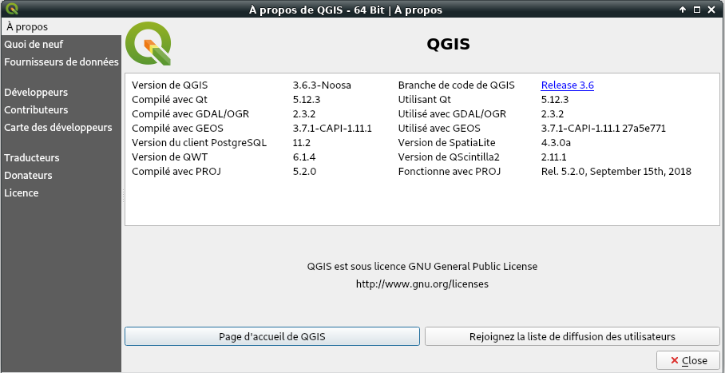
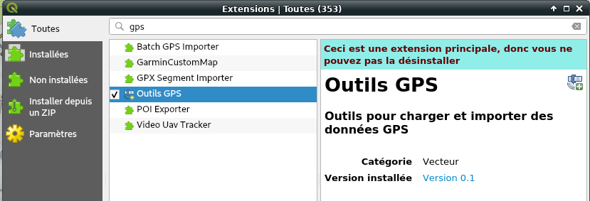

+++
title = 'QGIS sur Archlinux'
date = 2019-07-06 00:00:00 +0100
categories = divers
+++
## QGIS

*QGIS est un logiciel SIG (système d'information géographique) libre multiplate-forme publié sous licence GPL*

### Installation

Archlinux  

    yaourt -S qgis

Au premier démarrage, des erreurs de chrgement des modules 'metaSearch' et 'processing'  
Exécuter les instructions suivantes  

```
yaourt -S python-pyaml
yaourt -S python-owslib
sudo rm -r /usr/lib/python3.7/site-packages/numpy
sudo rm /usr/bin/f2*
yaourt -S python-gdal
yaourt -S python-psycopg2 python-pygments
```

Relancer qgis ,ouvrir **Aide &rarr; A propos**

{:width="600"}

### Documentation

* [Documentation QGIS](https://www.qgis.org/fr/docs/)
* [Charger des données GPS à partir d’un fichier](https://docs.qgis.org/2.8/fr/docs/user_manual/working_with_gps/plugins_gps.html#loading-gps-data-from-a-file)
* [Manuel d’utilisation de QGIS 3.4](https://docs.qgis.org/3.4/fr/docs/user_manual/)

Valider l'extension "Outils GPS"

{:width="600"}

