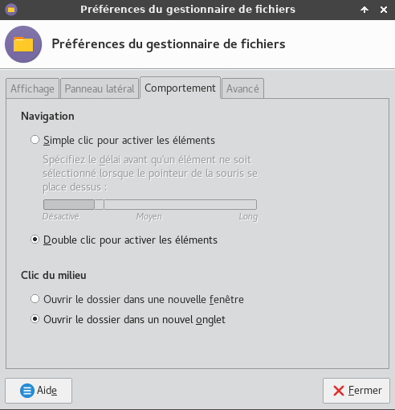
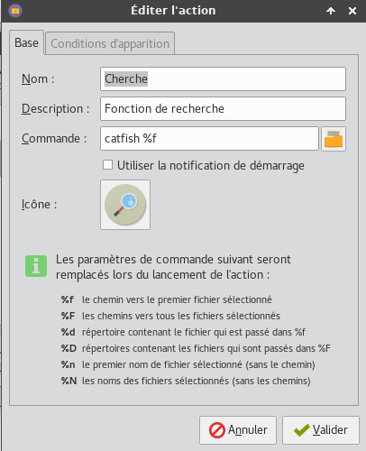
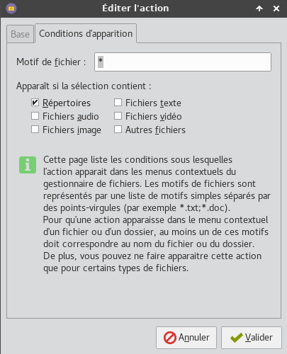
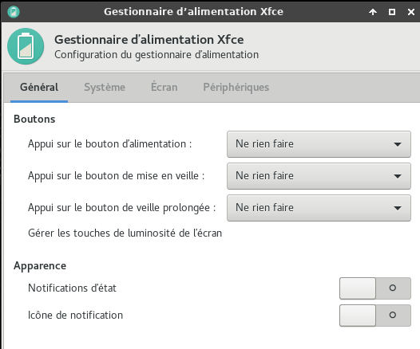
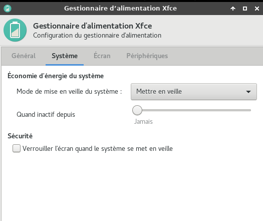
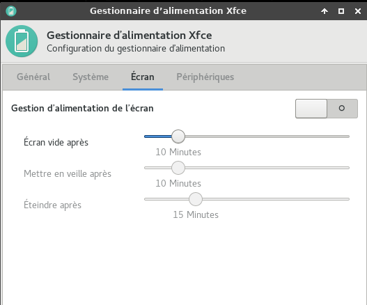

+++
title = 'Archlinux XFCE (ASRock QC5000M Quad-Core APU,GPT partition)'
date = 2019-07-17 00:00:00 +0100
categories = ['archlinux']
+++
## ASRock QC5000M Quad-Core APU

[ASRock QC5000M (pdf)]({{ site.url }}/files/QC5000M.pdf)


* Platform
    * Micro ATX Form Factor
    * Solid Capacitor design
    * High Density Glass Fabric PCB
* CPU
    * AMD FT3 Kabini A4-5050/5000 Quad-Core APU
* Memory
    * 2 x DDR3 DIMM Slots
    * Supports DDR3 1600/1333/1066 non-ECC, un-buffered memory
    * Max. capacity of system memory: 32GB (see CAUTION1)
* Expansion  Slot
    * 1 x PCI Express 2.0 x16 Slot (PCIE2: x4 mode)
    * 2 x PCI Express 2.0 x1 Slot
* Graphics 
    * Integrated AMD RadeonTM HD 8330 Graphics  
    * DirectX 11.1, Pixel Shader 5.0
    * Max. shared memory 2GB
    * Dual graphics output: support D-Sub and HDMI ports by independent display controllers (see CAUTION2)
    * Supports HDMI with max. resolution up to 4K × 2K (4096x2160) @ 24Hz or 4K × 2K (3840x2160) @ 30Hz
    * Supports D-Sub with max. resolution up to 2048x1536 @ 60Hz
    * Supports Auto Lip Sync, Deep Color (12bpc), xvYCC and HBR (High Bit Rate Audio) with HDMI Port (Compliant HDMI monitor is required)
    * Supports HDCP with HDMI Port
    * Supports Full HD 1080p Blu-ray (BD) playback with HDMI Port 
* Audio
    * 7.1 CH HD Audio (Realtek ALC887 Audio Codec)  * To configure 7.1 CH HD Audio, it is required to use an HD front panel audio module and enable the multi-channel audio feature through the audio driver.
    * Supports Surge Protection (ASRock Full Spike Protection)
    * ELNA Audio Caps
* LAN
    * PCIE x1 Gigabit LAN 10/100/1000 Mb/s
    * Rea ltek RTL 8111GR
    * S u p p o r t s   Wa k e - O n -WA N
    * Suppor t s Wa ke- On-L A N
    * Supports Lightning/ESD Protection (ASRock Full Spike Protection)
    * Supports LAN Cable Detection
    * Supports Energy Efficient Ethernet 802.3az
    * Supports PXE
* Rear Panel I/O  
    * 1 x PS/2 Mouse/Keyboard Port
    * 1 x Serial Port: COM1
    * 1 x D-Sub Port
    * 1 x HDMI Port
    * 4 x USB 2.0 Ports (Supports ESD Protection (ASRock Full Spike Protection))
    * 2 x USB 3.0 Ports (Supports ESD Protection (ASRock Full Spike Protection))
    * 1 x RJ-45 LAN Port with LED (ACT/LINK LED and SPEED LED)
    * HD Audio Jacks: Line in / Front Speaker / Microphone
* Storage
    * 2 x SATA3 6.0 Gb/s Connectors, support NCQ, AHCI and Hot Plug
* Connector
    * 1 x TPM Header
    * 1 x CPU Fan Connector (3-pin)
    * 2 x Chassis Fan Connectors (1 x 4-pin, 1 x 3-pin)
    * 1 x 24 pin ATX Power Connector
    * 1 x Front Panel Audio Connector 
    * 2 x USB 2.0 Headers (Support 4 USB 2.0 ports) (Supports ESD Protection (ASRock Full Spike Protection))
* BIOS Feature
    * 32Mb AMI UEFI Legal BIOS with multilingual GUI support
    * Supports “Plug and Play”
    * ACPI 1.1 compliance wake up events
    * SMBIOS 2.3.1 support
    * DRAM Voltage multi-adjustment
* HardwareMonitor  
    * CPU/Chassis temperature sensing
    * CPU/Chassis Fan Tachometer
    * CPU/Chassis Quiet Fan
    * CPU/Chassis Fan multi-speed control
    * Voltage monitoring: +12V, +5V, +3.3V, Vcore
* OS
    * Microsoft® Windows® 10 64-bit / 8.1 32-bit / 8.1 64-bit / 8 32-bit / 8 64-bit / 7 32-bit / 7 64-bit / XP 32-bit / XP 64-bit* 
    * USB 3.0 is not supported by Windows® XP* For the updated Windows® 10 driver, please visit ASRock's    website for details: http://www.asrock.com
* Certifica-tions
    * FCC, CE, WHQL
    * ErP/EuP ready (ErP/EuP ready power supply is required)


## Archlinux

Boot sur clé USB contenant image ISO archlinux (format **aaaa.mm.jj-dual.iso**)  

	loadkeys fr # en est en qwerty , il faut saisir 'loqdkeys'

### Partitionnement du disque


* 2MB, type EF02 (BIOS partition). Utilisé par GRUB2/BIOS-GPT. (/dev/sda1)
* 512MB, type 8300 (Linux). Pour le boot linux /boot (/dev/sda2)
* 4GB, type 8200 (swap). Partition swap (en dehors de lvm). (/dev/sda3)
* Espace restant, type 8E00 (LVM). Pour le root / et /home. (/dev/sda4).

Partitionnement du reste du disque SSD 120G GPT + LVM

    gdisk /dev/sda

On passe en mode expert : x  
On efface tout : z  
On relance gdisk  

    gdisk /dev/sda

```
GPT fdisk (gdisk) version 0.8.6
 
Partition table scan:
  MBR: not present
  BSD: not present
  APM: not present
  GPT: not present
 
Creating new GPT entries.
 
Command (? for help): o
This option deletes all partitions and creates a new protective MBR.
Proceed? (Y/N): y

Command (? for help): n
Partition number (1-128, default 1): 1
First sector (34-31457246, default = 2048) or {+-}size{KMGTP}: 
Last sector (2048-31457246, default = 31457246) or {+-}size{KMGTP}: +2M
Current type is 'Linux filesystem'
Hex code or GUID (L to show codes, Enter = 8300): ef02
Changed type of partition to 'BIOS boot partition'

Command (? for help): n
Partition number (2-128, default 2): 2
First sector (34-31457246, default = 6144) or {+-}size{KMGTP}: 
Last sector (6144-31457246, default = 31457246) or {+-}size{KMGTP}: +512M
Current type is 'Linux filesystem'
Hex code or GUID (L to show codes, Enter = 8300): 8300
Changed type of partition to 'Linux filesystem'

Command (? for help): n
Partition number (3-128, default 3): 3
First sector (34-31457246, default = 210944) or {+-}size{KMGTP}: 
Last sector (210944-31457246, default = 31457246) or {+-}size{KMGTP}: +4G
Current type is 'Linux filesystem'
Hex code or GUID (L to show codes, Enter = 8300): 8200
Changed type of partition to 'Linux swap'

Command (? for help): n
Partition number (4-128, default 4): 
First sector (34-31457246, default = 4405248) or {+-}size{KMGTP}: 
Last sector (4405248-31457246, default = 31457246) or {+-}size{KMGTP}: 
Current type is 'Linux filesystem'
Hex code or GUID (L to show codes, Enter = 8300): 8e00
Changed type of partition to 'Linux LVM'
 
Command (? for help): w

Final checks complete. About to write GPT data. THIS WILL OVERWRITE EXISTING
PARTITIONS!!
 
Do you want to proceed? (Y/N): y
OK; writing new GUID partition table (GPT) to /dev/sda.
The operation has completed successfully.
```

### LVM


```
# Volume Physique (Physical Volume)  
pvcreate /dev/sda4  
# Groupe de Volume (Volume Group)  
vgcreate ssd-vg /dev/sda4  
# Volume Logiques (logical Volume)  
lvcreate -L 20G -n root ssd-vg
lvcreate -L 40G -n home ssd-vg
```

### Système de fichiers

Type de fichier **ext4** pour les autres partitions  

    mkfs.ext4 /dev/ssd-vg/root
    mkfs.ext4 /dev/ssd-vg/home

Type de fichier **boot** et **swap**   

    mkfs.ext2 /dev/sda2
    mkswap /dev/sda3

### Archlinux ,installation de base

Activation swap  

    swapon /dev/sda3

Points de montage  

```bash
mount /dev/ssd-vg/root /mnt  
mkdir /mnt/{boot,home}
mount /dev/sda2 /mnt/boot
mount /dev/ssd-vg/home /mnt/home
```

modifier le fichier **/etc/pacman.d/mirrorlist** pour ne garder qu’un seul miroir (facultatif)  
passer la commande suivante avant la première ligne pacstrap :  

    export LANG=C

installation  

    pacstrap /mnt base base-devel pacman-contrib

NOTE : Il est possible de se connecter en ssh pour la suite de l'installation:  

* Modifier le mot de passe root : `passwd`
* Relever l'adresse IP :`ip addr` 
* Lancer sshd : `systemctl start sshd.socket`
* Depuis le poste distant : `ssh root@adresseIP`


Paquets supplémentaires  

    pacstrap /mnt zip unzip p7zip mc alsa-utils syslog-ng mtools dosfstools lsb-release ntfs-3g exfat-utils bash-completion

générer le fichier **/etc/fstab** qui liste les partitions présentes avec les UUID des partitions  

    genfstab -U -p /mnt >> /mnt/etc/fstab

chargeur de démarrage Grub2/Bios . Le paquet os-prober est indispensable pour un double démarrage.  

    pacstrap /mnt grub os-prober

Pour un ordinateur avec UEFI

    pacstrap /mnt efibootmgr

LVM ATTENTION!!!  
Il faut faire un ajout pour éviter les problèmes liés à LVM

    mkdir /mnt/hostlvm
    mount --bind /run/lvm /mnt/hostlvm

Passage en chroot  

	arch-chroot /mnt

LVM ATTENTION!!!  
pour ne pas bloquer sur la configuration grub

    ln -s /hostlvm /run/lvm

Clavier en mode texte, créer le fichier /etc/vconsole.conf.  

	nano /etc/vconsole.conf

Ajouter  

```
KEYMAP=fr-latin9
FONT=eurlatgr
#KEYMAP=fr
#FONT=lat9w-16
```

localisation française, le fichier /etc/locale.conf doit contenir la bonne valeur pour LANG  

	nano /etc/locale.conf

Ajouter  

```
LANG=fr_FR.UTF-8
LC_COLLATE=C
```

Il faut supprimer le **#** au début de la ligne fr_FR.UTF-8 UTF-8 dans le fichier **/etc/locale.gen**  

	nano /etc/locale.gen

puis exécuter:  

	locale-gen

spécifier la locale pour la session courante  

	export LANG=fr_FR.UTF-8

fuseau horaire de Paris  

	ln -sf /usr/share/zoneinfo/Europe/Paris /etc/localtime

on a une machine en mono-démarrage sur Archlinux, et on peut demander à ce que l’heure appliquée soit UTC  

	hwclock --systohc --utc

modifier le fichier */etc/mkinitcpio.conf*  

	nano /etc/mkinitcpio.conf

ajouter `lvm2` entre `block` et `filesystems` dans les **HOOKS**  
puis exécuter **mkinitcpio** qui est un script shell utilisé pour créer un environnement qui se chargé en premier en mémoire :  

	mkinitcpio -p linux  # linux-lts si vous voulez le noyau lts

nom de la machine /etc/hostname  

	echo "pc2" > /etc/hostname

A-installation grub en mode bios  

	grub-install --no-floppy --recheck /dev/sda

B-installation en mode UEFI

    mount | grep efivars &> /dev/null || mount -t efivarfs efivarfs /sys/firmware/efi/efivars
    grub-install --target=x86_64-efi --efi-directory=/boot/efi --bootloader-id=arch_grub --recheck

générer le fichier de configuration grub  

	grub-mkconfig -o /boot/grub/grub.cfg

>*si vous avez une « hurlante » contenant « /run/lvm/lvmetad.socket: connect failed » ou quelque chose d’approchant, ce n’est pas un bug. C’est une alerte sans conséquence*

mot de passe root   

	passwd root

Réseau networkmanager (pour ensuite installer un environnement graphique xfce,gnome,kde,etc...)  

	pacman -Syy networkmanager
	systemctl enable NetworkManager  

On peut maintenant quitter tout, démonter proprement les partitions et redémarrer.  

```
exit
umount -R /mnt
reboot
# oter la clé USB
```


>On se connecte en root  

### Utilisateur

créer un utilisateur avec la commande suivante  

```bash
useradd -m -g users -c 'arch pc2' -s /bin/bash arch
passwd arch
```

### Openssh

Installation et lancement  

	pacman -S openssh 

Validation  

	systemctl enable sshd.socket

Lancement SSH  

	systemctl start sshd.socket

On peut se connecter d'un autre poste en utilisateur

### sudoers

Modifier sudoers pour accès sudo sans mot de passe à l'utilisateur **arch**  

	su               # mot de passe root
	echo "arch     ALL=(ALL) NOPASSWD: ALL" >> /etc/sudoers

### Xorg

Toutes les commandes en mode su (sudo -s)

Ajouter ntp (synchronisation de l’heure en réseau) et cronie (pour les tâches d’administration à automatiser). 

    pacman -S ntp cronie

>si on veut avoir les logs en clair en cas de problème, il faut modifier avec nano (ou vim) le fichier **/etc/systemd/journald.conf** en remplaçant la ligne  `#ForwardToSyslog=no` par `ForwardToSyslog=yes` 

Lancer `alsamixer` avec la commande du même nom, pour configurer le niveau sonore et `alsactl store` pour la sauvegarde

Pour l’exécution de la ligne suivante, il est demandé de choisir un support pour OpenGL. Pour le moment, on choisit **MesaGL**. La modification correspondant à votre matériel sera faite lors de l’installation de Xorg. Ainsi que la version « libx264 » proposé en premier choix.

    pacman -S gst-plugins-{base,good,bad,ugly} gst-libav # gst-libav prend en charge tout ce qui est x264 et apparenté.

Installation de Xorg. Le paquet xf86-input-evdev est obsolète depuis début janvier 2017, à cause du passage à xorg-server 1.19.

    pacman -S xorg-{server,xinit,apps} xf86-input-libinput xdg-user-dirs

Pilote carte graphique AMD Radeon TM HD 8330 Graphics

    pacman -S xf86-video-amdgpu

Installation des polices.  

    pacman -S ttf-{bitstream-vera,liberation,freefont,dejavu} freetype2

### Outils et applications

On commence par tout ce qui est graphique : gimp, cups (gestion de l’imprimante) et hplip (si vous avez une imprimante scanner Hewlett Packard). Le paquet python-pyqt5 est indispensable pour l’interface graphique de HPLIP. Webkigtk2 étant indispensable pour la lecture de l’aide en ligne de Gimp. outil rsync et firefox fr:  

	pacman -S cups gimp gimp-help-fr hplip python-pyqt5 rsync firefox-i18n-fr git

Yaourt :

il permet de modifier avant installation le PKGBUILD et install  
Prérequis : base-devel et git  

```
git clone https://aur.archlinux.org/package-query.git
cd package-query
makepkg -si
cd ..
git clone https://aur.archlinux.org/yaourt.git
cd yaourt
makepkg -si
cd ..
sudo rm -r package-query yaourt
```

installer Trizen (écrit en perl) ou Yay (écrit en go) pour compléter Pacman et compléter yaourt  
Trizen :

```bash
git clone https://aur.archlinux.org/trizen
cd trizen
makepkg -sri
sudo rm -r trizen```

Yay : 

```bash
git clone https://aur.archlinux.org/yay
cd yay
makepkg -sri
cd ..
sudo rm -r yay
```

Retext , éditeur markdown (facultatif)  

	sudo pacman -S retext


La série des paquets foomatic permet d’avoir le maximum de pilotes pour l’imprimante. Pour être tranquille avec son imprimante (facultatif)

    pacman -S foomatic-{db,db-ppds,db-gutenprint-ppds,db-nonfree,db-nonfree-ppds} gutenprint

LibreOffice (facultatif)  

	sudo pacman -S libreoffice-fresh-fr


### NTP synchroniser avec un serveur de référence

Il est souvent bien utile d'être à l'heure, NTP permet de synchroniser son horloge avec une référence. Il existe principalement deux implémentations du protocole.

Avant synchronisation  

	timedatectl

```
               Local time: mer. 2019-03-13 17:18:05 CET
           Universal time: mer. 2019-03-13 16:18:05 UTC
                 RTC time: mer. 2019-03-13 16:18:04
                Time zone: Europe/Paris (CET, +0100)
System clock synchronized: no
              NTP service: inactive
          RTC in local TZ: no
```

Installer NTP

    sudo pacman -S ntp

Editer du fichier de configuration /etc/ntp.conf :  

	sudo nano /etc/ntp.conf    # /etc/systemd/timesyncd.conf

Vous pouvez trouver le groupe de serveurs de temps adapté à votre zone géographique sur pool.ntp.org et les rajouter dans /etc/ntp.conf.   

```
# France
server 0.fr.pool.ntp.org iburst
server 1.fr.pool.ntp.org iburst
server 2.fr.pool.ntp.org iburst
server 3.fr.pool.ntp.org iburst
```

Utilisation

    sudo ntpd -q

Lancer et activer la synchronisation : 

    sudo systemctl start ntpd.service
    sudo systemctl enable ntpd.service

Après synchronisation  

    timedatectl

```
               Local time: mer. 2019-03-13 17:21:03 CET
           Universal time: mer. 2019-03-13 16:21:03 UTC
                 RTC time: mer. 2019-03-13 16:21:06
                Time zone: Europe/Paris (CET, +0100)
System clock synchronized: no
              NTP service: inactive
          RTC in local TZ: no
```

## XFCE

### Installer xfce

Gérer des périphériques utilisant MTP (tablettes sous android par exemple), il vous faut rajouter les deux paquets gvfs-mtp et mtpfs (facultatif).

    sudo pacman -S gvfs-{afc,goa,google,gphoto2,mtp,nfs,smb}

Installer Xfce avec vlc (vidéo),lightdm  

	sudo pacman -S xfce4 xfce4-goodies gvfs vlc quodlibet python2-pyinotify lightdm-gtk-greeter xarchiver claws-mail galculator evince ffmpegthumbnailer xscreensaver pavucontrol pulseaudio pulseaudio-alsa pulseaudio-bluetooth system-config-printer

*VLC et Quodlibet ? Pour la vidéo et l’audio. Pour les périphériques amovibles, gvfs est obligatoire. Claws-mail ou Mozilla Thunderbird (avec le paquet thunderbird-i18n-fr) pour le courrier. Lightdm étant pris, car plus rapide à installer. Le paquet python2-pyinotify est nécessaire pour activer le greffon de mise à jour automatique de la musicothèque sous Quodlibet.Evince ? Pour les fichiers en pdf. On peut aussi remplacer xarchiver par fileroller. Quant à ffmpegthumbnailer, c’est utile si vous désirez avoir un aperçu des vidéos stockées sur votre ordinateur. Enfin, xscreensaver sert au verrouillage de l’écran.*

Pour avoir le bon agencement clavier dès la saisie du premier caractère du mot de passe, il faut entrer la commande suivant avant de lancer pour la première fois lightdm :  

	sudo localectl set-x11-keymap fr

Installation  **lightdm** et du gestionnaire graphique  

    sudo pacman -S lightdm-gtk-greeter-settings  

Pour lancer Xfce, il faut entrer dans un premier temps :  

	sudo systemctl start lightdm

Et si tout se passe bien, on peut valider :  

	sudo systemctl enable lightdm


### applications supplémentaires, icônes et tableau de bord

**Menulibre** pour la gestion des menus , **network-manager-applet** pour la gestion des connexions réseau ,**keepassx** pour la gestion des mots de passe , **cheese** pour la vidéo    

	sudo pacman -S gedit keepassxc terminator filezilla nmap minicom iw network-manager-applet cheese zenity

Icônes "faenza"  

    sudo pacman -S faenza-icon-theme

### Personnaliser XFCE

Image **yannick-green.png** dans **/usr/share/pixmaps/** et fond d'écran dans **/usr/share/backgrounds/xfce/**  
Modification du **tableau de bord** , clic-droit --> Tableau de bord --> Préférences de tableau de bord  
Tableau de bord 1  

  * Ajouter des éléments --> Menu whisker (icône **yannick-green.png**)  ,Mise à jour météo  (supprimer "Menu des applications") 
  * Taille d'une ligne (pixels) **25**  
  * Boutons d'action idem dans apparence , actions `Déconnexion`  

**<u>Eléments tableau de bord 1</u>**

  * Changeur d'espace de travail --> paramètres des espaces... : 2
  * Affichage date et heure, **format personnalisé** dans **Horloge** : %e %b %Y %R  
  * Copie d'écran , installation `sudo pacman -S xfce4-screenshooter` puis ajouter **Captures d'écran** 

Après validation tableau de bord, clic droit sur icône capture écran puis  Propriétés -> Zone à capturer : Sélectionner une zone

{:width="300px"}

**<u>Supprimer Tableau de bord 2</u>**  


Paramètres --> Apparence  

  * Style    : Xfce-flat  
  * Icônes   : Numix Circle
  * Polices  : Cantarell Regular 10

Menu Paramètres --> Gestionnaire de fenêtres -> Style : **xfce**   
Menu Paramètres --> Bureau  

  * Icônes : Tout décocher, sauf "Périphériques amovibles", dans **Icônes par défaut**  


Gestionnaire de fichier **Thunar**

  * Edition --> Préférence ,ongle **Comportement** *Ouvrir le dossier dans un nouvel onglet*

{:width="300px"}

Fonction recherche ,installer les logiciels

    sudo pacman -S catfish mlocate

  * Edition --> Configurer les actions personnalisées ,ajouter (+)

{:width="300px"}{:width="300px"}

**<u>Ajoutez la recherche d'historique de la ligne de commande au terminal</u>.**  
Tapez un début de commande précédent, puis utilisez shift + up (flèche haut) pour rechercher l'historique filtré avec le début de la commande.  

```
# Global, all users
echo '"\e[1;2A": history-search-backward' | sudo tee -a /etc/inputrc
echo '"\e[1;2B": history-search-forward' | sudo tee -a /etc/inputrc
```

Menu --> Applications favorites --> Utilitaires : Emulateur de Terminal **/usr/bin/terminator "%s"**

Menu --> Gestionnaire d'alimentation

{:width="300px"} {:width="300px"}

{:width="300px"}

### Ecran connexion (lightDM)

Ecran et logo pour **lightdm**  de la page de connexion    
Accès aux paramètres lightDM en mode graphique (mot de passe root)

* Menu --> Paramètres --> LightDM GTK+ Paramètres d'Apparence

{:width="300px"}

### Veille écran

Installer par défaut sur archlinux (xscreensaver)   

Création d'un script pour **Activer/Désactiver** le programme de mise en veille **xscreensaver**  
Prérequis : **xscreensaver** et **zenity**  
Le script **~/.veille.sh**  

```bash
#!/bin/bash
# .veille.sh


# Détecter si xscreensaver est actif
if [ "$(pidof -s xscreensaver)" ]; then
    arret=false
    zenity --question --title "veille" --ok-label="Oui" --cancel-label="Non" --text "Economiseur Ecran ACTIF\n\n DESACTIVER ?"
    if [ $? = 0 ]
    then
            echo "ARRET daemon xscreensaver ..."
            xscreensaver-command -exit
            sleep 3
    fi
else
    arret=true
    zenity --question --title "veille" --ok-label="Oui" --cancel-label="Non" --text "Economiseur Ecran NON ACTIF\n\n ACTIVER ?"
    if [ $? = 0 ]
    then
            echo "DEPART daemon xscreensaver ..."
            xscreensaver -nosplash &
            sleep 3
    fi
fi
```

Création lanceur XFCE en utilisant **Editeur de menus** ou manuellement :  

```bash
mkdir -p ~/.local/share/applications/  #création dossier **applications** si inexistant
nano ~/.local/share/applications/menulibre-veille-ecran.desktop
```

Contenu :

```ini
[Desktop Entry]
Version=1.0
Type=Application
Name=Activer/Désactiver veille écran
Icon=/usr/share/icons/gnome/48x48/apps/xscreensaver.png
Exec=sh /home/arch/.veille.sh
Path=/home/arch
NoDisplay=false
Categories=Utility;X-XFCE;X-Xfce-Toplevel;
StartupNotify=false
Terminal=false
```

### Client Nextcloud

Installation client owncloud et dépendances

	yaourt -S nextcloud-client gnome-keyring libgnome-keyring

Trousseau de clé avec mot de passe idem connexion utilisateur

Les dossiers synchronisés <https://xeuyakzas.xyz/owncloud> **.keepassx --> ~/.keepassx**   
Paramétrage

* menu –> Lancer “Owncloud…”
* Adresse du serveur : <https://yanspm.com/nextcloud>
* Nom d’utilisateur : yanspm
* Mot de passe : xxxxx
* Sauter les dossiers à synchroniser
* Trousseau de clés = mot de passe connexion utilisateur

Sélectionner l’icône yanspm puis Ajouter une synchronisation de dossier

* Créer les dossiers locaux `mkdir /home/arch/{.keepassx,.ssh}`
* Dossier local /home/arch/.keepassx (valider par clic droit , option “Afficher les fichiers cachés”)
* Répertoire distant : .keepassx
* Cliquer sur Ajouter une synchronisation


Les dossiers synchronisés <https://yanspm.com/nextcloud> **scripts --> ~/scripts** (créer dossier `mkdir ~/scripts`)  

### Gestionnaire mot de passe (keepassxc)


Télécharger la clé **yannick.key** dans **~/.ssh**  
Lancer "KeepassX 2"  --> Outils --> Paramètres  
Décocher *Ouvrir les bases de données précédentes au démarrage* --> OK  
Base de données --> Ouvrir une base de données (afficher les fichiers cachés) : **~/.keepassx/yannick.kdbx** --> Ouvrir  
Cocher "Fichier clé" --> Naviguer : **~/.ssh/yannick.key** --> Ouvrir  
Saisir le mot de passe de la base de données et clic sur OK  

### Impression

Si l’imprimante est connectée directement à votre système ou si vous avez accès à une imprimante réseau IPP alors installez un serveur CUPS local.
Démarrer CUPS ,le serveur peut-être démarré de la même façon que tout autre service avec systemd.
Pour la session en cours:

	sudo systemctl start org.cups.cupsd.service

automatiquement à chaque démarrage:

	sudo systemctl enable org.cups.cupsd.service

Imprimante réseau HP , lancer "HP DeviceManager"

>Imprimantes NON visibles dans le navigateur : `yaourt -S gtk3-print-backends` (par défaut dans les récents archlinux)  

### Journalctl

Ajout utilisateur courant au groupe systemd-journal et adm

	sudo gpasswd -a $USER systemd-journal
	sudo gpasswd -a $USER adm

Lignes non tronquées ,ajouter au fichier **~/.bashrc**  

    echo "export SYSTEMD_LESS=FRXMK journalctl" >> /home/$USER/.bashrc

Prise en compte après déconnexion/reconnexion

### Répertoire chiffré (ecryptfs)

Chiffrement ecryptfs, chercher l'expression "chiffrement ecryptfs" dans le champ recherche du site

Installation  

    yaourt -S ecryptfs-utils

Une fois ces paquets installés, vous devez charger le module ecryptfs (archlinux/manjaro)  

    sudo modprobe ecryptfs

Configuration  

    ecryptfs-setup-private

```
Enter your login passphrase [arch]:         # mot de passe de connexion utilisateur
Enter your mount passphrase [leave blank to generate one]:   # ne rien saisir , faire entrée
```

Dans le cas d’une génération automatique de la passphrase de montage , il faut la déchiffrer pour pouvoir la sauvegarder  

    ecryptfs-unwrap-passphrase ~/.ecryptfs/wrapped-passphrase

Passphrase: "Mot de passe de connexion utilisateur"  
XXXXXXXXXXXXXXXXXXXXXXXXXXXXXXXXXXXXXXXX  
*Enregistrez votre phrase secrète dans un lieu sûr, elle sera requise pour récupérer vos données ultérieurement.*

Montage Auto (PAM)  
Modifier le fichier **/etc/pam.d/system-auth**  

```
#%PAM-1.0

auth      required  pam_unix.so     try_first_pass nullok
auth      required  pam_ecryptfs.so unwrap
auth      optional  pam_permit.so
auth      required  pam_env.so

account   required  pam_unix.so
account   optional  pam_permit.so
account   required  pam_time.so

password  optional  pam_ecryptfs.so
password  required  pam_unix.so     try_first_pass nullok sha512 shadow
password  optional  pam_permit.so

session   required  pam_limits.so
session   required  pam_unix.so
session   optional  pam_ecryptfs.so
session   optional  pam_permit.so
```

Sauvegarde , déconnexion ,reconnexion et vérifier la sortie du mount  

```
/home/arch/.Private on /home/arch/Private type ecryptfs...
```

### VirtualBox


Installation 

    sudo pacman -S virtualbox 
  
Sélectionner **2** : **virtualbox-host-modules-arch**   
Après installation, entrez la commande suivante pour ajouter le module Virtualbox au noyau :  

    sudo modprobe vboxdrv
  
ajouter le compte utilisateur personnel au groupe d'utilisateurs vbox :  

    sudo gpasswd -a $USER vboxusers
  
Création d'un dossier Partage  

    mkdir ~/Partage
  
**Impératif, vous devez maintenant redémarrer votre système pour que les modifications prennent effet.**  

### Paramétrage Firefox

Si **ecryptfs** est installé , il faut lier le dossier *.mozilla* à Private

```
# en mode utilisateur
cd $HOME
mv .mozilla $HOME/Private/
ln -s $HOME/Private/.mozilla .mozilla
```

Il faut installer "Adobe Flash Plugin"

	yaourt -S flashplugin

Préférences:  

  * Au démarrage de firefox : **Afficher une page vide**  
  * Moteur de recherche par défaut : **DuckDuckGo**  
  * Vie privée : **ne jamais conserver l'historique** (firefox doit redémarré)  

Modules --> Extensions:  

  * **Ublock Origin**

Ajout de moteur de recherche:

**Qwant** : rechercher dans “Modules” de firefox ,l'expression `qwant fr`. 
Sélectionner `Qwant pour firefox` , cliquer sur le bouton **Install** et il sera dans la liste des moteurs de recherche du navigateur.

**Ixquick** : Aller sur le lien <https://www.ixquick.fr/fra> et cliquer sur le bouton **Ajouter à Firefox** et il sera dans la liste des moteurs de recherche du navigateur.

Moteur de recherche à supprimer : Préférences --> Recherche --> Moteur de recherche  
Décocher Yahoo ,Bing ,Portail Lexical

### OpenVPN

Il faut installer les modules  

	yaourt -S openvpn networkmanager-openvpn

Pour ajouter une connexion VPN à partir d'un fichier** .ovpn **  
Clic droit sur la connexion réseau dans la barre des tâches -> Modification des connexions -> Add -> Importer une configuration VPN enregistrée  

### Tor-Browser

Installer tor-browser

	yaourt -S tor-browser-fr

En cas d'erreur installation  

```
==> Vérification des signatures des fichiers sources grâce à gpg...
    SHA512SUMS-57.0b9 ... ÉCHEC (Clé publique inconnue BBBEBDBB24C6F355)
==> ERREUR : Une ou plusieurs signatures PGP n’ont pas pu être vérifiées.
```

<u>Solution 1 (à privilégier)</u>-Il faut rechercher et ajouter la clé publique manquante  
Il faut utiliser les 8 derniers caractères de la clé publique inconnue.

	gpg --keyserver pgp.mit.edu --recv-keys 24C6F355

<u>Solution 2</u>-Pour rendre l'installation possible de **tor-browser** modifier ou créer  

	nano ~/.gnupg/gpg.conf

Ajouter  

	keyserver-options auto-key-retrieve


Lancer l'icône **Tor-Browser (fr)**


### Actualisation grub

Ajout image de fond  

    sudo nano /etc/default/grub

Modifier la ligne "GRUB_BACKGROUND"   

    GRUB_BACKGROUND="/usr/share/backgrounds/xfce/archlinux-blue-231452.jpg"

Générer le fichier de configuration  

    grub-mkconfig -o /boot/grub/grub.cfg

```
Création du fichier de configuration GRUB…
Arrière-plan trouvé : /usr/share/backgrounds/xfce/archlinux-blue-231452.jpg
Image Linux trouvée : /boot/vmlinuz-linux
Image mémoire initiale trouvée : /boot/initramfs-linux.img
Found fallback initrd image(s) in /boot: initramfs-linux-fallback.img
fait
```

## Compléments

### Applications supplémentaires

    yaourt -S tmux youtube-dl calibre bluefish android-tools wget bind-tools

sshfs ,FUSE client based on the SSH File Transfer Protocol

    sudo pacman -S sshfs

### Adb appareil android

Lancer le serveur adb

    sudo adb start-server

Connecter l'appareil android sur l'ordinateur via le cordon USB  
Un message apparaît sur l'appareil android  

```
Autoriser le débogage USB ?
Cocher Toujours autoriser sur cet ordinateur puis OK
```

Vérifier si l'appareil est vu

	adb devices

```
List of devices attached
d55de0a3	device
```

Appareil connecté avec toutes les autorisations

