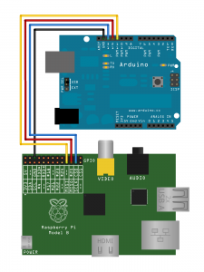
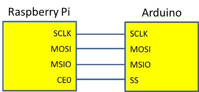
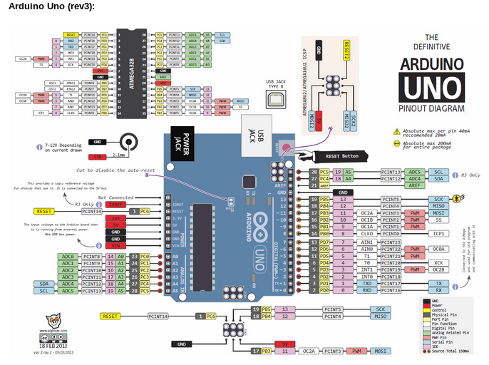
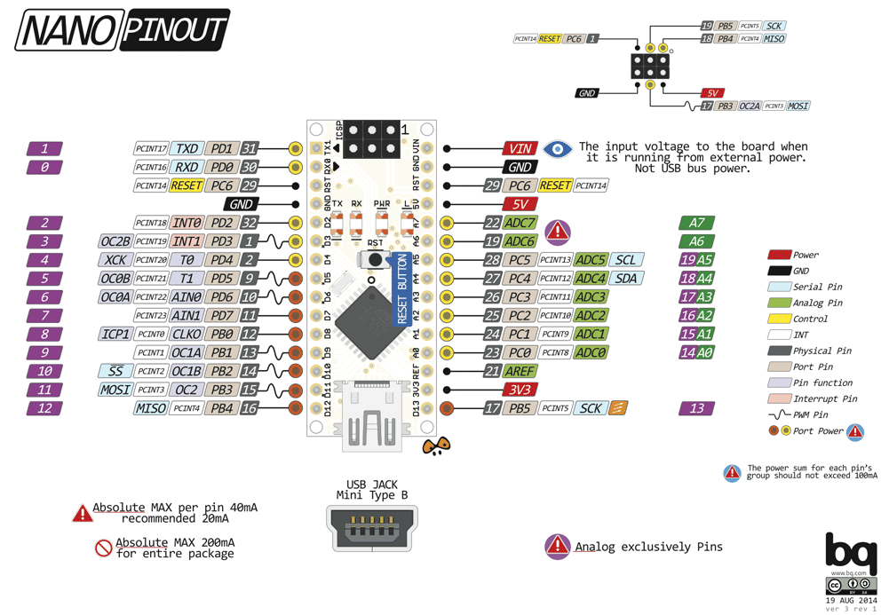
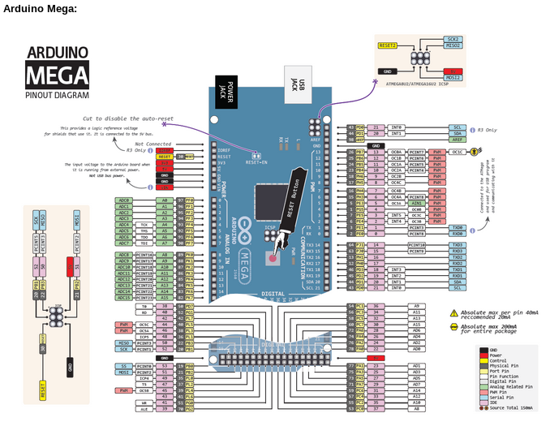
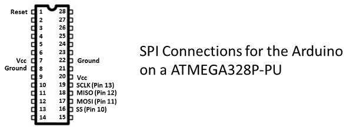
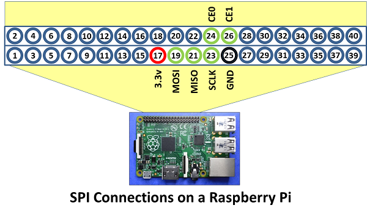
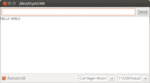

+++
title = 'Raspberry Pi + Arduino + SPI'
date = 2019-07-30 00:00:00 +0100
categories = ['raspberry', 'arduino']
+++
## SPI - comunication entre Rasberry et Arduino

* [Raspberry Pi to Arduino SPI Communication](http://robotics.hobbizine.com/raspiduino.html)
* [Raspberry Pi + Arduino + SPI](http://mitchtech.net/raspberry-pi-arduino-spi/)

### Exigences

* 1 Raspberry Pi avec la dernière version de Raspbian
* 1 Arduino

Raspberry Pi avec la dernière version de Raspbian . Pour vous assurer que votre système est à jour, veuillez télécharger et exécuter rpi-update .

### Câblage

  
{:width="200"}  
Config. Broches SPI d’Arduino Uno, Arduino Nano et Arduino Mega  

_ |	MOSI | 	MISO |	SCK | SS
--- | --- | --- | --- | ---
Arduino Uno 	|11 |	12 |	13 | 10
Arduino Nano |	11 |	12 |	13 | 10
Arduino Mega |	51 |	50 |	52 | 53

{:width="600"}   
{:width="600"}   
{:width="600"}   
{:width="600"}   

  

  


### Arduino

Le choix d’un Arduino fonctionnant à 3,3 v simplifiera vos projets Raspberry Pi Arduino en permettant une connexion directe entre les broches d’entrée et de sortie des deux appareils sans nécessiter de décalage de niveau pour aligner les tensions et protéger les entrées Raspi.

Ouvrez votre ide Arduino et flasher le code ci-dessous sur votre Arduino.  
*Code Arduino **arduino_spi_slave.pde***

```c
// Written by Nick Gammon
// February 2011
/**
 * Send arbitrary number of bits at whatever clock rate (tested at 500 KHZ and 500 HZ).
 * This script will capture the SPI bytes, when a '\n' is recieved it will then output
 * the captured byte stream via the serial.
 */

#include <SPI.h>

char buf [100];
volatile byte pos;
volatile boolean process_it;

void setup (void)
{
  Serial.begin (115200);   // debugging

  // have to send on master in, *slave out*
  pinMode(MISO, OUTPUT);
  
  // turn on SPI in slave mode
  SPCR |= _BV(SPE);
  
  // get ready for an interrupt 
  pos = 0;   // buffer empty
  process_it = false;

  // now turn on interrupts
  SPI.attachInterrupt();

}  // end of setup


// SPI interrupt routine
ISR (SPI_STC_vect)
{
byte c = SPDR;  // grab byte from SPI Data Register
  
  // add to buffer if room
  if (pos < sizeof buf)
    {
    buf [pos++] = c;
    
    // example: newline means time to process buffer
    if (c == '\n')
      process_it = true;
      
    }  // end of room available
}  // end of interrupt routine SPI_STC_vect

// main loop - wait for flag set in interrupt routine
void loop (void)
{
  if (process_it)
    {
    buf [pos] = 0;  
    Serial.println (buf);
    pos = 0;
    process_it = false;
    }  // end of flag set
    
}  // end of loop
```

### Raspberry Pi

**Activation de SPI sur le Raspberry Pi**  
SPI sur le Pi est désactivé par défaut. Avant de pouvoir utiliser SPI dans vos programmes, il doit être activé. Le moyen le plus simple consiste à utiliser l'utilitaire raspi-config que vous pouvez lancer en entrant:

    sudo raspi-config

Dans les écrans résultants, sélectionnez Options avancées, puis sélectionnez SPI. Vous devez répondre oui aux deux questions pour activer l'interface SPI et charger le module de noyau SPI par défaut.

Redémarrez le Pi pour charger le module de noyau SPI. Vous pouvez vérifier que la modification est effective en entrant lsmod sur la ligne de commande pour générer une liste des modules chargés. Le module spi spi_bcm2708 doit apparaître dans les résultats.

Le Pi a un fichier "liste noire" qui bloque le chargement des modules: **/etc/modprobe.d/raspi-blacklist.conf** . La ligne `#blacklist spi-bcm2708` doit commencer par le symbole dièse "#" qui "met en commentaire" la ligne. Sans le hachage, SPI est sur la liste noire et ne se charge pas.

Les paramètres de l’arborescence de périphériques dans le fichier **/boot/config.txt**  
Recherchez une ligne dans le fichier qui se lit comme suit: `dtparam=spi= on` .  
Si la ligne indique que spi est désactivé ou si elle est totalement absente, éditez le fichier en conséquence. Il suffit de faire de la ligne la dernière ligne du fichier.

>N'oubliez pas que vous devrez redémarrer le Pi pour que les modifications apportées au module du noyau prennent effet. 

Avec votre système rasbian mis à jour.Il faut charger les pilotes.

    modprobe spi_bcm2708
    modprobe spidev 

Vérifier que les modules chargés:

```
    lsmod
    Taille du module utilisée par
    spidev 5944 0
    spi_bcm2708 5350 0
    snd_bcm2835 21681 0
    snd_pcm 81170 1 snd_bcm2835
    snd_seq 59528 0
    snd_timer 21602 2 snd_seq, snd_pcm
    snd_seq_device 6924 1 snd_seq
    snd 57427 5 snd_seq_device, snd_timer, snd_seq, snd_pcm, snd_bcm2835
    snd_page_alloc 5343 1 snd_pcm
    i2c_bcm2708 3822 0 
```

#### Code Raspberry Pi

Enregistrez le code ci-dessous sous le nom **spidev_test.c** sur votre Raspberry Pi et compilez-le. 

```c
/*
 * SPI testing utility (using spidev driver)
 *
 * Copyright (c) 2007  MontaVista Software, Inc.
 * Copyright (c) 2007  Anton Vorontsov <avorontsov@ru.mvista.com>
 *
 * This program is free software; you can redistribute it and/or modify
 * it under the terms of the GNU General Public License as published by
 * the Free Software Foundation; either version 2 of the License.
 *
 * Cross-compile with cross-gcc -I/path/to/cross-kernel/include
 */

#include <stdint.h>
#include <unistd.h>
#include <stdio.h>
#include <stdlib.h>
#include <getopt.h>
#include <fcntl.h>
#include <sys/ioctl.h>
#include <linux/types.h>
#include <linux/spi/spidev.h>

#define ARRAY_SIZE(a) (sizeof(a) / sizeof((a)[0]))

static void pabort(const char *s)
{
	perror(s);
	abort();
}

static const char *device = "/dev/spidev0.0";
static uint8_t mode;
static uint8_t bits = 8;
static uint32_t speed = 500000;
static uint16_t delay;

static void transfer(int fd)
{
	int ret;
	uint8_t tx[] = {
        0x48, 0x45, 0x4C, 0x4C, 0x4F,
        0x20, 
        0x57, 0x4F, 0x52, 0x4C, 0x44,
        0x0A 
	};
	uint8_t rx[ARRAY_SIZE(tx)] = {0, };
	struct spi_ioc_transfer tr = {
		.tx_buf = (unsigned long)tx,
		.rx_buf = (unsigned long)rx,
		.len = ARRAY_SIZE(tx),
		.delay_usecs = delay,
		.speed_hz = speed,
		.bits_per_word = bits,
	};

	ret = ioctl(fd, SPI_IOC_MESSAGE(1), &tr);
	if (ret < 1)
		pabort("can't send spi message");

    /*
	for (ret = 0; ret < ARRAY_SIZE(tx); ret++) {
		if (!(ret % 6))
			puts("");
		printf("%.2X ", rx[ret]);
	}
	puts("");
    */
}

static void print_usage(const char *prog)
{
	printf("Usage: %s [-DsbdlHOLC3]\n", prog);
	puts("  -D --device   device to use (default /dev/spidev1.1)\n"
	     "  -s --speed    max speed (Hz)\n"
	     "  -d --delay    delay (usec)\n"
	     "  -b --bpw      bits per word \n"
	     "  -l --loop     loopback\n"
	     "  -H --cpha     clock phase\n"
	     "  -O --cpol     clock polarity\n"
	     "  -L --lsb      least significant bit first\n"
	     "  -C --cs-high  chip select active high\n"
	     "  -3 --3wire    SI/SO signals shared\n");
	exit(1);
}

static void parse_opts(int argc, char *argv[])
{
	while (1) {
		static const struct option lopts[] = {
			{ "device",  1, 0, 'D' },
			{ "speed",   1, 0, 's' },
			{ "delay",   1, 0, 'd' },
			{ "bpw",     1, 0, 'b' },
			{ "loop",    0, 0, 'l' },
			{ "cpha",    0, 0, 'H' },
			{ "cpol",    0, 0, 'O' },
			{ "lsb",     0, 0, 'L' },
			{ "cs-high", 0, 0, 'C' },
			{ "3wire",   0, 0, '3' },
			{ "no-cs",   0, 0, 'N' },
			{ "ready",   0, 0, 'R' },
			{ NULL, 0, 0, 0 },
		};
		int c;

		c = getopt_long(argc, argv, "D:s:d:b:lHOLC3NR", lopts, NULL);

		if (c == -1)
			break;

		switch (c) {
		case 'D':
			device = optarg;
			break;
		case 's':
			speed = atoi(optarg);
			break;
		case 'd':
			delay = atoi(optarg);
			break;
		case 'b':
			bits = atoi(optarg);
			break;
		case 'l':
			mode |= SPI_LOOP;
			break;
		case 'H':
			mode |= SPI_CPHA;
			break;
		case 'O':
			mode |= SPI_CPOL;
			break;
		case 'L':
			mode |= SPI_LSB_FIRST;
			break;
		case 'C':
			mode |= SPI_CS_HIGH;
			break;
		case '3':
			mode |= SPI_3WIRE;
			break;
		case 'N':
			mode |= SPI_NO_CS;
			break;
		case 'R':
			mode |= SPI_READY;
			break;
		default:
			print_usage(argv[0]);
			break;
		}
	}
}

int main(int argc, char *argv[])
{
	int ret = 0;
	int fd;

	parse_opts(argc, argv);

	fd = open(device, O_RDWR);
	if (fd < 0)
		pabort("can't open device");

	/*
	 * spi mode
	 */
	ret = ioctl(fd, SPI_IOC_WR_MODE, &mode);
	if (ret == -1)
		pabort("can't set spi mode");

	ret = ioctl(fd, SPI_IOC_RD_MODE, &mode);
	if (ret == -1)
		pabort("can't get spi mode");

	/*
	 * bits per word
	 */
	ret = ioctl(fd, SPI_IOC_WR_BITS_PER_WORD, &bits);
	if (ret == -1)
		pabort("can't set bits per word");

	ret = ioctl(fd, SPI_IOC_RD_BITS_PER_WORD, &bits);
	if (ret == -1)
		pabort("can't get bits per word");

	/*
	 * max speed hz
	 */
	ret = ioctl(fd, SPI_IOC_WR_MAX_SPEED_HZ, &speed);
	if (ret == -1)
		pabort("can't set max speed hz");

	ret = ioctl(fd, SPI_IOC_RD_MAX_SPEED_HZ, &speed);
	if (ret == -1)
		pabort("can't get max speed hz");

	printf("spi mode: %d\n", mode);
	printf("bits per word: %d\n", bits);
	printf("max speed: %d Hz (%d KHz)\n", speed, speed/1000);

	transfer(fd);

	close(fd);

	return ret;
}
```

**Compilation**

    gcc spidev_test.c -o spidev_test

### Fonctionnement

1. Branchez votre Arduino sur votre bureau via le câble série. 
2. Ouvrez le moniteur série arduino et réglez le débit sur 115200. 
3. sur le Raspberry Pi, exécutez le code compilé.  
`sudo ./spidev_test `  

Vous devriez voir HELLO WORLD s'imprimer dans le moniteur série Arduino IDE.  


### Débogage

Assurez-vous que votre noyau dispose des pilotes requis (spi-bcm2708.ko et spidev.ko). 

    ls -al /lib/modules/`uname -r`/kernel/drivers/spi/

```bash
total 64
drwxrwxr-x 2 pi pi 4096 Aug 10 10:53 .
drwxrwxr-x 23 pi pi 4096 Aug 10 10:53 ..
-rw-rw-r– 1 pi pi 14428 Aug 10 10:53 spi-bcm2708.ko
-rw-rw-r– 1 pi pi 10852 Aug 10 10:53 spi-bitbang.ko
-rw-rw-r– 1 pi pi 15803 Aug 10 10:53 spidev.ko
-rw-rw-r– 1 pi pi 10693 Aug 10 10:53 spi-gpio.ko
```


