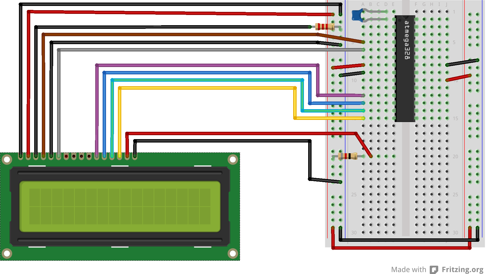
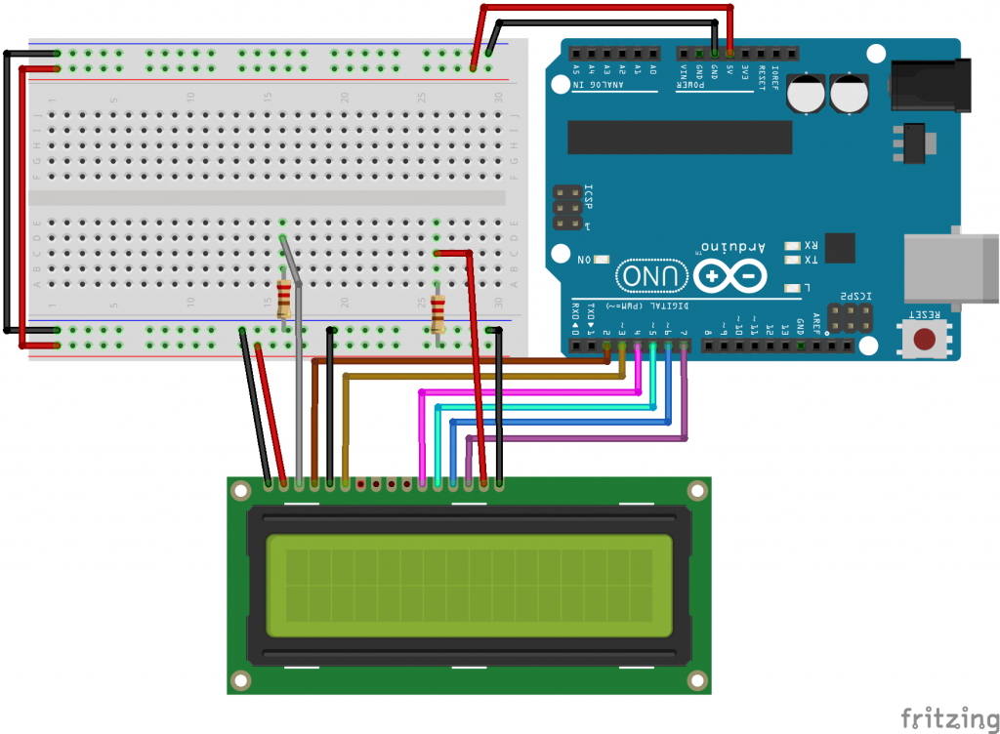
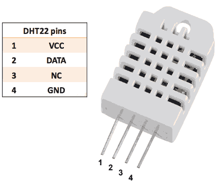
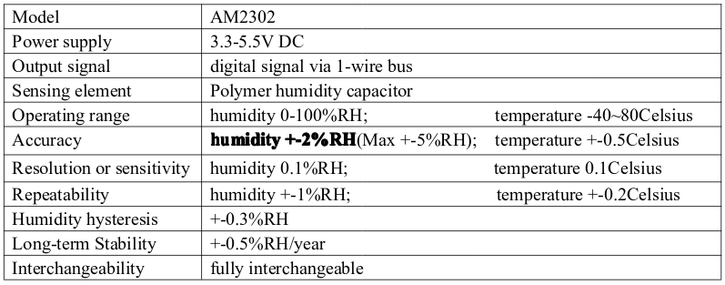
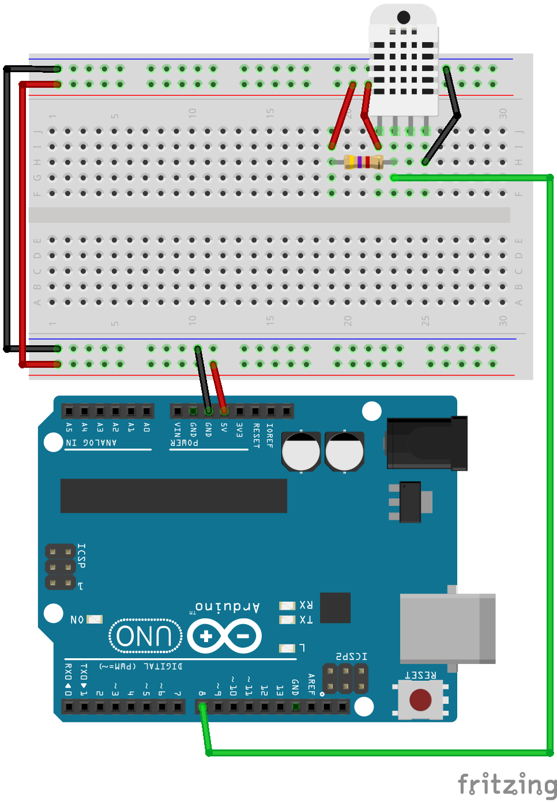
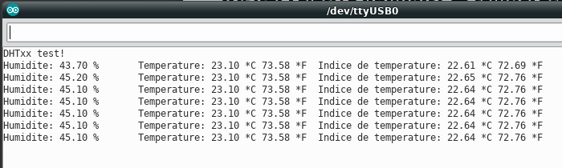
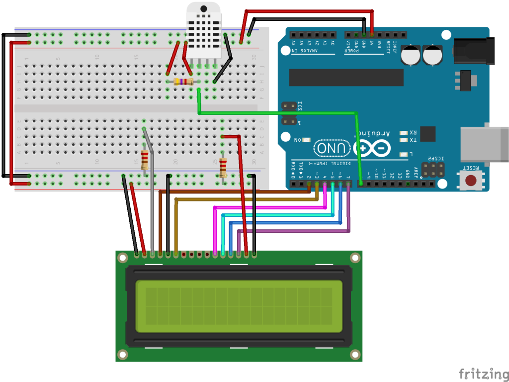

+++
title = 'Arduino Ecran LCD'
date = 2019-07-31 00:00:00 +0100
categories = ['arduino']
+++
## Arduino + Ecran LCD

### Schéma pour le câblage vers un ATmega328p directement

Dans mon cas,  j’ai utilisé les broches D2,D3,D5,D6,D7 et D8 (ce qui sera visible dans le code à la déclaration du LCD : “LiquidCrystal lcd(2, 3, 5, 6, 7, 8);”). Celà donne le schéma de câblage suivant :

{:width="600"}

Câblage LCD vers ATmega328p (broches 2,3,5,6,7,8)

### Schéma pour le câblage vers un Arduino UNO R3

Nous aurons ici une petite différence, puisque nous utiliserons les broches 2,3,4,5,6 et 7 (la broche 4 n’était pas utilisée, pour rendre le schéma plus lisible sur le précédent montage). Attention donc à bien modifier le code en adéquation.

 
{:width="600"}

LCD connecté à un Arduino (broches 2,3,4,5,6,7)
Description du brochage du LCD texte

Sur le LCD, les connecteurs étant en haut, et la première broche sera celle la plus à gauche, cela donnera les connections suivantes :

1. Masse du circuit
2.    +5V
3.    vers une résistance de 2.2KOhms qui part ensuite vers la masse, ou alors un potentiomètre pour ajuster le contraste (ici il est fixe)
4.    Broche D2 du ATmega (ou du Arduino)
5.    Masse du circuit
6.    Broche D3
7.  rien
8.    rien
9.    rien
10.   rien
11.  Broche D5 (D4 dans le second schéma)
12.  Broche D6 (D5 dans le second schéma)
13.  Broche D7 (D6 dans le second schéma)
14.  Broche D8 (D7 dans le second schéma)
15.  vers une résistance de 82 Ohms qui part vers le +5V (pour le rétro-éclairage de mon modèle)
16.  Vers la masse

### Cas du rétro-éclairage RGB

Si vous avez un écran LCD RGB, vous aurez alors la broche 15 connectée au 5V, et la broche 16 connectée à la masse en passant par une résistance adaptée à la LED rouge du rétro-éclairage, la broche 17 connectée à la masse par une résistance adaptée à la led verte, et la broche 18 connectée à la masse par une résistance adaptée à la LED bleue. Dans tous les cas, vérifiez bien la valeur de la résistance nécessaire s’il en faut une. Je dispose de LCD rétro éclairés RGB qui ont déjà ces résistances, et du coup sur un autre modèle sans résistance, j’ai grillé la LED rouge en ne mettant pas de résistance en série. Résultat mon LCD RGB est devenu un LCD GB.

### Le programme
Pour le code, c’est simple : il suffit de suivre cet exemple sur Arduino.cc.
En pratique :

```c
#include <LiquidCrystal.h>;
// configuration du LCD, avec les bonnes broches, à changer si vous changez le câblage
LiquidCrystal lcd(2, 3, 5, 6, 7, 8);
void setup()
{
  // On définit le nombre de colonnes et de lignes du LCD (16 caractères par ligne, 2 lignes)
  lcd.begin(16, 2);
  // La fonction suivante permet d'afficher un message initial.
  lcd.print("Projet Milapli");
}
void loop()
{
// On définit le curseur à la colonne 0, ligne 1
// (notez que la ligne 1 correspond à la seconde ligne de l'écran, car on compte à partir de 0)
lcd.setCursor(0, 1);
// On affiche le nombre de secondes écoulées depuis le démarrage du programme:
lcd.print(millis()/1000);
}
```

Les fonctions importantes sont donc [lcd.print(...)](http://arduino.cc/en/Reference/LiquidCrystalPrint) qui permet d’afficher une chaine sur le LCD. Les caractères spéciaux tels que le retour à la ligne ne sont pas pris en compte. D’autre part, si vous mettez une chaîne de plus de 16 caractères, seul les 16 premiers s’afficheront. A vous de gérer la longueur des messages donc.  Vous avez également la fonction [lcd.setCursor(colonne, ligne)](http://arduino.cc/en/Reference/LiquidCrystalSetCursor), qui permet de déplacer le curseur à la position (colonne, ligne) spécifiée. L’écriture se fera à partir de cette position pour le print suivant. Enfin, vous aurez la fonction [lcd.clear()](http://arduino.cc/en/Reference/LiquidCrystalClear) qui efface ce qui est sur le LCD, et place le curseur à la position 0,0.Il existe d’autres fonctionnalités que vous pouvez découvrir en parcourant la [documentation de la bibliothèque LiquidCrystal](http://arduino.cc/en/Reference/LiquidCrystal).

### Autres ressources

* [Essai d’un écran LCD 40×2, avec schéma de câblage](http://nagashur.com/blog/2015/08/12/alitest-ecran-lcd-40x2/)


## Arduino + Ecran LCD + Capteur

### Capteur température + arduino

* [Lire la valeur d’une sonde de température et d’hygrométrie DHT11/DHT22/AM2301](http://nagashur.com/blog/2013/06/18/lire-la-valeur-dune-sonde-de-temperature-et-d%E2%80%99hygrometrie-dht11/)

**Le capteur DHT22/AM2302**

Le capteur de température et humidité DHT22/AM2302 ([Documentation (pdf)](/files/Digital+humidity+and+temperature+sensor+AM2302.pdf))  
{:width="200"}  
{:width="600"}

**Branchements**  

{:width="400"}

Il faudra tout d’abord installer la bibliothèque. Pour cela, deux solutions. Si vous avez une version récente de Arduino, vous pouvez utiliser le gestionnaire de bibliothèques. Il faudra cliquer sur **Croquis** dans l’IDE arduino, puis **Include Library**, puis **Manage Libraries** ... pour ouvrir le gestionnaire. Dès lors vous pouvez chercher le paquet **DHT sensor library**, puis cliquer sur **Install**.   
Une autre solution est de vous rendre sur le [github de Adafruit dédié au capteurs DHT](https://github.com/adafruit/DHT-sensor-library), puis cliquez sur **Download ZIP** avant de cliquer dans l’IDE Arduino sur **Croquis**, puis **Include Library**, puis **Add .ZIP Library**... et sélectionner l’archive téléchargée.

**Programme ,sortie sur console IDE**

```c
#include "DHT.h"
#define DHTPIN 8 // broche ou l'on a branche le capteur
// de-commenter le capteur utilise
//#define DHTTYPE DHT11 // DHT 11
#define DHTTYPE DHT22 // DHT 22 (AM2302)
//#define DHTTYPE DHT21 // DHT 21 (AM2301)
DHT dht(DHTPIN, DHTTYPE);//déclaration du capteur
 
void setup()
{
 Serial.begin(9600);
 Serial.println("DHTxx test!");
 dht.begin();
}
void loop()
{
 delay(2000);
 
 // La lecture du capteur prend 250ms
 // Les valeurs lues peuvet etre vieilles de jusqu'a 2 secondes (le capteur est lent)
 float h = dht.readHumidity();//on lit l'hygrometrie
 float t = dht.readTemperature();//on lit la temperature en celsius (par defaut)
 // pour lire en farenheit, il faut le paramère (isFahrenheit = true) :
 float f = dht.readTemperature(true);
 
 //On verifie si la lecture a echoue, si oui on quitte la boucle pour recommencer.
 if (isnan(h) || isnan(t) || isnan(f))
 {
   Serial.println("Failed to read from DHT sensor!");
   return;
 }
 
 // Calcul de l'indice de temperature en Farenheit
 float hif = dht.computeHeatIndex(f, h);
 // Calcul de l'indice de temperature en Celsius
 float hic = dht.computeHeatIndex(t, h, false);
 
 //Affichages :
 Serial.print("Humidite: ");
 Serial.print(h);
 Serial.print(" %\t");
 Serial.print("Temperature: ");
 Serial.print(t);
 Serial.print(" *C ");
 Serial.print(f);
 Serial.print(" *F\t");
 Serial.print("Indice de temperature: ");
 Serial.print(hic);
 Serial.print(" *C ");
 Serial.print(hif);
 Serial.println(" *F");
}
```

Les résultats du test  
{:width="600"}

### Capteur température + arduino + écran LCD

A ce point, il est facile de faire un mini projet, en rajoutant un écran LCD pour afficher les informations. Dans cet exemple, j’utilise un écran LCD de deux lignes de 40 caractères chacune, mais le principe est le même pour toutes les tailles, et les schémas utilisent un écran 2×16.
Bibliothèques

Nous continuerons à utiliser la bibliothèque DHT d’Adafruit, mais nous en rajouterons deux autres :

* [Adafruit Unified Sensor Driver](https://github.com/adafruit/Adafruit_Sensor)
* [Adafruit DHT Unified](https://github.com/adafruit/Adafruit_DHT_Unified)

Vous pouvez chercher ces termes dans le gestionnaire de bibliothèques de l’IDE Arduino (**Croquis/Include Library/Manage Libraries**...) ou télécharger les archives et les ajouter à la main (**Croquis/Include Library/Add .ZIP Library**...). Ces bibliothèques nous apporteront une méthode unifiée d’accès aux capteurs, ce qui pourra servir par la suite si nous souhaitons ajouter d’autres capteurs à ce mini projet.

On utilisera également la bibliothèque LiquidCrystal qui est déjà fournie avec l’IDE Arduino.  
Le câblage du LCD  

Nous reprenons le schéma suivant, auquel nous ajoutons les connections vers l’écran LCD :  
{:width="600"}  
Pour plus d’explication, voir [l’article sur l’écran LCD 40×2 utilisé ici](http://nagashur.com/blog/2015/08/12/alitest-ecran-lcd-40x2/), ou l’article sur le [câblage d’un écran LCD sur un Arduino ou un ATMega328p](http://nagashur.com/blog/2013/07/13/interfacer-un-ecran-lcd-texte-avec-un-atmega-ou-un-arduino/).

Le code

```c
// DHT Temperature & Humidity Sensor
// Unified Sensor Library Example
// Written by Tony DiCola for Adafruit Industries
// Released under an MIT license.
 
// Depends on the following Arduino libraries:
// - Adafruit Unified Sensor Library: https://github.com/adafruit/Adafruit_Sensor
// - DHT Sensor Library: https://github.com/adafruit/DHT-sensor-library
 
#include <Adafruit_Sensor.h>
#include <DHT.h>
#include <DHT_U.h>
#define DHTPIN 8 // Pin which is connected to the DHT sensor.
#include <LiquidCrystal.h>
 
//#define DHTTYPE DHT11 // DHT 11 
#define DHTTYPE DHT22 // DHT 22 (AM2302)
//#define DHTTYPE DHT21 // DHT 21 (AM2301)
 
// See guide for details on sensor wiring and usage:
// https://learn.adafruit.com/dht/overview
 
DHT_Unified dht(DHTPIN, DHTTYPE);
uint32_t delayMS;
LiquidCrystal lcd(2, 3, 4, 5, 6, 7); // on a remplace la ligne de depart qui etait LiquidCrystal lcd(12, 11, 5, 4, 3, 2);
 
 
void setup() 
{
 Serial.begin(9600); 
 lcd.begin(40, 2);
 lcd.print(" www.nagashur.com/blog/ ");
  
 dht.begin();// Initialize device.
 Serial.println("DHTxx Unified Sensor Example");
 // Print temperature sensor details.
 sensor_t sensor;
 dht.temperature().getSensor(&sensor);
 Serial.println("------------------------------------");
 Serial.println("Temperature");
 Serial.print ("Sensor: "); Serial.println(sensor.name);
 Serial.print ("Driver Ver: "); Serial.println(sensor.version);
 Serial.print ("Unique ID: "); Serial.println(sensor.sensor_id);
 Serial.print ("Max Value: "); Serial.print(sensor.max_value); Serial.println(" *C");
 Serial.print ("Min Value: "); Serial.print(sensor.min_value); Serial.println(" *C");
 Serial.print ("Resolution: "); Serial.print(sensor.resolution); Serial.println(" *C"); 
 Serial.println("------------------------------------");
 // Print humidity sensor details.
 dht.humidity().getSensor(&sensor);
 Serial.println("------------------------------------");
 Serial.println("Humidity");
 Serial.print ("Sensor: "); Serial.println(sensor.name);
 Serial.print ("Driver Ver: "); Serial.println(sensor.version);
 Serial.print ("Unique ID: "); Serial.println(sensor.sensor_id);
 Serial.print ("Max Value: "); Serial.print(sensor.max_value); Serial.println("%");
 Serial.print ("Min Value: "); Serial.print(sensor.min_value); Serial.println("%");
 Serial.print ("Resolution: "); Serial.print(sensor.resolution); Serial.println("%"); 
 Serial.println("------------------------------------");
 // Set delay between sensor readings based on sensor details.
 delayMS = sensor.min_delay / 1000;
  
}
 
void loop() 
{
 lcd.setCursor(0, 1);
 // Delay between measurements.
 delay(delayMS);
 // Get temperature event and print its value.
 sensors_event_t event; 
 dht.temperature().getEvent(&event);
 if (isnan(event.temperature)) 
 {
 Serial.println("Error reading temperature!");
 }
 else
 {
 Serial.print("Temperature: ");
 Serial.print(event.temperature);
 Serial.println(" *C");
 lcd.print("temperature : ");
 lcd.print(event.temperature);
 }
 // Get humidity event and print its value.
 dht.humidity().getEvent(&event);
 if (isnan(event.relative_humidity)) 
 {
 Serial.println("Error reading humidity!");
 }
 else
 {
 Serial.print("Humidity: ");
 Serial.print(event.relative_humidity);
 Serial.println("%");
 lcd.print(" humidity : ");
 lcd.print(event.relative_humidity);
 }

}
```

