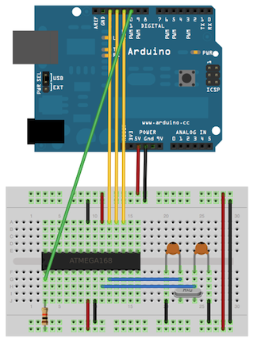
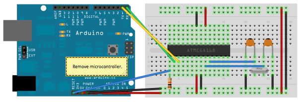
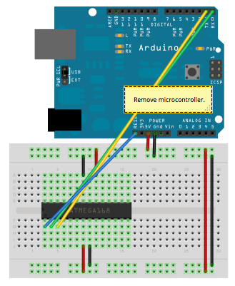

+++
title = 'Arduino - Graver le chargeur (bootloader) de démarrage sur un ATmega328'
date = 2019-07-31 00:00:00 +0100
categories = ['arduino']
+++
## Arduino vers un microcontrôleur sur une "breadboard"

Ce tutoriel explique comment migrer d’une carte Arduino vers un microcontrôleur autonome sur une carte d’affichage. Il utilise une carte Arduino pour programmer l' ATmega sur la maquette.

Sauf si vous choisissez d'utiliser la configuration minimale décrite à la fin de ce didacticiel, vous aurez besoin de quatre composants (outre Arduino, ATmega328 et breadboard):

* un cristal de 16 MHz ,
* une résistance de 10k, et deux condensateurs picofarad (céramique) 18 à 22. 

  
*Utiliser une carte Arduino pour graver le chargeur de démarrage sur un ATmega sur une "breadboard".*

### Graver le chargeur de démarrage

Si vous avez un nouvel ATmega328 (ou ATmega168 ), vous devrez y graver le chargeur de démarrage. Vous pouvez le faire en utilisant une carte Arduino en tant que programme système (ISP). Si le microcontrôleur a déjà le chargeur de démarrage (par exemple, parce que vous l'avez sorti d'une carte Arduino ou avez commandé un ATmega déjà chargé de démarrage), vous pouvez ignorer cette section.

Pour graver le chargeur de démarrage, procédez comme suit:

1. Téléchargez l’esquisse ArduinoISP sur votre carte Arduino. (Vous devrez sélectionner la carte et le port série dans le menu Outils qui correspondent à votre carte.)
2. Connectez la carte Arduino et le microcontrôleur comme indiqué dans le schéma à droite.
3. Sélectionnez "Arduino Duemilanove ou Nano w / ATmega328 " dans le menu Outils> Carte. (Ou " ATmega328 sur une carte de connexion (horloge interne à 8 MHz )" si vous utilisez la configuration minimale décrite ci-dessous.)
4. Sélectionnez "Arduino as ISP" dans Outils> Programmeur.
5.  Exécuter Outils> Graver le chargeur de démarrage 

Vous ne devriez avoir besoin que de graver le chargeur de démarrage une fois. Une fois que vous avez terminé, vous pouvez supprimer les fils de liaison connectés aux broches 10, 11, 12 et 13 de la carte Arduino.
	

### Téléchargement à l'aide d'une carte Arduino

Une fois que <u>le chargeur de démarrage Arduino est installé sur votre ATmega328p</u> , vous pouvez y télécharger des programmes à l’aide du convertisseur USB-à-série (puce FTDI) sur une carte Arduino. Pour ce faire, vous retirez le microcontrôleur de la carte Arduino afin que la puce FTDI puisse communiquer avec le microcontrôleur situé sur la carte de connexion. Le diagramme de droite montre comment connecter les lignes RX et TX de la carte Arduino à la carte ATmega sur la maquette. Pour programmer le microcontrôleur, sélectionnez "Arduino Duemilanove ou Nano w / ATmega328 " dans le menu Outils> Carte (ou " ATmega328 sur une breadboard (horloge interne à 8 MHz )" si vous utilisez la configuration minimale décrite ci-dessous). Puis téléchargez comme d'habitude.

  
*Télécharger des esquisses sur un ATmega sur une "breadboard". N'oubliez pas de retirer le microcontrôleur de la carte Arduino!*

### Circuit minimal (élimination de l'horloge externe)

Si vous ne disposez pas des condensateurs cristal supplémentaires à 16 MHz et des condensateurs picofarad 18-22 utilisés dans les exemples ci-dessus, vous pouvez configurer l' ATmega328 pour qu'il utilise son oscillateur interne à 8 MHz RC comme source d'horloge. (Vous n'avez pas non plus besoin de la résistance d'extraction 10K sur la broche de réinitialisation, nous la retirons donc pour obtenir une configuration vraiment minimale.)

Vous devrez installer le support pour une configuration matérielle supplémentaire:

1. Téléchargez cette archive de configuration matérielle: [breadboard-1-6-x.zip](https://www.arduino.cc/en/uploads/Tutorial/breadboard-1-6-x.zip) , [Breadboard1-5-x.zip](https://www.arduino.cc/en/uploads/Tutorial/Breadboard1-5-x.zip) ou [Breadboard1-0-x.zip](https://www.arduino.cc/en/uploads/Tutorial/Breadboard1-0-x.zip) en fonction de l'EDI que vous utilisez.
2. Créez un sous-dossier "hardware" dans votre dossier Carnet de croquis Arduino (dont l'emplacement se trouve dans la boîte de dialogue Préférences Arduino). Si vous avez déjà installé la prise en charge de la configuration matérielle supplémentaire, vous avez peut-être déjà un dossier "hardware" dans votre carnet de croquis.
3. Déplacez le dossier breadboard de l’archive zip vers le dossier "Matériel" de votre carnet de croquis Arduino.
4. Redémarrez le logiciel Arduino.
5. Vous devriez voir " ATmega328 sur une carte de connexion (horloge interne à 8 MHz )" dans le menu Outils> Carte (Tools > Board menu).   
Une fois que cela est fait, vous pouvez graver le chargeur de démarrage et télécharger des programmes sur votre ATmega328, comme décrit ci-dessus. Assurez-vous de sélectionner "ATmega328 on a breadboard (8 MHz internal clock)" lors de la gravure du chargeur de démarrage. (Si vous sélectionnez le mauvais élément et configurez le microcontrôleur pour utiliser une horloge externe, cela ne fonctionnera que si vous en connectez une.)

**Attention**  
Cette procédure fonctionne sur le logiciel Arduino 1.0.x.

 |   
--- | ---
Utiliser une carte Arduino pour graver le chargeur de démarrage sur un ATmega sur une "breadboard" (sans horloge externe). | Télécharger des esquisses sur un ATmega sur une breadboard.

### Se débarrasser de la carte Arduino

Une fois que vous avez programmé l' ATmega sur la maquette, vous pouvez éliminer l'Arduino. Pour ce faire, vous devrez fournir une source d'alimentation alternative au microcontrôleur. Consultez le [tutoriel autonome Arduino sur une maquette](https://www.arduino.cc/en/Main/Standalone) pour plus de détails. 