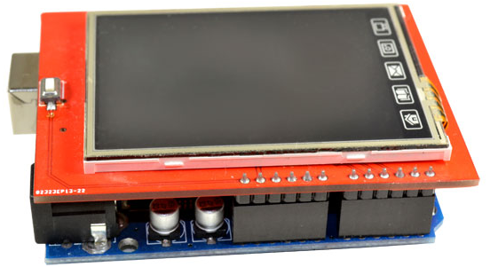
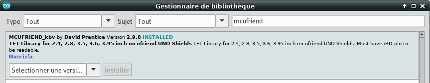
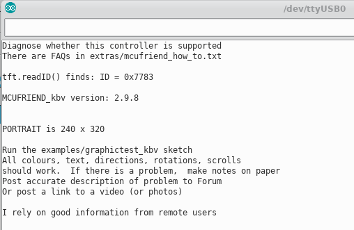
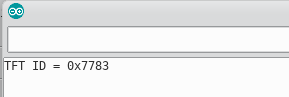
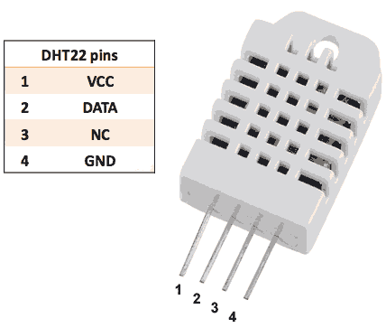
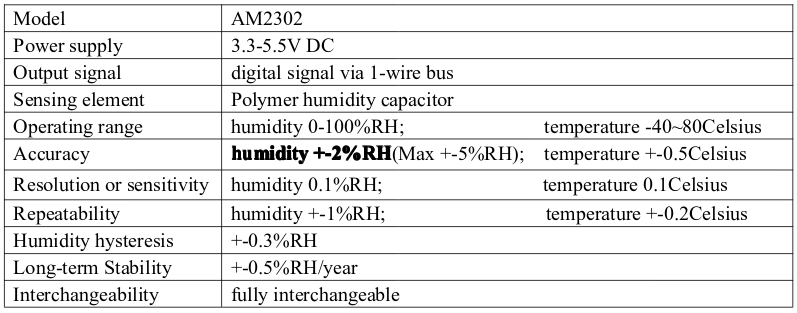
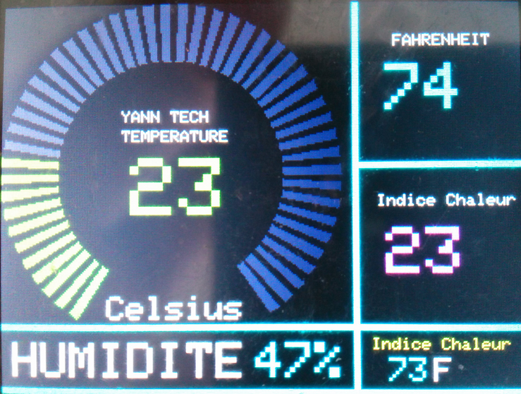

+++
title = 'Arduino UNO + écran tactile 2.4" TFT ST7783 + capteur température et humidité'
date = 2019-07-31 00:00:00 +0100
categories = ['arduino']
+++
## Arduino UNO + Ecran tactile 2.4" TFT

{:width="400"}

### Description

Le shield Arduino 2.4 "TFT LCD tactile  
*2.4 inch lcd for arduino uno or mage2560  solution:320x240  ic: ili9325 ili9340*

Ce shield est compatible avec Arduino UNO / Mega et possède un écran tactile et un lecteur de carte SD

### Caractéristiques techniques


*    Écran LCD TFT 2.4" à résolution 320 x 240
*    Compatible avec des niveaux de tension de fonctionnement de 3,3 et 5 V
*    Inclut l'écran tactile et le port de la carte SD
*    Contrôleur d'affichage : ST7783
*    Identifiant: 0x7783 

### Utiliser le TFT avec Arduino UNO

* [How to Use 2.4 Inch TFT LCD SPFD5408 With Arduino Uno and Mega](https://www.instructables.com/id/How-to-use-24-inch-TFT-LCD-SPFD5408-with-Arduino-U/)
* [Librairie SPFD5408](https://github.com/JoaoLopesF/SPFD5408)
* [Ecran tactile 2.8" TFT](https://wiki.mchobby.be/index.php?title=Ecran_tactile_2.8%22_TFT)
* [Lire et écrire des données sur une carte SD avec une carte Arduino / Genuino](https://www.carnetdumaker.net/articles/lire-et-ecrire-des-donnees-sur-une-carte-sd-avec-une-carte-arduino-genuino/)
* [How to check TFT lcd driver?](https://www.microcontroller-project.com/checking-tft-lcd-driver-with-arduino-uno.html)

Charger la librairie 

{:width="600"}

diagnostique : **diagnose_TFT_support** 

```c
#include <MCUFRIEND_kbv.h>
MCUFRIEND_kbv tft;

// Assign human-readable names to some common 16-bit color values:
#define BLACK   0x0000
#define BLUE    0x001F
#define RED     0xF800
#define GREEN   0x07E0
#define CYAN    0x07FF
#define MAGENTA 0xF81F
#define YELLOW  0xFFE0
#define WHITE   0xFFFF
#define GRAY    0x8410

uint16_t version = MCUFRIEND_KBV_H_;

void setup()
{
    Serial.begin(9600);
    if (!Serial) delay(5000);           //allow some time for Leonardo
    uint16_t ID = tft.readID(); //
    Serial.println(F("Diagnose whether this controller is supported"));
    Serial.println(F("There are FAQs in extras/mcufriend_how_to.txt"));
    Serial.println(F(""));
    Serial.print(F("tft.readID() finds: ID = 0x"));
    Serial.println(ID, HEX);
    Serial.println(F(""));
	Serial.print(F("MCUFRIEND_kbv version: "));
    Serial.print(version/100);
	Serial.print(F("."));
    Serial.print((version / 10) % 10);
	Serial.print(F("."));
    Serial.println(version % 10);
    Serial.println(F(""));
    if (ID == 0x0404) {
        Serial.println(F("Probably a write-only Mega2560 Shield"));
        Serial.println(F("#define USE_SPECIAL in mcufriend_shield.h"));
        Serial.println(F("#define appropriate SPECIAL in mcufriend_special.h"));
        Serial.println(F("e.g. USE_MEGA_16BIT_SHIELD"));
        Serial.println(F("e.g. USE_MEGA_8BIT_SHIELD"));
        Serial.println(F("Hint.  A Mega2560 Shield has a 18x2 male header"));
        Serial.println(F("Often a row of resistor-packs near the 18x2"));
        Serial.println(F("RP1-RP7 implies 16-bit but it might be 8-bit"));
        Serial.println(F("RP1-RP4 or RP1-RP5 can only be 8-bit"));
    }
    if (ID == 0xD3D3) {
        uint16_t guess_ID = 0x9481; // write-only shield
        Serial.println(F("Probably a write-only Mega2560 Shield"));
        Serial.print(F("Try to force ID = 0x"));
        Serial.println(guess_ID, HEX);
        tft.begin(guess_ID);
    }
    else tft.begin(ID);
    Serial.println(F(""));
    if (tft.width() == 0) {
        Serial.println(F("This ID is not supported"));
        Serial.println(F("look up ID in extras/mcufriend_how_to.txt"));
        Serial.println(F("you may need to edit MCUFRIEND_kbv.cpp"));
        Serial.println(F("to enable support for this ID"));
        Serial.println(F("e.g. #define SUPPORT_8347D"));
        Serial.println(F(""));
        Serial.println(F("New controllers appear on Ebay often"));
        Serial.println(F("If your ID is not supported"));
        Serial.println(F("run LCD_ID_readreg.ino from examples/"));
        Serial.println(F("Copy-Paste the output from the Serial Terminal"));
        Serial.println(F("to a message in Displays topic on Arduino Forum"));
        Serial.println(F("or to Issues on GitHub"));
        Serial.println(F(""));
        Serial.println(F("Note that OPEN-SMART boards have diff pinout"));
        Serial.println(F("Edit the pin defines in LCD_ID_readreg to match"));
        Serial.println(F("Edit mcufiend_shield.h for USE_SPECIAL"));
        Serial.println(F("Edit mcufiend_special.h for USE_OPENSMART_SHIELD_PINOUT"));
       while (1);    //just die
    } else {
        Serial.print(F("PORTRAIT is "));
        Serial.print(tft.width());
        Serial.print(F(" x "));
        Serial.println(tft.height());
        Serial.println(F(""));
        Serial.println(F("Run the examples/graphictest_kbv sketch"));
        Serial.println(F("All colours, text, directions, rotations, scrolls"));
        Serial.println(F("should work.  If there is a problem,  make notes on paper"));
        Serial.println(F("Post accurate description of problem to Forum"));
        Serial.println(F("Or post a link to a video (or photos)"));
        Serial.println(F(""));
        Serial.println(F("I rely on good information from remote users"));
    }
}

void loop()
{
    static uint8_t aspect = 0;
    const char *aspectname[] = {
        "PORTRAIT", "LANDSCAPE", "PORTRAIT_REV", "LANDSCAPE_REV"
    };
    const char *colorname[] = { "BLUE", "GREEN", "RED", "GRAY" };
    uint16_t colormask[] = { BLUE, GREEN, RED, GRAY };
    uint16_t ID = tft.readID(); //
    tft.setRotation(aspect);
    int width = tft.width();
    int height = tft.height();
    tft.fillScreen(colormask[aspect]);
    tft.drawRect(0, 0, width, height, WHITE);
    tft.drawRect(32, 32, width - 64, height - 64, WHITE);
    tft.setTextSize(2);
    tft.setTextColor(BLACK);
    tft.setCursor(40, 40);
    tft.print("ID=0x");
    tft.print(ID, HEX);
    if (ID == 0xD3D3) tft.print(" w/o");
    tft.setCursor(40, 70);
    tft.print(aspectname[aspect]);
    tft.setCursor(40, 100);
    tft.print(width);
    tft.print(" x ");
    tft.print(height);
    tft.setTextColor(WHITE);
    tft.setCursor(40, 130);
    tft.print(colorname[aspect]);
    tft.setCursor(40, 160);
    tft.setTextSize(1);
    tft.print("MCUFRIEND_KBV_H_ = ");
    tft.print(version);
    if (++aspect > 3) aspect = 0;
    delay(5000);
}
```

Résultat afficher dans la console (**Outils &rarr; Moniteur Série**)  
{:width="400"}

Test afficheur **testcard_kbv**

```c
/*
 * generate testcard similar to BMP
 */

#include <Adafruit_GFX.h>
#if defined(_GFXFONT_H_)           //are we using the new library?
#include <Fonts/FreeSans9pt7b.h>
#define ADJ_BASELINE 11            //new fonts setCursor to bottom of letter
#else
#define ADJ_BASELINE 0             //legacy setCursor to top of letter
#endif
#include <MCUFRIEND_kbv.h>
MCUFRIEND_kbv tft;

#define BLACK   0x0000
#define BLUE    0x001F
#define RED     0xF800
#define GREEN   0x07E0
#define CYAN    0x07FF
#define MAGENTA 0xF81F
#define YELLOW  0xFFE0
#define WHITE   0xFFFF

#define RGB(r, g, b) (((r&0xF8)<<8)|((g&0xFC)<<3)|(b>>3))

#define GREY      RGB(127, 127, 127)
#define DARKGREY  RGB(64, 64, 64)
#define TURQUOISE RGB(0, 128, 128)
#define PINK      RGB(255, 128, 192)
#define OLIVE     RGB(128, 128, 0)
#define PURPLE    RGB(128, 0, 128)
#define AZURE     RGB(0, 128, 255)
#define ORANGE    RGB(255,128,64)
 
#include <stdio.h>

uint16_t ID;
uint8_t hh, mm, ss; //containers for current time

uint8_t conv2d(const char* p)
{
    uint8_t v = 0;
    if ('0' <= *p && *p <= '9') v = *p - '0';
    return 10 * v + *++p - '0';
}

void setup(void)
{
    Serial.begin(9600);
    tft.reset();
    ID = tft.readID();
    Serial.print("TFT ID = 0x");
    Serial.println(ID, HEX);
    //    if (ID == 0xD3D3) ID = 0x9481; // write-only shield
    if (ID == 0xD3D3) ID = 0x9486; // write-only shield
    tft.begin(ID);
    tft.setRotation(1);
    tft.fillScreen(BLACK);
#if defined(_GFXFONT_H_)
    tft.setFont(&FreeSans9pt7b);
#endif
    hh = conv2d(__TIME__);
    mm = conv2d(__TIME__ + 3);
    ss = conv2d(__TIME__ + 6);

}

void loop(void)
{
    int16_t x, y, dx, dy, radius = 108, idx;
    uint16_t w, h, len, mask;
    uint16_t colors[8] = { BLACK, WHITE, YELLOW, CYAN, GREEN, MAGENTA, RED, BLUE };
    uint16_t height, width;
    width = tft.width();
    height = tft.height();
    tft.fillRect(0, 0, 7, 3, WHITE);
    tft.fillRect(313, 0, 7, 3, WHITE);
    tft.fillRect(0, 237, 7, 3, WHITE);
    tft.fillRect(313, 237, 7, 3, WHITE);
    for (y = 0, w = 18, h = 3; y < 240; y += 13 * w + h) {
        for (x = 25; x < 320 - 18; x += 2 * w) {
            tft.fillRect(x, y, w, h, WHITE);
        }
    }
    for (x = 0, w = 7, h = 18; x < 320; x += 17 * h + w) {
        for (y = 21; y < 240 - 18; y += 2 * h) {
            tft.fillRect(x, y, w, h, WHITE);
        }
    }
    tft.fillRect(7, 3, 17 * 18, 13 * 18, GREY);
    for (x = 7, y = 0, w = 1, h = 240; x < 320; x += 18) {
        tft.fillRect(x, y, w, h, WHITE);
    }
    for (x = 0, y = 3, w = 320, h = 1; y < 240; y += 18) {
        tft.fillRect(x, y, w, h, WHITE);
    }
    tft.fillRect(26, 22, 17, 99, TURQUOISE);
    tft.fillRect(26, 120, 17, 99, PINK);
    tft.fillRect(44, 22, 17, 35, AZURE);
    tft.fillRect(44, 184, 17, 35, ORANGE);
    tft.fillRect(260, 22, 17, 35, AZURE);
    tft.fillRect(260, 184, 17, 35, ORANGE);
    tft.fillRect(278, 22, 17, 99, OLIVE);
    tft.fillRect(278, 120, 17, 99, PURPLE);

    for (dx = radius; dx > -radius; dx--) {
        w = sqrt(radius * radius - dx * dx);
        y = 120 - dx;
        dy = (y - 3) / 18;
        mask = 7;
        colors[0] = (dy == 3) ? DARKGREY : BLACK;
        switch (dy) {
            case 0:
            case 1: idx = 1; len = 0; break;
            case 2: idx = 0; len = 0; break;
            case 3: idx = 0; len = 13; mask = 1; break;
            case 4:
            case 5: idx = 2; len = 38; break;
            case 6:
            case 7:
            case 8: idx = 0; len = 0; break;
            case 9: for (idx = 2; idx < 8; idx++) {
                    //dy = 0xFF >> (7 - idx);
                    dy = (idx - 2) * 51;
                    colors[idx] = tft.color565(dy, dy, dy);
                }
                idx = 2; len = 38; break;
            case 10: idx = 1; len = 0; break;
            case 11:
            case 12: colors[2] = YELLOW; idx = 2; len = 0; break;
        }
        if (len == 0)
            tft.fillRect(160 - w, y, w * 2, 1, colors[idx]);

        else {
            if (mask == 1) idx = 1 + (w) / len;
            dy = w % len;
            for (x = 160 - w; x < 160 + w; idx++) {
                tft.fillRect(x, y, dy, 1, colors[idx & mask]);
                x += dy;
                if (x + len > 160 + w) dy = w % len;
                else dy = len;
            }
        }

    }
    for (x = 72, y = 129, dx = 5, dy = 0; dx > 0; x += 2 * dx) {
        tft.fillRect(x, y, dx, 36, WHITE);
        dy += dx * 2;
        if (dy >= 36) {
            dy = 0;
            dx--;
        }
    }
    tft.fillRect(160 - 8, 5 * 18 + 3, 17, 3 * 18, BLACK);
    for (x = 3 * 18 + 7, y = 6 * 18 + 3, w = 1, h = 18; x < 160 + 108; x += 18) {
        tft.fillRect(x, y, w, h, WHITE);
    }
    tft.fillRect(160 - 108, 120, 108 * 2, 1, WHITE);
    tft.fillRect(160, 5 * 18 + 3, 1, 3 * 18, WHITE);
    tft.fillRect(108, 2 * 18 + 3, 6 * 18, 18, WHITE);
    //    tft.fillRect(108, 10 * 18 + 3, 6 * 18, 18, BLACK);
    tft.fillRect(160 - 8, 11 * 18 + 3, 17, radius - 18*9/2, RED);
    tft.setCursor(160 - 36, 24 + ADJ_BASELINE);
    tft.setTextColor(BLACK);
    tft.setTextSize(1);
    tft.print("320x240");
    tft.setCursor(109, 43 + ADJ_BASELINE);
    tft.setTextColor(BLACK);
    tft.setTextSize(1);
    tft.print("ID=0x");
    tft.print(tft.readID(), HEX);
    tft.setTextColor(WHITE, BLACK);
    //    tft.setFont(NULL);
    //    tft.setTextSize(2);
    while (1) {
        if (++ss > 59) {
            ss = 0;
            mm++;
            if (mm > 59) {
                mm = 0;
                hh++;
                if (hh > 23) hh = 0;
            }
        }
        char buf[20];
        sprintf(buf, "%02d:%02d:%02d", hh, mm, ss);
        tft.fillRect(108, 10 * 18 + 3, 6 * 18, 18, BLACK);
        tft.setCursor(128, 187 + ADJ_BASELINE);
        tft.print(buf);
        delay(1000);
    }
}
```

Résultat afficher dans la console (**Outils &rarr; Moniteur Série**)   
{:width="300"}

Test graphique **graphictest_kbv**  

Test de calibration **TouchScreen_Calibr_Native**  
{:width="600"}


## Capteur + moniteur écran TFT 320x200

* [ARDUINO - SPFD5408 TFT LCD 2.4 TEMP and HUMIDiTY Monitor. Fahrenheit & Celsius!](https://www.instructables.com/id/ARDUINO-SPFD5408-TFT-LCD-2-4-TEMP-and-HUMIDiTY-Mon/)

### Le capteur DHT22/AM2302

Le capteur de température et humidité DHT22/AM2302 ([Documentation (pdf)](/files/Digital+humidity+and+temperature+sensor+AM2302.pdf))  
{:width="200"}  
{:width="600"}

### Le programme

Le capteur DHT22/AM2302 est connecté sur 19 repéré A5 sur carte arduino UNO  
Le croquis **Monitor-LCD-Hum-Temp.ino** dans le dossier ~/Arduino/Monitor-LCD-Hum-Temp/  

```c
/*
Moniteur de température et humidité
 */
 
// *** Define Pin of LCD used
#define LCD_CS A3 // Chip Select goes to Analog 3
#define LCD_CD A2 // Command/Data goes to Analog 2
#define LCD_WR A1 // LCD Write goes to Analog 1
#define LCD_RD A0 // LCD Read goes to Analog 0
#define LCD_RESET A4 // Can alternately just connect to Arduino's reset pin


#include <SPI.h>          // f.k. for Arduino-1.5.2
#include "Adafruit_GFX.h"// Hardware-specific library
#include <MCUFRIEND_kbv.h>
//#include <Adafruit_TFTLCD.h>
//Adafruit_TFTLCD tft(LCD_CS, LCD_CD, LCD_WR, LCD_RD, LCD_RESET);

// Assign human-readable names to some common 16-bit color values:
#define BLACK   0x0000
#define BLUE    0x001F
#define RED     0xF800
#define GREEN   0x07E0
#define CYAN    0x07FF
#define MAGENTA 0xF81F
#define YELLOW  0xFFE0
#define WHITE   0xFFFF
#define GREY    0x2108

#include "DHT.h"

#define DHTPIN 19  // broche ou l'on a branche le capteur
#define DHTTYPE DHT22 // DHT 22 (AM2302)
DHT dht(DHTPIN, DHTTYPE); //déclaration du capteur

// *** Define Touchscreen Pin
#define YP A2  
#define XM A1  
#define YM 6   
#define XP 7   
// *** Define Value of Touchscreen input
#define TS_MINX 150
#define TS_MINY 120
#define TS_MAXX 920
#define TS_MAXY 940


#include "TouchScreen_kbv.h"
TouchScreen_kbv ts(XP, YP, XM, YM, 300); 

//Adafruit_TFTLCD tft(LCD_CS, LCD_CD, LCD_WR, LCD_RD, LCD_RESET);
MCUFRIEND_kbv tft;

#define MINPRESSURE 10
#define MAXPRESSURE 1000

// Meter colour schemes
#define RED2RED 0
#define GREEN2GREEN 1
#define BLUE2BLUE 2
#define BLUE2RED 3
#define GREEN2RED 4
#define RED2GREEN 5

uint32_t runTime = -99999;       // time for next update
int reading = 0; // Value to be displayed
int d = 0; // Variable used for the sinewave test waveform
boolean alert = 0;
int8_t ramp = 1;
int tesmod =0;
void setup() {

dht.begin(); // démarrage capteur

tft.reset(); //Reset LCD to begin

tft.begin(0x7783); 

tft.setRotation(1); // Set Rotation at 0 degress (default)

tft.fillScreen(BLACK); //Set Background Color with BLACK
    tft.setCursor (7,208);
    tft.setTextSize (3);
    tft.setTextColor (WHITE,BLACK);
    tft.print ("HUMIDITE"); 
    tft.setCursor (75,78);
    tft.setTextSize (1);
    tft.setTextColor (WHITE,BLACK);
    tft.print ("TEMPERATURE");
    tft.setCursor (75,66);
    tft.setTextSize (1);
    tft.setTextColor (WHITE,BLACK);
    tft.print ("YANN TECH");

    tft.setCursor (242,20);
    tft.setTextSize (1);
    tft.setTextColor (WHITE,BLACK);
    tft.print ("FAHRENHEIT");

    tft.setCursor (232,118);//heat index celsius
    tft.setTextSize (1);
    tft.setTextColor (WHITE,BLACK);
    tft.print ("Indice Chaleur");

    tft.setCursor (228,205);//heat index fahrenheit
    tft.setTextSize (1);
    tft.setTextColor (YELLOW,BLACK);
    tft.print ("Indice Chaleur");

    tft.setCursor (265,217);//Small fahrenheit text
    tft.setTextSize (2);
    tft.setTextColor (WHITE,BLACK);
    tft.print ("F");
    
//Design Interface (lines)
    tft.fillRect(0,197,320,4,CYAN);
    tft.fillRect(0,236,320,4,CYAN);
    tft.fillRect(217,0,4,240,CYAN);
    tft.fillRect(217,98,320,4,CYAN);

}

void loop() {
  // La lecture du capteur prend 250ms
  // Les valeurs lues peuvet etre vieilles de jusqu'a 2 secondes (le capteur est lent)
  float h = dht.readHumidity(); //on lit l'hygrometrie
  float t = dht.readTemperature(); //on lit la temperature en celsius (par defaut)
  float f = dht.readTemperature(true); // pour lire en farenheit, il faut le paramère (isFahrenheit = true)
  // Heat Index ou Indice de chaleur
  // L’ indice de chaleur (ou humidex) ou est calculé en fonction de la température et de l’humidité extérieures
  // le plus souvent exprimé en C° (même si c’est une valeur qui devrait, selon la formule, ne pas avoir d’unité)
  // Calcul de l'indice de chaleur en Farenheit (par défaut)
  float hif = dht.computeHeatIndex(f, h);
  //  Calcul de l'indice de chaleur en Celsius (isFahreheit = false) 
  float hic = dht.computeHeatIndex(t, h, false);


if (millis() - runTime >= 500) { // Exécution tous les 500ms
    runTime = millis();
    if(tesmod==0){reading=99; }
    if(tesmod==1){reading = t;}  
    
    int xpos = 0, ypos = 5, gap = 4, radius = 52;
    // Draw a large meter
    xpos = 320/2 - 160, ypos = 0, gap = 100, radius = 105;
    ringMeter(reading,0,100, xpos,ypos,radius,"Celsius",GREEN2RED); // Draw analogue meter

  if(h>0){  //Humidity %
    tft.setCursor (157,208);
    tft.setTextSize (3);
    tft.setTextColor (CYAN,BLACK);
    tft.print (h,0); tft.print ('%');
    tesmod=1;
  }
  if(f>0){  //Fahrenheit
    tft.setCursor (237,38);
    tft.setTextSize (4);
    tft.setTextColor (CYAN,BLACK);
    tft.print (f,0); 
    tesmod=1;
  }
  if(hif>0){  //Heat index Fahrenheit
    tft.setCursor (238,217);
    tft.setTextSize (2);
    tft.setTextColor (CYAN,BLACK);
    tft.print (hif,0); 
    tesmod=1;
  }
  if(hic>0){  //Heat index Celsius
    tft.setCursor (237,138);
    tft.setTextSize (4);
    tft.setTextColor (MAGENTA,BLACK);
    tft.print (hic,0); 
    tesmod=1;
  }
  }
}


// #########################################################################
//  Draw the meter on the screen, returns x coord of righthand side
// #########################################################################
int ringMeter(int value, int vmin, int vmax, int x, int y, int r, char *units, byte scheme)
{
  // Minimum value of r is about 52 before value text intrudes on ring
  // drawing the text first is an option
  
  x += r; y += r;   // Calculate coords of centre of ring
  int w = r / 3;    // Width of outer ring is 1/4 of radius 
  int angle = 150;  // Half the sweep angle of meter (300 degrees)
  int v = map(value, vmin, vmax, -angle, angle); // Map the value to an angle v
  byte seg = 3; // Segments are 3 degrees wide = 100 segments for 300 degrees
  byte inc = 6; // Draw segments every 3 degrees, increase to 6 for segmented ring
  // Variable to save "value" text colour from scheme and set default
  int colour = BLUE;
 
  // Draw colour blocks every inc degrees
  for (int i = -angle+inc/2; i < angle-inc/2; i += inc) {
    // Calculate pair of coordinates for segment start
    float sx = cos((i - 90) * 0.0174532925);
    float sy = sin((i - 90) * 0.0174532925);
    uint16_t x0 = sx * (r - w) + x;
    uint16_t y0 = sy * (r - w) + y;
    uint16_t x1 = sx * r + x;
    uint16_t y1 = sy * r + y;

    // Calculate pair of coordinates for segment end
    float sx2 = cos((i + seg - 90) * 0.0174532925);
    float sy2 = sin((i + seg - 90) * 0.0174532925);
    int x2 = sx2 * (r - w) + x;
    int y2 = sy2 * (r - w) + y;
    int x3 = sx2 * r + x;
    int y3 = sy2 * r + y;

    if (i < v) { // Fill in coloured segments with 2 triangles
      switch (scheme) {
        case 0: colour = RED; break; // Fixed colour
        case 1: colour = GREEN; break; // Fixed colour
        case 2: colour = BLUE; break; // Fixed colour
        case 3: colour = rainbow(map(i, -angle, angle, 0, 127)); break; // Full spectrum blue to red
        case 4: colour = rainbow(map(i, -angle, angle, 70, 127)); break; // Green to red (high temperature etc)
        case 5: colour = rainbow(map(i, -angle, angle, 127, 63)); break; // Red to green (low battery etc)
        default: colour = BLUE; break; // Fixed colour
      }
      tft.fillTriangle(x0, y0, x1, y1, x2, y2, colour);
      tft.fillTriangle(x1, y1, x2, y2, x3, y3, colour);
      //text_colour = colour; // Save the last colour drawn
    }
    else // Fill in blank segments
    {
      tft.fillTriangle(x0, y0, x1, y1, x2, y2, GREY);
      tft.fillTriangle(x1, y1, x2, y2, x3, y3, GREY);
    }
  }
  // Convert value to a string
  char buf[10];
  byte len = 2; if (value > 999) len = 4;
  dtostrf(value, len, 0, buf);
  buf[len] = ' '; buf[len] = 0; // Add blanking space and terminator, helps to centre text too!
  // Set the text colour to default
  tft.setTextSize(1);

  if(value>9){
  tft.setTextColor(colour,BLACK);
  tft.setCursor(x-25,y-10);tft.setTextSize(5);
  tft.print(buf);}
  if(value<10){
  tft.setTextColor(colour,BLACK);
  tft.setCursor(x-25,y-10);tft.setTextSize(5);
  tft.print(buf);}

  tft.setTextColor(WHITE,BLACK);
  
  tft.setCursor(x-39,y+75);tft.setTextSize(2);
  tft.print(units); // Units display
  
  // Calculate and return right hand side x coordinate
  return x + r;
}

// #########################################################################
// Return a 16 bit rainbow colour
// #########################################################################
unsigned int rainbow(byte value)
{
  // Value is expected to be in range 0-127
  // The value is converted to a spectrum colour from 0 = blue through to 127 = red

  byte red = 0; // Red is the top 5 bits of a 16 bit colour value
  byte green = 0;// Green is the middle 6 bits
  byte blue = 0; // Blue is the bottom 5 bits
  byte quadrant = value / 32;

  if (quadrant == 0) {
    blue = 31;
    green = 2 * (value % 32);
    red = 0;
  }
  if (quadrant == 1) {
    blue = 31 - (value % 32);
    green = 63;
    red = 0;
  }
  if (quadrant == 2) {
    blue = 0;
    green = 63;
    red = value % 32;
  }
  if (quadrant == 3) {
    blue = 0;
    green = 63 - 2 * (value % 32);
    red = 31;
  }
  return (red << 11) + (green << 5) + blue;
}

// #########################################################################
// Return a value in range -1 to +1 for a given phase angle in degrees
// #########################################################################
float sineWave(int phase) {
  return sin(phase * 0.0174532925);
}
```


{:width="400"}
