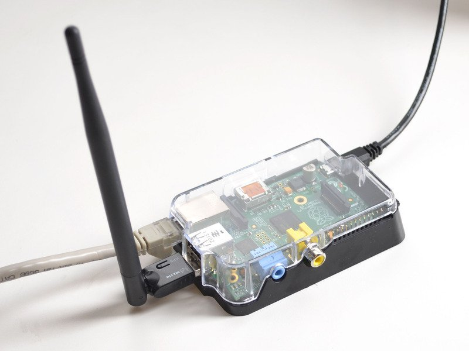
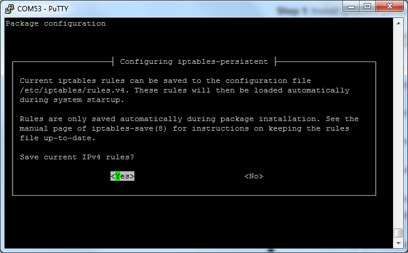
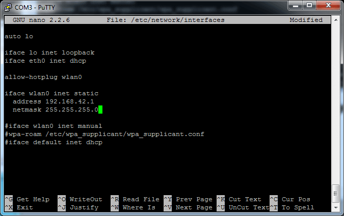
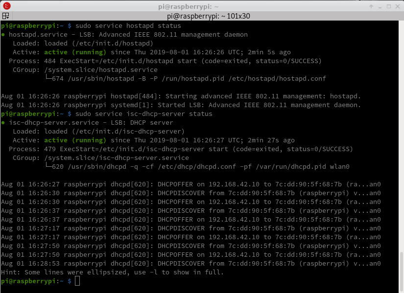
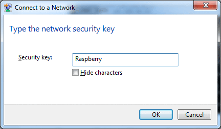
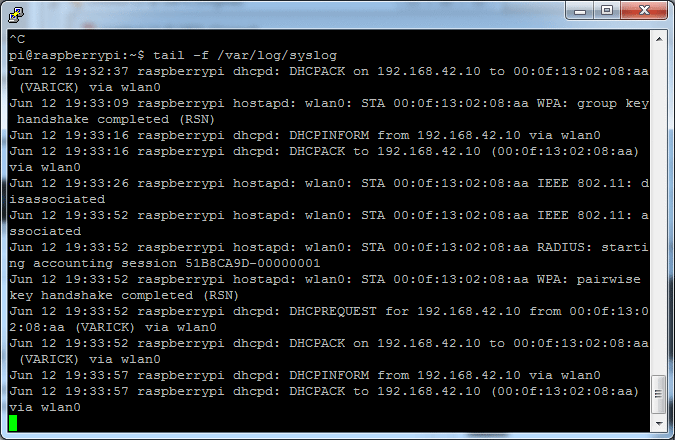
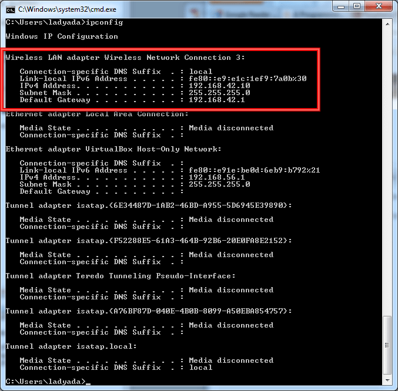
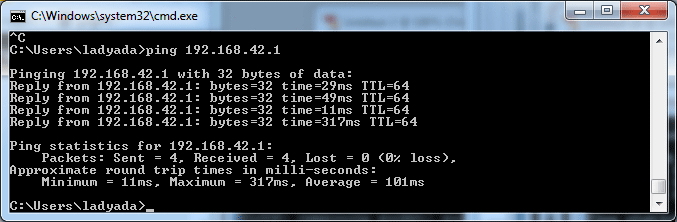
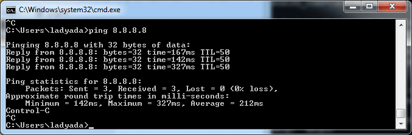

+++
title = 'Point d'accès wifi sur raspberry B (Raspbian Jessie)'
date = 2019-07-31 00:00:00 +0100
categories = ['raspberry']
+++
## Configuration d'un Raspberry Pi en tant que point d'accès WiFi

{:width=300"}  
Article original : [Setting up a Raspberry Pi as a WiFi access point](https://learn.adafruit.com/setting-up-a-raspberry-pi-as-a-wifi-access-point?view=all)

Voulez-vous utiliser votre Pi comme routeur WiFi? Ou peut-être l'avoir comme point d'accès de filtrage spécial? La configuration d'un Pi en tant que point d'accès est un peu plus avancée que son utilisation en tant que client, mais il ne lui reste qu'une demi-heure à taper pour la configurer. Si vous le souhaitez, grâce à ce didacticiel, le Pi diffuse un service WiFi puis achemine le trafic Internet vers un câble Ethernet. Comme c'est tout Linux, vous pouvez y aller et le mettre à jour ou le configurer comme bon vous semble.

J'ai utilisé les pages suivantes comme guide pour créer ce didacticiel; veuillez noter que nombre d'entre elles ne fonctionneront pas complètement, mais vérifiez si vous êtes intéressé!


*    <http://qcktech.blogspot.com/2012/08/raspberry-pi-as-router.html>
*    <http://itsacleanmachine.blogspot.com/2013/02/wifi-access-point-with-raspberry-pi.html>
*    <http://esrlabs.com/android-transporter-for-the-nexus-7-and-the-raspberry-pi/>
*    <http://elinux.org/RPI-Wireless-Hotspot>
*    <http://blog.mxard.com/persistent-iptables-on-raspberry-pi-raspbian>

>**Actuellement testé sur <font color="red">Raspbian Jessie</font> uniquement jusqu’à Raspberry Pi 3**

### Matériel nécessaire


*    Raspberry Pi - Ethernet est requis (model B avec prise ethernet)
*    câble Ethernet
*    Adaptateur WiFi - Tous les adaptateurs WiFi ne fonctionnent pas, nous savons avec certitude qu'il fonctionne avec ceux de la boutique Adafruit!
*    Carte SD (4 Go ou plus) avec Raspbian dessus. Vous pouvez soit le bricoler, soit acheter une carte Raspbian toute prête
*    Alimentation pour votre câble Pi & a Micro USB
*    Câble de console USB (en option) - cela facilite un peu le débogage du système
*    Etui pour votre Pi (optionnel)
*    Un lecteur de carte SD ou MicroSD (en option) 


### Raspbian Jessie

Ce tutoriel suppose que votre Pi est principalement configuré et prêt à fonctionner.

Veuillez suivre les tutoriels pour

1. [Installer le système d'exploitation sur votre carte SD](http://learn.adafruit.com/adafruit-raspberry-pi-lesson-1-preparing-and-sd-card-for-your-raspberry-pi)
1.   [Démarrer le Pi et configurer](http://learn.adafruit.com/adafruits-raspberry-pi-lesson-2-first-time-configuration) **N'oubliez pas de changer le mot de passe par défaut pour le compte 'pi'!**
1.    [Configurer et tester les connexions Ethernet et Wifi](http://learn.adafruit.com/adafruits-raspberry-pi-lesson-3-network-setup)
1.    [Connexion avec un câble de console USB (facultatif)](http://learn.adafruit.com/adafruits-raspberry-pi-lesson-5-using-a-console-cable)

>Insertion de l'interface WIFI ralink USB RT5370 avant mise sous tension du raspberry


Une fois terminé, vous devriez avoir un Pi qui démarre Raspbian, vous pouvez vous connecter à l’aide d’un câble de console USB et vous connecter au Pi via l’interface de ligne de commande.

Il est possible de faire ce tutoriel via ssh sur le port Ethernet ou en utilisant un adaptateur USB/Série et "minicom" (utilisation des pins 6-GND 8-Tx et 10-Rx de la carte raspberry).

Première connexion en mode console avec minicom  

Vérification réseau

    ip a

```
1: lo: <LOOPBACK,UP,LOWER_UP> mtu 65536 qdisc noqueue state UNKNOWN group default qlen 1
    link/loopback 00:00:00:00:00:00 brd 00:00:00:00:00:00
    inet 127.0.0.1/8 scope host lo
       valid_lft forever preferred_lft forever
    inet6 ::1/128 scope host 
       valid_lft forever preferred_lft forever
2: eth0: <BROADCAST,MULTICAST,UP,LOWER_UP> mtu 1500 qdisc pfifo_fast state UP group default qlen 1000
    link/ether b8:27:eb:c6:83:89 brd ff:ff:ff:ff:ff:ff
    inet 192.168.0.22/24 brd 192.168.0.255 scope global eth0
       valid_lft forever preferred_lft forever
3: wlan0: <NO-CARRIER,BROADCAST,MULTICAST,UP> mtu 1500 qdisc mq state DOWN group default qlen 1000
    link/ether 00:0f:00:3b:2e:31 brd ff:ff:ff:ff:ff:ff
    inet6 fe80::2504:c662:fd3:ef5c/64 scope link tentative 
       valid_lft forever preferred_lft forever
```

Mise à jour des programmes raspbian

    sudo apt-get update && sudo apt-get -y upgrade

Activer et lancer ssh

    sudo systemctl enable ssh && sudo systemctl start ssh

Lancer la configuration

    sudo raspi-config

* Advanced Options : A1 Expand Filesystem
* Interfacing Options : P2 SSH enable
* Finish et reboot


### Hostapd + iptables

Le Raspberry Pi est configuré comme un Hotspot WiFi. Il vous permet de se connecter à  Internet via le Wifi en utilisant le Raspberry Pi comme pont.

Les étapes de base sont

   * Valider un point d'accès WiFi avec diffusion sur le canal (channel) de votre choix
   * Attribuer des adresses IP dynamiques à n'importe quel appareil qui se connecte au réseau Wi-Fi
   * Joindre les réseaux WiFi et Ethernet en utilisant NAT (Network Address Translation)

Nous installons le logiciel sur le Pi qui agira en tant que 'hostap' (point d'accès hôte).

    sudo apt-get install hostapd isc-dhcp-server 

Installer le gestionnaire iptables 

    sudo apt-get install iptables-persistent

Vous aurez deux écrans 'config', dites "YES" aux deux  
{:width=400"}  

### Configurer le serveur DHCP

Editer /etc/dhcp/dhcpd.conf , un fichier qui configure notre serveur DHCP - cela permet aux connexions wifi d’obtenir automatiquement des adresses IP, DNS, etc.

Exécutez cette commande pour éditer le fichier.

    sudo nano /etc/dhcp/dhcpd.conf

Trouvez les lignes qui contiennent 

```
option domain-name "example.org";
option domain-name-servers ns1.example.org, ns2.example.org;
```

et les changer pour ajouter un # au début

```
#option domain-name "example.org";
#option domain-name-servers ns1.example.org, ns2.example.org;
```

Trouvez les lignes qui contiennent

```
# If this DHCP server is the official DHCP server for the local
# network, the authoritative directive should be uncommented.
#authoritative;
```

et retirez le # 

```
# If this DHCP server is the official DHCP server for the local
# network, the authoritative directive should be uncommented.
authoritative;
```

Ensuite, faites défiler vers le bas et ajoutez les lignes suivantes

```
subnet 192.168.42.0 netmask 255.255.255.0 {
	range 192.168.42.10 192.168.42.50;
	option broadcast-address 192.168.42.255;
	option routers 192.168.42.1;
	default-lease-time 600;
	max-lease-time 7200;
	option domain-name "local";
	option domain-name-servers 8.8.8.8, 8.8.4.4;
}
```

Enregistrez le fichier en tapant Control-X puis Y 

Editer **isc-dhcp-server**

    sudo nano /etc/default/isc-dhcp-server

et faites défiler jusqu'à `INTERFACES=""` et mettez-le à jour avec `INTERFACES="wlan0"`   
puis fermer et sauvegarder le fichier

### Configurer wlan0 pour une adresse IP statique
 
Si vous avez activé wlan0 parce que vous l'avez configuré, exécutez `sudo ifdown wlan0`   
Configurer la connexion wlan0 pour qu'elle soit statique et entrante.  

    sudo nano /etc/network/interfaces # pour modifier le fichier.

Recherchez la ligne **auto wlan0** et ajoutez un **#** devant la ligne, puis devant chaque ligne. Si vous n'avez pas cette ligne, assurez-vous simplement qu'elle ressemble à la capture d'écran ci-dessous! En gros, supprimez tous les anciens paramètres de configuration wlan0 et ajouter les lignes

```
iface wlan0 inet static
  address 192.168.42.1
  netmask 255.255.255.0
```

Après allow-hotplug wlan0 - voir ci-dessous un exemple de ce à quoi cela devrait ressembler. Toute autre ligne doit ensuite avoir un # devant pour la désactiver.

{:width=500"}  

Enregistrez le fichier (Control-X Y)

Attribuez une adresse IP statique à l'adaptateur wifi en exécutant

    sudo ifconfig wlan0 192.168.42.1

Vérifier

    ip a

```
1: lo: <LOOPBACK,UP,LOWER_UP> mtu 65536 qdisc noqueue state UNKNOWN group default qlen 1
    link/loopback 00:00:00:00:00:00 brd 00:00:00:00:00:00
    inet 127.0.0.1/8 scope host lo
       valid_lft forever preferred_lft forever
    inet6 ::1/128 scope host 
       valid_lft forever preferred_lft forever
2: eth0: <BROADCAST,MULTICAST,UP,LOWER_UP> mtu 1500 qdisc pfifo_fast state UP group default qlen 1000
    link/ether b8:27:eb:c6:83:89 brd ff:ff:ff:ff:ff:ff
    inet 192.168.0.22/24 brd 192.168.0.255 scope global eth0
       valid_lft forever preferred_lft forever
    inet6 2a01:e34:eebf:df0:e7e:881e:38ba:a7fb/64 scope global noprefixroute dynamic 
       valid_lft 86039sec preferred_lft 86039sec
    inet6 fe80::1c48:46a3:1d9f:c6eb/64 scope link 
       valid_lft forever preferred_lft forever
3: wlan0: <NO-CARRIER,BROADCAST,MULTICAST,UP> mtu 1500 qdisc mq state DOWN group default qlen 1000
    link/ether 00:0f:00:3b:2e:31 brd ff:ff:ff:ff:ff:ff
    inet 192.168.42.1/24 brd 192.168.42.255 scope global wlan0
       valid_lft forever preferred_lft forever
    inet6 fe80::2504:c662:fd3:ef5c/64 scope link tentative 
       valid_lft forever preferred_lft forever
```

### Configurer le point d'accès

Nous pouvons maintenant configurer les détails du point d'accès. Nous allons configurer un réseau protégé par mot de passe afin que seules les personnes qui en dispose puissent se connecter.

Créer un fichier **hostapd.conf**

    sudo nano /etc/hostapd/hostapd.conf

Collez ce qui suit , vous pouvez changer le texte après **ssid=** en un autre nom, qui sera le nom de la diffusion réseau. Le mot de passe (8 car min) peut être changé avec le texte après **wpa_passphrase=** 

```
interface=wlan0
driver=nl80211
ssid=ApYan
country_code=FR
hw_mode=g
channel=6
macaddr_acl=0
auth_algs=1
ignore_broadcast_ssid=0
wpa=2
wpa_passphrase=yannickm
wpa_key_mgmt=WPA-PSK
wpa_pairwise=CCMP
wpa_group_rekey=86400
ieee80211n=1
wme_enabled=1
```

* Si vous utilisez les adaptateurs wifi Adafruit, vous devrez changer le **driver=nl80211** par **driver=rtl871xdrv**  
* Si vous utilisez l'adaptateur WiFi interne du Raspberry Pi 3, commentez la ligne **driver=rtl871xdrv ** &rarr; `#driver=rtl871xdrv`

Nous allons maintenant dire au Pi où trouver ce fichier de configuration.  

    sudo nano /etc/default/hostapd

Recherchez la ligne `#DAEMON_CONF=""` et modifiez-la afin qu'elle indique `DAEMON_CONF="/etc/hostapd/hostapd.conf"`  
N'oubliez pas de retirer le # devant pour l'activer!

De même, lancez `sudo nano /etc/init.d/hostapd` et recherchez la ligne `DAEMON_CONF=`  
la changer en `DAEMON_CONF=/etc/hostapd/hostapd.conf`

### Configurer la traduction d'adresse réseau

La configuration de NAT permettra à plusieurs clients de se connecter au réseau Wi-Fi et de transférer toutes les données en tunnel via une adresse IP Ethernet unique.

    sudo nano /etc/sysctl.conf

Faites défiler vers le bas et ajoutez

    net.ipv4.ip_forward=1

sur une nouvelle ligne. Enregistrez le fichier. Cela démarrera le transfert IP au prochain démarrage   
pour l'activer immédiatement 

    sudo sh -c "echo 1 > /proc/sys/net/ipv4/ip_forward"

Exécutez les commandes suivantes pour créer la traduction réseau entre le port ethernet eth0 et le port wifi wlan0

```
sudo iptables -t nat -A POSTROUTING -o eth0 -j MASQUERADE
sudo iptables -A FORWARD -i eth0 -o wlan0 -m state --state RELATED,ESTABLISHED -j ACCEPT
sudo iptables -A FORWARD -i wlan0 -o eth0 -j ACCEPT
```

Vous pouvez vérifier ce qui est dans les tableaux avec

    sudo iptables -t nat -S

```
-P PREROUTING ACCEPT
-P INPUT ACCEPT
-P OUTPUT ACCEPT
-P POSTROUTING ACCEPT
-A POSTROUTING -o eth0 -j MASQUERADE
```

Pour que cela se produise au redémarrage (afin que vous n'ayez pas à le taper à chaque fois), exécutez

    sudo sh -c "iptables-save > /etc/iptables/rules.v4" 

L'outil iptables-persistent que vous avez installé au début rechargera automatiquement la configuration au démarrage.

### Test 

Vérifier avec un autre ordinateur wifi que votre SSID apparaît.   
Si c'est le cas, vous avez correctement configuré le point d'accès.
Vous pouvez essayer de vous connecter et de vous déconnecter de Pi_AP avec le mot de passe que vous avez défini auparavant

### Finir!

><font color="red">**ATTENTION** , ce qui suit n'est pas à faire car les applications **hostapd** et **isc-dhcp-server** sont automatiquement **ACTIVEES** et **EXECUTEES** après la phase installation...</font>    
maintenant que nous savons que cela fonctionne, il est temps de le configurer en tant que "démon" - un programme qui démarrera lorsque le Pi démarrera.  
Lancer les commandes suivantes:  
sudo service hostapd start  
sudo service isc-dhcp-server start   
-  
Pour démarrer les services du démon. Vérifiez qu'ils démarrent tous les deux avec succès (pas d'échec ou d'erreur)  
Ensuite, pour qu'il soit exécuté à chaque démarrage:  
sudo update-rc.d hostapd enable  
sudo update-rc.d isc-dhcp-server enable  


vous pouvez toujours vérifier l’état du serveur AP hôte et du serveur DHCP avec

    sudo service hostapd status 
    sudo service isc-dhcp-server status

{:width=600"}  

### Connecter et tester

Maintenant que le logiciel est installé sur un Pi, il est temps de s'y connecter et de tester la connexion. J'utilise un ordinateur Windows mais tout type devrait bien fonctionner

Sur le Pi, exécutez la commande tail -f / var / log / syslog pour afficher les données du journal système, ce qui est pratique pour vérifier et déboguer ce qui se passe!

Connectez-vous avec un autre ordinateur au point d'accès créé à l'étape précédente. 

{:width=200"}  

Entrez la clé WPA que vous avez spécifiée à l'étape précédente.

{:width=200"}  

{:width=200"}  

Dans le syslog Pi, vous devriez voir des choses comme ça! Il indique qu'un client s'est connecté, à quelle heure et quelle adresse IP lui a été donnée

Si vous ne pouvez pas vous connecter du tout, quelque chose ne va pas avec **hostapd**

{:width=500"}  

Sur votre ordinateur, ouvrez un Terminal (mac / linux) ou Démarrer-> Exécuter-> cmd pour ouvrir une ligne de commande.

Commencez par vérifier ce que ifconfig (mac / linux) ou ipconfig (windows) dit. Vous devriez avoir une adresse IP dans la plage 192.168.42.10-50

{:width=500"}  

Essayez d’envoyer une requête ping au Pi. Son adresse est 192.168.42.1 . Sous Windows, elle sonnera 3 fois et s’arrêtera. Sur mac / linux, appuyez sur Control-C pour quitter après quelques pings. Vous devriez avoir des pings réussis comme vu ci-dessous

Si cela ne fonctionne pas, quelque chose ne va pas avec **hostapd** ou **dhcpd** (plus probable)

{:width=500"}  

Ensuite, essayez le `ping 8.8.8.8` , si cela ne fonctionne pas mais que le précédent fonctionne, il y a un problème avec **dhcpd** ou la configuration NAT (plus probablement).

{:width=500"}  

Pour finir, nous allons vérifier que le DNS fonctionne, essayez de faire un ping sur www.mit.edu . Si cela ne fonctionne pas, il y a un problème avec dhcpd

Si tout va bien jusqu'à présent, essayez de naviguer sur Internet, d'envoyer des emails, etc. Vous utilisez maintenant votre Pi comme routeur Wifi!

## Liens

* Point d'accès wifi (HotSpot)
    * [Créer un hotspot Wi-Fi en moins de 10 minutes avec la Raspberry Pi !](https://raspberry-pi.fr/creer-un-hotspot-wi-fi-en-moins-de-10-minutes-avec-la-raspberry-pi/)
    * [RT5370 - Cheap micro usb wireless dongle on R-Pi ](http://raspberry-pi-notes.blogspot.fr/2012/05/rt5370-cheap-micro-usb-wireless-dongle.html)
    * [Success With Ralink RT5370 USB Wi-Fi Dongle on the Raspberry Pi](http://lucsmall.com/2012/09/21/ralink-rt5370-usb-wifi-dongle-raspberry-pi/)
    * [Utiliser raspberry en point d'accès wifi](http://blog.sip2serve.com/post/48420162196/howto-setup-rtl8188cus-on-rpi-as-an-access-point)
    * [Making a WiFi Hotspot / Access Point using Linux & wifi lan card/USB adapter](https://exain.wordpress.com/2011/03/31/making-a-wifi-hotspot-access-point-using-linux-wifi-lan-cardusb-adapter/)
    * [HostAP daemon](http://doc.ubuntu-fr.org/hostapd)
    * <http://www.daveconroy.com/turn-your-raspberry-pi-into-a-wifi-hotspot-with-edimax-nano-usb-ew-7811un-rtl8188cus-chipset/>
    * [WiFi AP (RT5370) on Raspberry Pi](https://rpi.vypni.net/wifi-ap-rt5370-on-raspberry-pi/)


* Tor
    * [Onion Pi (tor)](https://learn.adafruit.com/onion-pi?view=all)
    * [Comment faire un routeur Wi-Fi DIY connecté à Tor avec un Raspberry Pi](http://www.numerama.com/tech/161911-faire-routeur-wifi-connecte-reseau-tor-raspberry-pi.html)
    * [Browse Anonymously with a DIY Raspberry Pi VPN/TOR Router](http://makezine.com/projects/browse-anonymously-with-a-diy-raspberry-pi-vpntor-router/?utm_source=feedburner&utm_medium=%24%7Bfeed%7D&utm_campaign=Feed%3A+%24%7Bmakezineonline%7D+%28%24%7BMAKE%7D%29&utm_content=%24%7BGoogleReader%7D)
    * [protection de la vie privée](http://www.silicon.fr/le-raspberry-pi-au-secours-de-la-protection-de-la-vie-privee-87144.html)
    * [Raspberry Pi, a USB WiFi adapter and Ethernet cable to create a small, low-power and portable privacy Pi](https://learn.adafruit.com/onion-pi/overview)
