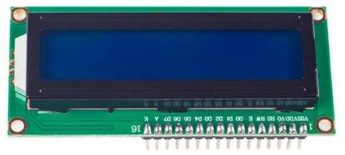
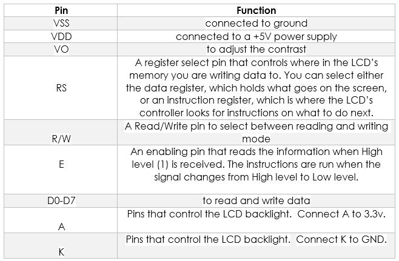
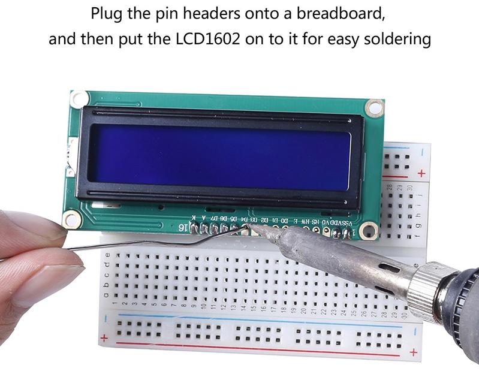
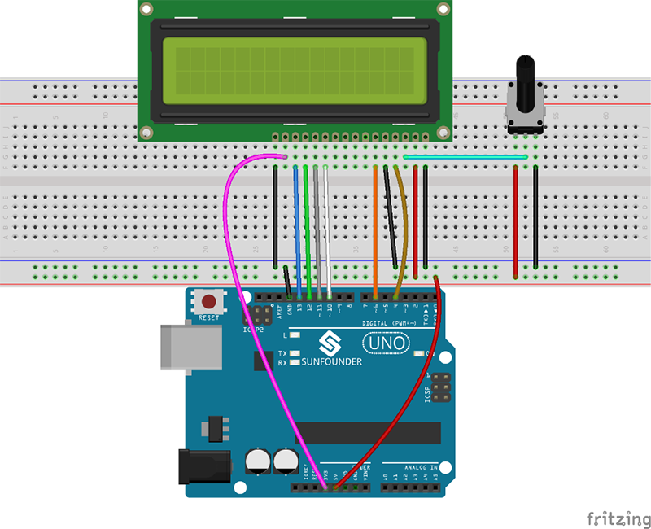
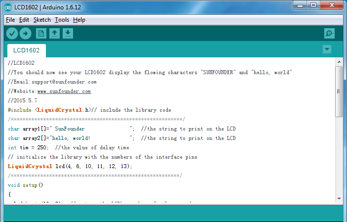
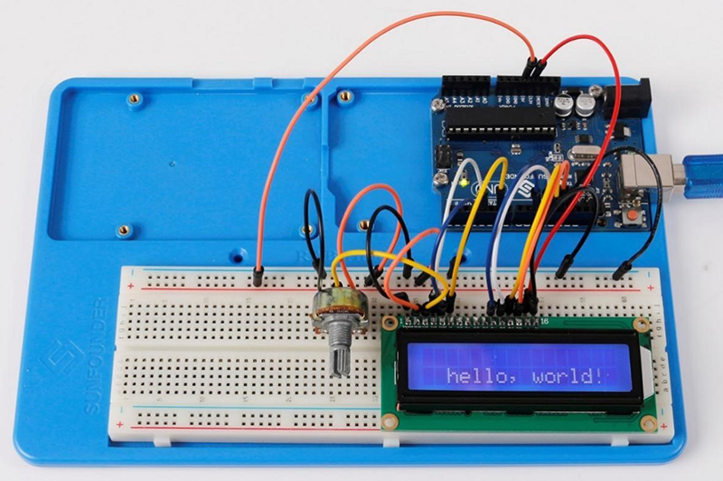
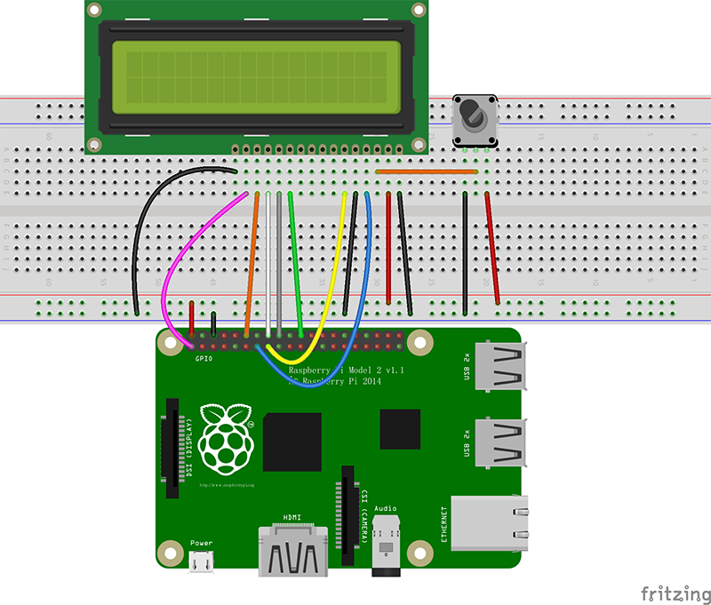
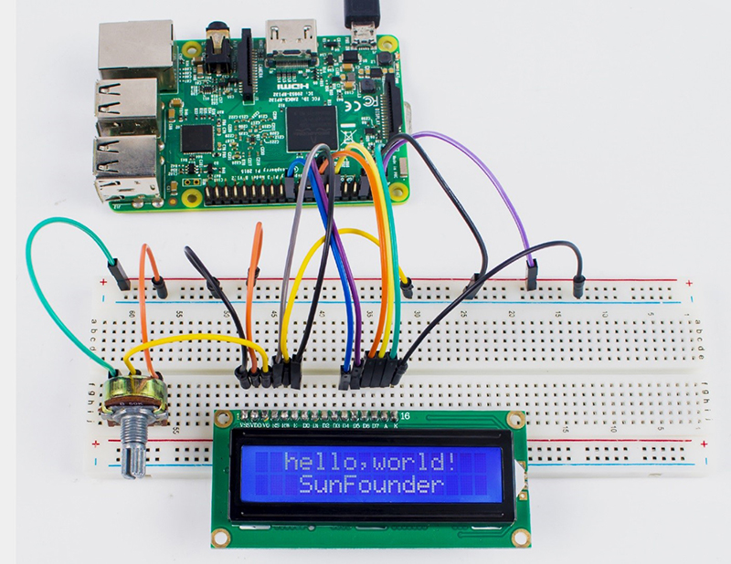

+++
title = 'Module LCD1602, écran LCD 2 lignes de 16 caractères'
date = 2019-07-31 00:00:00 +0100
categories = ['arduino', 'raspberry']
+++
## Module LCD1602

{:width="400"}    

### Introduction

L'écran LCD1602, ou écran à cristaux liquides de 1602 caractères, est une sorte de module à matrice de points pour afficher des lettres, des chiffres, des caractères, etc. Il est composé de positions matricielles 5x7 ou 5x11 ; chaque position peut afficher un caractère. Il y a une hauteur de point entre deux caractères et un espace entre les lignes, séparant ainsi les caractères et les lignes. Le modèle 1602 affiche 2 lignes de 16 caractères.  
En général, le LCD1602 possède des ports parallèles, c'est-à-dire qu'il contrôle plusieurs broches en même temps. L'écran LCD1602 peut être classé en deux catégories : les connexions à huit ports et les connexions à quatre ports. Si la connexion à huit ports est utilisée, tous les ports numériques de la carte SunFounder Uno sont presque entièrement occupés. Si vous voulez connecter plus de capteurs, il n'y aura pas de ports disponibles. Par conséquent, la connexion à quatre ports est utilisée ici pour une meilleure application.  

### Brochage (Pins Functions)

{:width="400"}  

### Montage sur Arduino

**<font color="green">Composantss</font>  
- 1 x Arduino Uno
- 1 x Breadboard  
- 1 x LCD1602  
- 1 x Potentiomètre (50kΩ)  
- 1 x Câble USB
- Plusieurs fils "cavalier"  


<font color="green">Procédures expérimentales</font>  
<font color="red">**Note:** Avant de connecter le circuit, il faut brancher les en-têtes des broches sur une plaque d'appui, puis mettre le LCD1602 dessus pour faciliter la soudure.</font>  

{:width="400"}   

**Etape 1:** Construisez le circuit (assurez-vous que les broches sont correctement connectées. Sinon, les caractères ne s'afficheront pas correctement):  

{:width="400"}   

**Etape 2:** Téléchargez le package [LCD1602_for_Arduino](http://wiki.sunfounder.cc/images/b/b2/LCD1602_for_Arduino.rar) , puis décompressez-le et ouvrez le fichier LCD1602.ino. 

{:width="600"}   

**Etape 3:** Sélectionner la Carte et le Port  
**Etape 4:** Téléverser le programme dans la carte  


<font color="red">Note : Vous devrez peut-être ajuster le potentiomètre du LCD1602 jusqu'à ce qu'il affiche clairement.</font>  
Vous devriez maintenant voir "SunFounder" et "hello, world ! " défiler sur l'écran LCD. 

{:width="400"}   

### L'expérience pour Raspberry Pi

**Composants**

* 1 x Raspberry Pi  
* 1 x Breadboard  
* 1 x LCD1602  
* 1 x Potentiomètre  
* Plusieurs fils "cavalier"  


<font color="green">Procédures expérimentales </font>.  
**Etape 1:**Construisez le circuit (assurez-vous que les broches sont correctement connectées. Sinon, les caractères ne s'afficheront pas correctement) :  

LCD1602/2004 |	Carte Arduino Uno
--- | ---
K |	GND
A |	3.3V
D7 |	GPIO18
D6 |	GPIO23
D5 |	GPIO24
D4 |	GPIO25
D0-D3 |	Non Connecté
E |	GPIO22
R/W |	GND
RS |	GPIO27
OV |Raccorder à la broche centrale du potentiomètre
VDD |	5V
VSS |	GND 

{:width="600"}  

<font color="red">Note : Après avoir exécuté le code, les caractères peuvent ne pas apparaître sur le LCD1602. Vous devez régler le contraste de l'écran (le passage progressif du noir au blanc) en tournant le potentiomètre dans le sens des aiguilles d'une montre ou dans le sens inverse, jusqu'à ce que l'écran affiche clairement les caractères </font>.  

**Etape 2:**Transférez le paquet [LCD1602_for_Raspberry_Pi](http://wiki.sunfounder.cc/images/8/87/LCD1602_for_Raspberry_Pi.zip)  au Raspberry Pi  

```
wget http://wiki.sunfounder.cc/images/8/87/LCD1602_for_Raspberry_Pi.zip
```


**Etape 3:** Extraire le paquet  

```
unzip LCD1602_for_Raspberry_Pi.zip
```


<font color="orange">(Pour les utilisateurs du langage C)</font>.  
**Etape 4 :** Entrer dans le répertoire du code  

```
cd LCD1602_for_Raspberry_Pi/C
```


**Etape 5:** Compiler  

```
gcc lcd1602.c –o lcd1602 –lwiringPiDev –lwiringPi
```


**Step 6:** Run  

```
sudo ./lcd1602
```


<font color="orange">(Pour les utilisateurs du langage Python)</font>  
**Etape 4:** Entrer dans le répertoire du code  

```
cd LCD1602_for_Raspberry_Pi/Python
```


**Etape 5:** Exécuter    

```
sudo python lcd1602.py
```

Vous devriez maintenant voir "SunFounder" et "hello, world ! " défiler sur l'écran LCD. 
 
{:width="600"}  

### Ressources

* [LCD1602_for_Arduino.rar](http://wiki.sunfounder.cc/images/b/b2/LCD1602_for_Arduino.rar)  
* [LCD1602_for_Raspberry_Pi.zip  LCD1602_for_Raspberry_Pi](http://wiki.sunfounder.cc/images/8/87/LCD1602_for_Raspberry_Pi.zip)  
