+++
title = 'Moniteurs OLED SSD1306 avec Arduino et Raspberry Pi'
date = 2019-07-31 00:00:00 +0100
categories = ['arduino', 'raspberry']
+++
## Interfaçage de l'écran OLED SSD1306 avec Arduino

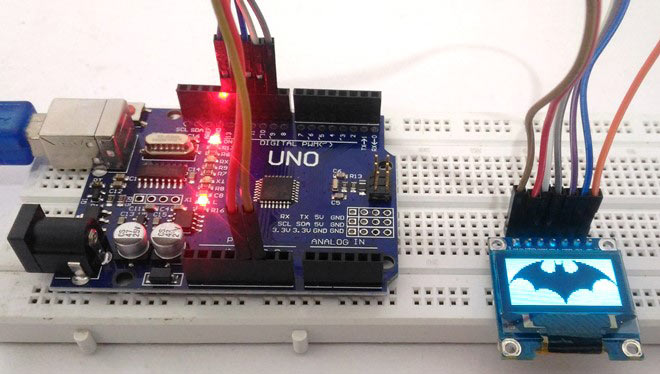{:width="400"}


La plupart d'entre nous connaissons bien l' [écran LCD matriciel 16 × 2](https://circuitdigest.com/article/16x2-lcd-display-module-pinout-datasheet) utilisé dans la plupart des projets pour afficher certaines informations à l'utilisateur. Mais ces écrans LCD ont beaucoup de limites dans ce qu'ils peuvent faire. Dans ce tutoriel, nous allons en apprendre davantage sur les écrans OLED et sur leur utilisation, Arduino . Il existe de nombreux types d’écrans OLED disponibles sur le marché et de nombreuses façons de les faire fonctionner. Dans ce tutoriel, nous discuterons de ses classifications et de celle qui conviendra le mieux à votre projet.

### Matériel requis 

* Module d'affichage OLED à 7 broches 128 × 64 (SSD1306)
* Arduino UNO / Nano
* Planche à pain
* Fils de connexion
* Ordinateur / ordinateur portable 

### les écrans OLED

Le terme OLED signifie « diode électroluminescente organique». Il utilise la même technologie que celle utilisée dans la plupart de nos téléviseurs, mais comporte moins de pixels par rapport à eux. Il est vraiment amusant d’avoir ces modules d’écran superbes à interfacer avec l’Arduino, car ils donneront à nos projets un aspect cool. Nous avons couvert [un article complet sur les écrans OLED et ses types](https://translate.googleusercontent.com/translate_c?depth=1&hl=fr&ie=UTF8&langpair=en%7Cfr&rurl=translate.google.com&sp=nmt4&u=https://circuitdigest.com/article/ssd1306-oled-display&xid=17259,15700023,15700043,15700186,15700190,15700256,15700259,15700262,15700265&usg=ALkJrhhLiVfAwY8vT-3uySgqeRi4Hq6v5A) .

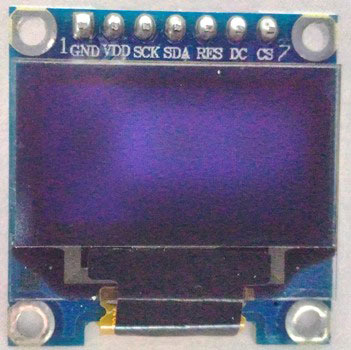{:width="200"} 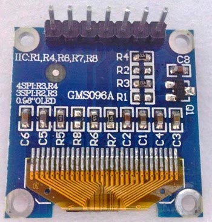{:width="200"}

Nous utilisons un écran OLED SSD1306 0,96 ”à 7 broches monochrome .  
Le choix de cet affichage s’explique par le fait qu’il peut fonctionner avec trois protocoles de communication différents, tels que :

* le mode SPI 3 fils
* le mode SPI quatre fils
* le mode IIC. 

Ce didacticiel explique comment utiliser le module en mode <u>SPI 4 fils</u>, car il s’agit du mode de communication le plus rapide et du mode par défaut.

Les broches et leurs fonctions sont expliquées dans le tableau ci-dessous. 

Nom de broche | Autres noms | Usage
 --- | --- | ---
Gnd | GND | Broche de masse du module
Vdd | Vcc, 5V |Broche d'alimentation (3-5V tolérable)
SCK | SCK, D0, SCL, CLK | Agit comme la goupille d'horloge. Utilisé à la fois pour I2C et SPI
SDA | DATA, SDA, D1, MOSI | Broche de données du module. Utilisé pour IIC et SPI
RES | RST, RESET | Réinitialise le module (utile pendant SPI)
DC/C | DC, A0  | Pin de commande de données. Utilisé pour le protocole SPI
CS | Sélection de puce | Utile lorsque plusieurs modules sont utilisés sous le protocole SPI 

La communauté Arduino nous a déjà fourni de nombreuses bibliothèques qui peuvent être directement utilisées pour rendre cela beaucoup plus simple. J'ai essayé quelques bibliothèques et trouvé que la bibliothèque [Adafruit_SSD1306](https://github.com/adafruit/Adafruit_SSD1306) était très facile à utiliser et comportait une poignée d'options graphiques, c'est pourquoi nous allons utiliser la même chose dans ce tutoriel. Toutefois, si votre projet a une contrainte de mémoire / vitesse, essayez d’utiliser la bibliothèque U8g car elle fonctionne plus rapidement et utilise moins de mémoire programme.

### Matériel et connexions:

Le schéma de circuit pour l’interfaçage OLED SSD1306 avec Arduino est très simple et est présenté ci-dessous.  
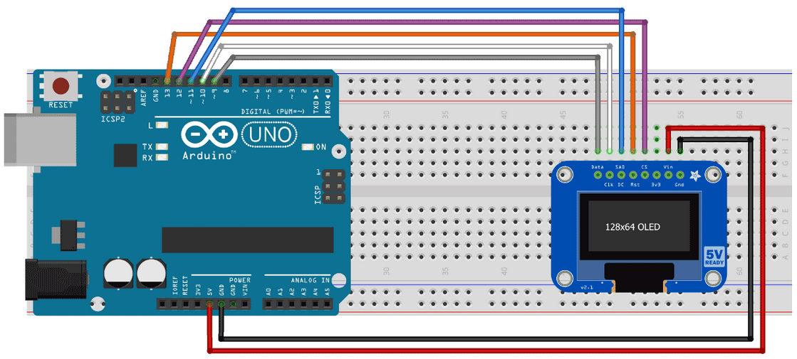{:width="600"}  
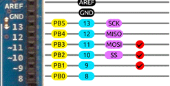   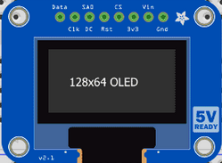

Nous avons simplement établi une communication SPI entre le module OLED et Arduino .
Etant donné que l'OLED fonctionne sur 3V-5V et consomme très peu d'énergie, il n'a pas besoin d'alimentation externe. Vous pouvez simplement utiliser des fils pour établir la connexion ou utiliser une planche à pain comme je l’ai utilisée pour faciliter l’expérimentation. La connexion est également répertoriée ci-dessous

Nom de broche sur le module OLED  |  Nom de Pin sur Arduino
--- | ---
Gnd  |  Sol
Vdd, Vcc, 5V  |  5V
SCK, D0, SCL, CLK  |  10
DATA, SDA, D1, MOSI  |  9
RES, RST, RESET  |  13
DC, A0  |  11
CS, Puce Sélectionner  |  12


>**Remarque:** vous ne pourrez pas visualiser le rétroéclairage / allumer le module OLED en le mettant simplement sous tension. Vous devez le programmer correctement pour noter tout changement sur l’affichage OLED. 

### Programmation de l’affichage OLED SSD1306 pour Arduino 

Une fois que les connexions sont prêtes, vous pouvez commencer à programmer l’Arduino. Nous utiliserons la bibliothèque Adafruit et la bibliothèque GFX pour travailler avec ce module OLED.  

<font color="red">**ATTENTION** si vous utilisez une carte **Arduino Nano** , il faut sélectionner **Arduino Duemilanove ...** comme type de carte dans l'applicarion IDE Arduino </font>


Suivez les étapes pour tester votre écran OLED.

**Étape 1:** Téléchargez la bibliothèque Adafruit et la bibliothèque GFX de Github en utilisant le lien ci-dessous.

* [Bibliothèque Adafruit](https://github.com/adafruit/Adafruit_SSD1306)
* [Bibliothèque graphique GFX](https://github.com/adafruit/Adafruit-GFX-Library) 

**Étape 2:** Vous téléchargez les deux fichiers Zip. Maintenant, ajoutez-les à votre Arduino en suivant  
**Croquis -> Inclure une bibliothèque -> Ajouter la bibliothèque .Zip**  
Ensuite, sélectionnez la bibliothèque que nous venons de télécharger. Vous ne pouvez sélectionner qu'une bibliothèque à la fois, vous devez donc répéter cette étape pour les 2 ZIP. 

**Étape 3:** Lancez l'exemple de programme en sélectionnant **Fichier-> Exemples-> Adafruit SSD1306 -> SSD1306_128x64_SPI**

**Étape 4:** Téléverser le programme et vous devriez voir l’écran OLED s’allumer avec le code exemple Adafruit par défaut

### Quelques explications sur le programme

#### Affichage et effacement de l'écran:

Écrire sur un écran OLED, c'est comme écrire sur un tableau noir. Nous devons écrire les valeurs, puis les nettoyer avant de pouvoir les écraser. Les commandes suivantes sont utilisées pour écrire et effacer l'affichage

```c
display.display(); //Write to display
display.clearDisplay(); //clear the display
```

#### Affichage d'une variable caractère

Pour afficher le contenu à l'intérieur d'une variable, le code suivant peut être utilisé.

```c
   char i=5; //the variable to be displayed
  display.setTextSize(1);  //Select the size of the text
  display.setTextColor(WHITE);  //for monochrome display only whit is possible
  display.setCursor(0,0); //0,0 is the top left corner of the OLED screen
  display.write(i); //Write the variable to be displayed
```

#### Tracer une ligne, un cercle, une rectangle, un triangle:

Si vous souhaitez ajouter des symboles à votre affichage, vous pouvez utiliser le code suivant pour dessiner l’un des éléments suivants:

```c
display.drawLine(display.width()-1, 0, i, display.height()-1, WHITE);
//void drawLine( x0,  y0,  x1,  y1, color);

display.drawRect(i, i, display.width()-2*i, display.height()-2*i, WHITE);
//void drawRect( x0, y0,  w, h,  color);

display.drawTriangle(display.width()/2, display.height()/2-i,display.width()/2-i,display.height()/2+i,     display.width()/2+i, display.height()/2+i, WHITE);
//void drawTriangle( x0,  y0,  x1,  y1,  x2,  y2,  color);

display.drawCircle(display.width()/2, display.height()/2, i, WHITE);
//void drawCircle( x0,  y0,  r,  color);
```

#### Afficher une chaîne de caractères à l'écran

Le bloc de code suivant peut être utilisé pour afficher n’importe quel message à l’écran à un endroit et à une taille particuliers

```c
  display.setTextSize(2); //set the size of the text
  display.setTextColor(WHITE); //color setting
  display.setCursor(10,0); //The string will start at 10,0 (x,y)
  display.clearDisplay(); //Eraser any previous display on the screen
  display.println("Circuit Digest"); //Print the string here “Circuit Digest”
  display.display(); //send the text to the screen
```

#### Afficher une image bitmap

Une chose peu fiable qui peut être faite avec le module OLED est qu’il peut être utilisé pour afficher des bitmaps. Le code suivant est utilisé pour afficher une image bitmap

```c
static const unsigned char PROGMEM logo16_glcd_bmp[] =
{ B00000000, B11000000,
  B00000001, B11000000,
  B00000001, B11000000,
  B00000011, B11100000,
  B11110011, B11100000,
  B11111110, B11111000,
  B01111110, B11111111,
  B00110011, B10011111,
  B00011111, B11111100,
  B00001101, B01110000,
  B00011011, B10100000,
  B00111111, B11100000,
  B00111111, B11110000,
  B01111100, B11110000,
  B01110000, B01110000,
  B00000000, B00110000 };
display.drawBitmap(XPO], YPOS, bitmap, w, h, WHITE);
//void drawBitmap( x,  y,  *bitmap,  w,  h,  color);
```

pour afficher une image, les données bitmap doivent être stockées dans la mémoire du programme sous forme de directive PROMGMEM. En termes simples, nous devons indiquer à l’affichage OLED quoi faire avec chaque pixel en lui transmettant une séquence ou les valeurs d’un tableau, comme indiqué ci-dessus. Ce tableau contiendra les données bitmap de l'image.

Cela peut paraître compliqué, mais à l'aide d'un [outil Web](http://javl.github.io/image2cpp/), il est très facile de convertir une image en valeurs bitmap et de la charger dans le tableau ci-dessus.  

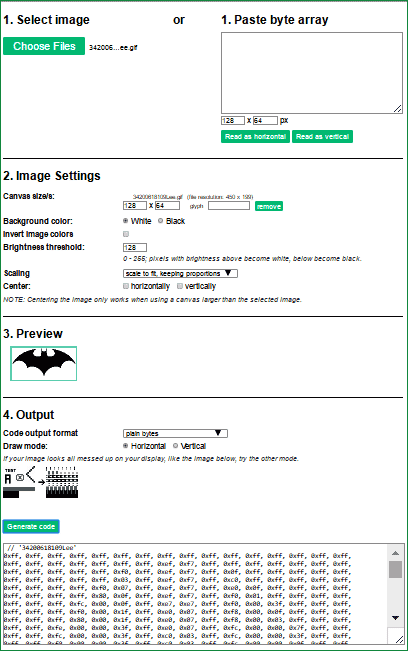   

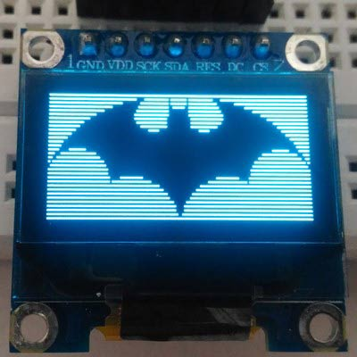{:width="200"}

### Liens

* [Interfacing SSD1306 OLED Display with Arduino](https://circuitdigest.com/microcontroller-projects/arduino-ssd1306-oled-display)
* [How to connect and use an SPI OLED Display](https://www.brainy-bits.com/connect-and-use-a-spi-oled-display/)
* [OLED Arduino Blue 1.3″ SH1106 Display – Quick Start Tutorial](http://henrysbench.capnfatz.com/henrys-bench/arduino-displays/oled-arduino-blue-1-3-sh1106-display-quick-start-tutorial/)


## Moniteurs OLED SSD1306 avec Raspberry Pi

Utilisation d'un des [écrans OLED basés sur SSD1306](https://learn.adafruit.com/monochrome-oled-breakouts) , avec la [bibliothèque Python SSD1306](https://github.com/adafruit/Adafruit_Python_SSD1306) !

Bien qu'ils soient petits (environ un pouce de taille), ces écrans produisent une belle image nette de 128x32 ou 128x64 pixels. Connecter l'écran à un Raspberry Pi est également facile grâce au support de 3,3 volts de l'écran et à l'interface I2C ou SPI.

Ce guide vous expliquera comment connecter l’écran à un Raspberry Pi et comment installer et utiliser la bibliothèque SSD1306 Python. Assurez-vous que votre Raspberry Pi utilise le dernier système d'exploitation Raspbian.

### Câblage Raspberry Pi  

Vous pouvez connecter un OLED au Raspberry Pi à l'aide de l'interface I2C ou SPI du Pi. Si votre OLED prend en charge à la fois I2C et SPI, assurez-vous de vérifier la [configuration des cavaliers de soudure pour afficher la bonne interface](https://learn.adafruit.com/monochrome-oled-breakouts/wiring-1-dot-3-128x64).

>En général, I2C utilise moins de broches mais est plus lent. SPI est très rapide, mais nécessite beaucoup de broches supplémentaires. Choisissez en fonction de vos besoins!

**I2C**  
Pour utiliser le Pi avec un écran I2C, câblez-le comme suit:  
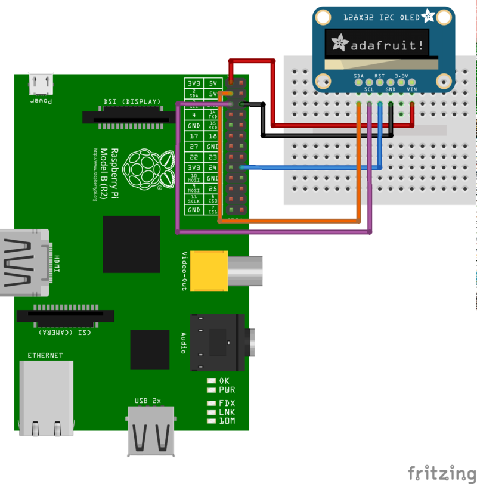{:width="600"}  
NOTE: Assurez-vous d' [activer I2C sur votre Pi](https://learn.adafruit.com/adafruits-raspberry-pi-lesson-4-gpio-setup/configuring-i2c) avant de le brancher! 

*    Connectez la masse de l'écran à la masse du Raspberry Pi (fil noir).
*    Connectez l' écran VIN à Raspberry Pi 3,3 volts (fil rouge).
*    Connectez l’ écran RST au Raspberry Pi GPIO 24 (fil bleu). Vous pouvez également utiliser n'importe quelle broche GPIO numérique libre pour la broche de réinitialisation.
*    Connectez l’ écran SCL au Raspberry Pi SCL (fil violet).
*    Connectez l’ écran SDA au Raspberry Pi SDA (fil orange). 

**SPI**  
Pour utiliser le Pi avec un écran SPI, connectez-le comme suit:
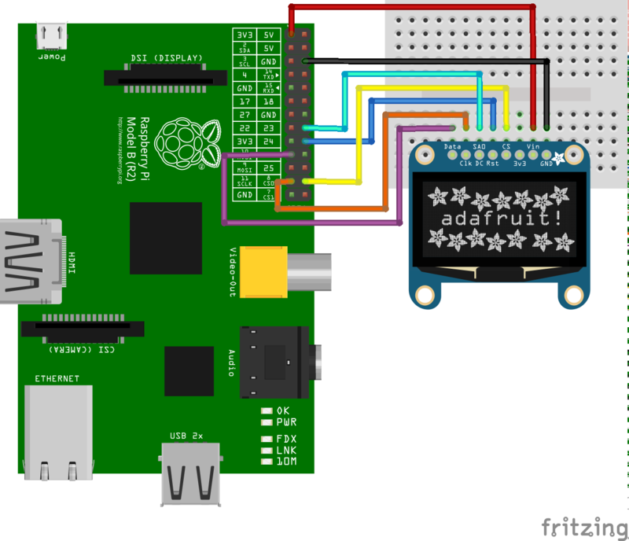{:width="600"}  
Note : Activer le SPI sur le raspberry

* Connectez la masse de l'écran à la masse du Raspberry Pi (fil noir).
* Connectez l' écran VIN à Raspberry Pi 3,3 volts (fil rouge).
* Connectez l’ écran CS à Raspberry Pi CE0 (fil jaune).
* Connectez l’ écran RST au Raspberry Pi GPIO 24 (fil bleu). Vous pouvez également utiliser n'importe  quelle broche GPIO numérique libre pour la broche de réinitialisation.
* Connectez l’ écran CC à Raspberry Pi GPIO 23 (câble cyan). Vous pouvez également utiliser n'importe quelle broche GPIO numérique libre pour la broche CC.
* Connectez l’ écran CLK à Raspberry Pi SCLK (fil orange).
* Connectez les données d'affichage à Raspberry Pi MOSI (fil violet). 

Notez que le câblage ci-dessus utilise le bus matériel SPI du Raspberry Pi pour communiquer avec l'écran. Si vous ne l'avez pas déjà fait avec votre Pi, veillez à éditer le fichier blacklist.conf pour commenter la ligne qui désactive SPI. Redémarrez votre Pi et vous devriez voir que les fichiers /dev/spidev0.0 et /dev/spidev0.1 sont maintenant disponibles.

L'utilisation du matériel SPI est idéale pour obtenir la réponse la plus rapide de l'écran. Toutefois, si vous avez besoin de plus de flexibilité dans l'utilisation des broches, vous pouvez utiliser une implémentation SPI logicielle avec 5 broches GPIO numériques gratuites. Voir l'exemple d'utilisation du code à la page suivante pour plus d'informations sur la configuration du logiciel SPI.

### Les dépendances
Avant d'utiliser la bibliothèque, vous devez vous assurer que quelques dépendances sont installées. Connectez-vous à votre appareil à l'aide de SSH et suivez les étapes ci-dessous.

Si vous utilisez un Raspberry Pi, installez la bibliothèque RPi.GPIO en exécutant:

```
    sudo apt-get update
    sudo apt-get install build-essential python-dev python-pip
    sudo pip install RPi.GPIO 
```

Si vous utilisez un BeagleBone Black, installez la bibliothèque Adafruit_BBIO en exécutant:

```
    sudo apt-get update
    sudo apt-get install build-essential python-dev python-pip
    sudo pip install Adafruit_BBIO 
```

Enfin, sur Raspberry Pi et Beaglebone Black, installez la bibliothèque d'imagerie Python et la bibliothèque smbus en exécutant:

    sudo apt-get install python-imaging python-smbus

Maintenant, pour télécharger et installer le code de la bibliothèque SSD1306 python et des exemples, exécutez les commandes suivantes:

```
sudo apt-get install git
git clone https://github.com/adafruit/Adafruit_Python_SSD1306.git
cd Adafruit_Python_SSD1306
sudo python setup.py install
```

### Utilisation

Dans le sous-répertoire examples, vous trouverez des scripts python qui illustrent l'utilisation de la bibliothèque. Pour vous aider à démarrer, je vais parcourir le code shape.py ci-dessous:

```c
import time

import Adafruit_GPIO.SPI as SPI
import Adafruit_SSD1306

import Image
import ImageDraw
import ImageFont
```

Quelques modules sont d'abord importés, y compris le module Adafruit_SSD1306 qui contient les classes du pilote d'affichage OLED. Vous pouvez également voir certains des modules de la bibliothèque d'imagerie Python tels que Image, ImageDraw et ImageFont en cours d'importation.

```c
# Raspberry Pi pin configuration:
RST = 24
# Note the following are only used with SPI:
DC = 23
SPI_PORT = 0
SPI_DEVICE = 0

# Beaglebone Black pin configuration:
# RST = 'P9_12'
# Note the following are only used with SPI:
# DC = 'P9_15'
# SPI_PORT = 1
# SPI_DEVICE = 0
```

Ensuite, certaines valeurs de configuration sont définies en fonction de la plate-forme. Si vous utilisez le BeagleBone Black, vous devrez commenter les lignes de configuration des broches du Raspberry Pi et décommenter les lignes de configuration du BeagleBone Black.

Si vous souhaitez passer à une autre broche RST ou DC, vous pouvez mettre à jour les valeurs des broches RST et DC respectivement. Vous pouvez également modifier le port et le périphérique SPI, mais je vous recommande de vous en tenir aux interfaces ci-dessus, car elles ont été testées et fonctionnent normalement.

```c
# 128x32 display with hardware I2C:
disp = Adafruit_SSD1306.SSD1306_128_32(rst=RST)

# 128x64 display with hardware I2C:
# disp = Adafruit_SSD1306.SSD1306_128_64(rst=RST)

# Alternatively you can specify an explicit I2C bus number, for example
# with the 128x32 display you would use:
# disp = Adafruit_SSD1306.SSD1306_128_32(rst=RST, i2c_bus=2)

# 128x32 display with hardware SPI:
# disp = Adafruit_SSD1306.SSD1306_128_32(rst=RST, dc=DC, spi=SPI.SpiDev(SPI_PORT, SPI_DEVICE, max_speed_hz=8000000))

# 128x64 display with hardware SPI:
# disp = Adafruit_SSD1306.SSD1306_128_64(rst=RST, dc=DC, spi=SPI.SpiDev(SPI_PORT, SPI_DEVICE, max_speed_hz=8000000))

# Alternatively you can specify a software SPI implementation by providing
# digital GPIO pin numbers for all the required display pins.  For example
# on a Raspberry Pi with the 128x32 display you might use:
# disp = Adafruit_SSD1306.SSD1306_128_32(rst=RST, dc=DC, sclk=18, din=25, cs=22)
```

Sous les valeurs de configuration se trouve la configuration de la classe d'affichage. Vous pouvez créer deux classes, **SSD1306_128_32** ou **SSD1306_128_64** . La classe SSD1306_128_32 représente un affichage 128x32 pixels et la classe SSD1306_128_64 représente un affichage 128x64 pixels.

En plus de la taille de l’affichage, vous configurez également l’interface utilisée par l’affichage dans ces lignes. Les deux premiers exemples utilisent l'interface I2C et doivent uniquement spécifier une broche RST. En interne, la bibliothèque SSD1306 recherchera le numéro de bus I2C par défaut pour la plate-forme et l'utilisera - si vous avez suivi le câblage dans ce guide, vous devez être prêt! Toutefois, si vous devez contrôler explicitement le numéro de bus I2C, le troisième exemple montre comment le spécifier avec un paramètre i2c_bus.

Les trois derniers exemples montrent comment configurer l'interface SPI. Pour le SPI basé sur le hardare, vous devez seulement spécifier la broche RST, la broche DC et le périphérique SPI matériel. Utilisez l'un de ces exemples si vous avez suivi les instructions de ce guide. Toutefois, si vous souhaitez utiliser une interface SPI logicielle, le dernier exemple montre comment spécifier chaque broche SPI pour un Raspberry Pi (pour un BeagleBone Black, il suffit de modifier les valeurs des broches en fonction des broches que vous utilisez).

Décommentez la ligne d'affichage appropriée en fonction de la taille de votre affichage et de l'interface que vous utilisez pour communiquer avec celui-ci. Le code suppose que vous utilisez un écran 128 x 32 pixels communiquant via le matériel I2C. Toutefois, si vous utilisez un écran ou un protocole différent, **décommentez la ligne appropriée** . Assurez-vous de **commenter toutes les autres lignes** qui ne sont pas utilisées!

```c
# Initialize library.
disp.begin()

# Clear display.
disp.clear()
disp.display()

# Create blank image for drawing.
# Make sure to create image with mode '1' for 1-bit color.
width = disp.width
height = disp.height
image = Image.new('1', (width, height))

# Get drawing object to draw on image.
draw = ImageDraw.Draw(image)

# Draw a black filled box to clear the image.
draw.rectangle((0,0,width,height), outline=0, fill=0)
```

Le bit de code suivant initialisera la bibliothèque d’affichage, effacera l’affichage et configurera une classe de dessin PIL pour préparer le dessin. Notez que le tampon d'image est créé en mode 1 bit avec le paramètre '1', ce qui est important car l'affichage ne prend en charge que les couleurs noir et blanc.

```c
# Draw some shapes.
# First define some constants to allow easy resizing of shapes.
padding = 2
shape_width = 20
top = padding
bottom = height-padding
# Move left to right keeping track of the current x position for drawing shapes.
x = padding
# Draw an ellipse.
draw.ellipse((x, top , x+shape_width, bottom), outline=255, fill=0)
x += shape_width+padding
# Draw a rectangle.
draw.rectangle((x, top, x+shape_width, bottom), outline=255, fill=0)
x += shape_width+padding
# Draw a triangle.
draw.polygon([(x, bottom), (x+shape_width/2, top), (x+shape_width, bottom)], outline=255, fill=0)
x += shape_width+padding
# Draw an X.
draw.line((x, bottom, x+shape_width, top), fill=255)
draw.line((x, top, x+shape_width, bottom), fill=255)
x += shape_width+padding
```

Une fois que l'affichage est initialisé et qu'un objet de dessin est préparé, vous pouvez dessiner des formes et des graphiques à l'aide des [PIL's drawing commands](http://effbot.org/imagingbook/imagedraw.htm) . Le code effectue d'abord un petit travail pour redimensionner les dessins en fonction de la taille d'affichage, puis il se déplace de gauche à droite en dessinant chaque forme.

```c
# Load default font.
font = ImageFont.load_default()

# Alternatively load a TTF font.
# Some other nice fonts to try: http://www.dafont.com/bitmap.php
#font = ImageFont.truetype('Minecraftia.ttf', 8)

# Write two lines of text.
draw.text((x, top),    'Hello',  font=font, fill=255)
draw.text((x, top+20), 'World!', font=font, fill=255)
```

Ensuite, le code charge une police par défaut intégrée et dessine quelques lignes de texte. Vous pouvez également charger votre propre police TrueType et l'utiliser pour le rendu du t

```c
# Display image.
disp.image(image)
disp.display()
```

Enfin, l'image créée est écrite dans la mémoire tampon d'affichage, qui doit alors afficher sa mémoire tampon. N'oubliez pas que chaque fois que vous modifiez l'image pour qu'elle soit visible sur l'écran, vous devez appeler les fonctions d'image et d'affichage!

C'est tout ce qu'il y a dans le code shape.py! Vous pouvez exécuter le code en exécutant cette commande dans le répertoire examples:

    sudo python shape.py 


Assurez-vous d’exécuter en tant que root avec la commande sudo pour que le programme ait accès au matériel.  
Si vous exécutez l'exemple de **shapes.py**, vous devriez voir quelque chose comme ceci (sur un affichage 128x64):

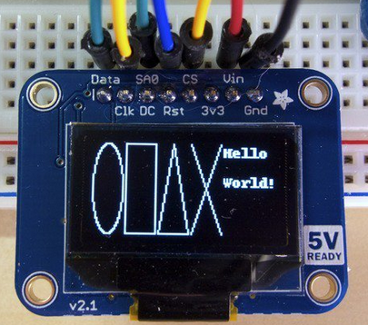{:width="200"}

Découvrez les autres exemples inclus dans la bibliothèque, tels que **animate.py**, qui affiche un outil de défilement de texte animé, et image.py, qui affiche une image chargée à partir d'un fichier. Modifiez la configuration en haut de chaque exemple, comme vous l'avez fait pour l'exemple de **shapes.py** ci-dessus, puis exécutez-les comme si vous utilisiez **shapes.py** mais en remplaçant le nom de fichier approprié.([github, bibliothèque Adafruit Python SSD1306](https://github.com/adafruit/Adafruit_Python_SSD1306))
