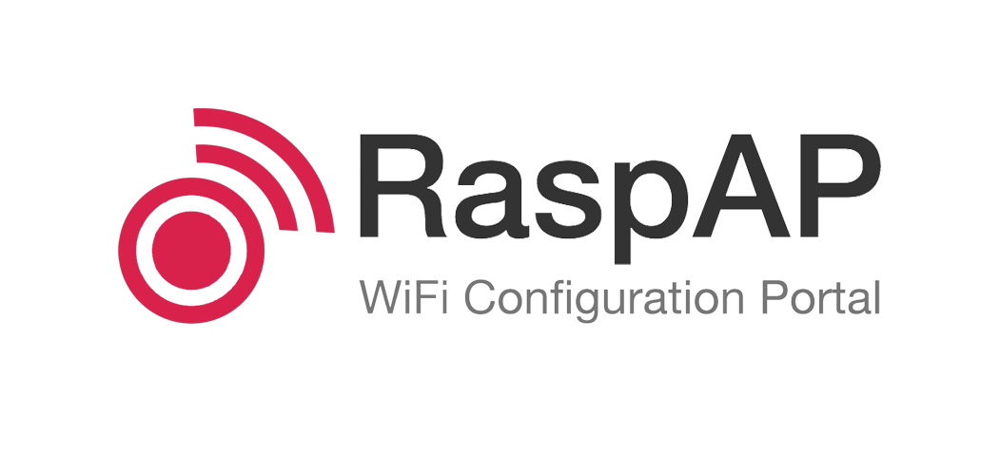
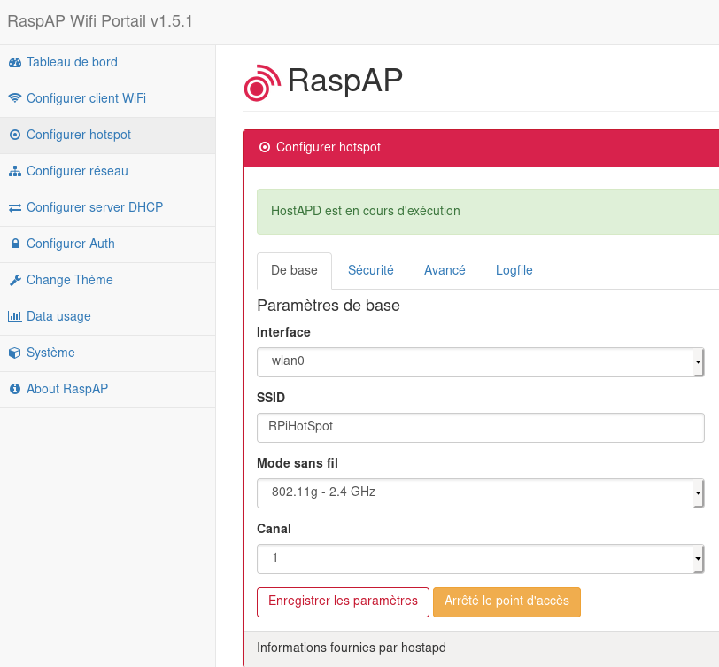
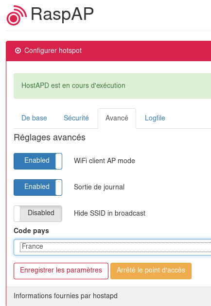

+++
title = 'RaspAP , interface Web pour contrôler le wifi, hostapd et services sur le Raspberry Pi'
date = 2019-08-04 00:00:00 +0100
categories = ['raspberry']
+++
## RaspAP

{:width="300"}

*Une interface Web simple et réactive pour contrôler le wifi, hostapd et les services associés sur le Raspberry Pi.<https://github.com/billz/raspap-webgui>  
Ce projet s’inspire d’un [billet de blog](http://sirlagz.net/2013/02/06/script-web-configuration-page-for-raspberry-pi/) de SirLagz sur l’utilisation d’une page Web plutôt que de ssh pour configurer les paramètres wifi et hostapd sur le Raspberry Pi. J'ai commencé par personnaliser l'interface utilisateur en l'enveloppant dans [SB Admin 2](https://github.com/BlackrockDigital/startbootstrap-sb-admin-2) , un thème d'administration basé sur Bootstrap. Depuis lors, le projet a évolué pour inclure un contrôle accru sur de nombreux aspects d’un RPi en réseau, une sécurité renforcée, une authentification, un programme d’installation rapide, une prise en charge des thèmes, etc. RaspAP a été présenté sur des sites tels que [Instructables](http://www.instructables.com/id/Raspberry-Pi-As-Completely-Wireless-Router/) , [Adafruit](https://blog.adafruit.com/2016/06/24/raspap-wifi-configuration-portal-piday-raspberrypi-raspberry_pi/) , [Raspberry Pi Weekly](https://www.raspberrypi.org/weekly/commander/) et [Awesome Raspberry Pi](https://project-awesome.org/thibmaek/awesome-raspberry-pi), et mis en œuvre dans de nombreux projets.*

### Pré-requis

On part d'une installation existante [Point d'accès wifi dhcpd sur raspberry (Raspbian Buster)](/posts/Hotspot-wifi-dhcpd-raspberry-(Raspbian-Buster)/)  
On remplace les fichiers de configuration par ceux ci-dessous 

**/etc/dhcpcd.conf**

```
hostname
clientid
persistent
option rapid_commit
option domain_name_servers, domain_name, domain_search, host_name
option classless_static_routes
option ntp_servers
require dhcp_server_identifier
slaac private
nohook lookup-hostname

interface wlan0
static ip_address=10.3.141.1/24
static routers=10.3.141.1
static domain_name_server=1.1.1.1 9.9.9.9

# RaspAP uap0 configuration
interface uap0
static ip_address=192.168.50.1/24
nohook wpa_supplicant
```

**/etc/dnsmasq.conf **

```
# RaspAP wlan0 configuration for wired (ethernet) AP mode
interface=wlan0
dhcp-range=10.3.141.50,10.3.141.255,255.255.255.0,12h

# RaspAP uap0 configuration for wireless client AP mode
#interface=lo,uap0               # Use interfaces lo and uap0
#bind-interfaces                 # Bind to the interfaces
#server=8.8.8.8                  # Forward DNS requests to Google DNS
#domain-needed                   # Don't forward short names
#bogus-priv                      # Never forward addresses in the non-routed address spaces
#dhcp-range=192.168.50.50,192.168.50.150,12h
```

**/etc/hostapd/hostapd.conf**

```
driver=nl80211
ctrl_interface=/var/run/hostapd
ctrl_interface_group=0
beacon_int=100
auth_algs=1
wpa_key_mgmt=WPA-PSK
ssid=raspi-webgui
channel=1
hw_mode=g
wpa_passphrase=ChangeMe
interface=wlan0
wpa=1
wpa_pairwise=TKIP
country_code=
## Rapberry Pi 3 specific to on board WLAN/WiFi
#ieee80211n=1 # 802.11n support (Raspberry Pi 3)
#wmm_enabled=1 # QoS support (Raspberry Pi 3)
#ht_capab=[HT40][SHORT-GI-20][DSSS_CCK-40] # (Raspberry Pi 3)

## RaspAP wireless client AP mode
#interface=uap0
```

### Installer RaspAP manuellement

Ces étapes s'appliquent à la dernière version de Raspbian (actuellement Buster ). Les notes des versions antérieures sont fournies, le cas échéant. Commencez par installer git, lighttpd, php7, hostapd et dnsmasq.

    sudo apt-get install git lighttpd php7.1-cgi vnstat hostapd dnsmasq 

Remarque: pour Raspbian Stretch, remplacez php7.1-cgi par php7.0-cgi . Pour Raspbian Jessie et les versions antérieures, utilisez php5-cgi . Après cela, activez PHP pour lighttpd et redémarrez-le pour que les paramètres prennent effet.

    sudo lighttpd-enable-mod fastcgi-php
    sudo service lighttpd restart

Maintenant vient la partie amusante. Pour des raisons de sécurité, l'utilisateur www-data sous lequel lighttpd est exécuté n'est pas autorisé à démarrer ou arrêter des démons, ni à exécuter des commandes telles que ifdown et ifup, comme le souhaite notre page. J'ai donc ajouté l'utilisateur www-data au fichier sudoers, mais avec des restrictions sur les commandes que l'utilisateur peut exécuter. Ajoutez ce qui suit à la fin de **/etc/sudoers** :

```
www-data ALL=(ALL) NOPASSWD:/sbin/ifdown
www-data ALL=(ALL) NOPASSWD:/sbin/ifup
www-data ALL=(ALL) NOPASSWD:/bin/cat /etc/wpa_supplicant/wpa_supplicant.conf
www-data ALL=(ALL) NOPASSWD:/bin/cat /etc/wpa_supplicant/wpa_supplicant-wlan[0-9].conf
www-data ALL=(ALL) NOPASSWD:/bin/cp /tmp/wifidata /etc/wpa_supplicant/wpa_supplicant.conf
www-data ALL=(ALL) NOPASSWD:/bin/cp /tmp/wifidata /etc/wpa_supplicant/wpa_supplicant-wlan[0-9].conf
www-data ALL=(ALL) NOPASSWD:/sbin/wpa_cli -i wlan[0-9] scan_results
www-data ALL=(ALL) NOPASSWD:/sbin/wpa_cli -i wlan[0-9] scan
www-data ALL=(ALL) NOPASSWD:/sbin/wpa_cli -i wlan[0-9] reconfigure
www-data ALL=(ALL) NOPASSWD:/bin/cp /tmp/hostapddata /etc/hostapd/hostapd.conf
www-data ALL=(ALL) NOPASSWD:/etc/init.d/hostapd start
www-data ALL=(ALL) NOPASSWD:/etc/init.d/hostapd stop
www-data ALL=(ALL) NOPASSWD:/etc/init.d/dnsmasq start
www-data ALL=(ALL) NOPASSWD:/etc/init.d/dnsmasq stop
www-data ALL=(ALL) NOPASSWD:/bin/cp /tmp/dhcpddata /etc/dnsmasq.conf
www-data ALL=(ALL) NOPASSWD:/sbin/shutdown -h now
www-data ALL=(ALL) NOPASSWD:/sbin/reboot
www-data ALL=(ALL) NOPASSWD:/sbin/ip link set wlan[0-9] down
www-data ALL=(ALL) NOPASSWD:/sbin/ip link set wlan[0-9] up
www-data ALL=(ALL) NOPASSWD:/sbin/ip -s a f label wlan[0-9]
www-data ALL=(ALL) NOPASSWD:/bin/cp /etc/raspap/networking/dhcpcd.conf /etc/dhcpcd.conf
www-data ALL=(ALL) NOPASSWD:/etc/raspap/hostapd/enablelog.sh
www-data ALL=(ALL) NOPASSWD:/etc/raspap/hostapd/disablelog.sh
www-data ALL=(ALL) NOPASSWD:/etc/raspap/hostapd/servicestart.sh
```

Une fois ces modifications effectuées, `git clone` les fichiers dans **/var/www/**  
Remarque: pour les anciennes versions de Raspbian (avant Jessie, mai 2016), utilisez **/var/www**

    sudo rm -rf /var/www/
    sudo git clone https://github.com/billz/raspap-webgui /var/www/

Déplacez les favicons haute résolution vers la racine Web.

    sudo mv /var/www//dist/icons/* /var/www/ 

Définissez la propriété des fichiers sur l'utilisateur **www-data**

    sudo chown -R www-data:www-data /var/www/

Déplacez le fichier de configuration RaspAP vers le bon emplacement.

    sudo mkdir /etc/raspap
    sudo mv /var/www//raspap.php /etc/raspap/
    sudo chown -R www-data:www-data /etc/raspap

Déplacez les scripts de journalisation HostAPD et de shell de contrôle de service vers l'emplacement approprié.

    sudo mkdir /etc/raspap/hostapd
    sudo mv /var/www//installers/*log.sh /etc/raspap/hostapd 
    sudo mv /var/www//installers/service*.sh /etc/raspap/hostapd

Définissez la propriété et les autorisations pour les scripts de journalisation et de contrôle de service.

    sudo chown -c root:www-data /etc/raspap/hostapd/*.sh 
    sudo chmod 750 /etc/raspap/hostapd/*.sh 

Si **iptables-persistent** n'est pas installé on utilise **rc.local** 

**rc.local**  
Ajoutez les lignes suivantes à **/etc/rc.local** avant de `exit 0` 

    echo 1 > /proc/sys/net/ipv4/ip_forward #RASPAP
    iptables -t nat -A POSTROUTING -j MASQUERADE #RASPAP 
    iptables -t nat -A POSTROUTING -s 192.168.50.0/24 ! -d 192.168.50.0/24 -j MASQUERADE #RASPAP

Forcer le rechargement de nouveaux paramètres dans **/etc/rc.local** 

    sudo systemctl restart rc-local.service
    sudo systemctl daemon-reload


Démasquer et activer le service hostapd.

    sudo systemctl unmask hostapd.service
    sudo systemctl enable hostapd.service

Déplacez le service raspap au bon emplacement et activez-le.

    sudo mv /var/www//installers/raspap.service /lib/systemd/system
    sudo systemctl enable raspap.service

Redémarrez et il devrait être opérationnel!

    sudo reboot

Le nom d'utilisateur par défaut est "admin" et le mot de passe par défaut est "secret".

### Support multilingue

RaspAP utilise [GNU Gettext](https://www.gnu.org/software/gettext/) pour gérer les messages multilingues.  
Pour utiliser RaspAP avec l'une de nos traductions prises en charge, vous devez configurer un package de langue correspondant sur votre RPi. Pour répertorier les langues actuellement installées sur votre système, utilisez les `locale -a` à l'invite du shell. Pour générer de nouveaux paramètres régionaux, exécutez `sudo dpkg-reconfigure locales` et sélectionnez les autres paramètres régionaux souhaités. Les détails sont fournis sur notre [wiki](https://github.com/billz/raspap-webgui/wiki/Translations#raspap-in-your-language) .

Les traductions suivantes sont actuellement gérées par le projet:  
*Deutsch , Français , Italiano , Português , Svenska , Nederlands , 简体中文 (Chinese Simplified) , Čeština , Русский , Español , Finnish , Sinhala , Türkçe*

### Support HTTPS

Un tutoriel sur l'activation de HTTPS est disponible, [RaspAP , support HTTPS pour un serveur local](/posts/RaspAP-support-HTTPS-pour-un-serveur-local/) et sur le [wiki (en)](https://github.com/billz/raspap-webgui/wiki/HTTPS--support) .

### Services optionnels

OpenVPN et TOR sont deux services supplémentaires qui fonctionnent parfaitement sur le RPi et constituent un bon moyen d'étendre l'utilité de votre routeur WiFi. J'ai commencé à utiliser des interfaces pour administrer ces services. Tout le monde n'en aura pas besoin, donc pour le moment, ils sont désactivés par défaut. Vous pouvez les activer en modifiant ces options dans **/var/www//includes/config.php** :

```php
// Optional services, set to true to enable.
define('RASPI_OPENVPN_ENABLED', false );
define('RASPI_TORPROXY_ENABLED', false );
```

>noter que ce ne sont que l'interface utilisateur pour le moment. Si l'intérêt est suffisant, je vais compléter la fonctionnalité pour des écrans d'administration facultatifs. 

## Après redémarrage

### Point d'accès (par défaut)

{:width="600"}

Après le redémarrage à la fin de l'installation, le réseau sans fil sera configuré comme <u>point d'accès</u> :

* Adresse IP : 10.3.141.1
* Nom d'utilisateur : admin
* Mot de passe : secret
* Gamme DHCP : 10.3.141.50 à 10.3.141.255.255
* SSID : RPiHotSpot
* Mot de passe : ChangeMe

Remarque : Comme son nom l'indique, le programme d'installation rapide est un excellent moyen de configurer rapidement un nouveau PA. Cependant, il ne détecte pas automatiquement la configuration unique de votre RPi.  
Les meilleurs résultats sont obtenus en connectant un RPi à Ethernet (eth0) ou en tant que client WiFi, également connu sous le nom de mode géré (managed mode), avec wlan0. Pour ce dernier point, consultez [cette FAQ](https://github.com/billz/raspap-webgui/wiki/FAQs#how-do-i-prepare-the-sd-card-to-connect-to-wifi-in-headless-mode). Veuillez [lire ceci](https://github.com/billz/raspap-webgui/wiki/Reporting-issues) avant de signaler un problème.

### Client AP et Wifi simultanés

RaspAP vous permet de créer facilement un AP avec une configuration client Wifi. Avec votre RPi configuré en mode géré, activez le point d'accès à partir de l'onglet Avancé de l'onglet Configurer le point d'accès en faisant glisser le sélecteur de mode AP du client Wifi. Sauvegardez les paramètres et démarrez le hotspot. Le mode géré AP est fonctionnel sans redémarrage.  
{:width="300"}  
Note : Pour un Raspberry Pi fonctionnant en mode géré (managed mode) sans connexion eth0, cette configuration doit être activée avant un redémarrage.

