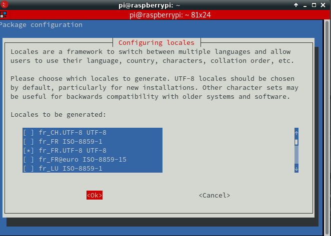
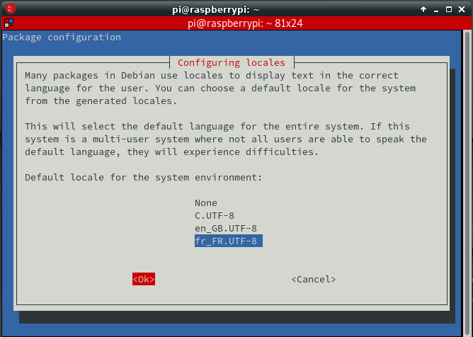
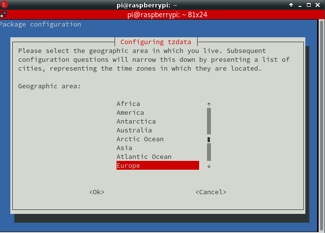
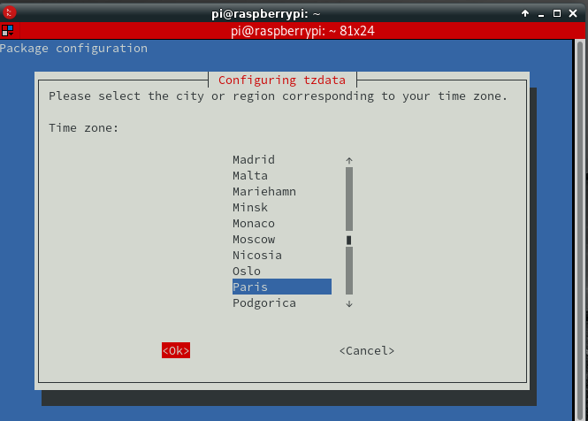
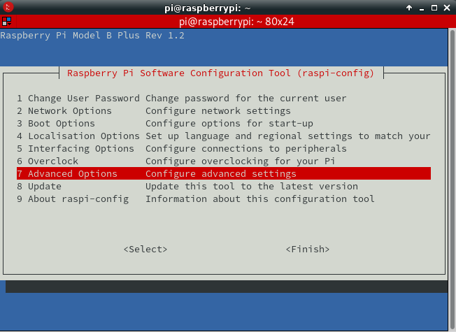
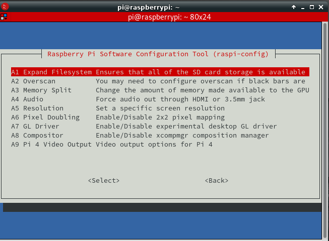
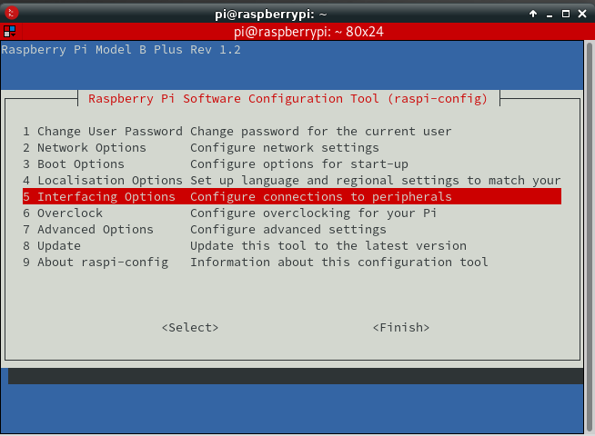
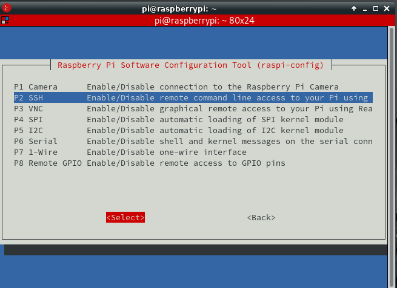
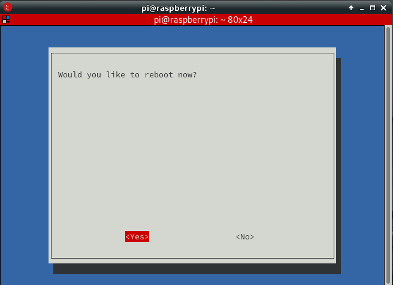

+++
title = 'Raspbian Lite Buster sur carte Raspberry PI'
date = 2019-08-05 00:00:00 +0100
categories = ['raspberry']
+++
## raspbian-lite (debian)

### SDcard

Sur un ordinateur , connecté une SDcard via un interface USB et relever son identification par `dmesg`  
[Télécharger le ZIP](https://www.raspberrypi.org/downloads/raspbian/) de la dernière image **Raspbian buster Lite**  

Identifier le périphérique SDcard après insertion

    dmesg

```
[10742.227702] usb 1-7: New USB device found, idVendor=05e3, idProduct=0745, bcdDevice= 9.03
[10742.227708] usb 1-7: New USB device strings: Mfr=0, Product=1, SerialNumber=2
[10742.227712] usb 1-7: Product: USB Storage
[10742.227715] usb 1-7: SerialNumber: 000000000903
[10742.229654] usb-storage 1-7:1.0: USB Mass Storage device detected
[10742.237357] scsi host5: usb-storage 1-7:1.0
[10743.258751] scsi 5:0:0:0: Direct-Access     Generic  STORAGE DEVICE   0903 PQ: 0 ANSI: 6
[10743.259573] sd 5:0:0:0: Attached scsi generic sg4 type 0
[10743.715208] sd 5:0:0:0: [sde] 15564800 512-byte logical blocks: (7.97 GB/7.42 GiB)
[10743.716453] sd 5:0:0:0: [sde] Write Protect is off
[10743.716460] sd 5:0:0:0: [sde] Mode Sense: 21 00 00 00
[10743.717563] sd 5:0:0:0: [sde] Write cache: disabled, read cache: enabled, doesn't support DPO or FUA
[10743.726016]  sde: sde1 
[10743.733076] sd 5:0:0:0: [sde] Attached SCSI removable disk
```

La sdcard est attachée à /dev/sde

Décompresser le fichier zip 

    unzip 2019-07-10-raspbian-buster-lite.zip

"flasher" la SDcard avec le fichier **2019-07-10-raspbian-buster-lite.img** (fichier disponible au 01/08/2019) 

    sudo dd bs=4M if=2019-07-10-raspbian-buster-lite.img of=/dev/sde && sync

>**ATTENTION !!!** Pas d'accès à la carte raspberry en mode terminal par la liaison série ou SSH  
*Les dernières versions de Raspbian nécessitent un écran et un clavier, car il n'est plus possible de se connecter directement par la liaison série ou en SSH au Raspberry par défaut.  

### Activer la liaison série et SSH

Cela nécessite 2 opérations

1. Activer le lancement de SSH au boot ,placer dans la partition **boot** de la carte SD un fichier nommé **ssh**, vide et sans extension.  
2. Activer la liaison série ,il faut ajouter `enable_uart=1` à la fin du fichier de configuration **config.txt**  et avant insertion de la SDcard dans le raspberry  

**Pour réaliser ces 2 opérations:**  
Retirer le lecteur USB/SDcard puis le réinsére  
identifier le périphérique SDcard avec la commande `dmesg`

    dmesg

```
[11948.379238]  sde: sde1 sde2
[11948.383312] sd 5:0:0:0: [sde] Attached SCSI removable disk
```

On identifie 2 partitions sde1 et sde2  
Montage de la SDcard (sde1 qui correspond au **boot**) sur un dossier temporaire

```
mkdir -p temp  # dossier temporaire
sudo mount /dev/sde1 temp # Montage de la SDcard (sde1 qui correspond au boot) sur un dossier temporaire
sudo touch temp/ssh # Ajout du fichier ssh pour activer le lancement de SSH au boot
sudo su -c "echo 'enable_uart=1' >> temp/config.txt" # Modifier le fichier config.txt pour activer la liaison série 
sudo umount temp # Démontage et insertion SDcard dans le raspberry 
rm -r temp  # suppression dossier temporaire
```

>Remplacer **sde** suivant le dmesg (sdb,sdc,sdd,etc...)

### Liaison USB/Série

**ATTENTION** , il faut utiliser une liaison USB/Série pour l'installation de raspian-lite   
{:width="150"}

|interface USB/Série|couleur  liaison|Raspberry|
| ----------------- |:--------------:| :-------:|
| GND | Brun | 6 |
| Rxd | Blanc | 8 (Txd) |
| Txd | Vert | 10 (Rxd) |

Exécuter le logiciel de communication (minicom ou screen)  

    sudo minicom # Débit/Parité/Bits:115200 8N1,Contrôle de flux matériel:Non,Contrôle de flux logiciel:Non
        OU
    sudo screen /dev/ttyUSB0 115200

>**Insérer la SDCard dans le logement du Raspberry ,connecter le cordon réseau et la liaison série**  

### Alimenter la carte raspberry

brancher la micro-usb d'alimentation  sur la carte raspberry et enfin le DC-Pack sur le secteur  
patienter quelques minutes...  

login/motde passe : pi/raspberry  
Relever adresse ip pour éventuellement se conncter en SSH

    ip addr show 

```
2: eth0: <BROADCAST,MULTICAST,UP,LOWER_UP> mtu 1500 qdisc pfifo_fast state UP group default qlen 0
    link/ether b8:27:eb:66:0e:13 brd ff:ff:ff:ff:ff:ff
    inet 192.168.0.35/24 brd 192.168.0.255 scope global noprefixroute eth0
       valid_lft forever preferred_lft forever
```

Se connecter en SSH

    ssh pi@192.168.0.35

```
The authenticity of host '192.168.0.35 (192.168.0.35)' can't be established.
ECDSA key fingerprint is SHA256:TptnJKjyF54r29VMNOlPTkb8gYwEZhDSbOtrq4NUtTI.
Are you sure you want to continue connecting (yes/no/[fingerprint])? yes
Warning: Permanently added '192.168.0.35' (ECDSA) to the list of known hosts.
pi@192.168.0.35's password: 
Linux raspberrypi 4.19.57+ #1244 Thu Jul 4 18:42:50 BST 2019 armv6l

The programs included with the Debian GNU/Linux system are free software;
the exact distribution terms for each program are described in the
individual files in /usr/share/doc/*/copyright.

Debian GNU/Linux comes with ABSOLUTELY NO WARRANTY, to the extent
permitted by applicable law.
Last login: Sat Aug  3 09:57:24 2019

SSH is enabled and the default password for the 'pi' user has not been changed.
This is a security risk - please login as the 'pi' user and type 'passwd' to set a new password.

pi@raspberrypi:~ $ 
```

### Mise à jour raspbian

Mise à jour des paquets

	sudo apt update && sudo apt -y upgrade

Mise à jour distribution Raspbian

	sudo apt dist-upgrade


### Paramétrage de base

Lancer la configuration

    sudo raspi-config

* 4 Localisation Options
     * I1 Change Locale  **fr_FR.UTF-8 UTF-8**  
{:width="400"}  
{:width="400"}  
Cette opération est parfois "longue"...
     * I2 Change timezone **Europe/Paris**  
{:width="400"}  
{:width="400"}  
* 7 Advanced Options : A1 Expand Filesystem  
{:width="400"}  
{:width="400"}  
{:width="400"}  
* 5 Interfacing Options : P2 SSH enable  
{:width="400"}  
{:width="400"}  
{:width="400"}  
{:width="400"}  
* Finish et reboot  
{:width="400"}  

## Compléments

### Mise à jour du Firmware raspberry (optionnel)

><font color="red">**uniquement sur les raspberry de type 2 , 3 et 4**<br>Cette opération prend de 3 à 5 minutes...</font>  

L’utilitaire **rpi-update** permet de mettre à jour le Firmware de la carte Raspberry.

	sudo rpi-update

```
 *** Raspberry Pi firmware updater by Hexxeh, enhanced by AndrewS and Dom
 *** Performing self-update
  % Total    % Received % Xferd  Average Speed   Time    Time     Time  Current
                                 Dload  Upload   Total   Spent    Left  Speed
100 15719  100 15719    0     0  29770      0 --:--:-- --:--:-- --:--:-- 29827
 *** Relaunching after update
 *** Raspberry Pi firmware updater by Hexxeh, enhanced by AndrewS and Dom
 *** We're running for the first time
 *** Backing up files (this will take a few minutes)
 *** Backing up firmware
 *** Backing up modules 4.19.57+
PARTSIZE:268435968
#############################################################
WARNING: 'rpi-update' updates to pre-releases of the linux 
kernel tree and Videocore firmware.

'rpi-update' should only be used if there is a specific 
reason to do so - for example, a request by a Raspberry Pi 
engineer.

DO NOT use 'rpi-update' as part of a regular update process.

##############################################################
Would you like to proceed? (y/N)
 *** Downloading specific firmware revision (this will take a few minutes)
  % Total    % Received % Xferd  Average Speed   Time    Time     Time  Current
                                 Dload  Upload   Total   Spent    Left  Speed
100   168    0   168    0     0    382      0 --:--:-- --:--:-- --:--:--   383
100 89.8M  100 89.8M    0     0   657k      0  0:02:20  0:02:20 --:--:-- 1088k
 *** Updating firmware
 *** Updating kernel modules
 *** depmod 4.19.63-v7+
 *** depmod 4.19.63-v7l+
 *** depmod 4.19.63+
 *** Updating VideoCore libraries
 *** Using HardFP libraries
 *** Updating SDK
 *** Running ldconfig
 *** Storing current firmware revision
 *** Deleting downloaded files
 *** Syncing changes to disk
 *** If no errors appeared, your firmware was successfully updated to 87843c15bb3236ec394c7e7fbc74dba5548d1456
 *** A reboot is needed to activate the new firmware
```

>**Il faut impérativement redémarrer le raspberry**

### Paramétrage supplémentaire

Connexion **pi/raspberry**  

    ssh pi@192.168.0.35

Paramétrage supplémentaire

    sudo raspi-config

* 5 Interfacing options (activer I2C et SPI)
     * P4 SPI **enable**
     * P5 I2C **enable**
* Finish


### IP fixe (Lan et Wlan)

**Ethernet (Lan)**

Je vais vous donner deux méthodes  
La première (Méthode 1) est celle recommandée, mais dans mon cas, ça n'a pas marché!!!   
La seconde (Méthode 2) est celle qui m'a finalement permis d'avoir une IP statique

**Méthode 1** : La manière officielle de définir une adresse IP statique :  

Si vous avez besoin (ou voulez) définir une adresse IP statique sur votre réseau, suivez ces étapes :

Modifier le fichier de configuration **/etc/dhcpcd.conf**

    sudo nano /etc/dhcpcd.conf

Ajoutez ces lignes à la fin du fichier (n'oubliez pas de les remplacer par vos paramètres réseau)

```
interface eth0 static
ip_address=192.168.1.200/24
static routers=192.168.1.1
static domain_name_servers=192.168.1.1 
```

Sauvegardez le fichier et quittez (CTRL+O, Enter, CTRL+X)  
Redémarrez le Raspberry Pi pour que les changements prennent effet.

    sudo reboot 

Après le redémarrage, votre IP devrait être réparée. Vérifiez-le avec la commande ifconfig ou ip a

**Méthode 2** : Une autre façon de faire la même chose :

Suivez ces étapes :  
Désinstaller dhcpcd

    sudo apt-get remove dhcpcd5

Editer le fichier **/etc/network/interfaces**

    sudo nano /etc/network/interfaces

Collez ces lignes

```
auto eth0
iface eth0 inet static
 address 192.168.0.200
 netmask 255.255.255.0
 gateway 192.168.0.254
 dns-nameservers 9.9.9.9 # facultatif

# wifi
auto wlan0
iface wlan0 inet static
  address 192.168.42.1
  netmask 255.255.255.0

```

N'oubliez pas d'éditer les valeurs avec vos paramètres réseau (la passerelle (gateway) est l'adresse IP du routeur, et vous pouvez conserver ces adresses IP comme serveurs DNS)  
Sauvegardez le fichier et quittez (CTRL+O, Enter, CTRL+X)  
Redémarrer le Raspberry Pi

    sudo reboot 

Vous devriez obtenir quelque chose comme ceci  
ifconfig


**WiFi (Wlan**

Pour activer le WiFi en mode Lite, vous devez d'abord définir votre pays WiFi  
Pour cela, utilisez l'outil raspi-config

    sudo raspi-config

Allez dans **4 Localisation Options** > **I4 Change Wi-fi Country**  
Sélectionnez votre pays dans la liste **FR France** puis OK  
**Wi-fi country set to FR** OK  
Finish  

Une fois que vous avez configuré le pays, vous pouvez redémarrer raspi-config pour configurer votre connexion Wifi :

Aller à **2 Network Options**  
Sélectionner **N2 Wi-fi **  
**Please enter SSID**  puis OK   
**Please enter passphrase** puis OK  
Finish  

### Wifi Raspberry Pi 3

<u>Si vous n'utilisez pas raspi-config</u> , éditer le fichier **/etc/wpa_supplicant/wpa_supplicant.conf**

    sudo nano /etc/wpa_supplicant/wpa_supplicant.conf

Rendez-vous à la fin du fichier et ajoutez la définition de votre box en suivant ce template :

```
network={
    ssid="nomDeLaBox"
    psk="cléDeSécurité"
    key_mgmt=WPA-PSK
}
```

Remplacez nomDeLaBox par le SSID de votre box internet et cléDeSécurité par le mot de passe de votre box.  
Si votre box utilise une clé de type WEP plutôt que du WPA/WPA2, insérez la valeur NONE dans key_mgmt, pour obtenir quelque chose de la forme key_mgmt=NONE.  
Si vous vous connectez à une box ouverte, non protégé par un mot de passe, vous n’aurez besoin que de renseigner le SSID.  
Une fois que vous avez modifiez la configuration Wi-Fi, sauvegarder le fichier en faisant CTRL+O, puis quittez-le avec CTRL+X !  
Votre Raspberry Pi 3 est maintenant configurer pour se connecter à internet via sa puce Wi-Fi. Il ne vous reste plus qu’à démarrer le Wi-Fi de la Raspberry Pi avec cette commande :

    sudo ip link set wlan0 up

### Redémarrage 

redémarrage du Raspberry pour prendre en compte la nouvelle configuration au niveau du systeme:

    sudo reboot

Connexion ssh

    ssh pi@192.168.0.36

Vérification

    ip addr

```
1: lo: <LOOPBACK,UP,LOWER_UP> mtu 65536 qdisc noqueue state UNKNOWN group default qlen 1000
    link/loopback 00:00:00:00:00:00 brd 00:00:00:00:00:00
    inet 127.0.0.1/8 scope host lo
       valid_lft forever preferred_lft forever
    inet6 ::1/128 scope host 
       valid_lft forever preferred_lft forever
2: eth0: <BROADCAST,MULTICAST,UP,LOWER_UP> mtu 1500 qdisc pfifo_fast state UP group default qlen 1000
    link/ether b8:27:eb:54:7e:6a brd ff:ff:ff:ff:ff:ff
    inet 192.168.0.36/24 brd 192.168.0.255 scope global eth0
       valid_lft forever preferred_lft forever
    inet6 2a01:e34:ee6a:b270:4c21:bb28:8ace:b25c/64 scope global mngtmpaddr noprefixroute dynamic 
       valid_lft 86376sec preferred_lft 86376sec
    inet6 fe80::ae8:5030:3e94:e921/64 scope link 
       valid_lft forever preferred_lft forever
3: wlan0: <BROADCAST,MULTICAST,UP,LOWER_UP> mtu 1500 qdisc pfifo_fast state UP group default qlen 1000
    link/ether b8:27:eb:01:2b:3f brd ff:ff:ff:ff:ff:ff
    inet 192.168.0.16/24 brd 192.168.0.255 scope global wlan0
       valid_lft forever preferred_lft forever
    inet6 2a01:e34:ee6a:b270:cd30:3c59:dcf2:2359/64 scope global mngtmpaddr noprefixroute dynamic 
       valid_lft 86376sec preferred_lft 86376sec
    inet6 fe80::4e20:7515:5b7e:8a29/64 scope link 
       valid_lft forever preferred_lft forever
```

### Pilotes dongle wifi Raspberry Pi 1 et 2

Dongle Wifi/USB Realtek ou Ralink  

#### Raspberry Pi 1 et 2

Les dépôts raspbian "non-free" du raspberry sont validés par défaut

    deb http://mirrordirector.raspbian.org/raspbian/ jessie main contrib non-free rpi

Les pilotes sont également installés par défaut sur le raspberry pi

    sudo apt install firmware-ralink firmware-realtek
    firmware-ralink is already the newest version.
    firmware-realtek is already the newest version.


#### Cartes processeur arm

Ajouter la source "non-free" au fichier /etc/apt/sources.list

    sudo -s
    echo "deb http://http.debian.net/debian/ jessie main contrib non-free" >> /etc/apt/sources.list

Mettre à jour la liste des paquets disponibles et installer les paquets **firmware-ralink** et  **firmware-realtek**:

    sudo apt-get update && sudo apt-get install firmware-ralink firmware-realtek
