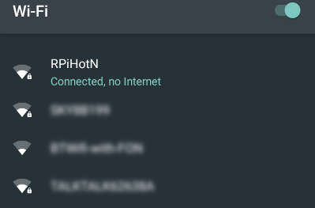

+++
title = 'Point d'accès wifi dhcpd sur raspberry (Raspbian Buster)'
date = 2019-08-06 00:00:00 +0100
categories = ['raspberry']
+++
# Méthode dhcpcd Raspberry Pi - Hotspot/Access Point

*Il existe de nombreux guides pour la création d'un point d'accès Raspberry Pi, mais à partir de Raspbian 9 Stretch, la configuration du réseau a été modifiée, ce qui signifie que de nombreux guides sont obsolètes. Ce guide traite donc de la configuration d’un "hotspot" Raspberry Pi pour Raspbian 9 Stretch et 10 Buster, il fonctionne également pour Raspbian 8 Jessie.  
Article original :  [Raspberry Pi - Hotspot/Access Point dhcpcd method](http://www.raspberryconnect.com/network/item/333-raspberry-pi-hotspot-access-point-dhcpcd-method)* 


### Objectif 

* Ce guide explique comment configurer un hotspot permanent pour les routages Internet, pour les RPi avec ports réseau et les hotspots non routés pour Pi Zero / W. 

### Exigences 

Cela a été testé sur Raspbian Jessie et Raspbian Stretch. Pour voir quelle version vous avez, entrez la commande `lsb_release -a`

* Raspberry Pi 4
* Raspberry Pi 3 / 3B +
* Raspberry Pi 1,2 avec un dongle Wifi *,
* Raspberry Pi Zero W et Zero avec clé WiFi * (point d'accès Internet non utilisable car il ne possède pas de port Ethernet). 

* Certains dongles WiFi ne fonctionnent pas en mode ad-hoc ou avec le pilote nl80211 utilisé dans ce guide pour les réseaux Wi-Fi intégrés RPi4, RPi 3, RPi3 B + et zéro W, vous pouvez donc le vérifier avant de commencer.

Pour voir si votre clé USB WiFi peut être utilisée comme point d’accès, entrez la commande; iw dev, allez à la section "Modes d’interface pris en charge:" et recherchez * AP

### Remarques

Dnsmasq bug: dans les versions inférieures à 2.77 sur Jessie et Stretch, un bogue récent peut empêcher le point d'accès de démarrer pour certains utilisateurs. Cela peut être résolu en supprimant les données racine-dns. Cela peut être bénéfique de le faire avant de commencer le reste de l’installation car il a été rapporté que le faire après l’installation pour les utilisateurs concernés ne fonctionnait pas, mais vous ne saurez pas si c’est un problème jusqu’à la fin de l’installation.

vérifiez votre version avec: `dpkg -s dnsmasq`  
les versions 2.77 et supérieures sont ok.  
Sinon, essayez la commande `sudo apt-get purge dns-root-data`

Remarque sur les noms de périphérique réseau Raspbian Buster et Stretch  
Pour Raspbian Stretch, le nom des pilotes réseau, appelé Noms d'interface réseau prévisibles, a été modifié. Il peut être différent pour les connexions wlan0 et wlan1 habituelles pour les connexions wifi et eth0 pour les connexions Ethernet. Bien que la version officielle de Raspbian Stretch de la Fondation semble conserver les anciens noms standard, du moins au moment de la rédaction, cela n’est peut-être pas toujours le cas. Pour ce guide, je vais utiliser wlan0 comme périphérique utilisé.

Pour vérifier le nom du périphérique correspondant à votre configuration, entrez la commmande `iw dev` et notez le nom "Interface".  
Pour le wifi, commencez par wl, remplacez le nom de votre appareil par toute référence à wlan0 dans l'article, les scripts et les fichiers de configuration.

## Étape 1:

Pour commencer, le client hotspot hostapd et le serveur DNS léger Dnsmasq doivent être installés.  
Ouvrez une session de terminal.  
Raspbian avec les dernières mises à jour en entrant les commandes:

	sudo apt-get update
	sudo apt-get upgrade

Pour installer hostapd et dnsmasq ,entrez la commande:

	sudo apt -y install hostapd dnsmasq

Les installateurs auront configuré le programme pour qu’ils s’exécutent au lancement de pi et les aient activés. Pendant que nous définissons le "hotspot", il faut arrêter les services.

	sudo systemctl stop hostapd
	sudo systemctl stop dnsmasq

Le fichier du "hotspot" peut maintenant être configuré. Celui-ci contient le nom du signal WiFi auquel vous devrez vous connecter (SSID) et le mot de passe de sécurité.

### Configuration Hostapd

À l’aide d’un éditeur de texte, éditez le fichier de configuration hostapd. Ce fichier n'existera pas à ce stade, il sera donc vide.

	sudo nano /etc/hostapd/hostapd.conf

```
interface=wlan0
driver=nl80211
ssid=RPiHotSpot
hw_mode=g
channel=6
wmm_enabled=0
macaddr_acl=0
auth_algs=1
ignore_broadcast_ssid=0
wpa=2
wpa_passphrase=1234567890
wpa_key_mgmt=WPA-PSK
wpa_pairwise=TKIP
rsn_pairwise=CCMP
```

* L'interface sera wlan0
* Le pilote nl80211 fonctionne avec le WiFi intégré Raspberry Pi 3 & Zero W, mais vous devrez vérifier que votre clé Wi-Fi est compatible et qu’elle peut utiliser le mode Point d’accès.   
Pour plus d'informations sur les dongles wifi, voir [elinux.org/RPi_USB_Wi-Fi_Adapters](http://elinux.org/RPi_USB_Wi-Fi_Adapters)
* Le SSID est le nom du signal WiFi diffusé depuis le RPi, auquel vous vous connecterez avec les paramètres WiFi de votre tablette ou de votre téléphone.
* Wpa_passphrase est le mot de passe que vous devez entrer lorsque vous connectez un appareil pour la première fois au point d'accès public de votre Raspberry Pi. Cela devrait être au moins 8 caractères et un peu plus difficile à deviner que mon exemple. 

Pour enregistrer le fichier de configuration, appuyez sur ctrl & o et pour quitter nano, appuyez sur Ctrl & x.

Maintenant, le fichier par défaut doit être mis à jour pour indiquer l'endroit où le fichier de configuration est stocké.

	sudo nano /etc/default/hostapd

Ajouter

	DAEMON_CONF="/etc/hostapd/hostapd.conf"

Vérifiez que DAEMON_OPTS = "" est précédé d'un #  

### Configuration DNSmasq

Ensuite, nous devons mettre à jour le fichier **dnsmasq.conf**. Il existe deux configurations selon que vous ayez besoin d’un accès Internet ou non.

<u>DNSmasq Config 1 - Pas d'Internet</u>  
Ouvrez le fichier dnsmasq.conf avec

	sudo nano /etc/dnsmasq.conf

Allez au bas du fichier et ajoutez les lignes suivantes

```
#RPiHotspot config - No Intenet
interface=wlan0
domain-needed
bogus-priv
dhcp-range=192.168.50.150,192.168.50.200,255.255.255.0,12h
``` 

sauvegarde (ctl & o) et quitter (ctrl & x)

<u>DNSmasq Config 2 - Internet routé</u>

Ouvrez le fichier dnsmasq.conf 

    sudo nano /etc/dnsmasq.conf

Allez au bas du fichier et ajoutez les lignes suivantes 

```

#RPiHotspot config - Internet
interface=wlan0
bind-dynamic 
domain-needed
bogus-priv
dhcp-range=192.168.50.150,192.168.50.200,255.255.255.0,12h
```

et sauvegarde (ctl & o) et quitter (ctrl & x)

## Étape 2:

Maintenant que hostapd et dnsmasq sont configurés, nous devons maintenant apporter quelques modifications au fichier d'interface, le fichier **dhcpcd.conf**.

### Fichier d'interfaces

Le fichier d'interface n'est pas requis et doit être vide de toute configuration réseau. Selon la version de Raspbian que vous avez, ce fichier peut toujours contenir la configuration réseau.

    sudo nano /etc/network/interfaces

Si votre fichier contient plus que les 5 premières lignes standard comme celle-ci

```
# interfaces(5) file used by ifup(8) and ifdown(8)
# Please note that this file is written to be used with dhcpcd
# For static IP, consult /etc/dhcpcd.conf and 'man dhcpcd.conf'
# Include files from /etc/network/interfaces.d:
source-directory /etc/network/interfaces.d
```

Faites une copie de votre fichier, puis supprimez les lignes en excès du fichier d'interface.  
Faire d’abord une sauvegarde de votre fichier d’interfaces

    sudo cp /etc/network/interfaces /etc/network/interfaces-backup


### DHCPCD.conf

Ensuite, nous devons mettre à jour le fichier **dhcpcd.conf**

    sudo nano /etc/dhcpcd.conf

puis faites défiler jusqu'au bas du fichier et ajoutez les lignes 

```
nohook wpa_supplicant
interface wlan0
static ip_address=192.168.50.10/24
static routers=192.168.50.1
```

Si vous configurez le point d'accès Internet routé, incluez également

    static domain_name_servers=1.1.1.1 9.9.9.9

maintenant enregistrer (ctrl & o) et quitter (ctrl & x)

La ligne 'nohooks wpa_supplicant' arrêtera le réseau wifi de démarrer si vous avez une entrée dans **/etc/wpa_supplicant/wpa_supplicant.conf**. Si cela n'est pas fait, le réseau Wi-Fi aura priorité sur le hotspot.

Hostapd est masqué , on le démasque sinon il ne se lancera pas au démarrage

    sudo systemctl unmask hostapd


>Ce qui suit n’est valable que si vous souhaitez que les appareils aient un accès Internet.  
Sinon, passez à **Test du "hotspot"**

###  Configurer la traduction d’adresse réseau

Pour qu'Internet soit disponible lorsqu'un câble Ethernet est connecté, le transfert IP doit être activé.

    sudo nano /etc/sysctl.conf

chercher la ligne

```
# Uncomment the next line to enable packet forwarding for IPv4
#net.ipv4.ip_forward=1
```

et retirez le #  

```
# Uncomment the next line to enable packet forwarding for IPv4
net.ipv4.ip_forward=1
```

maintenant enregistrer (ctrl & o) et quitter (ctrl & x).Cela démarrera le transfert IP au prochain démarrage   
pour l’activer immédiatement

    sudo sh -c "echo 1 > /proc/sys/net/ipv4/ip_forward"


Il faut ensuite ajouter des règles permettant à tout périphérique connecté au point d'accès de pouvoir utiliser Internet. Ceci est fait avec les règles de la table IP qui devront être chargées à chaque démarrage du Raspberry Pi.   
Il existe un programme appelé **iptables-persistent** qui peut le faire

    sudo apt install iptables-persistent

Vous aurez deux écrans ‘config’ de sauvegarde des règles, dites “Oui” aux deux

Exécutez les commandes suivantes pour créer la traduction réseau entre le port ethernet eth0 et le port wifi wlan0

```
sudo iptables -t nat -A POSTROUTING -o eth0 -j MASQUERADE
sudo iptables -A FORWARD -i eth0 -o wlan0 -m state --state RELATED,ESTABLISHED -j ACCEPT
sudo iptables -A FORWARD -i wlan0 -o eth0 -j ACCEPT
```

Vous pouvez vérifier ce qui est dans les tableaux avec

    sudo iptables -t nat -S

```
-P PREROUTING ACCEPT
-P INPUT ACCEPT
-P POSTROUTING ACCEPT
-P OUTPUT ACCEPT
-A POSTROUTING -o eth0 -j MASQUERADE
```

Pour que cela se produise au redémarrage (afin que vous n’ayez pas à le taper à chaque fois), exécutez

    sudo sh -c "iptables-save > /etc/iptables/rules.v4" 

L’outil **iptables-persistent** que vous avez installé rechargera automatiquement la configuration au démarrage.

### Tester le "hotspot"

>La configuration du hotspot est maintenant terminée.  
Pour vérifier que la configuration est correcte, **redémarrer le RPi**.

Une fois que le RPi est opérationnel et que l'icône du réseau Wi-Fi près de l'horloge doit maintenant comporter deux flèches faisant face aux directions opposées Icône de mode Raspbian Pixel AP Cela signifie que c'est un point d'accès. Sur une tablette, un téléphone ou un ordinateur portable, recherchez les signaux wifi. Vous devriez en voir un pour RPiHotSpot.

Sélectionnez ceci comme signal wifi auquel vous connecter. Le mot de passe correspond à ce que vous avez configuré dans le fichier hostapd.conf. De mon exemple, il est 1234567890

  
*Les signaux **wifi locaux** à portée sur Android. Vous verrez RPiHotSpot et non RPiHotN*

* Pour SSH et VNC, l'adresse IP de connexion est 192.168.50.10. Si vous avez configuré le RPi en tant que serveur Web, utilisez la même adresse IP pour afficher la page Web.
* Pour ssh, utilisez `ssh pi@192.168.50.10` 
* Pour vnc utiliser 192.168.50.10::5900

Si vous avez configuré la <u>configuration Internet routée</u>.   
Connectez un câble Ethernet entre le Raspbery Pi et votre routeur puis attendez quelques secondes.  
Le hotspot permettra désormais aux appareils wifi connectés d’utiliser Internet ainsi que le Raspberry Pi  
Vous pouvez vérifier les règles de transfert , en mode terminal sur le raspberry pi  

    sudo iptables -t nat -L

```
Chain PREROUTING (policy ACCEPT)
target     prot opt source               destination         

Chain INPUT (policy ACCEPT)
target     prot opt source               destination         

Chain POSTROUTING (policy ACCEPT)
target     prot opt source               destination         
MASQUERADE  all  --  anywhere             anywhere            

Chain OUTPUT (policy ACCEPT)
target     prot opt source               destination  
```


## Suppression du hotspot

>Si vous ne souhaitez plus continuer à utiliser Hotspot, vous pouvez rétablir le Raspberry Pi dans une configuration wifi standard en procédant comme suit.

Arrêtez les services Hostapd et dnsmasq avec les commandes

    sudo systemctl disable dnsmasq
    sudo systemctl disable hostapd


Dans le fichier /etc/dhcpcd.conf, <u>supprimez les lignes ajoutées au bas du fichier</u>.

```
#Static Hotspot
nohook wpa_supplicant
interface wlan0
static ip_address=192.168.50.10/24
static routers=192.168.50.1
static domain_name_servers=8.8.8.8
```

Si vous aviez une configuration précédente dans votre fichier d’interfaces et que vous avez effectué une sauvegarde, vous pouvez restaurer votre fichier d’interfaces original avec la commande

    sudo mv /etc/network/interfaces-backup /etc/network/interfaces

Si vous n'avez pas configuré de point d'accès Internet routé, vous avez terminé. Après un redémarrage, votre RPi ne sera plus un point d'accès. Pour les points d'accès Internet routés, vous devez également procéder comme suit:

Puis désactivez le transfert IP

    sudo nano /etc/sysctl.conf

chercher l'entrée

```
# Uncomment the next line to enable packet forwarding for IPv4
net.ipv4.ip_forward=1
```

et ajoutez un # comme suit

```
# Uncomment the next line to enable packet forwarding for IPv4
# net.ipv4.ip_forward=1
```

Supprimer le fichier des règles ipv4

    sudo rm /etc/iptables/rules.v4

Ensuite, redémarrez et le Raspberry Pi reviendra à la configuration wifi standard.


## Liens

* [Raspberry Pi - Auto WiFi Hotspot Switch - Direct Connection](http://www.raspberryconnect.com/network/item/331-raspberry-pi-auto-wifi-hotspot-switch-direct-connection)  
*Un script permettant à Raspberry Pi de se connecter à un routeur wifi connu ou de générer automatiquement **un point d'accès non Internet** si aucun réseau n'est trouvé. Vous pouvez alors utiliser SSH ou VNC en déplacement et basculer entre le hotspot et le réseau domestique sans redémarrage.  
Ceci convient au Pi Zero W qui n'a pas de port réseau ou à quiconque n'a pas besoin d'un point d'accès Internet sur un Raspberry Pi 3 ou RPi 3B+, RPi 4. Juste pour un accès Wifi direct à l'IP lorsque vous êtes en déplacement.*

* [Raspberry Pi - Auto WiFi Hotspot Switch Internet](http://www.raspberryconnect.com/network/item/330-raspberry-pi-auto-wifi-hotspot-switch-internet)  
*Un script permettant à Raspberry Pi de se connecter à un routeur wifi connu ou de générer automatiquement **un point d'accès Internet** si aucun réseau n'est trouvé. Vous pouvez alors utiliser SSH ou VNC en déplacement et basculer entre le hotspot et le réseau sans redémarrage.*
* [Raspberry Pi - Auto WiFi Hotspot Switch](http://www.raspberryconnect.com/network/item/327-raspberry-pi-auto-wifi-hotspot-switch)  
*Un script pour passer d'un réseau WiFi à un HotSpot WiFi sans redémarrage. Si le réseau Wifi est perdu, le RPi génère un hotspot Wifi, puis se reconnectera au réseau WiFi lorsqu'il sera à nouveau disponible.*

* [Raspberry PI 3 Auto WiFi Hotspot if no Internet](http://www.raspberryconnect.com/network/item/315-raspberry-pi-3-auto-wifi-hotspot-if-no-internet)  
*J'utilise un Raspberry Pi 3 sur lequel je veux me connecter via SSH à partir de ma tablette Android ou mon téléphone lorsque je ne suis pas à portée de mon routeur domestique.  
Mes exigences sont pour quand le pi est à la maison, il se connecte à mon routeur personnel ou à d'autres routeurs connus pour qu'il soit disponible sur le réseau local.   
Si aucun routeur n'est trouvé quand il est démarré, alors il va créer un hotspot wifi, qui n'est pas connectable à l'Internet, et je peux me connecter via SSH au RPi d'un autre périphérique et contrôler la caméra ou exécuter d'autres scripts personnalisés.

* [OpenVPN configuration management](https://github.com/billz/raspap-webgui/issues/147)

