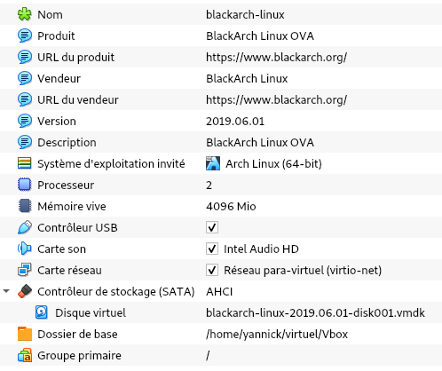

+++
title = 'BlackArch Linux'
date = 2019-08-15 00:00:00 +0100
categories = ['archlinux', 'outils']
+++
# BlackArch Linux

[{:width="100"}](https://www.blackarch.org/)  
*[BlackArch](https://www.blackarch.org/) est une distribution de tests de pénétration basée sur Arch Linux qui fournit un grand nombre d'outils de cybersécurité. Il s'agit d'une distribution open-source créée spécialement pour les testeurs d'intrusion et les chercheurs en sécurité. Le référentiel contient plus de 2000 outils qui peuvent être installés individuellement ou en groupes. BlackArch Linux est compatible avec les installations existantes d'Arch Linux*

* [3 distributions Linux pentesting](https://mylittleblog.fr/post/outilshacking/)
* Utiliser et  tester ce genre de distributions
    * <https://www.newbiecontest.org/index.php>
    * <https://www.root-me.org/?lang=fr>
    * <https://n-pn.fr/forum/index.php>
    * <https://w3challs.com/>
    * <https://halls-of-valhalla.org/beta/challenges>

## VirtualBox



Importation OVA  

```bash
cd /srv/virtuel/Vbox
vboxmanage import --vsys 0 --eula accept blackarch-linux-2019.06.01.ova 
```


## Installation BlackArch

La section suivante illustre comment configurer le dépôt de paquets de Black Arch ainsi que la procédure d’installation de paquets. BlackArch supporte l’installation de fichiers binaires précompilé sainsi que l’installation à l’aide du code source original des paquets.

BlackArch est compatible avec une installation de base d’Arch Linux. Il fait office de dépôt non-officiel. Si vous désirez utiliser une image ISO à la place, visitez la section [Live ISO](http://www.blackarch.org/download.html#iso).

### Installer le dépôt

Exécuter [strap.sh](https://blackarch.org/strap.sh) en tant que **root** et suivez les instructions suivantes :  

```
curl -O https://blackarch.org/strap.sh
sha1sum strap.sh # doit être egal à 9f770789df3b7803105e5fbc19212889674cd503
chmod +x strap.sh
sudo ./strap.sh
```

Si tout ok , la fin du message est le suivant

```
    [+] BlackArch Linux is ready!
```

Mettez ensuite à jour la liste des paquets en exécutant :  

    sudo pacman -Syyu

### Installation de paquets

Vous pouvez désormais installer des outils directement du dépôt de BlackArch

1. Afin d’obtenir la liste de tous les outils disponibles exécutez  
`pacman -Sgg |grep blackarch |cut -d' ' -f2 |sort -u`
2. Afin d’installer tous les outils, exécutez  
`pacman -S blackarch`
3. Afin d’installer une catégorie complète d’outils, exécutez  
`pacman -S blackarch-<category>`
4. Afin d’obtenir la liste des catégories de paquets disponibles, exécutez  
`pacman -Sg |grep blackarch`

### Installation des paquets depuis le code source

Il existe une méthode alternative à l’installation de paquets sous forme binaire. BlackArch vous offre la possibilité d’obtenir le code source directement du dépôt officiel du paquet désiré, et BlackArch le compilera pour vous. Vous trouverez les fichiers PKGBUILD sur [github](https://github.com/BlackArch/blackarch/tree/master/packages). Afin d’obtenir le dépôt en entier, vous pourrez utiliser l’outil [blackman](https://github.com/BlackArch/blackman).

* En premier lieu,vous devez installer blackman. Si vous avez déjà configuré le dépôt de paquets de BlackArch sur votre système, tel qu’indiqué au début de ce document, vous vous pouvez installer blackman à l’aide de pacman en utilisant :  
`pacman -S  blackman`
* Vous pouvez installer blackman depuis les sources :  

```
     mkdir blackman
     cd  blackman
     wget https://raw2.github.com/BlackArch/blackarch/master/packages/blackman/PKGBUILD
     # S'assurer de  l'integrite du  fichier PKGBUILD avec:
     makepkg -s
```

* Vous pouvez également installer blackman depuis les dépôts AUR  
* `<votre assistant AUR> -S blackman`

### Utilisation de Blackman

Blackman est un outil simple à utiliser. Cependant, les paramètres peuvent être différent de ce qu’offrent des gestionnaires de paquets tel que pacman.  
Les exemples ci-dessous illustrent les cas d’utilisation de base.

* Télécharger, compiler et installer un paquet :  
`sudo blackman -i paquet`
* Télécharger, compiler et installer un groupe entier :  
`sudo blackman -g groupe`
* Télécharger, compiler et installer tous les outils BlackArch :  
`sudo blackman -a`
* Lister les catégories disponibles :  
`blackman -l`
* Lister les outils d’une catégorie :  
`blackman -p category`

### Installation d’un LiveCD, netinstall, ou d’Arch Linux

Vous pouvez installer BlackArch depuis l’une des images ISO fournies (live ou netinstall. Voir <https://www.blackarch.org/download.html#iso>.  

Voici les étapes à réaliser une fois le système démarré depuis une ISO.

* Installer le paquet blackarch-installer : `sudo pacman -S blackarch-installer`
* Exécuter : `sudo blackarch-install`


### Blackmate

Blackmate est un générateur pour la liste des outils du système d'exploitation Linux BlackArch, conçu pour le wm Xfce4. Le script récupère les derniers outils et génère une nouvelle entrée dans le menu blackarch

Installation

```
sudo -s
git clone https://github.com/Anyon3/blackmate /usr/share/blackmate
cd /usr/share/blackmate
sh blackmate.sh
```


