+++
title = 'Installer et configurer un serveur Archlinux'
date = 2019-08-20 00:00:00 +0100
categories = ['archlinux']
+++
## Comment installer et configurer Arch Linux en tant que serveur


*installer et configurer Arch Linux en tant que serveur.[Article original](https://www.howtoforge.com/tutorial/install-arch-linux-server/)*

### Étape 1 - Téléchargez l'ISO et créez une clé USB de démarrage

Téléchargez la dernière image ISO Arch Linux sur le [site Web officiel d'Arch Linux](https://www.archlinux.org/download/)

Une fois que l'image ISO Arch Linux téléchargée est terminée, insérez une clé USB vide dans l'ordinateur sur lequel vous avez téléchargé le fichier ISO. Recherchez le nom du périphérique de la clé USB en exécutant la commande suivante.

    lsblk 

Sortie:

```
      NAME   MAJ:MIN RM   SIZE RO TYPE MOUNTPOINT
sda      8:0    0 223,6G  0 disk
/dev/sda1   8:1    0  37,3G  0 part /
/dev/sda2   8:2    0 186,3G  0 part /home
sdb      8:16   1  14,8G  0 disk
/dev/sdb1   8:17   1  14,8G  0 part
```

Écrivez l'image ISO Arch Linux sur la clé USB en utilisant la commande "dd":

    sudo dd if=/path-of-arch-iso-image /usb-flash-drive

Exemple:

    sudo dd if=/home/neocode/iso/archlinux-2015.09.01-dual.iso /dev/sdb1

Après l’écriture de l’image ISO Arch sur la clé USB, insérez-la dans l’ordinateur qui servira de serveur et configurez le premier périphérique de démarrage sur le lecteur USB. Choisissez **"Boot Arch Linux (x86_64)"** à l'écran de démarrage et vous obtiendrez une invite de texte.

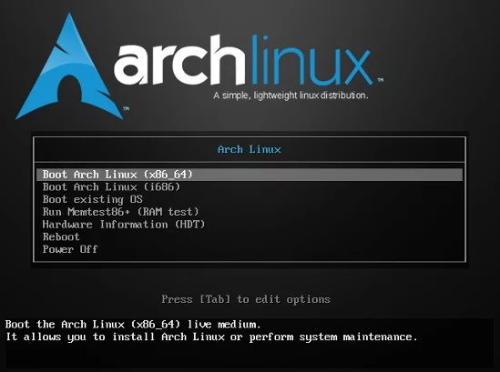

### Étape 2 - Connectez le serveur à Internet

Pour installer Arch Linux, assurez-vous que vous êtes déjà connecté à Internet et que la connexion fonctionne correctement. Vous pouvez tester cela avec la commande ping.

    ping -c 3 google.com 

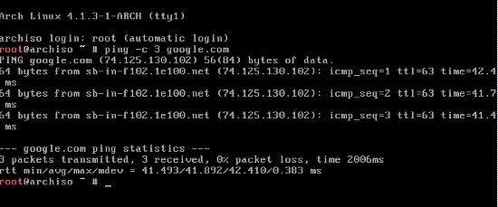


### Étape 3 - Créer et monter la partition

Dans cette étape, nous utilisons la commande cfdisk pour créer la partition d'installation, utilisez le type de partition "dos". Les partitions que nous allons créer sont root (/) pour le système de fichiers / et swap pour le périphérique de swap. /dev/sda est un nœud de périphérique de notre disque dur.

    cfdisk /dev/sda 

Sélectionnez le type d'étiquette [dos].

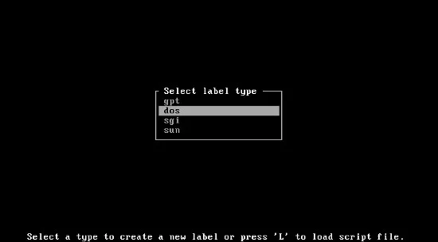

Nous avons 80 Go d'espace libre:

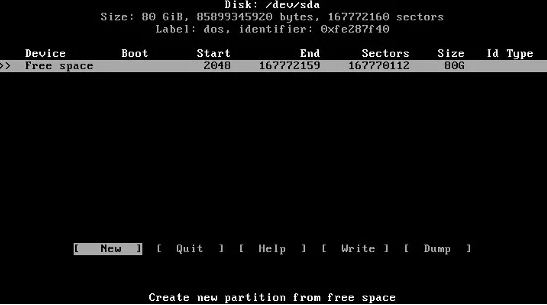

Créez une partition pour root (/):

```
[New] -> Enter
Partition Size -> 76G
Primary or Extended -> Select Primary
Select [Bootable] -> Enter
```

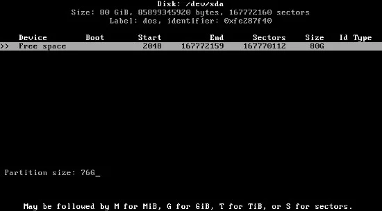

Créez une partition pour swap:

```
[New] -> Enter
Partition Size -> 4G
Primary or Extended -> Select Primary
Select [Write] -> Enter -> type: yes
Select [Quit]
```

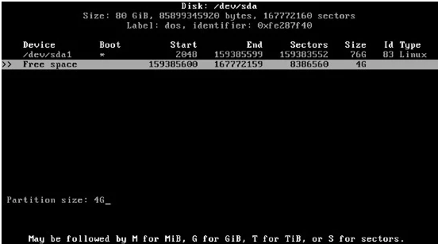

Formatez la partition /dev/sda1 pour "root" avec le système de fichiers ext4 à l'aide de la commande mkfs.ext4:

    mkfs.ext4 /dev/sda1

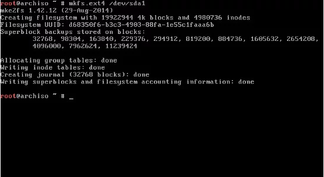

Formatez la partition /dev/sda2 pour "swap" à l'aide de la commande "mkfswap":

    mkswap /dev/sda2 

Activez la partition swap en utilisant la commande "swapon":

    swapon /dev/sda2 

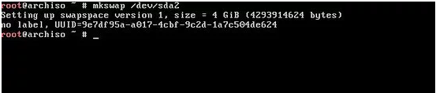

Montez maintenant la partition racine (/dev/sda1) sur /mnt.

    mount /dev/sda1 /mnt 

### Étape 4 - Installer le système de base

Avant de commencer l’installation du système de base, vous pouvez éditer le fichier **/etc/pacman.d/mirrorlist** pour vous assurer que votre miroir préféré est le premier de la liste.

    nano /etc/pacman.d/mirrorlist 

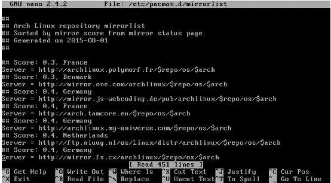

Une copie de cette liste de miroirs sera également installée par pacstrap sur votre nouveau système.

Vous pouvez copier l'URL du miroir le plus proche et le coller en haut de la liste en appuyant sur la touche *ALT + 6* en haut de la ligne, utilisez *Page Up* pour aller en haut et coller en appuyant sur *Ctrl + u* . Appuyez sur *Ctrl + x* et tapez "y" pour enregistrer et quitter.

Nous installons le système de base en utilisant le script pacstrap. Le groupe de packages base-devel doit être installé lorsque vous envisagez de compiler le logiciel à partir d'AUR.

    pacstrap -i /mnt base base-devel 

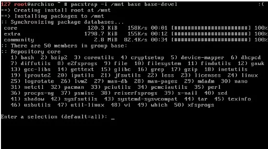

### Étape 5 - Générer fstab

Générez le fichier fstab avec les UUID en tant que noms de périphériques à l'aide de la commande suivante:

    genfstab -U -p /mnt >> /mnt/etc/fstab

Vérifions maintenant si le fichier "fstab" a été créé avec succès.

    cat /mnt/etc/fstab 

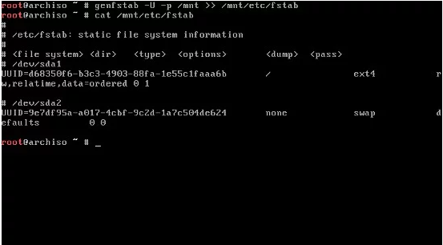

### Étape 6 - Intégrez le système nouvellement installé

Nous allons maintenant changer le répertoire racine apparent du disque sur le programme d'installation.

    arch-chroot /mnt 

### Étape 7 - Configurer la connexion réseau

Identifiez le nom du périphérique réseau en exécutant la commande suivante:

    ip link 

Sortie:

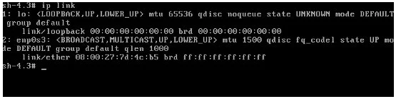

Dans ce cas, nous avons un seul port Ethernet avec le nom enp0s3 . Nous allons maintenant configurer ce port Ethernet pour qu'il obtienne automatiquement une adresse IP par dhcpcd lorsque le système démarre.

    systemctl enable dhcpcd@enp0s3.service

### Étape 8 - Définir la langue, les préférences locales et les fuseaux horaires

Dans cette étape, nous définirons la langue, l'heure et l'emplacement par défaut du système. Ouvrez le fichier **/etc/locale.gen**:

    nano /etc/locale.gen 

Vous aurez une très longue liste de langues. Recherchez votre langue et commentez-la. Par exemple, nous utilisons le langage "anglais américain", sans commentaire en_US.UTF-8 UTF-8 et en_US ISO-8859-1 . Ctrl + x et tapez 'y' pour enregistrer et quitter.

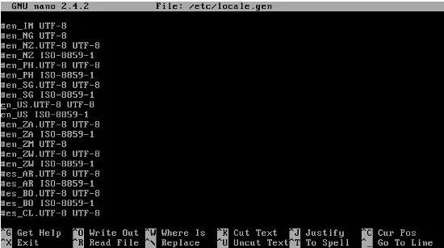

Générez les paramètres régionaux et définissez les préférences à l'aide de la commande locale-gen :

    locale-gen 
    echo LANG=en_US.UTF-8 > /etc/locale.conf 
    export LANG=en_US.UTF-8 

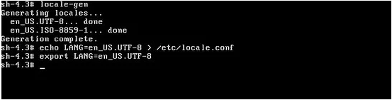

Avant de définir le fuseau horaire, vous pouvez rechercher le fuseau horaire approprié en exécutant la commande suivante:

    ls /usr/share/zoneinfo/ 

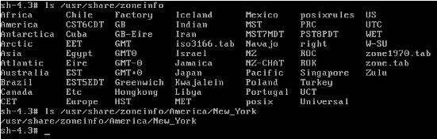

Par exemple, nous utilisons le fuseau horaire "America" et la sous-zone "New_York".  
Créez maintenant un lien symbolique pour activer le fuseau horaire:

    ln -s /usr/share/zoneinfo/America/New_York > /etc/localtime

Définissez l'horloge matérielle sur UTC:

    hwclock --systohc --utc

### Étape 9 - Définir le référentiel Arch Linux

Dans cette étape, nous allons configurer le référentiel Arch Linux. Ouvrir le fichier /etc/pacman.conf

    nano /etc/pacman.conf 

Activez le référentiel multilib. Celles-ci sont importantes pour les installations 64 bits d’Arch Linux qui souhaitent exécuter et créer des applications 32 bits. Pour activer le référentiel, supprimez les commentaires des lignes suivantes:

```
[multilib]
Include = /etc/pacman.d/mirrorlist
```

Ajoutez ensuite les référentiels utilisateurs non officiels:

```
[archlinuxfr]
SigLevel = Never
Server = http://repo.archlinux.fr/$arch
```


Enregistrez et quittez, enfin mettez à jour le référentiel Arch Linux avec la commande suivante:

    pacman -Sy 

### Étape 10 - Définir le nom d'hôte

Ecrivez votre nom d’hôte dans le fichier /etc/hostname:

    echo your_hostname > /etc/hostname

Exemple:

    echo archserver > /etc/hostname

Vous pouvez remplacer "archserver" par le nom que vous souhaitez utiliser pour votre machine.  
Maintenant, vérifiez si le nom d’hôte a bien été créé avec la commande suivante:

    cat /etc/hostname 


### Étape 11 - Créer un nouvel utilisateur et donner des privilèges à SUDO

Exécutez la commande suivante pour créer un utilisateur système Linux pour le serveur. Cet utilisateur sera utilisé pour se connecter au serveur et nous lui donnerons les privilèges SUDO afin que l'utilisateur puisse effectuer des tâches administratives.

    useradd -m -g users -G wheel,storage,power -s /bin/bash USER_NAME

Exemple :

    useradd -m -g users -G wheel,storage,power -s /bin/bash archuser
    passwd USER_NAME 

Installez le paquet sudo and bash-completion:

    pacman -S sudo bash-completion

Ouvrez le fichier /etc/sudoers,

    nano /etc/sudoers 

trouver et décommenter la ligne suivante:

    %wheel ALL=(ALL) ALL


### Étape 12 - Créez un mot de passe pour l'utilisateur root

Créez un mot de passe pour l'utilisateur root:

    passwd 

### Étape 13 - Installez le serveur SSH

Maintenant, installez le paquet du serveur ssh:

    pacman -S openssh 

Activez le démarrage automatique du service ssh au démarrage du système:

    systemctl enable sshd.service 

### Étape 14 - Installer et configurer GRUB

Installez le paquet grub et os-prober:

    pacman -S grub os-prober 

Installez grub sur le disque dur:

    grub-install --recheck /dev/sda 

Générez la configuration de GRUB:

    grub-mkconfig -o /boot/grub/grub.cfg 

### Étape 15 - Quittez chroot et démontez le système de fichiers

Déconnectez-vous de la session chroot:

    exit 

Puis supprimez le système de fichiers racine:

    umount -R /mnt 

Redémarrez Arch Linux:

    reboot 

### Étape 16 - Connectez-vous au serveur via ssh

Vous pouvez maintenant vous connecter à votre serveur Arch Linux via ssh:

    ssh user-name@ip-of-server

Exemple: 

    ssh archuser@10.0.2.15

### Conclusion

Vous avez maintenant un serveur Arch Linux installé sur votre ordinateur en tant que serveur. 