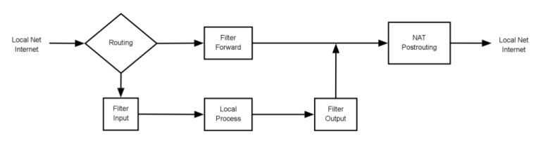

+++
title = 'Configurer un pare-feu avec Iptables'
date = 2019-08-25 00:00:00 +0100
categories = parefeu
+++
## Configurer un pare-feu avec Iptables

**COPIE de l'article publié par [kikinovak](https://www.microlinux.fr/author/kikinovak/) le 1 février 2019**

Cet article décrit pas à pas la configuration d’un pare-feu sur un système Linux. Il s’agit là d’une introduction détaillée sous forme d’atelier pratique, et qui s’adresse aux administrateurs en herbe aussi bien qu’aux experts qui souhaitent réviser leurs bases. Tous les exemples de cette présentation ont été mis en pratique sur une machine tournant sous CentOS 7, et j’ai fait de mon mieux pour m’affranchir des spécificités de cette distribution.

### Généralités

Le terme de « pare-feu » (ou firewall) peut désigner plusieurs choses.

*    Tout type de matériel qui agit comme une passerelle entre Internet et le réseau local.
*    Une application installée sur la machine et censée améliorer la sécurité.

En ce qui nous concerne, il s’agira très précisément d’un filtre de paquets pour la sécurisation du trafic TCP/IP. Ce filtre devra analyser tous les paquets réseau qui entrent dans la machine et qui la quittent. Une série de tests décidera si les paquets ont le droit de passer ou s’ils doivent être bloqués.

### Netfilter

Le système de gestion de paquets réseau du noyau Linux s’appelle Netfilter. La commande utilisée pour le configurer est iptables.

Voici un schéma simplifié du cheminement d’un paquet TCP/IP dans le kernel.



*    Traditionnellement, les schémas de pare-feu montrent l’Internet « dangereux » à gauche, puis le pare-feu, et enfin à droite le réseau local « sécurisé ». Ce n’est pas le cas dans ce schéma, où les paquets entrant dans la machine depuis la gauche peuvent provenir aussi bien d’Internet que du réseau local. Il en est de même pour les paquets qui sortent du pare-feu à droite.
*    *Routing* : En fonction de l’adresse IP et du numéro de port du paquet, le kernel décide si le paquet doit être traité localement ou s’il doit être transmis vers une interface réseau et donc vers une autre machine du réseau local ou même de l’Internet.
*    *Filter Input* : Une série de tests basés sur un certain nombre de règles décident si le paquet est accepté pour être traité par des applications locales ou non.
*    *Local Process* : Il s’agit là tout simplement de l’ensemble des applications qui traitent – ou qui produisent – des paquets IP sur la machine locale, c’est-à-dire tous les services réseau : sshd, httpd, etc.
*    *Filter Output* : Une autre série de tests basés sur une autre série de règles établit si le paquet a le droit de quitter le kernel.
*    *Filter Forward* : Ce filtre effectue des tests sur les paquets qui sont transmis sans être traités et décide s’ils ont le droit de continuer leur chemin.
*    *NAT Postrouting* : Au cas où la machine locale assure la connexion Internet pour d’autres machines grâce au relais de paquets (Masquerading), cette étape gère la manipulation nécessaire des paquets.
*    Le filtre de paquets gèrera les étapes *Filter Input, Filter Output, Filter Forward* et, le cas échéant, *NAT Postrouting*.
*    Les parties *Routing* et *Local Process* du schéma concernent les fonctions réseau du kernel ou des services réseau communs et n’ont rien à voir avec le filtre de paquets.

### Les différentes actions

C’est le kernel qui gère la transmission des paquets provenant d’une interface réseau ou générés par une application locale. À chacune des étapes du système de filtrage, il a respectivement trois alternatives.

*    **DENY** : la transmission du paquet est tout bonnement refusée, sans message d’erreur. Le paquet tombe à la trappe, dans le nirvana numérique. Il n’existe plus.
*    **REJECT** : la transmission du paquet est refusée, avec un message d’erreur. Les conséquences pour le paquet sont les mêmes que pour un DENY. La différence, c’est que le destinataire est informé par un paquet ICMP (Internet Control Message Protocol) du fait que son paquet a été refusé.
*    **ACCEPT** : le paquet est transmis.

### Les tables

L’idée de base d’un système Netfilter, c’est qu’un paquet IP traverse différents endroits dans le kernel, qui testent à partir d’une série de règles si le paquet est autorisé ou non. Si c’est le cas, le paquet est transmis. Si ce n’est pas le cas, le paquet est supprimé ou renvoyé au destinataire. Trois tables contrôlent le filtre Netfilter.

*    La table **filter** : cette table contient généralement l’ensemble des règles pour le filtre de paquets à proprement parler.
*    La table **nat** : cette table est active uniquement si la fonction de relais des paquets du kernel (IP Masquerading) a été activée. Elle permet de modifier l’adresse des paquets qui entrent dans le kernel depuis l’extérieur ou alors qui en sortent à nouveau (Network Address Translation).
*    La table **mangle** : elle permet de procéder à diverses manipulations des paquets IP. Cette table est réservée à une série d’opérations très spécifiques, et nous ne la traiterons pas ici.

### Les chaînes

Chacune de ces trois tables prévoit à son tour une série de chaînes de règles.

*    Table **filter** : INPUT, FORWARD et OUTPUT
*    Table **nat** : PREROUTING, INPUT, OUTPUT et POSTROUTING
*    Table **mangle** : PREROUTING, INPUT, FORWARD, OUTPUT et POSTROUTING

Ces chaînes de règles sont indépendantes les unes des autres. Il existe donc bien trois chaînes INPUT, deux chaînes FORWARD, deux chaînes PREROUTING, deux chaînes POSTROUTING et trois chaînes OUTPUT.

Lorsqu’une documentation se réfère à « la chaîne OUTPUT » sans plus de précisions de la table à laquelle appartient la chaîne, il s’agit dans tous les cas de la table filter, qui est de loin la plus importante.

La même chose vaut d’ailleurs pour la commande `iptables`. L’option -t permet d’indiquer la table pour laquelle on souhaite définir des règles. Si l’on omet cette option, c’est automatiquement la table filter qui est sélectionnée.

### Fonctionnement de base

Lorsqu’un paquet IP rencontre une chaîne de règles dans son cheminement à travers le kernel, celui-ci vérifie les règles en question l’une après l’autre.

*    Dès qu’une règle s’applique à un paquet, l’action prévue dans la règle est effectuée : transmettre le paquet, le supprimer ou le renvoyer au destinataire.
*    Lorsqu’aucune des règles ne peut s’appliquer pour le paquet, c’est la politique par défaut qui entre en vigueur. Là encore, on peut se retrouver avec les trois cas de figure : transmettre, supprimer, rejeter.

La configuration d’un pare-feu consiste donc à définir la politique par défaut ainsi qu’une série de règles pour chacune des chaînes de filtres essentielles.

### Avant de mettre la main à la pâte

Tous les exemples qui suivent ont été mis en pratique sur une machine tournant sous CentOS 7. Depuis la version 7, CentOS utilise `firewalld`, une couche d’abstraction supplémentaire à la sauce Red Hat, dont on peut se demander à quoi elle peut bien servir, vu qu’elle utilise `iptables` sous le capot. Quoi qu’il en soit, pour éviter que `firewalld` ne nous tire dans les pattes, nous allons désactiver le service et supprimer le paquet correspondant.

    $ sudo systemctl stop firewalld
    $ sudo yum remove firewalld

Pour nos travaux pratiques, nous aurons besoin du paquet iptables, qui fait normalement partie d’une installation minimale de CentOS.

    $ rpm -q iptables
    iptables-1.4.21-28.el7.x86_64

Veillez à ce que le paquet *iptables-services* ne soit pas présent sur le système. Il s’agit là d’une autre idiosyncrasie de Red Hat, que nous utiliserons par la suite pour une configuration persistante. Pour l’instant, ne l’installez pas.

    $ rpm -q iptables-services
    package iptables-services is not installed

Enfin, je me suis servi de la **machine physique** <amandine.microlinux.lan> dans mon réseau pour tous mes tests. Avec une machine virtuelle, on risque tôt ou tard de se tirer dans le pied lorsqu’on s’amuse à fermer toutes les écoutilles et qu’elle devient dure de la feuille à tel point qu’il faut l’éteindre à coups de pieds. Pour simplifier les choses, j’ai également désactivé le protocole IPv6 sur cette machine.

### Afficher l’état du pare-feu

L’option `-L` (ou `--list`) permet d’afficher l’état du pare-feu. Sans autre option, elle affiche les règles de la table filter.

```
$ sudo iptables -L
Chain INPUT (policy ACCEPT)
target     prot opt source               destination         

Chain FORWARD (policy ACCEPT)
target     prot opt source               destination         

Chain OUTPUT (policy ACCEPT)
target     prot opt source               destination
```

L’option `-t` (ou `--table`) permet de sélectionner la table. Par défaut, c’est la table filter qui est affichée. La commande précédente est donc identique à celle-ci.

```
$ sudo iptables -t filter -L
...
```

Les chaînes des tables **nat** et **mangle** sont affichées comme ceci.

```
$ sudo iptables -t nat -L
...
$ sudo iptables -t mangle -L
...
```

Pour afficher seulement les règles d’une certaine chaîne, on peut la fournir en argument.

```
$ sudo iptables -L INPUT
Chain INPUT (policy ACCEPT)
target     prot opt source               destination 
```

Ou encore :

```
$ sudo iptables -L OUTPUT
Chain OUTPUT (policy ACCEPT)
target     prot opt source               destination
```

Ou encore :

```
$ sudo iptables -t nat -L POSTROUTING
Chain POSTROUTING (policy ACCEPT)
target     prot opt source               destination
```

Dans la vie courante, on utilise souvent la combinaison d’options suivante pour afficher l’état du pare-feu.

```
$ sudo iptables -L -vn
Chain INPUT (policy ACCEPT 568 packets, 39983 bytes)
 pkts bytes target     prot opt in     out     source   destination

Chain FORWARD (policy ACCEPT 0 packets, 0 bytes)
 pkts bytes target     prot opt in     out     source   destination

Chain OUTPUT (policy ACCEPT 293 packets, 30992 bytes)
 pkts bytes target     prot opt in     out     source   destination
```

*    L’option `-v` (ou `--verbose`) permet d’afficher plus de détails.
*    L’option `-n` (ou `--numeric`) peut s’avérer pratique dans la mesure où elle permet un formatage numérique de l’affichage pour les adresses IP et les ports.
*    Dans certains cas, on ajoutera l’option `--line-numbers` pour ajouter des numéros de ligne au début de chaque règle, ce qui permet d’identifier sa position dans la chaîne.

Pour afficher la table **nat** avec des numéros de ligne, on invoquera donc la commande suivante.

    $ sudo iptables -t nat -L -vn --line-numbers

### Définition manuelle des premières règles

L’option `-P` (ou `--policy`) permet de définir la politique par défaut. Pour commencer, nous allons bloquer les connexions entrantes.

    $ sudo iptables -P INPUT DROP

Notre machine devient injoignable depuis l’extérieur.

```
[kikinovak@alphamule:~] $ ping amandine
[kikinovak@alphamule:~] $ ssh amandine
```

Non content de cela, elle devient également injoignable pour elle-même. Et si jamais vous avez effectué vos tests sur une machine virtuelle en faisant fi de ma mise en garde initiale, c’est là le moment précis où vous vous êtes tiré dans le pied. 

    [kikinovak@amandine:~] $ ping localhost

On va donc autoriser les paquets entrants sur la boucle locale.

    $ sudo iptables -A INPUT -i lo -j ACCEPT

*    L’option `-A` (ou `--append`) permet d’ajouter une règle à la fin de la chaîne sélectionnée.
*    L’option `-i` (ou `--in-interface`) permet de spécifier l’interface réseau par laquelle un paquet a été reçu.
*    L’option `-j` (ou `--jump`) spécifie la cible de règle, autrement dit, elle indique ce qu’il faut faire si le paquet correspond à la règle.

On obtient donc ceci.

```
$ sudo iptables -L INPUT -vn
Chain INPUT (policy DROP 10 packets, 1184 bytes)
 pkts bytes target     prot opt in    out   source     destination
    4   336 ACCEPT     all  --  lo    *     0.0.0.0/0  0.0.0.0/0
```

Et la machine peut à nouveau se causer à elle-même.

    [kikinovak@amandine:~] $ ping localhost

On peut décider d’autoriser les pings en provenance de l’extérieur. Pour ce faire, on pourrait par exemple autoriser le protocole ICMP en utilisant l’option `-p` (comme `--protocol`).

    $ sudo iptables -A INPUT -p icmp -j ACCEPT

Nous sommes peut-être allés un peu trop loin dans la définition de la règle précédente. En effet, le protocole ICMP comprend toute une série de types de paquets. La commande suivante permet de les afficher.

```
$ sudo iptables -p icmp -h | less
...
Valid ICMP Types:
any
echo-reply (pong)
destination-unreachable
   network-unreachable
   host-unreachable
   protocol-unreachable
   port-unreachable
   fragmentation-needed
   source-route-failed
   network-unknown
   host-unknown
   network-prohibited
   host-prohibited
   TOS-network-unreachable
   TOS-host-unreachable
   communication-prohibited
   host-precedence-violation
   precedence-cutoff
source-quench
redirect
   network-redirect
   host-redirect
   TOS-network-redirect
   TOS-host-redirect
echo-request (ping)
router-advertisement
router-solicitation
time-exceeded (ttl-exceeded)
   ttl-zero-during-transit
   ttl-zero-during-reassembly
parameter-problem
   ip-header-bad
   required-option-missing
timestamp-request
timestamp-reply
address-mask-request
address-mask-reply
```

Au lieu d’accepter tout ce fatras « à la louche », nous allons uniquement autoriser ce qu’il faut pour que la machine soit « pingable ». Avant d’aller plus loin, je vais d’abord supprimer la règle que je viens de définir.

Dans un premier temps, j’affiche les règles avec l’option `--line-numbers`.

```
$ sudo iptables -L --line-numbers
Chain INPUT (policy DROP)
num  target     prot opt source               destination         
1    ACCEPT     all  --  anywhere             anywhere            
2    ACCEPT     icmp --  anywhere             anywhere   
```

Ensuite, je supprime la règle n° 2 de la chaine INPUT en utilisant l’option `-D` (comme `--delete`).

    $ sudo iptables -D INPUT 2

Il ne me reste qu’à autoriser les trois types de paquets nécessaires pour que le ping fonctionne correctement.

*    echo-request
*    time-exceeded
*    destination-unreachable

Concrètement, les commandes pour autoriser ces trois types de paquets ressembleront à ceci.

```
$ sudo iptables -A INPUT -p icmp --icmp-type echo-request -j ACCEPT
$ sudo iptables -A INPUT -p icmp --icmp-type time-exceeded -j ACCEPT
$ sudo iptables -A INPUT -p icmp --icmp-type destination-unreachable -j ACCEPT
```

### Retour à la case départ

Avant d’aller plus loin dans la définition des règles de filtrage, nous allons voir comment arrêter le pare-feu. À l’état brut tel que nous l’utilisons, iptables n’est pas un démon qu’on peut démarrer et arrêter. C’est donc un peu plus compliqué d’arrêter le filtrage des paquets dans l’état actuel des choses.

Comme nous l’avons vu un peu plus haut, l’option `-P` (ou `--policy`) se charge de définir la politique par défaut. Puisque nous souhaitons arrêter le pare-feu, cela équivaut à définir partout une politique par défaut **ACCEPT**.

Sur toutes les chaînes de la table **filter** :

```
$ sudo iptables -P INPUT ACCEPT
$ sudo iptables -P FORWARD ACCEPT
$ sudo iptables -P OUTPUT ACCEPT
```

Sur toutes les chaînes de la table **nat** :

```
$ sudo iptables -t nat -P PREROUTING ACCEPT
$ sudo iptables -t nat -P INPUT ACCEPT
$ sudo iptables -t nat -P OUTPUT ACCEPT
$ sudo iptables -t nat -P POSTROUTING ACCEPT
```

Et enfin sur toutes les chaînes de la table **mangle** :

```
$ sudo iptables -t mangle -P PREROUTING ACCEPT
$ sudo iptables -t mangle -P INPUT ACCEPT
$ sudo iptables -t mangle -P FORWARD ACCEPT
$ sudo iptables -t mangle -P OUTPUT ACCEPT
$ sudo iptables -t mangle -P POSTROUTING ACCEPT
```

Ensuite, il faut remettre à zéro tous les compteurs de paquets et d’octets dans toutes les chaînes. Pour ce faire, on utilise l’option `-Z` (ou `--zero`).

```
$ sudo iptables -t filter -Z
$ sudo iptables -t nat -Z
$ sudo iptables -t mangle -Z
```

Il ne reste plus qu’à supprimer toutes les règles et toutes les chaînes.

*    L’option `-F` (ou `--flush`) se charge de supprimer les chaînes d’une table.
*    L’option `-X` (ou `--delete-chain`) supprime les chaînes personnalisées définies par l’utilisateur.

Pour supprimer tous les jeux de règles sur toutes les tables, on invoquera donc la série de commandes suivante.

```
$ sudo iptables -t filter -F
$ sudo iptables -t filter -X
$ sudo iptables -t nat -F
$ sudo iptables -t nat -X
$ sudo iptables -t mangle -F
$ sudo iptables -t mangle -X
```

### Scripter les règles de filtrage

Vous trouvez sans doute que toutes ces règles de filtrage sont fastidieuses à taper. Pour cette raison, nous allons ranger tout cela soigneusement dans un script avant d’aller plus loin.

Éditez un script **firewall.sh** (avec les droits de **root**, bien sûr), rangez-le dans un endroit approprié comme */usr/local/sbin* et définissez les permissions qui vont bien (rwx------).

```bash
#!/bin/sh
#
# firewall.sh

IPT=/usr/sbin/iptables

# Tout accepter
$IPT -t filter -P INPUT ACCEPT
$IPT -t filter -P FORWARD ACCEPT
$IPT -t filter -P OUTPUT ACCEPT
$IPT -t nat -P PREROUTING ACCEPT
$IPT -t nat -P POSTROUTING ACCEPT
$IPT -t nat -P OUTPUT ACCEPT
$IPT -t mangle -P PREROUTING ACCEPT
$IPT -t mangle -P INPUT ACCEPT
$IPT -t mangle -P FORWARD ACCEPT
$IPT -t mangle -P OUTPUT ACCEPT
$IPT -t mangle -P POSTROUTING ACCEPT

# Remettre les compteurs à zéro
$IPT -t filter -Z
$IPT -t nat -Z
$IPT -t mangle -Z

# Supprimer toutes les règles actives et les chaînes personnalisées
$IPT -t filter -F
$IPT -t filter -X
$IPT -t nat -F
$IPT -t nat -X
$IPT -t mangle -F
$IPT -t mangle -X

# Politique par défaut
$IPT -P INPUT DROP
$IPT -P FORWARD DROP
$IPT -P OUTPUT ACCEPT

# Faire confiance à nous-mêmes ;o)
$IPT -A INPUT -i lo -j ACCEPT

# Ping
$IPT -A INPUT -p icmp --icmp-type echo-request -j ACCEPT
$IPT -A INPUT -p icmp --icmp-type time-exceeded -j ACCEPT
$IPT -A INPUT -p icmp --icmp-type destination-unreachable -j ACCEPT
```

*    Dans un premier temps, le script prend soin de supprimer toutes les règles existantes.
*    Notez que la politique par défaut consiste à rejeter (**DROP**) les paquets entrants (**INPUT**) et relayés (**FORWARD**) et à accepter (**ACCEPT**) les paquets sortants.
*    Pour l’instant, la machine ne peut pas faire grand-chose, si ce n’est se connecter à elle-même et accepter le `ping` depuis l’extérieur.

Lancez le script.

    $ sudo /usr/local/sbin/firewall.sh

Affichez les règles du pare-feu.

    $ sudo iptables -L -vn

Vérifiez depuis une machine extérieure si la machine se comporte bien comme prévu. Normalement, vous devez pouvoir envoyer un `ping`. En revanche, il ne vous sera pas possible de vous connecter via SSH.

À présent, redémarrez la machine et affichez à nouveau les règles du pare-feu. Vous constatez qu’elles ne sont plus en vigueur.

### Configurer un pare-feu persistant

La prochaine étape consistera à rendre les règles de filtrage persistantes. Le moyen le plus simple et le plus sûr consiste ici à utiliser le paquet **iptables-services**, qui est spécifique aux distributions de la famille Red Hat.

    $ sudo yum install iptables-services

Activez et démarrez le service correspondant.

    $ sudo systemctl enable iptables
    $ sudo systemctl start iptables

À présent, si vous affichez les règles du pare-feu (`sudo iptables -L -vn`), vous serez sans doute surpris de voir apparaître un jeu de règles inédit, et vous vous demanderez probablement d’où il peut bien sortir.

En effet, le paquet iptables-services installe son propre jeu de règles par défaut, défini dans le fichier **/etc/sysconfig/iptables**, et dont la syntaxe rappelle vaguement ce que nous avons vu un peu plus haut.

```
$ sudo cat /etc/sysconfig/iptables
...
*filter
:INPUT ACCEPT [0:0]
:FORWARD ACCEPT [0:0]
:OUTPUT ACCEPT [0:0]
-A INPUT -m state --state RELATED,ESTABLISHED -j ACCEPT
-A INPUT -p icmp -j ACCEPT
-A INPUT -i lo -j ACCEPT
-A INPUT -p tcp -m state --state NEW -m tcp --dport 22 -j ACCEPT
-A INPUT -j REJECT --reject-with icmp-host-prohibited
-A FORWARD -j REJECT --reject-with icmp-host-prohibited
COMMIT
```

Pour remplacer ce nouveau jeu de règles de filtrage par notre propre panoplie de règles, il suffit de relancer le script que nous avons édité tout à l’heure.

    $ sudo /usr/local/sbin/firewall.sh

Affichez les règles de filtrage.

    $ sudo iptables -L -vn

Pour enregistrer nos règles personnalisées, utilisez la commande suivante.

    $ sudo service iptables save
    iptables: Saving firewall rules to /etc/sysconfig/iptables: [OK]

Éventuellement, jetez un oeil dans **/etc/sysconfig/iptables**. Vous y reconnaîtrez notre jeu de règles traduit dans la syntaxe propre à Red Hat. Cette fois-ci, la configuration du pare-feu persiste même après un redémarrage de la machine.

### Ajouter quelques règles de base

Notre pare-feu est désormais plus confortable à manier. Nous n’avons plus à taper une myriade de commandes pour le démarrer ou pour l’arrêter, et la configuration persiste après un redémarrage. Partant de là, nous allons ajouter une poignée de règles de filtrage pour disposer d’un pare-feu opérationnel.

La règle suivante autorise les paquets provenant de connexions déjà établies.

    iptables -A INPUT -m state --state ESTABLISHED -j ACCEPT

Ensuite, nous allons ouvrir le port 22 pour pouvoir nous connecter en SSH. Notez qu’ici nous précisons non seulement le protocole TCP avec l’option `-p` (comme `--protocol`), mais aussi l’interface réseau **enp2s0** avec l’option `-i` (comme `--in-interface`).

    iptables -A INPUT -p tcp -i enp2s0 --dport 22 -j ACCEPT

Si nous intégrons tout cela à notre script, voici ce que nous obtenons au total.

```bash
#!/bin/sh
#
# firewall.sh

IPT=/usr/sbin/iptables
SERVICE=/usr/sbin/service

# Réseau local
IFACE_LAN=enp2s0

# Tout accepter
$IPT -t filter -P INPUT ACCEPT
$IPT -t filter -P FORWARD ACCEPT
$IPT -t filter -P OUTPUT ACCEPT
$IPT -t nat -P PREROUTING ACCEPT
$IPT -t nat -P POSTROUTING ACCEPT
$IPT -t nat -P OUTPUT ACCEPT
$IPT -t mangle -P PREROUTING ACCEPT
$IPT -t mangle -P INPUT ACCEPT
$IPT -t mangle -P FORWARD ACCEPT
$IPT -t mangle -P OUTPUT ACCEPT
$IPT -t mangle -P POSTROUTING ACCEPT

# Remettre les compteurs à zéro
$IPT -t filter -Z
$IPT -t nat -Z
$IPT -t mangle -Z

# Supprimer toutes les règles actives et les chaînes personnalisées
$IPT -t filter -F
$IPT -t filter -X
$IPT -t nat -F
$IPT -t nat -X
$IPT -t mangle -F
$IPT -t mangle -X

# Politique par défaut
$IPT -P INPUT DROP
$IPT -P FORWARD DROP
$IPT -P OUTPUT ACCEPT

# Faire confiance à nous-mêmes ;o)
$IPT -A INPUT -i lo -j ACCEPT

# Ping
$IPT -A INPUT -p icmp --icmp-type echo-request -j ACCEPT
$IPT -A INPUT -p icmp --icmp-type time-exceeded -j ACCEPT
$IPT -A INPUT -p icmp --icmp-type destination-unreachable -j ACCEPT

# Connexions établies
$IPT -A INPUT -m state --state ESTABLISHED -j ACCEPT

# SSH 
$IPT -A INPUT -p tcp -i $IFACE_LAN --dport 22 -j ACCEPT

# Enregistrer la configuration
$SERVICE iptables save
```

Dans l’état actuel, notre pare-feu est déjà utilisable sur une machine *standalone*, c’est-à-dire qui ne fait pas office de passerelle entre deux réseaux.

### Tester le pare-feu

Le moment est venu de soumettre notre pare-feu à quelques tests. Installez **nmap**, un excellent outil qui permet de voir à quoi ressemble notre pare-feu depuis une machine extérieure, et lancez-le.

    [root@alphamule:~] $ sudo nmap amandine

```
Starting Nmap 7.70 ( https://nmap.org ) at 2019-02-01 09:29 CET
Nmap scan report for amandine (192.168.2.5)
Host is up (0.00018s latency).
rDNS record for 192.168.2.5: amandine.microlinux.lan
Not shown: 999 filtered ports
PORT   STATE SERVICE
22/tcp open  ssh
MAC Address: 00:19:BB:E3:31:CE (Hewlett Packard)
Nmap done: 1 IP address (1 host up) scanned in 4.70 seconds
```

Sur le pare-feu, `netstat` permet de voir toutes les sockets réseau ouvertes et à l’écoute de nouvelles connexions.

```
[root@amandine:~] $ sudo netstat -untap
Active Internet connections (servers and established)
... Local Address  Foreign Address   State       PID/Program name
... 0 0.0.0.0:22   0.0.0.0:*         LISTEN      831/sshd
... 192.168.2.5:22 192.168.2.2:41304 ESTABLISHED 1419/sshd: root@pts
```

L’outil `netstat` vous permettra plus généralement de traquer et désactiver les services inutiles.

### Enregistrer les paquets refusés

Au stade actuel, ce n’est peut-être pas une mauvaise idée de garder une trace de tous les paquets refusés par notre pare-feu. Ajoutez la règle suivante vers la fin du script, après toutes les autres règles de filtrage.

    iptables -A INPUT -j LOG --log-prefix "++ IPv4 packet rejected ++ "

Relancez le script pour prendre en compte les modifications.

Un moyen très simple pour effectuer un test, c’est d’installer un serveur Apache (`sudo yum install httpd`) et de le lancer (`sudo systemctl start httpd`). Ensuite, on ouvre un navigateur Web sur une machine du réseau local, et on tente de se connecter au serveur. Comme il faut s’y attendre, la page par défaut ne s’affiche pas. Jetons un oeil dans les logs.

```
$ sudo tail -f /var/log/messages
Feb  1 09:43:50 amandine kernel: +++ IPv4 packet rejected +++ 
IN=enp63s0 OUT= MAC=00:19:bb:e3:31:ce:d4:85:64:b2:b2:1b:08:00 
SRC=192.168.2.2 DST=192.168.2.5 LEN=60 TOS=0x00 PREC=0x00 TTL=64 
ID=53498 DF PROTO=TCP SPT=59416 DPT=80 WINDOW=29200 RES=0x00 SYN 
URGP=0 
...
```

Nous voyons que la machine **192.168.2.2** dans le réseau local a tenté vainement d’initier une connexion sur le port 80 du serveur.

L’enregistrement des paquets peut être amélioré comme ceci.

```
# Enregistrer les connexions refusées
$IPT -A INPUT -m limit --limit 2/min -j LOG \
  --log-prefix "++ IPv4 packet rejected ++ "
$IPT -A INPUT -j DROP
```

*    Le souci avec la journalisation des paquets refusés, c’est qu’on risque de se faire submerger les logs par les tentatives de connexion quelque peu insistantes. On va donc limiter la journalisation à deux enregistrements par minute pour un même type de paquet.
*    La deuxième ligne sert à clôturer la configuration. À partir de là, les paquets entrants sont définitivement refusés.

### Autoriser les services de base

Nous disposons à présent d’un pare-feu minimal fonctionnel qui autorise les connexions locales en SSH,  en bloquant tout le reste et en gardant une trace des connexions refusées. À partir de là, notre politique consistera à autoriser juste les services nécessaires, en les ajoutant au script **firewall.sh**.

Si nous souhaitons autoriser notre serveur Web local, il suffit d’ajouter la ligne suivante pour ouvrir le port 80 en TCP.

    $IPT -A INPUT -p tcp -i $IFACE_LAN --dport 80 -j ACCEPT

Si la machine fait tourner un serveur NTP qui permet aux machines locales de se synchroniser, il faut ouvrir le port 123 en UDP.

    $IPT -A INPUT -p udp -i $IFACE_LAN --dport 123 -j ACCEPT

Le serveur Dnsmasq utilise le port 53 en TCP et en UDP, ainsi que les ports 67 et 68 en UDP. Voici comment nous autorisons l’accès à ce service.

```
$IPT -A INPUT -p tcp -i $IFACE_LAN --dport 53 -j ACCEPT
$IPT -A INPUT -p udp -i $IFACE_LAN --dport 53 -j ACCEPT
$IPT -A INPUT -p udp -i $IFACE_LAN --dport 67:68 -j ACCEPT
```

### Activer le relais des paquets

Dans notre prochain exemple, le serveur est muni de deux cartes réseau et joue un rôle de passerelle. 

Dans l’exemple, l’interface enp2s0 se situe côté Internet.

```
# /etc/sysconfig/network-scripts/ifcfg-enp2s0
DEVICE=enp2s0
TYPE=Ethernet
ONBOOT=yes
BOOTPROTO=static
IPADDR=192.168.2.5
NETMASK=255.255.255.0
```

Côté réseau local, c’est l’interface enp3s1.

```
# /etc/sysconfig/network-scripts/ifcfg-enp3s1
DEVICE=enp3s1
TYPE=Ethernet
ONBOOT=yes
BOOTPROTO=static
IPADDR=192.168.3.1
NETMASK=255.255.255.0
```

L’adresse IP de la passerelle sera notée dans /etc/sysconfig/network.

```
# /etc/sysconfig/network 
GATEWAY=192.168.2.1
```


Dans l’état actuel des choses, les machines du sous-réseau **192.168.3.0/255.255.255.0** ne peuvent pas communiquer avec le réseau **192.168.2.0/255.255.255.0**. Pour ce faire, nous devons configurer le relais des paquets.

Dans un premier temps, nous devons modifier la politique par défaut de notre pare-feu existant quant aux paquets relayés.

```
# Politique par défaut
$IPT -P INPUT DROP
$IPT -P FORWARD ACCEPT
$IPT -P OUTPUT ACCEPT
```

Ensuite, le relais des paquets doit être activé au niveau du noyau. Concrètement, c’est le paramètre `net.ipv4.ip_forward` qui active (1) ou désactive (0) cette fonctionnalité.

```
$ sysctl net.ipv4.ip_forward
net.ipv4.ip_forward = 0
$ sudo sysctl -w net.ipv4.ip_forward=1
net.ipv4.ip_forward = 1
```

Enfin, c’est `iptables` qui va se charger de la traduction d’adresses (IP masquerade).

```
$ sudo iptables -t nat -A POSTROUTING -o enp2s0 -s 192.168.3.0/24 \
  -j MASQUERADE
```

*    Le relais des paquets est défini dans la table **nat** (Network Adress Translation).
*   L’interface **enp2s0** est située “à l’extérieur”.
*    Le réseau local est **192.168.3.0/24**.

Voici ce que l’on doit obtenir, à peu de choses près.

```
$ sudo iptables -t nat -L POSTROUTING
Chain POSTROUTING (policy ACCEPT)
target     prot opt source               destination         
MASQUERADE  all  --  192.168.3.0/24       anywhere  
```

À partir de là, toutes les machines du réseau **192.168.3.0/24** peuvent se connecter au serveur **192.168.2.1** en amont et partager la connexion Internet.

Au total, le script de pare-feu ressemblera à quelque chose comme ceci sur une passerelle.

```bash
#!/bin/sh
#
# firewall.sh

IPT=/usr/sbin/iptables
SYS=/usr/sbin/sysctl
SERVICE=/sbin/service

# Internet
IFACE_INET=enp2s0

# Réseau local
IFACE_LAN=enp3s1
IFACE_LAN_IP=192.168.3.0/24

# Activer le relais des paquets ? (yes/no)
MASQ=yes

# Tout accepter
$IPT -t filter -P INPUT ACCEPT
$IPT -t filter -P FORWARD ACCEPT
$IPT -t filter -P OUTPUT ACCEPT
$IPT -t nat -P PREROUTING ACCEPT
$IPT -t nat -P POSTROUTING ACCEPT
$IPT -t nat -P OUTPUT ACCEPT
$IPT -t mangle -P PREROUTING ACCEPT
$IPT -t mangle -P INPUT ACCEPT
$IPT -t mangle -P FORWARD ACCEPT
$IPT -t mangle -P OUTPUT ACCEPT
$IPT -t mangle -P POSTROUTING ACCEPT

# Remettre les compteurs à zéro
$IPT -t filter -Z
$IPT -t nat -Z
$IPT -t mangle -Z

# Supprimer toutes les règles actives et les chaînes personnalisées
$IPT -t filter -F
$IPT -t filter -X
$IPT -t nat -F
$IPT -t nat -X
$IPT -t mangle -F
$IPT -t mangle -X

# Désactiver le relais des paquets
$SYS -q -w net.ipv4.ip_forward=0

# Politique par défaut
$IPT -P INPUT DROP
$IPT -P FORWARD ACCEPT
$IPT -P OUTPUT ACCEPT

# Faire confiance à nous-mêmes ;o)
$IPT -A INPUT -i lo -j ACCEPT

# Ping
$IPT -A INPUT -p icmp --icmp-type echo-request -j ACCEPT
$IPT -A INPUT -p icmp --icmp-type time-exceeded -j ACCEPT
$IPT -A INPUT -p icmp --icmp-type destination-unreachable -j ACCEPT

# Connexions établies
$IPT -A INPUT -m state --state ESTABLISHED -j ACCEPT

# SSH 
$IPT -A INPUT -p tcp -i $IFACE_INET --dport 22 -j ACCEPT
$IPT -A INPUT -p tcp -i $IFACE_LAN --dport 22 -j ACCEPT

# Dnsmasq 
$IPT -A INPUT -p tcp -i $IFACE_LAN --dport 53 -j ACCEPT
$IPT -A INPUT -p udp -i $IFACE_LAN --dport 53 -j ACCEPT
$IPT -A INPUT -p udp -i $IFACE_LAN --dport 67:68 -j ACCEPT

# Activer le relais des paquets
if [ $MASQ = 'yes' ]; then
  $IPT -t nat -A POSTROUTING -o $IFACE_INET -s $IFACE_LAN_IP \
    -j MASQUERADE
  $SYS -q -w net.ipv4.ip_forward=1
fi

# Enregistrer les connexions refusées
$IPT -A INPUT -m limit --limit 2/min -j LOG \
  --log-prefix "++ IPv4 packet rejected ++ "
$IPT -A INPUT -j DROP

# Enregistrer la configuration
$SERVICE iptables save
```

### Limiter l’accès à SSH

Sur une machine comportant une ouverture frontale sur Internet, `iptables` peut être utilisé pour limiter les tentatives de connexion à SSH.

```bash
# SSH local
$IPT -A INPUT -p tcp -i $IFACE_LAN --dport 22 -j ACCEPT

# SSH limité en provenance de l'extérieur
$IPT -A INPUT -p tcp -i $IFACE_INET --dport 22 -m state \
  --state NEW -m recent --set --name SSH
$IPT -A INPUT -p tcp -i $IFACE_INET --dport 22 -m state \
  --state NEW -m recent --update --seconds 60 --hitcount 2 \
  --rttl --name SSH -j DROP
$IPT -A INPUT -p tcp -i $IFACE_INET --dport 22 -j ACCEPT
```

Concrètement, lorsqu’on essaie d’initier une connexion SSH et que l’on se trompe à trois reprises en saisissant le mot de passe, il faudra attendre au moins une minute (`--seconds 60`) avant la prochaine tentative.

Sur mes [serveurs dédiés publics](https://www.microlinux.fr/dedibox-centos-7/), j’utilise la configuration suivante.

```bash
# SSH illimité 
$IPT -A INPUT -p tcp -s 62.212.100.81 -i $IFACE_INET --dport 22 \
  -j ACCEPT
$IPT -A INPUT -p tcp -s 165.173.80.8 -i $IFACE_INET --dport 22 \
  -j ACCEPT

# SSH limité
$IPT -A INPUT -p tcp -i $IFACE_INET --dport 22 -m state \
  --state NEW -m recent --set --name SSH
$IPT -A INPUT -p tcp -i $IFACE_INET --dport 22 -m state \
  --state NEW -m recent --update --seconds 300 --hitcount 2 \
  --rttl --name SSH -j DROP
$IPT -A INPUT -p tcp -i $IFACE_INET --dport 22 -j ACCEPT
```

*    Le délai d’attente avant la prochaine tentative de connexion est augmenté de 1 à 5 minutes (`--seconds 300`).
*    Les deux premières lignes définissent une exception pour les connexions en provenance de mon bureau et du serveur de sauvegardes (qui utilise `rsync` en combinaison avec `ssh` pour se connecter).

### Documentation

*    Antoine Le Morvan – Iptables, [Formatux](https://formatux.fr/fr)
*    Carla Schroder – Building a Linux Firewall, [Linux Networking Cookbook](https://www.amazon.fr/Linux-Networking-Cookbook-Carla-Schroder/dp/0596102488)
*    Michael Kofler, Firewalls mit Iptables selbst gebaut, [Linux 2017](https://kofler.info/buecher/linux/)
*    Oskar Andreasson – [Iptables Tutorial](https://www.frozentux.net/iptables-tutorial/iptables-tutorial.html)

### Téléchargement

Mon dépôt Github fournit quelques modèles de scripts `firewall-*.sh` pour différents contextes, dans le répertoire **centos/el7/config/firewall**.

    # git clone https://github.com/kikinovak/centos

*    `firewall-gateway.sh` pour un serveur LAN faisant office de passerelle
*    `firewall-standalone.sh` pour un serveur standalone dans un LAN
*    `firewall-dedibox.sh` pour une machine publique

Le sous-répertoire **services** fournit quelques exemples de règles de filtrage pour les services les plus répandus.
