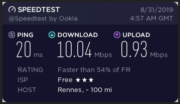

+++
title = 'Tester la connexion ADSL de son fournisseur de services internet (orange,free,sfr,etc...)'
date = 2019-08-31 00:00:00 +0100
categories = ['cli']
+++
## Comment exécuter un test de vitesse en ligne de commande à l'aide de speedtest-cli

*Effectuer un test de vitesse peut être très utile pour vérifier l'état actuel d'une connexion Internet, par exemple, pour vérifier que notre fournisseur de services Internet (ISP) respecte les paramètres pour lesquels nous payons ou pour diagnostiquer d'éventuels problèmes.*

L'un des moyens les plus courants de vérifier les valeurs de ping, de téléchargement et de téléversement consiste à effectuer un test à partir du site Web speedtest.net. Le programme speedtest-cli nous a permis d'exécuter le même test à partir de notre interface en ligne de commande tant appréciée.  
Dans ce tutoriel, vous apprendrez:

*    Comment installer et utiliser l'application speedtest-cli
*    Quelles sont les options les plus utiles que nous pouvons utiliser pour modifier son comportement 

### Logiciels requis et conventions utilisées

Configuration logicielle requise et conventions de ligne de commande Linux 

 <table style="width:100%">
  <tr><th>Catégorie</th><th>Conditions requises, conventions ou version du logiciel utilisé</th></tr>
  <tr><th>Système</th><td>Distribution agnostique</td></tr>
  <tr><th>Logiciel</th><td>git et python</td></tr>
  <tr><th>Autre</th><td>Aucune exigence particulière</td></tr>
  <tr>
    <th rowspan="2">Conventions</th>
    <td># - nécessite que les commandes linux données soient exécutées avec les privilèges root, directement en tant qu'utilisateur root ou à l'aide de la commande sudo</td>
  </tr>
  <tr>
    <td>$ - nécessite que des commandes Linux données soient exécutées en tant qu'utilisateur normal non privilégié</td>
  </tr>
</table> 

Rédigé en python,**speedtest-cli** est essentiellement l'interface en ligne de commande équivalente à l'exécution d'un test de vitesse à partir du site web speedtest.net . L'utilitaire est complètement open source, publié sous la licence Apache 2.0 . Il peut être très utile de vérifier l’efficacité d’une connexion Internet lorsque vous travaillez dans un environnement de ligne de commande ou lorsqu’un script est utilisé. Dans ce tutoriel, nous verrons comment l'utiliser et quelles sont les options les plus intéressantes que nous pouvons utiliser pour modifier son comportement.

### Installation de speedtest-cli

Il existe fondamentalement trois manières d'installer l'application speedtest-cli . Puisque le programme est présent dans les référentiels par défaut de toutes les principales distributions Linux, la première méthode d'installation préférée est celle qui implique l'utilisation de notre gestionnaire de paquets. 

pour installer l'application sur Fedora, nous utilisons dnf :

    $ sudo dnf installer speedtest-cli 

Sur les distributions Debian ou basées sur Debian, nous pouvons utiliser le bon vieil apt :

    $ sudo apt-get update && sudo apt-get install speedtest-cli 

Speedtest-cli est également présent dans le référentiel de la Community d’Archlinux, nous pouvons donc l’installer via pacman :

    $ sudo pacman -S speedtest-cli 

Puisque speedtest-cli est écrit en python, il est également possible de l'installer de manière indépendante de la distribution, en utilisant pip (ou pip3), le gestionnaire de paquets python. Lorsque vous installez le paquet de cette façon, je vous recommande d’utiliser *--user* pour effectuer l’action uniquement pour notre utilisateur:

    $ pip3 installer speedtest-cli --user 

Enfin, nous pouvons installer speedtest-cli en clonant le référentiel github:

    $ git clone https://github.com/sivel/speedtest-cli 

Une fois le référentiel cloné, nous pouvons basculer à l'intérieur de celui-ci et émettre la commande suivante:

    $ python3 setup.py install --user 

### Comment utiliser speedtest-cli

Le moyen le plus simple d’utiliser `speedtest-cli` consiste simplement à l’appeler sans options dans le terminal. Tout d'abord, l'application sélectionne le serveur disponible le plus proche pour tester la connexion, puis affiche la vitesse de **download** et la vitesse de **upload** :

```
Retrieving speedtest.net configuration...
Testing from Free SAS (79.237.210.100)...
Retrieving speedtest.net server list...
Selecting best server based on ping...
Hosted by ORANGE FRANCE (Rennes) [121.89 km]: 20.012 ms
Testing download speed................................................................................
Download: 10.04 Mbit/s
Testing upload speed......................................................................................................
Upload: 0.93 Mbit/s
```

Comme vous pouvez le constater, par défaut, la vitesse est exprimée en bits  
Pour utiliser des bytes , nous pouvons utiliser l'option `--bytes`  
Nous avons vu l’utilisation de base de la commande. Voyons maintenant comment personnaliser son comportement avec les options possibles.

### Partage des résultats avec l'option --share

Une option très utile de `speedtest-cli` est `--share` : lors de son utilisation, une représentation graphique des résultats du test de vitesse est générée et hébergée en ligne; la commande retournera l'URL que nous pouvons utiliser pour y accéder et la partager:

```
Retrieving speedtest.net configuration...
Testing from Free SAS (79.237.210.100)...
Retrieving speedtest.net server list...
Selecting best server based on ping...
Hosted by LaFibre.info (Bordeaux) [256.15 km]: 47.945 ms
Testing download speed................................................................................
Download: 9.62 Mbit/s
Testing upload speed......................................................................................................
Upload: 1.04 Mbit/s
[yannick@yannick-pc ~]$ speedtest-cli --share
Retrieving speedtest.net configuration...
Testing from Free SAS (79.237.210.100)...
Retrieving speedtest.net server list...
Selecting best server based on ping...
Hosted by ORANGE FRANCE (Rennes) [121.89 km]: 20.012 ms
Testing download speed................................................................................
Download: 10.04 Mbit/s
Testing upload speed......................................................................................................
Upload: 0.93 Mbit/s
Share results: http://www.speedtest.net/result/8548695653.png
```



### Utiliser les formats csv ou json pour les résultats

Speedtest-cli peut générer les résultats au format **csv** à l’aide de l’option `--csv` . Dans ce cas, la sortie détaillée est supprimée et les résultats sont générés sur une seule ligne en utilisant une `,` (virgule), comme délimiteur de champ par défaut. Cela peut être changé en utilisant l'option `--csv-header` . Par exemple, pour utiliser le `|` caractère en tant que délimiteur, nous pouvons exécuter:

    $ speedtest-cli --csv --csv-delimiter '|' 

Les en-têtes csv peuvent être imprimés en utilisant l'option `--csv-header` :

    $ speedtest-cli --csv-header 

    Server ID,Sponsor,Server Name,Timestamp,Distance,Ping,Download,Upload 

Les résultats peuvent également être représentés en utilisant le format **json** . L'option `--json` peut être utilisée pour obtenir ce comportement.


### Tester la connexion avec un serveur spécifique

Comme indiqué ci-dessus, par défaut, le programme exécute un test sur le serveur <speedtest.net> le plus proche. Si nous voulons forcer le test sur un serveur spécifique, nous devons d’abord générer la liste des serveurs disponibles:

    $ speedtest-cli --list

```
23282) ORANGE FRANCE (Rennes, France) [121.89 km]
10606) Sure Telecom (St Helier, Jersey) [243.13 km]
 6019) Newtel Limited (Saint Helier, Jersey) [243.91 km]
26312) JT Global Limited (St Helier, Jersey) [243.91 km]
21415) LaFibre.info (Bordeaux, France) [256.15 km]
26610) TELICITY Communications (Bordeaux, France) [256.15 km]
10686) Sure Telecom (Saint Peter Port, Guernsey) [283.63 km]
16920) Wibox (Val de Reuil, FR) [289.61 km]
 2231) TestDebit.info (Massy, France) [301.67 km]
23884) ORANGE FRANCE (Puteaux, France) [309.99 km]
14821) Stella Telecom (Courbevoie, France) [312.21 km]
11644) Ozone (Courbevoie, France) [312.21 km]
 5022) ONLINE S.A.S. (Vitry-sur-Seine, France) [312.58 km]
 5559) Orange (Paris, France) [315.52 km]
16476) Naitways (Paris, France) [315.52 km]
16676) CCleaner (Paris, France) [315.52 km]
 5582) Cloudwatt (Paris, France) [315.52 km]
10676) SiriusHD (Paris, France) [315.52 km]
 6027) fdcservers.net (Paris, France) [315.52 km]
12746) SFR SAS (Paris, France) [315.52 km]
11977) Télécom ParisTech (Paris, France) [315.52 km]
24215) ORANGE FRANCE (Paris, France) [315.52 km]
22132) Leonix Telecom (Paris, France) [315.52 km]
10176) HarryLafranc (Paris, France) [315.52 km]
24130) SEWAN (Paris, France) [315.52 km]
26387) Stella Telecom (PARIS, France) [315.52 km]
24386) GTT.net (Paris, France) [315.52 km]
25597) YanX.eu (Paris, France) [315.52 km]
25265) Netsplit (Paris, France) [315.52 km]
22902) Extragornax (Paris, France) [315.52 km]
22086) Host-Heberg (Paris, France) [315.52 km]
[...] 
```

La liste est assez longue, par conséquent, une partie seulement est rapportée ici. Maintenant, pour tester la connexion sur un serveur spécifique, exécutez la commande avec l'option --server , en fournissant l'ID du serveur (indiqué dans la première colonne de la liste) en tant qu'argument:

    $ speedtest-cli - serveur 23282 

### Conclusions

Le programme **speedtest-cli** est fondamentalement l’interface de ligne de commande équivalent à l’exécution d’un test de vitesse sur le site <https://www.speedtest.net> . 
Il peut être très utile lorsqu’il fonctionne sur une machine sur laquelle aucun serveur graphique n’est installé.
