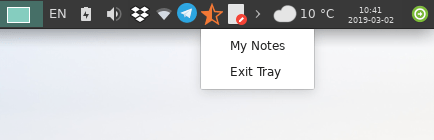
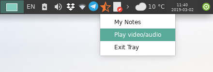

+++
title = 'indicateur sur la barre d'état système (tray)'
date = 2019-09-05 00:00:00 +0100
categories = divers
+++
*Les icônes de la barre d'état système sont toujours considérées comme une fonctionnalité étonnante aujourd'hui. En cliquant avec le bouton droit de la souris sur l’icône, puis en sélectionnant les actions que vous souhaitez entreprendre, vous faciliterez beaucoup la vie et réduirez de nombreux clics inutiles au quotidien.*

Cependant, les icônes de la barre d'état système peuvent être beaucoup plus utiles en le construisant  pour vos propres besoins. 

### Conditions préalables

Nous allons créer un indicateur de barre d'état système personnalisé à l'aide de Python (version 2.7).  
Le paquetage gir1.2-appindicator3 devra être installé. C'est la bibliothèque qui nous permet de créer facilement des indicateurs sur la barre d'état système.

Pour l'installer 

    sudo apt-get install gir1.2-appindicator3 # Ubuntu/Mint/Debian
    sudo dnf installez libappindicator-gtk3   # Fedora
    sudo pacman -S libappindicator-gtk3       # archlinux/manjaro

Pour les autres distributions, il suffit de rechercher tous les paquets contenant **appindicator**.

### Code de base

Voici le code de base de l'indicateur:

```python
#!/usr/bin/python
import os
from gi.repository import Gtk as gtk, AppIndicator3 as appindicator

def main():
  indicator = appindicator.Indicator.new("customtray", "semi-starred-symbolic", appindicator.IndicatorCategory.APPLICATION_STATUS)
  indicator.set_status(appindicator.IndicatorStatus.ACTIVE)
  indicator.set_menu(menu())
  gtk.main()

def menu():
  menu = gtk.Menu()
  
  command_one = gtk.MenuItem('My Notes')
  command_one.connect('activate', note)
  menu.append(command_one)

  exittray = gtk.MenuItem('Exit Tray')
  exittray.connect('activate', quit)
  menu.append(exittray)
  
  menu.show_all()
  return menu
  
def note(_):
  os.system("gedit $HOME/Documents/notes.txt")

def quit(_):
  gtk.main_quit()

if __name__ == "__main__":
  main()
```

Nous expliquerons comment le code fonctionne plus tard. Mais pour le savoir, enregistrez-le dans un fichier texte sous le nom **tray.py** et exécutez-le à l'aide de Python 

    python tray.py

Vous verrez l'indicateur fonctionner comme suit:



Explications

* Les trois premières lignes du code ne sont rien d'autre que la spécification du chemin Python et l'importation des bibliothèques que nous allons utiliser dans notre indicateur.
* **def main()** : C'est la fonction principale de l'indicateur. En dessous, nous écrivons le code pour initialiser et construire l'indicateur.
* **indicator = appindicator.Indicator.new(“customtray”, “semi-starred-symbolic”, appindicator.IndicatorCategory.APPLICATION_STATUS)** : nous créons spécialement un nouvel indicateur et l'appelons **customtray** . Il s’agit du nom spécial de l’indicateur afin que le système ne le mélange pas avec d’autres indicateurs en cours d’exécution. De plus, nous avons utilisé **semi-starred-symbolic** comme icône par défaut pour notre indicateur. Vous pouvez éventuellement changer  pour  autre choses, exemple **firefox** (si vous voulez que l’icône Firefox soit utilisée pour l’indicateur), ou tout autre nom d’icône que vous souhaitez. La dernière partie concernant **APPLICATION_STATUS** est simplement un code ordinaire pour la catégorisation / portée de cet indicateur.
* **indicator.set_status(appindicator.IndicatorStatus.ACTIVE)** : cette ligne allume simplement l'indicateur.
* **indicator.set_menu(menu())**: Ici, nous disons que nous voulons utiliser la fonction **menu()** (que nous définirons plus tard) pour créer les éléments de menu de notre indicateur. Ceci est important pour que, lorsque vous cliquez sur l'indicateur, vous puissiez voir une liste des actions possibles à entreprendre.
* **gtk.main()** : Il suffit d’exécuter la boucle GTK principale.
* Sous** menu()**, vous verrez que nous créons les actions / éléments que nous voulons fournir à l'aide de notre indicateur. **command_one = gtk.MenuItem(‘My Notes’)**) initialise simplement le premier élément de menu avec le texte "My notes", puis **command_one.connect(‘activate’, note)** connecte le signal **activate** de cet élément de menu à la fonction **note()** définie plus tard   En d'autres termes, nous disons à notre système ici: «Lorsque cet élément de menu est cliqué, exécutez la fonction note()». Enfin, **menu.append(command_one)** ajoute cet élément de menu à la liste.
* Les lignes concernant **exittray** servent uniquement à créer un élément de menu de sortie permettant de fermer l’indicateur à tout moment.
* **menu.show_all()** et **return menu** ne sont que des codes ordinaires pour renvoyer la liste des menus à l'indicateur.
* Sous la **note(_)**, vous verrez le code qui doit être exécuté lorsque vous cliquez sur l'élément de menu «My notes». Ici, nous venons d'écrire **os.system(“gedit $HOME/Documents/notes.txt”);**  
La fonction **os.system** est une fonction qui nous permet d'exécuter des commandes shell à partir de Python. Nous avons donc écrit une commande pour ouvrir un fichier appelé **notes.txt** dans le dossier Documents de notre répertoire personnel à l'aide de l'éditeur gedit . Ceci peut par exemple être votre programme de prise de notes quotidiennes à partir de maintenant! 

### Ajouter vos tâches

Il ne faut toucher que 2 choses dans le code:

1. Définissez un nouvel élément de menu sous `menu()` pour la tâche souhaitée.
2. Créez une nouvelle fonction pour exécuter une action spécifique lorsque vous cliquez sur cet élément de menu. 

Supposons donc que vous souhaitiez créer un nouvel élément de menu qui, lorsque vous cliquez dessus, lit un fichier vidéo/audio spécifique sur votre disque dur en utilisant VLC?  
Pour ce faire, ajoutez simplement les 3 lignes suivantes à la ligne 17:

```python
command_two = gtk.MenuItem('Play video/audio')
command_two.connect('activate', play)
menu.append(command_two)
```

Et les lignes suivantes à la ligne 30:

```python
def play(_):
  os.system("vlc /home/<username>/Videos/somevideo.mp4")
```

Remplacez **/home/<username>/Videos/somevideo.mp4** par le chemin du fichier vidéo/audio souhaité.   Enregistrez maintenant le fichier et relancez l'indicateur:

    python tray.py

Voici le résultat



Et lorsque vous cliquez sur l'élément de menu que vous venez de créer, VLC commencera à jouer!

Pour créer d'autres éléments/tâches, recommencez simplement les étapes. Veillez simplement à remplacer `command_two` par un autre nom, tel que `command_three` , afin d' éviter tout conflit entre les variables. Et ensuite, définissez de nouvelles fonctions séparées comme celle que nous avons faite avec la fonction `play(_)` 


### Démarrage automatique 

Nous voulons que notre indicateur de barre d'état système démarre automatiquement, nous ne voulons pas l'exécuter manuellement à chaque fois. Pour ce faire, ajoutez simplement la commande suivante à vos applications de démarrage (après avoir remplacé le chemin d'accès au fichier tray.py par le vôtre):

    nohup python /home/<username>/tray.py &

Au prochain démarrage du système, l'indicateur fonctionnera automatiquement après le démarrage!

*[Article original (en)](https://fosspost.org/tutorials/custom-system-tray-icon-indicator-linux)*
