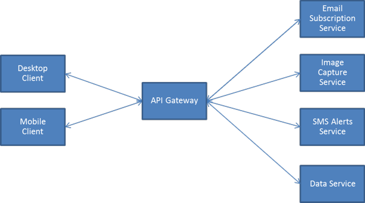

+++
title = 'Construire une passerelle API avec Lua et Nginx'
date = 2019-09-11 00:00:00 +0100
categories = nginx
+++
## Construire une passerelle API avec Lua et Nginx

Lorsque nous travaillons sur des microservices, un certain nombre de préoccupations / fonctionnalités communes doivent être partagées entre différents services.

Ces fonctionnalités communes incluent l'authentification, la surveillance, la journalisation, la limitation de débit, la mise en liste blanche IP et les transformations de demande.

Au lieu de demander à chaque service de vérifier ses propres garanties de demande, il est logique de décharger ces fonctionnalités sur une passerelle / proxy centrale. De cette façon, votre équipe d'ingénierie se concentre sur la création de fonctionnalités / services réels.

>La plupart des fonctionnalités d'un service doivent être déléguées à un proxy. 

Ce modèle est souvent appelé [passerelle API](https://microservices.io/patterns/apigateway.html) .

{:width="400"}

Aujourd'hui, nous allons construire une passerelle d'API simple à partir de zéro. Vous pouvez également utiliser certaines passerelles open source / commerciales existantes à partir de cette [liste organisée](https://github.com/yosriady/api-development-tools#api-gateways)

### Une passerelle minimum viable

Pour des raisons de simplicité, nous ne travaillerons que sur deux fonctionnalités principales :

* Routage : nous voulons spécifier les services auxquels renvoyer les demandes lorsqu'une demande frappe une route particulière à notre passerelle.
* Transformation de la demande : nous voulons intercepter et transformer les demandes entrantes avant le transfert afin de pouvoir ajouter des fonctionnalités supplémentaires telles que l'authentification, les limites de débit, la mise en cache, etc. 

### Présentation d'OpenResty

Votre passerelle API est la dernière chose que vous voulez créer. Etant donné qu’il s’agit du point d’entrée unique dans votre parc de microservices, il est préférable que les demandes soient reçues. Pour obtenir des temps de réponse courts et un débit élevé, nous nous tournons vers OpenResty.

>[OpenResty](https://openresty.org/) transforme le serveur NGINX en un puissant serveur d'applications Web, dans lequel les développeurs peuvent utiliser la programmation Lua pour créer des scripts pour divers modules nginx C et Lua existants, ainsi que pour créer des applications Web extrêmement performantes et capables de gérer des connexions de 10 000 à 1 000 000 +. boîte unique. 

### Une introduction à OpenResty

>À ce stade, vous devriez avoir quelques notions de base sur la structure du fichier de configuration de NGINX. NGINX est constitué de modules contrôlés par des directives - un DSL - spécifiées dans le fichier de configuration. En savoir plus [ici](https://nginx.org/en/docs/beginners_guide.html#conf_structure) et [ici](https://www.digitalocean.com/community/tutorials/understanding-the-nginx-configuration-file-structure-and-configuration-contexts) . 

Voici un exemple de fichier .conf nginx:

```
#location is a block level directive

location / {
	#proxy_pass is a simple nginx directive
	proxy_pass https://localhost:5984/;
}
``` 

Openresty conserve la même structuration des fichiers de configuration. Vous créez toujours des fichiers de configuration avec des directives simples et de niveau bloc. Toute directive nginx fonctionne avec openresty de la même manière que dans une application vanilla nginx. En plus de cela, OpenResty nous donne des directives supplémentaires qui nous permettent d’écrire le comportement avec le langage lua :

* content_by_lua
* init_by_lua
* rewrite_by_lua
* access_by_lua

Nous allons passer en revue chacune d'elles en expliquant ce qu'elles font.

#### content_by_lua

La directive content_by_lua nous permet d’exécuter du code lua arbitraire:

```
location / {
	content_by_lua 'ngx.say("<p>hello, world</p>")';
}
```

L'exécution de NGINX avec la configuration ci-dessus exécutera le code Lua spécifié à l'URL racine. Dans ce cas, nous affichons un élément HTML.

Pour les projets sérieux avec une logique plus complexe, nous pouvons utiliser content_by_lua_file :

```
location /by_file {
    default_type text/html;
    lua_code_cache off; #enables livereload for development
    content_by_lua_file ./lua/hello_world.lua;
}
```

Et notre script hello_world.lua 

```
 ngx.say ("<p>hello, world</p>") ; 
```


>Notez que les quatre directives OpenResty répertoriées ci-dessus ont une version _file qui accepte un chemin de fichier lua au lieu d'un bloc de code lua .

#### init_by_lua

La directive init_by_lua nous permet d’exécuter le code d’initialisation au démarrage du serveur nginx. L'une des utilisations de cette directive est d'importer et de définir des bibliothèques ou des modules utilisés dans nos gestionnaires de demandes.

```
init_by_lua '
cjson = require("cjson") -- cjson is a global variable
'

location / {
    content_by_lua '
    	local message = cjson.decode({hello="world"})
    	ngx.say(message)
    ';
}
```

Dans l'extrait de code ci-dessus, nous initialisons une bibliothèque et l'attribuons à une variable globale que nos gestionnaires de demandes peuvent utiliser.

Nous utilisons également cette directive pour définir certaines constantes de configuration pour notre passerelle.

>Vous pouvez utiliser init_by_lua_file pour une meilleure organisation du code. 

#### rewrite_by_lua

La directive rewrite_by_lua nous permet de "modifier de manière dynamique l'URI de la requête à l'aide d'expressions régulières, de renvoyer des redirections et de sélectionner des configurations de manière conditionnelle".

Dans une passerelle API, cette directive nous permet de router les demandes vers ses destinations pertinentes. Par exemple, nous pouvons transférer les demandes à /users vers USER_MICROSERVICE_URL et les transmettre à /assets vers CDN_URL .

Vous pouvez en savoir plus sur la façon dont NGINX réécrit les règles [ici](https://nginx.org/en/docs/http/ngx_http_rewrite_module.html#rewrite) 

#### access_by_lua

La directive access_by_lua nous permet de définir des politiques d'accès pour des emplacements / adresses spécifiques.

Notre passerelle API l'utilise pour gérer l'authentification HTTP et les listes noires / blanches sur IP.

Vous pouvez en savoir plus sur le module d'accès NGINX [ici](https://nginx.org/en/docs/http/ngx_http_access_module.html) 


### Paquet ngx openresty

Vous avez déjà vu la méthode ngx.say() dans content_by_lua . say() n'est que l'une des nombreuses méthodes définies dans le paquet ngx , qui est disponible globalement pour que d'autres directives puissent l'utiliser librement.

Que contient ngx ? Nous allons jeter un coup d'oeil:

* ngx.location.capture
* ngx.req
* ngx.resp

#### ngx.location.capture

Vous permet de faire des demandes à un URI interne. Renvoie la réponse. Par exemple:

```
local res = ngx.location.capture("/by_file")
```

Le code ci-dessus capture la réponse à l' /by_file interne /by_file nous avons déjà défini quelque part dans une directive location .

La res contient le status , l'en- header et le body de la réponse.

Vous pouvez également passer des arguments et d'autres options dans l'URI:

```
local options = {
	method = ngx.HTTP_POST,
	args = { maxsize = 5000 }
}
local res = ngx.location.capture("/by_file", options)
```

#### ngx.req

Nous pouvons modifier le contenu de la demande avant de la transmettre à un serveur de destination.

L'objet de requête ngx contient des attributs de requête tels que:

```
local headers = ngx.req.get_headers()
local cookie = headers["Cookie"]
local etag = headers["Etag"]
local host = headers["Host"]

local body = ngx.req.read_body()
local method = ngx.req.get_method
local querystring_params = ngx.req.get_uri_args()
local post_params = ngx.req.get_post_args()
```

Tous les attributs de requête ci-dessus peuvent être modifiés ou décorés avec des informations supplémentaires, selon votre cas d'utilisation.

#### ngx.resp

Nous pouvons modifier le contenu de la réponse avant de la renvoyer au client. Par exemple, nous pouvons rassembler les résultats de plusieurs services situés à différentes adresses internes à l’aide de ngx.location.capture , puis les renvoyer au client.

L'objet de réponse ngx contient les attributs suivants:

```
local resp_headers = ngx.resp.get_headers()
local http_status = ngx.status
```

Il n'y a pas de méthode ngx.res.body () où vous pouvez définir le corps avant d'envoyer la réponse.

Openresty propose plutôt deux méthodes dans ngx.say() et ngx.print() Tout argument des méthodes sera joint et envoyé en tant que corps res.

```
ngx.print("Hello world") --sends  Hello world
ngx.say("Hello world") -- sends Hello world/n that is the body appended with a newline
ngx.say(cjson.encode({a=1,b=2})) -- you can also send json in the response body
```

Il est également important de noter que l'appel de l'une de ces méthodes signifie que la réponse sera renvoyée au client. Ainsi, les en-têtes de réponse et l'état de la réponse que vous avez préparé jusqu'à présent seront renvoyés au client une fois que vous aurez appelé print() ou say() .
