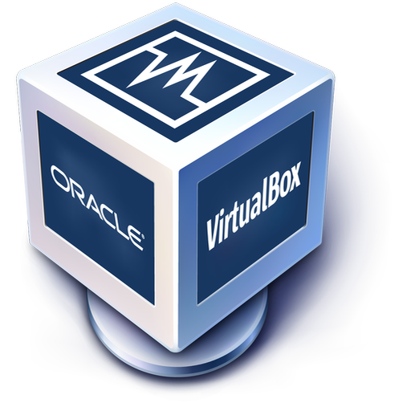
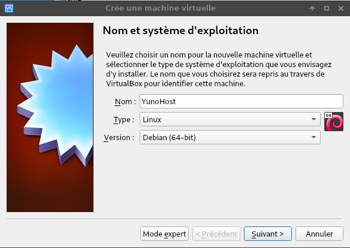
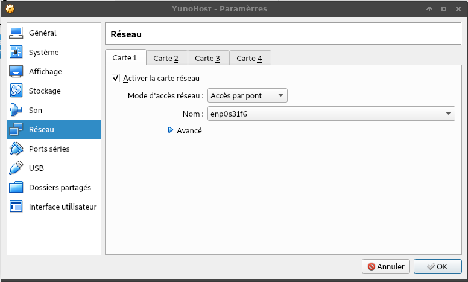
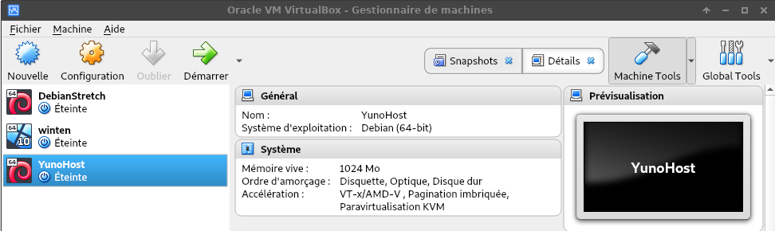
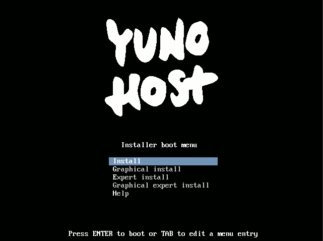

+++
title = 'YunoHost sur VirtualBox'
date = 2019-09-12 00:00:00 +0100
categories = ['yunohost']
+++
# Installer YunoHost sur VirtualBox

*Trouvez d’autres moyens d’installer YunoHost **[ici](/install_fr)**.*

## Prérequis

* Un ordinateur x86 avec VirtualBox installé et assez de RAM disponible pour lancer une petite machine virtuelle.
* La dernière **image ISO YunoHost** stable, disponible [ici](/images_fr).

N.B. : Installer YunoHost dans une VirtualBox est utile pour tester la
distribution. Pour réellement s'autohéberger sur le long terme, il vous faudra
probablement une machine physique (vieil ordinateur, carte ARM, ..) ou un VPS en
ligne.

## <small>1.</small> Créer une nouvelle machine virtuelle

 

* Ce n'est pas grave si seulement la version 32-bit est dispo, mais dans ce cas soyez sur d'avoir téléchargé l'image 32 bit précédemment.
* 256Mo de RAM est le minimum requis, 512Mo est recommandé (1Go ou plus si vous pouvez).
* 8Go de stockage minimum requis.

## <small>2.</small> Modifier la configuration réseau

Allez dans **Réglages** > **Réseau** :

 

* Sélectionnez `Accès par pont`

* Choisissez votre interface selon son nom :

    **wlan0** si vous êtes connecté sans-fil, **eth0** sinon.

## <small>3.</small> Lancer votre machine virtuelle

Démarrez votre machine virtuelle

 

Vous devez sélectionner ici l’image ISO, puis vous devriez voir cet écran d’accueil YunoHost.

 

Si vous rencontrez l'erreur "VT-x is not available", il vous faut probablement activer (enable) la virtualisation dans les options du BIOS de votre ordinateur.

 
   

 

* Choisissez `Installation graphique`

* Sélectionnez votre langue, votre emplacement, la disposition de votre clavier et laissez l’installeur faire le reste :-)

## <small>4.</small> Effectuer la post-installation

L’étape appelée « **post-installation** » est en fait l’étape de configuration initiale de YunoHost. Il faut l’exécuter après l’**installation** du système en lui-même.

### Via l'interface web

Vous pouvez accéder à la post-installation graphique en entrant dans un navigateur web :
* l’adresse **IP locale de votre serveur** si celui-ci est connecté à votre réseau local (généralement `192.168.x.x`, voir ['Trouver son IP' sur la page sur SSH](/ssh))
* l’adresse **IP publique de votre serveur** si celui-ci n’est pas connecté à votre réseau local (par exemple dans le cas d'un VPS, votre fournisseur devrait vous avoir transmis l'adresse IP).

Lors de la première visite, vous rencontrerez très probablement un avertissement de sécurité lié au certificat utilisé. Pour le moment, votre serveur utilise un certificat auto-signé. Vous pourrez plus tard ajouter un certificat automatiquement reconnus par les navigateurs comme décrit dans la page sur les [Certificats](/certificate). En attendant, ajoutez une exception de sécurité pour accepter le certificat actuel.

Vous arrivez ensuite sur cette page :

*
Aperçu de la post-installation Web
*

### Via la ligne de commande

Vous pouvez aussi y accéder en entrant la commande `yunohost tools postinstall` directement sur le serveur ou [en SSH](/ssh).

*
Aperçu de la post-installation en ligne de commande
*

## Informations demandées

### Domaine principal

C’est le nom de domaine qui permettra l’accès à votre serveur ainsi qu’au portail d’authentification des utilisateurs. Il sera donc **visible par tout le monde**, choisissez-le en conséquence.

* YunoHost propose un service de DNS dynamique fournissant des noms de domaine de type *mondomaine.nohost.me*, *mondomaine.noho.st* ou *mondomaine.ynh.fr*. Si vous ne possédez pas de nom de domaine et/ou que vous souhaitez profiter de ce service, choisissez un domaine se terminant en `.nohost.me`, `.noho.st` ou `.ynh.fr`. S'il n'est pas déjà utilisé, le domaine sera automatiquement rattaché à votre serveur YunoHost, et vous n’aurez pas d’étape de configuration supplémentaire.

* Si en revanche vous maîtrisez la notion de **DNS**, vous pouvez utiliser votre propre nom de domaine. Dans ce cas, référez-vous à la page [yunohost.org/dns](https://yunohost.org/#/dns_fr) pour plus d’informations.

* Si vous n'avez pas de nom de domaine et que vous n'en voulez pas en *mondomaine.nohost.me*, *mondomaine.noho.st* ou *mondomaine.ynh.fr*, vous pouvez utilisez un domaine local. Plus d'infos sur comment [accéder à son serveur depuis le réseau local](https://yunohost.org/#/dns_local_network_fr).

### Mot de passe d’administration

C’est le mot de passe qui vous permettra d’accéder à l’[interface d’administration](https://yunohost.org/#/admin_fr) de votre serveur. Vous pourrez également l’utiliser pour vous connecter à distance via **SSH**, ou en **SFTP** pour transférer des fichiers.

De manière générale, c’est la **clé d’entrée à votre système**, pensez donc à la **[choisir attentivement](http://www.commentcamarche.net/faq/8275-choisir-un-bon-mot-de-passe)**.

 

## Félicitations !

Si vous arrivez ici après avoir vu "YunoHost a été installé avec succès" depuis
votre navigateur ou la ligne de commande, alors félicitations !

### Et maintenant ?

- Si vous vous auto-hébergez à la maison et sans VPN, il faut vous assurer
  de bien [rediriger les ports de votre box internet](https://yunohost.org/#/isp_box_config_fr) ;
- Si vous utilisez votre propre nom de domaine (i.e. pas un nohost.me /
  noho.st), il vous faut [configurer le nom de domaine d'après la configuration
  recommandée](https://yunohost.org/#/dns_config_fr) ;
- Si vous ne pouvez pas configurer le nom de domaine pour le moment (parce qu'il
  n'est pas encore acheté, ou parce que c'est un domaine de test), vous pouvez
  contourner temporairement le problème avec les instructions du dernier
  paragraphe [ici](https://yunohost.org/#/dns_local_network_fr) ;
- Ne soyez pas trop effrayé par [l'avertissement à propos du
  certificat](https://yunohost.org/#/certificate_fr), vous aurez probablement la possibilité
  d'installer un certificat Let's Encrypt :).
- Jetez un oeil aux [applications disponibles](https://yunohost.org/#/apps_fr) !

# Yunohost - yanspm.ynh.fr

Connexion en admin pour relever IP : 192.168.1.3  
Ajouter à /etc/hosts de l'ordinateur qui lance virtualbox

    192.168.1.3 yanspm.ynh.fr

Se connecter en **admin** sur la page web https://yanspm.ynh.fr  
Accepter les risques et poursuivre...

* Ajout Certificat Let's Encrypt pour le domaine **yanspm.ynh.fr**
* 

