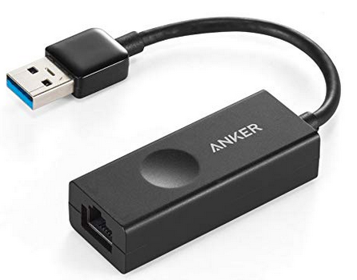

+++
title = 'Booster la vitesse Ethernet LAN d’un Raspberry Pi 3'
date = 2019-09-13 00:00:00 +0100
categories = ['yunohost', 'raspberry']
+++
## Booster la vitesse Ethernet d’un Raspberry Pi 3

>Seule les modèles Pi 3B+ et 4 offrent une connexion ethernet 10/100/1000

Le Raspberry Pi quelque soit le modèle utilisé (version B) depuis la v1 jusqu’au Raspberry Pi 3 propose une sortie Ethernet en 10/100 Mbps.

En gros vous obtiendrez des débits allants jusqu’à 11 Mo/sec entre votre Raspberry Pi et n’importe quel appareil autre appareil sur le réseau.

Le Raspberry Pi partage actuellement le même BUS entre les ports USB 2.0 et sa prise Ethernet.

Le débit est donc partagé entre vos prises USB et le port Ethernet et d’une façon globale vous pouvez atteindre au maximum une vitesse théorique de 480 Mbps (le maximum de l’USB 2.0).

Justement c’est dommage de se brider à 100 Mbps sur le port Ethernet du Raspberry Pi de base. Voyons voir si on peut atteindre plus avec un adaptateur USB vers Ethernet.

Pour le test j’ai volontairement choisit un adaptateur USB 3.0/Ethernet (rétrocompatible USB 2.0) qui à l’avantage de proposer une connexion Ethernet en Gigabit (1000 Mbps).

{:width="100px"}   
Anker Adaptateur USB 3.0 vers RJ45 Ethernet Gigabit 10/100/1000 Mbit/s

Le HUB va fonctionner en USB 2.0 mais la prise Ethernet ne sera pas bridée en 100 Mbps, voyons voir qu’est ce que cela donne au niveau perfs (test avec l’outil **iPerf** ).[tester la vitesse de connexion entre deux machines](/files/iperf.pdf)

Il faut mettre en place un **iPerf** côté serveur Raspberry Pi  et un autre sur l'ordinateur.

Résultats 

* Via la prise Ethernet du Raspberry PI 3 (en natif) : 94.5 Mbps soit : 11.8 Mo/sec
* Via la prise Ethernet de l’adaptateur Ethernet en USB 3.0 : 323 Mbps soit : 40,4 Mo / sec

on a un gain de 3,4 fois !

>Si vous utilisez les ports USB en même temps que l’Ethernet vous n’aurez pas autant de débit.

