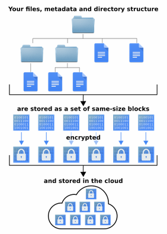
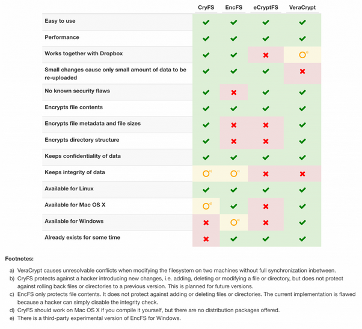

+++
title = 'Chiffrement (CryFS)'
date = 2019-09-15 00:00:00 +0100
categories = ['chiffrement']
+++
## CryFS

En plus de chiffrer les fichiers, CryFS masque aussi la taille, les métadonnées et la structure de vos répertoires, ce qui offre encore plus de confidentialité. 



Comparatif



### Installation

Ubuntu

    sudo apt install cryfs

Debian

    sudo apt-get install cryfs

Arch Linux

    sudo pacman -S cryfs

## Création de dossiers d'espace de stockage

L'utilisation de CryFS nécessite deux répertoires : 

* le dossier de l'espace de stockage qui contient les fichiers lorsqu'ils ne sont pas utilisés
* le dossier mount, où l'espace de stockage sera accessible quand il n'est pas crypté. 

### Créer le répertoire de l'espace de stockage.

Dans un terminal, utilisez la commande `cd` et se placer dans un dossier de synchronisation de votre Nextcloud sous Linux.

	cd ~/media/dplus/statique/

Exécutez la commande ls et jetez un oeil à votre dossier Nextcloud sync. Déterminez où vous souhaitez conserver les coffres CryFS.

    ls

Lorsque vous êtes sûr de l'emplacement du dossier, utilisez la commande mkdir. Assurez-vous d'ajouter le commutateur -p car il garantira que le dossier conserve les mêmes permissions que le répertoire Nextcloud parent.

	mkdir -p cryfs-chiffre
	ou
	mkdir -p ~/media/dplus/statique/cryfs-chiffre

### Créer le dossier mount

Après avoir pris soin du dossier CryFS dans votre répertoire Nextcloud, il est temps d'en créer un autre. Ce répertoire est l'endroit où vous allez monter et accéder à vos données, donc assurez-vous de ne pas mettre celui-ci dans Nextcloud aussi. Au lieu de cela, placez-le quelque part dans ~/ ou ~/Documents.

	cd ~
	mkdir -p .chiffre

Ou, si vous préférez monter via le dossier Documents, faites-le :

	cd ~/Documents
	mkdir -p .chiffre

### Le Montage CryFS

Maintenant que les dossiers sont terminés, il est temps de créer et de monter un coffre-fort. Dans le terminal, exécutez la commande cryfs et spécifiez le dossier de l'espace de stockage et le dossier mount.

>Note : n'oubliez pas de toujours mettre le **dossier mount en dernier** !  
Si vous spécifiez d'abord le dossier de coffre-fort Nextcloud, les données de votre coffre-fort ne seront pas synchronisées !

**IMPORTANT:** vous devez monter votre coffre CryFS à chaque fois, avant d'essayer de chiffrer des fichiers.

	cryfs ~/media/dplus/statique/cryfs-chiffre ~/.chiffre

Au premier lancement de la commande

```
CryFS Version 0.10.2

Use default settings?
Your choice [y/n]: y

Generating secure encryption key. This can take some time...done
Password: 
Confirm Password: 
Deriving encryption key (this can take some time)...done

Mounting filesystem. To unmount, call:
$ cryfs-unmount "/home/yann/.chiffre"
```

### Chiffrer vos données

Une fois la chambre forte montée via CryFS, le cryptage est assez simple. Pour ce faire, ouvrez votre gestionnaire de fichiers Linux et naviguez jusqu'à "Home", puis ".chiffre".  

Faites glisser les fichiers que vous souhaitez chiffrer dans Nextcloud dans le dossier mount. Ensuite, lorsque vous avez terminé d'utiliser l'espace de stockage, démontez-le à l'aide de la commande de terminal suivante.

Assurez-vous de remplacer "username" dans la commande ci-dessous par le nom d'utilisateur de votre PC Linux.

    cryfs-unmount "/home/yann/.chiffre"

Lorsque l'espace de stockage est démonté, Nextcloud synchronisera vos données chiffrées vers le service.

### Automount

Montage auto de la commande `cryfs ~/media/dplus/statique/cryfs-chiffre ~/.chiffre`

Créer un bash "~/scripts/cryfs-autostart"

    nano ~/scripts/cryfs-autostart

```
#!/bin/bash
export CRYFS_FRONTEND=noninteractive
export CRYFS_NO_UPDATE_CHECK=noninteractive
#CLOUD_DIR="${HOME}/.cloud"
#CONFIG_FILE="${CLOUD_DIR}/cryfs.config"
# -f --config $CONFIG_FILE 
BASE_DIR="${HOME}/media/dplus/statique/cryfs-chiffre"
MOUNT_DIR="${HOME}/.chiffre"
PASSWORD="Mot-de-Passe"
if [ ! -d "$MOUNT_DIR" ]; then
  mkdir $MOUNT_DIR
fi
echo $PASSWORD | cryfs $BASE_DIR $MOUNT_DIR &>/dev/null 
```

    chmod +x /home/yann/scripts/cryfs-autostart 
    sudo ln -s /home/yann/scripts/cryfs-autostart /usr/local/bin/cryfs-autostart

### Créer une unit utilisateur pour le service

Il est possible de placer les units propres à un utilisateur dans le dossier **~/.config/systemd/user**  
Créer le dossier

    mkdir -p ~/.config/systemd/user

Le fichier unit **cryfs-autostart.service**

    nano ~/.config/systemd/user/cryfs-autostart.service

```
[Unit]
Description=tmux instance with virtual running in it.

[Service]
ExecStart=/usr/local/bin/cryfs-autostart
ExecStop=cryfs-unmount "${HOME}/.chiffre"
Type=forking
Restart=always

[Install]
WantedBy=default.target
```

Une fois ce fichier placé au bon endroit, il suffit de reloader systemd pour ensuite démarrer le service:

    systemctl --user daemon-reload
    systemctl start --user cryfs-autostart.service
    systemctl enable --user cryfs-autostart.service
    systemctl status --user cryfs-autostart.service

