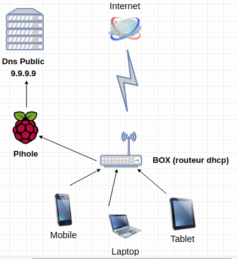
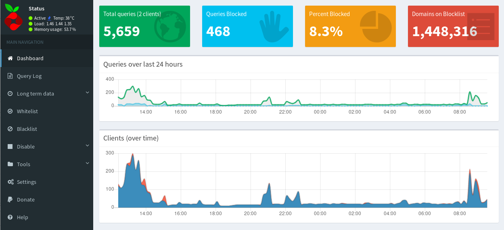
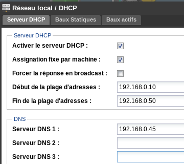

+++
title = 'Pi-Hole (bloqueur de pub) et Pi-VPN ,Raspberry, yunohost et FreeBox'
date = 2019-09-17 00:00:00 +0100
categories = ['yunohost', 'raspberry']
+++
## Pi-Hole

{:width="100px"}

*Dès qu’un smartphone , une tablette est connectée à votre box, une quantité phénoménale de requêtes DNS partent régulièrement à votre insu vers des sites publicitaires et autres traqueurs d’activité. Tout ça sans même avoir lancé votre navigateur car avec, c’est bien pire! Certes des extensions comme Ublock permettent de limiter la casse. Mais imaginez un moyen de filtrer plus efficacement en amont de votre réseau ...  
Pihole , est un projet qui a pour but d’assainir vos connexions en envoyant toutes les requêtes DNS irrespectueuses de votre vie privée vers un « trou noir ». Toutes les pubs , traqueurs, sites malveillants seront redirigés vers une adresse locale (127.0.0.1). Pihole nécessite très peu de ressources , simplement un raspberry (fonctionne aussi sous processeur x86).*

  
Pihole va jouer le rôle de résolveur DNS pour tous les périphériques connectés à votre Box. Il sera ainsi en mesure de bloquer toutes les requêtes DNS « néfastes » à partir d’ une liste noire.

{:width="500px"}

Combiné avec [PiVPN](http://www.pivpn.io/), il devient possible d’utiliser Pi-hole en itinérance, depuis votre téléphone ou sur un réseau public, tout en chiffrant l’intégralité de vos connexions.

### Liens

* [Nettoyer son réseau avec pihole et un raspberry](https://tutox.fr/2019/01/11/pihole-nettoyer-reseau-raspberry/)
* [Bloquer les pubs : j'ai installé Pi-Hole derrière une Freebox](https://www.dadall.info/article640/bloquer-les-pubs-j-ai-installe-pi-hole-freebox) 
* [Chiffrement dns avec dnscrypt et pihole](https://www.geber.ga/chiffrement-dns-avec-dnscrypt-et-pihole/)


### Pi-Hole Raspberry

Cet article suppose que vous avez un Raspberry Pi avec un OS Raspbian ou Archlinux   
Il est par ailleurs important que votre routeur attribue une adresse IP fixe au Raspberry Pi, afin de pouvoir le déclarer celui-ci comme hôte DNS depuis vos appareils.  
L’installation de Pi-hole se fait à l’aide d’une seule commande :

    curl -sSL https://install.pi-hole.net | bash

ou

    git clone --depth 1 https://github.com/pi-hole/pi-hole.git Pi-hole
    cd "Pi-hole/automated install/"
    sudo bash basic-install.sh

Choix des serveurs DNS de Quad9 (9.9.9.9).  
Une fois l’installation terminée, on peut changer le mot de passe :

    sudo pihole -a -p

3 possibilités pour vous assurer que les appareils utilisent le Raspberry Pi pour la résolution DNS.  

1. Activer le serveur DHCP de Pi-Hole , depuis le serveur web :
      * on va dans Settings, puis dans DHCP, avant de sélectionner DHCP server enabled ; 
      * il faut ensuite se rendre dans l’interface d’administration de votre routeur ou de votre box pour désactiver le DHCP.  
2. Une autre solution est, dans l’interface de paramétrage de votre routeur ou votre box internet, de déclarer l’IP de votre Raspberry Pi comme champ de serveur DNS.  
Il faut remplacer la première adresse dns par l’ip locale de votre serveur Pi-Hole (192.168.0.45 pour exemple).  
Paramètres de la freebox &rarr; Mode avancé &rarr; DHCP  
{:width="200px"}
3. Si aucune des 2 solutions précédentes n’est possible, il est nécessaire de déclarer votre Raspberry Pi comme serveur DNS dans les paramètres réseaux de l’ensemble de vos périphériques.

Redémarrez votre connexion au réseau, l’interface d’administration de Pi-hole devrait désormais être disponible depuis http://pi.hole.

Vous pouvez alors y déclarer les listes pour commencer à bloquer des publicités, [wally3k](https://wally3k.github.io/) et [tspprs](https://tspprs.com/) , il est également possible de  bloquer des sites particuliers !

### Pi-Hole yunohost

{:width="100px"}

*Pour le présenter brièvement, [Pi-Hole](https://pi-hole.net/) est un logiciel open-source (avec les [sources disponibles pour Yunohost sur github](https://github.com/YunoHost-Apps/pihole_ynh/)) qui se glisse entre Internet et TOUS vos périphériques sur votre réseau local, et qui permet de filtrer les requêtes DNS grâce à des listes pré-établies de domaines bloqués (comme le fait AdBlock). Cela permet donc même de bloquer les publicités là où ce n’est normalement pas possible (consoles de jeu, caméra IP connectées au cloud du fabricant, applications mobiles, etc).*

{:width="50px"}

Pi-hole va vous permettre de filtrer votre réseau et supprimer toutes les publicités en utilisant la capacité de cache dns de dnsmasq.  
Plus que ça, votre réseau va cesser d’utiliser les dns de votre FAI, et va utiliser à la place des dns véritablement respectueux.(les dns fournis par YunoHost)  

* FDN
* LDN
* ARN
* gozmail / grifon
* FoeBud / Digital Courage
* Aquilenet
* CCC Berlin
* Ideal-Hosting
* censurfridns

Puisque vous allez utiliser votre propre dns, lorsque vous allez vous connecter à votre serveur, votre dns ne va pas vous renvoyer votre adresse publique, comme les autres dns. Il va vous renvoyer l’adresse locale de votre serveur, donc il ne sera plus nécessaire de modifier votre fichier hosts pour utiliser votre propre serveur !  
Plus de problèmes de hairpinning !

Mais, malheureusement, comme Pi-hole est plus qu’une simple application, il nécessite plus qu’une simple installation de l’application.  
Pour pouvoir utiliser ses fantastiques capacités, vous devez changer votre dns pour pointer sur votre serveur plutôt que votre FAI.  
2 solutions:  

* Solution 1 : votre routeur vous permet de choisir votre dns. Dans ce cas, vous avez juste a remplacer la première adresse dns par l’ip locale de votre serveur.
* Solution 2 : votre routeur ne vous permet pas de toucher à votre dns. Et vous allez devoir changer de serveur DHCP à place. Et bien sûr activer le DHCP de Pi-hole.Votre serveur va distribuer les ip lui-même, et avec, son propre dns.

Installation en mode commande

    yunohost app install https://github.com/YunoHost-Apps/pihole_ynh

```
Domaines disponibles :
- yanspm.com
- ouestline.net
- md.ouestline.net
- dev.ouestline.net
- doc.ouestline.net
- wiki.ouestline.net
- music.ouestline.net
- static.ouestline.net
- calibre.ouestline.net
- shaarli.ouestline.net
Choisissez un domaine pour l'interface admin de Pi-hole (default: yanspm.com) : 
Choisissez un chemin pour l'interface admin de Pi-hole (default: /pihole) : 
Administrateur de Pi-hole (doit être un utilisateur YunoHost existant) : yanspm
Voulez-vous enregistrer les requêtes dns ? [0 | 1] (default: 0) : 
Voulez-vous utiliser Pi-hole an tant que serveur DHCP ? [0 | 1] (default: 0) : 
```

Patienter quelques minutes ...

```
Attention : 2018-08-01 11:17:02 URL:https://codeload.github.com/pi-hole/pi-hole/tar.gz/v3.3.1 [116614] -> "app.tar.gz" [1]
Attention : 2018-08-01 11:17:06 URL:https://codeload.github.com/pi-hole/AdminLTE/tar.gz/v3.3 [2280252] -> "admin_dashboard.tar.gz" [1]
Attention : 2018-08-01 11:17:20 URL:https://codeload.github.com/pi-hole/FTL/tar.gz/v2.13.2 [2055246] -> "FTL.tar.gz" [1]
Succès ! La configuration de SSOwat a été générée
Succès ! Installation terminée
```

Administration, se rendre sur le portail yunohost et cliquer  sur le bouton {:width="50px"}

## Configurer NGINX pour Pi-hole

Remarques et avertissements

* Il s'agit d'une configuration non supportée créée par la communauté
* Si vous utilisez php5, changez toutes les instances de php7.0-fpm en php5-fpm et changez /run/php/php7.0-fpm.sock en /var/run/php5-fpm.sock

### Exigences de base

Stop default lighttpd

    service lighttpd stop

Installer les paquets nécessaires

    apt-get -y install nginx php7.0-fpm php7.0-zip apache2-utils

Désactiver lighttpd au démarrage

    systemctl disable lighttpd

Activer php7.0-fpm au démarrage

    systemctl enable php7.0-fpm

Activer nginx au démarrage

    systemctl enable nginx

Editez /etc/nginx/sites-available/default to :

```
server {
        listen 80 default_server;
        listen [::]:80 default_server;

        root /var/www/html;
        server_name _;
        autoindex off;

        index pihole/index.php index.php index.html index.htm;

        location / {
                expires max;
                try_files $uri $uri/ =404;
        }

        location ~ \.php$ {
                fastcgi_split_path_info ^(.+\.php)(/.+)$;
                fastcgi_pass unix:/run/php/php7.3-fpm.sock;   # PHP7.3   
                fastcgi_index index.php;
                include fastcgi_params;
                fastcgi_param SCRIPT_FILENAME $request_filename;
                auth_basic "Restricted"; #For Basic Auth
                auth_basic_user_file /etc/nginx/.htpasswd;  #For Basic Auth
        }

        location /*.js {
                index pihole/index.js;
                auth_basic "Restricted"; #For Basic Auth
                auth_basic_user_file /etc/nginx/.htpasswd;  #For Basic Auth
        }

        location /admin {
                root /var/www/html;
                index index.php index.html index.htm;
                auth_basic "Restricted"; #For Basic Auth
                auth_basic_user_file /etc/nginx/.htpasswd;  #For Basic Auth
        }

        location ~ /\.ht {
                deny all;
        }
}
```

### Créer un nom d'utilisateur pour l'authentification

Créer un nom d'utilisateur pour l'authentification de l'administrateur - nous ne voulons pas que d'autres personnes dans notre réseau changent notre liste noire et blanche

    htpasswd -c /etc/nginx/.htpasswd exampleuser

Changer la propriété du répertoire html en utilisateur nginx

    chown -R www-data:www-data /var/www/html

Assurez-vous que le répertoire html est accessible en écriture

    chmod -R 755 /var/www/html

Démarrer le démon php7.0-fpm

    service php7.0-fpm start

Démarrer le serveur web nginx

    service nginx start

### Configuration optionnelle 

* Si vous voulez utiliser votre domaine personnalisé pour accéder à la page d'administration (par exemple :  
http://mydomain.internal/admin/settings.php au lieu de http://pi.hole/admin/settings.php), assurez-vous que mydomain.internal est assigné à server_name dans /etc/nginx/sites-available/default  
Par exemple : nom_serveur mydomain.internal ;
* Si vous voulez utiliser une page de bloc pour une sous-page de domaine bloquée (alias Nginx 404), ajoutez-la au bloc serveur Pi-hole dans votre fichier de configuration Nginx :  
error_page 404 /pihole/index.php ;

Lorsque vous utilisez nginx pour servir Pi-hole, Let's Encrypt peut être utilisé pour configurer directement nginx. Assurez-vous d'utiliser votre nom d'hôte au lieu de _ dans **server_name _ ;** ligne ci-dessus.

    add-apt-repository ppa:certbot/certbot
    apt-get install certbot python-certbot-nginx
    certbot --nginx -m "$email" -d "$domain" -n --agree-tos --no-eff-email


## PiVPN

{:width="100px"}

L’installation se fait en ligne de commande 

    curl -L https://install.pivpn.io | bash

Lorsqu’il est demandé quel serveur DNS choisir, on choisit **Custom**, puis l’on indique l’IP du Raspberry Pi.

Une fois l’installation effectuée, retour dans l’interface d’administration de Pi-hole:

* Settings &rarr; DNS &rarr; Interface listening behavior
* Sélection **Listen on all interfaces** pour s’assurer que PiVPN communique bien avec Pi-hole.

Créer un nouveau profil VPN  

    pivpn add

Pour récupérer le profil

    scp pi:/home/pi/ovpns/<your-profile>.ovpn .

Il est alors désormais possible de se connecter, depuis un client OpenVPN, sur un ordinateur ou un téléphone, pour bénéficier du filtrage de de Pi-hole.

>Assurez-vous que votre client ne dispose pas d’une option permettant d’utiliser d’autres DNS (le client pour iOS, par exemple, se rabat automatiquement vers les serveurs DNS de Google).

Liens  

* [PiVPN — Installer un VPN maison avec un Raspberry Pi](https://medium.com/@piratelab.io/pivpn-installer-un-vpn-maison-avec-un-raspberry-pi-e71ba47f3e33)
* [[Tuto/HowTo] Monter un serveur VPN avec PiVPN sur Raspbian](https://linuxfr.org/forums/linux-debian-ubuntu/posts/tuto-howto-monter-un-serveur-vpn-avec-pivpn-sur-raspbian)

