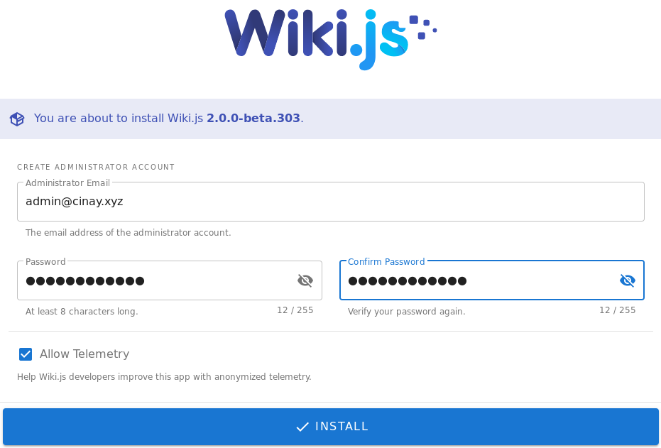
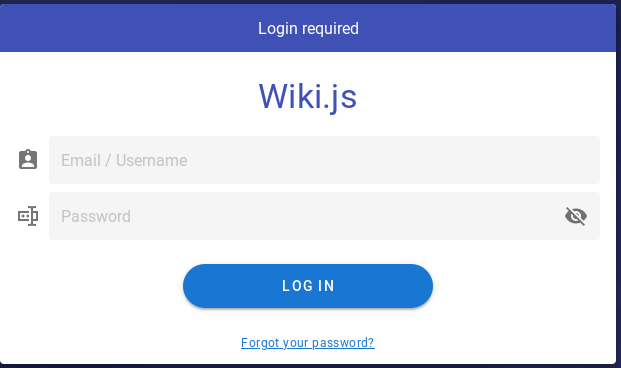

+++
title = 'wiki.js sur Debian'
date = 2019-09-18 00:00:00 +0100
categories = ['serveur']
+++
## Node.js + Yarn

### Node.js

{:width="100"}

Mise à jour dépôt debian pour la version 12 de node

    sudo apt-get install curl software-properties-common
    curl -sL https://deb.nodesource.com/setup_12.x | sudo bash -

Installez Node.js sur Debian

    sudo apt install -y nodejs

outils de développement pour créer des addons natifs 

    sudo apt install gcc g++ make

Versions

```
node -v && npm -v
v12.10.0
6.10.3
```

Installer la dernière version npm

    sudo npm install -g npm@latest
    npm -v  # affiche la version : 6.11.3

### Yarn

Installer yarn sur debian  
Exécutez les commandes suivantes pour importer la clé gpg et configurer le référentiel yarn apt.

    curl -sS https://dl.yarnpkg.com/debian/pubkey.gpg | sudo apt-key add -
    echo "deb https://dl.yarnpkg.com/debian/ stable main" | sudo tee /etc/apt/sources.list.d/yarn.list

Tapez ensuite les commandes suivantes pour installer yarn sur Ubuntu Debian et Linux.

    sudo apt-get update && sudo apt-get install yarn

## Wiki.js

* [Installer wiki.js sous linux](https://docs.requarks.io/en/install/linux)
* [How to Install Wiki.js - NodeJS based Wiki Software on Debian 9](https://www.howtoforge.com/tutorial/how-to-install-wikijs-on-debian-9/)

### Configuration requise pour le serveur

Wiki.js fonctionne sur pratiquement tous les systèmes où Node.js est supporté.
Cela signifie qu'il fonctionne sous Linux, macOS, Windows ainsi que sur des solutions de conteneurs telles que Docker / Kubernetes et Heroku.

* **UNITÉ CENTRALE** : Wiki.js fonctionne parfaitement bien sur un seul noyau CPU. Cependant, 2 noyaux ou plus sont recommandés pour utiliser pleinement les travailleurs de fond.
* **MÉMOIRE VIVE** : Les systèmes Linux doivent avoir au moins 1 Go de RAM pour exécuter Wiki.js. Les systèmes Windows et MacOS nécessitent généralement un peu plus de RAM.
* **Stockage** : Les exigences de stockage sont basées sur le contenu que vous allez saisir. Les wikis qui se composent presque exclusivement de texte ne sont pas susceptibles de dépasser quelques mégaoctets. Toutefois, dès que vous téléchargez des images, des vidéos ou d'autres fichiers, vous devez planifier vos besoins de stockage en conséquence.
* Accès Internet : Wiki.js vérifiera automatiquement les nouvelles mises à jour, langues, thèmes, etc. de temps en temps. Vous pouvez en [savoir plus sur les données téléchargées](https://docs.requarks.io/en/install/requirements/internet).  
Une autre méthode de c[hargement latéral des fichiers](https://docs.requarks.io/en/install/sideload) est également disponible si votre environnement est coupé d'Internet.
* Applications
    * node.js 10.12 ou supérieure
    * Database MariaDB 10.2.7 ou supérieure

### Configuration nginx

Créer le fichier

```
server {
    listen 80;
    listen [::]:80;

    ## redirect http to https ##
    server_name wiki.xoyize.xyz;
    return  301 https://$server_name$request_uri;
}

server {
    listen 443 ssl http2;
    listen [::]:443 ssl http2;
    server_name wiki.xoyize.xyz;

    charset utf-8;
    client_max_body_size 50M;

    include ssl_params;
    include header_params;
    # Diffie-Hellmann
    ssl_dhparam /etc/ssl/private/dh2048.pem;

    location / {
        proxy_set_header Host $http_host;
        proxy_set_header X-Real-IP $remote_addr;
        proxy_pass http://127.0.0.1:3000;
        proxy_http_version 1.1;
        proxy_set_header Upgrade $http_upgrade;
        proxy_set_header Connection "upgrade";
        proxy_next_upstream error timeout http_502 http_503 http_504;
    }
    
    access_log /var/log/nginx/wiki.xoyize.xyz-access.log;
    error_log /var/log/nginx/wiki.xoyize.xyz-error.log;
}
```

Vérifier et relancer nginx

    sudo nginx-t
    sudo systemctl reload nginx

### Installation wiki.js

Téléchargez la dernière version de Wiki.js

    wget https://github.com/Requarks/wiki/releases/download/2.0.0-beta.303/wiki-js.tar.gz

Extraire le paquet dans un dossier

    mkdir ~/wikijs
    tar xzf wiki-js.tar.gz -C ~/wikijs
    cd ~/wikijs

Renommer l'exemple de fichier de configuration en config.yml

    mv config.sample.yml config.yml

Editez le fichier de configuration et remplissez les paramètres de votre base de données, redis et port

    nano config.yml

Créer la base wikijs/mariadb avec un utilisateur et mot de passe

    mysql -u root -p$(cat /etc/mysql/mdp) < "CREATE DATABASE wikijs; GRANT ALL PRIVILEGES ON wikijs.* TO 'wikijs' IDENTIFIED BY 'Mot-de-passe'; FLUSH PRIVILEGES; quit"


Exécutez Wiki.js

    node server

Attendez d'être invité à ouvrir la page de configuration de votre navigateur.

```
Loading configuration from /home/admbust/wikijs/config.yml... OK
2019-09-18T08:54:45.123Z [MASTER] info: =======================================
2019-09-18T08:54:45.129Z [MASTER] info: = Wiki.js 2.0.0-beta.303 ==============
2019-09-18T08:54:45.129Z [MASTER] info: =======================================
2019-09-18T08:54:45.129Z [MASTER] info: Initializing...
2019-09-18T08:54:45.760Z [MASTER] info: Connecting to database...
2019-09-18T08:54:45.856Z [MASTER] info: Database Connection Successful [ OK ]
2019-09-18T08:54:50.792Z [MASTER] warn: DB Configuration is empty or incomplete. Switching to Setup mode...
2019-09-18T08:54:50.793Z [MASTER] info: Starting setup wizard...
2019-09-18T08:54:51.138Z [MASTER] info: Starting HTTP server on port 3000...
2019-09-18T08:54:51.138Z [MASTER] info: HTTP Server on port: [ 3000 ]
2019-09-18T08:54:51.147Z [MASTER] info: HTTP Server: [ RUNNING ]
2019-09-18T08:54:51.148Z [MASTER] info: 🔻🔻🔻🔻🔻🔻🔻🔻🔻🔻🔻🔻🔻🔻🔻🔻🔻🔻🔻🔻🔻🔻🔻🔻🔻🔻🔻🔻🔻
2019-09-18T08:54:51.148Z [MASTER] info: 
2019-09-18T08:54:51.148Z [MASTER] info: Browse to http://localhost:3000/ to complete setup!
2019-09-18T08:54:51.148Z [MASTER] info: 
2019-09-18T08:54:51.148Z [MASTER] info: 🔺🔺🔺🔺🔺🔺🔺🔺🔺🔺🔺🔺🔺🔺🔺🔺🔺🔺🔺🔺🔺🔺🔺🔺🔺🔺🔺🔺🔺
```

Terminez l'installation sur le lien https://wiki.xoyize.xyz avec utilisateur et mot de passe

{:width="350"}

Pour arriver sur la page de login https://wiki.xoyize.xyz/login

{:width="350"}

Page de création

{:width="350"}

> Il faut modifier la langue qui est uniquement *en* en téléchargeant le module langue *fr* puis ensuite sélectionner *fr* comme "locale" (em mode admin sur https://wiki.xoyize.xyz/a/locale)

### Exécuter wiki.js comme un service

Nous utilisons systemd car il est disponible dans presque toutes les distributions linux.  

* Utilisateur pour le service ,dans notre cas `echo $USER` &rarr; **admbust**  
* wikijs est installé dans **/home/admbust/wikijs**

Créer un nouveau fichier nommé *wiki.service* dans le répertoire **/etc/systemd/system**

    sudo nano /etc/systemd/system/wikijs.service

Collez le contenu suivant (en supposant que votre wiki est installé dans **/home/admbust/wikijs** a vec un utilisateur nommé **admbust**)

```
[Unit]
Description=Wiki.js
After=network.target

[Service]
Type=simple
ExecStart=/usr/bin/node server
Restart=always
# Consider creating a dedicated user for Wiki.js here:
User=admbust
Environment=NODE_ENV=production
WorkingDirectory=/home/admbust/wikijs

[Install]
WantedBy=multi-user.target
```

Sauvegarder le fichier de service (CTRL+X, suivi de Y).  
Recharger le système :

    sudo systemctl daemon-reload

Exécuter le service:

    sudo systemctl start wikijs

Activer le service au démarrage du système si aucune erreur

    sudo systemctl enable wikijs

>Note : Vous pouvez voir les logs du service en utilisant `journalctl -f -u wikijs`
