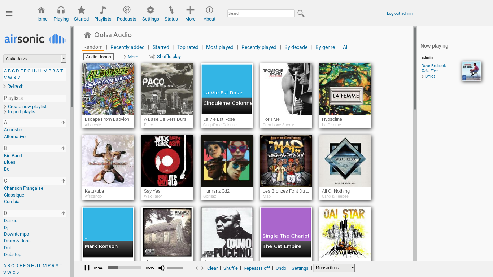
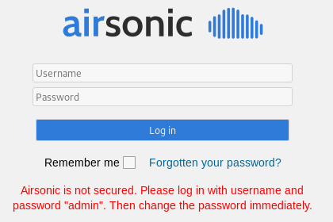
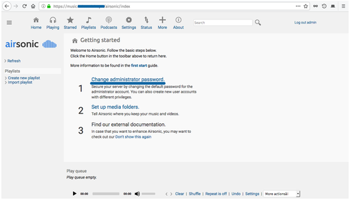
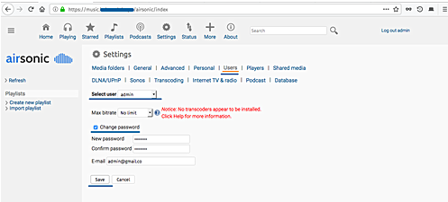
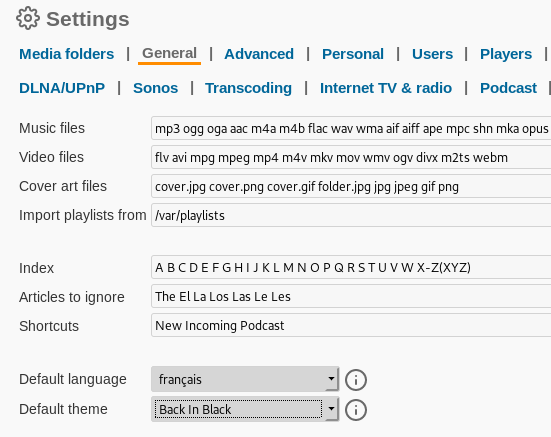
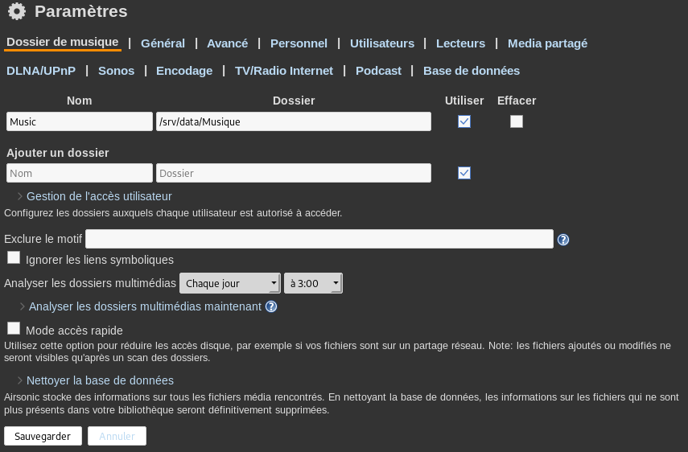
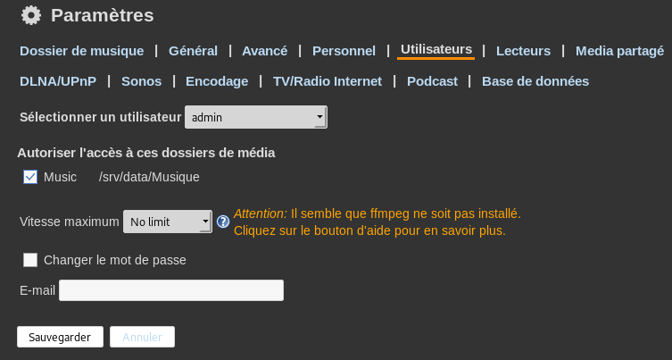
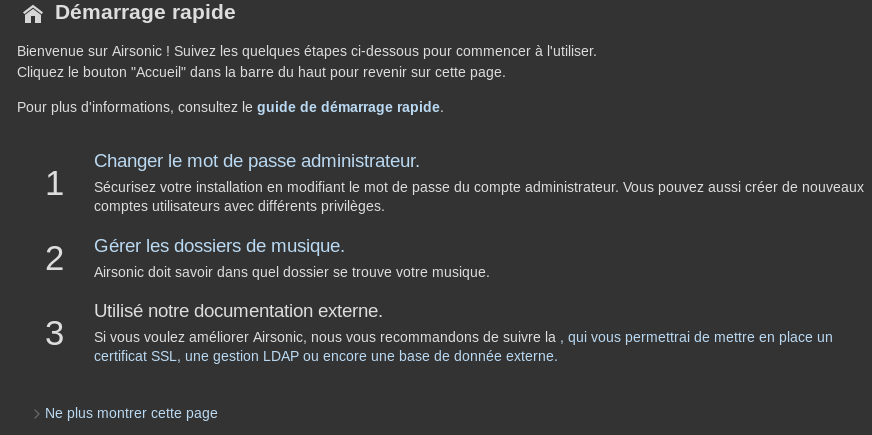

+++
title = 'Airsonic music stream'
date = 2019-09-26 00:00:00 +0100
categories = ['serveur']
+++
# Airsonic

* [Dépot GitHub](https://github.com/airsonic/airsonic)
* [Site officiel](https://airsonic.github.io/)
* [Journal des modifications](https://github.com/airsonic/airsonic/releases)
* [Airsonic documentation](https://airsonic.github.io/docs/)
* [Airsonic pour de la musique en streaming](https://wiki.bruno-tatu.com/doku.php?id=wiki:install-airsonic)
* [How to Install Airsonic Media Server on Ubuntu 18.04 LTS](https://www.howtoforge.com/tutorial/ubuntu-airsonic-media-server/)


{:width="600"}


### Historique

Subsonic, devenu propriétaire à sa version 6.0, en [2016]( http://forum.subsonic.org/forum/viewtopic.php?f=4&t=16604#p71128 ), laissa alors ses utilisateurs le bec dans l’eau. C’est là qu’est apparu [Libresonic](https://github.com/Libresonic/libresonic), une divergence de la dernière version disponible, dirigé par [Eugene E. Kashpureff Jr.](https://eugenekay.com/). Le projet fit long feu, et s’[arrêta en juillet 2017]( https://github.com/Libresonic/libresonic ), lorsque certains contributeurs ont voulu pousser dans une direction différente.
    
Bien que le projet se soit beaucoup concentré sur la maintenance de la base de code, en mettant systématiquement à jour des dépendances, et en corrigeant les éventuels bogues, il a parfois ajouté quelques nouvelles fonctionnalités. Doucement mais sûrement, les choses avancent, et Airsonic continue de devenir une alternative de plus en plus alléchante à Subsonic.

### Sortie des versions 10.3.0 et 10.3.1

Mais les choses se sont accélérées à partir de la version 10.3.0, le projet a gagné tout un tas de nouveautés :
    
- optimisations ayant trait à la base de données : points de sauvegarde, défragmentation, etc. ;
- suppression de vieilles dépendances devenues inutiles : Moment.js, pngFix.js, script.aculo.us, jQuery contextMenu, Flash, etc. ;
- suppression de la prise en charge du [WAP](https://fr.wikipedia.org/wiki/Protocole_WAP) ; mais si, souvenez‐vous, le « Web » sur les premiers téléphones mobiles !
- mise à jour de jQuery et jQuery UI, et en sautant une version majeure !
- suppression des polices de caractères externes, récupérées depuis le CDN de Google ;
- masquage des mots de passe dans les journaux de l’API ;
- utilisation systématique des attributs `noopener` et `noreferrer` pour les liens externes ;
- durcissement de la configuration _systemd_ ;
- utilisation systématique de HTTPS pour les liens externes ;
- correction de CVE-2019-10907, permettant de récupérer les mots de passe des utilisateurs en échange de leurs cookies ;
- correction de CVE-2019-10908, rendant les mots de passe générés imprédictibles ;
- suppression de la page `/db`, permettant à un administrateur de lancer directement des requêtes SQL, sans protection anti‐[CSRF](https://fr.wikipedia.org/wiki/Cross-site_request_forgery "cross‐site request forgery") ;
- correction d’un nombre conséquent de failles [XSS](https://fr.wikipedia.org/wiki/Cross-site_scripting "cross‐site site_scripting").


### Et ensuite ?

La version Git actuelle contient énormément de réusinage de code et de nettoyage : exit les méthodes obsolètes et les _anti‐patterns_, ajouts de tests pour éviter de tout casser au passage, suppression des dépendances embarquées (les « .jar » dans le dépôt Git, ça n’est pas très propre), gestion de davantage de situations problématiques qui auparavant engendraient des traces d’appels (*stacktraces*), simplifications du code pour réduire le nombre de dépendances, meilleure intégration avec la Chromecast de Google, correction de soucis de concurrences, usage d’analyse statique ([Coverity Scan](https://scan.coverity.com/projects/airsonic), [LGTM](https://lgtm.com/projects/g/airsonic/airsonic)…). Bref, la prochaine version sera encore plus formidable !

### Java 1.8/Debian Buster

Airsonic utilise la version java openjdk-8-jdk  
Modifier    **/etc/apt/sources.list**

    sudo nano /etc/apt/sources.list

Ajouter le  repo: **deb http://ftp.us.debian.org/debian sid main** puis:

    sudo apt-get update

Installer java

    sudo apt-get install openjdk-8-jdk

Vesion java

    sudo update-alternatives --config java # choix version si plusieurs
    java -version

```
openjdk version "1.8.0_222"
OpenJDK Runtime Environment (build 1.8.0_222-8u222-b10-1-b10)
OpenJDK 64-Bit Server VM (build 25.222-b10, mixed mode)
```

>Après l'installation de java , supprimer le repo: **deb http://ftp.us.debian.org/debian sid main** du fichier  **/etc/apt/sources.list** et `sudo apt-get update`


### Airsonic/Debian Buster

Airsonic fournit différents packs d'installation, pour ce guide, nous utiliserons l'installation autonome WAR.

    sudo -s  # on passe en su

Créez un nouvel utilisateur nommé'airsonic', et créez un nouveau répertoire'/opt/airsonic'.

    useradd airsonic
    mkdir -p /opt/airsonic

Allez maintenant dans le répertoire'/opt/airsonic' et téléchargez le fichier de paquet Airsonic '.WAR' en utilisant wget.

    cd /opt/airsonic
    wget https://github.com/airsonic/airsonic/releases/download/v10.4.0/airsonic.war

Et changez le propriétaire du répertoire'/opt/airsonic' pour l'utilisateur et le groupe'airsonic'.

    chown -R airsonic:airsonic /opt/airsonic

Créer un service systemd 'airsonic.service' dans le dossier '/etc/systemd/system' 

    nano /etc/systemd/system/airsonic.service

```
[Unit]
Description=Airsonic Media Server
After=remote-fs.target network.target
AssertPathExists=/opt/airsonic

[Service]
Type=simple
Environment="JAVA_JAR=/opt/airsonic/airsonic.war"
Environment="JAVA_OPTS=-Xmx700m"
Environment="AIRSONIC_HOME=/opt/airsonic"
Environment="PORT=8080"
Environment="CONTEXT_PATH=/"
Environment="JAVA_ARGS="
EnvironmentFile=-/etc/sysconfig/airsonic
ExecStart=/usr/bin/java \
          $JAVA_OPTS \
          -Dairsonic.home=${AIRSONIC_HOME} \
          -Dserver.context-path=${CONTEXT_PATH} \
          -Dserver.port=${PORT} \
          -jar ${JAVA_JAR} $JAVA_ARGS
User=airsonic
Group=airsonic

[Install]
WantedBy=multi-user.target
```


Recharger et créer une configuration par défaut 

    systemctl daemon-reload
    nano /etc/default/airsonic

```
# Set the location of the standalone war to use
JAVA_JAR=/opt/airsonic/airsonic.war

# Set any java opts separated by spaces
JAVA_OPTS=-Xmx700m

# Set a different location for the airsonic home.
# If this path is /opt/libresonic or even contains "libresonic",
# the data from a previous libresonic can be used as is (i.e. without
# renaming libresonic.properties,db/libresonic*, etc
AIRSONIC_HOME=/opt/airsonic

# Change the port to listen on
PORT=8080

# Change the path that is listened to on
CONTEXT_PATH=/

# Add any java args. These are different than JAVA_OPTS in that
# they are passed directly to the program. The default is empty:
#JAVA_ARGS=

# Note that there are several settings for spring boot, not explicitly listed
# here, but can be used in either JAVA_OPTS or JAVA_ARGS. The full list
# can be found here:
# https://docs.spring.io/spring-boot/docs/1.4.5.RELEASE/reference/htmlsingle/#common-application-properties
# For example to set debug across the board:
#JAVA_ARGS=--debug

# Or to change the IP address that is listened to:
JAVA_ARGS=--server.address=127.0.0.1
```

Démarrer le service Airsonic et l'activer

    systemctl start airsonic
    systemctl enable airsonic


airsonic 'stand-alone' est installé, vérifier

    netstat -plntu

```
Connexions Internet actives (seulement serveurs)
Proto Recv-Q Send-Q Adresse locale          Adresse distante        Etat        PID/Program name    
tcp        0      0 127.0.0.1:3306          0.0.0.0:*               LISTEN      28064/mysqld        
tcp6       0      0 :::111                  :::*                    LISTEN      1/systemd           
tcp6       0      0 :::8080                 :::*                    LISTEN      23470/java          
tcp6       0      0 :::80                   :::*                    LISTEN      12059/nginx: master 
```

### Nginx

Créer le fichier de configuration **/etc/nginx/conf.d/audio.xoyize.xyz.conf**

```
server {
    listen 80;
    listen [::]:80;

    ## redirect http to https ##
    server_name audio.xoyize.xyz;
    return  301 https://$server_name$request_uri;
}

server {
    listen 443 ssl http2;
    listen [::]:443 ssl http2;

    include ssl_params;
    include header_params;
    # Diffie-Hellmann
    # Uncomment the following directive after DH generation
    # > openssl dhparam -out /etc/ssl/private/dh2048.pem -outform PEM -2 2048
    ssl_dhparam /etc/ssl/private/dh2048.pem;
    location / {
      proxy_pass                         http://127.0.0.1:8080;
    }


}
```

Vérifier et relancer nginx

    nginx -t
    systemctl restart nginx

### Navigation

Avec un navigateur, ouvrir le lien https://audio.xoyize.xyz  

{:height="150"}

Saisir **admin** en login/mot de passe  

Cliquer sur "Change administrator password"

{:width="400"}

Sélectionnez maintenant l'utilisateur'admin' et marquez 'Change password', puis tapez le nouveau mot de passe admin et cliquez sur'Save'.

{:width="400"}

Modifier la langue et le fond dnas "General"

{:width="400"}  
Cliquer sur "Save"

{:width="400"}

Configurer les dossiers média , cliquer sur "Dossier de musique"

{:width="400"}  
Cliquer sur "Sauvegarder"

Allez maintenant dans l'onglet 'Utilisateurs', sélectionnez l'utilisateur 'admin' et vérifiez le dossier média'Musique' comme ci-dessous.

{:width="400"}  
Cliquer sur "Sauvegarder"

Si demandé , installer ffmpeg

    sudo apt install ffmpeg

Déconnexion , reconnexion airsonic

{:width="400"}  
Cliquer sur "Ne plus montrer cette page"


