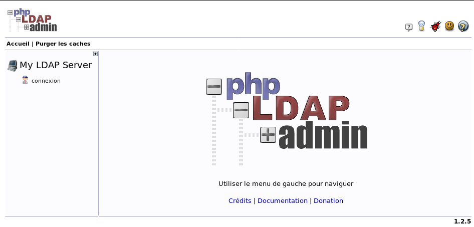

+++
title = 'OpenLDAP installation et configuration annuaire'
date = 2019-10-10 00:00:00 +0100
categories = ['debian']
+++
# OpenLDAP Debian


## Liens

* [Getting started with OpenLDAP on Debian ](https://www.vennedey.net/resources/0-Getting-started-with-OpenLDAP-on-Debian-8)  
* [LDAP managed mail server with Postfix and Dovecot for multiple domains](https://www.vennedey.net/resources/2-LDAP-managed-mail-server-with-Postfix-and-Dovecot-for-multiple-domains)  
* [Installation d'un serveur mail avec backend OpenLDAP](https://wiki.gandi.net/fr/hosting/using-linux/tutorials/debian/mail-server-ldap)  
* [How To Install and Configure OpenLDAP Server on Debian 10 (Buster)](https://computingforgeeks.com/how-to-install-and-configure-openldap-server-on-debian/) 

* [Mise en place de OpenLDAP](http://idum.fr/spip.php?article326) (*Le but de cet article est de vous faire découvrir OpenLDAP. En commençant par vous expliquer comment il fonctionne. Puis comment l’installer. Et enfin comment l’administrer.  
Pour nous aider dans cette dernière partie, j’utiliserai l’interface web phpldapadmin.*)  
[Mise en place de OpenLDAP](/files/Mise en place de OpenLDAP.pdf) (Document au format PDF)

## OpenLDAP Serveur

*Les tests sont effectués sur le serveur cinay.eu*

* [OVH VPS SSD 1 KVM OpenStack (1 vCore/2GoRam/20GoSSD) domaine cinay.eu + compilation OpenResty](404/)

Avant de commencer l'installation, configurez le nom d'hôte FQDN de votre serveur et ajoutez un enregistrement au fichier **/etc/hosts**  
Relever l'adresse ip de votre serveur `ip a` (ici notre adresse ip 192.168.0.45)

```
echo "192.168.0.45 ldap.cinay.eu" | sudo tee -a /etc/hosts
sudo hostnamectl set-hostname ldap.cinay.eu --static
```


### Installation

>en mode su ou sudo

L'installation d'OpenLDAP sur Debian est faite à l'aide de la gestion des paquets APT.  
Le premier élément précise que l'installation du paquet **slapd** se fait en mode non interactif et `-yq` ajoute l'installation en mode silencieux.

    DEBIAN_FRONTEND=noninteractive apt-get -yq install slapd ldap-utils net-tools

Pendant l'installation, vous devrez choisir un mot de passe de l'administrateur pour le compte racine LDAP. rhTJH8f97dkS65

### Configuration initiale

Créer un squelette de configuration pour **slapd**

    dpkg-reconfigure slapd

Voulez-vous omettre la configuration d'OpenLDAP ? Non  
Nom de domaine : xoyize.xyz  
Nom d'entité (« organization ») : srvxo 
Mot de passe de l'administrateur : ZAYz4zCGs5kb  
Module de base de données à utiliser : MDB  
Faut-il supprimer la base de données lors de la purge du paquet ? Non  
Faut-il déplacer l'ancienne base de données ? Oui  

### Tests fonctionnels

Activer au démarrage et lancer **slapd** .  

    systemctl enable slapd
    systemctl start slapd


Sur quel port du réseau écoute slapd  

    netstat -laputn | grep slapd

```
tcp        0      0 0.0.0.0:389             0.0.0.0:*               LISTEN      10204/slapd         
tcp6       0      0 :::389                  :::*                    LISTEN      10204/slapd     
```

Comme on peut le voir, **slapd** attend les requêtes ldap sur le port TCP 389.  
Avec quels arguments s'exécute le service.   

    cat /var/run/slapd/slapd.args

```
/usr/sbin/slapd -h ldap:/// ldapi:/// -g openldap -u openldap -F /etc/ldap/slapd.d 
```

**-h** &rarr; les modalités d'accès à slapd : ldap et ldapi (ldap via TCP 389 et ldapi via socket unix)  
**-g** et **-u** &rarr; identité groupe et utilisateur sur lequel "tourne" le processus slapd  
**-F** &rarr; emplacement du ficher de configuration de slapd

Afficher les données de l'annuaire

    ldapsearch -x -H ldap://xoyize.xyz -b 'dc=xoyize,dc=xyz'

```
# extended LDIF
#
# LDAPv3
# base <dc=xoyize,dc=xyz> with scope subtree
# filter: (objectclass=*)
# requesting: ALL
#

# search result
search: 2
result: 32 No such object

# numResponses: 1
```

**-x** &rarr; nous utilisons un compte défini à l'intérieur de la base pour accéder à l'annuaire  
**-H** &rarr; accès en ldap sur la machine xoyize.xyz  
**-b** &rarr; la racine à parcourir , ici 'dc=xoyize,dc=xyz'

Définir un répertoire de configuration

    sudo -s
    mkdir -p /root/ldap/xoyize.xyz
    cd /root/ldap/xoyize.xyz

Créer un fichier /root/pwdldap et y mettre le mot de passe administrateur

    echo -n "mdpadmin" > /root/pwdldap
    chmod 600 /root/pwdldap

Pour éviter la saisie du mot de passe on remplace l'option **-W** par **-y /root/pwdldap**

### Peuplement de l'annuaire

Peupler l'annuaire en créant les deux **OU** puis un compte système avec son groupe primaire.  
Créer un fichier au format LDIF (LDAP Data Interchange Format)

```
cat > ou.ldif << EOF
dn: ou=posixaccounts,dc=xoyize,dc=xyz
objectclass: OrganizationalUnit

dn: ou=posixgroups,dc=xoyize,dc=xyz
objectclass: OrganizationalUnit

EOF
```

Nous avons les deux OU

* **posixaccounts** qui va contenir les comptes UNIX
* **posixgroups** qui va contenir les groupes UNIX

Ajouter à l'annuaire

    ldapadd  -x -H ldap://xoyize.xyz -D 'cn=admin,dc=xoyize,dc=xyz' -y /root/pwdldap -f ou.ldif 

**-D** &rarr; précise quel compte on va utiliser pour se connecter à slapd (ici, l'administrateur)  
**-W** &rarr; pour la demande du mot de passe associé ou **-y /root/pwdldap** 
**-f** &rarr; le fichier .ldif


Ajouter le compte avec le groupe primaire (yanspm mp yansmm49450)  

```
cat > userandupg.ldif << EOF
dn: uid=yanspm, ou=posixaccounts,dc=xoyize,dc=xyz
uid: yanspm
sn: yanspm
homeDirectory: /home/yanspm
cn: yanspm
objectClass: inetOrgPerson
objectClass: posixAccount
objectClass: top
loginShell: /bin/bash
uidNumber: 6001
gidNumber: 6001
gecos: yan
mail: yanspm@cinay.xyz
userPassword: {SSHA}gzJOGEJ/fLvyp1g8zdOSGcJQZjSRukE5

dn: cn=yanspm,ou=posixgroups,dc=xoyize,dc=xyz
objectClass: posixGroup
objectClass: top
gidNumber: 6001
cn: yanspm

EOF
```

Pour créer l'empreinte du mot de passe

    slappasswd

```
New password: 
Re-enter new password: 
{SSHA}gzJOGEJ/fLvyp1g8zdOSGcJQZjSRukE5
```

Ajout des 2 objets

    ldapadd  -x -H ldap://xoyize.xyz -D 'cn=admin,dc=xoyize,dc=xyz' -f userandupg.ldif -W

```
Enter LDAP Password: 
adding new entry "uid=yanspm, ou=posixaccounts,dc=xoyize,dc=xyz"

adding new entry "cn=yanspm,ou=posixgroups,dc=xoyize,dc=xyz"
```

### Sécuriser avec SSL

SSL, couche additionnelle à TCP qui chiffre les échanges.  
On va activer ldaps et modifier les paramètres de lancement du service et générer un certificat.  

#### Création des certificats

Création du répertoire ssl

    mkdir /etc/ldap/ssl && cd /etc/ldap/ssl

Générer certificat autosigné

    openssl req -x509 -newkey rsa:4096 -keyout key.pem -out cert.pem -days 3650 -nodes

```
Generating a RSA private key
.................................++++
..................................................++++
writing new private key to 'key.pem'
-----
You are about to be asked to enter information that will be incorporated
into your certificate request.
What you are about to enter is what is called a Distinguished Name or a DN.
There are quite a few fields but you can leave some blank
For some fields there will be a default value,
If you enter '.', the field will be left blank.
-----
Country Name (2 letter code) [AU]:FR
State or Province Name (full name) [Some-State]:Pays de Loire        
Locality Name (eg, city) []:SMM
Organization Name (eg, company) [Internet Widgits Pty Ltd]:home
Organizational Unit Name (eg, section) []:
Common Name (e.g. server FQDN or YOUR name) []:xoyize.xyz
Email Address []:
```

Le seul champ important : **Common Name**

Changer les permissions sur les 2 fichiers pour appartenir à l'utilisateur *openldap*

    chown openldap:openldap /etc/ldap/ssl/key.pem
    chown openldap:openldap /etc/ldap/ssl/cert.pem

Clé privée accessible par root uniquement

    chmod 400 /etc/ldap/ssl/key.pem

#### Configuration de slapd

Ajout de 2 directives pour trouver le couple clé/certificat  

```
cat > cert.ldif << EOF
dn: cn=config
changetype: modify
replace: olcTLSCACertificateFile
olcTLSCACertificateFile: /etc/ldap/ssl/cert.pem
-
replace: olcTLSCertificateFile
olcTLSCertificateFile: /etc/ldap/ssl/cert.pem
-
replace: olcTLSCertificateKeyFile
olcTLSCertificateKeyFile: /etc/ldap/ssl/key.pem

EOF
```

Pour appliquer les modifications ,nous allons passer par le mode ldapi car il n'y a pas de compte administrateur associé à la racine cn=config

    ldapmodify -Y EXTERNAL -H ldapi:/// -f cert.ldif

```
SASL/EXTERNAL authentication started
SASL username: gidNumber=0+uidNumber=0,cn=peercred,cn=external,cn=auth
SASL SSF: 0
modifying entry "cn=config"
```

Argument **-x** a disparu au profit de **-Y EXTERNAL** pour une authentification via l'UID  
L'option **-H** a pour valeur ldapi:/// qui pointe sur le socket UNIX géré par slapd  

Dernière étape, modifier le fichier **/etc/default/slapd** pour lui indiquer qu'il doit gérer  la méthode d'accès ldaps

    nano /etc/default/slapd

```
SLAPD_SERVICES="ldap:/// ldapi:/// ldaps:///"
```

Relancer slapd

    systemctl restart slapd

Vérification

    netstat -laputn | grep slapd

```
tcp        0      0 0.0.0.0:636             0.0.0.0:*               LISTEN      23197/slapd         
tcp        0      0 0.0.0.0:389             0.0.0.0:*               LISTEN      23197/slapd         
tcp6       0      0 :::636                  :::*                    LISTEN      23197/slapd         
tcp6       0      0 :::389                  :::*                    LISTEN      23197/slapd
```

Nous avons le service slapd en écoute SSL sur le port 636

>**ATTENTION , si parefeu , ouvrir en entrée le port TCP 636 IPV4/IPV6**

## OpenLDAP PHP sur serveur

Installer le module

    sudo apt install php7.3-ldpa

Fichiers de test  

    /var/www/test.php

```php
<?php
$baseDN = "dc=ldap,dc=cinay,dc=eu";
$ldapServer = "ldap.cinay.eu";
$ldapServerPort = 389;
$rdn="admin";
$mdp="f43z7C9TBwxX3h";
$dn = 'cn=admin,dc=ldap,dc=cinay,dc=eu';

echo "Connexion au serveur <br />";
$conn=ldap_connect($ldapServer);

// on teste : le serveur LDAP est-il trouvé ?
if ($conn) {
 echo "Le résultat de connexion est ".$conn ."<br />";
} else {
 die("connexion impossible au serveur LDAP");
}

// 2ème étape : on effectue une liaison au serveur, ici de type "anonyme"
// pour une recherche permise par un accès en lecture seule

// On dit qu'on utilise LDAP V3, sinon la V2 par défaut est utilisé
// et le bind ne passe pas. 
if (ldap_set_option($conn, LDAP_OPT_PROTOCOL_VERSION, 3)) {
    echo "Utilisation de LDAPv3 <br />";
 } else {
    echo "Impossible d'utiliser LDAP V3<br />";
    exit;
 }

// Instruction de liaison. 
// Décommenter la ligne pour une connexion authentifiée
// ou pour une connexion anonyme.
// Connexion authentifiée
print ("Connexion authentifiée ...<br />");
$bindServerLDAP=ldap_bind($conn,$dn,$mdp);
// print ("Connexion anonyme...<br />");
// $bindServerLDAP=ldap_bind($conn);

echo "Liaison au serveur : ". ldap_error($conn)."<br />";
// en cas de succès de la liaison, renvoie Vrai
if ($bindServerLDAP)
  echo "Le résultat de connexion est $bindServerLDAP <br />";
else
  die("Liaison impossible au serveur ldap ...");

/* 3ème étape : on effectue une recherche anonyme, avec le dn de base,
 * par exemple, sur tous les noms commençant par B
 */
echo "Recherche suivant le filtre (sn=y*) <br />";
$query = "sn=y*";
$result=ldap_search($conn, $baseDN, $query);
echo "Le résultat de la recherche est $result <br />";

echo "Le nombre d'entrées retournées est ".ldap_count_entries($conn,$result)."<p />";
echo "Lecture de ces entrées ....<p />";
$info = ldap_get_entries($conn, $result);
echo "Données pour ".$info["count"]." entrées:<p />";

for ($i=0; $i < $info["count"]; $i++) {
        echo "dn est : ". $info[$i]["cn"] ."<br />";
        echo "premiere entree cn : ". $info[$i]["cn"][0] ."<br />";
        echo "premier email : ". $info[$i]["mail"][0] ."<p />";
}

// Test utilisateur mot de passe
	if($bindServerLDAP = @ldap_bind($conn, "uid=yanspm,ou=posixaccounts,dc=ldap,dc=cinay,dc=eu", "yansmm49450")) {
	  echo "OK Test utilisateur mot de passe <br />";
	} else {
	  echo "ERROR Test utilisateur mot de passe <br />";
	}
	


echo "Fermeture de la connexion";
ldap_close($conn);


?>
```

Résultat

```
Connexion au serveur
Le résultat de connexion est Resource id #2
Utilisation de LDAPv3
Connexion authentifiée ...
Liaison au serveur : Success
Le résultat de connexion est 1
Recherche suivant le filtre (sn=y*)
Le résultat de la recherche est Resource id #3
Le nombre d'entrées retournées est 1

Lecture de ces entrées ....

Données pour 1 entrées:

dn est : Array
premiere entree cn : yanspm
premier email : yanspm@cinay.xyz

OK Test utilisateur mot de passe
Fermeture de la connexion
```


    /var/www/test1.php

```php
<?php
//pour les tests
$user = "yanspm";
$password="yansmm49450";

	// annuaire ldap
	$ldap_host = "ldap.cinay.eu";

	// connexion annuaire
	$ldap = ldap_connect($ldap_host);

	// on teste : le serveur LDAP est-il trouvé ?
	if (!$ldap) {
	 echo "Erreur connexion ...<br />";
	} 

	// configure ldap params
	ldap_set_option($ldap,LDAP_OPT_PROTOCOL_VERSION,3);
	print ("Connexion anonyme...<br />");
	$bindServerLDAP=ldap_bind($ldap);

	echo "Liaison au serveur : ". ldap_error($conn)."<br />";
	// en cas de succès de la liaison, renvoie Vrai
	if ($bindServerLDAP)
	  echo "Le résultat de connexion est $bindServerLDAP <br />";
	else
	  die("Liaison impossible au serveur ldap ...");

	// Test utilisateur mot de passe
	if($bindServerLDAP = @ldap_bind($ldap, "uid=".$user.",ou=posixaccounts,dc=ldap,dc=cinay,dc=eu", $password)) {
	  echo "OK Test utilisateur mot de passe <br />";
	} else {
	  echo "ERROR Test utilisateur mot de passe <br />";
	}


?>
```

Page authentification

    /var/www/authenticate.php

```php
<?php
function authenticate($user, $password) {

//pour les tests
//$user = "yanspm";
//$password="yansmm49450";

	if(empty($user) || empty($password)) return false;
	// annuaire ldap
	$ldap_host = "ldap.cinay.eu";

	// connexion annuaire
	$ldap = ldap_connect($ldap_host);

	// on teste : le serveur LDAP est-il trouvé ?
	if (!$ldap) {
	 echo "Erreur connexion ...<br />";
	 return false;
	} 

	// configure ldap params
	ldap_set_option($ldap,LDAP_OPT_PROTOCOL_VERSION,3);
	print ("Connexion anonyme...<br />");
	$bindServerLDAP=ldap_bind($ldap);

	echo "Liaison au serveur : ". ldap_error($conn)."<br />";
	// en cas de succès de la liaison, renvoie Vrai
	if ($bindServerLDAP)
	  echo "Le résultat de connexion est $bindServerLDAP <br />";
	else
	  //die("Liaison impossible au serveur ldap ...");
	  return false;

	// Test utilisateur mot de passe
	if($bindServerLDAP = @ldap_bind($ldap, "uid=".$user.",ou=posixaccounts,dc=ldap,dc=cinay,dc=eu", $password)) {
	  echo "OK Test utilisateur mot de passe <br />";
	  $access = 1;
			// establish session variables
			$_SESSION['user'] = $user;
			$_SESSION['access'] = $access;
			echo "variables ajustées <br />";
			return true;
	} else {
	  echo "ERROR Test utilisateur mot de passe <br />";
	 return false;
	}


}
?>
```

Page protection

    /var/www/protected.php

```php

<?php
// initialize session
session_start();

if(!isset($_SESSION['user'])) {
	// user is not logged in, do something like redirect to login.php
	header("Location: login.php");
	die();
}

if($_SESSION['access'] != 1) {
	// another example...
	// user is logged in but not a manager, let's stop him
	die("Access Denied");
}
?>

<p>Welcome <?= $_SESSION['user'] ?>!</p>

<p><strong>Secret Protected Content Here!</strong></p>

<p>Ceci est un test...</p>

// <p><a href="login.php?out=1">Logout</a></p>
<p><a href="index.php?out=1">Logout</a></p>

```

Page de connexion

    /var/www/index.php

```php
<?php
// initialize session
session_start();

include("authenticate.php");

// check to see if user is logging out
if(isset($_GET['out'])) {
	// destroy session
	session_unset();
	$_SESSION = array();
	unset($_SESSION['user'],$_SESSION['access']);
	session_destroy();
}

// check to see if login form has been submitted
if(isset($_POST['userLogin'])){
	// run information through authenticator
	if(authenticate($_POST['userLogin'],$_POST['userPassword']))
	{
		// authentication passed
		header("Location: protected.php");
		die();
	} else {
		// authentication failed
		$error = 1;
	}
}

// output error to user
if(isset($error)) echo "Login failed: Incorrect user name, password, or rights<br />";

// output logout success
if(isset($_GET['out'])) echo "Logout successful";
?>

<!DOCTYPE/>
/>
<head>
<meta name="viewport" content="width=device-width, initial-scale=1">
<style>
body {font-family: Arial, Helvetica, sans-serif;}

/* Full-width input fields */
input[type=text], input[type=password] {
  width: 100%;
  padding: 12px 20px;
  margin: 8px 0;
  display: inline-block;
  border: 1px solid #ccc;
  box-sizing: border-box;
}

/* Set a style for all buttons */
button {
  background-color: #4CAF50;
  color: white;
  padding: 14px 20px;
  margin: 8px 0;
  border: none;
  cursor: pointer;
  width: 100%;
}

button:hover {
  opacity: 0.8;
}

/* Extra styles for the cancel button */
.cancelbtn {
  width: auto;
  padding: 10px 18px;
  background-color: #f44336;
}

/* Center the image and position the close button */
.imgcontainer {
  text-align: center;
  margin: 24px 0 12px 0;
  position: relative;
}

img.avatar {
  width: 40%;
  border-radius: 50%;
}

.container {
  padding: 16px;
}

span.psw {
  float: right;
  padding-top: 16px;
}

/* The Modal (background) */
.modal {
  display: none; /* Hidden by default */
  position: fixed; /* Stay in place */
  z-index: 1; /* Sit on top */
  left: 0;
  top: 0;
  width: 100%; /* Full width */
  height: 100%; /* Full height */
  overflow: auto; /* Enable scroll if needed */
  background-color: rgb(0,0,0); /* Fallback color */
  background-color: rgba(0,0,0,0.4); /* Black w/ opacity */
  padding-top: 60px;
}

/* Modal Content/Box */
.modal-content {
  background-color: #fefefe;
  margin: 5% auto 15% auto; /* 5% from the top, 15% from the bottom and centered */
  border: 1px solid #888;
  width: 40%; /* Could be more or less, depending on screen size */
}

/* The Close Button (x) */
.close {
  position: absolute;
  right: 25px;
  top: 0;
  color: #000;
  font-size: 35px;
  font-weight: bold;
}

.close:hover,
.close:focus {
  color: red;
  cursor: pointer;
}

/* Add Zoom Animation */
.animate {
  -webkit-animation: animatezoom 0.6s;
  animation: animatezoom 0.6s
}

@-webkit-keyframes animatezoom {
  from {-webkit-transform: scale(0)} 
  to {-webkit-transform: scale(1)}
}
  
@keyframes animatezoom {
  from {transform: scale(0)} 
  to {transform: scale(1)}
}

/* Change styles for span and cancel button on extra small screens */
@media screen and (max-width: 300px) {
  span.psw {
     display: block;
     float: none;
  }
  .cancelbtn {
     width: 100%;
  }
}
</style>
</head>
<body>

<h2>Modal Login Form</h2>

<button onclick="document.getElementById('id01').style.display='block'" style="width:auto;">Login</button>

<div id="id01" class="modal">
  
  <form class="modal-content animate" method="post">
    <div class="imgcontainer">
      <span onclick="document.getElementById('id01').style.display='none'" class="close" title="Close Modal">&times;</span>
      
    </div>

    <div class="container">
      <label for="uname"><b>Username</b></label>
      <input type="text" placeholder="Enter Username" name="userLogin" required>

      <label for="psw"><b>Password</b></label>
      <input type="password" placeholder="Enter Password" name="userPassword" required>
        
      <button type="submit">Login</button>
      <label>
        <input type="checkbox" checked="checked" name="remember"> Remember me
      </label>
    </div>

    <div class="container" style="background-color:#f1f1f1">
      <button type="button" onclick="document.getElementById('id01').style.display='none'" class="cancelbtn">Cancel</button>
      <span class="psw">Forgot <a href="#">password?</a></span>
    </div>
  </form>
</div>

<script>
// Get the modal
var modal = document.getElementById('id01');

// When the user clicks anywhere outside of the modal, close it
window.onclick = function(event) {
    if (event.target == modal) {
        modal.style.display = "none";
    }
}
</script>

</body>
</>
```


## OpenLDAP Client

### Configuration du client

**Machine debian stretch sur virtualbox/PC1**  
machine : dbs  

Accès ssh

    ssh dbsuser@192.168.0.47 -p 22 -i /home/yannick/.ssh/vbox-dbs-ed25519


1. Raccorder le client au serveur LDAP et vérifier la consultation de l'annuaire
2. Installer la partie cliente pour augmenter la base des comptes locaux avec celle contenue dans la base LDAP

#### Raccordement au ldap

**Toutes les commandes en mode su ou sudo**

    sudo -s

Installer les outils ldap

    apt install ldap-utils

Vérifier la connexion au port SSL 636 du serveur

    openssl s_client -connect ldap.cinay.eu:636 -showcerts

```
CONNECTED(00000003)
depth=0 C = FR, ST = Pays de Loire, L = SMM, O = home, CN = ldap.cinay.eu
verify error:num=18:self signed certificate
verify return:1
depth=0 C = FR, ST = Pays de Loire, L = SMM, O = home, CN = ldap.cinay.eu
verify return:1
---
Certificate chain
 0 s:C = FR, ST = Pays de Loire, L = SMM, O = home, CN = ldap.cinay.eu
   i:C = FR, ST = Pays de Loire, L = SMM, O = home, CN = ldap.cinay.eu
-----BEGIN CERTIFICATE-----
MIIFlTCCA32gAwIBAgIUeXV2oJaFi7zIHu7AZGAwqFbPOm8wDQYJKoZIhvcNAQEL
[...]
```

Création du dossier ssl

    mkdir /etc/ldap/ssl

Récupérer le certificat **cert.pem** du serveur pour que le client puisse valider qu'il s'adresse au bon endroit.  

    cat > /etc/ldap/ssl/cert.pem

Copier/coller le contenu du fichier **cert.pem** du serveur **ldap.cinay.eu** dans ce terminal, et presser [Ctrl]+[D] pour valider.

Configurer le fichier **/etc/ldap/ldap.conf** pour y insérer les informations de connexion au serveur LDAP

```
#
# LDAP Defaults
#

# See ldap.conf(5) for details
# This file should be world readable but not world writable.

BASE    dc=ldap,dc=cinay,dc=eu
URI     ldaps://ldap.cinay.eu                                      

# TLS certificates (needed for GnuTLS)
TLS_CACERT      /etc/ldap/ssl/cert.pem
```

Les paramètres 

* **BASE** &rarr; synonyme de l'option **-b** des commandes clientes ldap
* **URI** &rarr; synonyme de l'option **-H**
* **TLS_CACERT** &rarr; Emplacement du certificat

Test depuis le client

    ldapsearch -x

```
# extended LDIF
#
# LDAPv3
# base <dc=ldap,dc=cinay,dc=eu> (default) with scope subtree
# filter: (objectclass=*)
# requesting: ALL
#

# ldap.cinay.eu
dn: dc=ldap,dc=cinay,dc=eu
objectClass: top
objectClass: dcObject
objectClass: organization
o: ldap.cinay.eu
dc: ldap

# admin, ldap.cinay.eu
dn: cn=admin,dc=ldap,dc=cinay,dc=eu
objectClass: simpleSecurityObject
objectClass: organizationalRole
cn: admin
description: LDAP administrator

# posixaccounts, ldap.cinay.eu
dn: ou=posixaccounts,dc=ldap,dc=cinay,dc=eu
objectClass: organizationalUnit
ou: posixaccounts

# posixgroups, ldap.cinay.eu
dn: ou=posixgroups,dc=ldap,dc=cinay,dc=eu
objectClass: organizationalUnit
ou: posixgroups

# yanspm, posixaccounts, ldap.cinay.eu
dn: uid=yanspm,ou=posixaccounts,dc=ldap,dc=cinay,dc=eu
uid: yanspm
sn: yanspm
homeDirectory: /home/yanspm
cn: yanspm
objectClass: inetOrgPerson
objectClass: posixAccount
objectClass: top
loginShell: /bin/bash
uidNumber: 6001
gidNumber: 6001
gecos: yan
mail: yanspm@cinay.xyz

# yanspm, posixgroups, ldap.cinay.eu
dn: cn=yanspm,ou=posixgroups,dc=ldap,dc=cinay,dc=eu
objectClass: posixGroup
objectClass: top
gidNumber: 6001
cn: yanspm

# search result
search: 2
result: 0 Success

# numResponses: 7
# numEntries: 6
```

La commande renvoie les 6 entrées de l'annuaire:  
racine + 2 OU + admin de la racine + compte + groupe

### Complétion des comptes locaux avec LDAP

Le programme NSS (Name Switching Service) gère les bases de compte Linux.  
Il s'appuie sur le service SSSD (System Security Service Daemon) qui pointe sur le serveur LDAP  
SSSD présente à NSS les comptes stockés dans LDAP  

En premier , installer SSSD

    apt install sssd

Suite à cette installation , vue sur le fichier de configuration NSS

    cat /etc/nsswitch.conf 

```
# /etc/nsswitch.conf
#
# Example configuration of GNU Name Service Switch functionality.
# If you have the `glibc-doc-reference' and `info' packages installed, try:
# `info libc "Name Service Switch"' for information about this file.

passwd:         compat sss
group:          compat sss
shadow:         compat sss
[...]
```

On voit que le programme NSS va interroger le service SSSD (sss), cela concerne les bases *passwd* , *group* et *shadow*  

Configurer le service SSSD avec les information de notre serveur LDAP avec le fichier **/etc/sssd/sssd.conf**

    nano /etc/sssd/sssd.conf

```
[sssd]
services = nss, pam
domains = LOCAL, LDAP

[domain/LDAP]
description = LOCAL Users domain
id_provider = local
enumerate = True

[domain/LDAP]
id_provider = ldap
auth_provider = ldap
ldap_schema = rfc2307
ldap_uri = ldaps://ldap.cinay.eu
ldap_search_base = dc=ldap,dc=cinay,dc=eu
enumerate = True
ldap_tls_cacert = /etc/ldap/ssl/cert.pem
```

* La ligne **services** nous informe que SSSD sera utilisé pour la gestion des comptes (*nss*) et l'authentification (*pam*)  
* La ligne **domains** prend 2 valeurs :
    * **LOCAL** correspond aux comptes locaux de la machine (**/etc/passwd,/etc/group et/etc/shadow**)
    * **LDAP** corresopn aux comptes stockés dans LDAP
* Section **[domain/LDAP]** : Nous retrouvons les paramètres de configuration du **ldap.conf** , la spécification du protocole LDAP comme méthode d'accès au compte (**id_provider**) et "credentials" d'authentification (**auth_provider**)  

Relancer le service (il est validé lors de l'installation)

    systemctl restart sssd

Vérification

    getent passwd |grep "yanspm"

```
yanspm:*:6001:6001:yan:/home/yanspm:/bin/bash
```

La commande `getent` prend comme paramètre une base NSS (passwd,group ou shadow) et en affiche le contenu  
Nous affichons la base *passwd* qui contient bien le compte LDAP yanspm  

Créer un **home** pour l'utilisateur *yanspm*

    mkdir /home/yanspm

Les droits

    chown yanspm:yanspm /home/yanspm
    chmod 750 /home/yanspm

On se déconnecte du client

    logout

On s'authentifie avec l'utilisateur *yanspm* créer dans LDAP et on vérifie

    id

```
yanspm:*:6001:6001:yan:/home/yanspm:/bin/bash
```

# Annuaire LDAP Debian Buster

* [OpenLDAP installation et configuration annuaire](/posts/OpenLDAP-installation-configuration-annuaire/) 
* [How To Install and Configure OpenLDAP Server on Debian 10 (Buster)](https://computingforgeeks.com/how-to-install-and-configure-openldap-server-on-debian/) 
* [How to configure LDAP Client](https://computingforgeeks.com/how-to-configure-ubuntu-18-04-ubuntu-16-04-lts-as-ldap-client/)
* [Secure LDAP Server with SSL/TLS](https://computingforgeeks.com/secure-ldap-server-with-ssl-tls-on-ubuntu/)

Avant de commencer l'installation, configurez le nom d'hôte FQDN de votre serveur et ajoutez un enregistrement au fichier **/etc/hosts**  
Relever l'adresse ip de votre serveur `ip a` (ici notre adresse ip 192.168.0.45)

```
echo "192.168.0.45 ldap.xoyize.xyz" | sudo tee -a /etc/hosts
sudo hostnamectl set-hostname ldap.xoyize.xyz --static
```

### Installation , configuration et tests openLDAP

**Installation et configuration**

    DEBIAN_FRONTEND=noninteractive apt-get -yq install slapd ldap-utils net-tools
    dpkg-reconfigure slapd

```
Voulez-vous omettre la configuration d’OpenLDAP ? Non
Nom de domaine : xoyize.xyz
Nom d’entité (« organization ») : xoyize.xyz
Mot de passe de l’administrateur : *******
Module de base de données à utiliser : MDB
Faut-il supprimer la base de données lors de la purge du paquet ? Non
Faut-il déplacer l’ancienne base de données ? Oui
```

**ATTENTION ATTENTION ATTENTION**  
DEBIAN 10 (Buster) avec la saisie nom  de domaine ldap.xoyize.xyz donnera dc=xoyize,dc=xyz , la base LDAP sera ERRONEE   
DEBIAN 9 (Stretch) avec la saisie nom  de domaine ldap.xoyize.xyz donnera dc=ldap,dc=xoyize,dc=xyz  

>Dans la saisie **Nom de domaine + entité** , NE PAS METTRE **ldap.** ,SEULEMENT **xoyize.xyz**

**Tests**

    systemctl enable slapd  # activation
    systemctl start slapd   # exécution

Ecoute

    netstat -laputn | grep slapd

```
tcp        0      0 0.0.0.0:389             0.0.0.0:*               LISTEN      10204/slapd         
tcp6       0      0 :::389                  :::*                    LISTEN      10204/slapd         
```

Avec quels arguments s'exécute le service.   

    cat /var/run/slapd/slapd.args

```
/usr/sbin/slapd -h ldap:/// ldapi:/// -g openldap -u openldap -F /etc/ldap/slapd.d 
```

**-h** &rarr; les modalités d'accès à slapd : ldap et ldapi (ldap via TCP 389 et ldapi via socket unix)  
**-g** et **-u** &rarr; identité groupe et utilisateur sur lequel "tourne" le processus slapd  
**-F** &rarr; emplacement du ficher de configuration de slapd

Afficher les données de l'annuaire

    ldapsearch -x -H ldap://ldap.xoyize.xyz -b 'dc=xoyize,dc=xyz'

```
# extended LDIF
#
# LDAPv3
# base <dc=xoyize,dc=xyz> with scope subtree
# filter: (objectclass=*)
# requesting: ALL
#

# search result
search: 2
result: 32 No such object
matchedDN: dc=xoyize,dc=xyz

# numResponses: 1
root@ldap:/home/admbust# ldapsearch -x -H ldap://ldap.xoyize.xyz -b 'dc=xoyize,dc=xyz'
# extended LDIF
#
# LDAPv3
# base <dc=xoyize,dc=xyz> with scope subtree
# filter: (objectclass=*)
# requesting: ALL
#

# xoyize.xyz
dn: dc=xoyize,dc=xyz
objectClass: top
objectClass: dcObject
objectClass: organization
o: xoyize.xyz
dc: xoyize

# admin, xoyize.xyz
dn: cn=admin,dc=xoyize,dc=xyz
objectClass: simpleSecurityObject
objectClass: organizationalRole
cn: admin
description: LDAP administrator

# search result
search: 2
result: 0 Success

# numResponses: 3
# numEntries: 2
```

### Peuplement de l'annuaire

Peupler l'annuaire en créant les deux **OU** puis un compte système avec son groupe primaire.  
Créer un fichier au format LDIF (LDAP Data Interchange Format)

```
cat > ou.ldif << EOF
dn: ou=posixaccounts,dc=xoyize,dc=xyz
objectclass: OrganizationalUnit

dn: ou=posixgroups,dc=xoyize,dc=xyz
objectclass: OrganizationalUnit

EOF
```

Ajouter à l'annuaire (mot de passe admin)

    ldapadd  -x -H ldap://ldap.xoyize.xyz -D 'cn=admin,dc=xoyize,dc=xyz' -f ou.ldif -W

Ajouter le compte (utilisateur mot de passe)  avec le groupe primaire  
Pour créer l'empreinte du mot de passe ,utiliser `slappasswd`  


```
cat > userandupg.ldif << EOF
dn: uid=yannick, ou=posixaccounts,dc=xoyize,dc=xyz
uid: yannick
sn: yannick
homeDirectory: /home/yannick
cn: yannick
objectClass: inetOrgPerson
objectClass: posixAccount
objectClass: top
loginShell: /bin/bash
uidNumber: 6001
gidNumber: 6001
gecos: yan
mail: yannick@cinay.xyz
userPassword: {SSHA}NGdnkYoutO+bSUVDV1X+H6WvBBi4Cv17

dn: cn=yannick,ou=posixgroups,dc=xoyize,dc=xyz
objectClass: posixGroup
objectClass: top
gidNumber: 6001
cn: yannick

EOF
```

Ajout des 2 objets

    ldapadd  -x -H ldap://ldap.xoyize.xyz -D 'cn=admin,dc=xoyize,dc=xyz' -f userandupg.ldif -W

Supprimer les .ldif

	rm *.ldif

### Sécurisation SSL

SSL, couche additionnelle à TCP qui chiffre les échanges.  
On va activer ldaps et modifier les paramètres de lancement du service et générer un certificat.  

**Création des certificats**  
Création du répertoire ssl et génération certificat autosigné (validité 10ans)

    mkdir -p /etc/ldap/ssl && cd /etc/ldap/ssl
    openssl req -x509 -newkey rsa:4096 -keyout key.pem -out cert.pem -days 3650 -nodes

Le champ **Common Name** est le plus important

    Common Name (e.g. server FQDN or YOUR name) []:ldap.xoyize.xyz

Changer les permissions sur les 2 fichiers (utilisateur *openldap*) , clé privée accessible par root uniquement

    chown openldap:openldap /etc/ldap/ssl/key.pem
    chown openldap:openldap /etc/ldap/ssl/cert.pem
    chmod 400 /etc/ldap/ssl/key.pem

**Configuration de slapd**  
Ajout de 2 directives pour trouver le couple clé/certificat  

```
cat > cert.ldif << EOF
dn: cn=config
changetype: modify
replace: olcTLSCACertificateFile
olcTLSCACertificateFile: /etc/ldap/ssl/cert.pem
-
replace: olcTLSCertificateFile
olcTLSCertificateFile: /etc/ldap/ssl/cert.pem
-
replace: olcTLSCertificateKeyFile
olcTLSCertificateKeyFile: /etc/ldap/ssl/key.pem

EOF
```

Pour appliquer les modifications ,nous allons passer par le mode ldapi car il n'y a pas de compte administrateur associé à la racine cn=config

    ldapmodify -Y EXTERNAL -H ldapi:/// -f cert.ldif  # pas de mot de passe

```
SASL/EXTERNAL authentication started
SASL username: gidNumber=0+uidNumber=0,cn=peercred,cn=external,cn=auth
SASL SSF: 0
modifying entry "cn=config"
```

modifier le fichier **/etc/default/slapd** pour lui indiquer qu'il doit gérer  la méthode d'accès ldaps

    nano /etc/default/slapd

```
SLAPD_SERVICES="ldap:/// ldapi:/// ldaps:///"
```

Relancer slapd et vérifier

    systemctl restart slapd && netstat -laputn | grep slapd

```
tcp        0      0 0.0.0.0:636             0.0.0.0:*               LISTEN      10678/slapd         
tcp        0      0 0.0.0.0:389             0.0.0.0:*               LISTEN      10678/slapd         
tcp6       0      0 :::636                  :::*                    LISTEN      10678/slapd         
tcp6       0      0 :::389                  :::*                    LISTEN      10678/slapd     
```

Le service slapd est en écoute SSL sur le port 636

### Modifier le mot de passe admin

    ldapsearch -LLLL -Y EXTERNAL -H ldapi://// -b cn=config olcRootDN=cn=admin,dc=xoyize,dc=xyz dn olcRootDN oulcRootPW

```
SASL/EXTERNAL authentication started
SASL username: gidNumber=0+uidNumber=0,cn=peercred,cn=external,cn=auth
SASL SSF: 0
dn: olcDatabase={1}mdb,cn=config
olcRootDN: cn=admin,dc=xoyize,dc=xyz
olcRootPW: {SSHA}5HDG17qV4Z6/YaLCCnrM5YTt3kFxgEAB
```

Il y a deux informations intéressantes que nous connaissons maintenant :

*    il faut modifier l'entrée "dn: olcDatabase={1}mdb,cn=config".
*    le mot de passe courant est haché avec SSHA algorythm.
*    Nous devons donc générer notre nouveau mot de passe avec la même algorythme en utilisant la commande slappasswd en utilisant la syntaxe

`slappasswd -h <the hashing scheme we want to use - for example {SHA}>`  

Le système nous demandera alors deux fois le nouveau mot de passe à utiliser et affichera finalement la valeur de hachage qui nous intéresse (exemple ci-dessous avec mot de passe = mot de passe).

	slappasswd -h {SSHA} New password 
	  Re-enter new password:
	  {SSHA}3BtYMALVeaFu44ZYLEjK7k4Pj

Ensuite, nous allons procéder à la modification de l'entrée que nous avons identifiée ci-dessus à l'aide de la commande :

	ldapmodify -Y EXTERNAL -H ldapi:///

Le système démarre le mode d'écoute pour modifier les commandes :

```
SASL/EXTERNAL authentication started
SASL username: gidNumber=0+uidNumber=0,cn=peercred,cn=external,cn=auth
SASL SSF: 0
```

Tout d'abord, nous entrons l'entrée que nous voulons modifier :

	dn : olcDatabase={1}mdb,cn=config

Ensuite, nous tapons le paramètre que nous voulons modifier :

	remplacer : olcRootPW

Troisièmement, nous tapons le nouveau mot de passe généré ci-dessus (copier-coller est BEAUCOUP moins sujet aux erreurs que la saisie manuelle à ce point)

	olcRootPW : {SSHA}3BtYMALVeaFu44ZYLEjK7k4Pj

Appuyez sur Entrée une autre fois pour valider la modification et la ligne suivante apparaîtra :

	modification de l'entrée "olcDatabase={1}mdb,cn=config".

Ensuite, vous pouvez quitter le mode d'écoute avec CTRL+C et redémarrer le service de base de données LDAP avec

	systemctl restart slapd

et connectez-vous maintenant avec le nouveau mot de passe défini.


### OpenLDAP PHP sur serveur

Installer le module

    sudo apt install php7.3-ldap

Fichiers de test **/var/www/default-www/test.php** 

    sudo nano /var/www/default-www/test.php

```
<?php
$baseDN = "dc=xoyize,dc=xyz";
$ldapServer = "ldap.xoyize.xyz";
$ldapServerPort = 389;
$dn = 'cn=admin,dc=xoyize,dc=xyz';

echo "Connexion au serveur <br />";
$conn=ldap_connect($ldapServer);

// on teste : le serveur LDAP est-il trouvé ?
if ($conn) {
 echo "Le résultat de connexion est ".$conn ."<br />";
} else {
 die("connexion impossible au serveur LDAP");
}

// 2ème étape : on effectue une liaison au serveur, ici de type "anonyme"
// pour une recherche permise par un accès en lecture seule

// On dit qu'on utilise LDAP V3, sinon la V2 par défaut est utilisé
// et le bind ne passe pas. 
if (ldap_set_option($conn, LDAP_OPT_PROTOCOL_VERSION, 3)) {
    echo "Utilisation de LDAPv3 <br />";
 } else {
    echo "Impossible d'utiliser LDAP V3<br />";
    exit;
 }

// Instruction de liaison. 
// Connexion anonyme
print ("Connexion anonyme...<br />");
$bindServerLDAP=ldap_bind($conn);

echo "Liaison au serveur : ". ldap_error($conn)."<br />";
// en cas de succès de la liaison, renvoie Vrai
if ($bindServerLDAP)
  echo "Le résultat de connexion est $bindServerLDAP <br />";
else
  die("Liaison impossible au serveur ldap ...");

/* 3ème étape : on effectue une recherche anonyme, avec le dn de base,
 * par exemple, sur tous les noms commençant par B
 */
echo "Recherche suivant le filtre (sn=y*) <br />";
$query = "sn=y*";
$result=ldap_search($conn, $baseDN, $query);
echo "Le résultat de la recherche est $result <br />";

echo "Le nombre d'entrées retournées est ".ldap_count_entries($conn,$result)."<p />";
echo "Lecture de ces entrées ....<p />";
$info = ldap_get_entries($conn, $result);
echo "Données pour ".$info["count"]." entrées:<p />";

for ($i=0; $i < $info["count"]; $i++) {
        echo "dn est : ". $info[$i]["cn"] ."<br />";
        echo "premiere entree cn : ". $info[$i]["cn"][0] ."<br />";
        echo "premier email : ". $info[$i]["mail"][0] ."<p />";
}

// Test utilisateur mot de passe
if($bindServerLDAP = @ldap_bind($conn, "uid=yannick,ou=posixaccounts,dc=xoyize,dc=xyz", "khtus44sf46")) {
	  echo "OK Test utilisateur mot de passe <br />";
	} else {
	  echo "ERROR Test utilisateur mot de passe <br />";
	}

echo "Fermeture de la connexion";
ldap_close($conn);
?>
```

Attribut fichier

    sudo chown $USER:www-data /var/www/default-www/test.php
    chmod +x /var/www/default-www/test.php

Test sur le lien https://xoyize.xyz/test.php

```
Connexion au serveur
Le résultat de connexion est Resource id #2
Utilisation de LDAPv3
Connexion anonyme...
Liaison au serveur : Success
Le résultat de connexion est 1
Recherche suivant le filtre (sn=y*)
Le résultat de la recherche est Resource id #3
Le nombre d'entrées retournées est 1

Lecture de ces entrées ....

Données pour 1 entrées:

dn est : Array
premiere entree cn : yannick
premier email : yannick@cinay.xyz

OK Test utilisateur mot de passe
Fermeture de la connexion 
```

Une fois la vérification effectuée , supprimer le fichier **test.php**

    sudo rm /var/www/default-www/test.php

## PhpLdapAdmin

### Pré-requis

Pour pouvoir utiliser phpLDAPadmin, vous aurez besoin des éléments suivants :

* Un serveur LDAP en cours d'exécution de votre choix, quelque part dans votre réseau. 
phpLDAPadmin a été développé pour gérer un serveur OpenLDAP, mais il devrait également fonctionner avec d'autres serveurs LDAP. Si vous rencontrez des problèmes avec PLA et votre serveur LDAP, contactez les développeurs et ils se feront un plaisir d'apporter les modifications nécessaires pour que cela fonctionne. 

Votre serveur LDAP doit également fournir l'accès au schéma en utilisant un lien anonyme. Veuillez vous assurer que vous pouvez voir votre schéma sans avoir à vous lier au serveur LDAP. Un moyen de tester cela pourrait être aussi simple que : 

    ldapsearch -xh HOST -b ''' -s base subschemaSubentry

* Un serveur web (Nginx, Apache, IIS, etc.). 
* Votre serveur web configuré pour utiliser PHP v5 ou + . PHP doit être configuré avec :
    * Support PCRE 
    * Prise en charge des SESSION 
    * Support GETTEXT 
    * Support LDAP 
    * Support XML 


### Installation

1. Installez et configurez votre serveur LDAP favori quelque part sur votre réseau. (Ou, obtenez vos détails LDAP auprès de votre administrateur LDAP.)
2. Assurez-vous d'avoir toutes les conditions préalables requises
3. git phpldapadmin version 1.25
4. Décompressez l'archive à un endroit pratique.
5. Placez le répertoire'phpldapadmin' résultant quelque part dans votre webroot.
6. Copiez'config.php.example' dans'config.php' et éditez selon votre goût.   
`sudo cp /var/www/phpldapadmin/config/config.php.example /var/www/phpldapadmin/config/config.php`
7. Ensuite, pointez votre navigateur vers le répertoire phpldapadmin &rarr; https://lm.xoyize.xyz

```
git clone https://github.com/leenooks/phpLDAPadmin.git
sudo mv phpLDAPadmin /var/www/phpldapadmin
sudo chown www-data:www-data -R /var/www/phpldapadmin/
sudo cp /var/www/phpldapadmin/config/config.php.example /var/www/phpldapadmin/config/config.php
```

### configuration nginx

Fichier de configuration nginx **/etc/nginx/conf.d/lm.xoyize.xyz.conf**

    sudo nano /etc/nginx/conf.d/lm.xoyize.xyz.conf 

```
server {
    listen 80;
    listen [::]:80;

    ## redirect http to https ##
    server_name lm.xoyize.xyz;
    return  301 https://$server_name$request_uri;
}

server {
    listen 443 ssl http2;
    listen [::]:443 ssl http2;
    server_name lm.xoyize.xyz;

    include ssl_params;
    include header_params;
    # Diffie-Hellmann
    # Uncomment the following directive after DH generation
    # > openssl dhparam -out /etc/ssl/private/dh2048.pem -outform PEM -2 2048
#    ssl_dhparam /etc/ssl/private/dh2048.pem;

    root /var/www/phpldapadmin;
    index index.php;

        location ~ \.php$ {
           fastcgi_split_path_info ^(.+\.php)(/.+)$;
           fastcgi_pass unix:/run/php/php7.3-fpm.sock;   # PHP7.3
           fastcgi_index index.php;
           include fastcgi_params;
    	   fastcgi_param SCRIPT_FILENAME $request_filename;
        }


    access_log /var/log/nginx/lm.xoyize.xyz-access.log;
    error_log /var/log/nginx/lm.xoyize.xyz-error.log;
}

```

Vérification et rechargement nginx

    sudo nginx -t   
    sudo systemctl reload nginx

Accès https://lm.xoyize.xyz

{:width="400"}

Accès par le lien https://lm.xoyize.xyz


