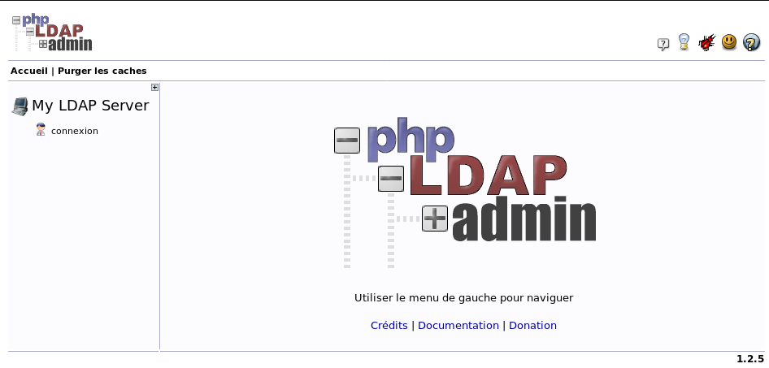

+++
title = 'OpenLDAP installation et configuration annuaire xoyize.xyz'
date = 2019-10-22 00:00:00 +0100
categories = ['debian']
+++
# OpenLDAP Debian


## Liens

* [Getting started with OpenLDAP on Debian ](https://www.vennedey.net/resources/0-Getting-started-with-OpenLDAP-on-Debian-8)  
* [LDAP managed mail server with Postfix and Dovecot for multiple domains](https://www.vennedey.net/resources/2-LDAP-managed-mail-server-with-Postfix-and-Dovecot-for-multiple-domains)  
* [Installation d'un serveur mail avec backend OpenLDAP](https://wiki.gandi.net/fr/hosting/using-linux/tutorials/debian/mail-server-ldap)
* [How To Install and Configure OpenLDAP Server on Debian 10 (Buster)](https://computingforgeeks.com/how-to-install-and-configure-openldap-server-on-debian/) 
* [Mise en place de OpenLDAP](http://idum.fr/spip.php?article326) (*Le but de cet article est de vous faire découvrir OpenLDAP. En commençant par vous expliquer comment il fonctionne. Puis comment l’installer. Et enfin comment l’administrer.  
Pour nous aider dans cette dernière partie, j’utiliserai l’interface web phpldapadmin.*)  
[Mise en place de OpenLDAP](/files/Mise en place de OpenLDAP.pdf) (Document au format PDF)

* [OpenLDAP : La série de Tutos](https://blog.debugo.fr/openldap-serie/)
* [Serveur Messagerie complet : La série de Tutos](https://blog.debugo.fr/serveur-messagerie-complet-postfix-dovecot-ldap-rspamd/)

## OpenLDAP Serveur

*Les tests sont effectués sur le serveur xoyize.xyz*

* [OVH VPS SSD 1 KVM OpenStack (1 vCore/2GoRam/20GoSSD) domaine xoyize.xyz + compilation OpenResty](404.html)

Avant de commencer l'installation, configurez le nom d'hôte FQDN de votre serveur et ajoutez un enregistrement au fichier **/etc/hosts**  
Relever l'adresse ip de votre serveur `ip a` (ici notre adresse ip 192.168.0.45)

```
echo "192.168.0.45 ldap.xoyize.xyz" | sudo tee -a /etc/hosts
sudo hostnamectl set-hostname ldap.xoyize.xyz --static
```


### Installation et configuration

>en mode su ou sudo

L'installation d'OpenLDAP sur Debian est faite à l'aide de la gestion des paquets APT.  
Le premier élément précise que l'installation du paquet **slapd** se fait en mode non interactif et `-yq` ajoute l'installation en mode silencieux.

    DEBIAN_FRONTEND=noninteractive apt-get -yq install slapd ldap-utils net-tools

Pendant l'installation, vous devrez choisir un mot de passe de l'administrateur pour le compte racine LDAP. rhTJH8f97dkS65

#### Configuration initiale

Créer un squelette de configuration pour **slapd**

    dpkg-reconfigure slapd

Voulez-vous omettre la configuration d'OpenLDAP ? Non  
Nom de domaine : xoyize.xyz  
Nom d'entité (« organization ») : srvxo  
Mot de passe de l'administrateur : f43z7C9TBwxX3h  
Module de base de données à utiliser : MDB  
Faut-il supprimer la base de données lors de la purge du paquet ? Non  
Faut-il déplacer l'ancienne base de données ? Oui  

#### Tests fonctionnels

Activer au démarrage et lancer **slapd** .  

    systemctl enable slapd
    systemctl start slapd


Sur quel port du réseau écoute slapd  

    netstat -laputn | grep slapd

```
tcp        0      0 0.0.0.0:389             0.0.0.0:*               LISTEN      10204/slapd         
tcp6       0      0 :::389                  :::*                    LISTEN      10204/slapd     
```

Comme on peut le voir, **slapd** attend les requêtes ldap sur le port TCP 389.  
Avec quels arguments s'exécute le service.   

    cat /var/run/slapd/slapd.args

```
/usr/sbin/slapd -h ldap:/// ldapi:/// -g openldap -u openldap -F /etc/ldap/slapd.d 
```

**-h** &rarr; les modalités d'accès à slapd : ldap et ldapi (ldap via TCP 389 et ldapi via socket unix)  
**-g** et **-u** &rarr; identité groupe et utilisateur sur lequel "tourne" le processus slapd  
**-F** &rarr; emplacement du ficher de configuration de slapd

Afficher les données de l'annuaire

    ldapsearch -x -H ldap://cinay.ldap.xoyize.xyz -b 'dc=xoyize,dc=xyz'

```
# extended LDIF
#
# LDAPv3
# base <dc=xoyize,dc=xyz> with scope subtree
# filter: (objectclass=*)
# requesting: ALL
#

# xoyize.xyz
dn: dc=xoyize,dc=xyz
objectClass: top
objectClass: dcObject
objectClass: organization
o: srvxo
dc: xoyize

# admin, xoyize.xyz
dn: cn=admin,dc=xoyize,dc=xyz
objectClass: simpleSecurityObject
objectClass: organizationalRole
cn: admin
description: LDAP administrator

# search result
search: 2
result: 0 Success

# numResponses: 3
# numEntries: 2
```

**-x** &rarr; nous utilisons un compte défini à l'intérieur de la base pour accéder à l'annuaire  
**-H** &rarr; accès en ldap sur la machine cinay.ldap.xoyize.xyz  
**-b** &rarr; la racine à parcourir , ici 'dc=ldap,dc=xoyize,dc=xyz'

ou

    ldapsearch -Y external  -H ldapi:/// -b dc=xoyize,dc=xyz -LLL

```
SASL/EXTERNAL authentication started
SASL username: gidNumber=0+uidNumber=0,cn=peercred,cn=external,cn=auth
SASL SSF: 0
dn: dc=xoyize,dc=xyz
objectClass: top
objectClass: dcObject
objectClass: organization
o: srvxo
dc: xoyize

dn: cn=admin,dc=xoyize,dc=xyz
objectClass: simpleSecurityObject
objectClass: organizationalRole
cn: admin
description: LDAP administrator
```

Pour avoir d’autres informations sur le serveur, vous pouvez utiliser les commandes suivantes :

    slapd -V
    ldapsearch -Y external  -H ldapi:/// -b cn=config "(objectClass=olcGlobal)" -LLL

```
SASL/EXTERNAL authentication started
SASL username: gidNumber=0+uidNumber=0,cn=peercred,cn=external,cn=auth
SASL SSF: 0
dn: cn=config
objectClass: olcGlobal
cn: config
olcArgsFile: /var/run/slapd/slapd.args
olcLogLevel: none
olcPidFile: /var/run/slapd/slapd.pid
olcToolThreads: 1
```

> -LLL : Permet de ne pas afficher certains informations superflues dans la sortie

La configuration n’est plus dans un fichier unique, mais sous forme de DIT (cn=config). On peut en avoir un aperçu avec la commande

     tree /etc/ldap/slapd.d/

```
/etc/ldap/slapd.d/
├── cn=config
│   ├── cn=module{0}.ldif
│   ├── cn=schema
│   │   ├── cn={0}core.ldif
│   │   ├── cn={1}cosine.ldif
│   │   ├── cn={2}nis.ldif
│   │   └── cn={3}inetorgperson.ldif
│   ├── cn=schema.ldif
│   ├── olcBackend={0}mdb.ldif
│   ├── olcDatabase={0}config.ldif
│   ├── olcDatabase={-1}frontend.ldif
│   └── olcDatabase={1}mdb.ldif
└── cn=config.ldif
```

### Explications

#### Les Schémas

Si vous regardez le résultat de la commande :

    tree /etc/ldap/slapd.d/

Vous voyez plusieurs entrées sous la branche cn=schema. En l’occurrence, core, cosine, nis et inetorgperson.

Ce sont en quelque sorte les modèles qu’utiliseront vos futurs enregistrement (quel attribut, de quel type, etc..). Ceux déjà intégrés sont les plus couramment utilisés, mais il en existe d’autres, soit déjà disponibles dans /etc/ldap/schema :

    ls /etc/ldap/schema/*.ldif

Soit disponibles sur Internet.

Il est aussi tout à fait possible de créer vos propres schémas, afin que votre annuaire réponde précisément à vos besoins.

#### Les commandes

Pour modifier la configuration du serveur nous utiliserons principalement les commandes ldapadd, ldapmodify, ldapdelete (installées avec le paquet ldap-utils) Ces dernières prennent en option un fichier (option -f) de format ldif (Ldap Data Interchange Format).

Nous allons rapidement voir de quoi il s’agit.

Pour effectuer des requêtes, nous utiliserons la commande ldapsearch.

Celle ci peut interroger le serveur LDAP de plusieurs façons.

Sur le socket interne :

    ldapsearch -Q -Y external -H ldapi:/// -b cn=config

L’option -Q cache les infos SASL, inutile à l’affichage.

Ou sur un socket réseau :

    ldapsearch -x -H ldap://localhost -D cn=admin,dc=xoyize,dc=xyz -W -b cn=config

Sur le socket réseau, nous indiquons les options :

-x : authentification simple.

-H indique l’hôte (en l’occurrence, localhost).

-D est le compte qui va se connecter.

-W sert à demander le mot de passe.

-b ou basedn est l’endroit ou nous voulons faire notre recherche.

La commande fonctionne mais ne retourne rien. Le compte admin n’a pas accès à la configuration en passant par le socket réseau (nous allons y remédier après).

Au passage, pourquoi donc s’embêter alors qu’on ne pourrait qu’utiliser le socket interne ?

L’intérêt du socket réseau est qu’on peut lancer les commandes à distance (dans ce cas remplacer localhost par le nom de la machine distante).
C – BaseDn, Filtres, Attributs

Je reviens sur la commande :

    ldapsearch -Q -LLL -Y external -H ldapi:/// -b cn=config

Celle ci affiche donc l’intégralité de l’arbre cn=config (le baseDN de notre requête).

Au passage, on peut l’écrire sous la forme :

    ldapsearch -QLLLY EXTERNAL -H ldapi:/// -b "cn=config"

Si l’on veut n’afficher que les attributs dn des résultats, on fera alors :

    ldapsearch -QLLLY EXTERNAL -H ldapi:/// -b "cn=config" dn

Si par exemple, je veux afficher d’autres attributs :

    ldapsearch -QLLLY EXTERNAL -H ldapi:/// -b "cn=config" "(objectClass=olcModuleList)" dn olcModuleLoad

Dans la commande précédente, j’utilise un filtre. Pour les utiliser, il suffit de les indiquer après l’option -b et avant ce que l’on demande par ex :

    ldapsearch -QLLLY EXTERNAL -H ldapi:/// -b "cn=config" "(&(objectClass=olcDatabaseConfig))" dn

Cette commande n’affichera que les attributs dn des objectClass olcDatabaseConfig. Le & est facultatif. J’aurais très bien pu mettre :

    ldapsearch -QLLLY EXTERNAL -H ldapi:/// -b "cn=config" "(objectClass=olcDatabaseConfig)" dn

Si l’on ne veut pas que les attributs dn, mais toutes les infos :

    ldapsearch -QLLLY EXTERNAL -H ldapi:/// -b "cn=config" "(&(objectClass=olcDatabaseConfig))"

Et si je voulais les attributs dn des objectClass étant des olcDatabaseConfig ou ceux étant des olcModuleList, je vais utiliser le | pour indiquer un OU (le ET étant spécifié par &)

    ldapsearch -QLLLY EXTERNAL -H ldapi:/// -b "cn=config" "(|(objectClass=olcDatabaseConfig)(objectClass=olcModuleList))" dn

Petite explication sur l’utilisation des filtres. Ceux ci utilisent un principe qui rappelle la notation polonaise inversée, l’opérateur étant ici devant.

Exemple :

Si je veux A et B :

( & (A) (B) )

Si je veux A ou B

( | (A) (B) )

Si je veux A et B ou A et C :

 (  |  ( & (A) (B) )  ( & (A) (C) )  )

ou, en simplifiant :

 ( & (A) ( | (B) (C) ))

On peut aussi inverser avec le !.

Si l’on veut par ex ce qui est A et ce qui n’est pas B :

( & (A) (!  B) )

 

Au niveau des filtres, nous pouvons utiliser les opérateurs suivants :

*    < : plus petit que
*    <= : plus petit ou égal
*    = : égal
*    > : plus grand
*    >= : plus grand ou égal
*    =* : présence de (retourne les entrées ou l’attribut est présent)
*    ~= : approximation ( par ex, ~=Nocolas pourra retourner Nicolas)

On peut utiliser un joker, par ex, = *toto* sortira tout ce qui contient toto comme sous chaîne.

Il existe également la notion de filtres étendus, utilisé ainsi : attribut:dn:=valeur.

Par ex :

    ldapsearch -xLLL -H ldap://localhost -D cn=admin,dc=xoyize,dc=xyz -w password -b "dc=xoyize,dc=xyz" ou=people dn

me donne :

dn: ou=people,dc=xoyize,dc=xyz

Et :

    ldapsearch -xLLL -H ldap://localhost -D cn=admin,dc=xoyize,dc=xyz -w password -b "dc=xoyize,dc=xyz" ou:dn:=people dn

me donne :

```
dn: ou=people,dc=xoyize,dc=xyz
dn: ou=client,ou=people,dc=xoyize,dc=xyz
dn: ou=xoyize,ou=people,dc=xoyize,dc=xyz
dn: uid=niko,ou=xoyize,ou=people,dc=xoyize,dc=xyz
dn: uid=ldap1,ou=xoyize,ou=people,dc=xoyize,dc=xyz
dn: uid=ldap2,ou=xoyize,ou=people,dc=xoyize,dc=xyz
```

Ils permettent donc de considérer les éléments du DN comme faisant partie de l’entrée elle même.

On peut également utiliser les filtres étendus pour modifier les opérateurs.

    ldapsearch -xLLL -H ldap://localhost -D cn=admin,dc=xoyize,dc=xyz -w password -b "dc=xoyize,dc=xyz" title:2.5.13.5:=Admin dn

ne me sortira que les entrées ou l’attribut title est égal à Admin (et non pas admin, ADMIN, etc…). Par défaut, l’opération n’est pas sensible à la casse.

Pour connaitre l’ensemble des matchingRules disponibles :

    ldapsearch -xLLL -D cn=admin,dc=xoyize,dc=xyz -w password -b "cn=subschema" -s base matchingRuleUse | grep "matchingRule" | cut -d ' ' -f3,5

### Configuration

Nous allons créer un répertoire /root/ldap qui va centraliser tous nos fichiers de configuration :

    sudo -s
    mkdir -p /root/ldap
    cd /root/ldap

#### Compte admin

1 – Mdp Admin dans un fichier

Afin d’éviter d’avoir à toujours retaper le mot de passe admin (mot de passe que nous avons créé lors de la configuration du paquet) lors des commandes, nous allons l’enregistrer dans un fichier.

On va créer un fichier /root/pwdldap et mettre le mot de passe dedans :

    echo -n "mdpadmin" > /root/pwdldap
    chmod 600 /root/pwdldap

On test :

    ldapsearch -x -H ldap://localhost -D cn=admin,dc=xoyize,dc=xyz -y /root/pwdldap -b dc=xoyize,dc=xyz

2 – Droits d’accès à la configuration du serveur

Par défaut, l’accès à la configuration n’est pas possible en passant par le socket réseau avec le compte admin :

    ldapsearch -xLLL -H ldap://localhost -D cn=admin,dc=xoyize,dc=xyz -y /root/pwdldap -b cn=config

nous donne :

No such object (32)

Créez le fichier LDIF /root/ldap/acces-conf-admin.ldif, et insérez :

```
cat > /root/ldap/acces-conf-admin.ldif << EOF
dn: olcDatabase={0}config,cn=config
changeType: modify
add: olcAccess
olcAccess: to * by dn.exact=cn=admin,dc=xoyize,dc=xyz manage by * break
EOF
```

Injectez :

    ldapmodify -Y external -H ldapi:/// -f acces-conf-admin.ldif

Et restestez :

    ldapsearch -x -H ldap://localhost -D cn=admin,dc=xoyize,dc=xyz -y /root/pwdldap -b dc=xoyize,dc=xyz


### Les Overlays

*    accesslog : Enregistrement des accès. Attention, réduit drastiquement les performances.
*    **auditlog** : Enregistrement des modifications.
*    chain : Liaison de plusieurs serveurs LDAP au niveau des recherches.
*    collect : Implémentation de la RFC 3671. Les attributs collectifs partagent des valeurs communes entre l’ensemble des membres héritant d’une entrée commune.
*    constraint : Permet de forcer des contraintes sur des attributs.
*    **memberof** : Permet de connaître les groupes auxquels appartient un utilisateur
*    **ppolicy** : Password Policy. Permet la mise en place de contrôles sur les mots de passe (longueur, durée de validité, etc…).
*    **refint** :Referential Integrity. Permet de s’assurer de la cohérence de l’annuaire lors de suppression d’entrées.
*    syncprov :Syncrepl Provider. Permet la réplication syncrepl, incluant la fonctionnalité de recherche persistante. On l’installera plus tard.
*    translucent : Translucent Proxy. Cet overlay peut être utilisé avec un backend local pour créer un proxy transparent. Le contenu des entrées récupérées à partir d’un serveur LDAP distant peut être en partie réécrit/modifé/completé par la base locale.
*    **unique** : permet de s’assurer de l’unicité d’attributs.
*    valsort : Permet de forcer l’ordre pour les valeurs d’attributs lorsqu’ils sont retournées suite à une recherche.

>En gras, ceux dont nous nous servirons.

#### MemberOf

L’overlay memberof permet de savoir dans quels groupes se trouve un utilisateur en une seule requête au lieu de deux.  
Créez un fichier memberof_act.ldif et insérez le contenu suivant :

```
cat > /root/ldap/memberof_act.ldif << EOF
dn: cn=module,cn=config
cn:module
objectclass: olcModuleList
objectclass: top
olcmoduleload: memberof.la
olcmodulepath: /usr/lib/ldap
EOF
```

Créez un fichier memberof_conf.ldif et insérez le contenu suivant :

```
cat > /root/ldap/memberof_conf.ldif << EOF
dn: olcOverlay=memberof,olcDatabase={1}mdb,cn=config
changetype: add
objectClass: olcMemberOf
objectClass: olcOverlayConfig
objectClass: olcConfig
objectClass: top
olcOverlay: memberof
olcMemberOfDangling: ignore
olcMemberOfRefInt: TRUE
olcMemberOfGroupOC: groupOfNames
olcMemberOfMemberAD: member
olcMemberOfMemberOfAD: memberOf
EOF
```

On injecte :

    ldapadd -Y EXTERNAL -H ldapi:/// -f memberof_act.ldif
    ldapadd -Y EXTERNAL -H ldapi:/// -f memberof_conf.ldif

Pour vérifier :

    ldapsearch -QLLLY EXTERNAL -H ldapi:/// -b "cn=config" "Objectclass=olcModuleList"

```
dn: cn=module{0},cn=config
objectClass: olcModuleList
cn: module{0}
olcModulePath: /usr/lib/ldap
olcModuleLoad: {0}back_mdb

dn: cn=module{1},cn=config
objectClass: olcModuleList
objectClass: top
cn: module{1}
olcModulePath: /usr/lib/ldap
olcModuleLoad: {0}memberof.la
```

Ou bien encore :

    tree /etc/ldap/slapd.d/

On doit trouver trace dans la liste des modules.  
On peut vérifier la configuration avec :

    ldapsearch -QLLLY EXTERNAL -H ldapi:/// -b "cn=config" "Objectclass=olcmemberOf"

```
dn: olcOverlay={0}memberof,olcDatabase={1}mdb,cn=config
objectClass: olcMemberOf
objectClass: olcOverlayConfig
objectClass: olcConfig
objectClass: top
olcOverlay: {0}memberof
olcMemberOfDangling: ignore
olcMemberOfRefInt: TRUE
olcMemberOfGroupOC: groupOfNames
olcMemberOfMemberAD: member
olcMemberOfMemberOfAD: memberOf
```

#### Intégrité Référentielle

Cet overlay permet de supprimer un utilisateur d’un groupe quand on supprime l’utilisateur. Au passage, si un groupe se retrouve vide, l’admin sera automatiquement ajouté (un groupe vide créé une erreur dans OpenLdap)

Créez un fichier refint_act.ldif et insérez le contenu suivant :

```
cat > /root/ldap/refint_act.ldif << EOF
dn: cn=module,cn=config
cn: module
objectclass: olcModuleList
objectclass: top
olcmoduleload: refint.la
olcmodulepath: /usr/lib/ldap
EOF
```

Créez un fichier refint_conf.ldif et insérez le contenu suivant :

```
cat > /root/ldap/refint_conf.ldif << EOF
dn: olcOverlay=refint,olcDatabase={1}mdb,cn=config
objectClass: olcConfig
objectClass: olcOverlayConfig
objectClass: olcRefintConfig
objectClass: top
olcOverlay: refint
olcRefintAttribute: memberof member manager owner
olcRefintNothing: cn=admin,dc=xoyize,dc=xyz
EOF
```

On injecte :

    ldapadd -Q -Y EXTERNAL -H ldapi:/// -f refint_act.ldif
    ldapadd -Q -Y EXTERNAL -H ldapi:/// -f refint_conf.ldif

On vérifie :

    ldapsearch -QLLLY EXTERNAL -H ldapi:/// -b "cn=config" "Objectclass=olcModuleList"

On peut vérifier la configuration avec :

    ldapsearch -QLLLY EXTERNAL -H ldapi:/// -b "cn=config" "Objectclass=olcRefintConfig"

```
dn: olcOverlay={1}refint,olcDatabase={1}mdb,cn=config
objectClass: olcConfig
objectClass: olcOverlayConfig
objectClass: olcRefintConfig
objectClass: top
olcOverlay: {1}refint
olcRefintAttribute: memberof member manager owner
olcRefintNothing: cn=admin,dc=xoyize,dc=xyz
```

#### Overlay Audit Log

Cet overlay sert à auditer chaque modification au sein de l’annuaire. Dans notre cas, cela sera inscrit dans le fichier : /var/log/openldap/audit.ldif

Créez le fichier auditlog_act.ldif pour y insérer :

```
cat > /root/ldap/auditlog_act.ldif << EOF
dn: cn=module,cn=config
cn: module
objectclass: olcModuleList
objectclass: top
olcModuleLoad: auditlog.la
olcmodulepath: /usr/lib/ldap
EOF
```

Créez le fichier auditlog_conf.ldif pour y insérer :

```
cat > /root/ldap/auditlog_conf.ldif << EOF
dn: olcOverlay=auditlog,olcDatabase={1}mdb,cn=config
objectClass: olcOverlayConfig
objectClass: olcAuditLogConfig
olcOverlay: auditlog
olcAuditlogFile: /var/log/openldap/auditlog.ldif
EOF
```

Injectez :

    ldapadd -Q -Y EXTERNAL -H ldapi:/// -f auditlog_act.ldif
    ldapadd -Q -Y EXTERNAL -H ldapi:/// -f auditlog_conf.ldif

On vérifie :

    ldapsearch -QLLLY EXTERNAL -H ldapi:/// -b "cn=config" "Objectclass=olcModuleList"

On peut vérifier la configuration avec :

    ldapsearch -QLLLY EXTERNAL -H ldapi:/// -b "cn=config" "Objectclass=olcAuditLogConfig"

```
dn: olcOverlay={2}auditlog,olcDatabase={1}mdb,cn=config
objectClass: olcOverlayConfig
objectClass: olcAuditlogConfig
olcOverlay: {2}auditlog
olcAuditlogFile: /var/log/openldap/auditlog.ldif
```

Ensuite, nous allons créer le fichier :

    mkdir -p /var/log/openldap
    chmod 755 /var/log/openldap
    chown openldap:openldap /var/log/openldap
    touch /var/log/openldap/auditlog.ldif
    chmod 755 /var/log/openldap/auditlog.ldif
    chown openldap:openldap /var/log/openldap/auditlog.ldif


#### Overlay Unique

Cet overlay permet de nous assurer l’unicité des attributs que l’on spécifie.

Créez un fichier unique_act.ldif pour y insérer :

```
cat > /root/ldap/unique_act.ldif << EOF
dn: cn=module,cn=config
cn: module
objectclass: olcModuleList
objectclass: top
olcModuleLoad: unique.la
olcmodulepath: /usr/lib/ldap
EOF
```

Créez un fichier unique_conf.ldif pour y insérer :

```
cat > /root/ldap/unique_conf.ldif << EOF
dn: olcOverlay=unique,olcDatabase={1}mdb,cn=config
objectClass: olcOverlayConfig
objectClass: olcUniqueConfig
olcOverlay: unique
olcUniqueUri: ldap:///ou=people,dc=xoyize,dc=xyz?uid?sub
olcUniqueUri: ldap:///ou=people,dc=xoyize,dc=xyz?mail?sub
olcUniqueUri: ldap:///ou=people,dc=xoyize,dc=xyz?uidNumber?sub
olcUniqueUri: ldap:///ou=groups,dc=xoyize,dc=xyz?cn?sub
EOF
```

Nous demandons ici à ce que les attributs ui, mail et uidNumber dans l’ou people soient uniques. Et que l’attribut cn dans l’ou groups soit lui aussi unique.

Injectez :

    ldapadd -Q -Y EXTERNAL -H ldapi:/// -f unique_act.ldif
    ldapadd -Q -Y EXTERNAL -H ldapi:/// -f unique_conf.ldif

On vérifie :

    ldapsearch -QLLLY EXTERNAL -H ldapi:/// -b "cn=config" "Objectclass=olcModuleList"

On peut vérifier la configuration avec :

    ldapsearch -QLLLY EXTERNAL -H ldapi:/// -b "cn=config" "Objectclass=olcUniqueConfig"

```
dn: olcOverlay={3}unique,olcDatabase={1}mdb,cn=config
objectClass: olcOverlayConfig
objectClass: olcUniqueConfig
olcOverlay: {3}unique
olcUniqueURI: ldap:///ou=people,dc=xoyize,dc=xyz?uid?sub
olcUniqueURI: ldap:///ou=people,dc=xoyize,dc=xyz?mail?sub
olcUniqueURI: ldap:///ou=people,dc=xoyize,dc=xyz?uidNumber?sub
olcUniqueURI: ldap:///ou=groups,dc=xoyize,dc=xyz?cn?sub
```

#### Overlay Ppolicy

Cet overlay va nous permettre de spécifier une politique de mot de passe.

Un peu particulier, il faut ajouter son schéma dans l’annuaire :

    ldapadd -Q -Y EXTERNAL -H ldapi:/// -f /etc/ldap/schema/ppolicy.ldif

On peut voir que c’est bon avec :

    ldapsearch -QLLLY EXTERNAL -H ldapi:/// -b "cn=schema,cn=config" cn

```
dn: cn=schema,cn=config
cn: schema

dn: cn={0}core,cn=schema,cn=config
cn: {0}core

dn: cn={1}cosine,cn=schema,cn=config
cn: {1}cosine

dn: cn={2}nis,cn=schema,cn=config
cn: {2}nis

dn: cn={3}inetorgperson,cn=schema,cn=config
cn: {3}inetorgperson

dn: cn={4}ppolicy,cn=schema,cn=config
cn: {4}ppolicy
```

Ou bien encore :

    tree /etc/ldap/slapd.d/

Dans la branche cn=schema, on doit voir le schéma ppolicy qui s’est ajouté à ceux présent par défaut (core, cosine, nis et inetorgperson).

Créez un fichier ppolicy_act.ldif pour y insérer :

```
cat > /root/ldap/ppolicy_act.ldif << EOF
dn: cn=module,cn=config
cn: module
objectclass: olcModuleList
objectclass: top
olcModuleLoad: ppolicy.la
olcmodulepath: /usr/lib/ldap
EOF
```

Créez un fichier ppolicy_conf.ldif pour y insérer :

```
cat > /root/ldap/ppolicy_conf.ldif << EOF
dn: olcOverlay=ppolicy,olcDatabase={1}mdb,cn=config
objectClass: olcOverlayConfig
objectClass: olcPpolicyConfig
olcOverlay: ppolicy
olcPPolicyDefault: cn=ppolicy,dc=xoyize,dc=xyz
olcPPolicyHashCleartext: TRUE
olcPPolicyUseLockout: FALSE
EOF
```

olcPPolicyDefault : Indique le DN de configuration utilisé par défaut (nous le définirons apres).

olcPPolicyHashCleartext : Indique si les mots de passe doivent être cryptés.

olcPPolicyUseLockout : Si TRUE, le message d’erreur retourné en cas de connexion à un compte vérouillé indiquera qu’il s’agit d’un compte vérouillé. Si FALSE, ce sera un message d’échec stantard.

On injecte

    ldapadd -Q -Y EXTERNAL -H ldapi:/// -f ppolicy_act.ldif
    ldapadd -Q -Y EXTERNAL -H ldapi:/// -f ppolicy_conf.ldif

On vérifie :

    ldapsearch -QLLLY EXTERNAL -H ldapi:/// -b "cn=config" "Objectclass=olcPpolicyConfig" -LLL

```
dn: olcOverlay={4}ppolicy,olcDatabase={1}mdb,cn=config
objectClass: olcOverlayConfig
objectClass: olcPPolicyConfig
olcOverlay: {4}ppolicy
olcPPolicyDefault: cn=ppolicy,dc=xoyize,dc=xyz
olcPPolicyHashCleartext: TRUE
olcPPolicyUseLockout: FALSE
```

On va maintenant créer la politique par défaut.

Créez un fichier ppolicy_def.ldif pour y insérer :

```
cat > /root/ldap/ppolicy_def.ldif << EOF
dn: cn=ppolicy,dc=xoyize,dc=xyz
objectClass: top
objectClass: device
objectClass: pwdPolicy
cn: ppolicy
pwdAllowUserChange: TRUE
pwdAttribute: userPassword
pwdCheckQuality: 1
pwdExpireWarning: 0
pwdFailureCountInterval: 30
pwdGraceAuthNLimit: 5
pwdInHistory: 5
pwdLockout: TRUE
pwdLockoutDuration: 60
pwdMaxAge: 0
pwdMaxFailure: 5
pwdMinAge: 0
pwdMinLength: 5
pwdMustChange: FALSE
pwdSafeModify: FALSE
EOF
```

La signification des attributs est :

pwdAllowUserChange : indique si l’utilisateur peut changer son mot de passe.

pwdCheckQuality : indique si OpenLDAP renvoie une erreur si le mot de passe n’est pas conforme

pwdExpireWarning : avertissement d’expiration.

pwdFailureCountInterval : Intervalle de temps entre deux tentatives infructueuses pour qu’elles soient considérées comme « à la suite ».

pwdGraceAuthNLimit : période de grâce suite à l’expiration du mot de passe.

pwdInHistory : nombre de mots de passe dans l’historique.

pwdLockout : indique si on bloque le compte au bout de X échecs.

pwdLockoutDuration : durée du blocage du compte (en secondes).

pwdMaxAge : age maximal du mot de passe (en secondes).

pwdMaxFailure : nombre d’échecs de saisie du mot de passe maximal (avant blocage).

pwdMinAge : age minimal du mot de passe (en secondes).

pwdMinLength : longueur minimale du mot de passe.

pwdMustChange : indique si l’utilisateur doit changer son mot de passe.

pwdSafeModify : indique si il faut envoyer l’ancien mot de passe avec le nouveau pour modification.

On injecte :

    ldapadd -H ldap://localhost -D cn=admin,dc=xoyize,dc=xyz -y /root/pwdldap -f ppolicy_def.ldif

On vérifie :

    ldapsearch -QLLLY EXTERNAL -H ldapi:/// -b "dc=xoyize,dc=xyz" "Objectclass=pwdPolicy"

On peut avoir plusieurs politique (une adapté pour des comptes clients, par exemple).

Par ex, fichier ppolicy-client.ldif :

```
cat > /root/ldap/ppolicy-client.ldif << EOF
dn: cn=ppolicy-client,dc=xoyize,dc=xyz
objectClass: top
objectClass: device
objectClass: pwdPolicy
cn: ppolicy-client
pwdAllowUserChange: TRUE
pwdAttribute: userPassword
pwdCheckQuality: 1
pwdExpireWarning: 0
pwdFailureCountInterval: 30
pwdGraceAuthNLimit: 5
pwdInHistory: 10
pwdLockout: TRUE
pwdLockoutDuration: 60
pwdMaxAge: 0
pwdMaxFailure: 3
pwdMinAge: 0
pwdMinLength: 8
pwdMustChange: FALSE
pwdSafeModify: TRUE
EOF
```

Qu’on injecte :

    ldapadd -H ldap://localhost -D cn=admin,dc=xoyize,dc=xyz -y /root/pwdldap -f ppolicy-client.ldif

---

Et qu’on affectera avec un fichier changeppolicy.ldif :

```
cat > /root/ldap/ppolicy-client.ldif << EOF
dn: uid=toto,ou=client,ou=people,dc=xoyize,dc=xyz
changetype: modify
replace: pwdPolicySubEntry
pwdPolicySubEntry: cn=ppolicy-client,dc=xoyize,dc=xyz
EOF
```

Qu’on injectera avec :

    ldapadd -H ldap://localhost -D cn=admin,dc=xoyize,dc=xyz -y /root/pwdldap -f changeppolicy.ldif

On pourra aussi spécifier cet attribut à la création de l’utilisateur.

### Peuplement de l'annuaire

#### Les OUs

Nous avions créé un répertoire /root/ldap/conf pour y mettre la configuration. Créons un répertoire pour y mettre les fichiers ldif contenant les données.

    mkdir -p /root/ldap/data
    cd /root/ldap/data

Pour rappel, les OUs sont des conteneurs qui permettent de ranger les données dans l’annuaire, de les hiérarchiser. Il ne faut pas les confondre avec les Groupes.

Créez un fichier OU.ldif et remplissez le de la sorte :

```
cat > /root/ldap/data/OU.ldif << EOF
dn: ou=people,dc=xoyize,dc=xyz
ou: people
objectClass: organizationalUnit

dn: ou=group,dc=xoyize,dc=xyz
ou: group
objectClass: organizationalUnit

dn: ou=system,dc=xoyize,dc=xyz
ou: system
objectClass: organizationalUnit

dn: ou=xoyize,ou=people,dc=xoyize,dc=xyz
ou: xoyize 
objectClass: organizationalUnit

dn: ou=client,ou=people,dc=xoyize,dc=xyz
ou: client
objectClass: organizationalUnit

dn: ou=sysgroup,ou=group,dc=xoyize,dc=xyz
ou: sysgroup
objectClass: organizationalUnit

dn: ou=workgroup,ou=group,dc=xoyize,dc=xyz
ou: workgroup
objectClass: organizationalUnit
EOF
```

On injecte :

    ldapadd -cxWD cn=admin,dc=xoyize,dc=xyz -y /root/pwdldap -f OU.ldif

#### Les utilisateurs

On va créer notre premier utilisateur.(remplacer password par le vrai mot de passe)

Fichier User_yannick.ldif :

```
cat > /root/ldap/data/User_yannick.ldif << EOF
dn: uid=yannick,ou=xoyize,ou=people,dc=xoyize,dc=xyz
objectclass: person
objectclass: organizationalPerson
objectclass: inetOrgPerson
uid: yannick
sn: yannick
givenName: Yannick
cn: Yannick
displayName: Yannick
userPassword: kfhd59erty54
mail: yannick@xoyize.xyz
title: Admin
initials: Y
EOF
```

On injecte :

    ldapadd -cxWD cn=admin,dc=xoyize,dc=xyz -y /root/pwdldap -f User_yannick.ldif

Profitons pour faire une explication sur ces lignes :

```
objectclass: person
objectclass: organizationalPerson
objectclass: inetOrgPerson
```

Notre utilisateur héritera des attributs de ces trois classes. Mais qu’est ce donc ?

Voyons un peu les schémas :

    ldapsearch -xLLL -H ldap://localhost -D cn=admin,dc=xoyize,dc=xyz -y /root/pwdldap -b "cn=schema,cn=config"

Beaucoup d’infos, pour s’en sortir affichons les dn des schémas :

    ldapsearch -xLLL -H ldap://localhost -D cn=admin,dc=xoyize,dc=xyz -y /root/pwdldap -b "cn=schema,cn=config" dn

Ce qui nous affiche :

dn: cn=schema,cn=config
dn: cn={0}core,cn=schema,cn=config
dn: cn={1}cosine,cn=schema,cn=config
dn: cn={2}nis,cn=schema,cn=config
dn: cn={3}inetorgperson,cn=schema,cn=config
dn: cn={4}ppolicy,cn=schema,cn=config

Concentrons nous sur le schéma core :

    ldapsearch -xLLL -H ldap://localhost -D cn=admin,dc=xoyize,dc=xyz -y /root/pwdldap -b "cn=schema,cn=config" "cn={0}core"

La vous devez voir deux grands types de données : les **olcObjectClasses** et les **olcAttributeTypes**:

Les AttributeTypes sont les attributs que peuvent avoir les entrées de l’annuaire. Les ObjectClasses sont les regroupement de ces attributs.

Regardons les différents ObjectClasses qui composent notre schéma core :

    ldapsearch -xLLL -H ldap://localhost -D cn=admin,dc=xoyize,dc=xyz -y /root/pwdldap -b "cn=schema,cn=config" "cn={0}core" olcObjectClasses

En cherchant dedans, on va trouver nos objectclasses person et organizationalPerson :

```
olcObjectClasses: {4}( 2.5.6.6 NAME 'person' DESC 'RFC2256: a person' SUP top
STRUCTURAL MUST ( sn $ cn ) MAY ( userPassword $ telephoneNumber $ seeAlso $
description ) )
olcObjectClasses: {5}( 2.5.6.7 NAME 'organizationalPerson' DESC 'RFC2256: an o
rganizational person' SUP person STRUCTURAL MAY ( title $ x121Address $ regis
teredAddress $ destinationIndicator $ preferredDeliveryMethod $ telexNumber $
teletexTerminalIdentifier $ telephoneNumber $ internationaliSDNNumber $ fac
simileTelephoneNumber $ street $ postOfficeBox $ postalCode $ postalAddress $
physicalDeliveryOfficeName $ ou $ st $ l ) )
```

Ce qu’il faut comprendre :

L’ObjectClasses person hérite de top.

Must spécifie les AttributeTypes obligatoires : sn et cn.

May définie les AttributeTypes facultatives

Les AttributeTypes sont définis sur un modèle similaire, par exemple :

    ldapsearch -xLLL -H ldap://localhost -D cn=admin,dc=xoyize,dc=xyz -y /root/pwdldap -b "cn=schema,cn=config" "cn={0}core" olcAttributeTypes

J’en prend un au hasard :

```
olcAttributeTypes: {6}( 2.5.4.9 NAME ( 'street' 'streetAddress' ) DESC 'RFC225
6: street address of this object' EQUALITY caseIgnoreMatch SUBSTR caseIgnoreS
ubstringsMatch SYNTAX 1.3.6.1.4.1.1466.115.121.1.15{128} )
```

On trouve le nom de l’attribut, une description et son type (SYNTAX suivi d’un OID, je reviendrais sur ce point dans le chapitre consacré à la création d’un schéma).

L’objet que l’on créé hérite des attributs des classes person, organizationalPerson et inetOrgPerson.

Voila donc pour les explications sur les ObjectClasses et les AttributeTypes:

Au passage, on va vérifier quelques points.

Regardons comment est stocké le mdp dans la base :

    ldapsearch -xLLL -H ldap://localhost -D cn=admin,dc=xoyize,dc=xyz -y /root/pwdldap -b "dc=xoyize,dc=xyz" "uid=yannick"

On voit une ligne :

userPassword:: e1NTSEF9TklxSkd5YVFBdVcwMkpOVmplcjArOGYwRmNNMjNBVXg=

Il s’agit d’un codage en base64. Pour le décoder :

    echo e1NTSEF9TklxSkd5YVFBdVcwMkpOVmplcjArOGYwRmNNMjNBVXg= | base64 -d

Et la on le résultat suivant :

{SSHA}NIqJGyaQAuW02JNVjer0+8f0FcM23AUx

Le mot de passe est bien crypté comme configuré avec l’overlay ppolicy.

Et pour tester la connexion avec ce compte :

    ldapsearch -xLLLH ldap://localhost -D uid=yannick,ou=xoyize,ou=people,dc=xoyize,dc=xyz -W -b "dc=xoyize,dc=xyz" "uid=yannick"

Et si vous tapez le bon mot de passe, cela vous affiche votre propre fiche.

#### Les groupes

A noter, il existe deux types de groupes : les posixgroup et les groupofnames.
Les posixgroup sont similaires au groupes Unix, et les groupofnames ressemblent plus à des groupes AD.
Pour faire simple, l’avantage des groupofnames est qu’avec un filtre sur un utilisateur, on peut connaitre ses groupes (avec l’overlay memberof). Chose impossible avec les posixgroups.
Par contre, il est impératif d’avoir au moins un utilisateur dans un groupe de type groupofnames. Vous pouvez être tenté de vous mettre par défaut, mais le jour ou vous aller modifier votre schéma, vous allez devoir supprimer les utilisateurs, et un groupe sans utilisateur garde l’uid du dernier membre à l’avoir quitté et si vous refaite un compte avec le même uid, impossible de vous remettre dedans sans supprimer le groupe. Bref, perso, je met l’admin par défaut, comme ça pas de risques. De plus notre overlay refint configuré au préalable est raccord avec cela.

On créé un fichier Group.ldif :

```
cat > /root/ldap/data/Group.ldif << EOF
dn: cn=cloud,ou=sysgroup,ou=group,dc=xoyize,dc=xyz
cn: cloud
description: Cloud
objectClass: groupOfNames
member: cn=admin,dc=xoyize,dc=xyz

dn: cn=xoyize ,ou=workgroup,ou=group,dc=xoyize,dc=xyz
cn: xoyize 
description: xoyize 
objectClass: groupOfNames
member: cn=admin,dc=xoyize,dc=xyz
EOF
```
J’ai mis dedans les groupes dont j’ai besoin, à vous de faire en fonction, etc…

    ldapadd -cxWD cn=admin,dc=xoyize,dc=xyz -y /root/pwdldap -f Group.ldif

Au passage, on peut tester notre overlay memberof :

    ldapsearch -xLLLH ldap://localhost -D cn=admin,dc=xoyize,dc=xyz -y /root/pwdldap -b "dc=xoyize,dc=xyz" "cn=admin" memberof

Doit nous retourner quelque chose qui ressemble à :

```
dc=xoyize,dc=xyz" "cn=admin" memberof
dn: cn=admin,dc=xoyize,dc=xyz
memberOf: cn=cloud,ou=sysgroup,ou=group,dc=xoyize,dc=xyz
memberOf: cn=xoyize,ou=workgroup,ou=group,dc=xoyize,dc=xyz
```

A la question, si je veux rajouter un utilisateur dans un groupe, comment faire ?

Je vous répond qu’avec OpenLdap, tout passe par des fichiers ldif, du coup, créez un fichier addusertogroup.ldif pour y mettre :

```
dn: cn=cloud,ou=sysgroup,ou=group,dc=xoyize,dc=xyz
changetype: modify
add: member
member: uid=yannick,ou=xoyize,ou=people,dc=xoyize,dc=xyz
```

Puis on injecte :

    ldapmodify -cxWD cn=admin,dc=xoyize,dc=xyz -y /root/pwdldap -f addusertogroup.ldif

Et la, si on requête cela :

    ldapsearch -xLLLH ldap://localhost -D cn=admin,dc=xoyize,dc=xyz -y /root/pwdldap -b "dc=xoyize,dc=xyz" "uid=yannick" memberof

On doit avoir ceci :

```
dn: uid=yannick,ou=xoyize,ou=people,dc=xoyize,dc=xyz
memberOf: cn=cloud,ou=sysgroup,ou=group,dc=xoyize,dc=xyz
```

Nous verrons plus en détail les ajouts, modifications, suppressions dans la partie suivante.

#### Comptes Système et ACL

Par défaut, l’accès à l’annuaire est assez ouvert :

    ldapsearch -xLLL

On voit ce que l’accès anonyme nous affiche…

On va devoir filtrer un peu.

Tout d’abord, nous allons créer deux compte systèmes. Un viewer (qui aura des droits de lecture uniquement, utilisé par les applications pour se connecter à l’annuaire et vérifier des droits, au lieu de passe par le bind anonyme) et un Writer (qui lui aura des droits d’écriture…)

Créez le fichier viewer.ldif :

```
cat > /root/ldap/data/viewer.ldif << EOF
dn: cn=viewer,ou=system,dc=xoyize,dc=xyz
objectClass: simpleSecurityObject
objectClass: organizationalRole
cn: viewer
description: LDAP viewer
userPassword: passview
EOF
```

Créez le fichier writer.ldif :

```
cat > /root/ldap/data/writer.ldif << EOF
dn: cn=writer,ou=system,dc=xoyize,dc=xyz
objectClass: simpleSecurityObject
objectClass: organizationalRole
cn: writer
description: LDAP Writer
userPassword: passwrite
EOF
```

Injectez :

    ldapadd -cxWD cn=admin,dc=xoyize,dc=xyz -y /root/pwdldap -f viewer.ldif
    ldapadd -cxWD cn=admin,dc=xoyize,dc=xyz -y /root/pwdldap -f writer.ldif

Voyons les ACLs par défaut :

    ldapsearch -x -H ldap://localhost -D cn=admin,dc=xoyize,dc=xyz -y /root/pwdldap -b "cn=config" "olcDatabase={1}mdb" olcaccess

Modifions les pour empêcher les connexions anonymes.

Créez un fichier acl.ldif :

```
cat > /root/ldap/data/acl.ldif << EOF
dn: olcDatabase={1}mdb,cn=config
changetype: modify
replace: olcAccess
olcAccess: to attrs=userPassword by self write by anonymous auth by dn="cn=writer,ou=system,dc=xoyize,dc=xyz" write by dn="cn=viewer,ou=system,dc=xoyize,dc=xyz" read by dn="cn=admin,dc=xoyize,dc=xyz" write by * none
olcAccess: to dn.base="dc=xoyize,dc=xyz" by users read
olcAccess: to * by self write by dn="cn=admin,dc=xoyize,dc=xyz" write by * read by anonymous none
EOF
```

J’expliquerais plus précisément le fonctionnement des ACLs dans un autre article. Nous modifions la deuxieme ACL qui par défaut donne accès en lecture à tout le monde. La, nous réduisons la lecture aux utilisateurs authentifiés.

On injecte :

    ldapmodify -Q -Y EXTERNAL -H ldapi:/// -f acl.ldif

On test de manière anonyme :

    ldapsearch -xLLL

Ça ne passe plus.

On teste avec notre compte viewer :

    ldapsearch -xLLL -H ldap://localhost -D cn=viewer,ou=system,dc=xoyize,dc=xyz -w passview -b "dc=xoyize,dc=xyz" "uid=yannick"

### /root/.bashrc

Nous allons utiliser énormément les commande **ldapsearch** et **ldapmodify**

Du coup, afin d’aller plus vite nous allons créer des alias.

Éditez le fichier /root/.bashrc pour y ajouter :

alias lmodif='ldapmodify -cxWD cn=admin,dc=xoyize,dc=xyz -y /root/pwdldap'
alias lsearch='ldapsearch -xLLL -H ldap://localhost -D cn=admin,dc=xoyize,dc=xyz -y /root/pwdldap'
alias ladd='ldapadd -cxWD cn=admin,dc=xoyize,dc=xyz -y /root/pwdldap'
alias ldel='ldapdelete -cxWD cn=admin,dc=xoyize,dc=xyz -y /root/pwdldap'

Puis pour recharger le fichier :

    source ~/.bashrc

Dorénavant, il n’y aura plus tout à saisir…

### Modification des données


#### Ajout d’une OU

Tout d’abord, listons ce qui est présent

    lsearch -b "dc=xoyize,dc=xyz" "objectClass=organizationalUnit"

Je vais profiter de cette partie sur les OU pour expliquer les trois commandes à notre disposition pour modifier les données de l’annuaire : ldapadd, ldapmodify et ldapdelete.

ldapadd est un alias de ldapmodify -a, le commutateur -a indiquant un ajout. Ce commutateur peut être remplacé par la ligne changetype: add dans le fichier ldif.

Ainsi, pour ajouter une OU par ex avec le fichier addou.ldif :

```
dn: ou=test,ou=people,dc=xoyize,dc=xyz
ou: test
objectClass: organizationalUnit
```

Injection :

    ldapadd -cxWD cn=admin,dc=xoyize,dc=xyz -y /root/pwdldap -f addou.ldif

ou

    ldapmodify -cxWD cn=admin,dc=xoyize,dc=xyz -y /root/pwdldap -a -f addou.ldif

Autre méthode avec le ficher addou.ldif :

```
dn: ou=test,ou=people,dc=xoyize,dc=xyz
changetype: add
ou: test
objectClass: organizationalUnit
```

Injection

    ldapmodify -cxWD cn=admin,dc=xoyize,dc=xyz -y /root/pwdldap -f addou.ldif

Ces trois façons de faire donnent le même résultat.

L’avantage de tout faire par ex avec ldapmodify est que l’on peut effectuer plusieurs opérations en un fichier, le tout étant de laisser une ligne avec – entre chaque opération.

Exemple avec le fichier test.ldif :

```
dn: ou=test,ou=people,dc=xoyize,dc=xyz
changetype: add
ou: test
objectClass: organizationalUnit
-
dn: uid=toto,ou=xoyize,ou=people,dc=xoyize,dc=xyz
changetype: delete
```

Dans ce fichier, nous ajoutons une OU puis nous supprimons un utilisateur. Il n’y a pas de limite d’opérations que l’on peut effectuer en une fois.

#### Modification d’une OU

Nous renommons l’OU test en newtest avec le fichier chgou.ldif :

```
dn: ou=test,ou=people,dc=xoyize,dc=xyz
changetype: modrdn
newrdn: ou=newtest
deleteoldrdn: 1
```

Injection :

    lmodif -f chgou.ldif

#### Déplacement d’une OU

Nous déplaçons l’OU newtest de la branche ou=people,dc=xoyize,dc=xyz vers la branche ou=workgroup,ou=group,dc=xoyize,dc=xyz avec le fichier mvou.ldif :

```
dn: ou=newtest,ou=people,dc=xoyize,dc=xyz
changetype: modrdn
newrdn: ou=newtest
deleteoldrdn: 1
newsuperior: ou=workgroup,ou=group,dc=xoyize,dc=xyz
```

Injection :

    lmodif -f mvou.ldif

#### Suppression d’une OU

Il est nécessaire qu’elle soit vide.

Supprimons l’OU newtest avec le fichier deleteou.ldif :

```
dn: ou=newtest,ou=workgroup,ou=group,dc=xoyize,dc=xyz
changetype: delete
```

Injection :

    lmodif -f deleteou.ldif

Ou bien un fichier deleteou.ldif :

```
ou=newtest,ou=workgroup,ou=group,dc=xoyize,dc=xyz
```

Injection :

    ldel -f deleteou.ldif

 
### Modification d’entrées

Dans notre cas, les entrées sont de deux types, les users et les groupes.

Listons les groupes :

    lsearch -b "dc=xoyize,dc=xyz" "objectClass=groupOfNames"

```
dn: cn=cloud,ou=sysgroup,ou=group,dc=xoyize,dc=xyz
cn: cloud
description: Cloud
objectClass: groupOfNames
member: cn=admin,dc=xoyize,dc=xyz

dn: cn=xoyize,ou=workgroup,ou=group,dc=xoyize,dc=xyz
cn:: eG95aXplIA==
description:: eG95aXplIA==
objectClass: groupOfNames
member: cn=admin,dc=xoyize,dc=xyz
```

Listons les users :

    lsearch -b "dc=xoyize,dc=xyz" "objectClass=InetOrgPerson"

```
dn: uid=yannick,ou=xoyize,ou=people,dc=xoyize,dc=xyz
objectClass: person
objectClass: organizationalPerson
objectClass: inetOrgPerson
uid: yannick
sn: yannick
givenName: Yannick
cn: Yannick
displayName: Yannick
userPassword:: e1NTSEF9NW5UbDVjNWJXazBvdXZZYU9lTkROVU41OXZQWDdUZHM=
mail: yannick@xoyize.xyz
title: Admin
initials: Y
```

#### Ajout d’un utilisateur

Ajoutons un utilisateur toto avec le fichier adduser.ldif :

```
dn: uid=toto,ou=xoyize,ou=people,dc=xoyize,dc=xyz
objectclass: top
objectclass: person
objectclass: organizationalPerson
objectclass: inetOrgPerson
uid: toto
sn: toto
givenName: toto
cn: toto
displayName: toto
userPassword: password
```

Injection :

    ladd -f adduser.ldif

#### Ajout d’un groupe

Ajoutons un groupe test avec le fichier addgrp.ldif :

```
dn: cn=test,ou=workgroup,ou=group,dc=xoyize,dc=xyz
cn: test
description: test
objectClass: groupOfNames
member: cn=admin,dc=xoyize,dc=xyz
```

Injection :

    ladd -f addgrp.ldif


#### Déplacement d’un utilisateur

Déplaçons toto de ou=xoyize,ou=people,dc=xoyize,dc=xyz vers ou=client,ou=people,dc=xoyize,dc=xyz avec le fichier mvuser.ldif :

```
dn: uid=toto,ou=xoyize,ou=people,dc=xoyize,dc=xyz
changetype: modrdn
newrdn: uid=toto
deleteoldrdn: 1
newsuperior: ou=client,ou=people,dc=xoyize,dc=xyz
```

Injection :

    lmodif -f mvuser.ldif

#### Déplacement d’un groupe

Déplaçons le groupe test de ou=workgroup,ou=group,dc=xoyize,dc=xyz vers ou=sysgroup,ou=group,dc=xoyize,dc=xyz avec le fichier mvgrp.ldif :

```
dn: cn=test,ou=workgroup,ou=group,dc=xoyize,dc=xyz
changetype: modrdn
newrdn: cn=test
deleteoldrdn: 1
newsuperior: ou=sysgroup,ou=group,dc=xoyize,dc=xyz
```

Injection :

    lmodif -f mvgrp.ldif


#### Renommer un utilisateur

Renommons toto en tata avec le fichier renameuser.ldif :

```
dn: uid=toto,ou=client,ou=people,dc=xoyize,dc=xyz
changetype: modrdn
newrdn: uid=tata
deleteoldrdn: 1
```

Injection

    lmodif -f renameuser.ldif

Ceci ne change que le nom de l’entrée dn: uid=tata,ou=client,ou=people,dc=xoyize,dc=xyz. Les autres attributs (cn, sn, etc..) s’ils doivent être renommés seront modifiés par une autre opération (voir plus bas).

#### Renommer un groupe

Renommons le groupe test en newtest avec le fichier renamegrp.ldif :

```
dn: cn=test,ou=sysgroup,ou=group,dc=xoyize,dc=xyz
changetype: modrdn
newrdn: cn=newtest
deleteoldrdn: 1
```

Injection

    lmodif -f renamegrp.ldif

#### Supprimer un utilisateur

Supprimons l’utilisateur tata à l’aide d’un fichier deluser.ldif :

```
dn: uid=tata,ou=client,ou=people,dc=xoyize,dc=xyz
changetype: delete
```

Injection

    lmodif -f deluser.ldif

On aurait pu aussi directement faire :

    ldel uid=tata,ou=client,ou=people,dc=xoyize,dc=xyz

#### Supprimer un groupe

Supprimons le groupe newtest à l’aide d’un fichier delgrp.ldif :

```
dn: cn=newtest,ou=sysgroup,ou=group,dc=xoyize,dc=xyz
changetype: delete
```

Injection

    lmodif -f delgrp.ldif

Ou bien :

    ldel cn=newtest,ou=sysgroup,ou=group,dc=xoyize,dc=xyz

### Modification d’attributs

Nous allons réinsérer un utilisateur test et un groupe test avant tout :

```
dn: uid=toto,ou=xoyize,ou=people,dc=xoyize,dc=xyz
objectclass: top
objectclass: person
objectclass: organizationalPerson
objectclass: inetOrgPerson
uid: toto
sn: toto
givenName: toto
cn: toto
displayName: toto
userPassword: password
```

Injection :

    ladd -f adduser.ldif

Puis :

```
dn: cn=test,ou=workgroup,ou=group,dc=xoyize,dc=xyz
cn: test
description: test
objectClass: groupOfNames
member: cn=admin,dc=xoyize,dc=xyz
```

Injection :

    ladd -f addgrp.ldif

#### Ajouter un attribut à un utilisateur

Listons les attributs à notre disposition :

    lsearch -b "cn=schema,cn=config" olcAttributeTypes

Ou plus précises ment du schéma core :

    lsearch -b "cn={0}core,cn=schema,cn=config" olcAttributeTypes

Ajoutons un attribut description à notre utilisateur toto avec un fichier addattribute.ldif :

dn: uid=toto,ou=xoyize,ou=people,dc=xoyize,dc=xyz
changetype: modify
add: description
description: Sa tete est egale a zero plus zero !

Injection :

    lmodif -f addattribute.ldif

Et on peut vérifier l’ajout :

    lsearch -b "dc=xoyize,dc=xyz" uid=toto

 
#### Ajouter un utilisateur à un groupe

Regardons ce que propose la classe groupOfNames (dans le schéma core)

    lsearch -b "cn={0}core,cn=schema,cn=config" olcObjectClasses

On va trouver :

```
olcObjectClasses: {7}( 2.5.6.9 NAME 'groupOfNames' DESC 'RFC2256: a group of n
ames (DNs)' SUP top STRUCTURAL MUST ( member $ cn ) MAY ( businessCategory $
seeAlso $ owner $ ou $ o $ description ) )
```

Pour un groupe, ce qui est le plus fréquent d’ajouter comme attribut, c’est un utilisateur (ajout d’un membre dans un groupe…)

Bref, ajoutons donc notre utilisateur test dans le groupe test  avec un fichier addusertogroup.ldif :

```
dn: cn=test,ou=workgroup,ou=group,dc=xoyize,dc=xyz
changetype: modify
add: member
member: uid=toto,ou=client,ou=people,dc=xoyize,dc=xyz
```

Injection :

    lmodif -f addusertogroup.ldif

On peut vérifier :

    lsearch -b "dc=xoyize,dc=xyz" "(&(objectclass=inetOrgPerson)(memberof=cn=test,ou=workgroup,ou=group,dc=xoyize,dc=xyz))" dn

Si on regarde la fiche de toto :

    lsearch -b "dc=xoyize,dc=xyz" "uid=toto"

On constater qu’on ne voit pas l’attribut memberof (overlay que nous avons pourtant configuré. En effet, il faut le demander spécifiquement :

    lsearch -b "dc=xoyize,dc=xyz" "uid=toto" memberof

Ou alors, nous pouvons le voir avec cette commande :

    lsearch -b "dc=xoyize,dc=xyz" "uid=toto" +

#### Modifier un attribut utilisateur

Un attribut qui peut etre modifié fréquement sur un utilisateur, c’est le mot de passe. Modifions donc le mot de passe de toto avec un fichier chgpwd.ldif :

```
dn: uid=toto,ou=xoyize,ou=people,dc=xoyize,dc=xyz
changetype: modify
replace: UserPassword
UserPassword: newpass
```

Injection :

    lmodif -f chgpwd.ldif

Ceci dit, pour modifier un mot de passe, nous avons la commande ldappassword consacré à cet usage :

    ldappasswd -H ldap://localhost -D "uid=yannick,ou=xoyize,ou=people,dc=xoyize,dc=xyz" -W -S

-W pour la demande de l’ancien mot de passe.

-S pour la demande d’un nouveau mot de passe (sinon, le nouveau mot de passe est généré aléatoirement)

Cette commande peut également servir à changer le mot de passe d’un autre utilisateur, par exemple, le compte admin demande à changer le mot de passe de l’utilisateur yannick :

    ldappasswd -D "cn=admin,dc=xoyize,dc=xyz" -w passsadmin -x "uid=yannick,ou=xoyize,ou=people,dc=xoyize,dc=xyz" -S

#### Modifier un attribut groupe

Modifions la description de notre groupe test avec un fichier chgattr.ldif :

```
dn: cn=test,ou=workgroup,ou=group,dc=xoyize,dc=xyz
changetype: modify
replace: description
description: Nouvelle description
```

Injection :

    lmodif -f chgattr.ldif

#### Supprimer un attribut à un utilisateur

Supprimons l’attribut description de toto avec un fichier delattr.ldif :

```
dn: uid=toto,ou=xoyize,ou=people,dc=xoyize,dc=xyz
changetype: modify
delete: description
```

Injection :

    lmodif -f delattr.ldif

#### Supprimer un attribut à un groupe

Pour un groupe, vous vous en doutez, un attribut qui peut etre amené à etre supprimé, c’est un membre. Supprimons donc toto du groupe test avec un ficher

```
dn: cn=test,ou=workgroup,ou=group,dc=xoyize,dc=xyz
changetype: modify
delete: member
member: uid=toto,ou=xoyize,ou=people,dc=xoyize,dc=xyz
```

Injection

    lmodif -f deluserfromgroup.ldif

Vérification :

    lsearch -b "dc=xoyize,dc=xyz" "(&(objectclass=groupOfNames)(cn=test))" member


## PhpLdapAdmin

### Pré-requis

Pour pouvoir utiliser phpLDAPadmin, vous aurez besoin des éléments suivants :

* Un serveur LDAP en cours d'exécution de votre choix, quelque part dans votre réseau. 
phpLDAPadmin a été développé pour gérer un serveur OpenLDAP, mais il devrait également fonctionner avec d'autres serveurs LDAP. Si vous rencontrez des problèmes avec PLA et votre serveur LDAP, contactez les développeurs et ils se feront un plaisir d'apporter les modifications nécessaires pour que cela fonctionne. 

Votre serveur LDAP doit également fournir l'accès au schéma en utilisant un lien anonyme. Veuillez vous assurer que vous pouvez voir votre schéma sans avoir à vous lier au serveur LDAP. Un moyen de tester cela pourrait être aussi simple que : 

    ldapsearch -xh HOST -b ''' -s base subschemaSubentry

* Un serveur web (Nginx, Apache, IIS, etc.). 
* Votre serveur web configuré pour utiliser PHP v5 ou + . PHP doit être configuré avec :
    * Support PCRE 
    * Prise en charge des SESSION 
    * Support GETTEXT 
    * Support LDAP 
    * Support XML 


### Installation

1. Installez et configurez votre serveur LDAP favori quelque part sur votre réseau. (Ou, obtenez vos détails LDAP auprès de votre administrateur LDAP.)
2. Assurez-vous d'avoir toutes les conditions préalables requises
3. git phpldapadmin version 1.25
4. Décompressez l'archive à un endroit pratique.
5. Placez le répertoire'phpldapadmin' résultant quelque part dans votre webroot.
6. Copiez'config.php.example' dans'config.php' et éditez selon votre goût.   
`sudo cp /var/www/phpldapadmin/config/config.php.example /var/www/phpldapadmin/config/config.php`
7. Ensuite, pointez votre navigateur vers le répertoire phpldapadmin &rarr; https://lm.xoyize.xyz

```
git clone https://github.com/leenooks/phpLDAPadmin.git
sudo mv phpLDAPadmin /var/www/phpldapadmin
sudo chown www-data:www-data -R /var/www/phpldapadmin/
sudo cp /var/www/phpldapadmin/config/config.php.example /var/www/phpldapadmin/config/config.php
```

### configuration nginx

Fichier de configuration nginx **/etc/nginx/conf.d/lm.xoyize.xyz.conf**

    sudo nano /etc/nginx/conf.d/lm.xoyize.xyz.conf 

```
server {
    listen 80;
    listen [::]:80;

    ## redirect http to https ##
    server_name lm.xoyize.xyz;
    return  301 https://$server_name$request_uri;
}

server {
    listen 443 ssl http2;
    listen [::]:443 ssl http2;
    server_name lm.xoyize.xyz;

    include ssl_params;
    include header_params;
    # Diffie-Hellmann
    # Uncomment the following directive after DH generation
    # > openssl dhparam -out /etc/ssl/private/dh2048.pem -outform PEM -2 2048
#    ssl_dhparam /etc/ssl/private/dh2048.pem;

    root /var/www/phpldapadmin;
    index index.php;

        location ~ \.php$ {
           fastcgi_split_path_info ^(.+\.php)(/.+)$;
           fastcgi_pass unix:/run/php/php7.3-fpm.sock;   # PHP7.3
           fastcgi_index index.php;
           include fastcgi_params;
    	   fastcgi_param SCRIPT_FILENAME $request_filename;
        }


    access_log /var/log/nginx/lm.xoyize.xyz-access.log;
    error_log /var/log/nginx/lm.xoyize.xyz-error.log;
}

```

Vérification et rechargement nginx

    sudo nginx -t   
    sudo systemctl reload nginx

Accès https://lm.xoyize.xyz

{:width="400"}

Accès par le lien https://lm.xoyize.xyz


# xoyize.xyz - Serveur Messagerie complet (LDAP)

*    Gestion des adresses mails.
*    Gestion de plusieurs domaines.
*    Gestion des mails 
*    Traitement Spam.
*    Utilisation du référentiel utilisateur du serveur LDAP.
*    Filtrage Sieve (sur le serveur directement).

Les briques qui vont constituer l'architecture

*    Postfix : Le point central de l’architecture, il assure la réception des mails des serveurs smtps extérieurs, l’envoi de mails vers eux et la soumission de message depuis les clients connectés.
*    Dovecot : 
     *    Première fonction : range les mails reçus depuis Postfix via lmtp dans les bals physiques des utilisateurs. Peut les trier dans des sous-répertoires en fonction de règles Sieve.
     *    Deuxième fonction : permet aux utilisateurs de consulter leur boites aux lettres en IMAP à l’aide du client de leur choix (ou d’un webmail). Ici, je ne gère pas le pop car c’est le mal (plus sérieusement, tellement d’avantages avec l’Imap que je ne vois pas l’utilité de proposer du pop.
     *    Troisième fonction : fournit le support AUTH à Postfix (pour l’envoi de message).
*    Rspamd : Autre changement par rapport à ce que j’utilisais jusque la (Spamassassin). Ce dernier s’assure donc de traiter le spam pour les mails venant de l’extérieur, et de la signature DKIM pour les mails sortants.
*    Le serveur Openldap 

Pas de traitement antivirus, c’est lourd en terme de ressource, à voir ?

## Ldap _ messagerie

### Création utilisateurs

Premier utilisateur dans un fichier userym.ldif :

```
dn: uid=ym,ou=people,dc=xoyize,dc=xyz
objectclass: person
objectclass: organizationalPerson
objectclass: inetOrgPerson
uid: ym
sn: ym
givenName: ym
cn: ym
displayName: ym
userPassword: mot-de-passe-ym
mail: ym@xoyize.xyz
```

Second dans un fichier usercm.ldif :

```
dn: uid=cm,ou=people,dc=xoyize,dc=xyz
objectclass: person
objectclass: organizationalPerson
objectclass: inetOrgPerson
uid: cm
sn: cm
givenName: cm
cn: cm
displayName: cm
userPassword: mot-de-passe-cm
mail: cm@xoyize.xyz
```

Pour terminer en injectant les deux :

    ladd -f userym.ldif
    ladd -f usercm.ldif


### Explication de l’organisation LDAP

Jusque la, je stocke mes comptes utilisateur. Ceci dit, il me manque des attributs, que je rajouterais via un schéma personnel.

Au niveau domaine, j’en ai deux : xoyize.fr, ouestline.net et je gère deux compte mails toto@xoyize.fr et tata@xoyize.fr. Toutes les autres adresses de xoyize et ouestline (par ex ccc@xoyize.fr, aaa@ouestline.net, bbb@ouestline.net, etc.. seront renvoyés soit vers toto@xoyize.fr soit vers tata@xoyize.fr

Pour la gestion domaines et alias, j’ai donc choisi de faire de la sorte :

```
dc=xoyize,dc=xyz
    ou=people,dc=xoyize,dc=xyz
        "Stockage de mes utilisateurs"
    ou=mail,dc=xoyize,dc=xyz
        ou=xoyize.fr,
            cn=alias1@xoyize.fr,ou=xoyize.fr,ou=mail,dc=xoyize,dc=xyz
                attr: mailfrom: alias@xoyize.fr
                attr: mailto: toto@xoyize.fr
            etc...
        ou=ouestline.net,
            etc...
```

Chaque domaine sera une OU dans une nouvelle OU créée pour l’occasion.

Et dans chaque OU, je crée des entrées correspondants aux alias, la aussi avec l’aide de schéma supplémentaire

Mes domaines auraient très bien pu être non pas des OU mais des entrées, au niveau de l’OU mail et les alias définies par des attributs soit dans ces entrées soit dans les entrées des users. Je vous le disais, on peut vraiment faire comme on veut.

### Mise en place 

#### Le Schéma

On va créer un fichier **schema.ldif** :

```
dn: cn=mailxoyize,cn=schema,cn=config
objectClass: olcSchemaConfig
cn: mailxoyize
olcAttributeTypes: ( 1.3.6.1.4.1.99999.2.2.20 NAME 'mailaccountquota' DESC 'Quota Mail' EQUALITY caseExactMatch SINGLE-VALUE SYNTAX 1.3.6.1.4.1.1466.115.121.1.15 )
olcAttributeTypes: ( 1.3.6.1.4.1.99999.2.2.21 NAME 'mailaccountactif' DESC 'Mail Actif' EQUALITY caseExactMatch SINGLE-VALUE SYNTAX 1.3.6.1.4.1.1466.115.121.1.15 )
olcAttributeTypes: ( 1.3.6.1.4.1.99999.2.2.40 NAME 'mailaliasfrom' DESC 'Mail From' EQUALITY caseExactMatch SINGLE-VALUE SYNTAX 1.3.6.1.4.1.1466.115.121.1.15 )
olcAttributeTypes: ( 1.3.6.1.4.1.99999.2.2.41 NAME 'mailaliasto' DESC 'Mail To' EQUALITY caseExactMatch SYNTAX 1.3.6.1.4.1.1466.115.121.1.15 )
olcAttributeTypes: ( 1.3.6.1.4.1.99999.2.2.42 NAME 'mailaliasactif' DESC 'Alias Actif' EQUALITY caseExactMatch SINGLE-VALUE SYNTAX 1.3.6.1.4.1.1466.115.121.1.15 )
olcAttributeTypes: ( 1.3.6.1.4.1.99999.2.2.60 NAME 'maildomain' DESC 'Domaine' EQUALITY caseExactMatch SINGLE-VALUE SYNTAX 1.3.6.1.4.1.1466.115.121.1.15 )
olcAttributeTypes: ( 1.3.6.1.4.1.99999.2.2.61 NAME 'maildomainactif' DESC 'Domaine Actif' EQUALITY caseExactMatch SINGLE-VALUE SYNTAX 1.3.6.1.4.1.1466.115.121.1.15 )
olcObjectClasses: ( 1.3.6.1.4.1.99999.2.1.20 NAME 'mailaccountxoyize' SUP TOP AUXILIARY MUST ( mailaccountquota $ mailaccountactif))
olcObjectClasses: ( 1.3.6.1.4.1.99999.2.1.40 NAME 'mailaliasxoyize' SUP TOP STRUCTURAL MUST ( cn $ mailaliasfrom $ mailaliasto $ mailaliasactif))
olcObjectClasses: ( 1.3.6.1.4.1.99999.2.1.60 NAME 'maildomainxoyize' SUP TOP AUXILIARY MUST ( maildomain $ maildomainactif))
```

Vous voyez trois séries de chiffres dans le fichier.  
L’OID 1.3.6.1.4.1.99999.2.2.x correspond à la hiérarchie de mes attributs (la branche 1.3.6.1.4.1 est la branche dédiée aux OID privés : voir ici).  
Le 99999 devrait être dans l’idéal remplacé par le PEN que vous pouvez obtenir sur cette page. Si vous ne destinez pas votre schéma a être public, ça n’a pas trop d’importance, mais attention à ne pas prendre un numéro déjà existant si un jour vous importez un schéma avec ce numéro, bref, vous voyez le topo. J’ai fais la demande, j’ai eu mon PEN en 72h je crois…  
L’OID 1.3.6.1.4.1.99999.2.1.x est sur le même modèle mais définit un objet.  
L’OID 1.3.6.1.4.1.1466.115.121.1.15 correspond à la définition d’une directory string (chaîne de caractère), je fais simple et prend ce type de donnée pour mes nouveau attributs.  

Ce schéma est au final assez simple, je rajoute trois nouvelles classe d’objets : mailaccountxoyize, maildomainxoyize et mailaliasxoyize (qui à la particularité d’être structural, c’est à dire que ce pourra être une entrée sans ajout d’autre classe (par ex, inetogperson, etc…).  
Chaque classe possède des attributs obligatoire (MUST).  

L’attribut mailaliasto est le seule à ne pas avoir SINGLE-VALUE, en effet, un alias peut renvoyer vers plusieurs bals.  

On va ajouter notre schéma :

    ladd -f schema.ldif

#### Les OUs pour nos domaines

Ensuite, on va créer nos nouvelles OUs dans un fichier **oumail.ldif** :

```
dn: ou=mail,dc=xoyize,dc=xyz
ou: people
objectClass: organizationalUnit

dn: ou=xoyize.fr,ou=mail,dc=xoyize,dc=xyz
ou: xoyize.fr
objectClass: organizationalUnit
objectClass: maildomainxoyize
description: Domaine mail primaire
maildomain: xoyize.fr
maildomainactif: YES

dn: ou=ouestline.net,ou=mail,dc=xoyize,dc=xyz
ou: ouestline.net
objectClass: organizationalUnit
objectClass: maildomainxoyize
description: Domaine mail secondaire
maildomain: ouestline.net
maildomainactif: YES
```

On injecte :

    ladd -f oumail.ldif

#### Les Alias

Puis on passe à la création des entrées pour les alias dans un fichier alias.ldif :

```
dn: cn=postmaster@xoyize.fr,ou=xoyize.fr,ou=mail,dc=xoyize,dc=xyz
objectclass: mailaliasxoyize
cn: postmaster@xoyize.fr
mailaliasfrom: postmaster@xoyize.fr
mailaliasto: ym@xoyize.fr
mailaliasactif: YES

dn: cn=postmaster@ouestline.net,ou=ouestline.net,ou=mail,dc=xoyize,dc=xyz
objectclass: mailaliasxoyize
cn: postmaster@ouestline.net
mailaliasfrom: postmaster@ouestline.net
mailaliasto: ym@xoyize.fr
mailaliasactif: YES

dn: cn=testalias@xoyize.fr,ou=xoyize.fr,ou=mail,dc=xoyize,dc=xyz
objectclass: mailaliasxoyize
cn: testalias@xoyize.fr
mailaliasfrom: testalias@xoyize.fr
mailaliasto: ym@xoyize.fr
mailaliasto: cm@xoyize.fr
mailaliasactif: YES
```

A vous bien sur de faire vos propres alias en fonction de vos besoins.

On injecte :

    ladd -f alias.ldif

 
#### Les nouveaux attributs des utilisateurs

Et pour finir, on va rajouter les attributs de la classe mailaccountxoyize à nos utilisateurs.

Fichier attrym.ldif :

```
dn: uid=ym,ou=people,dc=xoyize,dc=xyz
changetype: modify
add: objectclass
objectclass: mailaccountxoyize
-
add: mailaccountquota
mailaccountquota: 0
-
add: mailaccountactif
mailaccountactif: YES
```

Fichier attrcm.ldif :

```
dn: uid=cm,ou=people,dc=xoyize,dc=xyz
changetype: modify
add: objectclass
objectclass: mailaccountxoyize
-
add: mailaccountquota
mailaccountquota: 0
-
add: mailaccountactif
mailaccountactif: YES
```

On injecte ces deux fichiers :

    ladd -f attrym.ldif
    ladd -f attrcm.ldif

Par la suite, pour ajouter un nouvel utilisateur, on pourra bien évidemment tout faire en un bloc :

```
dn: uid=new,ou=people,dc=xoyize,dc=xyz
objectclass: person
objectclass: organizationalPerson
objectclass: inetOrgPerson
objectclass: mailaccountxoyize
uid: new
sn: new
givenName: new
cn: new
displayName: new
userPassword: {SSHA}.....
mail: new@xoyize.fr
mailaccountquota: 0
mailaccountactif: YES
```

 
#### Tests

On peut déjà tester  en listant par exemple les domaines gérés :

    lsearch -b "ou=mail,dc=xoyize,dc=xyz" "(&(objectClass=maildomainxoyize))"  ou

Ou encore, pour savoir par exemple vers quelle bal renvoie l’alias postmaster@xoyize.fr :

    lsearch -b "ou=mail,dc=xoyize,dc=xyz" "(&(objectClass=mailaliasxoyize)(mailaliasfrom=postmaster@xoyize.fr))" mailaliasto

Voila qui termine la partie LDAP pour l’utilisation avec un serveur de messagerie. 

### Postfix

#### Reverse DNS

Il est nécessaire que son reverse dns soit correctement configuré : si on demande l’adresse de mail.domaine1.fr et qu’on a XXX.XXX.XXX.XXX, il faut qu’en demandant le reverse de XXX.XXX.XX.XXX on obtienne mail.domaine1.fr

dig xoyize.xyz

```
;; ANSWER SECTION:
xoyize.xyz.		3356	IN	A	78.235.240.223
```

dig -x 78.235.240.223

```
;; ANSWER SECTION:
223.240.235.78.in-addr.arpa. 86400 IN	PTR	xoyize.xyz.

```

### DNS

OVH  

Test

    dig xoyize.xyz MX +short

```
10 xoyize.xyz.
```

### Routeur - iptables

Modifier le fichier **/sbin/iptables-firewall.sh**


Ajouter les lignes

```
# Postfix SMTP,SMTPS, SUBMISSION
#iptables -A INPUT -p tcp --dport 25 -j ACCEPT
#iptables -A OUTPUT -p tcp --dport 25 -j ACCEPT
iptables -A INPUT -p tcp --dport 465 -j ACCEPT
iptables -A OUTPUT -p tcp --dport 465 -j ACCEPT
iptables -A INPUT -p tcp --dport 587 -j ACCEPT
iptables -A OUTPUT -p tcp --dport 587 -j ACCEPT
# Imap and ImapS
#iptables -A INPUT -p tcp --dport 143 -j ACCEPT
#iptables -A OUTPUT -p tcp --dport 143 -j ACCEPT
iptables -A INPUT -p tcp --dport 993 -j ACCEPT
iptables -A OUTPUT -p tcp --dport 993 -j ACCEPT
# Managesieve
iptables -A INPUT -p tcp --dport 4190 -j ACCEPT
iptables -A OUTPUT -p tcp --dport 4190 -j ACCEPT
```

Redémarrer le parefeu

    sudo systemctl restart iptables-firewall

Les définitions des ports dans le domaine du mail

*    25 -> SMTP utilisé pour l’envoi de mail vers le serveur depuis d’autres serveurs.
*    465 -> SMTPS (chiffrement SSL/TLS), utilisé par les logiciels clients pour envoyer des mails vers le serveur.
*    587 -> SUBMISSION (chiffrement STARTLS), lui aussi utilisé par les logiciels clients pour envoyer des mails vers le serveur.
*    143 -> IMAP  permet de consulter sa messagerie, depuis un logiciel client, un webmail, un smartphone, etc…
*    993 -> IMAPS (chiffrement SSL/TLS)
*    4190 -> Managesieve

### Installation postfix + dovecot

    apt-get install postfix postfix-ldap ca-certificates

Lors de l’installation de Postfix, répondez :

Site Internet  
xoyize.fr  

Pour ca-certificates, il est toujours bon de l’avoir, et il nous sera utile pour l’installation de Rspamd plus tard.

on installe Dovecot 

    apt-get install dovecot-core dovecot-imapd dovecot-ldap dovecot-managesieved dovecot-sieve dovecot-lmtpd

>le script de mise à jour du certificat redémarre les services postfix et dovecot , donc autant éviter des erreurs dès le début…

### Certificats 

gérer le certificat avec acme.sh (client pour Let’s Encrypt, plus d’informations dans mon article) :

    apt-get install git socat

Installons maintenant acme.sh :

    cd
    mkdir sources
    cd sources/
    git clone https://github.com/Neilpang/acme.sh.git
    cd ./acme.sh
    ./acme.sh --install

On recharge le bash :

    source /root/.bashrc

Et on lance la création du certificat :

    acme.sh --issue -k 4096 --standalone -d xoyize.fr --log

On installe le certificat :

    mkdir /etc/ssl/private/xoyize.fr
    acme.sh --installcert -d xoyize.fr --cert-file /etc/ssl/private/xoyize.fr/cert.pem --key-file /etc/ssl/private/xoyize.fr/key.pem --ca-file /etc/ssl/private/xoyize.fr/ca.pem --fullchain-file /etc/ssl/private/xoyize.fr/fullcert.pem --reloadCmd 'service postfix reload && service dovecot reload'

On génère nos clés DH :

    openssl dhparam -out /etc/ssl/private/dh512.pem 512
    openssl dhparam -out /etc/ssl/private/dh2048.pem 2048
    chmod 644 /etc/ssl/private/dh{512,2048}.pem

La commande installcert met également en place une tache cron pour le renouvellement automatique de votre certificat qui du coup, renouvelle, copie ou il faut et relance, parfait !

Les certificatts sous xoyize.xyz

     ls /etc/ssl/private/

```
dh2048.pem	      ouestline.net-chain.pem	   ssl-cert-snakeoil.key  xoyize.xyz-fullchain.pem
dh512.pem	      ouestline.net-fullchain.pem  xoyize.xyz-ca.pem	  xoyize.xyz-key.pem
ouestline.net-ca.pem  ouestline.net-key.pem	   xoyize.xyz-chain.pem
```


### Postfix - La base

On va recréer le fichier **/etc/postfix/main.cf**

```
smtpd_banner = $myhostname ESMTP $mail_name (Debian/GNU)
biff = no

# appending .domain is the MUA's job.
append_dot_mydomain = yes

mynetworks = 127.0.0.0/8 [::ffff:127.0.0.0]/104 [::1]/128
#mynetworks = 10.0.0.0/8
inet_interfaces = all
inet_protocols = ipv4

readme_directory = no
compatibility_level = 2

notify_classes = bounce, delay, policy, protocol, resource, software
myhostname = xoyize.xyz
mydestination = $myhostname, mail, localhost.localdomain, localhost
myorigin = $myhostname
disable_vrfy_command = yes
strict_rfc821_envelopes = yes
show_user_unknown_table_name = no
message_size_limit = 0
mailbox_size_limit = 0
allow_percent_hack = no
swap_bangpath = no
recipient_delimiter = +
alias_maps = hash:/etc/aliases
alias_database = hash:/etc/aliases

broken_sasl_auth_clients=yes

smtp_tls_security_level = may
smtp_tls_session_cache_database  = btree:${data_directory}/smtp_tlscache

smtpd_tls_loglevel = 1
smtpd_tls_security_level = may
smtpd_tls_auth_only = yes
smtpd_tls_key_file = /etc/ssl/private/xoyize.xyz-key.pem
smtpd_tls_cert_file = /etc/ssl/private/xoyize.xyz-ca.pem
smtpd_tls_CAfile = /etc/ssl/private/xoyize.xyz-fullchain.pem
smtpd_tls_protocols = !SSLv2 !SSLv3
smtpd_tls_mandatory_protocols = !SSLv2 !SSLv3
smtpd_tls_mandatory_ciphers = high
smtpd_tls_eecdh_grade = strong
smtpd_tls_dh512_param_file  = /etc/ssl/private/dh512.pem
smtpd_tls_dh1024_param_file = /etc/ssl/private/dh2048.pem
smtpd_tls_session_cache_database = btree:${data_directory}/smtpd_tlscache
smtpd_tls_session_cache_timeout = 3600s
smtpd_tls_received_header = yes

smtpd_sasl_auth_enable = yes
smtpd_sasl_path = private/auth
smtpd_sasl_type = dovecot
smtpd_sasl_security_options = noanonymous, noplaintext
smtpd_sasl_tls_security_options = noanonymous

tls_preempt_cipherlist = yes
tls_high_cipherlist = ALL EECDH+ECDSA+AESGCM EECDH+aRSA+AESGCM EECDH+ECDSA+SHA384 EECDH+ECDSA+SHA256 EECDH+aRSA+SHA384 EECDH+aRSA+SHA256 EECDH+aRSA+RC4 EECDH EDH+aRSA RC4 !aNULL !eNULL !LOW !MEDIUM !3DES !MD5 !EXP !PSK !SRP !DSS !RC4
tls_ssl_options = no_ticket, no_compression
smtpd_helo_required = yes

smtpd_client_restrictions =
    permit_mynetworks,
    permit_sasl_authenticated,
    reject_unknown_reverse_client_hostname,
    reject_unauth_pipelining

smtpd_helo_restrictions =
    permit_mynetworks,
    permit_sasl_authenticated,
    reject_invalid_helo_hostname,
    reject_non_fqdn_helo_hostname,
    reject_unauth_pipelining

smtpd_sender_restrictions =
    permit_mynetworks,
    permit_sasl_authenticated,
    reject_non_fqdn_sender,
    reject_unknown_sender_domain,
    reject_unauth_pipelining

smtpd_relay_restrictions =
    permit_mynetworks,
    permit_sasl_authenticated,
    reject_unauth_destination

smtpd_recipient_restrictions =
    permit_mynetworks,
    permit_sasl_authenticated,
    reject_non_fqdn_recipient,
    reject_unknown_recipient_domain,
    reject_unauth_pipelining

smtpd_data_restrictions =
    permit_mynetworks,
    permit_sasl_authenticated,
    reject_multi_recipient_bounce,
    reject_unauth_pipelining

virtual_transport = lmtp:unix:private/dovecot-lmtp
virtual_mailbox_domains = ldap:/etc/postfix/ldap/virtual_domains.cf
virtual_mailbox_maps = ldap:/etc/postfix/ldap/virtual_mailbox.cf
virtual_alias_maps = ldap:/etc/postfix/ldap/virtual_alias.cf
```

Quelques explications :

append_dot_mydomain = yes

ajoute le domaine au mail locaux qui sont envoyés (si un mail local est envoyé depuis un service sur le serveur, genre cron, etc… il sera de la forme root@xoyize.xyz au lieu de root@mail).

Centralisant tous mes mails, éventuellement d’autres serveur, c’est une info dont j’ai besoin (on peut aussi réécrire l’expéditeur, etc..).

notify_classes = bounce, delay, policy, protocol, resource, software

Définit les messages d’erreurs que recoit le postmaster. A affiner selon ce que vous voulez. Voir la doc de Postfix pour plus de détails.

myhostname = xoyize.xyz
mydestination = $myhostname, mail, localhost.localdomain, localhost

Le nom de votre serveur de mail. Peut être différent, mais dans mon cas, vu ma config Dns, de l’extérieur ou de l’interieur, ca reste le meme nom.
Ensuite, les destinations qu’il accepte. On ne liste ici aucun domaine qu’on gère, ceux ci sont déclarés dans les alias virtuels.

Pour la partie SSL/TLS/SALS on remarque deux groupes d’options : smtp_* et smtpd_*

Smtp concerne la patie client de postfix, c’est à dire celle qui envoie les mails aux autres serveurs SMTP (aussi appelés MX).
Smtpd concerne la partie serveur, celle qui recoit les mails, soit des clients, soit des autres MX.

smtp_tls_security_level = may

indique que le client SMTP de postfix,  quand il se connecte à un autre MX, supporte le TLS.

smtpd_tls_security_level = may

indique que le serveur SMTP de Postfix, quand il reçoit une connexion d’un client (mx ou soumis), supporte le TLS.

On le laisse à may pour indiquer que c’est possible sans être obligatoire. On le surchargera dans le fichier master.cf

Ne pas confondre aussi _sasl_ et _tls_ ! _sasl_ concerne l’authentification de nos utilisateusr (via Dovecot) et _tls_ le chiffrement des communications.

smtpd_tls_auth_only = yes

indique que si l’authentification est utilisé, on doit forcement être en SSL (ou TLS, ca revient au meme.)

On va ensuite modifier le fichier **/etc/postfix/master.cf** au début 

```
submission    inet    n    -    y    -    -    smtpd
  -o smtpd_tls_security_level=encrypt
```

On active submission, et on surchage (-o le parametre smtpd_tls_security_level à encrypt pour forcer le tls.

Un peu plus bas, on va activer le smtps :

```
smtps    inet    n    -    y    -    -    smtpd
  -o smtpd_tls_security_level=encrypt
  -o smtpd_tls_wrappermode=yes
```

Le reste ne change pas.

Pourquoi Postfix utilise deux fichiers de configuration ?

Le fichier main.cf définit les options générales de Postfix. Le fichier master.cf, lui sert à gérer les sous process de Postfix et permet de modifier certains paramètres du fichier main.cf en les surchargeant (option -o).

### Postfix - Ldap

On va créer nos fichiers chargé de faire la liaison avec le serveur ldap et les ranger :

    mkdir /etc/postfix/ldap
    cd /etc/postfix/ldap

Fichier virtual_domains.cf :

```
server_host = ldap://127.0.0.1
version = 3
bind = yes
bind_dn = cn=viewer,ou=system,dc=xoyize,dc=xyz
bind_pw = passview
search_base = ou=mail,dc=xoyize,dc=xyz
scope = sub
query_filter = (&(maildomain=%s)(objectClass=maildomainxoyize)(maildomainactif=YES))
result_attribute = maildomain
```

Fichier virtual_mailbox.cf :

```
server_host = ldap://127.0.0.1
version = 3
bind = yes
bind_dn = cn=viewer,ou=system,dc=xoyize,dc=xyz
bind_pw = passview
search_base = ou=people,dc=xoyize,dc=xyz
scope = sub
query_filter = (&(mail=%s)(objectClass=mailaccountxoyize)(mailaccountactif=YES))
result_attribute = mail
```

Et le fichier virtual_alias.cf :

```
server_host = ldap://127.0.0.1
version = 3
bind = yes
bind_dn = cn=viewer,ou=system,dc=xoyize,dc=xyz
bind_pw = passview
search_base = ou=mail,dc=xoyize,dc=xyz
scope = sub
query_filter = (&(mailaliasfrom=%s)(objectClass=mailaliasxoyize)(mailaliasactif=YES))
result_attribute = mailaliasto
```

Pour des explications sur les filtres, vous en aurez dans la partie suivante, consacrée à Dovecot.

On sécurise :

    chmod 640 /etc/postfix/ldap/
    chown :postfix /etc/postfix/ldap/*

Puis on recharge Postfix :

    postfix reload

Et on peut tester les liens avec le ldap :

    postmap -q xoyize.xyz ldap:/etc/postfix/ldap/virtual_domains.cf

nous retourne le domaine s’il existe.

    postmap -q postmaster@xoyize.xyz ldap:/etc/postfix/ldap/virtual_alias.cf

donne le compte vers le lequel est envoyé l’alias.

    postmap -q ym@xoyize.xyz ldap:/etc/postfix/ldap/virtual_mailbox.cf

nous retourne le mail s’il existe.

#### Alias locaux

Il reste un dernier petit point, les alias locaux de la machine.

Comme je l’ai dis avant, je veux qu’à terme, ce serveur mail gère également les mails de mes autres vm pour tout centraliser.

Et je veux tout rapatrier sur mon adresse mail ym@xoyize.xyz.

On édite le fichier /etc/aliases pour y mettre :

```
postmaster: postmaster@xoyize.xyz
root: ym@xoyize.xyz
```

Pour mémoire, postmaster@xoyize.xyz est défini comme un alias de ym@xoyize.xyz dans le ldap.

On exécute la commande :

    newaliases

pour convertir cela en fichier un fichier compréhensible de postfix et on le recharge :

    postfix reload

 
#### Postfix - Conclusion

Postfix est opérationnel. Vous voyez, ce n’est pas si terrible ! On ne fait qu’effleurer la configuration, la documentation de Postfix est très complète et on peut configurer plein de scénarios…

Maintenant pour le tester, comme nous n’avons pas encore Dovecot derriere, on va se contenter de juste tester la communication d’un MX vers le nôtre :

Le site https://www.checktls.com/TestReceiver permet de faire cette vérification, et l’on voit de suite si le TLS est bon. On peut aussi classiquement en telnet, mais c’est… long…

Le site https://mxtoolbox.com/ est très pratique également.

Ha oui, au passage, le fichier clé pour debug, c’est bien évidement le fidèle :

/var/log/mail.log

## Dovecot

### Dovecot - La base

#### Utilisateur Vmail

Nous allons créer l’utilisateur virtuel vmail ainsi que le répertoire qui stockera les mails :

    groupadd -g 11000 vmail
    useradd -g vmail -u 11000 vmail -d /var/vmail -m
    chown vmail: /var/vmail -R
    chmod 770 /var/vmail

#### Du ménage

Concernant la configuration de Dovecot, celui ci à la mauvaise idée de tout éclater dans une foultitude de fichiers.
Avant tout, faisons donc du tri…

    cd /etc/dovecot/conf.d
    rm 10-director* 10-tcpwrapper* 90-acl* auth-*

et dans le répertoire /etc/dovecot :

    cd /etc/dovecot
    rm dovecot-dict-* dovecot-sql.conf.ext dovecot-ldap.conf.ext

#### De la config

On passe maintenant à la configuration. On va éditer le fichier /etc/dovecot/dovecot.conf et tout remplacer par :

```
protocols = imap lmtp

!include conf.d/*.conf
```

Oui, c’est concis, le reste sera dans le sous répertoire conf.d :

    cd /etc/dovecot/conf.d

Et la pour chaque fichier, remplacez tout son contenu par ce que je vous donne.

 
1 – Fichier 10-auth.conf

```
cat > 10-auth.conf << EOF
auth_cache_size = 0
auth_cache_ttl = 1 hour
auth_cache_negative_ttl = 1 hour
auth_mechanisms = plain
passdb {
  driver = ldap
  args = /etc/dovecot/dovecot-ldap-pass.conf.ext
}
userdb {
  driver = prefetch
}
userdb {
  driver = ldap
  args = /etc/dovecot/dovecot-ldap-user.conf.ext
}
EOF
```

Dans ce fichier, on déclare la façon dont Dovecot récupère les infos. On reviendra plus en détail dessus après…

 
2 – Fichier 10-logging.conf

```
cat > 10-logging.conf << EOF
#log_path = syslog
#debug_log_path =
#syslog_facility = mail
#auth_verbose = no
#auth_verbose_passwords = no
#auth_debug = no
#auth_debug_passwords = no
#mail_debug = no
#verbose_ssl = no

plugin {
  #mail_log_events = delete undelete expunge copy mailbox_delete mailbox_rename
  # Available fields: uid, box, msgid, from, subject, size, vsize, flags
  # size and vsize are available only for expunge and copy events.
  #mail_log_fields = uid box msgid size
}

#log_timestamp = "%b %d %H:%M:%S "
#login_log_format_elements = user=<%u> method=%m rip=%r lip=%l mpid=%e %c
#login_log_format = %$: %s
#mail_log_prefix = "%s(%u): "

# %$ - Delivery status message (e.g. "saved to INBOX")
# %m - Message-ID
# %s - Subject
# %f - From address
# %p - Physical size
# %w - Virtual size
#deliver_log_format = msgid=%m: %$
EOF
```

Ici, auth_verbose et auth_debug sont bien pratiques en cas de soucis avec les connexions au LDAP, mail_debug pour les filtres Sieves (et autres, quota, etc…).

 
3 – Fichier 10-mail.conf

```
cat > 10-mail.conf << EOF
mail_home = /var/vmail/%d/%n
mail_location = maildir:~/mailbox

namespace inbox {
  separator = /
  inbox = yes
}

mail_uid = 11000
mail_gid = 11000
mail_privileged_group = vmail
first_valid_uid = 11000
last_valid_uid = 11000
first_valid_gid = 11000
last_valid_gid = 11000

mail_plugins = $mail_plugins
EOF
```

Emplacement des mails que je range en fonction du domaine et du nom. Ensuite,uig/gid de vmail… Rien de sorcier.

 
4 – Fichier 10-master.conf

```
cat > 10-master.conf << EOF
mail_fsync = never

service imap-login {
#  inet_listener imap {
#    port = 143
#  }
    inet_listener imaps {
        port = 993
        ssl = yes
    }
}

service imap {
  service_count = 64
  process_min_avail = 1
}

service lmtp {
  unix_listener /var/spool/postfix/private/dovecot-lmtp {
    group = postfix
    mode = 0600
    user = postfix
  }
}

service auth {
  unix_listener /var/spool/postfix/private/auth {
    mode = 0660
    user = postfix
    group = postfix
  }
}

service auth-worker {
  user = vmail
}
EOF
```

Dans ce fichier, on déclare nos services : imap-login, imap, lmtp (utilisé pour le transfert de mails entre Postfix et Dovecot) et le service auth, qui service à Postfix pour authentifier les utilisateurs en SMTPS.

 
5 – Fichier 10-ssl.conf

```
cat > 10-ssl.conf << EOF
ssl = required
ssl_cert = </etc/ssl/private/xoyize.xyz-chain.pem
ssl_key = </etc/ssl/private/xoyize.xyz-key.pem
ssl_dh = </etc/ssl/private/dh2048.pem
ssl_min_protocol = !TLSv1.2
ssl_cipher_list = EECDH+AES:EDH+AES+aRSA
ssl_prefer_server_ciphers = yes
verbose_ssl = yes
EOF
```

Le SSL, classique…

6 – Fichier 15-mailboxes.conf

```
cat > 15-mailboxes.conf << EOF
namespace inbox {
  separator = /
  mailbox Drafts {
    auto = subscribe
    special_use = \Drafts
  }
  mailbox Junk {
    auto = subscribe
    special_use = \Junk
  }
  mailbox Trash {
    auto = subscribe
    special_use = \Trash
  }
  mailbox Sent {
    auto = subscribe
    special_use = \Sent
  }
  mailbox Archive {
    auto = subscribe
    special_use = \Archive
  }
}
EOF
```

La, on définit l’architecture de base de nos boites aux lettres. Création des répertoires spéciaux et auto souscription pour que l’utilisateur les voit de suite.

 
7 – Fichier 20-imap.conf

```
cat > 20-imap.conf << EOF
imap_idle_notify_interval = 30 mins

protocol imap {
  mail_max_userip_connections = 50
  mail_plugins = $mail_plugins imap_sieve
  postmaster_address = postmaster@xoyize.xyz
}
EOF
```

Configuration du protocole IMAP.

 
8 – Fichier 20-lmtp.conf

```
cat > 20-lmtp.conf << EOF
protocol lmtp {
  mail_fsync = optimized
  mail_plugins = $mail_plugins sieve
  postmaster_address = postmaster@xoyize.xyz
}
EOF
```

Configuration du protocole LMTP.

 
9 – Fichier 20-managesieve.conf

```
cat > 20-managesieve.conf << EOF
protocols = $protocols sieve

service managesieve-login {
  inet_listener sieve {
    port = 4190
  }
  service_count = 1
  #process_min_avail = 0
  #vsz_limit = 64M
}
EOF
```

Configuration de ManageSieve.
10 – Fichier 90-sieve.conf

```
cat > 90-sieve.conf << EOF
plugin {
  sieve = file:~/sieve;active=~/.dovecot.sieve
  sieve_before = /etc/dovecot/sieve-global

  recipient_delimiter = +
  sieve_quota_max_storage = 50M
}
EOF
```

Configuration de Sieve.

 
### Fichiers de mapping Ldap

A – Selon la Doc de Dovecot

Avant de faire nos fichiers pour le Ldap, on va regarder à quoi devrait ressembler un dovecot-ldap.conf.ext qu’on peut rencontrer sur le grand internet, un exemple souvent cité (bon, les filtres sont les miens, mais c’est l’idée) :

```
uris = ldap://ip.interne
dn = cn=viewer,ou=system,dc=xoyize,dc=xyz
dnpass = passview
debug_level = 0
auth_bind = no
ldap_version = 3
base = ou=people,dc=xoyize,dc=xyz
scope = subtree

user_attrs = mailaccountquota=quota_rule=*:bytes=%$
user_filter = (&(uid=%u)(objectClass=mailaccountxoyize)(mailaccountactif=YES))

pass_attrs = mail=user,userPassword=password
pass_filter = (&(uid=%u)(objectClass=mailaccountxoyize)(mailaccountactif=YES))
```

C’est la que le `auth_debug` et `mail_debug` sont utiles 

 
B – Passdb et Userdb

Dovecot utilise deux bases : passdb et userdb, déclarées dans cond.f/10-auth.conf ou j’utilise une petite astuce, le prefetch, pour éviter les doubles requêtes…

*    Lorsqu’un utilisateur se connecte en IMAP, passdb est utilisé pour vérifier l’utilisateur (login et mdp), puis userdb est appelé pour connaitre des infos supplémentaires sur l’user (d’où le prefetch).
*    Lorsqu’un mail arrive de Postfix à Dovecot via le protocole LMTP, c’est userdb qui est appelé pour connaitre l’utilisateur à qui remettre le mail d’où le second userdb car le premier, prefetch, ne contient rien pour le coup.

Il faut aussi savoir que Dovecot utilise des variables. Celles qui nous intéressent sont :

*    %u qui est le nom utilisateur complet fourni. Par exemple ym@xoyize.xyz via un appel en Imtp (mail entrant) ou ym via l’Imap (client qui se connecte)
*    %n qui correspond à la partie utilisateur, ici : ym
*    %d qui correspond au domaine, ici : xoyize.xyz

Ici, nous n’utiliserons que %u.

Au niveau du résultat ldap, l’ordre est :

	attribut_ldap:attribut_dovecot

Et donc :

	pass_attrs = mail=user,userPassword=password

indique que le champ mail de mon ldap correspond à l’utilisateur, du coup j’ai la bonne association.

 
C – Bind Ldap

Ensuite, au niveau du bind avec Ldap (la connexion avec Ldap), celui ci peut se faire de deux façons.

1 – auth_bind = yes

Cela permet de faire en sorte que le test du mot de passe se fasse directement avec le compte de l’utilisateur. Dovecot dans ce cas n’a pas besoin de lire le pass avec le compte viewer.

En contre partie, c’est plus lent, Dovecot attendant que la connexion avec le Ldap soit terminée avant de passer à la suivante.

2 – auth_bind = no

La, il y a besoin que le compte viewer puisse lire le mot de passe (d’où les acls mises en place dans la partie LDAP). Ayant de toute façon besoin de ce compte pour d’autres applications, ça ne me dérange pas.

De plus, c’est asynchrone, Dovecot peut lancer plusieurs requêtes concomitantes sans attendre apres.

Bref, on part sur le second choix.

 
D – Paf

Cependant, cette config me pose encore un problème… Lorsque l’on se connecte en IMAP on se présente donc avec un simple ym par contre, lors du LMTP, le %u présenté par Postfix est le mail complet, ym@xoyize.xyz et la, bah ça foire au niveau du filtre ldap, qui est pour mémoire :

	(&(uid=%u)(objectClass=mailaccountxoyize)(mailaccountactif=YES))

Que faire ? Refaire nos utilisateurs pour que leur uid soit leur mail ? Heu, c’est pas l’idée à la base…

Donc, pour ça, j’avais trouvé une première solution :

	user_filter = (&(|(mail=%u)(uid=%u))(objectClass=mailaccountxoyize)(mailaccountactif=YES))

Ha, les filtres LDAP et leur notation préfixée. Si vous avez eu une calculette Sharp dans les 90’s, vous devez connaître (et être vieux 😉 ). Bon, elles utilisaient la notaion polonaise inverse où l’opérateur est à la fin, mais c’est la même idée… Si vous avez fait de l’algèbre booléenne ou bien joué avec les AND, OR, XOR, et NAND (du genre, comment faire un OR avec que des NAND, tables de vérités, etc..), et bien le + (ou) est remplacé par | et le . (et) par &.

On peut résumer :

	(&(Bloc1)(Bloc2)(Bloc3)) -> On veut Bloc1 ET Bloc2 ET Bloc3
	Bloc1=(|(A)(B)) -> A OU B

C’est beau hein ! Bah c’est balo car on en va pas l’utiliser. En effet, cela amène un effet de bord :  je peux désormais me connecter à ma bal avec comme login mon mail….
Après,  on aime ou  on n’aime pas. Perso, je ne préfère pas laisser cette possibilité, pour éviter les vilains qui tenteraient de se connecter en connaissant déjà le login…

Apres tout, j’aurais pu en rester la et me dire tant pis, mais au final c’était ne pas vraiment comprendre Dovecot…

 
E – Solution

Il faut faire en sorte que les appels userdb et passdb soient distincts…

Pour la configuration, on aura donc deux fichiers :

	/etc/dovecot/dovecot-ldap-pass.conf.ext 

```
uris = ldap://127.0.0.1
dn = cn=viewer,ou=system,dc=xoyize,dc=xyz
dnpass = passview
debug_level = 0
auth_bind = no
ldap_version = 3
base = ou=people,dc=xoyize,dc=xyz
scope = subtree

pass_attrs = mail=user,userPassword=password,mailaccountquota=userdb_quota_rule=*:bytes=%$
pass_filter = (&(uid=%u)(objectClass=mailaccountxoyize)(mailaccountactif=YES))
```

La, on demande aussi au passage un attribut quota avec userdb `userdb_quota_rule=*:bytes=%$` et qui sera utilisé dans le prefetch pour éviter de refaire une requête LDAP.

Et le fichier 

	/etc/dovecot/dovecot-ldap-user.conf.ext

```
uris = ldap://127.0.0.1
dn = cn=viewer,ou=system,dc=xoyize,dc=xyz
dnpass = passview
debug_level = 0
auth_bind = no
ldap_version = 3
base = ou=people,dc=xoyize,dc=xyz
scope = subtree

user_attrs = mailaccountquota=quota_rule=*:bytes=%$
user_filter = (&(mail=%u)(objectClass=mailaccountxoyize)(mailaccountactif=YES))
```

La, on filtre sur le champ mail pour retrouver le compte correspondant.

On sécurise :

    chmod 600 /etc/dovecot/dovecot-ldap*

On va recharger Dovecot et regarder les logs voir si tout démarre bien :

    service dovecot restart
    tail /var/log/mail.log -n 100

### Sieve

#### La base

Dovecot permet donc de filtrer les messages en utilisant le protocole Sieve. Il les range à leur arrivée selon les règles, global et utilisateur.
Pour le global, on aura besoin que d’une seule règle : les messages marqués comme Spam sont dirigés dans le répertoire Spam.
Par la suite, chaque utilisateur pourra ajouter ses règles afin de filtrer comme il l’entend.

On a déjà activé Sieve au préalable. Il ne reste plus qu’à faire quelques opérations.

Pour le global :

    mkdir /etc/dovecot/sieve-global
    chown vmail /etc/dovecot/sieve-global

Nous rangerons nos scripts globaux dans ce répertoire, qui s’exécutera avant les filtres utilisateurs.

Si vous voulez faire les vérifications global apres, dans le fichier 90-sieve.conf, il faudra indiquer :

    sieve_after = /etc/dovecot/sieve-global

Et on peut bien sûr combiner.


Nous rangerons nos scripts globaux dans ce répertoire, qui s’exécutera avant les filtres utilisateurs.

Si vous voulez faire les vérifications global apres, dans le fichier 90-sieve.conf, il faudra indiquer :

sieve_after = /etc/dovecot/sieve-global

Et on peut bien sûr combiner.

 

Créez ensuite le fichier /etc/dovecot/sieve-global/global.sieve avec le contenu qui suit :

```
require ["variables", "envelope", "fileinto", "mailbox", "regex", "subaddress", "body"];

if header :contains "X-Spam" "Yes" {
  fileinto "Junk";
  stop;
}
```

Tout bête, si le header contient X-spam à Yes, on le déplace dans les indésirables ( Le X-spam sera rajouté par Rspamd).

Le stop indique d’arrêter le traitement. En effet, si d’autres filtres (users ou globaux) matchent également, le message sera dupliqué.

Puis  on change l’user et les droits :

    chown vmail: /etc/dovecot/sieve-global/global.sieve
    chmod 750 /etc/dovecot/sieve-global/global.sieve

On peut le compiler :

    sievec /etc/dovecot/sieve-global/global.sieve

qui donnera un fichier /etc/dovecot/sieve-global/global.svbin, version compilée de nos règles.

Cette opération est cependant facultative et elle sera de toute façon exécutée par Dovecot à la première occasion si vous le n’avez pas fait.

Si on le fait, on pense  à modifier les droits :

    chown vmail /etc/dovecot/sieve-globa/global.svbin

Je serais même tenté de dire que la première fois, c’est mieux de laisser Dovecot le faire, en regardant les logs et avec l’option mail_debug = yes on voit très rapidement où se trouve le problème s’il y en a un (et généralement, ça chouine pour des histoires de permissions). Pour les filtres utilisateurs, c’est la même tambouille, Dovecot les compilant au moment ou il les charge, s’il n’existent pas ou sont obsolètes.

 
#### Niveau Utilisateur

Pour modifier les filtres d’un utilisateur, on peut utiliser un webmail préalablement configuré. Pour le moment, je ne couvre pas cette partie (ce sera pour plus tard), donc pour le moment, on va plutôt passer par un client tel que Thunderbird.

Par défaut, Thunderbird ne les gère pas, mais il suffit de rajouter ce module complémentaire.
Ensuite menu Outils/Paramètres Sieve et activez la gestion de Sieve. Les paramètres sont identiques à l’IMAP, mais sur le port 4190.

Et ensuite dans le menu Outils/Filtres Sieve (M). Faites nouveau pour créer un nouveau fichier de règles.

Voila un exemple de règles :

```
require ["variables", "envelope", "fileinto", "mailbox", "regex", "subaddress", "body"];

if header :contains "subject" "Postfix SMTP server" {
    fileinto "Serveur"; 
}
```

En cas de fautes, le plugin vous le signale. Il ne reste qu’a enregistrer. A noter : Sieve permet d’avoir plusieurs fichiers de filtrage, mais un seul peut être actif à la fois.

Bien sur, Sieve permet de faire beaucoup de choses, avec gestion de conditions, variables, etc… Ce sera l’occasion de faire un article complet (ou presque) sur Sieve un peu plus tard.

 
#### Tests

Comme je l’ai dis, l’option `mail_debug = yes` permet de voir de suite dans le fichier de log /var/log/mail.log c e qui ne va pas.

### Quota

#### Configuration

Pour rajouter la gestion du quota, il suffit de quelques manipulations. Pour rappel, si le champ dans le ldap est égal à zéro, cela veut dire pas de quota. Notez également que le champ est exprimé en bytes.

Dans le fichier /etc/dovecot/conf.d/10-mail.conf on va modifier :

```
[...]
mail_plugins = $mail_plugins quota
[...]
```

Dans le fichier /etc/dovecot/conf.d/20-imap.conf :

```
[...]
mail_plugins = $mail_plugins imap_sieve imap_quota
[...]
```

Puis dans le fichier 20-lmtp.conf :

```
[...]
mail_plugins = $mail_plugins sieve quota
[...]
```

Et pour terminer on remplace le contenu du fichier /etc/dovecot/conf.d/90-quota.conf par ce qui suit :

```
plugin {
  quota = maildir:User quota
  quota_warning = storage=90%% quota-warning 90 %u
}

service quota-warning {
  executable = script /etc/dovecot/quota.sh
  user = vmail
  unix_listener quota-warning {
    user = vmail
  }
}
```

Voila, c’est en place.

#### Avertissement automatique

On va rajouter le petit script qui va envoyer le mail d’alerte.

Dans un fichier /etc/dovecot/quota.sh mettez cela :

```
#!/usr/bin/env bash

PERCENT=${1}
USER=${2}

cat << EOF | /usr/lib/dovecot/dovecot-lda -d $USER -o "plugin/quota=maildir:User quota:noenforcing"
From: no-reply@xoyize.xyz
Subject: HOHOHO: Votre BAL est pleine a ${PERCENT}
Content-Type: text/plain; charset="utf-8"

HOHOHO
Votre BAL est pleine a ${PERCENT}. Faut faire du menage mon coco !
EOF
```

Rien de bien compliqué.

On s’occupe des permissions :

    chmod +x /etc/dovecot/quota.sh
    chown vmail /etc/dovecot/quota.sh

L’œil attentif remarquera que l’on fait appel à dovecot-lda pour ce mail. J’ai tenté avec le lmtp, où pourtant -d a la même utilité, mais je me mange une erreur. Tant pis, au final, lda est toujours dispo, et n’est invoqué qu’au besoin. Autant dire que ça ne va pas beaucoup tourner

On édite le fichier /etc/dovecot/conf.d/15-lda.conf pour tout remplacer par :

```
protocol lda {
  info_log_path =
  log_path =
  mail_plugins = sieve quota
  postmaster_address = postmaster@xoyize.xyz
  quota_full_tempfail = yes
}
```

On recharge Dovecot :

    dovecot reload

 
#### Tests

Si vous voulez ajouter un quota à un utilisateur pour tester, sur le ldap, un fichier mod_quota.ldif :

```
dn: uid=cm,ou=people,dc=xoyize,dc=xyz
changetype: modify
replace: mailaccountquota
mailaccountquota: 2147483648
```

Que vous injectez :

    ladd -f mod_quota.ldif

La, il est réglé à 2Go.

Ensuite, de retour sur le serveur mail, on va déja regarder si le quota est fonctionnel :

    doveadm quota get -u cm@xoyize.xyz

doit retourner quelque chose qui ressemble à ca :

```
Quota name Type    Value   Limit                                         %
User quota STORAGE     0 2097152                                         0
User quota MESSAGE     0       -                                         0
```

On va aussi tester le script :

    ./quota.sh 90 cm@xoyize.xyz

Et pour tester en conditions réelles, attention, il faut savoir que le mail n’est envoyé qu’une seule fois, au moment où le quota est dépassé.

Par exemple, si vous activez le quota avec une bal deja hors quota vous n’aurez jamais le mail. Du coup, pour tester, c’est pas évident… faut jouer avec une toute petite bal. Mais si les deux commandes au préalable fonctionnent sans problemes, ca doit marcher en production.

Pour voir le quota avec Thunderbird, je conseille [Display Quota](https://addons.thunderbird.net/fr/thunderbird/addon/display-quota/).


#### Conclusion

Voila pour cette troisième partie où nous avons fait connaissance avec Dovecot. Je pourrais vous parler en profondeur de la commande doveadm qui permet de faire pas mal de choses mais ce sera pour un tuto annexe… En attendant, rien ne vous empêche de vous documenter.

Vous voulez la bonne nouvelle ? Notre serveur de messagerie est opérationnel.

Pour tester, rien de tel qu’un client lourd. Thunderbird pour Windows, Evolution ou autres pour Linux.

Vous devez pouvoir recevoir et envoyer des mails.

Attention cependant, aucune protection contre le spam n’est encore en place à ce niveau. De la meme façon,  vos mails envoyés vers certains domaines (gmail, hotmail) risquent fort de se retrouver classés comme spams (DKIM, SPF et DMARC pas encore en place).

Et oui, j’ai dis opérationnel, pas terminé ! Mais ne ne perdez pas espoir, on a fait le plus dur.


## Optimisation de Postfix

### Sécurisation SMTPS et Submission

La partie consacrée à Postfix laisse dans notre configuration une potentielle future faille.

Vous le savez, un SMTP externe communiquera avec le votre via le port 25, mais imaginons qu’un instant, un serveur se connecte à vos ports 465 ou bien 587…
Et bien, il ne sera pas embêté. Au final, pour le moment, ce n’est pas bien méchant car il suivra les restrictions qu’il aurait rencontré via le port 25, mais si nous mettons en place des restrictions différentes selon les services (et c’est ce que nous ferons plus tard), et bien, on risque d’avoir des surprises.

Autant y remédier de suite en bloquant la possibilité à un serveur SMTP de se connecter la ou il ne doit pas.

On édite le fichier /etc/postfix/master.cf :

[...]
submission inet   n   -   y   -   -   smtpd
  -o smtpd_tls_security_level=encrypt
  -o smtpd_client_restrictions=permit_sasl_authenticated,reject
smtps      inet   n   -   y   -   -   smtpd
  -o smtpd_tls_security_level=encrypt
  -o smtpd_tls_wrappermode=yes
  -o smtpd_client_restrictions=permit_sasl_authenticated,reject
[...]

Pour ces deux services, la directive `smtpd_client_restriction` du **main.cf** est remplacée :  
on permet les utilisateurs connectés et on rejette le reste.

### Antiforge

#### Explication

Derrière ce terme, se cache quelque de tout simple : le fait de pouvoir modifier (forger) sans vergogne l’adresse de l’expéditeur. Je m’explique :

*    Depuis votre logiciel de messagerie, si vous modifiez l’adresse d’expéditeur par nimportequoi@xoyize.xyz, le mail est expédié sans aucun soucis.
*    De la même façon, un MX distant peut tout à fait présenter un mail auprès de notre serveur avec un FROM TO : ym@xoyize.xyz , sans que cela ne gène le moins du monde.

On va donc rajouter une restriction au moment de la vérification du sender afin de limiter tout cela.

On édite le fichier **/etc/postfix/main.cf** et on ajoute dans la directive `smtpd_sender_resctriction` :

```
smtpd_sender_restrictions =
  reject_sender_login_mismatch,
  permit_mynetworks,
  [...]
```

Cette nouvelle directive s’appuie sur une `sender_login_maps`, qu’on va déclarer plus bas :

    smtpd_sender_login_maps = ldap:/etc/postfix/ldap/virtual_senders.cf

On va créer le fichier qui va faire le lien avec le ldap : 

    /etc/postfix/ldap/virtual_senders.cf

```
server_host = ldap://127.0.0.1
version = 3
bind = yes
bind_dn = cn=viewer,ou=system,dc=xoyize,dc=xyz
bind_pw = passview
search_base = dc=xoyize,dc=xyz
scope = sub
query_filter = (|(&(mailaliasfrom=%s)(objectClass=mailaliasxoyize)(mailaliasactif=YES))(&(mail=%s)(objectClass=mailaccountxoyize)(mailaccountactif=YES)))
result_attribute = mail mailaliasto
```

Simple, cela retourne le propriétaire de la boite demandée si il y en a un.

Ensuite, deux cas de figures :

*    Si le client est SASL, il faut qu’il soit le propriétaire du mail pour que le mail soit accepté.
*    Si le client n’es pas en SASL et que la boite a un propriétaire, le mail ne sera pas accepté.

Vite fait, je reviens bien sur la distinction TLS et SASL :

*   Client SASL veut dire que le client est authentifié : un utilisateur.
*   Client Non SASL veut dire que c’est un client non authentifié, un serveur MX.

A ne pas confondre avec TLS (ou SSL) qui est la sécurité appliquée à la connexion.

On recharge Postfix :

    postfix reload

**Pour le fun**  
Imaginons que dans notre schéma LDAP, nous ayons un attribut mailaliassend qui stipule si un alias a le droit ou non d’envoyer des mails. Après tout, pourquoi pas…

Notre fichier /etc/postfix/ldap/virtual_senders.cf pourrait ressembler à cela :

```
server_host = ldap://127.0.0.1
version = 3
bind = yes
bind_dn = cn=viewer,ou=system,dc=xoyize,dc=xyz
bind_pw = passview
search_base = dc=xoyize,dc=xyz
scope = sub
query_filter = (|(&(mailaliasfrom=%s)(objectClass=mailaliasxoyize)(mailaliasactif=YES)(mailaliassend=YES))(&(mail=%s)(objectClass=mailaccountxoyize)(mailaccountactif=YES)))
result_attribute = mail mailaliasto
```

La puissance du LDAP, tout simplement…

### Contrôle d’accès (Facultatif)

Dans sa grande générosité au niveau de ses possibilités, Postfix permet également d’effectuer des vérifications d’accès à l’aide de quatre contrôles :

*  check_client_access
*  check_helo_access
*  check_sender_access
*  check_recipient_access

Dans le cadre du renforcement de notre serveur Postfix, seul check_sender_access sera vraiment obligatoire, les autres, c’est au cas pas cas.

Ces vérification s’appuient sur des données formatées de la sorte :

```
111.111.111.111 REJECT
// ou bien
ym@xoyize.xyz OK
```

Bien que le OK soit implicite (si pas d’entrée, c’est OK par défaut), il peut être nécessaire dans certains cas de l’expliciter.

Au niveau des actions possible, nous trouvons entre autres :

*    DUNNO: On ne fait rien (sort du contrôle en cours et permet d’éviter un éventuel match avec une règle plus bas…)
*    HOLD: le mail reste dans la queue de Postfix.
*    REDIRECT: redirection du mail vers une autre adresse.
*    etc…

Plus de détails ici : http://www.postfix.org/access.5.html

Si vous utilisez des fichiers statiques, après chaque modification, il faudra invoquer :

    postmap /etc/postfix/nomdufichier

Et pour rappel, vu notre configuration actuelle, ces quatre contrôles se font dans un sens (mail entrant) et dans l’autre (mail sortant).

Chacun de ces contrôles prendra place ensuite dans son bloc smtpd_*_restrictions correspondant.

 
#### check_client_access

Ici, on peut autoriser ou interdire des IPs ou des domaines spécifiques.

Exemple :

```
111.222.111.222 REJECT
domaineabloquer.com REJECT
```

Et cela se place de la sorte :

```
smtpd_client_restrictions =
    check_client_access hash:/etc/postfix/acces_client,
    [...]
```

Pour filtrer des lourds (spammeurs, bots, etc…), ce n’est pas forcement la meilleure solution. D’une, il faut que la la liste d’accès soit maintenue à jour, et c’est alors un travail quotidien, ou presque…

Seconde « limitation », même en cas de Reject, la session SMTP ira jusqu’au RCPT ou bien sur, elle sera terminée, mais on a gaspillé de la ressource à aller si loin.

On peut demander à Postfix d’arrêter la communication dès qu’une restriction s’applique (en mettant l’option  smtpd_delay_reject = no) mais pour trouver un éventuel soucis par la suite, ce peut être gênant. Autre problématique, certains clients gèrent mal une connexion coupée de la sorte…

Je conseille donc de laisser comme c’est par défaut.

Et donc pour bloquer des IPS spécifiques, je passe soit par mon firewall, soit par Postscreen (qu’on verra plus tard).

 
#### check_helo_access

Ici est effectué un contrôle sur le helo. Comme pour le client, c’est vite compliqué de maintenir quelque chose à jour.

Cependant, on peut quand même effectuer un petit contrôle de routine pour éviter le helo qui serait le notre, ça ne mange pas de pain…

```
smtpd_helo_restrictions =
    permit_mynetworks,
    permit_sasl_authenticated,
    check_helo_access ldap:/etc/postfix/ldap/check_helo_domains_reject.cf,
    [...]
```

Et le fichier **/etc/postfix/ldap/check_helo_domains_reject.cf** correspondant :

```
server_host = ldap://127.0.0.1
version = 3
bind = yes
bind_dn = cn=viewer,ou=system,dc=xoyize,dc=xyz
bind_pw = passview
search_base = ou=mail,dc=xoyize,dc=xyz
scope = sub

query_filter = (&(maildomain=%s)(objectClass=maildomainxoyize)(maildomainactif=YES))
result_attribute = maildomain
result_filter = REJECT Menteur
```

Rien de sorcier…

On pense à recharger Postfix :

    postfix reload

#### check_recipient_access

La, on peut contrôler le destinataire :

Par exemple :

```
spam@domaine.xyz REJECT
```

Pour bloquer les mails destiné a mon utilisateur ym. Oui, c’est pas franchement utile…

Ou bien encore :

```
adresseextene@gmail.com REJECT
```

Pour bloquer les mails à destination de cette adresse. L’intérêt la aussi, dans notre cas de figure, est faible, mais ça existe et ça peut servir.

 
#### check_sender_access

Ici, on va effectuer un contrôle au niveau de l’expéditeur et on va revenir  sur l’antiforge dont je parlais avant pour s’intéresser à un cas que je n’ai pas traité :

Imaginons un serveur SMTP qui nous envoie un mail avec comme FROM TO un mail du genre userbidon@xoyize.xyz, la bal n’appartenant à personne, le `reject_sender_login_mismatch` qu’on a vu plus haut ne bloquera rien,  le mail passera.

On va donc y remédier. L’idée étant d’autoriser en FROM TO nos mails qui existent et de rejeter le reste.

Dans le bloc smtpd_sender_resctrictions, nos usagers sont déjà autorisés via permit_sasl_authenticated, on va donc ajouter juste après la restriction pour nos domaines.

On aurait alors besoin d’un fichier ressemblant à ça :

```
@xoyize.xyz      REJECT
@ouestline.net    REJECT
```

Et comme on a le Ldap pour alimenter cela, on va donc passer  par un fichier nommé 

    /etc/postfix/ldap/check_sender_domains_reject.cf 

```
server_host = ldap://127.0.0.1
version = 3
bind = yes
bind_dn = cn=viewer,ou=system,dc=xoyize,dc=xyz
bind_pw = passview
search_base = ou=mail,dc=xoyize,dc=xyz
scope = sub

query_filter = (&(maildomain=%s)(objectClass=maildomainxoyize)(maildomainactif=YES))
result_attribute = maildomain
result_filter = REJECT Ho le vilain....
```

Et cela se place de la sorte  dans le fichier 

    /etc/postfix/main.cf

```
smtpd_sender_restrictions =
    reject_sender_login_mismatch,
    permit_mynetworks,
    permit_sasl_authenticated,
    check_sender_access ldap://etc/postfix/ldap/check_sender_domains_reject.cf,
    [...]
```

L’ordre est important. Si le check_sender_access est positionné avant le permit_sasl_authenticated, nos propres utilisateurs ne pourraient pas envoyer de mails.

On recharge :

    postfix reload

Et voila l’antiforge amélioré.

### Les « Header Checks »

Dernière série de contrôle que l’on peut effectuer ou l’on va regarder un peu plus profondément dans le mail.

Postfix nous propose plusieurs types de contrôles sur les headers :

*    header_check : contrôle dans le header (format ASCII)
*    mime_header_check : contrôle dans le header (format MIME)
*    body_header_check : contrôle dans corps.
*    etc…

Plus de détails ici : http://www.postfix.org/header_checks.5.html

Pour les utiliser, il faut tout d’abord installer le module pcre de Postfix :

    apt-get install postfix-pcre

On recharge Postfix :

    postfix reload

A partir de maintenant, on va pouvoir inspecter, via des REGEX, ce qu’il y a dans les mails.

La syntaxe est la suivante :

```
/^Subject:.*viagra*/ REJECT Pas besoin, merci
/^From: *ym*/    REJECT On connait la blague
```

De mon avis et expérience, pour filtrer le spam, ce n’est plus vraiment la meilleure solution sauf cas particulier. Compliqué de maintenir un truc à jour, risque d’un regex un peu foireux qui pourrait être trop restrictif…

Pour information, il est possible de tester vos regex de la sorte :

    postmap -q "Subject: viagra" pcre:/etc/postfix/header_checks

Cela doit vous renvoyer la règle qui s’applique.

Si vous voulez tester avec un mail sauvegardé dans un fichier :

    postmap -q - pcre:/etc/postfix/header_checks < mail.txt

Le second – après le -q est important.


Donc pour le traitement du spam, on fait mieux, cependant, je me sers du **header_check** pour deux choses.

Créons  d’abord le répertoire qui va accueillir nos fichiers :

    mkdir /etc/postfix/check/

#### Filtrage des fichiers à risque

Au niveau filtrage en entrée, pour la démonstration, je ne montre qu’un exemple simple. A vous après de faire vos propres règles.

Créons un fichier **/etc/postfix/check/header_checks_in** avec ce qui suit :

```
/^s*Content­.(Disposition|Type).*names*=s*"?(.+.(bat|exe|com|scr|vbs))"?s*$/ PREPEND X-xoyize:WARN
```

Ici, un header perso X-xoyize: WARN est ajouté si le mail contient un fichier avec les extensions bat, exe, com, etc… Celui ci pourra me servir à effectuer un filtre avec Sieve.

Au niveau des actions, on retrouve peu ou prou ce qu’on avait pour les contrôles d’accès. On peut donc aussi utiliser REJECT pour le rejeter, REDIRECT xxx@xoyize.xyz , etc…

Voila pour les contrôles en entrée.

#### Supprimer les informations sensibles

L’autre utilité est de pouvoir masquer certaines informations de vos mails sortants, tel que votre IP d’envoi, votre client mail… Par défaut, les headers ajoutés par votre client de messagerie sont un peu trop causant…

Si on regarde ces fameux headers d’un mail qui partirait de chez vous vers un destinataire externe, le premier Received ressemblerait à cela :

```
Received: from [monip] (monreverse[monip])
	(using TLSv1.2 with cipher ECDHE-RSA-AES256-GCM-SHA384 (256/256 bits))
        (No client certificate requested)
	by mail.xoyize.xyz (Postfix) with ESMTPSA id 3AB4D22938
	for <destinataire@destination.com>; Mon,  21 Jul 1969 02:56:20 +0000 (UTC)
```

Au passage, pour lire les headers d’un mail, il faut commencer par le bas. Le premier Received que l’on voit en haut est en fait le dernier SMTP rencontré, celui du destinataire.

Et donc notre destinataire, s’il est un peu curieux, peut connaitre notre IP. Puis s’il descend un peu, il en apprendra davantage sur votre OS, etc…

Hum, ce n’est pas terrible…

Allez, nettoyons tout cela !

Dans un fichier **/etc/postfix/check/header_checks_out** :

```
/^\s*Received: from \S+ \(\S+ \[\S+\]\)(.*)/ REPLACE Received: from [127.0.0.1] (localhost [127.0.0.1])$1
/^X-Originating-IP:/ IGNORE
/^X-Mailer:/ IGNORE
/^Mime-Version:/ IGNORE
/^User-Agent:/ IGNORE
```

Au passage, on rencontre souvent sur internet ce regex :

```
/^Received:.*with ESMTPSA/ IGNORE
```

En lieu et place de celui que je vous ai indiqué. Celui ci est un peu trop violent à mon gout, vu qu’il supprime complétement le Received from vous concernant. Il peut toujours être utile d’indiquer que vous étiez en tls, le serveur qui a reçu le mail, etc… Je préfère donc juste masquer l’ip d’origine.

#### Oui mais…

Si on indique ces checks dans le main.cf avec :

```
header_checks = pcre:/etc/postfix/check/header_checks_in,pcre:/etc/postfix/check/header_checks_out
mime_header_checks = pcre:/etc/postfix/check/header_checks_in,pcre:/etc/postfix/check/header_checks_out
```

Ils vont se faire sur les mails qui entrent et qui sortent. Et on ne veut pas effacer les headers des mails qui nous arrivent… ni ajouter un éventuel header au mail que l’on envoie.

Que faire…

La solution élégante est de faire appel au process cleanup et d’en faire deux « sous process ». Chacun en charge d’un traitement, et affecté comme il faut.

Pour se faire, c’est assez simple :

On édite le fichier **/etc/postfix/master.cf** pour y ajouter pour chaque service un nouveau service cleanup :

```
smtp       pass   -   -   y   -   -   smtpd
  -o cleanup_service_name=subcleanin
[...]
submission inet   n   -   y   -   -   smtpd
  -o smtpd_tls_security_level=encrypt
  -o smtpd_client_restrictions=permit_sasl_authenticated,reject
  -o cleanup_service_name=subcleanout
smtps      inet   n   -   y   -   -   smtpd
  -o smtpd_tls_security_level=encrypt
  -o smtpd_tls_wrappermode=yes
  -o smtpd_client_restrictions=permit_sasl_authenticated,reject
  -o cleanup_service_name=subcleanout
```

Et plus bas, en dessous du cleanup existant, on ajoute :

```
cleanup     unix   n   -   y   -   0   cleanup
subcleanout unix   n   -   -   -   0   cleanup
  -o header_checks=pcre:/etc/postfix/check/header_checks_out
  -o mime_header_checks=pcre:/etc/postfix/check/header_checks_out
subcleanin  unix   n   -   -   -   0   cleanup
  -o header_checks=pcre:/etc/postfix/check/header_checks_in
  -o mime_header_checks=pcre:/etc/postfix/check/header_checks_in
```

Précisez bien **header_checks** et **mime_header_checks** : les headers pouvant être dans le format MIME ou ASCII, il est important de bien traiter les deux cas.

On recharge Postfix :

    postfix reload

Je vous invite bien évidement à consulter la [doc officielle](http://www.postfix.org/documentation.html) qui vous permettra de trouver réponses à vos cas particuliers.

## Policyd SPF

SPF (Sender Policy Framework) est un mécanisme simple qui permet de savoir si un SMTP à l’origine d’un mail est bien légitime .

Cela s’appuie sur un enregistrement TXT dans le DNS qui ressemble à ça :

"v=spf1 ip4:ip.legitime mx -all"

Cet enregistrement stipule quel MX est autorisé à envoyer depuis le domaine.

Ici, on va mettre en place la vérification pour les mails entrants, la création dans notre DNS de notre propre SPF se fera dans la partie VII.

On commence en installant le module SPF python (il existe aussi une version perl, mais celle en python est mieux maintenue et nécessite moins de dépendances, puis le python, c’est la vie !)

    apt-get install postfix-policyd-spf-python

Il se configure dans le fichier **/etc/postfix-policyd-spf-python/policyd-spf.conf** ou vous indiquez ceci :

```
debugLevel = 1

HELO_reject = Fail
Mail_From_reject = Fail

PermError_reject = False
TempError_Defer = False

skip_addresses = 127.0.0.0/8,::ffff:127.0.0.0/104,::1
```

Les mails qui ne respectent pas les SPF seront rejetés. Par contre, s’il n’y a pas de SPF définis, on accepte (les refuser ici est une mauvaise idée, nombre de domaines légitimes n’ont pas de SPF en place…)

Ensuite, dans le fichier **/etc/postfix/master.cf** on va ajouter en bas :

```
policyd-spf unix - n n - - spawn
  user=nobody argv=/usr/bin/policyd-spf
```

Et dans le **/etc/postfix/main.cf**, on ajoute tout d’abord une ligne :

```
policyd-spf_time_limit = 3600s
```

puis en dessous, dans le bloc `smtpd_sender_restrictions`, on ajoute :

```
smtpd_sender_restrictions =
    permit_mynetworks,
    permit_sasl_authenticated,
    check_sender_access ldap://etc/postfix/ldap/check_sender_domains_reject.cf,
    check_policy_service unix:private/policyd-spf,
    [...]
```

On recharge :

    postfix reload

Dorénavant, chaque mail entrant subira une vérification SPF. On pourra l’observer en regardant les headers d’un mail qu’on reçoit :

```
Received: from mail.xoyize.xyz
	by mail (Dovecot) with LMTP id N59BECWohFzNVwAAZU03Dg
	for <ym@xoyize.xyz>; Mon, 21 Jul 1969 02:56:20 +0000
Received-SPF: Pass (mailfrom) identity=mailfrom; client-ip=blablabla...
```

Voila pour le contrôle SPF qui va permettre d’écrémer un peu plus.

## Postcreen (A voir)

On arrive à la chose la plus efficace pour lutter contre le spam bête et méchant. S’il ne devait en rester qu’un, ce serait lui je pense. Pourtant il ne réinvente rien et utilise des principes déjà connus, mais il le fait bien et simplement.

Il est le bouclier contre les zombies/bots, etc… que je résume en « les lourds »…

Il est… Postscreen !

### Activation

Postscreen étant intégré dans Postfix, rien à installer, il suffit de l’activer.

Dans le fichier /etc/postfix/master.cf, commentez la ligne :

```
smtp  inet   n   -   y   -   -   smtpd
```

et décommentez juste en dessous :

```
smtp  inet   n   -   y   -   1   postscreen
smtpd pass   -   -   y   -   -   smtpd
dnsblog  unix   -   -   y   -   0   dnsblog
tlsproxy unix   -   -   y   -   0   tlsproxy
```

Le reste de la configuration se passera dans le fichier /etc/postfix/main.cf

### Configuration

Postcreen peut faire deux types de contrôles :

*    des contrôles simples
*    des contrôles profonds

Les contrôles simples se fond avant de passer la main à Postfix. Si tout est Ok, le mail suit son chemin.

Au contraire, les contrôles profonds prennent la main sur l’ensemble du dialogue et introduisent de par ce fait, un greylisting. J’y reviens plus bas.

Pour chaque contrôle, on peut définir une action :

*    ignore : on ne fait rien. Peut servir en cas de debug.
*    enforced : le blocage est actif, mais la coupure se fera au moment du RCPT TO: avec une réponse 550 5.3.2 Service currently unavailable
*    drop : efficace, on coupe court avec une réponse 521 5.3.2 Service currently unavailable

Un serveur qui sera accepté sera mis en liste blanche pour les prochaines fois afin de ne pas mobiliser de la ressource pour rien.

#### Contrôles simples

Simples ne veut pas dire inefficaces. Personnellement, je n’utilise qu’eux, n’aimant pas le principe du greylisting.  

a – Access list

Simplissime, ce contrôle va permettre de bloquer des IPs et contrairement au blocage dans Postfix, ici avec l’action sur drop, c’est immédiat. Ciao !

Pour l’activer, ajoutez ces lignes dans le fichier /etc/postfix/main.cf :

```
postscreen_access_list = permit_mynetworks, cidr:/etc/postfix/postscreen_access.cidr
postscreen_blacklist_action = drop
```

Le fichier /etc/postfix/postscreen_access.cidr doit ressembler à cela :

```
xxx.xxx.xxx.xxx reject
[...]
```
 
b – Greet banner

Ce contrôle joue sur une subtilité du protocole SMTP. En effet, si le serveur répond avec  « 250-On attend un pneu…« , le tiret après le 250 indique qu’il y a plusieurs lignes.

Et il attend le temps indiqué avant d’envoyer le « 250 mail.xoyize.xyz ESMTP mail (Debian/GNU)« .

Du coup, un zombie trop rapide se fera avoir, et hop, dehors !

Pour l’activer, ajoutez ces lignes dans le fichier /etc/postfix/main.cf :

```
postscreen_greet_wait = 3s
postscreen_greet_banner = On attend un pneu...
postscreen_greet_action = drop
```

Le temps d’attente sert également à Postscreen pour consulter les Dnsbl qu’on voit juste en dessous.

c – Dnsbl

Ici, on va interroger des RBL.

Le principe est simple. On passe par une interrogation DNS pour savoir si un MX distant est légitime ou non.

Une réponse du genre 127.0.0.X indique qu’il ne faut pas accepter le mail (le type de réponse dépend de la liste dans la quelle se trouve l’IP). On peut éventuellement ne prendre que certaines réponses.

Pour l’activer, ajoutez ces lignes dans le fichier /etc/postfix/main.cf :

```
postscreen_dnsbl_sites =
 zen.spamhaus.org*2,
 bl.spamcop.net,
 b.barracudacentral.org*2
postscreen_dnsbl_threshold = 3
postscreen_dnsbl_action = drop
```

J’utilise trois listes. En mettre de trop n’est pas forcement une bonne idée, temps d’interrogation plus long, trouver comment bien pondérer chacune…

Sachez cependant qu’il en existe plein. Vous en trouverez ici par exemple : https://www.dnsbl.info/dnsbl-list.php

Pour faire une interrogation à la main, si votre IP est AAA.BBB.CCC.DDD :

    dig +short DDD.CCC.BBB.AAA.b.barracudacentral.org

On passe par un PTR record, ce qui fait qu’on peut connaitre « l’état » d’une IP en interrogeant n’importe quel DNS, ce dernier ira faire la requête au bon endroit.

Si pas de retour, l’IP n’est pas blacklisté, si retour, IP blacklisté donc.

 
#### Contrôle profond

Très efficace contre les « lourds » qui ne respecte pas le protocole SMTP, ces vérifications ont cependant un inconvénient comme je l’expliquais :

Ils  introduisent un Greylisting. Pour effectuer ces vérifications, Postscreen prend en charge tout la communication SMTP, mais le bougre à la fin n’est pas capable de repasser la main à Postfix.

Postscreen règle le problème très « simplement » en répondant à la fin : 450 4.3.2 Service currently unavailable et en mettant au passage le serveur en liste blanche.

Le voila le Greylisting … Un serveur SMTP bien configuré se doit de retenter l’envoi et comme il sera reconnu par Postscreen,  ce dernier passera la main à Postfix.

Ça, c’est la théorie… Les trucs configurés avec les pieds, on en voit partout et il est tout a fait possible que le SMTP distant, bien que légitime, ne retente jamais. C’est pourquoi je n’aime pas le principe du Greylisting.

A vous de voir comme vous le sentez …

a – Pipelining

Postscreen ne gérant pas le pipelining (du full duplex en quelque sorte), il l’indique durant la communication. Un client « correct » le prendra alors en compte. Un « lourd », certainement que non, et bam !

```
postscreen_pipelining_enable = yes
postscreen_pipelining_action = enforce
```
 
b – Non SMTP Command

Contrôle sur d’éventuelles commandes CONNECT, GET et POST utilisées par les « lourds » passant par des proxys.

```
postscreen_non_smtp_command_enable = yes
postscreen_non_smtp_command_action = enforce
```

c – Bare Newline

La norme SMTP impose que chaque ligne se terminer par <CR><LF>. Les « lourds », souvent, n’utilisent que <LF>.

```
postscreen_bare_newline_enable = yes
postscreen_bare_newline_action = enforce
```

---

## Rspamd

Sixième partie de ma série d’articles sur la mise en place d’un serveur mail complet. Courage, on arrive au bout ! Nous allons installer et configurer le digne remplaçant du vénérable Spamassassin, j’ai nommé Rspamd.


### Installation

Le paquet Rspamd disponible dans les dépôts de Debian n’étant plus maintenu, on va passer par les dépôts de Rspamd

    wget -O- https://rspamd.com/apt-stable/gpg.key | apt-key add -

La, si un message évoque un problème de certificats, c’est que le paquet ca-certificates n’est pas présent.

    echo "deb [arch=amd64] http://rspamd.com/apt-stable/ stretch main" > /etc/apt/sources.list.d/rspamd.list
    apt-get update
    apt-get install rspamd

Pour fonctionner, Rspamd a besoin d’un serveur redis. Perso, j’ai une VM dédiée à cela, mais ici, on va l’installer sur le serveur mail.

    apt-get install redis-server

Nous verrons dans un article plus tard l’installation d’un serveur redis « général ».

### Configuration

#### Assistant

Pour la configuration initiale, un assistant est disponible, ne nous en privons pas :

    rspamadm configwizard

Puis répondez :

Do you wish to continue?[Y/n]: -> Yes
Controller password is not set, do you want to set one?[Y/n]: -> Yes (et vous le renseignez)
Do you wish to set Redis servers?[Y/n]: -> Yes
Input read only servers separated by `,` [default: localhost]: (si server Redis sur un autre serveur, vous indiquez son ip.)
Input write only servers separated by `,` [default: localhost]: (idem)
Do you have any password set for your Redis?[y/N]: si y'a un pass, vous l'indiquez
Do you have any specific database for your Redis?[y/N]: s'il faut spécifier une base (dans le cas d'un redis central), vous la spécifiez aussi
Do you want to setup dkim signing feature?[y/N]: -> No (on le fera après)
Expire time for new tokens [100d]: on laisse par défaut.
Reset previous data?[y/N]: -> No, vu qu'il n'y en a pas
Do you wish to convert them to Redis?[Y/n]: -> Yes

Et on termine en rechargeant :

    service rspamd reload

 
#### Quelques ajustements

Au niveau de la configuration, tout se passe dans /etc/rspamd/, cependant, modifier ces fichiers n’est pas une bonne idée car comme indiqué dedans, ils se retrouveraient écrasés en cas d’update. On va donc utiliser le répertoire **/etc/rspamd/local.d** pour y indiquer nos modifications.

1 – classifier-bayes.conf

Ce fichier est créé par l’assistant, il suffit de rajouter la première ligne

```
autolearn = true;
backend = "redis";
new_schema = true;
expire = 8640000;
```

2 – worker-controller.inc

Fichier également créé par l’assistant. Ici, on rajoute les deux lignes pour les sockets. Le socket sur le port 11334 sera pour l’interface Web (c’est pour cela qu’on le bind sur l’ip interne de la machine et non sur localhost). Le second socket servira pour l’apprentissage des spams.

```
password = "$2$b51na53x357bjrz5khmewri4o7um4s8i$mzegmbea3osb4yuzx93o4qzjonft8h87i9pxu9gwgyx9wkqqizab"
bind_socket = "127.0.0.1:11334";
bind_socket = "/var/run/rspamd/rspamd.sock mode=0666 owner=nobody";
```

3  – metrics.conf

Fichier à créer. Il permet d’indiquer vos valeurs pour les différentes actions.

```
actions {
add_header = 5;
greylist = 25;
reject = 50;
}
```

A vous de bien régler ces paramètres. Ici, le reject est volontairement haut, dans un but de test et pour pouvoir le baisser au fur et à mesure.

4 – milter_headers.conf

Ce fichier est à créer. Il indique d’ajouter des entêtes dans les mails. Grace à eux, vous pourrez voir directement dans votre logiciel ce qui a provoqué ou non le marquage en spam. Mettez simplement :

```
extended_spam_headers = true;
```

5 – rspamd_update.conf

Dernier fichier à créer. Permet à Rspamd de se mettre à jour automatiquement au niveau des règles. On l’active, tout simplement :

```
enabled = true;
```

Et voila pour la configuration de Rspamd. Il existe d’autres modules, mais nous en parlerons dans un futur article ou nous approfondirons le sujet sur Rspamd.

### Liaison avec Postfix

Pour dire à Postfix de passer le mail à Rspamd, c’est le protocole milter que l’on va utiliser en indiquant en bas de notre fichier **/etc/postfix/main.cf** :

```
milter_protocol = 6
milter_default_action = accept
smtpd_milters = inet:localhost:11332
non_smtpd_milters=inet:localhost:11332
milter_mail_macros = i {mail_addr} {client_addr} {client_name} {auth_authen}
```

Le milter_default_action spécifie l’action par défaut au cas ou Rspamd ne serait pas disponible. On recharge :

    postfix reload
    service rspamd restart

 
### Apprentissage

Pour l’utilisation de Rspamd au quotidien, pas grand chose à faire. C’est automatique, même pour les mises à jour. Cependant, si vous avez déjà un corpus de spam et de ham à lui apprendre, ce n’est pas une mauvaise chose de commencer par la, le filtre bayésien ne fonctionnant pas à moins de 200 mails appris par catégorie. Pour se faire, j’ai toujours deux dossiers récents de spams et de hams que je garde sous le coude. Je les déplace dans ma bal dans deux répertoires. Puis pour le spam :

    rspamc -h /var/run/rspamd/rspamd.sock learn_spam /var/vmail/xoyize.xyz/ym/mailbox/.Spamtolearn/

et pour le ham :

    rspamc -h /var/run/rspamd/rspamd.sock learn_ham /var/vmail/xoyize.xyz/ym/mailbox/.Hamtolearn/

Pour regarder ensuite les statistiques et voir à combien on en est :

    rspamc -h /var/run/rspamd/rspamd.sock stat

Pour un bon apprentissage, il faut lui apprendre des spams certes, mais également des hams, c’est important.

### Apprentissage par déplacement.

Couplé avec Dovecot, Rspamd nous propose de pouvoir apprendre également en fonction des actions des utilisateurs. Si un mail est déplacé vers le répertoire spam, il sera appris comme tel et au contraire,  s’il est sorti du répertoire Spam vers autre chose que la corbeille, il sera appris comme Ham. Dans le fichier **/etc/dovecot/conf.d/90-sieve-extprograms.conf**, mettez cela :

```
plugin {
sieve_plugins = sieve_imapsieve sieve_extprograms

imapsieve_mailbox1_name = Junk
imapsieve_mailbox1_causes = COPY
imapsieve_mailbox1_before = file:/etc/dovecot/sieve/report-spam.sieve

imapsieve_mailbox2_name = *
imapsieve_mailbox2_from = Junk
imapsieve_mailbox2_causes = COPY
imapsieve_mailbox2_before = file:/etc/dovecot/sieve/report-ham.sieve

sieve_pipe_bin_dir = /etc/dovecot/sieve

sieve_global_extensions = +vnd.dovecot.pipe
}
```

On recharge Dovecot :

    dovecot reload

Quand un mail sera déplacé dans le répertoire Junk (Spam), le filtre report-spam.sieve sera appelé. Quand un mail sera déplacé depuis le répertoire Junk vers un autre répertoire (autre que la Corbeille), le filtre report-ham.sieve sera appelé. On va créer les filtre sieves. On créer un répertoire :

    mkdir /etc/dovecot/sieve/

Puis un fichier **/etc/dovecot/sieve/report-ham.sieve** :

```
require ["vnd.dovecot.pipe", "copy", "imapsieve", "environment", "variables"];

if environment :matches "imap.email" "*" {
set "email" "${1}";
}

pipe :copy "train-spam.sh" [ "${email}" ];
```

puis, **/etc/dovecot/sieve/report-spam.sieve** :

```
require ["vnd.dovecot.pipe", "copy", "imapsieve", "environment", "variables"];

if environment :matches "imap.mailbox" "*" {
set "mailbox" "${1}";
}

if string "${mailbox}" "Trash" {
stop;
}

if environment :matches "imap.email" "*" {
set "email" "${1}";
}

pipe :copy "train-ham.sh" [ "${email}" ];
```

On les compile :

    sievec /etc/dovecot/sieve/report-ham.sieve
    sievec /etc/dovecot/sieve/report-spam.sieve

Puis on change l’user :

    chown vmail:vmail /etc/dovecot/sieve/report-*

On va passer à la création de nos deux petits scripts :   
Tout d’abord 

    /etc/dovecot/sieve/train-ham.sh 

```
exec /usr/bin/rspamc -h /var/run/rspamd/rspamd.sock learn_ham
```

et 

    /etc/dovecot/sieve/train-spam.sh 

```
exec /usr/bin/rspamc -h /var/run/rspamd/rspamd.sock learn_spam
```

Et on leur donne les droits :

    chown vmail:vmail /etc/dovecot/sieve/train-*
    chmod +x /etc/dovecot/sieve/train-*

On recharge Dovecot :

    dovecot reload

Et voila, vous pouvez vérifier en déplaçant un spam ou un ham et voir dans les fichiers de logs   Fichier /var/log/mail.log :

    mail dovecot: imap(ym@xoyize.xyz): sieve: pipe action: piped message to program `train-spam.sh'

Fichier /var/log/rspamd/rspamd.log :

```
#9159(controller) <e6896a>; csession; rspamd_controller_check_password: allow unauthorized connection from a unix socket
#9159(controller) <e6896a>; csession; rspamd_message_parse: loaded message; id: <004801d4dc01$02b7a725$5d7532ac$@lourd.com>; queue-id: <undef>; size: 1732; checksum: <b32bcf8d811d92610d2808ce822930dc>
#9159(controller) <e6896a>; csession; rspamd_mime_text_part_utf8_convert: converted from IBM852 to UTF-8 inlen: 104, outlen: 104 (104 UTF16 chars)
#9159(controller) <e6896a>; csession; rspamd_controller_learn_fin_task: </var/run/rspamd/rspamd.sock> learned message as spam: 004801d4dc01$02b7a725$5d7532ac$@lourd.com
```


## Signature DKIM


### Configuration

On va tout d’abord créer le répertoire qui va accueillir nos clés :

    mkdir /var/lib/rspamd/dkim

Créez un fichier **/etc/rspamd/local.d/dkim_signing.conf** et ajoutez :

```
path = "/var/lib/rspamd/dkim/dkim.$domain.key";
allow_username_mismatch = true;
```

### Signature d’un domaine

Pour signer un nouveau domaine :

    rspamadm dkim_keygen -b 2048 -s dkim -d xoyize.xyz -k /var/lib/rspamd/dkim/dkim.xoyize.xyz.key | tee -a /var/lib/rspamd/dkim/dkim.xoyize.xyz.pub

*    -b indique que l’on veut une clé de 2048 bits.
*    -s est le sélecteur.
*    -d indique le domaine.
*    -k pour dire ou l’on veut stocker la clé privée.
*    et pour terminer, on enregistre la clé publique, qui par défaut est simplement affichée, dans un fichier.

Gardez la clé publique sous le coude, on la rajoutera dans le DNS. 

Pour info, il est tout a fait possible d’avoir des sélecteurs différents, soit en fonction des domaines, soit pour versionner, etc… Dans ce cas, il faudrait renseigner le fichier /etc/rspamd/local.d/dkim_signing.conf de la sorte :

```
path = "/var/lib/rspamd/dkim/$selector.$domain.key";
selector_map = "/etc/rspamd/dkim_selectors.map";
```

Et le fichier /etc/rspamd/dkim_selectors.map devra contenir :

```
domaine.fr selecteur
ouestline.net autre_selecteur
[...]
```

Puis changeons les droits :

    chmod u=rw,g=r,o= /var/lib/rspamd/dkim/*
    chown _rspamd /var/lib/rspamd/dkim/*

On recharge :

    service rspamd reload

 
### Interface Web

Rspamd propose une interface Web. Avant de la tester, je pensais que c’était un gadget, mais après avoir vu la chose, force est de constater qu’elle est plutôt bien fichue et permet de voir l’historique des messages, ce qui a provoqué ou non leur tag, rejet… On peut aussi y modifier les valeurs de metrics, les symboles (ce qui sert à détecter un spam par rapport à un critère donné). Bref, très pratique, je vous conseille de vous en servir. C’est déjà en écoute sur le port 11334, mais on ne va pas faire le goret et ouvrir cela sur le routeur. Servez vous d’un reverse proxy (Nginx est juste parfait) et indiquez dans la configuration de votre serveur.

```
location /rspamd/ {
  proxy_pass http://ip.interne.mail:11334/;
  proxy_http_version 1.1;
}
```

Pour s’y connecter ensuite : https://www.xoyize.xyz/rspamd (par exemple) et le mot de passe est celui qu’on a renseigné grâce à l’assistant.

Configurer Nginx pour l'interface web de Rspamd

    nano /etc/nginx/conf.d/spam.xoyize.xyz.conf

```
	##
	# Virtual Host spam.xoyize.xyz (Rspamd)
	##

	server {
	    listen 80;
	    listen [::]:80;
	
	    ## redirect http to https ##
	    server_name spam.xoyize.xyz;
	    return  301 https://$server_name$request_uri;
	}
	
	server {
	    listen 443 ssl http2;
	    listen [::]:443 ssl http2;
	    server_name spam.xoyize.xyz;
	
	    include ssl_dh_headers_ocsp;
	
	    location / {
              proxy_pass http://127.0.0.1:11334/;
              proxy_set_header Host $host;
              proxy_set_header X-Forwarded-For $proxy_add_x_forwarded_for;
	    }
	
	}
```


**Conclusion**  
Voila, Rspamd est installé et opérationnel. La configuration reste simple, mais comme déjà dit, il existe d’autres modules que l’on peut utiliser. Ce sera pour un autre article, hors de la série sur le serveur de messagerie. La configuration présentée ici est bien suffisante dans un premier temps. En attendant, si vous voulez en savoir plus, la documentation officielle est ici : https://rspamd.com/doc/ On va passer à la finalisation de notre architecture mail avec, dans la partie VII, la mise en place des enregistrements SPF, DKIM et DMARC dans notre DNS.


## DKIM, SPF et DMARC

Dans cette avant dernière partie de ma série d’articles sur la mise en place d’un serveur mail, (la dernière sera la conclusion), nous allons mettre le coup final à notre configuration en mettant à jour nos enregistrements DNS.

Dans l’idéal, vous gérez vous même votre DNS, sinon, faites les modifications indiquées dans l’interface de votre registar.

Ces trois enregistrements s’appuient sur de simples champss TXT, afin que tous les resolvers les comprennent.

Il fut un temps ou on trouvait un champ SPF mais celui ci a été abandonné car pas vraiment de RFC pour cela. Il est conseillé maintenant de ne faire qu’un enregistrement TXT.

Bref, c’est tout simple, mais c’est vital, du moins, pour votre système de messagerie !


### SPF

Cet enregistrement va stipuler une ou plusieurs IP(s) que l’ont autorise à envoyer des mails en notre nom.

Dans votre fichier de zone, indiquez :

xoyize.xyz. IN TXT "v=spf1 a mx ip4:78.235.240.223 ip6:2a01:e34:eebf:df3::1 -all"

On indique d’accepter les mails venant de notre IP et de refuser strictement les autres.

 
### DKIM

Cet enregistrement indique la clé publique correspondant à la clé privée utilisée par Rspamd pour signer les mails.

Un serveur distant pourra alors vérifier l’authenticité du mail en vérifiant si la clé privée utilisée pour la signature correspond à la clé publique publiée dans le DNS.

 

Reprenez la clé publique que vous aviez gardé sous le coude dans la partie VI :

```
dkim._domainkey        IN TXT    ( "v=DKIM1;k=rsa;p=MIIBIjANBgkqhkiG9w0BAQEFAAOCAQ8AMIIBCgKCAQEAwCY7hcaoWyU0i7ydFiJFjnOG+Hk8UWMA+7y+RTL1BicoHm5KLwNhqO72VHW5wirk0WqEoTcNjnAIhvI1Ur07VfWh/CdACavzt2+DGKB3eiXPAbLhqI5Y72DiW1gaYUMVR2xmPtDA6aptrA/vCX5LGpyDPNP+YpTqch9eLBv/Gn9ciO3L+kgKLsDV6VyV5O" "6e5+n3PTsrXvjKJgHEDYp3QD1clLS9X9tw9Tb+BPV+qxc286niKcz5qgBhihN8GIKXSIQmf4SuBlffgAfX4Mgu9MaXbmyxryF4BGKP1ktLKuJOynla6QrkATNJmMy78ECUrUTZ8i0PVVgyeTQCkPmhAwIDAQAB;" )
```

Insérez tout cela dans votre fichier de zone, tout simplement.

 
### DMARC

Ce n’est pas à proprement parlé un système de protection, mais plus une façon de dire ce qu’il faut faire avec des mails qui ne passe pas votre politique SPF et/ou DKIM.  
Une consigne pour le SMTP qui reçoit en quelque sorte. A ne pas négliger, car l’absence de ce champ peut compromettre la livraison de vos mails.

Insérez une ligne semblable à la suivante :

_dmarc.xoyize.xyz. IN TXT "v=DMARC1; p=none; rua=mailto:postmaster@xoyize.xyz;ruf=mailto:postmaster@xoyize.xyz"

le p indique la politique à appliquer chez le SMTP si un mail reçu en votre nom (de domaine) ne passe ni SPF,  ni DKIM.

Il est possible de spécifier :

* none, ne rien faire, mais juste le consigner dans les rapports envoyés à postmaster@xoyize.xyz
* quarantine : mettre le mail en spam.
* reject : le rejeter
* rua indique à quelle adresse recevoir les reports agrégés
* ruf indique où recevoir les reports détaillés (envoyés à chaque fois qu’un mail en votre nom est refusé)

Pour plus d’informations : https://dmarc.org/wiki

Au début, disons le premier mois, utilisez un p=none et une fois qu’on voit que tout est OK (les mails refusés le sont à juste titre et non pas du à une boulette de votre côté), vous pouvez passer sur p=quarantine, ou p=reject.

 
## Tests avec dig

Pour tester, on va utiliser dig et au passage, l’interrogation se fera auprès du DNS de Google pour être sur que la propagation DNS est bonne.

    dig xoyize.xyz TXT @8.8.4.4 +short

Va vous renvoyer les enregistrements TXT, dont le SPF.

    dig dkim._domainkey.xoyize.xyz TXT @8.8.4.4 +short

Va vous renvoyer votre DKIM.

    dig _dmarc.xoyize.xyz TXT @8.8.4.4 +short

Bah, le Dmarc hein…

On peut aussi utiliser des outils en ligne : http://www.appmaildev.com, https://mxtoolbox.com, etc…

 
## DNSBL - liste noire

Ensuite, il peut être utile de vérifier de temps à autres si vous n’êtes pas en liste noire sur une des nombreuses DNSBL.

Il existe de nombreux sites ou script qui permettent de faire cette vérification.

    https://mxtoolbox.com/blacklists.aspx
    http://multirbl.valli.org
    http://www.anti-abuse.org/multi-rbl-check/
    etc…

Si vous vous retrouvez listé, chaque liste gérant la chose à sa façon, à vous d’aller voir sur leur site pour vous faire délister.

 
## Liens

Voila quelques liens pour tester un peu votre serveur :

https://www.mail-tester.com : très pratique, permet de voir si vous n’auriez pas louper une étape en vous donnant une note.

https://www.emailsecuritycheck.net : teste la protection de votre système en envoyant 7 mails douteux. Le 3 ne doit même pas arriver, les autres doivent se retrouver en spam.

Plus généralement, le site https://mxtoolbox.com est très complet car il couvre de nombreuses vérifications (et pas qu’au sujet de la messagerie).


## ERREURS


```
Oct 22 10:55:10 xoyize postfix/lmtp[15186]: E7AFA63841: to=<ym@xoyize.fr>, orig_to=<root@xoyize.xyz>, relay=none, delay=583, delays=583/0.03/0/0, dsn=4.4.1, status=deferred (connect to xoyize.xyz[private/dovecot-lmtp]: No such file or directory)
```


mv /var/spool/postfix/private/lmtp /var/spool/postfix/private/dovecot-lmtp


main.cf

```
# Configure Root CA certificates
# (for example, avoids getting "Untrusted TLS connection established to" messages in logs)
smtpd_tls_CAfile = /etc/ssl/certs/ca-certificates.crt
smtp_tls_CAfile = /etc/ssl/certs/ca-certificates.crt

mydomain = cinay.xyz
mydestination = localhost
relayhost =

```
