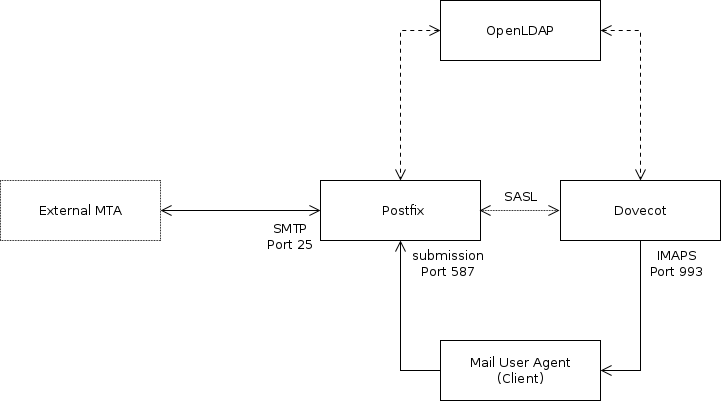

+++
title = 'Serveur mail géré par LDAP avec Postfix et Dovecot pour plusieurs domaines'
date = 2019-10-22 00:00:00 +0100
categories = messagerie
+++
# Serveur mail géré par LDAP avec Postfix et Dovecot pour plusieurs domaines

[LDAP managed mail server with Postfix and Dovecot for multiple domains](https://www.vennedey.net/resources/2-LDAP-managed-mail-server-with-Postfix-and-Dovecot-for-multiple-domains#overview)

Cet article décrit comment configurer un système de messagerie sécurisé avec Postfix et Dovecot en tant que SMTP et IMAP , et OpenLDAP tant que serveur principal pour l’authentification des utilisateurs et le routage du courrier.

Tous les services seront configurés pour utiliser TLS par défaut afin d'assurer la sécurité de la couche de transport dans la mesure du possible. Il est supposé que vous avez déjà une installation OpenLDAP fonctionnant avec le support TLS disponible, comme indiqué dans [mon article OpenLDAP](https://www.vennedey.net/resources/0-Getting-started-with-OpenLDAP-on-Debian-8) .

Le système d’exploitation utilisé est Debian, mais sa conception devrait fonctionner indépendamment de celle-ci.

{:width="600"}

La configuration comprend trois composants logiciels différents. Postfix retransmet les mails soumis par les clients aux autres MTA et reçoit les mails d'autres MTA qui seront stockés dans le maildir l'utilisateur. Dovecot servira le maildir l'utilisateur via IMAPS pour qu'il puisse être lu et géré par un logiciel client tel que Thunderbird. Dovecot agit également en tant que fournisseur d'authentification SASL pour Postfix . Les informations sur les comptes d'utilisateurs et les alias de messagerie sont stockées dans l' LDAP et interrogées par Postfix et Dovecot .

L'ensemble de la configuration n'impliquera pas de "vrais" comptes sur le système d'exploitation. Pour Postfix nous pouvons utiliser des boîtes aux lettres virtuelles pour créer des boîtes aux lettres avec les UID et GID souhaités. Dovecot prend en charge les utilisateurs virtuels qui n'existent pas nécessairement dans le contexte du système d'exploitation. 

## LDAP

### Configuration initiale

Créer un squelette de configuration pour **slapd**

    dpkg-reconfigure slapd

Voulez-vous omettre la configuration d'OpenLDAP ? Non  
Nom de domaine : xoyize.xyz  
Nom d'entité (« organization ») : srvxo 
Mot de passe de l'administrateur : ZAYz4zCGs5kb  
Module de base de données à utiliser : MDB  
Faut-il supprimer la base de données lors de la purge du paquet ? Non  
Faut-il déplacer l'ancienne base de données ? Oui  

### Tests fonctionnels

Activer au démarrage et lancer **slapd** .  

    systemctl enable slapd
    systemctl start slapd


Sur quel port du réseau écoute slapd  

    netstat -laputn | grep slapd

```
tcp        0      0 0.0.0.0:389             0.0.0.0:*               LISTEN      10204/slapd         
tcp6       0      0 :::389                  :::*                    LISTEN      10204/slapd     
```

Comme on peut le voir, **slapd** attend les requêtes ldap sur le port TCP 389.  
Avec quels arguments s'exécute le service.   

    cat /var/run/slapd/slapd.args

```
/usr/sbin/slapd -h ldap:/// ldapi:/// -g openldap -u openldap -F /etc/ldap/slapd.d 
```

**-h** &rarr; les modalités d'accès à slapd : ldap et ldapi (ldap via TCP 389 et ldapi via socket unix)  
**-g** et **-u** &rarr; identité groupe et utilisateur sur lequel "tourne" le processus slapd  
**-F** &rarr; emplacement du ficher de configuration de slapd

Afficher les données de l'annuaire

    ldapsearch -x -H ldap://xoyize.xyz -b 'dc=xoyize,dc=xyz'

```
# extended LDIF
#
# LDAPv3
# base <dc=xoyize,dc=xyz> with scope subtree
# filter: (objectclass=*)
# requesting: ALL
#

# search result
search: 2
result: 32 No such object

# numResponses: 1
```

**-x** &rarr; nous utilisons un compte défini à l'intérieur de la base pour accéder à l'annuaire  
**-H** &rarr; accès en ldap sur la machine xoyize.xyz  
**-b** &rarr; la racine à parcourir , ici 'dc=xoyize,dc=xyz'

Définir un répertoire de configuration

    sudo -s
    mkdir -p /root/ldap/xoyize.xyz
    cd /root/ldap/xoyize.xyz

Créer un fichier /root/pwdldap et y mettre le mot de passe administrateur

    echo -n "mdpadmin" > /root/pwdldap
    chmod 600 /root/pwdldap

Pour éviter la saisie du mot de passe on remplace l'option **-W** par **-y /root/pwdldap**

### Peuplement de l'annuaire

Peupler l'annuaire en créant les deux **OU** puis un compte système avec son groupe primaire.  
Créer un fichier au format LDIF (LDAP Data Interchange Format)

```
cat > ou.ldif << EOF
dn: ou=posixaccounts,dc=xoyize,dc=xyz
objectclass: OrganizationalUnit

dn: ou=posixgroups,dc=xoyize,dc=xyz
objectclass: OrganizationalUnit

EOF
```

Nous avons les deux OU

* **posixaccounts** qui va contenir les comptes UNIX
* **posixgroups** qui va contenir les groupes UNIX

Ajouter à l'annuaire

    ldapadd  -x -H ldap://xoyize.xyz -D 'cn=admin,dc=xoyize,dc=xyz' -y /root/pwdldap -f ou.ldif 

**-D** &rarr; précise quel compte on va utiliser pour se connecter à slapd (ici, l'administrateur)  
**-W** &rarr; pour la demande du mot de passe associé ou **-y /root/pwdldap** 
**-f** &rarr; le fichier .ldif

## Ldap - Messagerie

L’annuaire LDAP doit conserver plusieurs informations nécessaires à Postfix et à Dovecot pour fonctionner.

*    Nom d'utilisateur et mot de passe pour l'authentification
*    UID et GID pour la gestion des autorisations du maildir de l'utilisateur
*    Emplacement du maildir
*    Liste des alias de messagerie pour un utilisateur donné permettant à un utilisateur d'avoir plusieurs adresses de messagerie. 

Les informations de compte peuvent être stockées avec le objectClass de posixAccount . Pour stocker les alias, un nouveau schéma LDAP doit être installé. Il comportera un `postfixUser` objectClass avec les deux attributs

*    **mailacceptinggeneralid** pour stocker une liste d'alias de messagerie
*    **maildrop** pour définir une ou plusieurs destinations finales pour le courrier envoyé aux alias donnés 

Pour installer le schéma postfixUser et ajoutez-le à cn=schema,cn=config . 

    /root/ldap/xoyize.xyz/postfix.ldif

```
dn: cn=postfix,cn=schema,cn=config
cn: postfix
objectclass: olcSchemaConfig
olcattributetypes: {0}(1.3.6.1.4.1.4203.666.1.200 NAME 'mailacceptinggeneralid' DESC 'Postfix mail local address alias attribute' EQUALITY caseIgnoreMatch SUBSTR caseIgnoreSubstringsMatch SYNTAX 1.3.6.1.4.1.1466.115.121.1.15{1024})
olcattributetypes: {1}(1.3.6.1.4.1.4203.666.1.201 NAME 'maildrop' DESC 'Postfix mail final destination attribute' EQUALITY caseIgnoreMatch SUBSTR caseIgnoreSubstringsMatch SYNTAX 1.3.6.1.4.1.1466.115.121.1.15{1024})
olcobjectclasses: {0}(1.3.6.1.4.1.4203.666.1.100 NAME 'postfixUser' DESC 'Postfix mail user class' SUP top AUXILIARY MAY(mailacceptinggeneralid $ maildrop))
```

    ldapadd  -x -H ldap://xoyize.xyz -D 'cn=admin,dc=xoyize,dc=xyz' -y /root/pwdldap -f postfix.ldif

Pour que les utilisateurs de messagerie soient séparés des autres et autoriser la séparation des privilèges dans votre annuaire, vous pouvez les stocker dans une **organizationalUnit** &rarr; **ou=mail,dc=xoyize,dc=xyz** 

```
cat > mail.ldif << EOF
dn: ou=mail,dc=xoyize,dc=xyz
objectclass: organizationalUnit
objectclass: top
ou: mail
EOF
```

    ldapadd  -x -H ldap://xoyize.xyz -D 'cn=admin,dc=xoyize,dc=xyz' -y /root/pwdldap -f mail.ldif


Le répertoire **/var/vmail** contenant le répertoire de l'utilisateur doit être créé à l'avance et doit être accessible en écriture pour tous les utilisateurs de courrier potentiels. Pour ce faire, utilisez le même GID sur tous les utilisateurs de messagerie et définissez la propriété du groupe sur ce GID , ou rendez le monde du répertoire accessible en écriture.

```
mkdir -p /var/vmail
chmod o+w /var/vmail                                    # Make world writable or
#chown :vmail /var/vmail && chmod g+w /var/vmail         # use common group
```

Créez un compte de messagerie pouvant être utilisé à des fins de test lors de la configuration de postfix et de dovecot. Pour créer un mot de passe haché, utilisez `slappasswd` . Assurez-vous de ne pas utiliser d'UID ou de GID utilisé par un autre utilisateur ou processus.

```
cat > xomail.ldif << EOF
dn: uid=xomail,ou=mail,dc=xoyize,dc=xyz
cn: xomail
gidnumber: 20000
homedirectory: /var/vmail/xomail
mailacceptinggeneralid: test0@hosted-domain.com
mailacceptinggeneralid: test1@hosted-domain.com
maildrop: xomail@xoyize.xyz
objectclass: account
objectclass: posixAccount
objectclass: postfixUser
objectclass: top
uid: xomail
uidnumber: 20000
userpassword: {SSHA}7cf03wMQHEot2NEwMnUTH6lrcSRAuP6y
EOF
```

    ldapadd  -x -H ldap://xoyize.xyz -D 'cn=admin,dc=xoyize,dc=xyz' -y /root/pwdldap -f xomail.ldif

Pour créer l'empreinte du mot de passe

    slappasswd

```
New password: 
Re-enter new password: 
{SSHA}gzJOGEJ/fLvyp1g8zdOSGcJQZjSRukE5
```

Les alias répertoriés avec **mailacceptinggeneralid** peuvent contenir n’importe quel domaine contenant des points d’enregistrement MX sur votre serveur de messagerie. Si vous ne savez pas quel domaine utiliser pour **maildrop** , ne vous inquiétez pas, cela sera expliqué lors de la configuration de postfix.

Pour accélérer les recherches dans le répertoire, des index doivent être créés pour les **mailacceptinggeneralid** et **maildrop** .  
Ajoutez le LDIF suivant à votre définition de base de données dans **cn=config** pour activer les index.

```
cat > index.ldif << EOF
dn: olcDatabase={1}mdb,cn=config
objectclass: olcDatabaseConfig
objectclass: olcMdbConfig
olcdbindex: mailacceptinggeneralid eq,sub
olcdbindex: maildrop eq
EOF
```

    ldapadd  -x -H ldap://xoyize.xyz -D 'cn=admin,dc=xoyize,dc=xyz' -y /root/pwdldap -f index.ldif

Puisque postfix et dovecot interrogeront le répertoire, un utilisateur distinct doit être créé avec les autorisations suffisantes pour lire le sous-arbre **ou=mail,dc=xoyize,dc=xyz**  

```
dn: cn=mailAccountReader,ou=Manager,dc=xoyize,dc=xyz
cn: mailAccountReader
objectclass: organizationalRole
objectclass: simpleSecurityObject
objectclass: top
userpassword: {SSHA}GY6RPlSGKI7SPKnnT7i/ktb/3JGmCHLT

to attrs=userPassword
  by self =xw
  by anonymous auth
  by * none
  
to dn.subtree="ou=mail,dc=xoyize,dc=xyz"
  by dn.base="cn=mailAccountReader,ou=Manager,dc=xoyize,dc=xyz" read
  by * none
```

Assurez-vous que les comptes LDAP anonymes sont autorisés à s'authentifier auprès de leur userPassword , car ce mécanisme sera utilisé par Dovecot pour authentifier les clients.

## Postfix

Postfix peut être installé à partir du référentiel Debian.

    apt-get install postfix postfix-ldap

Sélectionnez  *Internet site* comme type de configuration initiale. Ensuite, entrez le FQDN de votre hôte de messagerie. C'est probablement la même chose que celle configurée pour myhostname dans **/etc/postfix/main.cf** (voir la section suivante). Cela vous laissera un /etc/postfix/main.cf base pour commencer à utiliser la configuration de postfix.

### Le nom d'hôte (hostname)

Le tout premier paramètre à configurer est la directive myhostname . Il s'agit du nom d'hôte du serveur de messagerie et doit être identique à l'enregistrement MX des domaines pour lesquels ce serveur recevra des courriers. Il doit également être défini comme enregistrement PTR pour l'adresse IP résolue par ce nom d'hôte, car il est courant de bloquer le courrier en provenance d'hôtes où ce n'est pas le cas. Pour vérifier cela, effectuez une recherche inversée avec `dig -x <IP address>` 

main.cf

      myhostname = xoyize.xyz 

### Mappage LDAP

Avant de configurer postfix pour distribuer et recevoir le courrier, nous créons certaines tables de recherche LDAP que postfix utilisera pour interroger le répertoire. Le tableau suivant donne un aperçu de la manière dont les informations sont interrogées.

 _	| Clé 	| Valeur
----|--------|------
virtual_alias_domains |	Partie de domaine d'une adresse nom@hosted-domain.com |	N'importe quoi s'il s'agit d'un domaine hébergé, rien autrement
virtual_alias_maps |	Adresse sous la forme nom@hosted-domain.com |	Adresse sous la forme utilisateur@mail.exemple.com
virtual_mailbox_maps |	Adresse sous la forme utilisateur@mail.exemple.com |	Chemin vers le répertoire mail
virtual_uid_maps |	Adresse dans user@xoyize.xyz |	UID numérique à utiliser pour l'annuaire de courrier
smtpd_sender_login_maps 	Adresse sous la forme nom@hosted-domain.com 	Identifiant de connexion autorisé à utiliser cette adresse d'expéditeur

Créez un répertoire **/etc/postfix/ldap** pour conserver toutes les définitions de carte au même endroit. Les fichiers de ce répertoire contenant vos informations d'identification LDAP, définissez son propriétaire sur `postfix:postfix` et son mode sur `0100` .

Les informations de connexion de votre annuaire LDAP sont communes à toutes les cartes et peuvent être copiées au sommet de toutes.

```
server_host = ldap://localhost
start_tls = yes
version = 3
tls_ca_cert_file = /etc/ldap/tls/CA.pem
tls_require_cert = yes

bind = yes
bind_dn = cn=mailAccountReader,ou=Manager,dc=xoyize,dc=xyz
bind_pw = <Password for bind_dn>

search_base = ou=mail,dc=xoyize,dc=xyz
scope = sub
```

Cela permettra de se connecter à l'annuaire LDAP à l'aide de TLS et de vérifier la validité du certificat fourni par l'homologue. Cela doit être inclus dans tous les fichiers de **/etc/postfix/ldap** énumérés ci-après

virtual_alias_domains

```
query_filter = mailacceptinggeneralid=*@%s
result_attribute = mailacceptinggeneralid
result_format = %d
```

virtual_alias_maps

```
query_filter = mailacceptinggeneralid=%s
result_attribute = maildrop
```

virtual_mailbox_maps

```
query_filter = maildrop=%s
result_attribute = homeDirectory
result_format = %s/mailbox/
```

virtual_uid_maps

```
query_filter = maildrop=%s
result_attribute = uidNumber
```

smtpd_sender_login_maps

```
query_filter = (|(mailacceptinggeneralid=%s)(maildrop=%s))
result_attribute = uid
```

Vous pouvez tester le mappage avec la commande `postmap` . Voici un exemple de sortie pour l'utilisateur créé à des fins de test.

```
root@mailhost:~# postmap -q hosted-domain.com ldap:/etc/postfix/ldap/virtual_alias_domains
hosted-domain.com, hosted-domain.com

root@mailhost:~# postmap -q xomail@xoyize.xyz ldap:/etc/postfix/ldap/virtual_mailbox_maps
/var/vmail/xomail/mailbox/

root@mailhost:~# postmap -q xomail@xoyize.xyz ldap:/etc/postfix/ldap/virtual_uid_maps
20000

root@mailhost:~# postmap -q test0@hosted-domain.com ldap:/etc/postfix/ldap/smtpd_sender_login
xomail
```

Si les recherches ne fonctionnent pas comme prévu, définissez **debuglevel = -1** dans la définition de carte et examinez le résultat lors de l'exécution de `postmap` 

Étant donné que les fichiers contiennent des informations d'identification pour la liaison au répertoire, veillez à définir les autorisations de fichier appropriées.

    chown postfix:postfix /etc/postfix/ldap/*
    chmod 400 /etc/postfix/ldap/*

Un autre problème à résoudre est que postfix s'exécutera dans un environnement chrooté ( /var/spool/postfix ) et ne sera pas conscient du certificat de l'autorité de certification **/etc/ldap/tls/CA.pem** nécessaire à la validation du certificat du serveur. Pour contrer ce problème, créez **/var/spool/postfix/etc/ldap/tls/** et copiez **/etc/ldap/tls/CA.pem** dans ce répertoire, ou créez un montage de liaison pour rendre le certificat de CA disponible aux deux emplacements. .

```
mkdir -p /var/spool/postfix/etc/ldap/tls
touch /var/spool/postfix/etc/ldap/tls/CA.pem
mount --bind /etc/ldap/tls/CA.pem /var/spool/postfix/etc/ldap/tls/CA.pem
```

Sachez que cela ne persistera pas lors des redémarrages, assurez-vous donc de lier le répertoire avant de démarrer postfix. Ceci peut être réalisé avec une unité de montage systemd . Créez **/etc/systemd/system/var-spool-postfix-etc-ldap-tls-CA.pem.mount** avec le contenu suivant.

var-spool-postfix-etc-ldap-tls-CA.pem.mount

```
    [Unit]
    Description=Bind /etc/ldap/tls/CA.pem to /var/spool/postfix/etc/ldap/tls/CA.pem
    Before=postfix.service

    [Mount]
    What=/etc/ldap/tls/CA.pem
    Where=/var/spool/postfix/etc/ldap/tls/CA.pem
    Type=none
    Options=bind

    [Install]
    WantedBy=postfix.service
```

Rechargez systemd et démarrez l’unité.

    systemctl daemon-reload
    systemctl start var-spool-postfix-etc-ldap-tls-CA.pem.mount
    mount | grep CA

Vérifiez la sortie du `mount` pour voir si la liaison a réussi et activez le montage de la liaison avant le postfix au démarrage.

    systemctl enable var-spool-postfix-etc-ldap-tls-CA.pem.mount

```
Created symlink from /etc/systemd/system/postfix.service.wants/var-spool-postfix-etc-ldap-tls-CA.pem.mount to /etc/systemd/system/var-spool-postfix-etc-ldap-tls-CA.pem.mount.
```

Redémarrez l'hôte pour voir si la liaison est créée lors du démarrage.

### Les boîtes aux lettres (mailboxes)

Postfix implémente différentes méthodes pour livrer le courrier au destinataire. Dans cette configuration, nous utiliserons la classe de domaine d'alias virtuel et la classe de domaine de boîte aux lettres virtuelle . Chaque boîte aux lettres finale est associée à une adresse définie `<username>@$myhostname` . $**myhostname** contient le nom d'hôte défini dans **/etc/postfix/main.cf** et sera répertorié dans virtual_mailbox_domains . Tous les domaines hébergés sont traités comme des domaines d'alias virtuels et seront répertoriés dans les **virtual_alias_domains** avec la mappe LDAP définie précédemment et mappée à l'adresse de la boîte aux lettres finale.

Le testuser **xomail** créé dans la section LDAP contient les adresses <test0@hosted-domain.com> et <test1@hosted-domain.com> sous la forme **mailacceptinggeneralid** . Quand un mail est reçu pour l’une de ces adresses, postfix cherchera l’attribut **maildrop** correspondant, qui pourrait être une adresse distante (par exemple, juste pour être transféré vers une adresse Gmail), ou une adresse avec un domaine listé dans **virtual_mailbox_domains** , par exemple <xomail@xoyize.xyz>. . Les domaines répertoriés dans **virtual_mailbox_domains** seront stockés dans la boîte aux lettres de l'utilisateur. Des informations sur l'emplacement et le mode de création de la boîte aux lettres sont également extraites de LDAP, à l'aide de l'adresse de la boîte aux lettres.

/etc/postfix/main.cf

```
myhostname = xoyize.xyz

virtual_alias_domains = ldap:/etc/postfix/ldap/virtual_alias_domains
virtual_mailbox_domains = $myhostname

virtual_alias_maps = ldap:/etc/postfix/ldap/virtual_alias_maps
virtual_mailbox_base = /
virtual_mailbox_maps = ldap:/etc/postfix/ldap/virtual_mailbox_maps
virtual_uid_maps = ldap:/etc/postfix/ldap/virtual_uid_maps
virtual_gid_maps = ldap:/etc/postfix/ldap/virtual_uid_maps

smtpd_sender_login_maps = ldap:/etc/postfix/ldap/smtpd_sender_login_maps
```

Il est très important de lister chaque domaine une seule fois. Par exemple, ne répertoriez pas **$myhostname** dans **mydestination** ou **virtual_alias_domains** si cela est déjà indiqué dans **virtual_mailbox_domains**  

**virtual_alias_domains** s'étendra à tous les domaines utilisés dans les adresses indiquées dans tout attribut **mailacceptinggeneralid** dans le sous-arbre ** ou=mail,dc=xoyize,dc=xyz** 

Les boîtes aux lettres seront stockées au format maildir si la valeur renvoyée par la carte **virtual_mailbox_maps** se termine par `/` . La valeur renvoyée sera ajoutée à **virtual_mailbox_base** . La carte utilisée dans cette configuration renverra le chemin stocké dans l'attribut **homedirectory** l'utilisateur, avec **/mailbox/** ajouté. Ainsi, pour l'utilisateur test créé précédemment, les messages <test0@hosted-domain.com> et <test1@hosted-domain.com> seront d'abord redirigés vers <xomail@xoyize.xyz> , puis stockés dans **/var/vmail/xomail/mailbox/** au format maildir .


Les répertoires spécifiques à l'utilisateur seront créés avec les UID et GID et les autorisations minimales par postix lors de la réception du courrier.

Rechargez postfix et essayez d’envoyer un courrier test à votre nouveau serveur.

systemctl reload postfix
tail -f /var/log/mail.info

Lorsque le courrier est reçu, les journaux doivent contenir quelque chose comme

```
.../smtpd[6693]: connect from unknown[xxxx:...]
.../smtpd[6693]: A7D1665808DE: client=unknown[xxxx:...]
.../cleanup[6697]: A7D1665808DE: message-id=<56E9374F.8020607@external.example.com>
.../qmgr[5561]: A7D1665808DE: from=<snip@external.example.com>, size=892, nrcpt=1 (queue active)
.../smtpd[6693]: disconnect from unknown[xxx:...]
.../virtual[6698]: A7D1665808DE: to=<xomail@xoyize.xyz>, orig_to=<test0@hosted-domain.com>, relay=virtual, delay=0.42, delays=0.31/0.01/0/0.1, dsn=2.0.0, status=sent (delivered to maildir)
.../qmgr[5561]: A7D1665808DE: removed
```

puis vérifiez si le maildir a été créé

    tree -pug /var/vmail/xomail/

```
/var/vmail/xomail/
└── [drwx------ 20000    20000   ]  mailbox
    ├── [drwx------ 20000    20000   ]  cur
    ├── [drwx------ 20000    20000   ]  new
    │   └── [-rw------- 20000    20000   ]  1458124575.V902I1b800feM892045.mx0
    └── [drwx------ 20000    20000   ]  tmp

```

### TLS et service de soumission

Pour éviter de détecter les données échangées avec postfix, TLS doit être activé et configuré correctement. Il est recommandé d'utiliser au moins une longueur de clé de 2048 bits pour la clé RSA et de fournir un certificat valide portant un nom commun correct, signé par une autorité de certification reconnue. Si vous ne voulez pas payer d'argent, considérons [Let's Encrypt](http://letsencrypt.org/) comme une alternative gratuite. Il est également conseillé de créer vos propres groupes Diffie-Hellman avec au moins 2048 bits en raison de certaines faiblesses trouvées avec les groupes Diffie-Hellman couramment utilisés .

Pour générer un groupe avec 4096 bits, exécutez

    openssl dhparam 4096 > /etc/postfix/dhparam/dh4096.pem

Générer un nouveau groupe de temps en temps augmentera la sécurité.

La prise en charge de TLS doit être configurée du côté serveur ( smtpd_tls_* ) de postfix, afin de chiffrer et d’authentifier la connexion lors de la réception de courrier, ainsi que du côté client ( smtp_tls_* ) pour sécuriser la remise aux MTA externes.

main.cf

```
    smtpd_tls_cert_file = /etc/postfix/tls/server.crt
    smtpd_tls_key_file = /etc/postfix/tls/server.key
    smtpd_tls_loglevel = 1
    smtpd_tls_received_header = yes
    smtpd_tls_security_level = may
    smtpd_tls_auth_only = yes
    smtpd_tls_mandatory_protocols = !SSLv2, !SSLv3
    #tls_preempt_cipherlist = yes
    tls_disable_workarounds = 0xFFFFFFFFFFFFFFFF
    smtpd_tls_mandatory_ciphers = high
    smtpd_tls_exclude_ciphers = aNULL, eNULL, EXPORT, DES, RC4, MD5, PSK, aECDH, EDH-DSS-DES-CBC3-SHA, EDH-RSA-DES-CDB3-SHA, KRB5-DES, CBC3-SHA
    smtpd_tls_dh1024_param_file = /etc/postfix/dhparam/dh4096.pem
    smtpd_tls_eecdh_grade = ultra
```

Cette configuration pour le côté **smtpd** est assez sécurisée mais restrctive et pourrait ne pas fonctionner avec tous les MTA.

**smtpd_tls_mandatory_ciphers** définit la suite de cryptage autorisée à être utilisée et est définie sur **high** . Pour voir quels chiffrements appartiennent à ce groupe, exécutez `postconf tls_high_cipherlist` .

**smtpd_tls_exclude_ciphers** contient une liste de ciphers non sécurisés et est recommandé par le groupe de recherche mentionné ci-dessus.

**tls_preempt_cipherlist** active les préférences de chiffrement du serveur lorsqu'il est défini sur **yes** . Cela signifie qu’à la place du client, postfix choisira le chiffre utilisé pour la communication. Cela pourrait causer des problèmes d’interopérabilité, [consultez la documentation de postfix](http://www.postfix.org/postconf.5.html#tls_preempt_cipherlist) pour plus d’informations.

**tls_disable_workarounds** de `0xFFFFFFFFFFFFFFFF` désactive toutes les bogues OpenSSL sur un système 64 bits, car elles peuvent créer des problèmes de sécurité inattendus.

**smtpd_tls_security_level** est défini sur **may** ce qui signifie que le cryptage est facultatif. Le fait de changer cela pour encrypt imposera l'utilisation de TLS mais aura pour effet secondaire que les MTA sans fonctionnalité TLS ne pourront pas envoyer de courrier à votre serveur.

**smtpd_tls_auth_only** applique le chiffrement pendant l'authentification indépendamment du niveau **smtpd_tls_security_level** .

**smtpd_tls_dh1024_param_file** définit le chemin d'accès au groupe Diffie-Hellman et malgré le nom, il peut (et devrait!) être supérieur à 1024 bits.

**smtpd_tls_eecdh_grade** sélectionne les courbes utilisées par postfix pour l'échange de clé ECDH éphémère. **ultra** sélectionne la courbe définie dans tls_eecdh_ultra_curve (voir postconf **tls_eecdh_ultra_curve** ) et constitue le paramètre le plus puissant disponible, mais nécessite environ deux fois le coût de calcul du paramètre strong .

Pour déboguer les connexions TLS, **smtpd_tls_loglevel** est défini sur au moins **1** .

**smtpd_tls_received_header** défini sur **yes** ajoutera des informations sur les chiffrements utilisés lors du transfert dans les en-têtes de message.

main.cf

```
smtp_tls_security_level = verify
smtp_tls_CApath = /etc/ssl/certs
smtp_tls_loglevel = $smtpd_tls_loglevel
smtp_tls_mandatory_protocols = $smtpd_tls_mandatory_protocols
smtp_tls_mandatory_ciphers = $smtpd_tls_mandatory_ciphers
smtp_tls_exclude_ciphers = $smtpd_tls_exclude_ciphers
```

Du côté de **smtp , smtp_tls_loglevel , smtp_tls_mandatory_protocols , smtp_tls_mandatory_ciphers et smtp_tls_exclude_ciphers** sont définis sur les mêmes valeurs que leurs homologues **smtpd**  smtp_tls_security_level défini pour verify applique le chiffrement lors de la remise du courrier. La connexion au MTA externe échouera si TLS n'est pas pris en charge ou si le certificat du site distant ne peut pas être vérifié.   
Pour vérifier le certificat, les certificats de l'autorité de certification dans **smtp_tls_CApath** sont utilisés. Cela peut entraîner le report du courrier si le certificat homologue a été auto-signé ou a expiré. Pour résoudre ce problème, utilisez l'option de **delay_warning_time** moins sécurisé ou définissez **delay_warning_time** sur une valeur appropriée pour obtenir une notification si votre courrier a été différé.

Si vous définissez **smtpd_tls_security_level** sur **may** ou sur **tls_preempt_cipherlist** sur **no** , il est **tls_preempt_cipherlist** de fournir une deuxième instance de smtpd écoutant sur le port 587 avec **smtpd_tls_security_level** défini sur **tls_preempt_cipherlist** et **tls_preempt_cipherlist** défini sur **yes** . Les utilisateurs doivent ensuite utiliser cette instance pour envoyer des e-mails à la livraison (serveur SMTP sortant).

Pour activer le service de soumission, éditez **/etc/postfix/master.cf** et décommentez les lignes correspondantes.

master.cf

```
    ...
    submission inet n       -       -       -       -       smtpd
      -o syslog_name=postfix/submission
      -o smtpd_tls_security_level=encrypt
      -o tls_preempt_cipherlist=yes

```

Rechargez le suffixe et vérifiez /var/log/mail.* pour détecter les erreurs éventuelles. Vérifiez également si le service de soumission écoute sur le port 587.

    systemctl reload postfix
    netstat -pltn | grep master

## Dovecot

Tandis que Postfix sert de serveur smtp et de relais, Dovecot servira de serveur IMAP pour récupérer les messages stockés sur l'hôte de messagerie. Dovecot inclut également une implémentation SASL qui peut être utilisée par postfix pour authentifier les utilisateurs.

Les packages Dovecot peuvent être installés à partir du référentiel Debian.

    apt-get install dovecot-core dovecot-imapd dovecot-ldap

### Dovecot - Configuration

La configuration est répartie sur plusieurs fichiers dans **/etc/dovecot/** et **/etc/dovecot/conf.d** et contient des blocs de configuration de base, qui peuvent être inclus en supprimant les commentaires. `doveconf -n` imprimera la configuration finale construite à partir de tous les extraits.

#### maildir location

L'emplacement de maildir est défini dans **/etc/dovecot/conf.d/10-mail.conf** . Le répertoire personnel de l'utilisateur sera lu à partir de LDAP et "/ mailbox" sera ajouté à la configuration suivante.

    maildir:~/mailbox

#### IMAPS

Pour activer uniquement la prise en charge IMAPS sur le port 993 et ​​désactiver les tentatives de connexion potentiellement non sécurisées sur le port IMAP normal 143, le port du listener imap doit être défini sur 0 et les lignes pour IMAPS doivent être décommentées dans** /etc/dovecot/conf.d/10-master.conf** 

10-master.conf

```
service imap-login {
    inet_listener imap {
        port = 0
    }
    inet_listener imaps {
        port = 993
        ssl = yes
    }
    
    service_count = 1
    process_min_avail = 1
}
```

#### Backend LDAP

Dovecot peut utiliser LDAP comme base de données de mots de passe pour l’authentification, ainsi que comme base de données d’utilisateurs pour des informations telles que l’emplacement maildir, l’ UID et le GID de l’utilisateur. Un aperçu est donné dans le wiki de Dovecot .

Pour activer LDAP en tant que base de données de mots de passe et d'utilisateurs, activez-le dans **/etc/dovecot/conf.d/10-auth.conf** et désactivez **auth-system.conf.ext** .

10-auth.conf

```
#!include auth-system.conf.ext
!include auth-ldap.conf.ext
```

**/etc/dovecot/conf.d/auth-ldap.conf.ext** devrait contenir la déclaration pour passdb et userdb .

auth-ldap.conf.ext

```
passdb {
        driver = ldap
        args = /etc/dovecot/dovecot-ldap.conf.ext
}
userdb {
        driver = ldap
        args = /etc/dovecot/dovecot-ldap.conf.ext
}
```

Le fichier **/etc/dovecot/dovecot-ldap.conf.ext** est utilisé par passdb et userdb pour configurer les paramètres de connexion à l'annuaire LDAP.

dovecot-ldap.conf.ext

```
uris = ldap://localhost
dn = cn=mailAccountReader,ou=Manager,dc=xoyize,dc=xyz
dnpass = <dn bind password>
tls = yes
tls_ca_cert_file = /etc/ldap/tls/CA.pem
tls_require_cert = hard
debug_level = 0
auth_bind = yes
auth_bind_userdn = uid=%u,ou=mail,dc=xoyize,dc=xyz
ldap_version = 3
base = ou=mail,dc=xoyize,dc=xyz
scope = subtree
user_attrs = homeDirectory=home,uidNumber=uid,gidNumber=gid
user_filter = (&(objectClass=posixAccount)(uid=%u))
```

Cette configuration, **auth_bind = yes** tente un accès à OpenLDAP avec le DN de l'utilisateur IMAP authentifiant au lieu de vérifier directement le mot de passe.  
L'avantage de cette configuration est que le mot de passe stocké dans le répertoire n'a pas besoin d'être lisible par Dovecot. Lorsque le modèle **auth_bind_userdn** est défini, **pass_attr** peut être omis.  
**user_filter** définit le filtre pour rechercher l'entrée LDAP à l'aide du nom d'utilisateur de connexion.  
**user_attrs** mappe les attributs LDAP aux attributs internes de Dovecot. Lors de la récupération des informations utilisateur, Dovecot se connecte au répertoire avec les informations d'identification définies avec les directives **dn** et **dnpass** .   
Les autres paramètres sont utilisés pour se connecter à OpenLDAP avec TLS et sont les mêmes que dans la configuration postfix.

#### TLS

TLS peut être configuré dans **/etc/dovecot/conf.d/10-ssl.conf** . Réutilisez la clé et le certificat utilisés pour postfix si le nom d’hôte du serveur IMAP sera identique, ou générez une nouvelle clé et un nouveau certificat pour Dovecot. Le groupe Diffie-Hellman est généré et géré automatiquement par Dovecot. La taille peut être définie avec ssl_dh_parameters_length et doit au moins être définie sur 2048 bits. La suite de cryptages a été prise sur faibledh.org

10-ssl.conf

```
ssl = required
ssl_cert = </etc/dovecot/tls/server.crt
ssl_key = </etc/dovecot/tls/server.key
ssl_dh_parameters_length = 4096
ssl_protocols = !SSLv2 !SSLv3
ssl_cipher_list = ECDHE-RSA-AES128-GCM-SHA256:ECDHE-ECDSA-AES128-GCM-SHA256:ECDHE-RSA-AES256-GCM-SHA384:ECDHE-ECDSA-AES256-GCM-SHA384:DHE-RSA-AES128-GCM-SHA256:DHE-DSS-AES128-GCM-SHA256:kEDH+AESGCM:ECDHE-RSA-AES128-SHA256:ECDHE-ECDSA-AES128-SHA256:ECDHE-RSA-AES128-SHA:ECDHE-ECDSA-AES128-SHA:ECDHE-RSA-AES256-SHA384:ECDHE-ECDSA-AES256-SHA384:ECDHE-RSA-AES256-SHA:ECDHE-ECDSA-AES256-SHA:DHE-RSA-AES128-SHA256:DHE-RSA-AES128-SHA:DHE-DSS-AES128-SHA256:DHE-RSA-AES256-SHA256:DHE-DSS-AES256-SHA:DHE-RSA-AES256-SHA:AES128-GCM-SHA256:AES256-GCM-SHA384:AES128-SHA256:AES256-SHA256:AES128-SHA:AES256-SHA:AES:CAMELLIA:DES-CBC3-SHA:!aNULL:!eNULL:!EXPORT:!DES:!RC4:!MD5:!PSK:!aECDH:!EDH-DSS-DES-CBC3-SHA:!EDH-RSA-DES-CBC3-SHA:!KRB5-DES-CBC3-SHA
ssl_prefer_server_ciphers = yes
verbose_ssl = yes
```

#### Authentification SASL

Dovecot peut être configuré pour fournir une interface SASL pour postfix afin que l'authentification pour postfix puisse s'effectuer via Dovecot, qui utilise ensuite LDAP comme serveur principal.

Pour activer l'interface SASL, activez le service **auth** dans **/etc/dovecot/conf.d/10-master.conf** .

10-master.conf

```
    service auth {
        ...
        unix_listener /var/spool/postfix/private/auth {
            mode = 0660
            user = postfix
            group = postfix
        }
    }
```

Cela créera un socket Unix dans **/var/spool/postfix/private/auth** appartenant et uniquement accessible à l'utilisateur postfix.

Pour activer l'authentification SASL dans postfix, activez-la dans **/etc/postfix/main.cf** .

main.cf

```
smtpd_sasl_type = dovecot
smtpd_sasl_path = private/auth
smtpd_sasl_auth_enable = yes
broken_sasl_auth_clients = yes
```

Pour permettre le relais du courrier des utilisateurs authentifiés vers des destinations distantes, ajoutez **permit_sasl_authenticated** à **smtpd_relay_restriction** .   
Et pour n’autoriser que les adresses FROM appartenant à l’utilisateur authentifié, définissez le programme **reject_sender_login_mismatch** dans **smtpd_recipient_restrictions** .  
Les adresses autorisées sont recherchées dans la carte définie dans **smtpd_sender_login_maps** .

main.cf

```
smtpd_relay_restrictions = permit_mynetworks permit_sasl_authenticated defer_unauth_destination
smtpd_recipient_restrictions = reject_sender_login_mismatch
```

#### Test d'authentification

L'authentification Postfix peut être facilement testée à partir de la ligne de commande. Connectez-vous d'abord au serveur sur le port 25 ou le port 587.

    openssl s_client -starttls smtp -connect xoyize.xyz:25

Vous obtiendrez de nombreuses informations utiles sur la connexion TLS établie. La prochaine étape consiste à vous présenter avec la commande EHLO .

```
EHLO foo.example.com
250-xoyize.xyz
250-PIPELINING
250-SIZE 10240000
250-VRFY
250-ETRN
250-AUTH PLAIN
250-AUTH=PLAIN
250-ENHANCEDSTATUSCODES
250-8BITMIME
250 DSN
```

La ligne **250-AUTH** indique que l'authentification est activée. Pour tester l'authentification, générez une chaîne codée en base64 contenant le nom d'utilisateur et le mot de passe précédé du préfixe NULL.

    echo -ne "\0username\0password" | base64

Puis effectuez l'authentification, envoyez la chaîne au serveur.

```
AUTH PLAIN AHVzZXJuYW1lAHBhc3N3b3Jk
235 2.7.0 Authentication successful
```

Vous obtiendrez **235** ou **535** selon que l'authentification a réussi ou non.  
Si l'authentification ne fonctionne pas comme prévu, consultez **/var/log/mail.** pour les erreurs. Si pas suffisant , définissez **debug_level = -1** dans **/etc/dovecot/dovecot-ldap.conf.ext** et vérifiez à nouveau les journaux lors du test de l'authentification.

## Liens

* [Postfix Documentation](http://www.postfix.org/documentation.html)
* [Postfix Virtual Domain Hosting Howto](http://www.postfix.org/VIRTUAL_README.html)
* <http://wiki.dovecot.org/HowTo/PostfixAndDovecotSASL>
* <https://easyengine.io/tutorials/mail/server/testing/smtp/>
* <https://github.com/credativ/postfix-ldap-schema>
* <http://www.openldap.org/faq/data/cache/1442.html>
* <http://www.postfix.org/LDAP_README.html#example_virtual>
* <http://wiki2.dovecot.org/AuthDatabase/LDAP/Userdb>
* <http://wiki2.dovecot.org/SSL/DovecotConfiguration>
* <http://www.postfix.org/SASL_README.html#smtpd_sasl_security_options>

