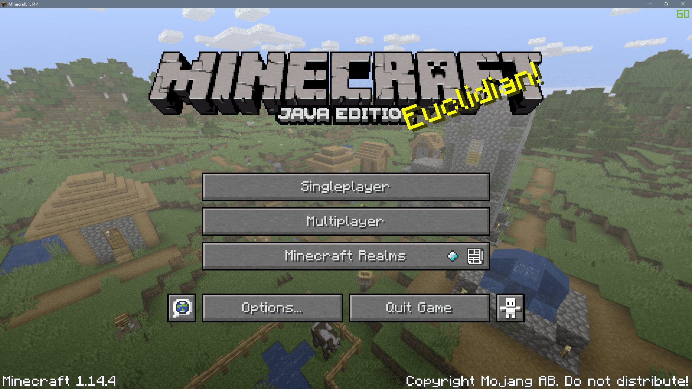
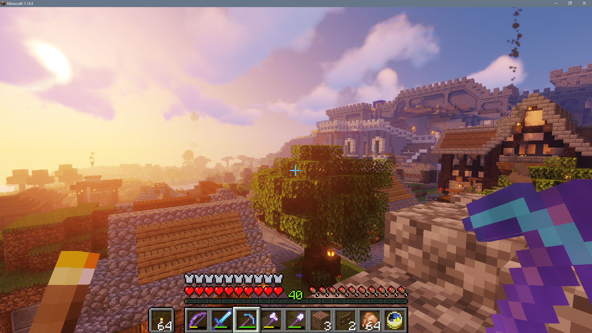

+++
title = 'minecraft-serveur'
date = 2019-10-30 00:00:00 +0100
categories = divers
+++
## [Minecraft] Installer et sauvegarder son propre serveur sur Debian

[[Minecraft] Installer et sauvegarder son propre serveur sur Debian](https://www.pofilo.fr/post/20191025-minecraft-server/)

Voici donc les étapes que j’ai suivies pour installer Minecraft Serveur 1.14.4 sous Debian 10.

### Installation de Java

L’installation va se passer sous l’utilisateur root. On commence par mettre à jour les listes de dépôts avec `apt update`. Ensuite, on peut installer le paquet contenant le JDK 11 `apt install openjdk-11-jdk`.

On vérifie ensuite que java soit bien installé en faisant java -version et on devrait obtenir un résultat du type:

```
openjdk version "11.0.5" 2019-10-15
OpenJDK Runtime Environment (build 11.0.5+10-post-Debian-1deb10u1)
OpenJDK 64-Bit Server VM (build 11.0.5+10-post-Debian-1deb10u1, mixed mode, sharing)
```

Il ne nous reste plus qu’à rajouter JAVA_HOME à l’environnement et à le sourcer pour l’avoir directement: `echo "JAVA_HOME=/usr/lib/jvm/java-11-openjdk-amd64/" >> /etc/environment` puis `source /etc/environment`.

### Mise en place de l’environnement et installation du serveur

On va voir comment tout mettre en place étapes par étapes.

#### Création de l’utilisateur et de son environnement

Toujours en root, ajouter l’utilisateur minecraft avec la commande `/usr/sbin/useradd -r -m -U -d /opt/minecraft -s /bin/bash minecraft`. Celle-ci précise aussi que le dossier home de l’utilisateur sera sous `/opt/minecraft`.

On se place ensuite sous l’utilisateur minecraft avec `sudo su - minecraft`.

On veut créer les dossiers qui nous serviront par la suite selon l’architecture suivante:

```
/opt/minecraft/backups
/opt/minecraft/tools
/opt/minecraft/server
```

Comme le home de l’utilisateur est défini sous /opt/minecraft, on peut créer facilement les 3 dossiers avec la commande suivante: `mkdir -p ~/{backups,tools,server}`.
Mise en place de mrmcon

RCON est un protocole qui permet de se connecter au serveur Minecraft afin d’y exécuter des commandes. L’outil mcron que nous allons installer est un client codé en C pour le protocole RCON.

*    On commence par installer les dépendances en root: `apt install git build-essential`.
*    On se place désormais sous l’utilisateur minecraft avec `sudo su - minecraft` 
*    On se place dans le dossier où l’on va placer nos outils: `cd ~/tools` 
*    On télécharge mcron: `git clone https://github.com/Tiiffi/mcrcon.git` (miroir ici).
*    On se place dans le dossier téléchargé: `cd ~/tools/mcrcon` 
*    On est alors sous master mais les développements se font dans develop, donc on peut rester comme ça.
*    Ensuite, on peut compiler l’outil: `gcc -std=gnu11 -pedantic -Wall -Wextra -O2 -s -o mcrcon mcrcon.c` 
*    Enfin, il ne nous reste plus qu’à voir si tout a bien fonctionné avec: `./mcrcon -h` et l’aide devrait alors s’afficher.

#### Installation du serveur

Je vous laisse aller sur la [page de téléchargements de Mojang](https://www.minecraft.net/en-us/download/server/).

Pour la version 1.14.4:

*    Téléchargement de la version: `wget https://launcher.mojang.com/v1/objects/3dc3d84a581f14691199cf6831b71ed1296a9fdf/server.jar -P ~/server` 
*    On se place dans le dossier server: `cd ~/server` 
*    On renomme l’archive avec la version pour s’y retrouver: `mv server.jar minecraft_server.1.14.4.jar` 
*    Et on peut faire un lien symbolique: `ln -s minecraft_server.1.14.4.jar server.jar` 
*    On lance désormais le serveur: `java -Xmx4096M -Xms4096M -jar server.jar nogui` 
*    On accepte les conditions d’utilisation: `vim eula.txt` et mettre la variable `eula` à `true` 

#### Configuration du serveur

Maintenant que le serveur peut démarrer et que la licence est acceptée, le fichier de configuration a été créé.

Vous pouvez maintenant configurer le serveur pour activer le protocole RCON. Cela se passe dans le fichier `~/server/server.properties`:

```
rcon.port=25575
rcon.password=strong-password
enable-rcon=true
white-list=true
```

Je vous invite bien évidemment à changer le mot de passe.

Pour le reste de la configuration, je vous laisse faire à vos envies/besoins. Je vous recommande également d’activer la white-list. Vous pouvez retrouver une documentation ici.

Une fois le serveur configuré et lancé, vous pourrez accéder à la console via la commande: `~/tools/mcrcon/mcrcon -H 127.0.0.1 -P 25575 -p strong-password -t` 

C’est depuis cette console que vous pourrez whitelister des joueurs (ayant une version officielle du jeu) via la commande `whitelist add <player>` 

{:width="600"}

### Démon et sauvegardes

Maintenant que l’on sait lancer notre serveur, on aimerait bien qu’il se lance tout seul. Et on aimerait bien également faire des sauvegardes, histoire de ne rien perdre en cas de crash !

#### La démonisation avec systemd

Ça fera crier les détracteurs de systemd, mais ce gestionnaire de système fonctionne tout de même très bien et est très simple d’utilisation.

En tant que root, je vous invite donc à créer le fichier `/etc/systemd/system/minecraft.service` et à vous inspirer du contenu suivant:

```
[Unit]
Description=Minecraft Server
After=network.target

[Service]
User=minecraft
Nice=1
KillMode=none
SuccessExitStatus=0 1
ProtectHome=true
ProtectSystem=full
PrivateDevices=true
NoNewPrivileges=true
WorkingDirectory=/opt/minecraft/server
ExecStart=/usr/bin/java -XX:+UseG1GC -server -Xmx4096M -Xms4096M -jar server.jar nogui
ExecStop=/opt/minecraft/tools/mcrcon/mcrcon -H 127.0.0.1 -P 25575 -p strong-password stop

[Install]
WantedBy=multi-user.target
```

N’oubliez pas de changer le mot de passe !
On peut ensuite activer ce service et le lancer:

```
systemctl enable minecraft
systemctl daemon-reload
systemctl start minecraft
```

#### Pour les sauvegardes, Borg est votre ami

Pour les sauvegardes, nous allons en effet utiliser borg, cet outil de sauvegarde incrémentielle qui supporte notamment la déduplication (les fichiers sont sauvegardés et découpés en une multitude de tronçons et Borg ne sauvegarde que les différences d’une sauvegarde à l’autre).

On installe donc cet outil (ainsi que rsync) en root avec la commande: `apt install borgbackup rsync` 

Si l’on retourne sous l’utilisateur minecraft, il nous faut suivre les étapes suivantes:

*    On commence par créer les dossiers dans lesquels on va faire les sauvegardes: `mkdir -p ~/backup/{rsync,borg}` 
*    On se place dans le dossier dans lequel on va initialiser borg: `cd ~/backup/borg` 
*    On initialise donc le dépôt avec cette commande qui va créer le dossier server: `borg init --encryption=none server` 
*    Pour la première sauvegarde, on va faire un rsync pour initialiser le tout: `rsync --stats --delete -az ~/server ~/backup/rsync` 
*    Et on lance la première sauvegarde en mettant une faible priorité pour ne pas consommer trop de CPU: `nice -n 19 ionice -c 3 borg create -v --stats --progress ~/backup/borg/server/::{now} ~/backup/rsync`

#### Automatisation des sauvegardes

Tout d’abord sous l’utilisateur root, on va créer un dossier de log `mkdir /var/log/minecraft/` et donner les droits à l’utilisateur minecraft avec la commande `chown -R minecraft:minecraft /var/log/minecraft/` 

Si l’on retourne sous l’utilisateur minecraft, voici les étapes à suivre pour automatiser les sauvegardes. On commence par créer le script `~/tools/backup.sh` dans lequel on place le contenu suivant:

```
#!/bin/bash

# Logs
# This folder should exists and the user minecraft be able to write in it
LOGPATH="/var/log/minecraft/"
DATE=`date +"%Y%m%d-%H%M%S"`
LOGNAME="_minecraft_backup.log"
LOGFILE=$LOGPATH$DATE$LOGNAME
touch $LOGFILE

function rcon {
  /opt/minecraft/tools/mcrcon/mcrcon -H 127.0.0.1 -P 25575 -p strong-password "$1"
}

echo -e " --> Force save off the minecraft server" >> $LOGFILE
rcon "save-off" >> $LOGFILE
rcon "save-all" >> $LOGFILE

echo -e " --> Copying the files" >> $LOGFILE
rsync --stats --delete -az /opt/minecraft/server /opt/minecraft/backup/rsync >> $LOGFILE
rcon "save-on" >> $LOGFILE

# Now we have the files while the server is back in save mode so we can archive it
echo -e " --> Archiving the files" >> $LOGFILE
nice -n 19 ionice -c 3 borg create -v --stats --progress /opt/minecraft/backup/borg/server/::{now} /opt/minecraft/backup/rsync >> $LOGFILE 2>&1

# Prune old backups
# Keep the last backups of the 7 last days, the last backup of each of the last 4 weeks, the last archive for every months and all archive within 48 hours
nice -n 19 ionice -c 3 borg prune -v --list --keep-daily=7 --keep-weekly=4 --keep-monthly=-1 --keep-within=2d /opt/minecraft/backup/borg/server/ >> $LOGFILE 2>&1

echo -e " --> DONE" >> $LOGFILE
```

Ce script va désactiver la sauvegarde automatique (interne) du serveur le temps de copier les fichiers avec un **rsync**.  
Cela permet de pouvoir copier les fichiers très rapidement avant de pouvoir réactiver les sauvegardes automatiques.  
On peut ensuite faire la sauvegarde en tant que tel avec **borg** avec une priorité élevée pour ne pas impacter le serveur.  
À la fin, on supprime les anciennes sauvegardes selon les règles suivantes:  
on garde toutes les archives des 2 derniers jours, une sauvegarde par jour sur les 7 derniers jours, une sauvegarde par semaine sur les 4 dernières semaines et une archive par mois à vie.

L’avantage d’avoir une copie avec rsync permet de faire la sauvegarde dessus pour ne pas impacter les performances du serveur si des joueurs sont dessus. L’inconvénient est de dupliquer les fichiers.

*    On veut maintenant donner les droits d’exécution sur notre script: `chmod +x ~/tools/backup.sh` 
*    On va créer une tâche cron pour lancer le script de sauvegarde toutes les 2 heures: `crontab -e` 
*    On y rajoute la ligne suivante: `10 */2 * * * /opt/minecraft/tools/backup.sh` (ça lancera la sauvegarde toutes les 2 heures, ex: 0h10, 2h10 ...) 

>Pour les sauvegardes, pensez ensuite à sauvegarder également sur un autre support (au minimum).

### Conclusion

{:width="600"}

Voilà qui conclue ce tutoriel, je vous souhaite de bonnes soirées avec vos potes. En cas de soucis d’installation ou d’amélioration de celui-ci, n’hésitez pas à le partager en commentaire !

Pour vous donner une idée, le serveur tourne depuis 2 mois et le dossier `/opt/minecraft` pèse 3.4 Go dont 2.6 Go de sauvegardes.   
Comme on fait un rsync du dossier `/opt/minecraft/server`, on a donc (dans les 3.4 Go) deux fois 835 Mo. Pour le CPU et la RAM, à voir avec ce que vous avez, vous pouvez jouer sur la RAM dans les paramètres que vous donnez à systemd.
