+++
title = 'Samsung Galaxy A5 [2016] SM-A510F (Android)'
date = 2019-12-14 00:00:00 +0100
categories = android
+++
## Samsung Galaxy A5 2016 SM-A510F

.jpg)

* [How to Flash TWRP Recovery on any Samsung Phone](/files/android/How to Flash TWRP Recovery on any Samsung Phone.htm)
* [How To Root And Install Official TWRP Recovery On Samsung Galaxy A5 (2016)](/files/android/How To Root And Install Official TWRP Recovery On Samsung Galaxy A5 (2016).htm)

<h2>Samsung Galaxy A5 2016</h2>
<h4 class="western">Caractéristiques techniques</h4>
<table width="574" cellpadding="2" cellspacing="0">
	<col width="245"/>

	<col width="321"/>

	<tr>
		<td width="245" style="border: none; padding: 0cm">Système 
		</td>
		<td width="321" style="border: none; padding: 0cm">Android 5.1.1
		</td>
	</tr>
	<tr>
		<td width="245" style="border: none; padding: 0cm">Interface
			utilisateur 
			
		</td>
		<td width="321" style="border: none; padding: 0cm">TouchWiz 
			
		</td>
	</tr>
	<tr>
		<td width="245" style="border: none; padding: 0cm">Processeur 
			
		</td>
		<td width="321" style="border: none; padding: 0cm">Samsung
			Exynos 7580 
			
		</td>
	</tr>
	<tr>
		<td width="245" style="border: none; padding: 0cm">Nombre de
			coeurs 
			
		</td>
		<td width="321" style="border: none; padding: 0cm">8 
			
		</td>
	</tr>
	<tr>
		<td width="245" style="border: none; padding: 0cm">Fréquence
			processeur 
			
		</td>
		<td width="321" style="border: none; padding: 0cm">1.6 GHz 
			
		</td>
	</tr>
	<tr>
		<td width="245" style="border: none; padding: 0cm">Puce
			graphique 
			
		</td>
		<td width="321" style="border: none; padding: 0cm">ARM Mali T720
			MP2 
			
		</td>
	</tr>
	<tr>
		<td width="245" style="border: none; padding: 0cm">Support
			cartes mémoire 
			
		</td>
		<td width="321" style="border: none; padding: 0cm">Oui 
			
		</td>
	</tr>
	<tr>
		<td width="245" style="border: none; padding: 0cm">Type de
			cartes supportées 
			
		</td>
		<td width="321" style="border: none; padding: 0cm">microSD,
			microSDHC, microSDXC 
			
		</td>
	</tr>
	<tr>
		<td width="245" style="border: none; padding: 0cm">Mémoire vive
			(RAM) 
			
		</td>
		<td width="321" style="border: none; padding: 0cm">2 Go 
			
		</td>
	</tr>
	<tr>
		<td width="245" style="border: none; padding: 0cm">Mémoire
			flash Libre 
			
		</td>
		<td width="321" style="border: none; padding: 0cm">10 Go 
			
		</td>
	</tr>
	<tr>
		<td width="245" style="border: none; padding: 0cm">Indice DAS 
			
		</td>
		<td width="321" style="border: none; padding: 0cm">0.29 W/kg 
			
		</td>
	</tr>
	<tr>
		<td width="245" style="border: none; padding: 0cm">Double SIM 
			
		</td>
		<td width="321" style="border: none; padding: 0cm">Non 
			
		</td>
	</tr>
</table>
<h4 class="western">Affichage</h4>
<table width="574" cellpadding="2" cellspacing="0">
	<col width="245"/>

	<col width="321"/>

	<tr>
		<td width="245" style="border: none; padding: 0cm">Taille
			(diagonale) 
			
		</td>
		<td width="321" style="border: none; padding: 0cm">5.2 &quot; 
			
		</td>
	</tr>
	<tr>
		<td width="245" style="border: none; padding: 0cm">Technologie
			de l'écran 
			
		</td>
		<td width="321" style="border: none; padding: 0cm">Super AMOLED 
			
		</td>
	</tr>
	<tr>
		<td width="245" style="border: none; padding: 0cm">Définition
			de l'écran 
			
		</td>
		<td width="321" style="border: none; padding: 0cm">1920 x 1080
			px 
			
		</td>
	</tr>
	<tr>
		<td width="245" style="border: none; padding: 0cm">Résolution
			de l'écran 
			
		</td>
		<td width="321" style="border: none; padding: 0cm">424 ppp 
			
		</td>
	</tr>
</table>
<h4 class="western">Entrées
&amp; sorties</h4>
<table width="574" cellpadding="2" cellspacing="0">
	<col width="245"/>

	<col width="321"/>

	<tr>
		<td width="245" style="border: none; padding: 0cm">Support du
			Wi-Fi 
			
		</td>
		<td width="321" style="border: none; padding: 0cm">Oui 
			
		</td>
	</tr>
	<tr>
		<td width="245" style="border: none; padding: 0cm">Norme Wi-Fi 
			
		</td>
		<td width="321" style="border: none; padding: 0cm">Wi-Fi 802.11n
						
		</td>
	</tr>
	<tr>
		<td width="245" style="border: none; padding: 0cm">Support du
			Bluetooth 
			
		</td>
		<td width="321" style="border: none; padding: 0cm">Oui 
			
		</td>
	</tr>
	<tr>
		<td width="245" style="border: none; padding: 0cm">Version
			Bluetooth 
			
		</td>
		<td width="321" style="border: none; padding: 0cm">Bluetooth 4.1
						
		</td>
	</tr>
	<tr>
		<td width="245" style="border: none; padding: 0cm">Support du
			NFC 
			
		</td>
		<td width="321" style="border: none; padding: 0cm">Oui 
			
		</td>
	</tr>
	<tr>
		<td width="245" style="border: none; padding: 0cm">Support de
			l'infra-rouge (IrDA) 
			
		</td>
		<td width="321" style="border: none; padding: 0cm">Non 
			
		</td>
	</tr>
	<tr>
		<td width="245" style="border: none; padding: 0cm">Type de
			connecteur USB 
			
		</td>
		<td width="321" style="border: none; padding: 0cm">micro USB 
			
		</td>
	</tr>
	<tr>
		<td width="245" style="border: none; padding: 0cm">Compatibilité
			USB Host 
			
		</td>
		<td width="321" style="border: none; padding: 0cm">Oui 
			
		</td>
	</tr>
</table>
<h4 class="western">Multimédia</h4>
<table width="574" cellpadding="2" cellspacing="0">
	<col width="245"/>

	<col width="321"/>

	<tr>
		<td width="245" style="border: none; padding: 0cm">Capteur photo
			principal 
			
		</td>
		<td width="321" style="border: none; padding: 0cm">13 Mpx 
			
		</td>
	</tr>
	<tr>
		<td width="245" style="border: none; padding: 0cm">Flash 
			
		</td>
		<td width="321" style="border: none; padding: 0cm">Oui 
			
		</td>
	</tr>
	<tr>
		<td width="245" style="border: none; padding: 0cm">Enregistrement
			vidéo (principal) 
			
		</td>
		<td width="321" style="border: none; padding: 0cm">1920 x 1080
			px 
			
		</td>
	</tr>
	<tr>
		<td width="245" style="border: none; padding: 0cm">Capteur en
			façade 
			
		</td>
		<td width="321" style="border: none; padding: 0cm">Oui 
			
		</td>
	</tr>
	<tr>
		<td width="245" style="border: none; padding: 0cm">Définition
			vidéo du capteur en façade 
			
		</td>
		<td width="321" style="border: none; padding: 0cm">1920 x 1080
			px 
			
		</td>
	</tr>
	<tr>
		<td width="245" style="border: none; padding: 0cm">Capteur photo
			frontal 1 
			
		</td>
		<td width="321" style="border: none; padding: 0cm">5 Mpx 
			
		</td>
	</tr>
	<tr>
		<td width="245" style="border: none; padding: 0cm">Radio FM 
			
		</td>
		<td width="321" style="border: none; padding: 0cm">Oui 
			
		</td>
	</tr>
</table>
<h4 class="western">Communication</h4>
<table width="574" cellpadding="2" cellspacing="0">
	<col width="245"/>

	<col width="321"/>

	<tr>
		<td width="245" style="border: none; padding: 0cm">Bandes GSM 
			
		</td>
		<td width="321" style="border: none; padding: 0cm">850 MHz, 900
			MHz, 1800 MHz, 1900 MHz Mhz 
			
		</td>
	</tr>
	<tr>
		<td width="245" style="border: none; padding: 0cm">Débit max.
			en réception 3G 
			
		</td>
		<td width="321" style="border: none; padding: 0cm">42 Mbit/s 
			
		</td>
	</tr>
	<tr>
		<td width="245" style="border: none; padding: 0cm">Compatible
			réseau 4G (LTE) 
			
		</td>
		<td width="321" style="border: none; padding: 0cm">Oui 
			
		</td>
	</tr>
</table>
<h4 class="western">Alimentation</h4>
<table width="574" cellpadding="2" cellspacing="0">
	<col width="245"/>

	<col width="321"/>

	<tr>
		<td width="245" style="border: none; padding: 0cm">Batterie
			amovible 
			
		</td>
		<td width="321" style="border: none; padding: 0cm">Non 
			
		</td>
	</tr>
	<tr>
		<td width="245" style="border: none; padding: 0cm">Capacité de
			la batterie 
			
		</td>
		<td width="321" style="border: none; padding: 0cm">2900 mAh 
			
		</td>
	</tr>
</table>
<h4 class="western">Dimensions</h4>
<table width="574" cellpadding="2" cellspacing="0">
	<col width="245"/>

	<col width="321"/>

	<tr>
		<td width="245" style="border: none; padding: 0cm">Largeur 
			
		</td>
		<td width="321" style="border: none; padding: 0cm">7.1 cm 
			
		</td>
	</tr>
	<tr>
		<td width="245" style="border: none; padding: 0cm">Hauteur 
			
		</td>
		<td width="321" style="border: none; padding: 0cm">14.48 cm 
			
		</td>
	</tr>
	<tr>
		<td width="245" style="border: none; padding: 0cm">Epaisseur 
			
		</td>
		<td width="321" style="border: none; padding: 0cm">0.73 cm 
			
		</td>
	</tr>
	<tr>
		<td width="245" style="border: none; padding: 0cm">Volume (cm3) 
			
		</td>
		<td width="321" style="border: none; padding: 0cm">75 cm3 
			
		</td>
	</tr>
	<tr>
		<td width="245" style="border: none; padding: 0cm">Poids 
			
		</td>
		<td width="321" style="border: none; padding: 0cm">155 g 
			
		</td>
	</tr>
</table>

## Economiser la batterie

* [Android - Dix astuces pour économiser la batterie.htm](/files/android/Android - Dix astuces pour économiser la batterie.htm)

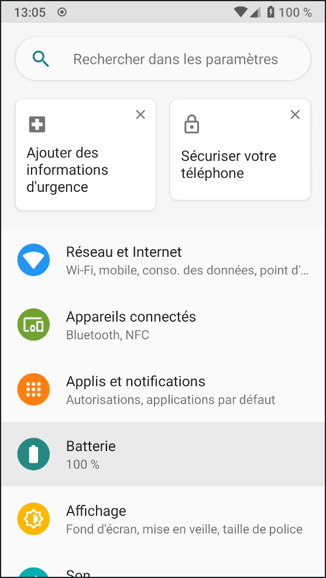{:width="150"}  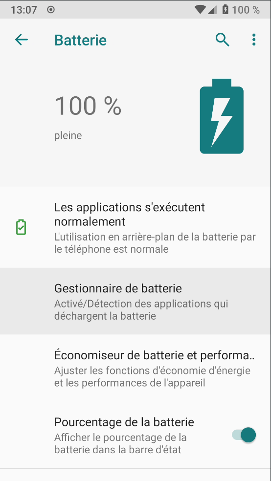{:width="150"}  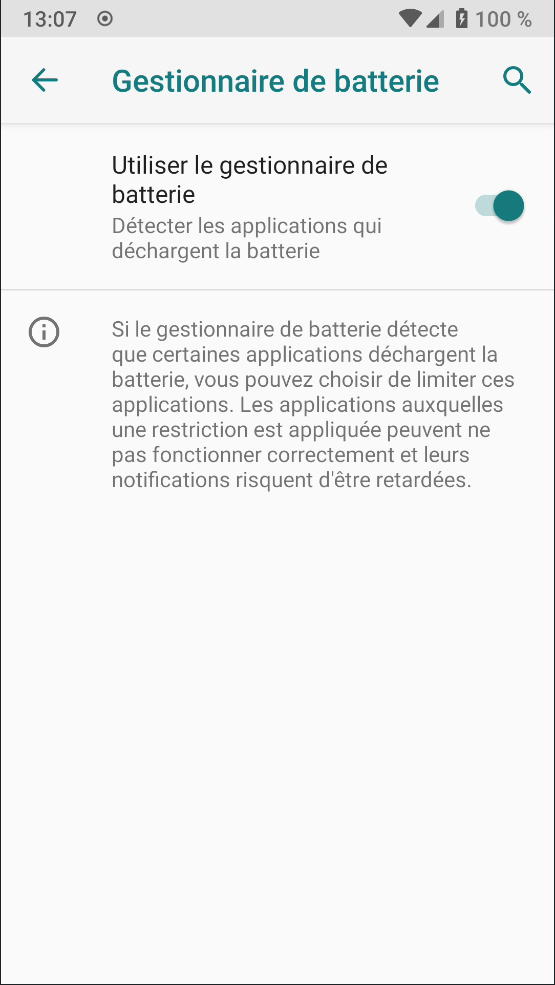{:width="150"}  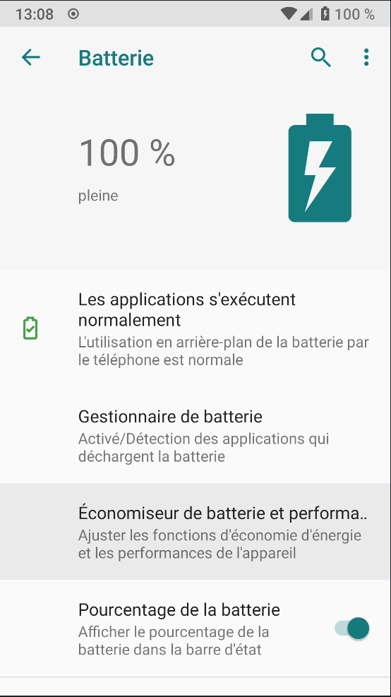{:width="150"}  
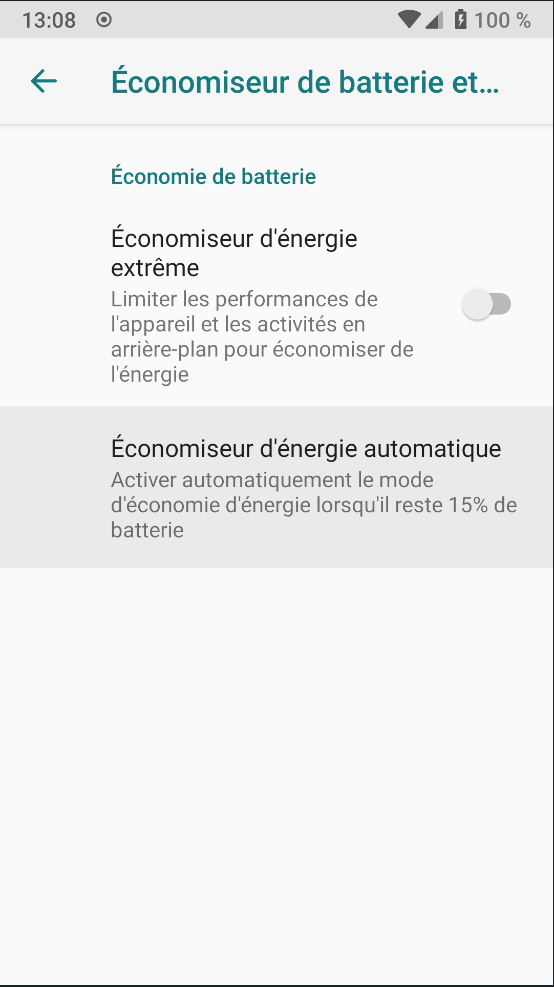{:width="150"}  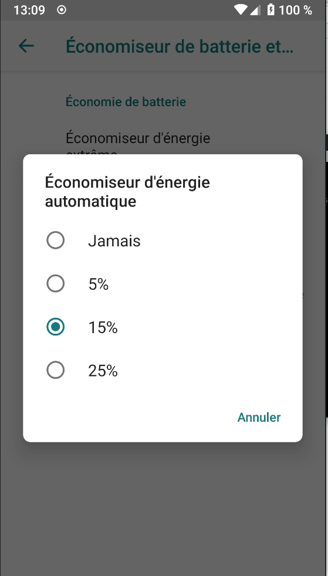{:width="150"}  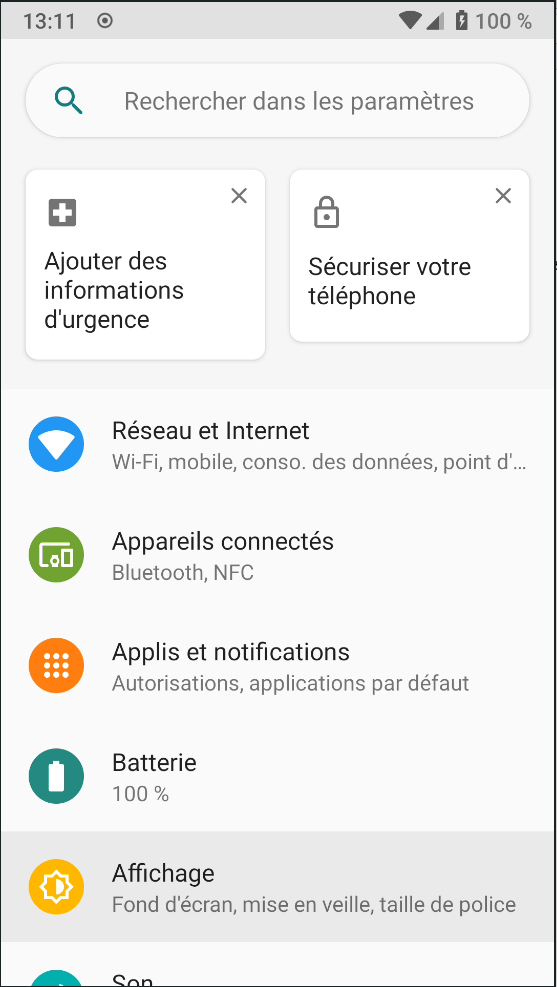{:width="150"}  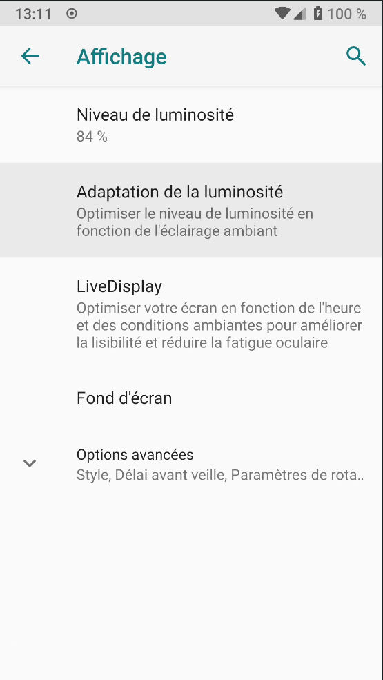{:width="150"}  
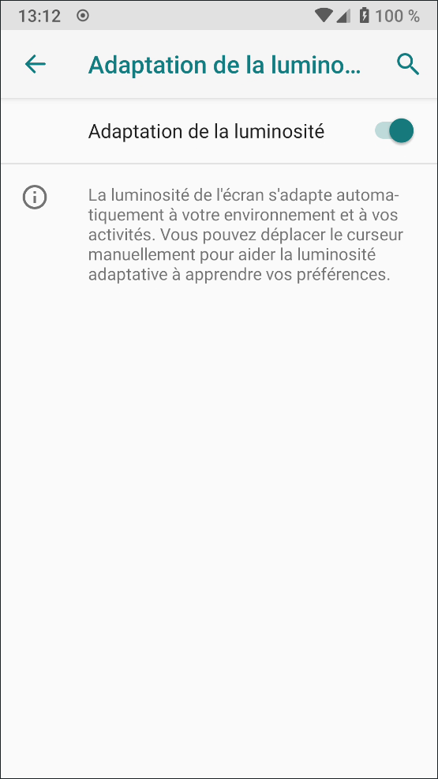{:width="150"}  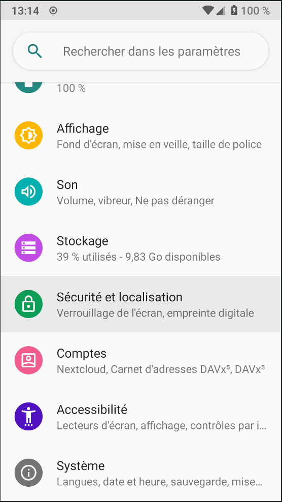{:width="150"}  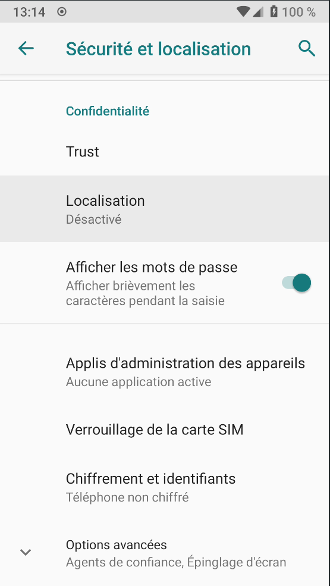{:width="150"}  
