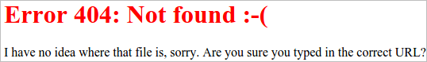

+++
title = 'Nginx personnalisation des pages d'erreur'
date = 2019-12-21 00:00:00 +0100
categories = nginx
+++
## Configurer Nginx pour utiliser des pages d'erreur personnalisées


### Introduction

Nginx est un serveur Web haute performance capable de servir du contenu avec flexibilité et puissance. Lors de la conception de vos pages Web, il est souvent utile de personnaliser chaque élément de contenu que vos utilisateurs verront. Cela inclut les pages d'erreur pour quand ils demandent du contenu qui n'est pas disponible. 

### Création de vos pages d'erreur personnalisées

Nous mettrons nos pages d'erreur personnalisées dans le **/usr/share/nginx/html** où Nginx définit sa racine de document par défaut. Nous créerons une page pour les erreurs 404 appelée **custom_404.html** et une autre pour les erreurs générales de niveau 500 appelée **custom_50x.html**  
Vous pouvez utiliser les lignes suivantes si vous ne faites que tester. Sinon, mettez votre propre contenu dans ces emplacements:

```
echo "<h1 style='color:red'>Error 404: Not found :-(</h1>" | sudo tee /usr/share/nginx/html/custom_404.html
echo "<p>I have no idea where that file is, sorry.  Are you sure you typed in the correct URL?</p>" | sudo tee -a /usr/share/nginx/html/custom_404.html
echo "<h1>Oops! Something went wrong...</h1>" | sudo tee /usr/share/nginx/html/custom_50x.html
echo "<p>We seem to be having some technical difficulties. Hang tight.</p>" | sudo tee -a /usr/share/nginx/html/custom_50x.html
```

Nous avons maintenant deux pages d'erreur personnalisées que nous pouvons diffuser lorsque les demandes des clients entraînent des erreurs différentes.

### Configuration de Nginx pour utiliser vos pages d'erreur

Maintenant, nous devons simplement dire à Nginx qu'il devrait utiliser ces pages chaque fois que les conditions d'erreur correctes se produisent. Ouvrez le fichier de blocage du serveur dans le répertoire /etc/nginx/sites-enabled que vous souhaitez configurer. Nous utiliserons le fichier de blocage de serveur par default appelé default , mais vous devez ajuster vos propres blocs de serveur si vous utilisez un fichier non par défaut:

    sudo nano /etc/nginx/sites-enabled/default

Nous pouvons maintenant pointer Nginx vers nos pages d'erreur personnalisées.

### Diriger les erreurs 404 vers la page 404 personnalisée

Utilisez la directive error_page pour que lorsqu'une erreur 404 se produit (lorsqu'un fichier demandé n'est pas trouvé), la page personnalisée que vous avez créée soit servie. Nous allons créer un bloc d'emplacement pour le fichier, où nous pouvons nous assurer que la racine correspond à l'emplacement de notre système de fichiers et que le fichier est uniquement accessible via les redirections Nginx internes (non directement demandables par les clients):

    /etc/nginx/sites-enabled/default

```
server {
        listen 80 default_server;
        listen [::]:80 default_server ipv6only=on;

        . . .

        error_page 404 /custom_404.html;
        location = /custom_404.html {
                root /usr/share/nginx/html;
                internal;
        }
}
```


Habituellement, nous n'aurions pas à définir la root dans le nouveau bloc d'emplacement car elle correspond à la racine dans le bloc serveur. Cependant, nous sommes explicites ici afin que nos pages d'erreur soient servies même si nous déplaçons notre contenu Web normal et la racine du document associé vers un emplacement différent.

### Diriger les erreurs de niveau 500 vers la page 50x personnalisée

Ensuite, nous pouvons ajouter les directives pour nous assurer que lorsque Nginx rencontre des erreurs de niveau 500 (problèmes liés au serveur), il servira l'autre page personnalisée que nous avons créée. Cela suivra exactement la même formule que nous avons utilisée dans la dernière section. Cette fois, nous avons défini plusieurs erreurs de niveau 500 pour utiliser toutes la page custom_50x.html :

    /etc/nginx/sites-enabled/default

```
server {
        listen 80 default_server;
        listen [::]:80 default_server ipv6only=on;

        . . .

        error_page 404 /custom_404.html;
        location = /custom_404.html {
                root /usr/share/nginx/html;
                internal;
        }

        error_page 500 502 503 504 /custom_50x.html;
        location = /custom_50x.html {
                root /usr/share/nginx/html;
                internal;
        }

        location /testing {
                fastcgi_pass unix:/does/not/exist;
        }
}
```

En bas, nous avons également ajouté une passe fictive FastCGI afin que nous puissions tester notre page d'erreur de niveau 500 . Cela ne fonctionnera pas correctement car le backend n'existe pas. Demander une page ici nous permettra de tester que les erreurs de niveau 500 servent notre page personnalisée.

Enregistrez et fermez le fichier lorsque vous avez terminé.

### Redémarrer Nginx et tester vos pages

Testez la syntaxe de votre fichier de configuration en tapant:

      sudo nginx -t

Si des erreurs ont été signalées, corrigez-les avant de continuer. Lorsqu'aucune erreur de syntaxe n'est renvoyée, redémarrez Nginx en tapant:

      sudo service nginx restart

Maintenant, lorsque vous allez sur le domaine ou l'adresse IP de votre serveur et demandez un fichier inexistant, vous devriez voir la page 404 que nous avons configurée:

    http://server_domain_or_IP/thiswillerror 



Lorsque vous vous rendrez à l'emplacement que nous avons configuré pour le pass FastCGI, nous recevrons une erreur 502 Bad Gateway avec notre page personnalisée de niveau 500:

    http://server_domain_or_IP/testing


Vous pouvez maintenant revenir en arrière et supprimer le faux emplacement de passe FastCGI de votre configuration Nginx.

### Conclusion

Vous devez maintenant diffuser des pages d'erreur personnalisées pour votre site. Il s'agit d'un moyen simple de personnaliser l'expérience de vos utilisateurs même lorsqu'ils rencontrent des problèmes. Une suggestion pour ces pages est d'inclure des liens vers des endroits où ils peuvent aller pour obtenir de l'aide ou plus d'informations. Si vous procédez ainsi, assurez-vous que les destinations des liens sont accessibles même lorsque les erreurs associées se produisent. 

