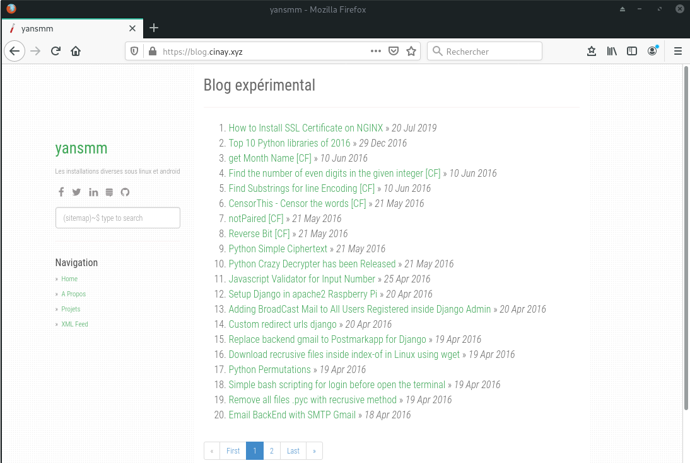
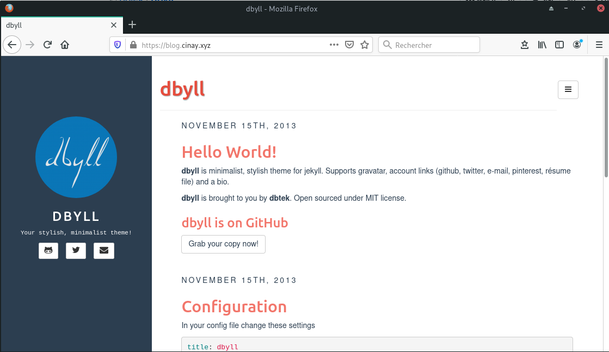

+++
title = 'Blog statique de type jekyll sur site cinay.xyz'
date = 2019-12-26 00:00:00 +0100
categories = ['yunohost']
+++
## Blog statique de type jekyll

> CLONER un [thème de blog jekyll](https://jekyllthemes.io/jekyll-blog-themes) dans "basicblog"

Les droits sur le dossier

    sudo chown   $USER. -R /srv/basicblog

Lancement “bundle” dans le dossier /srv/basicblog

    cd /srv/basicblog
    bundle install

En cas d'erreur **"Following files may not be writable ..."**

```
Using concurrent-ruby 1.1.5
Following files may not be writable, so sudo is needed:
  /usr/local/bin
  /var/lib/gems/2.3.0
  /var/lib/gems/2.3.0/build_info
  /var/lib/gems/2.3.0/cache
  /var/lib/gems/2.3.0/doc
  /var/lib/gems/2.3.0/extensions
  /var/lib/gems/2.3.0/gems
  /var/lib/gems/2.3.0/specifications
```

En cas d'erreur, il faut modifier les droits

    sudo chown root.staff -R /var/lib/gems/2.3.0/
    sudo chmod 775 -R /var/lib/gems/2.3.0/
    sudo usermod -a -G staff $USER

**Créer service basicblog**  
Le script **/srv/start_basicblog.sh** contenu dans le service

```
#!/bin/sh
#lancement basicblog
cd /srv/basicblog/
# Attente et construction
/usr/local/bin/bundle exec jekyll build --watch
```

Droits sur le bash

```
sudo chown $USER. /srv/start_basicblog.sh
chmod +x /srv/start_basicblog.sh
```

>Pour lancer le serveur **basicblog** au démarrage, utilisation d'un <u>service systemd</u>  
**ATTENTION!** , remplacer *User=utilisateur* par votre nom d'utilisateur (**echo $USER**)

Création d'un service basicblog sous systemd

    sudo nano /etc/systemd/system/basicblog.service

Contenu du fichier

```ini
[Unit]
Description=basicblog Service
After=network.target

[Service]
Type=simple
User=debadm
ExecStart=/bin/sh /srv/start_basicblog.sh
Restart=on-abort


[Install]
WantedBy=multi-user.target
```

Lancer le service  **basicblog** :

    sudo systemctl daemon-reload
    sudo systemctl start basicblog
    # Valider le lancement du service basicblog au démarrage
    sudo systemctl enable basicblog
    #Vérifier
    sudo systemctl status basicblog

>basicblog génére un dossier statique **/srv/basicblog/_site** 

Pour un accès via le lien <https://blog.cinay.xyz>, il faut modifier le dossier "root" du site pour qu'il pointe sur **/srv/basicblog/_site**   
Le dossier "root" actuel est /var/www/webapp_yannick/blog.cinay.xyz_/  
On le déplace `sudo mv /var/www/webapp_yannick/blog.cinay.xyz_/ . ` ou efface : `sudo rm -r /var/www/webapp_yannick/blog.cinay.xyz_/`  

Créer le lien avec le dossier **/srv/basicblog/_site** du site statique

    sudo ln -s /srv/basicblog/_site /var/www/webapp_yannick/blog.cinay.xyz_

{:width="400px"}  
Accès site statique <https://blog.cinay.xyz>


**Changer de thème**  
Les différents thèmes jekyll qui seront testés doivent respecter la procédure suivante

1. Si un thème présent, il faut le supprimer ou le sauvegarder  
`sudo rm -r /srv/basicblog` ou `sudo mv /srv/basicblog .`
* Les thèmes seront "clonés" en /srv/basicblog  
ex: `git clone https://github.com/dbtek/dbyll.git /srv/basicblog`
* Aller au dossier : `cd /srv/basicblog`
* Effacer le .lock : `rm Gemfile.lock`
* Installer : `bundle install`
* Redémarrer le service `sudo systemctl restart basicblog`

{:width="400px"}  
Tester le nouveau thème <https://blog.cinay.xyz>


## Personalisation thème, style et plugins

### favicon 

Image dans le répertoire "images"  
Définir une constante pour le fichier image `favicon_ico: ym01.png` dans le fichier **_config.yml**  
Modifier le fichier **_includes/default.html**  

```html
<link rel="icon" type="image/png" href="{{ site.BASE_PATH }}/images/{{ site.favicon_ico }}">
```

### jekyll-toc 

[jekyll-toc](https://github.com/toshimaru/jekyll-toc) : Un plugin de filtrage pour **Jekyll** qui génère une table des matières.  

**Installation**  

Ajouter le plugin jekyll-toc dans le **Gemfile** de votre site.  

```ruby
gem install jekyll-toc
```

Ajouter la ligne suivante au fichier **Gemfile**:  
`gem 'jekyll-toc'`  

Et ajouter le jekyll-toc au fichier **_config.yml** de votre site.

```yml
plugins:
  - jekyll-toc
```

toc: true` dans vos publications (posts).

```yml
---
layout: article
title: "Welcome to Jekyll!"
toc: true
---
```

Ajouter en fin du fichier **assets/css/style.css**


```css
.section-nav {
  background-color: #FFF;
  margin: 5px 0;
  padding: 10px 30px;
  border-radius: 3px;
}

.toc-entry.toc-h1 { list-style-type: none;}
.toc-entry.toc-h2 { padding-left: 15px; list-style-type: none;}
.toc-entry.toc-h3 { padding-left: 30px; list-style-type: none;}
.toc-entry.toc-h4 { padding-left: 45px; list-style-type: none;}
.toc-entry.toc-h5 { padding-left: 60px; list-style-type: none;}
.toc-entry.toc-h6 { padding-left: 75px; list-style-type: none;}
```

Actualiser l'installation

    bundle update

**Usage**  

Il y a trois filtres **liquid** disponibles aujourd'hui, qui devraient tous être appliqué à un contenu HTML, par exemple le contenu de la variable **liquid** disponible dans les modèles de Jekyll.


**Utilisation de base (PAR DEFAUT)**

**filtre toc**  


Remplacer  {{ content }}  par {{ content \| toc }} dans le fichier **_includes/post.html**  


Ce filtre met la table des matières directement au-dessus du contenu.  

Modifier la ligne 42 dans le fichier **_includes/post.html**  

```html

...
          <div class="article_body">
          <!-- {{ content | toc }} -->
          </div>

...
```

Relancer le service

    sudo systemctl restart basicblog


**Utilisation avancée**

Si vous souhaitez séparer le TOC et son contenu, vous pouvez utiliser les filtres `toc_only` et `inject_anchors` .  

**filtre **`toc_only`

Génère le TOC lui-même comme décrit ci-dessous. Surtout utile dans les cas où la table des matières ne doit pas être placée immédiatement au-dessus du contenu, mais à un autre endroit de la page, à savoir un côté.

**filtre** `inject_anchors`  

Injecte les "ancres" HTML dans le contenu sans réellement créer la table des matières elle-même. Ils sont de la forme:  

``` html
<a id="heading11" class="anchor" href="#heading1-1" aria-hidden="true">
  <span class="octicon octicon-link"></span>
</a>
```

Ceci est seulement utile lorsque le TOC lui-même doit être placé à un autre endroit avec le filtre `toc_only`.

### Ajout d'un champ date de modification

Champ date de modification , ajouter la ligne suivante au fichier **Gemfile**

    gem 'jekyll-last-modified-at'

Mise à jour 

    bundle update

Coder en dur `last_modified_at` sur chaque billet



```
---
layout:             post
title:              "An awesome blog post"
date:   2019-03-25 8:30:00 +0000 00:00:00 +0100
last_modified_at: 2019-12-26
---
```



Je veux seulement spécifier `last_modified_at` si le post est en cours de mise à jour. Lorsque j'écris un nouveau message, je laisse ce champ vide. Afin de faire ce travail, j'ai ajouté une logique conditionnelle au modèle de publication.

Avec cette disposition en place, j'ai ajouté la logique conditionnelle:



```
{%- assign date_format = site.minima.date_format | default: '%b %-d, %Y' -%}




```



Si la publication a une date `last_modified_at` elle sera affichée, sinon elle affichera la date de publication d'origine.

Dans mon cas, je veux afficher la date last_modified_at en haut du post et avoir également la date de publication d'origine en bas. De cette façon, les lecteurs savent si le message a été mis à jour récemment et aussi la date de sa publication initiale. Mon fichier de disposition de publication ressemble à ceci:



```
---
layout: default
---
<article class="post h-entry" itemscope itemtype="http://schema.org/BlogPosting">

  <header class="post-header">
    <h1 class="post-title p-name" itemprop="name headline">{{ page.title | escape }}</h1>
    <p class="post-meta">
      <time class="dt-published" datetime="{{ page.date | date_to_xmlschema }}" itemprop="datePublished">
        {%- assign date_format = site.minima.date_format | default: '%b %-d, %Y' -%}

        
        
        
      </time>
      
        • <span itemprop="author" itemscope itemtype="http://schema.org/Person"><span class="p-author h-card" itemprop="name">{{ page.author | escape }}</span></span>
      
  </header>

  <div class="post-content e-content" itemprop="articleBody">
    {{ content }}
  </div>

  <p class="post-meta">
    <time class="dt-published" datetime="{{ page.date | date_to_xmlschema }}" itemprop="datePublished">
      </time>
  </p>

  
    
  

  <a class="u-url" href="{{ page.url | relative_url }}" hidden></a>
</article>
```



### Ajoutez Syntax Highlighting à votre site Jekyll avec Rouge

* [Add Syntax Highlighting to your Jekyll site with Rouge](https://bnhr.xyz/2017/03/25/add-syntax-highlighting-to-your-jekyll-site-with-rouge.html)

La mise en évidence de la syntaxe est importante (en particulier pour la programmation de blogs) car elle améliore la lisibilité des articles. Il permet aux lecteurs de localiser rapidement les extraits de code (qui sont généralement la raison pour laquelle les gens visitent votre page en premier lieu) dont ils ont besoin.

Rouge est un surligneur de syntaxe pur rubis et a été le surligneur par défaut pour Jekyll depuis Jekyll 3 (en remplacement des pygments). Vous pouvez ajouter la syntaxe highlihting en utilisant rouge à votre site Jekyll en quelques étapes seulement.

1 - Installez les gemmes kramdown et rouge  
Assurez-vous que les gemmes kramdown et rouge sont installées.  

    gem install kramdown rouge 

2 - Modifiez vos paramètres **_config.yml**   
Ajoutez les lignes suivantes à votre fichier _config.yml si elles ne s'y trouvent pas déjà.

```
markdown: kramdown

kramdown:
  input: GFM
  syntax_highlighter: rouge
```

Si cela ne fonctionne pas, vous pouvez essayer:

```
markdown: kramdown
highlighter: rouge
```

Par expérience, mes temps de génération lors de l'utilisation de la première option sont généralement plus rapides.

3 - Créez un fichier css pour le style de surbrillance que vous souhaitez

Rouge est intégré à **rougify** , un outil en ligne de commande qui convertit un thème de style en fichier css.

Vous pouvez voir les thèmes disponibles en entrant:

    rougify help style 

Depuis rouge 1.11.1, les thèmes disponibles sont:  
*base16, base16.dark, base16.monokai, base16.monokai.light, base16.solarized, base16.solarized.dark, coloré, github, gruvbox, gruvbox.light, molokai, monokai, monokai.sublime, thankful_eyes*

Par exemple, si vous souhaitez utiliser le thème **monokai**, vous devez d'abord créer un fichier css dans votre dossier css à l'aide de rougify:

    rougify style monokai > /path/to/css/file.css

Le répertoire habituel pour les fichiers css est assets / css tandis que le nom habituel pour le fichier css est syntax.css donc à partir de votre racine, vous pouvez taper:

    rougify style monokai > assets/css/syntax.css

N'oubliez pas ensuite d'inclure la feuille de style dans votre modèle HTML (généralement dans `<head> </head>`):

`<link href= "path-to-syntax-highlighter-stylesheet" rel= "stylesheet" >`

Si vous avez enregistré la feuille de style du surligneur de syntaxe en tant que **assets/css/syntax.css**, vous pouvez ajouter les éléments suivants dans votre modèle HTML nommé **_include/default.html**:

`<link href= "/assets/css/syntax.css" rel= "stylesheet" >`  
ou  
`<link href="{{ site.BASE_PATH }}/assets/css/syntax.css" rel="stylesheet">`

4 - Ajoutez une coloration syntaxique à vos articles

Si vous utilisez **markdown** pour créer vos publications, vous pouvez ajouter une coloration syntaxique en joignant l'extrait de code précédé er suivi de **trois backticks (` ``` `)**.  
De plus, vous pouvez définir la langue de l'extrait de code après les trois backticks d'ouverture.

Par exemple, si vous souhaitez mettre en évidence du code python

```python
def function():
  print('Yes')
```

Vous pouvez vérifier les langues prises en charge en entrant:

    rougify list 

5 - Que faire si je veux afficher (` ``` `) dans mes blocs de code?

Disons que vous voulez afficher ` ``` ` dans votre bloc de code  
Ce que vous devez faire est de mettre en retrait le ` ``` ` dans votre fichier markdown d'au moins 4 espaces.

The line below is indented by at least 4 spaces.

    ```python
    def function():
      print('Yes')
    ```

6. Comment puis-je faire fonctionner des blocs de code ou des extraits de code dans les listes GFM (Github Flavored Markdown)?

Les blocs de code peuvent parfois casser des listes ordonnées (c'est-à-dire que la liste revient toujours à 1). Pour éviter cela, vous pouvez procéder comme suit.

si vous ajoutez un saut de ligne après l'élément de campagne, faites en sorte que le bloc de code soit en retrait d'au moins 4 espaces de l'élément de campagne.

    1. Number 1

        ```python
        print("Hello World")
        ```

    2. Number 2

        ```ruby
        puts 'Hello World'
        ```

    3. Number 3

        ```c
        printf("Hello World");
        ```


ce qui donne:

    Numéro 1

     print ( "Hello World" ) 

    Numéro 2

     puts 'Hello World' 

    Numéro 3

     printf ( "Hello World" ); 

### Position des éléments "barre latéral gauche"

Contenu de la barre latérale alligné vers le haut (1% au lieu de 10%)  
Directive `.sidebar` , l'attribut `padding-top: 10%;` passe à `padding-top: 1%;` dans le fichier **assets/css/style.css**  

### Largeur des colonnes

Modifier la largeur en respectant la proportionnalité , fichier **_includes/default.html** dans les lignes suivantes  


```html

...
	<div class="col-sm-2 sidebar hidden-xs" style="background: url({{site.sidebar_background_image}}) no-repeat center center !important;">
		
	</div>

	<div class="col-sm-10 col-sm-offset-2"> 
...

```

### Haut de page (sur écran en bas à droite)

Dans le fichier **_includes/default.html**  insérer les lignes suivantes avant `<div class="col-sm-2 sidebar hidden-xs" ` de la modification précédente   

```html

...
   <!-- nav-menu-haut -->
   <div id="nav-haut-page">
   	<a href="#" title="Haut de Page"><i class="fa fa-arrow-circle-up fa-2x"></i></a>
   </div>
...

```

### Modifications autres

Fichier **tags.html**  
Ligne 4 -> **title: Etiquettes**  
Ligne 29 -> **Billets étiquettés**   

Fichier **_includes/default.html**  
Ligne 73 et 87 -> **Etiquettes**  remplace Mots clés

Fichier **categories.html**  
Ligne 3 -> **Catégories**  

## Recherche rapide avec fichier json  et lunr.js

<u>Actuellement</u> , à chaque recherche, il est généré des données indexées au format json qui représentent le contenu du site.Suivant le volume des données ,la durée de la génération peut être assez longue...   

### Fichier basicblog.json

Pour rendre la recherche plus rapide , il faut utiliser un fichier json qui sera construit à chaque compilation.  
Créez un fichier **/basicblog.json** à la racine de votre site Jekyll **/srv/basicblog/**, et remplissez-le avec ce qui suit:


```
---
layout: null
---
[

 
  

    {
      "id": {{count}},
      "title": {{ post.title | jsonify }},
      "url":  {{ post.url | jsonify }},
      "tags": "{{ tag }}, ",
      "categories": "{{ category }}, ",
      "content"	 : {{post.content | strip_html | truncatewords: 20 | jsonify }}
    }
    ,
   
  
]

```


Chaque fois que vous exécutez le processus de compilation de Jekyll, Jekyll utilisera **/basicblog.json** pour déterminer où chercher et ce qu'il faut saisir et il génèrera un fichier **_site/basicblog.json**.


### Analyse json via lunr

Chargement et indexation du fichier pour la recherche , fichier javascript **searchplus.js** dans le dossier **js/**

```js
$(document).ready(function () {
var idx ;
var nbart = 0;
var fichier_json = 'basicblog.json';

//http://www.pureexample.com/jquery/get-json.html
function executerRequete(callback) {
   if (nbart === 0) {
        /* set no cache */
        $.ajaxSetup({ cache: false });

			  idx = lunr(function () {
			    this.field('id');
			    this.field('title');
             this.field('content', { boost: 10 });
			    this.field('url');
			    this.field('date');
			    this.field('modif');
			  });

           var html = [];

	  // Get the generated search_data.json file so lunr.js can search it locally.
	  datas = $.getJSON(fichier_json);
	  // Wait for the data to load and add it to lunr
	  datas.then(function(loaded_data){
		    $.each(loaded_data, function(index, d){
		             idx.add({
						    id: index,
						    title: d.title,
						    content: d.content,
						    url: d.url,
						    date: d.modif
						  });
						  nbart=nbart + 1;
						/*	//stockage item du fichier	
		                html.push("Titre : ", d.title, ", ",
		                          "URL : ", d.url, ", ", 
		                          "Catégorie : ", d.categories, "<br>");
		               // fin */
		    });
 				
  			  /* // affichage des items
            $("#div381").html(html.join('')).css("background-color", "orange");
            */
            // on lance la fonction de callback, le json est chargé et indexé pour la recherche
            callback();

        });
        $.error(function(jqXHR, textStatus, errorThrown){ /* assign handler */
            /* alert(jqXHR.responseText) */
            alert("error occurred!");
        });
    } else {
        // on lance la fonction de callback avec le json déjà récupéré précédemment
        callback();
    }
 }

 $('input#search').focus();
  
	  // Event when the key
	  $('input#search').on('keyup', function () {
	      //event.preventDefault();
	      //var query = $("input#search").val(); // Get the value for the text field
	      var query = $(this).val();
	      var results = idx.search(query); // Get lunr to perform a search
	      display_search_results(results); // Hand the results off to be displayed
	  });

	  /*  fonction affichage des résultats   */
	  function display_search_results(results) {
	    var $search_results = $("#results");
	    // Wait for data to load
	    datas.then(function(loaded_data) {
	
	      // Are there any results?
	      if (results.length) {
	        $search_results.empty(); // Clear any old results
	
	        // Itération sur les résultats
	        results.forEach(function(result) {
	          var item = loaded_data[result.ref];

	          // Création d'une chaîne HTML pour ce résultat
            if (item.modif == null) {
                var datemodif='';  // date de modification identique à la date de création du post , on ajoute rien
            } else {
                var datemodif='<span class="badge" style="background-color: #FF8C00;"><small>Modifié le '+item.modif+'</small></span>'; // ajout date de modification
            }
	          //var appendString = '';
		      var appendString = '<div class="result"><div class="result-body"><a href="'+item.url+'" class="post-title">'+item.title+'</a>&nbsp;<span class="badge" style="background-color: #32CD32;"><small>'+item.date+'&nbsp;</small></span>'+datemodif+'<p>'+item.content+'</p></div>'
	          // Add the snippet to the collection of results.
	          $search_results.append(appendString);
	        });
	      } else {
	        // Si aucun résultat dans la recherche ,on efface les résultats précédents 
	        $search_results.html('');
	      }

	      
	    });
	  }
  function lecture() {
    //$("#nombre").html(nbart);
  }

 // on initialise la lecture au premier élément
 executerRequete(lecture);
   
});

```

### Ajouter le formulaire de recherche

Modifier le fichier **_includes/default.html** pour y inclure les 2 fichiers javascript lunr.min.js et searchplus.js sous js/

```html
   <script src="{{ site.BASE_PATH }}/js/lunr.min.js"></script>
   <script src="{{ site.BASE_PATH }}/js/searchplus.js"></script>
```


Le formulaire de recherche dans le fichier **_includes/page.html**

```html
<div class="page-header"> 
  <!-- <span>{{ page.title }}  <small>{{ page.tagline }}</small></span> -->
	<div class="form-group">
		<input placeholder="Rechercher" type="search" id="search" class="form-control input-lg">
	</div>
	<div class="btn-group hidden-xs" id="nav-menu">
		<button type="button" class="btn btn-default dropdown-toggle" data-toggle="dropdown">
			<i class="fa fa-bars"></i>
		</button>
		<ul class="dropdown-menu" role="menu">
			<li><a href="{{ site.BASE_PATH}}/"><i class="fa fa-home"></i>Accueil</a></li>
			<li><a href="{{ site.BASE_PATH}}/{{ site.categories_path }}"><i class="fa fa-folder"></i>Catégories</a></li>
			<li><a href="{{ site.BASE_PATH}}/{{ site.tags_path }}"><i class="fa fa-tags"></i>Balises</a></li>
			<li class="divider"></li>
			<li><a href="#"><i class="fa fa-arrow-up"></i>Haut de la Page</a></li>
		</ul>
	</div>
	<div id="results" class="all-posts results"></div>  
  
</div>

{{ content }}
```

**search.html** situé sous la racine **/srv/basicblog/** du site statique dans le dossier **_layouts**

```html
---
layout: default
---
<div class="search">
	{{ content }}
</div>
```

### Autre solution de recherche

Recherche avec "Simple-Jekyll-Search"

* <https://christianfei.com/posts/Use-Simple-Jekyll-Search-on-your-blog-in-these-easy-steps/>
* <https://github.com/christian-fei/Simple-Jekyll-Search>
