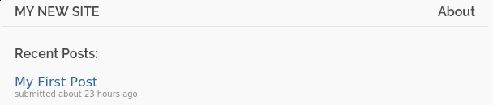
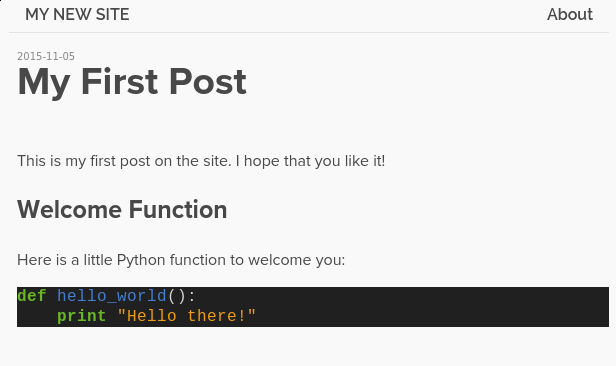
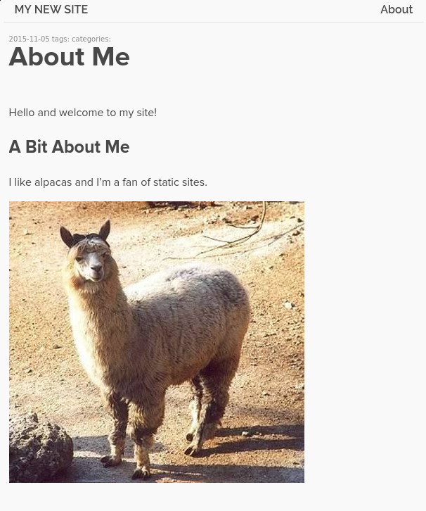

+++
title = 'Hugo(generateur-de-site-statique)-Installation-Utilisation-sur-Archlinux/Debian'
date = 2020-05-27 00:00:00 +0100
categories = []
+++
## Hugo archlinux

Installation : `yay -S hugo`

Créer un projet **/home/yannick/media/devel/ouestline/go/hugo-m10c**

    hugo new site hugo-m10c

```
Congratulations! Your new Hugo site is created in /home/yannick/media/devel/ouestline/go/hugo-m10c

Just a few more steps and you're ready to go:

1. Download a theme into the same-named folder.
   Choose a theme from https://themes.gohugo.io/ or
   create your own with the "hugo new theme <THEMENAME>" command.
2. Perhaps you want to add some content. You can add single files
   with "hugo new <SECTIONNAME>/<FILENAME>.<FORMAT>".
3. Start the built-in live server via "hugo server".

```

Thème [m10c](https://themes.gohugo.io/hugo-theme-m10c/)

    cd hugo-m10c
    git clone https://github.com/vaga/hugo-theme-m10c.git themes/m10c

Ajouter la ligne suivante au fichier **config.toml**

    theme = "m10c"

Transformer les .md jekyll vers hugo (/home/yannick/media/devel/ouestline/go/hugo-posts/)

```
cd /home/yannick/media/devel/ouestline/go/hugo-posts/
find . -name '*.md' -type f -exec sed -i '/layout\:/d' {} \;
find . -name '*.md' -type f -exec sed -i '/toc\:/d' {} \;
find . -name '*.md' -type f -exec sed -i '/ref\:/d' {} \;
find . -name '*.md' -type f -exec sed -i '/date\:/d' {} \;
find . -name '*.md' -type f -exec sed -i '/categories\:/d' {} \;
find . -name '*.md' -type f -exec sed -i '/lang\:/d' {} \;
find . -name '*.md' -type f -exec sed -i '/description\:/d' {} \;
find . -name '*.md' -type f -exec sed -i '/private\:/d' {} \;

find . -name '*.md' -type f -exec sed -i 's/last_modified_at\:/date\=/g' {} \;
date: 00:00:00 +0100
last_modified_at: 2020-05-27
find . -name '*.md' -type f -exec sed -i 's/last_modified_at \:/date\=/g' {} \;

find . -name '*.md' -type f -exec sed -i 's/title\:/title\=/g' {} \;
find . -name '*.md' -type f -exec sed -i 's/tags\:/tags\=/g' {} \;

find . -name '*.md' -type f -exec sed -i '1,5 s/---/+++/g' {} \;

find . -name '*.md' -type f -exec sed -i '4 s/\[/\[\"/g' {} \;
find . -name '*.md' -type f -exec sed -i '4 s/\]/\"\]/g' {} \;
find . -name '*.md' -type f -exec sed -i '4 s/\,/\"\,\"/g' {} \;

find . -name '*.md' -type f -exec sed -i '2,4 s/^[ \t]*//;s/[ \t]*$//' {} \;

find . -name '*.md' -type f -exec sed -i '2,3 s/$/\"/' {} \;
find . -name '*.md' -type f -exec sed -i '2,3 s/= / = \"/g' {} \;
find . -name '*.md' -type f -exec sed -i '2 s/\" /\"/g' {} \;

# Adaptation nouveau format pur jekyll "minimal-mistakes"

find . -name '*.md' -type f -exec sed -i '/layout\:/d' {} \;
find . -name '*.md' -type f -exec sed -i '/date\:/d' {} \;
find . -name '*.md' -type f -exec sed -i '/private\:/d' {} \;

find . -name '*.md' -type f -exec sed -i '/ref\:/d' {} \;
find . -name '*.md' -type f -exec sed -i '/description\:/d' {} \;
find . -name '*.md' -type f -exec sed -i '/lang\:/d' {} \;

find . -name '*.md' -type f -exec sed -i '1,7 s/\]//g' {} \;
find . -name '*.md' -type f -exec sed -i '1,7 s/\[/\r\ \ \-\ /g' {} \;
find . -name '*.md' -type f -exec sed -i '4,10 s/\,/\r\ \ \-\ /g' {} \;


find . -name '*.md' -type f -exec sed -i '/^\ \ \-/s/\,/\r\ \ \-\ /' {} \;


find . -name '*.md' -type f -exec sed '/^start_string/s/search_string/replace_string/'
find . -name '*.md' -type f -exec sed -i '/^\ \ \-/s/\,/\r\ \ \-\ /' {} \;

---
title:  OpenPGP card, une application cryptographique pour carte à puce  
toc: true
ref:   
date: 2014-08-21 00:00:00 +0100
last_modified_at: 2020-05-27
tags: [chiffrement]  
lang: fr  
description: Chiffrement , gpg  
---


```

## Comment installer et utiliser Hugo, un générateur de site statique, sur Debian

### Introduction

*Hugo est un générateur de site statique rapide et facile à utiliser écrit en Go et disponible sur plusieurs plates-formes. Les générateurs de sites statiques sont un excellent choix pour les blogs et autres contenus qui ne nécessitent pas de contenu dynamique extrait d'une base de données.*

Dans ce guide, nous verrons comment installer et utiliser Hugo sur un serveur Debian. Cela nous permettra de configurer un site statique, de créer du contenu et de publier sur le même serveur ou de le déployer sur un site de production.

### Conditions préalables

Pour suivre ce guide, vous aurez besoin d'accéder à un serveur Debian. Sur ce serveur, vous devrez avoir un <u>utilisateur non root</u> avec des privilèges `sudo` configuré afin d'effectuer des tâches administratives. 

### Installation de la dernière version de Hugo

Hugo n'est pas disponible dans les référentiels par défaut de Debian. Cependant, des packages sont disponibles sur GitHub pour diverses architectures et distributions.  
Serveur Debian stretch 64bits  

Visitez la [page des versions de Hugo](https://github.com/spf13/hugo/releases) pour trouver la dernière version stable de Hugo (celle la plus proche du sommet).  
**hugo_0.61.0_Linux-64bit.deb**  au 22/12/2019  
Ensuite, nous devons copier l'emplacement du lien pour le package d'installation approprié.  
<https://github.com/gohugoio/hugo/releases/download/v0.61.0/hugo_0.61.0_Linux-64bit.deb>

Sur votre serveur, connecté en tant qu'utilisateur avec des privilèges sudo , accédez à un répertoire dans lequel vous disposez d'une autorisation d'écriture.   
Utilisez la commande wget et collez l'emplacement du lien que vous avez copié pour télécharger Hugo:

    cd ~
    wget https://github.com/gohugoio/hugo/releases/download/v0.61.0/hugo_0.61.0_Linux-64bit.deb

Maintenant, vous pouvez installer le package avec dpkg en tapant:

    sudo dpkg -i hugo*.deb

Testez que l'installation a réussi en demandant à Hugo d'imprimer sa version logicielle:

    hugo version

Hugo devrait imprimer sa version actuelle du logiciel:

Hugo Static Site Generator v0.14 BuildDate: 2015-05-25T21: 29: 16-04: 00

### Installation du logiciel de prise en charge de Hugo

L'application Hugo principale devrait maintenant être installée. Cependant, il existe quelques logiciels supplémentaires que nous devons installer pour nous aider à être opérationnel.

#### Installer les thèmes Hugo

Le package Hugo principal ne comprend aucun thème. Les thèmes Hugo définissent la façon dont le contenu du site est rendu aux utilisateurs. Le moyen le plus simple d'obtenir des thèmes Hugo est de cloner le référentiel git thèmes Hugo, qui fournit de nombreux thèmes préconfigurés. Nous devrons installer git pour ce processus.

Nous pouvons trouver git dans les référentiels par défaut de Debian. Mettez à jour l'index du package local, puis installez git en tapant:

    sudo apt-get update
    sudo apt-get install git

Ensuite, nous pouvons cloner le référentiel de thèmes Hugo. Le référentiel sur GitHub est organisé avec chaque thème individuel inclus en tant que sous-module.

Étant donné que les sous-modules compliqueraient considérablement le contrôle de version du contenu réel de notre site, nous allons en fait simplement cloner les thèmes dans notre répertoire personnel. Nous pouvons ensuite créer un lien symbolique vers les thèmes de notre annuaire de sites. Cela nous permettra également de partager facilement le répertoire des thèmes si nous avons plusieurs sites.

Clonez le référentiel de thèmes dans votre répertoire personnel en tapant:

    git clone --recursive https://github.com/spf13/hugoThemes ~/themes

#### Installer Pygments Syntax Highlighter

Nous installerons également un logiciel Python appelé Pygments. Cela fournit une logique de mise en évidence de la syntaxe côté serveur pour tous les blocs de code qui seraient inclus dans nos pages rendues. Nous pouvons installer Pygments facilement avec pip , le gestionnaire de paquets de Python.

Nous pouvons obtenir pip partir des référentiels par défaut en tapant:

    sudo apt-get install python-pip

Une fois apt terminé, nous pouvons utiliser pip pour installer les Pygments en tapant:

    sudo pip install Pygments

Cela nous permettra d'inclure la syntaxe mise en évidence des blocs de code prenant en charge plus de 300 langues dans notre contenu de publication si nous choisissons. Vous pouvez en savoir plus sur la [page du projet](http://pygments.org/) 

#### Activer la saisie semi-automatique de Hugo Bash

Une dernière chose que nous ferons avant de commencer à travailler sur notre premier site est de générer les fonctions de saisie semi-automatique de Hugo. Nous pouvons le faire en tapant:

    sudo hugo gen autocomplete

Ensuite, nous pouvons trouver la configuration d'achèvement à l'échelle du système afin que notre shell actuel puisse utiliser les fonctions d'auto-complétion sans vous déconnecter ni vous reconnecter:

    . /etc/bash_completion

Maintenant, si vous tapez hugo suivi de quelques pressions sur la touche TAB, vous verrez les commandes que Hugo connaît:

        hugo [TAB][TAB][TAB]

```
Output
benchmark        config           gen  help             new              undraft
check            convert          gendoc           list             server           version
```

### Création de votre premier site

Maintenant que tout est installé, nous pouvons aller de l'avant et créer notre premier site Hugo. Hugo a un générateur qui peut créer un squelette des fichiers et répertoires dont il a besoin pour fonctionner.

Nous pouvons créer un nouveau site dans votre répertoire personnel en tapant:

    hugo new site ~/my-website

Accédez à votre nouveau site Hugo et jetez un œil:

    cd ~/my-website
    ls -F

Vous verrez la structure du répertoire et le fichier de configuration principal utilisé pour construire le site Hugo:

```
archetypes/  config.toml  content/  data/  layouts/  public/  static/
```

Allons de l'avant et lions le répertoire **~/themes** que nous avons cloné dans notre nouveau site. Afin de rendre ce lien plus flexible pour un éventuel déploiement, nous allons créer un lien symbolique relatif. Si vous déployez votre référentiel Hugo sur un serveur distant, vous devrez simplement vous assurer de cloner à nouveau le répertoire des thèmes dans le répertoire parent de Hugo:

    ln -s ../themes .
    ls -l

```
total 28
drwxrwxr-x  2 demouser demouser 4096 Nov  5 11:25 archetypes
-rw-rw-r--  1 demouser demouser  210 Nov  5 11:55 config.toml
drwxrwxr-x  3 demouser demouser 4096 Nov  5 11:38 content
drwxrwxr-x  2 demouser demouser 4096 Nov  5 11:25 data
drwxrwxr-x  2 demouser demouser 4096 Nov  5 11:25 layouts
drwxrwxr-x 13 demouser demouser 4096 Nov  5 11:25 public
drwxrwxr-x  2 demouser demouser 4096 Nov  5 11:25 static
lrwxrwxrwx  1 demouser demouser    9 Nov  5 14:21 themes -> ../themes
```

Comme vous pouvez le voir ci-dessus, le répertoire des thèmes de notre répertoire actuel n'est en fait qu'un lien vers le référentiel de thèmes que nous avons cloné dans notre répertoire personnel.

### Engager votre site dans le contrôle des sources

Avant de configurer nos paramètres et de créer du contenu, nous devons transformer notre nouveau site en un référentiel Git.

Assurez-vous que vous êtes dans le répertoire de votre site et initialisez un nouveau référentiel get en tapant:

    cd ~/my-website
    git init

Initialized empty Git repository in /home/demouser/my-website/.git/

Ensuite, définissez les éléments de configuration de base de git nécessaires pour valider le code dans un référentiel. La façon la plus simple de le faire est `git config --global` . Nous devons définir notre nom et notre adresse e-mail afin que git puisse enregistrer correctement nos informations en tant que committer:

    git config --global user.name "Your Name"
    git config --global user.email "user@email.com"

Par défaut, git ne valide aucun répertoire vide dans le référentiel. Hugo, parfois, exige que ces répertoires soient présents même s'ils ne contiennent aucun contenu. Pour contourner ce .gitkeep , nous pouvons inclure un fichier **.gitkeep** caché dans chacun de ces répertoires vides. Cela suffit à **git** pour valider le répertoire sans affecter les fonctionnalités réelles d'Hugo.

Nous pouvons ajouter un fichier **.gitkeep** caché à chacun de nos répertoires de niveau supérieur (autre que le **.git** caché .git réel) en tapant:

    for DIR in `ls -p | grep /`; do touch ${DIR}.gitkeep; done

Nous pouvons voir qu'un fichier **.gitkeep** caché a été ajouté à tous nos répertoires de niveau supérieur en tapant:

    find . -name .gitkeep

```
./data/.gitkeep
./layouts/.gitkeep
./archetypes/.gitkeep
./static/.gitkeep
./content/.gitkeep
```

Nous voulons également nous assurer que le contenu de notre site rendu n'est pas ajouté au contrôle de code source. Les actifs HTML, JavaScript et CSS réels doivent être générés à chaque déploiement, et non conservés dans le contrôle de code lui-même. Nous pouvons dire à git d'ignorer le répertoire public où le contenu généré serait stocké en ajoutant cet emplacement à un fichier **.gitignore** :

    echo "public" >> .gitignore

Maintenant, nous pouvons valider notre squelette de site propre dans le référentiel en ajoutant tout le contenu dans le répertoire en cours, puis en validant:

    git add .
    git commit -m 'Initial commit, pre-configuration.'

### Ajuster la configuration initiale de votre site

Modifions le fichier de configuration principal de Hugo pour définir la façon dont Hugo va construire notre site.

Ouvrez le fichier **config.toml** dans votre éditeur:

    nano config.toml

À l'intérieur, vous trouverez quelques éléments que nous devons ajuster:

    nano ~/my-website/config.toml

```
baseurl = "http://replace-this-with-your-hugo-site.com/"
languageCode = "en-us"
title = "My New Hugo Site"
```

Comme l'indique le suffixe du fichier, ce fichier est écrit en utilisant le [langage TOML](https://github.com/toml-lang/toml). Il s'agit d'un langage de configuration simple qui utilise principalement des clés, des valeurs et des sections.

Le premier élément que nous devons modifier est l'élément **baseurl** . Ceci est utilisé pour construire des URL lors de la construction du site. Modifiez-le pour référencer le nom de domaine ou l'adresse IP publique de votre serveur. Vous devez également modifier la valeur attribuée au **title**. Ceci est utilisé pour définir le titre de l'onglet ou de la fenêtre de votre site et est utilisé sur la page pour certains thèmes:

    nano ~/my-website/config.toml

```
baseurl = "http://your_domain_or_IP/"
languageCode = "en-us"
title = "Your Site Name"
```

Il y a quelques paramètres supplémentaires que nous devons ajouter à ce fichier. Tout d'abord, nous pouvons définir notre éditeur de texte préféré. De cette façon, lorsque nous générons de nouvelles pages, le modèle de page sera ouvert dans notre éditeur, prêt à fonctionner.

Nous devons également définir un thème par défaut. Nous utiliserons un thème appelé «nofancy» pour commencer. Vous pouvez remplacer cela plus tard sur la ligne de commande pour tester des alternatives, puis modifier le fichier de configuration lorsque vous en trouvez un qui vous convient. Nous définirons également notre style de bloc de code préféré:

    nano ~/my-website/config.toml

```
baseurl = "http://your_domain_or_IP/"
languageCode = "en-us"
title = "Your Site Name"
newContentEditor = "nano"
theme = "nofancy"
pygmentsStyle = "native"
```

Vous pouvez trouver plus d'informations sur les paramètres disponibles sur [cette page](https://gohugo.io/overview/configuration/). Pour l'instant, enregistrez et fermez le fichier.

Commettons nos modifications de configuration avant de continuer:

    git add .
    git commit -m 'Initial configuration complete'

### Création de nouvelles pages pour votre site

Nous sommes maintenant prêts à commencer à créer du contenu de site. Le contenu dans Hugo est écrit à l'aide de langages de balisage faciles à utiliser. Les métadonnées de page sont fournies dans une section spéciale sur chaque page appelée «sujet principal» (“front matter”) en utilisant les mêmes syntaxes de configuration disponibles pour le fichier de configuration principal.

Nous pouvons générer du nouveau contenu avec Hugo en utilisant la commande `hugo new` suivie du chemin vers le contenu que nous voulons produire. Par défaut, le contenu Hugo est écrit dans Markdown. Pour que Hugo puisse générer correctement du HTML à partir de nos pages Markdown, nous devons créer des fichiers qui se terminent par l'extension **.md**

#### Créer une page À propos

Les pages qui seront liées à partir de la page d'accueil et les chemins relatifs dont vos pages auront besoin sont largement dictées par votre thème. Consultez la page du thème sur GitHub pour en savoir plus sur ce qu'il attend. Notre thème «nofancy» a un lien pour une page «à propos». Commençons par créer cette page:

    hugo new about.md

Une nouvelle page sera créée dans le répertoire de content appelé about.md . Puisque nous avons défini l'option newContentEditor dans notre fichier de configuration, le fichier doit être ouvert automatiquement avec votre éditeur préféré. Cela devrait ressembler à ceci pour commencer:

    nano ~/my-website/content/about.md

```
+++
categories = ["misc"]
date = "2015-11-05T16:58:58-05:00"
title = "about"

+++
```

Les paramètres et les métadonnées de la page sont configurés dans la «première page» de la page, la section marquée de chaque côté par des lignes de «+++». La matière initiale incluse par défaut est souvent définie par le thème que vous utilisez.

Notre thème actuel comprend trois éléments en première page des pages générées. Vous pouvez les ajuster ou ajouter des éléments supplémentaires à votre guise. Les variables générales dont dispose Hugo sont disponibles [ici](https://gohugo.io/content/front-matter/). Le thème que vous avez choisi peut également utiliser ses propres variables de sujet. Consultez le fichier README de votre thème dans le [référentiel de thèmes Hugo](https://github.com/spf13/hugoThemes/) pour obtenir des détails sur votre thème.

Certains éléments importants de la matière générale sont:

*    **date** : date à utiliser pour trier votre contenu
*    **description** : description du contenu de la page
*    **draft** (brouillon) : marquera la page comme non prête pour la publication si elle est définie sur true
*    **slug** : définissez ce paramètre si vous souhaitez spécifier un autre nom d'URL pour le contenu
*    **publishdate** : vous pouvez définir une date dans le futur si vous souhaitez uniquement créer la page après une certaine date
*    **title** : le titre de votre page 

Pour l'instant, modifions simplement le titre de notre page «À propos»:

    nano ~/my-website/content/about.md

```
+++
categories = ["misc"]
date = "2015-11-05T16:58:58-05:00"
title = "About Me"

+++
```

Maintenant, nous pouvons ajouter du texte Markdown sous le "+++" en bas. Cela sera traduit dans le corps du texte HTML. Nous allons ajouter quelques paragraphes, un titre et une image sous licence [Creative Commons](http://creativecommons.org/licenses/by-sa/2.0/de/deed.en) mise à disposition par [Eva Hejda](http://fotos.naturspot.de/) que nous avons aimé:

    nano ~/my-website/content/about.md

```
+++
categories = ["misc"]
date = "2015-11-05T16:58:58-05:00"
title = "About Me"

+++

Hello and welcome to my site!

## A Bit About Me

I like alpacas and I'm a fan of static sites.


```

Lorsque vous avez terminé, enregistrez et fermez le fichier.

#### Créez votre premier message (post)

Nous avons créé la page about.md à la racine de notre répertoire de contenu car c'est là que notre thème s'attend à ce qu'elle soit. Cependant, la plupart de nos publications seront mieux conservées dans un sous-répertoire de post (certains thèmes recherchent plutôt des publications dans un sous-répertoire de posts ).

Créons un premier article dans le répertoire «articles». Hugo créera automatiquement tous les principaux répertoires dont il a besoin lors de la génération des pages:

    hugo new post/My-First-Post.md

Si nous utilisons des tirets dans le nom de fichier Markdown, ils seront convertis en espaces pour le titre rempli automatiquement:

    nano ~/my-website/content/post/My-First-Post.md

```
+++
categories = ["misc"]
date = "2015-11-05T17:52:41-05:00"
title = "My First Post"
+++
```

Remplissez toutes les métadonnées manquantes et ajoutez du démarque (markdown) à la page. Nous allons ajouter un exemple de code ici afin que vous puissiez voir le code en surbrillance fourni par l'outil Pygments. Pour ce faire, au lieu d'utiliser des triplets Markdown réguliers pour entourer un bloc de code, nous plaçons le code entre deux balises de surbrillance qui ressemblent à ceci:


    

    code_goes_here

    


Cela appliquera le style Pygment au code qu'il contient. Gardez à l'esprit que certains thèmes incluent des fichiers CSS qui remplaceront les choix de style de segment. La `<pre>` a souvent un style supplémentaire appliqué qui peut remplacer la couleur d'arrière-plan du thème Pygment. Notre thème particulier ne souffre cependant pas de ce problème.

À l'intérieur de notre page, le contenu terminé ressemblera à ceci:

    nano ~/my-website/content/post/My-First-Post.md

```
+++
categories = ["misc"]
date = "2015-11-05T17:52:41-05:00"
title = "My First Post"

+++
```

This is my first post on the site.  I hope that you like it!

## Welcome Function

Here is a little Python function to welcome you:



def hello_world():
    print "Hello there!"



Enregistrez et fermez le fichier lorsque vous avez terminé. Si vous devez modifier ces pages ultérieurement, vous pouvez les trouver dans le répertoire de **content** de votre site Hugo.

Commettons nos nouvelles pages dans notre dépôt git :

    git add .
    git commit -m 'First pages of our site'

### Construction et service du site

Hugo peut prendre vos fichiers Markdown, appliquer les paramètres définis dans votre configuration et votre thème et rendre les pages HTML réelles qui seront affichées aux visiteurs.

Pour construire votre site, vous pouvez simplement taper:

    hugo

Cela va générer vos pages et mettre tout le contenu rendu dans le répertoire public de votre serveur. Si vous le souhaitez, vous pouvez transférer le contenu de ce répertoire sur votre serveur Web pour déployer et diffuser votre contenu.

>Remarque  
Hugo ne nettoie pas le répertoire de sortie après chaque build. Cela signifie qu'il est possible que le contenu périmé soit laissé dans le répertoire **public** d'une version précédente. Les développeurs Hugo recommandent de supprimer le répertoire **public** après chaque build (en particulier avant de passer en production) afin que le contenu puisse être recréé à nouveau.

Hugo comprend également son propre serveur Web. Bien que vous ne souhaitiez pas l'utiliser pour servir votre trafic de production, c'est un excellent moyen de visualiser vos copies de travail et de tester le rendu avant de déployer vos pages.

Pour rendre vos pages disponibles sur votre serveur Hugo, utilisez la commande `hugo server`. Cela rendra vos pages (il n'est pas nécessaire d'exécuter la commande hugo au préalable), puis démarrera le serveur Web.

Nous utiliserons l'option `--bind` pour spécifier que nous souhaitons rendre le site disponible sur toutes les interfaces (si vous avez installé Hugo localement, vous pouvez le supprimer). Nous devons également inclure l'option `--bindUrl`  
Nous l'avons défini dans notre fichier de configuration, mais il n'est pas récupéré par le serveur dans la version actuelle de Hugo. Définissez ceci sur le nom de domaine ou l'adresse IP de votre site Web:

    rm -r public
    hugo server --bind=0.0.0.0 --baseUrl=http://your_domain_or_IP/

Si vous définissez `draft = true` dans l'une de vos pages ou définissez la date à une heure future dans certains de vos contenus, vous pouvez créer et prévisualiser ces pages en incluant respectivement les indicateurs `-D` et `-F` :

    rm -r public
    hugo server --bind=0.0.0.0 --baseUrl=http://your_domain_or_IP/ -D -F

Maintenant, si vous visitez le nom de domaine ou l'adresse IP de votre serveur dans votre navigateur Web et ajoutez la spécification de port :1313 à la fin, vous verrez votre site rendu:

    http://your_domain_or_IP:1313

{:width="400"}

Nous pouvons cliquer sur notre premier post pour consulter notre Markdown rendu. Notre style Pygments a été appliqué au bloc de code:

{:width="400"}

Si nous cliquons sur le lien «À propos» (about), nous serons redirigés vers notre page «À propos de moi" (About Me page):

{:width="400"}

Comme vous pouvez le voir, notre thème est assez basique mais il fonctionne exactement comme prévu.

Si vous souhaitez essayer d'autres thèmes, vous pouvez ajouter l'option `--theme=` à la fin de votre ligne de serveur:

    rm -r public
    hugo server --bind=0.0.0.0 --baseUrl=http://your_domain_or_IP/ --theme=redlounge

Gardez à l'esprit que chaque thème a ses propres attentes concernant la structure de votre répertoire et les paramètres de configuration. Vous devrez peut-être ajuster certaines choses pour que chaque nouveau thème fonctionne correctement.

Si vous souhaitez utiliser Hugo pour diffuser du contenu sur le port 80 comme un serveur Web classique, vous devrez ajouter l'option `--port` à votre ligne de commande. Vous devrez également ajouter `sudo` à la commande car les ports inférieurs à 1024 sont restreints pour les utilisateurs normaux:

    rm -r public
    sudo hugo server --bind=0.0.0.0 --baseUrl=http://your_domain_or_IP/ --theme=redlounge --port=80

Vous devriez maintenant pouvoir visiter votre site dans une fenêtre de navigateur sans le numéro de port ajouté.

Après avoir exécuté le serveur Hugo avec sudo , vous devrez également faire précéder la commande rm avec sudo :

    sudo rm -r public

### Conclusion

Hugo est un excellent moyen de faire décoller un site rapidement et facilement. Les sites statiques offrent une alternative moins gourmande en ressources que les sites CMS traditionnels. La majorité des utilisateurs n'ont pas besoin de contenu basé sur une base de données et n'utilisent pas les fonctionnalités supplémentaires fournies par les systèmes de gestion de contenu. Avec Hugo, vous pouvez concentrer votre énergie sur la création de contenu au lieu d'administrer un système complexe.

Notre [prochain guide](https://www.digitalocean.com/community/tutorials/how-to-deploy-a-hugo-site-to-production-with-git-hooks-on-ubuntu-14-04) approfondira cette configuration en expliquant comment déployer un site Hugo à l'aide de Git Hooks. 

### Convertir les posts Jekyll vers Hugo

Ceci est un petit script pour convertir les messages jekyll en hugo

Il nécessite python et devrait fonctionner sur tous les systèmes de type unix, éventuellement aussi sur les machines Windows ; cependant, il n'a été testé que sur debian en utilisant python 2.7
Limitations

Il ne gère pas actuellement les ressources statiques telles que les images et les scripts, ceux-ci devront être déplacés manuellement vers leurs emplacements corrects. Quant aux codes spécifiques à jekyll, il ne gère que le  en le convertissant au format hugo

    git clone https://github.com/fredrikloch/JekyllToHugo.git

Utilisation

    jekyllToHugo.py [-h] [-o OUTPUT] [-v] source

Options

* arguments de position : source Chemin d'accès au dossier contenant les messages jekyll
* arguments facultatifs : 
    * -h, --help affiche ce message d'aide et quitte 
    * -o SORTIE, --sortie SORTIE Chemin du dossier de sortie, sera créé s'il n'existe pas. 
    * -v, --verbose Imprimer la sortie de journalisation supplémentaire


