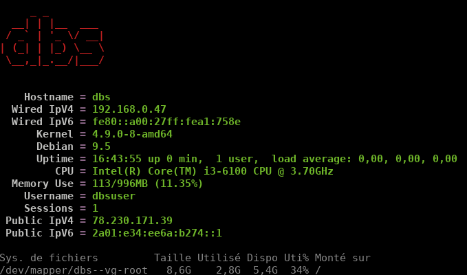

+++
title = '_Debian-Stretch-VirtualBox-ouestline.net-nginx-php7.2-mariadb-tlsv1.3'
date = 2018-12-03 00:00:00 +0100
categories = nginx
+++
---  
layout: article  
title:  Debian Stretch VirtualBox (dbs) ouestline.net nginx TLSv1.3  
date: 2018-12-03 00:00:00 +0100
last_modified_at: 2018-12-03
---  

## Debian Stretch VirtualBox


* Serveur virtuel 64 bits VirtualBox : **Debian Stretch** 
* machine : **dbs** 
* domaine :   
* root : **ytreu49** 
* Utilisateur : **dbsuser** 
* Mot de passe : **dbsuser49** 
* Adresse IP : **192.168.0.47**
* Accès 
    * SSH : **ssh dbsuser@192.168.0.47**
    * SSH + clé : **ssh -i ~/.ssh/vbox-dbs-ed25519 dbsuser@192.168.0.47** (non actif)  
    * Transfert de fichier : **scp -P 55022 -i ~/.ssh/stretch fichiera fichierb dbsuser@192.168.0.47:/home/dbsuser** (non actif)
* Mot de passe root mariadb : **mariadb49**

>Le domaine **ouestline.net** pointe sur l'adresse IPV6 **2a01:e34:ee6a:b274::1**


### Connexion SSH

	ssh dbsuser@192.168.0.47

Passer en root

	su # sudo -s

Mise à jour

    apt update && apt upgrade -y

Installer sudo

	apt install sudo

Visudo pour les accès root via utilisateur dbsuser

	echo "dbsuser     ALL=(ALL) NOPASSWD: ALL" >> /etc/sudoers

Connexion ssh avec clé

Ajouter la clé publique au fichier **~/.ssh/authorized_keys**  
Droit en lecture utilisateur uniquement, `chmod 400 ~/.ssh/authorized_keys`  
Modification configuration serveur ssh , `/etc/ssh/sshd_config`  
-> PasswordAuthentication no  
Relancer le service


### VBox Additions Invité/Debian 

Préalable  
Configurer votre machine virtuelle pour un accès au réseau partagé.  
**''Configuration'' --> ''Dossiers partagés''**  
Ajouter le dossier et cocher **''Montage automatique''**  

Installer les additions client dans un Debian en cours d'exécution dans une machine virtuelle.

  - Installez gcc ,make et  **kernel headers** (installateur a besoin d'eux pour construire le module du noyau):
      -  `sudo apt install gcc make linux-headers-$(uname -r)`
  - Allez dans le menu **''Périphériques'' --> ''Insérer l'image des additions invité...''** de la machine virtuelle en cours d'exécution ,si non présent , le télécharger.  
  - Monter le cd dans la machine virtuelle : `sudo mount /dev/cdrom /media/cdrom`
  - Allez dans le dossier monté : `cd /media/cdrom`
  - Exécutez : `sudo ./VBoxLinuxAdditions.run`
      - Pas d'environnement graphique : <u>ne pas tenir compte de l'erreur</u> **''Could not find the X.Org or XFree86 Window System, skipping.''**
  - Il faut ajouter le group **vboxsf** à votre utilisateur : `sudo usermod -a -G vboxsf $USER`
  - Pour la prise en compte, redémarrer la machine virtuelle : `sudo reboot`

**/media/** est le répertoire qui contient le(s) dossier(s) partagé(s)

### Gestion machine virtuelle VM

Démarrer la machine virtuelle VM en ligne de commande sans interface graphique VirtualBox

    VBoxManage startvm "Debian Stretch" --type headless

Arrêter une VM 

    VBoxManage controlvm "Debian Stretch" poweroff

Mettre en pause une VM 

    VBoxManage controlvm "Debian Stretch" pause

Réinitialiser une VM 

    VBoxManage controlvm "Debian Stretch" reset

En savoir plus sur VBoxHeadless, regardez

    VBoxHeadless --help 

### Adressage ipv6

Réseau actuel

	ip addr

```
2: enp0s3: <BROADCAST,MULTICAST,UP,LOWER_UP> mtu 1500 qdisc pfifo_fast state UP group default qlen 1000
    link/ether 08:00:27:a1:75:8e brd ff:ff:ff:ff:ff:ff
    inet 192.168.0.47/24 brd 192.168.0.255 scope global enp0s3
       valid_lft forever preferred_lft forever
    inet6 2a01:e34:ee6a:b270:a00:27ff:fea1:758e/64 scope global mngtmpaddr dynamic 
       valid_lft 86089sec preferred_lft 86089sec
    inet6 fe80::a00:27ff:fea1:758e/64 scope link 
       valid_lft forever preferred_lft forever
```

La carte n’est joignable de l’internet que par son adresse IPV6  
NextHop Freebox permet d’attribuer une adresse IPV6  
Adresse IPV6 Box  **fe80::224:d4ff:fea6:aa20**  
Préfixe **2a01:e34:ee6a:b274::/64**  
NextHop **fe80::a00:27ff:fea1:758e**  

    sudo nano /etc/network/interfaces

```
# This file describes the network interfaces available on your system
# and how to activate them. For more information, see interfaces(5).

source /etc/network/interfaces.d/*

# The loopback network interface
auto lo
iface lo inet loopback

# The primary network interface
allow-hotplug enp0s3
iface enp0s3 inet dhcp
# This is an autoconfigured IPv6 interface
# iface enp0s3 inet6 auto
iface enp0s3 inet6 static
  address 2a01:e34:ee6a:b274::1
  netmask 64
  post-up ip -6 route add default via fe80::224:d4ff:fea6:aa20 dev enp0s3

```

Redémarrer la machine

    sudo systemctl reboot

Vérifier l'adresse inet6 

    ip addr

```
2: enp0s3: <BROADCAST,MULTICAST,UP,LOWER_UP> mtu 1500 qdisc pfifo_fast state UP group default qlen 1000
    link/ether 08:00:27:a1:75:8e brd ff:ff:ff:ff:ff:ff
    inet 192.168.0.47/24 brd 192.168.0.255 scope global enp0s3
       valid_lft forever preferred_lft forever
    inet6 2a01:e34:ee6a:b274::1/64 scope global tentative dadfailed 
       valid_lft forever preferred_lft forever
    inet6 2a01:e34:ee6a:b270:a00:27ff:fea1:758e/64 scope global mngtmpaddr dynamic 
       valid_lft 84708sec preferred_lft 84708sec
    inet6 fe80::a00:27ff:fea1:758e/64 scope link 
       valid_lft forever preferred_lft forever
```

### Nginx + PHP7 + MariaDB

{:width="20%"}

[Debian Stretch compilation nginx avec modules dynamiques et TLSv1.3 + PHP7.2 + MariaDB](404/)

### DNS

{:width="10%"}

Le domaine **ouestline.net** pointe sur l'adresse IPV6 **2a01:e34:ee6a:b274::1**

depuis un poste distant  
`ping -6 -c5 2a01:e34:ee6a:b274::1`  
`ping -6 -c5 ouestline.net`  

OVH

```
$TTL 3600
@	IN SOA dns111.ovh.net. tech.ovh.net. (2018110102 86400 3600 3600000 300)
         3600 IN NS     ns111.ovh.net.
         3600 IN NS     dns111.ovh.net.
         3600 IN AAAA   2a01:e34:ee6a:b274::1
blog     3600 IN CNAME  ouestline.net.
static   3600 IN CNAME  ouestline.net.
```

### Certificats Letsencrypt

[Utiliser acme et api ovh](/posts/Acme-Certficats-Serveurs/)

Passer en root (su, sudo)  
Génération des certificats  
`/root/.acme.sh/acme.sh --dns dns_ovh --issue --keylength 4096 -d ouestline.net`  

```
[lundi 22 octobre 2018, 18:39:48 (UTC+0200)] Your cert is in  /root/.acme.sh/ouestline.net/ouestline.net.cer 
[lundi 22 octobre 2018, 18:39:48 (UTC+0200)] Your cert key is in  /root/.acme.sh/ouestline.net/ouestline.net.key 
[lundi 22 octobre 2018, 18:39:48 (UTC+0200)] The intermediate CA cert is in  /root/.acme.sh/ouestline.net/ca.cer 
[lundi 22 octobre 2018, 18:39:48 (UTC+0200)] And the full chain certs is there:  /root/.acme.sh/ouestline.net/fullchain.cer 
```

Création des liens

    ln -s /root/.acme.sh/ouestline.net/fullchain.cer /etc/ssl/private/ouestline.net.fullchain.cer.pem
    ln -s /root/.acme.sh/ouestline.net/ouestline.net.key /etc/ssl/private/ouestline.net.key.pem

### Configuration nginx

`sudo -s`  
Fichier de configuration nginx  
`rm /etc/nginx/conf.d/default.conf`  
`nano /etc/nginx/conf.d/default.conf`  

```
server {
    listen 80;
    listen [::]:80;

    ## redirect http to https ##
    server_name ouestline.net;
    return  301 https://$server_name$request_uri;
}

server {
    listen 443 ssl http2;
    listen [::]:443 ssl http2;

    server_name ouestline.net;
    root /var/www/ ;

    ssl_certificate /etc/ssl/private/ouestline.net.fullchain.cer.pem;
    ssl_certificate_key /etc/ssl/private/ouestline.net.key.pem;
    ssl_session_timeout 5m;
    ssl_session_cache shared:SSL:50m;

    # As suggested by Mozilla : https://wiki.mozilla.org/Security/Server_Side_TLS and https://en.wikipedia.org/wiki/Curve25519
    # (this doesn't work on jessie though ...?)
    # ssl_ecdh_curve secp521r1:secp384r1:prime256v1;

    # As suggested by https://cipherli.st/
    ssl_ecdh_curve secp384r1;

    ssl_prefer_server_ciphers on;

    # Ciphers with modern compatibility
    #---------------------------------
    # https://mozilla.github.io/server-side-tls/ssl-config-generator/?server=nginx-1.6.2&openssl=1.0.1t&hsts=yes&profile=modern
    # Uncomment the following to use modern ciphers, but remove compatibility with some old clients (android < 5.0, Internet Explorer < 10, ...)
    ssl_protocols TLSv1.2 TLSv1.3;
    ssl_ciphers 'TLS13+AESGCM+AES128:EECDH+AESGCM:EECDH+CHACHA20:ECDHE-ECDSA-AES256-GCM-SHA384:ECDHE-RSA-AES256-GCM-SHA384:ECDHE-ECDSA-CHACHA20-POLY1305:ECDHE-RSA-CHACHA20-POLY1305:ECDHE-ECDSA-AES128-GCM-SHA256:ECDHE-RSA-AES128-GCM-SHA256:ECDHE-ECDSA-AES256-SHA384:ECDHE-RSA-AES256-SHA384:ECDHE-ECDSA-AES128-SHA256:ECDHE-RSA-AES128-SHA256';

    # Uncomment the following directive after DH generation
    # > openssl dhparam -out /etc/ssl/private/dh2048.pem -outform PEM -2 2048
    #ssl_dhparam /etc/ssl/private/dh2048.pem;

    # Follows the Web Security Directives from the Mozilla Dev Lab and the Mozilla Obervatory + Partners
    # https://wiki.mozilla.org/Security/Guidelines/Web_Security
    # https://observatory.mozilla.org/ 
    add_header Strict-Transport-Security "max-age=63072000; includeSubDomains; preload"; 
    add_header Content-Security-Policy "upgrade-insecure-requests";
    add_header Content-Security-Policy-Report-Only "default-src https: data: 'unsafe-inline' 'unsafe-eval'";
    add_header X-Content-Type-Options nosniff;
    add_header X-XSS-Protection "1; mode=block";
    add_header X-Download-Options noopen;
    add_header X-Permitted-Cross-Domain-Policies none;
    add_header X-Frame-Options "SAMEORIGIN";

    index index.php;
        location ~ \.php$ {
           fastcgi_split_path_info ^(.+\.php)(/.+)$;
           fastcgi_pass unix:/run/php/php7.2-fpm.sock;    # PHP7.2 
           fastcgi_index index.php;
           include fastcgi_params;
           fastcgi_param SCRIPT_FILENAME $request_filename;
        }
}

```

Rechargement nginx  
`systemctl reload nginx`  


### script .ssh/rc sur connexion SSH

Exécuter un fichier utilisateur nommé $HOME/.ssh/rc si présent  
Pour tous les utilisateurs exécuter un fichier nommé /etc/ssh/sshrc si présent  
Installer les utilitaires curl jq figlet  

    sudo apt install curl jq figlet

Le batch

    mkdir -p ~/.ssh
    nano ~/.ssh/rc

```
#!/bin/bash

#clear
PROCCOUNT=`ps -Afl | wc -l`  		# nombre de lignes
PROCCOUNT=`expr $PROCCOUNT - 5`		# on ote les non concernées
GROUPZ=`users`
ipinfo=$(curl -s ipinfo.io) 		# info localisation format json
publicip=$(echo $ipinfo | jq -r '.ip')  # extraction des données , installer préalablement "jq"
ville=$(echo $ipinfo | jq -r '.city')
pays=$(echo $ipinfo | jq -r '.country')
cpuname=`cat /proc/cpuinfo |grep 'model name' | cut -d: -f2 | sed -n 1p`
iplink=`ip link show |grep -m 1 "2:" | awk '{print $2}' | cut -d: -f1`

echo "\033[0m\033[1;31m"  
figlet "`hostname --fqdn`"
echo "\033[0m
\033[1;35m    \033[1;37mHostname \033[1;35m= \033[1;32m`hostname`
\033[1;35m  \033[1;37mWired IpV4 \033[1;35m= \033[1;32m`ip addr show $iplink | grep 'inet\b' | awk '{print $2}' | cut -d/ -f1`
\033[1;35m  \033[1;37mWired IpV6 \033[1;35m= \033[1;32m`ip addr show $iplink | grep -E 'inet6' |grep -E 'scope link' | awk '{print $2}' | cut -d/ -f1`
\033[1;35m      \033[1;37mKernel \033[1;35m= \033[1;32m`uname -r`
\033[1;35m      \033[1;37mDebian \033[1;35m= \033[1;32m`cat /etc/debian_version`
\033[1;35m      \033[1;37mUptime \033[1;35m= \033[1;32m`uptime | sed 's/.*up ([^,]*), .*/1/' | sed -e 's/^[ \t]*//'`
\033[1;35m         \033[1;37mCPU \033[1;35m= \033[1;32m`echo $cpuname`
\033[1;35m  \033[1;37mMemory Use \033[1;35m= \033[1;32m`free -m | awk 'NR==2{printf "%s/%sMB (%.2f%%)\n", $3,$2,$3*100/$2 }'`
\033[1;35m    \033[1;37mUsername \033[1;35m= \033[1;32m`whoami`
\033[1;35m    \033[1;37mSessions \033[1;35m= \033[1;32m`who | grep $USER | wc -l`
\033[1;35m \033[1;37mPublic IpV4 \033[1;35m= \033[1;32m`echo $publicip`
\033[1;35m \033[1;37mPublic IpV6 \033[1;35m= \033[1;32m`ip addr show $iplink | grep -m 1 'inet6\b'  | awk '{print $2}' | cut -d/ -f1`
\033[0m"
df -h /
#curl fr.wttr.in/$ville?0
```

Effacer motd

    sudo rm /etc/motd

Déconnexion pusi connexion

{:width="50%"}

## Jekyll (générateur site statique)


### Installation ruby + jekyll 

    sudo apt install build-essential ruby-full
    sudo gem install bundler jekyll-feed

### wikistatic

Installer dépendances Rmagick sur Debian

    sudo apt install imagemagick ruby-rmagick # imagemagick-doc 

Création dossier

    sudo mkdir -p /srv     # création dossier

Les droits sur le dossier

    sudo chown   $USER. -R /srv/

Clonage wikistatic par git

```
sudo apt install git 
cd /srv
git clone https://gitlab.cinay.xyz/spm/wikistatic2.0.git wikistatic
cd wikistatic
```

Lancement “bundle” dans le dossier /srv/wikistatic pour la création de l'environnement

    cd /srv/wikistatic
    bundle

Les dossiers de l'hôte sont partagés sur la VBox debian  

Modification et création des liens avec le partage VBox   
Pour avoir les droits utilisateurs, on va monter "manuellement" les dossiers

    sudo mount -t vboxsf -o uid=1000,gid=1000 ouestline-jekyll_posts /srv/wikistatic/_posts
    sudo mount -t vboxsf -o uid=1000,gid=1000 ouestline-jekyllimages /srv/wikistatic/images

Pour un montage "automatique", ajouter en fin de fichier **/etc/fstab**

    ouestline-jekyll_posts  /srv/wikistatic/_posts vboxsf  uid=1000,gid=1000  0   0
    ouestline-jekyllimages  /srv/wikistatic/images vboxsf  uid=1000,gid=1000  0   0

Tester le montage automatique

    sudo mount -a  # ne doit pas générer d'erreur

Construire le site

    cd /srv/wikistatic # aller au dossier avant construction
    jekyll build  # construction du dossier statique _site

Créer le lien avec le site statique

    sudo ln -s /srv/wikistatic/_site /var/www/static # lien avec configuration nginx 

### Générer le site statique automatiquement

Le dossier *_site* est regénéré à chaque création, modification ou suppression d'un fichier de type *markdown* dans le dossier *_posts*  
Cette opération doit être lancée et en attente. Un bash et un service vont être utilisés.  

Pour lancer le serveur Jekyll au démarrage , créer un bash sous **/srv/wikistatic**

    nano /srv/wikistatic/start_jekyll.sh

```
#!/bin/sh
# Accès dossier 
cd /srv/wikistatic/
# lancement jekyll en mode auto génération sans serveur
/usr/local/bin/bundle exec jekyll build --watch --source "/srv/wikistatic"
```

Droits sur le bash

```
sudo chown $USER. /srv/wikistatic/start_jekyll.sh
chmod +x /srv/wikistatic/start_jekyll.sh
```

>Pour lancer le serveur **Jekyll** au démarrage, utilisation d'un <u>service systemd</u>  
**ATTENTION!** , remplacer *utilisateur* par votre nom d'utilisateur (**echo $USER**)

Création d'un service jekyll sous systemd

    sudo nano /etc/systemd/system/jekyll.service

Contenu du fichier

```ini
[Unit]
Description=jekyll Service
After=network.target

[Service]
Type=simple
User=utilisateur
ExecStart=/bin/sh /srv/wikistatic/start_jekyll.sh
Restart=on-abort


[Install]
WantedBy=multi-user.target
```

Lancer le service  **jekyll** :

```bash
sudo systemctl daemon-reload
sudo systemctl start jekyll
#Vérifier:
sudo systemctl status jekyll
```


```
● jekyll.service - jekyll Service
   Loaded: loaded (/etc/systemd/system/jekyll.service; enabled; vendor preset: enabled)
   Active: active (running) since Wed 2018-08-29 18:47:45 CEST; 1 day 13h ago
 Main PID: 29680 (sh)
    Tasks: 5 (limit: 4915)
   CGroup: /system.slice/jekyll.service
           ├─29680 /bin/sh /srv/wikistatic/start_jekyll.sh
           └─29681 /usr/local/bin/jekyll build --watch
```

Valider le lancement du **service jekyll au démarrage**

```bash
sudo systemctl enable jekyll
```

### Configuration nginx 

fichier **/etc/nginx/conf.d/static.ouestline.conf**

```
server {
    listen 80;
    listen [::]:80;

    ## redirect http to https ##
    server_name static.ouestline.net;
    return  301 https://$server_name$request_uri;
}

server {
    listen 443 ssl http2;
    listen [::]:443 ssl http2;

    server_name static.ouestline.net;
    root /var/www/static/ ;

    ssl_certificate /etc/ssl/private/ouestline.net.fullchain.cer.pem;
    ssl_certificate_key /etc/ssl/private/ouestline.net.key.pem;
    ssl_session_timeout 5m;
    ssl_session_cache shared:SSL:50m;

    # As suggested by Mozilla : https://wiki.mozilla.org/Security/Server_Side_TLS and https://en.wikipedia.org/wiki/Curve25519
    # (this doesn't work on jessie though ...?)
    # ssl_ecdh_curve secp521r1:secp384r1:prime256v1;

    # As suggested by https://cipherli.st/
    ssl_ecdh_curve secp384r1;

    ssl_prefer_server_ciphers on;

    # Ciphers with modern compatibility
    #---------------------------------
    # https://mozilla.github.io/server-side-tls/ssl-config-generator/?server=nginx-1.6.2&openssl=1.0.1t&hsts=yes&profile=modern
    # Uncomment the following to use modern ciphers, but remove compatibility with some old clients (android < 5.0, Internet Explorer < 10, ...)
    ssl_protocols TLSv1.2 TLSv1.3;
    ssl_ciphers 'TLS13+AESGCM+AES128:EECDH+AESGCM:EECDH+CHACHA20:ECDHE-ECDSA-AES256-GCM-SHA384:ECDHE-RSA-AES256-GCM-SHA384:ECDHE-ECDSA-CHACHA20-POLY1305:ECDHE-RSA-CHACHA20-POLY1305:ECDHE-ECDSA-AES128-GCM-SHA256:ECDHE-RSA-AES128-GCM-SHA256:ECDHE-ECDSA-AES256-SHA384:ECDHE-RSA-AES256-SHA384:ECDHE-ECDSA-AES128-SHA256:ECDHE-RSA-AES128-SHA256';

    # Uncomment the following directive after DH generation
    # > openssl dhparam -out /etc/ssl/private/dh2048.pem -outform PEM -2 2048
    #ssl_dhparam /etc/ssl/private/dh2048.pem;

    # Follows the Web Security Directives from the Mozilla Dev Lab and the Mozilla Obervatory + Partners
    # https://wiki.mozilla.org/Security/Guidelines/Web_Security
    # https://observatory.mozilla.org/ 
    add_header Strict-Transport-Security "max-age=63072000; includeSubDomains; preload"; 
    add_header Content-Security-Policy "upgrade-insecure-requests";
    add_header Content-Security-Policy-Report-Only "default-src https: data: 'unsafe-inline' 'unsafe-eval'";
    add_header X-Content-Type-Options nosniff;
    add_header X-XSS-Protection "1; mode=block";
    add_header X-Download-Options noopen;
    add_header X-Permitted-Cross-Domain-Policies none;
    add_header X-Frame-Options "SAMEORIGIN";

    index index/;
	location / {
    }
}
```

Recharger le serveur nginx

    sudo systemctl reload nginx


