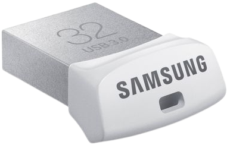

+++
title = 'Archlinux - Raspberry PI 3 + USB 3.0 Flash Drive FIT 32GB'
date = 2019-12-27 00:00:00 +0100
categories = ['raspberry']
+++
*Architecture aarm64 pose beaucoup (trop) de problème !!!*

## Raspberry PI 3B+

{:width="300px"}

* Processor 
    * Broadcom BCM2387 chipset.
    * 1.2GHz Quad-Core ARM Cortex-A53 (64Bit)
* 802.11 b/g/n Wireless LAN and Bluetooth 4.1 (Bluetooth Classic and LE)
    * IEEE 802.11 b / g / n Wi-Fi. Protocol: WEP, WPA WPA2, algorithms AES-CCMP (maximum keylength of 256 bits), the maximum range of 100 meters.
    * IEEE 802.15 Bluetooth, symmetric encryption algorithm Advanced Encryption Standard (AES)with 128-bit key, the maximum range of 50 meters.
* GPU
    * Dual Core Video Core IV® Multimedia Co-Processor. Provides Open GL ES 2.0, hardware-acceleratedOpen VG, and 1080p30 H.264 high-profile decode.
    * Capable of 1Gpixel/s, 1.5Gtexel/s or 24GFLOPs with texture filtering and DMA infrastructure
* Memory
    * 1GB LPDDR2
* Operating System
    * Boots from Micro SD card, running a version of the Linux operating system or Windows 10 IoT
* Dimensions
    * 85 x 56 x 17mm
Power
    * Micro USB socket 5V1, 2.5A

Connectors:

* Ethernet
    * 10/100 BaseT Ethernet socket
* Video Output
    * HDMI (rev 1.3 & 1.4)
    * Composite RCA (PAL and NTSC)
* Audio Output
    * Audio Output 3.5mm jack
    * HDMI
    * USB 4 x USB 2.0 Connector
* GPIO Connector
    * 40-pin 2.54 mm (100 mil) expansion header: 2x20 strip
    * Providing 27 GPIO pins as well as +3.3 V, +5 V and GND supply lines
Camera Connector
    * 15-pin MIPI Camera Serial Interface (CSI-2)
* Display Connector
    * Display Serial Interface (DSI) 15 way flat flex cable connector with two data lanes and a clock lane
* Memory Card Slot
    * Push/pull Micro SDIO

{:width="300px"} 

[SPI0 SPI1 Pin Out](https://fr.pinout.xyz/pinout/spi#)

## Samsung USB 3.0 Flash Drive FIT 32GB

Le Raspberry Pi 3 est capable de booter sur un stockage USB, disque dur externe ou clé USB.  
>** /!\\ ATTENTION : ** il faut une unité de stockage suffisamment rapide pour être prise en compte  

Choix d'une clé **Samsung USB 3.0 Flash Drive FIT 32GB**  
{:width="100px"}

>NOTE:La possibilité de booter sur un stockage USB externe est vérifiable après boot sur une carte SD par la commande `vcgencmd otp_dump | grep 17:` qui doit afficher  **17:3020000a**


Insérer la clé **Samsung USB 3.0 Flash Drive FIT 32GB** sur un des connecteurs USB de l'ordinateur linux   
Repérer sur quel périphérique  

    dmesg

```
[26666.700767] scsi 5:0:0:0: Direct-Access     Samsung  Flash Drive FIT  1100 PQ: 0 ANSI: 6
[...]
[26666.708906]  sde: sde1
[26666.711682] sd 5:0:0:0: [sde] Attached SCSI removable disk
```

La "Clé USB" est sur le périphérique système /dev/sde  

## Archlinux

{:width="150px"}

* [How to Install Arch Linux on Raspberry Pi](https://linuxize.com/post/how-to-install-arch-linux-on-raspberry-pi/)  
* [Updating/upgrading to the latest Arch Linux ARM release](https://archlinuxarm.org/about/downloads)  

### Téléchargement

il existe **ArchLinuxARM-rpi-2-latest.tar.gz** et **ArchLinuxARM-rpi-3-latest.tar.gz**, les deux fonctionnent pour pi 3, le dernier a un noyau 64-bit et aarch64 rootfs.

Télécharger l'image et la signature 

```
wget http://os.archlinuxarm.org/os/ArchLinuxARM-rpi-3-latest.tar.gz.sig
wget http://os.archlinuxarm.org/os/ArchLinuxARM-rpi-3-latest.tar.gz
```

Assurez-vous de vérifier la clé GPG de `Arch Linux ARM Build System <builder@archlinuxarm.org>` et son empreinte digitale &rarr; `68B3 537F 39A3 13B3 E574 D067 7719 3F15 2BDB E6A6`  
Ajouter la clé publique (les 8 derniers caractères alpha-numérique sans l'espace) 

    gpg --keyserver pool.sks-keyservers.net --recv-keys 2BDBE6A6

```
gpg: clef 77193F152BDBE6A6 : clef publique « Arch Linux ARM Build System <builder@archlinuxarm.org> » importée
gpg: aucune clef de confiance ultime n'a été trouvée
gpg:       Quantité totale traitée : 1
gpg:                     importées : 1
```

Vérifier la signature

    gpg --verify ArchLinuxARM-rpi-3-latest.tar.gz.sig

```
gpg: les données signées sont supposées être dans « ArchLinuxARM-rpi-3-latest.tar.gz »
gpg: Signature faite le dim. 08 déc. 2019 17:55:00 CET
gpg:                avec la clef RSA 68B3537F39A313B3E574D06777193F152BDBE6A6
gpg: Bonne signature de « Arch Linux ARM Build System <builder@archlinuxarm.org> » [inconnu]
gpg: Attention : cette clef n'est pas certifiée avec une signature de confiance.
gpg:             Rien n'indique que la signature appartient à son propriétaire.
Empreinte de clef principale : 68B3 537F 39A3 13B3 E574  D067 7719 3F15 2BDB E6A6
```

### Préparer la carte SD/FlashDrive

Vous pouvez utiliser un outil graphique comme GParted ou des outils en ligne de commande comme fdisk ou parted pour formater le disque et créer la partition requise.   
<font color="red">TRES IMPORTANT !!! : La partitionon n°1 doit être IMPERATIVEMENT de type FAT16<b></b></font>

    sudo fdisk /dev/sde

```
Bienvenue dans fdisk (util-linux 2.34).
Les modifications resteront en mémoire jusqu'à écriture.
Soyez prudent avant d'utiliser la commande d'écriture.


Commande (m pour l'aide) : o
Création d'une nouvelle étiquette pour disque de type DOS avec identifiant de disque 0x1409b79b.

Commande (m pour l'aide) : n
Type de partition
   p   primaire (0 primaire, 0 étendue, 4 libre)
   e   étendue (conteneur pour partitions logiques)
Sélectionnez (p par défaut) : 

Utilisation de la réponse p par défaut.
Numéro de partition (1-4, 1 par défaut) : 
Premier secteur (2048-15759359, 2048 par défaut) : 
Dernier secteur, +/-secteurs ou +/-taille{K,M,G,T,P} (2048-15759359, 15759359 par défaut) : +700M

Une nouvelle partition 1 de type « Linux » et de taille 700 MiB a été créée.

Commande (m pour l'aide) : t
Partition 1 sélectionnée
Code Hexa (taper L pour afficher tous les codes) :6
Type de partition « Linux » modifié en « FAT16 ».

Commande (m pour l'aide) : a
Partition 1 sélectionnée
L’indicateur d’amorçage de la partition 1 est maintenant activé.

Commande (m pour l'aide) : p
Disque /dev/sde : 7,53 GiB, 8068792320 octets, 15759360 secteurs
Modèle de disque : STORAGE DEVICE  
Unités : secteur de 1 × 512 = 512 octets
Taille de secteur (logique / physique) : 512 octets / 512 octets
taille d'E/S (minimale / optimale) : 512 octets / 512 octets
Type d'étiquette de disque : dos
Identifiant de disque : 0x1409b79b

Périphérique Amorçage Début     Fin Secteurs Taille Id Type
/dev/sde1    *         2048 1435647  1433600   512M  6 FAT16

Commande (m pour l'aide) : n
Type de partition
   p   primaire (1 primaire, 0 étendue, 3 libre)
   e   étendue (conteneur pour partitions logiques)
Sélectionnez (p par défaut) : 

Utilisation de la réponse p par défaut.
Numéro de partition (2-4, 2 par défaut) : 
Premier secteur (1050624-15759359, 1050624 par défaut) : 
Dernier secteur, +/-secteurs ou +/-taille{K,M,G,T,P} (1050624-15759359, 15759359 par défaut) : 

Une nouvelle partition 2 de type « Linux » et de taille 7 GiB a été créée.

Commande (m pour l'aide) : w
La table de partitions a été altérée.
Appel d'ioctl() pour relire la table de partitions.
Synchronisation des disques.
```

Formatez la partition de démarrage en FAT16 :

    sudo mkfs.vfat -F 16 /dev/sde1

Formatez la partition racine en ext4 :

    sudo mkfs.ext4 -F /dev/sde2


### Copie des fichiers de l'OS Archlinux

Maintenant que la carte SD est partitionnée, nous allons monter les partitions et copier les données du fichier tar téléchargé.

Avant de monter les partitions SD, créez les répertoires qui serviront de points de montage :

    sudo mkdir -p /mnt/arch/{boot,root}

Montez les deux partitions à l'aide des commandes ci-dessous :

    sudo mount /dev/sde1 /mnt/arch/boot
    sudo mount /dev/sde2 /mnt/arch/root

Utilisez la commande tar pour extraire le contenu du fichier tar.gz d'Arch Linux dans le répertoire /mnt/arch/root :

    sudo tar -xf ArchLinuxARM-rpi-3-latest.tar.gz -C /mnt/arch/root
    sync

Ne pas tenir compte du message *tar: Le mot clé inconnu « LIBARCHIVE.xattr.security.capability » pour l'en-tête étendu a été ignoré*  
Ensuite, déplacez les fichiers de démarrage vers la partition de démarrage montée :

    sudo mv /mnt/arch/root/boot/* /mnt/arch/boot
    sync

<font color="red">**ATTENTION !!!** Si vous utilisez un Flash Drive, il faut modifier le fichier **fstab**  </font>

    sudo nano /mnt/arch/root/etc/fstab

```
# Static information about the filesystems.
# See fstab(5) for details.

# <file system> <dir> <type> <options> <dump> <pass>
/dev/mmcblk0p1  /boot   vfat    defaults        0       0
```

**Flash Drive **: Remplacer **/dev/mmcblk0p1** par **/dev/sda1**

Une fois fait, démontez les deux partitions :

    sudo umount /mnt/arch/boot /mnt/arch/root

Vous avez un OS Arch Linux bootable sur votre carte SD.

### Démarrer le RaspberryPI

><font color="red">**ATTENTION !!!** Problème aves les pilotes graphiques vc4 et drm, vous ne pouvez pas utiliser **Alternative B**  </font>


<u>Alternative A</u> : liaison série

Après avoir inséré la "Clé USB" dans son logement ,connecté le cordon réseau et la liaison série puis 
brancher la micro-usb d'alimentation  sur la carte raspberry et enfin le DC-Pack sur le secteur.  

**minicom** ou **screen** et un adatateur USB/Série

|Interface USB/Série|Raspberry|
| ----------------- | ------- |
| GND | 6 (GND)|
| Rxd | 8 (Txd) |
| Txd | 10 (Rxd) |

lancer le logiciel de communication (minicom ou screen)  

    sudo minicom # Débit/Parité/Bits:115200 8N1,Contrôle de flux matériel:Non,Contrôle de flux logiciel:Non  
	sudo screen /dev/ttyUSB0 115200

<u>Alternative B</u> : moniteur et clavier

Mettez la carte SD/Flash Drive dans votre carte Raspberry Pi, branchez le moniteur, le cordon réseau, le clavier et la source d'alimentation, et vous êtes prêt à partir.

## Configuration Archlinux

### Premier démarrage

Ecran de login après 1 à 2 minutes d'attente

```
[...]

Arch Linux 5.4.2-1-ARCH (ttyS1)

alarm login: 
```

Le nom d'utilisateur par défaut est **alarm**, et le mot de passe est **alarm**. Cet utilisateur a les privilèges sudo.  
Vous pouvez également vous connecter en tant que **root** avec le mot de passe **root**.

Relever l'adresse IP

    ip a

```
[...]
2: eth0: <BROADCAST,MULTICAST,UP,LOWER_UP> mtu 1500 qdisc fq_codel state UP group default qlen 1000
    link/ether b8:27:eb:54:7e:6a brd ff:ff:ff:ff:ff:ff
    inet 192.168.0.23/24 brd 192.168.0.255 scope global dynamic eth0
       valid_lft 43141sec preferred_lft 43141sec
    inet6 2a01:e34:eebf:df0:ba27:ebff:fe54:7e6a/64 scope global dynamic mngtmpaddr noprefixroute 
       valid_lft 86339sec preferred_lft 86339sec
    inet6 fe80::ba27:ebff:fe54:7e6a/64 scope link 
       valid_lft forever preferred_lft forever
3: wlan0: <BROADCAST,MULTICAST> mtu 1500 qdisc noop state DOWN group default qlen 1000
    link/ether b8:27:eb:01:2b:3f brd ff:ff:ff:ff:ff:ff
```

On peut également se connecter en SSH avec l'utilisateur  ( alarm pas root)

    ssh alarm@192.168.0.23

Une fois connecté via SSH, passer en "su"   

Pour avoir un affichage HDMI de base au prochain démarrage , il faut "blacklister" les modules vc4 et drm.  

```
[root@alarm alarm]# lsmod |grep video
videobuf2_vmalloc      20480  1 bcm2835_v4l2
videobuf2_memops       20480  1 videobuf2_vmalloc
videobuf2_v4l2         32768  1 bcm2835_v4l2
videobuf2_common       61440  2 videobuf2_v4l2,bcm2835_v4l2
videodev              253952  3 videobuf2_v4l2,bcm2835_v4l2,videobuf2_common
mc                     61440  3 videodev,videobuf2_v4l2,videobuf2_common
[root@alarm alarm]# lsmod |grep vc4  
vc4                   196608  3
cec                    65536  1 vc4
drm_kms_helper        208896  3 vc4
drm                   565248  3 drm_kms_helper,vc4
[root@alarm alarm]# lsmod |grep drm
drm_kms_helper        208896  3 vc4
drm                   565248  3 drm_kms_helper,vc4
syscopyarea            16384  1 drm_kms_helper
sysfillrect            16384  1 drm_kms_helper
sysimgblt              16384  1 drm_kms_helper
fb_sys_fops            16384  1 drm_kms_helper
```

Création du fichier **novc4.conf**

    nano /etc/modprobe.d/novc4.conf

```
blacklist vc4
blacklist drm_kms_helper
```


exécuter les commandes suivantes

    pacman-key --init                    # initialisation du porte-clés pacman
    pacman-key --populate archlinuxarm   # remplissage des clés de signature du paquet 
    pacman -Syu                          # mise à jour
    pacman -S --needed sudo git rsync base-devel uboot-tools # compléments
    pacman -Syy

```
:: Synchronizing package databases...
 core       191.0 KiB   637 KiB/s 00:00 [#######################] 100%
 extra        2.2 MiB   628 KiB/s 00:04 [#######################] 100%
 community    4.6 MiB   633 KiB/s 00:07 [#######################] 100%
 alarm       47.0 KiB   671 KiB/s 00:00 [#######################] 100%
 aur          3.6 KiB  0.00   B/s 00:00 [#######################] 100%
```

>**REDEMARRER le RaspberryPI**

### sudo

Modifier , donner les droits sudo à l'utilisateur alarm

    echo "alarm ALL=NOPASSWD: ALL" >> /etc/sudoers

D'ici, vous pouvez changer le mot de passe de l'utilisateur, configurer le WiFi, et configurer votre nouvelle installation Arch Linux.

### Locales

Clavier en mode texte, créer le fichier /etc/vconsole.conf.  


	nano /etc/vconsole.conf

Ajouter  

```
KEYMAP=fr-latin9
FONT=eurlatgr
```

localisation française, le fichier **/etc/locale.conf** doit contenir la bonne valeur pour LANG  

	nano /etc/locale.conf

Ajouter  

```
LANG=fr_FR.UTF-8
LC_COLLATE=C
```

Il faut supprimer le **#** au début de la ligne **fr_FR.UTF-8 UTF-8** dans le fichier **/etc/locale.gen**  

	nano /etc/locale.gen

puis exécuter:  

	locale-gen

```
Generating locales...
  fr_FR.UTF-8... done
```

spécifier la locale pour la session courante  

	export LANG=fr_FR.UTF-8

fuseau horaire **Europe/Paris**  

	ln -sf /usr/share/zoneinfo/Europe/Paris /etc/localtime
	timedatectl

```
               Local time: Sun 2020-01-05 12:41:55 CET
           Universal time: Sun 2020-01-05 11:41:55 UTC
                 RTC time: n/a
                Time zone: Europe/Paris (CET, +0100)
System clock synchronized: yes
              NTP service: active
          RTC in local TZ: no
```

### Hostname

    echo "aarch64" > /etc/hostname


### Outils pour installer des logiciels supplémentaires (AUR)

Choix entre packer ou yay...  

**packer**

    sudo pacman -S packer   

**yay**

**Note** : [yay](https://github.com/Jguer/yay) est une aide AUR particulièrement pratique sur Arch Linux ARM, car elle peut [facilement sauter les vérifications d'architecture](https://github.com/Jguer/yay/commit/4bcd3a6) lors de la construction de pkgbuilds avec une arche officiellement non supportée.

```
cd ~
git clone https://aur.archlinux.org/yay.git
cd yay
makepkg -si
```

## Bureau Xorg/XFCE4

### Xorg 

X.Org est un serveur X libre

    sudo pacman -S xorg-server xf86-video-fbdev xorg-xrefresh

### XFCE4

Xfce est un environnement de bureau libre léger 

    sudo pacman -S xfce4 xfce4-goodies

Sélection des options par défaut...

>A la fin de l'installation ,REDEMARRER le raspberry PI : `sudo systemctl reboot`

### Lancer XFCE manuellement

Premier aperçu du bureau

    startxfce4

Constat :

>**Résolution 136x768 , pas plus ,il faut régler le problème des pilotes !!!**

### Activation du module du noyau VC4 (graphique)

Les pilotes sont désactivés,fichier **/etc/modprobe.d/novc4.conf**, mettre les 2 lignes en commentaire (début de ligne commence par un `#`) pour les réactiver

```
#blacklist vc4
#blacklist drm_kms_helper
```

Pour activer le module du noyau, vous devez activer l'overlay optionnel dans votre **config.txt** avec `dtoverlay=vc4-kms-v3d`  
Il est également recommandé de passer votre **gpu_mem** à 128 

    sudo nano /boot/config.txt 

```
gpu_mem=128
dtoverlay=vc4-kms-v3d
enable_uart=1
```

>Redémarrage `sudo systemctl reboot`...  

Une fois que vous êtes redémarré, vous pouvez vérifier que votre module est correctement chargé avec `lsmod`. Vous êtes censé avoir un module vc4 là-dedans. Aussi, il est important de vérifier que **/dev/dri/card0** existe. Si vous n'avez pas ce module, rien ne fonctionnera.

```
[root@aarch64 alarm]# lsmod |grep vc4
vc4                   196608  3
cec                    65536  1 vc4
drm_kms_helper        208896  3 vc4
drm                   569344  3 drm_kms_helper,vc4
[root@aarch64 alarm]# ls /dev/dri/card0 
/dev/dri/card0
```

Lancer manuellement xfce

    startxfce4

Un autre problème ,l'écran est "gris" avec seulemnt le pointeur de la souris !!!  
Avec les messages en "boucle" 

```
[  502.174648] [drm:vc4_bo_create [vc4]] *ERROR* Failed to allocate from CMA:
[  502.181649] vc4-drm soc:gpu: [drm]                            V3D:  41268kb BOs (106)
[  502.189625] vc4-drm soc:gpu: [drm]                     V3D shader:    172kb BOs (43)
[  502.197500] vc4-drm soc:gpu: [drm]                           dumb:   2088kb BOs (4)
[  502.205280] vc4-drm soc:gpu: [drm]                         binner:  16384kb BOs (1)
[  502.213045] vc4-drm soc:gpu: [drm]                total purged BO:  25684kb BOs (85)
```

la solution consiste à ajouter `cma=256M@256M` à la ligne de commande du noyau kernel.  
Aller dans le dossier **/boot** et modifier le fichier **boot.txt** pour ressembler à ce qui suit

```
# After modifying, run ./mkscr

# Set root partition to the second partition of boot device
part uuid ${devtype} ${devnum}:2 uuid

setenv bootargs console=ttyS1,115200 console=tty0 root=PARTUUID=${uuid} rw rootwait cma=256M@256M smsc95xx.macaddr="${usbethaddr}"

if load ${devtype} ${devnum}:${bootpart} ${kernel_addr_r} /Image; then
  if load ${devtype} ${devnum}:${bootpart} ${fdt_addr_r} /dtbs/${fdtfile}; then
    if load ${devtype} ${devnum}:${bootpart} ${ramdisk_addr_r} /initramfs-linux.img; then
      booti ${kernel_addr_r} ${ramdisk_addr_r}:${filesize} ${fdt_addr_r};
    else
      booti ${kernel_addr_r} - ${fdt_addr_r};
    fi;
  fi;
fi
```

Recréer le fichier **boot.scr** avec l'utilitaire `mkscr` 

    ./mkscr

```
Image Name:   U-Boot boot script
Created:      Sun Jan  5 15:36:16 2020
Image Type:   ARM Linux Script (uncompressed)
Data Size:    658 Bytes = 0.64 KiB = 0.00 MiB
Load Address: 00000000
Entry Point:  00000000
Contents:
   Image 0: 650 Bytes = 0.63 KiB = 0.00 MiB
```

>Redémarrage `sudo systemctl reboot`...    

Lancer manuellement xfce

    startxfce4

Tout est fonctionnel, l'affichage est en 1920x1080

Vérifications 

```
[alarm@aarch64 ~]$ dmesg |grep vc4
[   18.120935] rc rc0: vc4 as /devices/platform/soc/3f902000.hdmi/rc/rc0
[   18.149965] input: vc4 as /devices/platform/soc/3f902000.hdmi/rc/rc0/input12
[   18.166317] debugfs: Directory '3f902000.hdmi' with parent 'vc4-hdmi' already present!
[   18.207415] vc4_hdmi 3f902000.hdmi: vc4-hdmi-hifi <-> 3f902000.hdmi mapping ok
[   18.223321] vc4_hdmi 3f902000.hdmi: ASoC: no DMI vendor name!
[   18.238333] vc4-drm soc:gpu: bound 3f902000.hdmi (ops vc4_hdmi_ops [vc4])
[   18.253822] vc4-drm soc:gpu: bound 3f806000.vec (ops vc4_vec_ops [vc4])
[   18.269221] vc4-drm soc:gpu: bound 3f004000.txp (ops vc4_txp_ops [vc4])
[   18.284154] vc4-drm soc:gpu: bound 3f400000.hvs (ops vc4_hvs_ops [vc4])
[   18.284491] vc4-drm soc:gpu: bound 3f206000.pixelvalve (ops vc4_crtc_ops [vc4])
[   18.314492] vc4-drm soc:gpu: bound 3f207000.pixelvalve (ops vc4_crtc_ops [vc4])
[   18.314889] vc4-drm soc:gpu: bound 3f807000.pixelvalve (ops vc4_crtc_ops [vc4])
[   18.315004] vc4-drm soc:gpu: bound 3fc00000.v3d (ops vc4_v3d_ops [vc4])
[   18.315017] fb0: switching to vc4drmfb from simple
[   18.422989] [drm] Initialized vc4 0.0.0 20140616 for soc:gpu on minor 0
[   18.534211] vc4-drm soc:gpu: fb0: vc4drmfb frame buffer device
[alarm@aarch64 ~]$ dmesg |grep drm
[   18.238333] vc4-drm soc:gpu: bound 3f902000.hdmi (ops vc4_hdmi_ops [vc4])
[   18.253822] vc4-drm soc:gpu: bound 3f806000.vec (ops vc4_vec_ops [vc4])
[   18.269221] vc4-drm soc:gpu: bound 3f004000.txp (ops vc4_txp_ops [vc4])
[   18.284154] vc4-drm soc:gpu: bound 3f400000.hvs (ops vc4_hvs_ops [vc4])
[   18.284491] vc4-drm soc:gpu: bound 3f206000.pixelvalve (ops vc4_crtc_ops [vc4])
[   18.314492] vc4-drm soc:gpu: bound 3f207000.pixelvalve (ops vc4_crtc_ops [vc4])
[   18.314889] vc4-drm soc:gpu: bound 3f807000.pixelvalve (ops vc4_crtc_ops [vc4])
[   18.315004] vc4-drm soc:gpu: bound 3fc00000.v3d (ops vc4_v3d_ops [vc4])
[   18.315017] fb0: switching to vc4drmfb from simple
[   18.403781] [drm] Supports vblank timestamp caching Rev 2 (21.10.2013).
[   18.403785] [drm] Driver supports precise vblank timestamp query.
[   18.422989] [drm] Initialized vc4 0.0.0 20140616 for soc:gpu on minor 0
[   18.534211] vc4-drm soc:gpu: fb0: vc4drmfb frame buffer device
```

### Wifi 

Initialiser la wifi (**wpa_supplicant**)

    sudo nano /etc/wpa_supplicant/home_wifi

ajouter ce qui suit et modifier **ssid** et **psk** avec vos infos réseau

```
network={
ssid="Nom_Réseau_Wifi"
psk="password"
}
```

### Clavier

*le clavier n'est pas français*

Pour modifier le type de clavier, créez un fichier **/etc/X11/xorg.conf.d/00-keyboard.conf** , pour le configurer en azerty français 

    sudo nano/etc/X11/xorg.conf.d/00-keyboard.conf

```
Section "InputClass"
    Identifier         "Keyboard Layout"
    MatchIsKeyboard    "yes"
    Option             "XkbLayout"  "fr"
    Option             "XkbVariant" "latin9" # accès aux caractères spéciaux plus logique avec "Alt Gr" (ex : « » avec "Alt Gr" w x)
EndSection
```

Pour la prise en charge, il faut fermer la session puis l'ouvrir

### Thème et police 

    yay -S arc-gtk-theme arc-icon-theme ttf-roboto

### Network Manager

un gestionnaire de réseau pour contrôler le wifi et ethernet via gui

    sudo pacman -Syu networkmanager network-manager-applet  
    sudo systemctl enable NetworkManager
    sudo systemctl start NetworkManager

REDEMARRER LE RASPBERRY : `sudo systemctl reboot`

### Applications

[firefox archlinux](https://archlinuxarm.org/packages/aarch64/firefox) architecture aarch64

    yay -S wget
    wget http://mirror.archlinuxarm.org/aarch64/extra/firefox-69.0.3-1-aarch64.pkg.tar.xz
    sudo pacman -U firefox-69.0.3-1-aarch64.pkg.tar.xz

### Gestionnaire de bureau SDDM 

Installer sddm

    sudo pacman -S sddm

Fichier de configuration **/etc/sddm.conf**  
Pour avoir un exemple de fichier de configuration, il suffit de rediriger la sortie de la commande fournie par SDDM dans votre fichier de configuration:

    sudo sh -c "sddm --example-config > /etc/sddm.conf"

Connexion automatique **/etc/sddm.conf**, modifier l'utilisateur : User=alarm  

```
[Autologin]
 
User=VotreUtilisateur
Session=VotreSession.desktop
```

Les sessions disponibles se trouvent dans **/usr/share/xsessions/**

NumLock **/etc/sddm.conf**, pour activer la touche Verr Num de votre clavier à la connexion.

```
[General]
 ...
 Numlock=on
 ...
```

---

Activation SDDM 

    systemctl enable sddm.service

```
==== AUTHENTICATING FOR org.freedesktop.systemd1.reload-daemon ====             
Authentication is required to reload the systemd state.                         
Authenticating as: alarm                                                        
Password:                                                                       
==== AUTHENTICATION COMPLETE ====      
```


[Arch Linux on Raspberry Pi](https://www.instructables.com/id/Arch-Linux-on-Raspberry-Pi/)


### Bluetooth

installer les outils pour compiler le bluetooth

    sudo pacman -S make gcc git-core automake autoconf pkg-config libtool patch
    packer -S yaourt blueman
    packer -S pi-bluetooth
    sudo systemctl start bluetooth.service
    sudo systemctl enable bluetooth.service
    sudo systemctl enable brcm43438.service
    sudo pacman -Syu pulseaudio-alsa pulseaudio-bluetooth pavucontrol bluez bluez-libs bluez-utils bluez-firmware

## Liens

[Affichage HDMI de la Raspberry Pi qui ne marche pas, la solution !](https://raspberry-pi.fr/hdmi-raspberry-pi-marche-pas-solution/)