+++
title = 'Freebox mini 4K (Android TV)'
date = 2019-12-31 00:00:00 +0100
categories = android
+++
# Freebox mini 4K (Android TV)

{:width="400"}

* freebox mini gérer par android   
* Ajout clavier wifi avec dongle usb  
* [Freebox mini 4K : comment installer les applications que Free ne propose pas](https://www.tomsguide.fr/actualite/freebox-mini-4k-installation-applications,46824.html)

## Paramètres

Dans les **Paramètres**  
**A propos** , 8 fois **OK** sur **Build**, pour passer en mode développeur, puis touche Echappe  

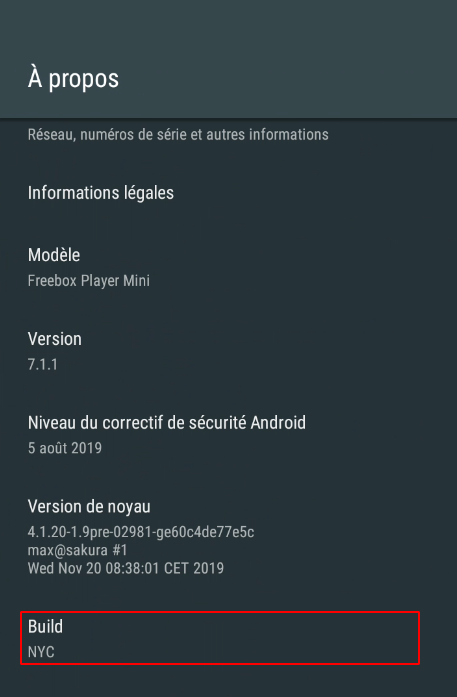{:width="200"}

**Options pour les développeurs**  
Activer les options pour les développeurs et le Débogage USB

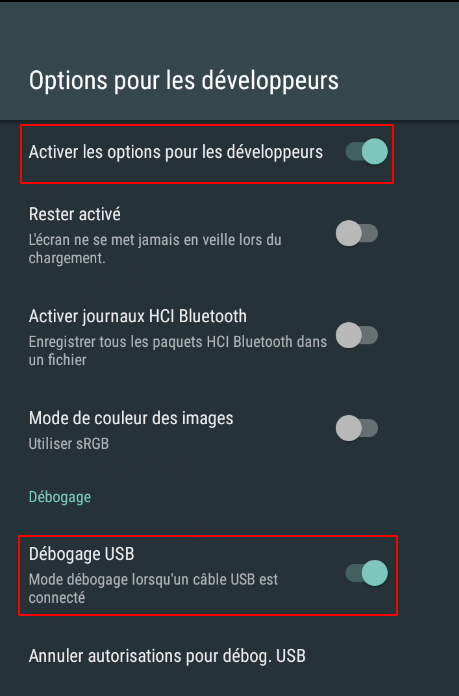{:width="200"}

**Sécutité et restrictions**  
Activer *Vérifier les applications*  
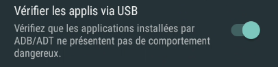{:width="200"}

**Informations de version**  
Freebox TV 3.1.3/43

Réglages Freebox &rarr; **Réglages d'affichage**  
Réglage des marges  
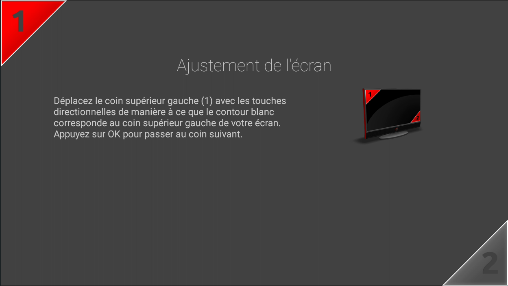{:width="400"}

**Réseau** DHCP  
192.168.0.26

## Adb depuis un ordinateur linux

Les outils android doivent être installés  
Connexion sur la Freebox Mini

    adb connect 192.168.0.26

```
* daemon not running; starting now at tcp:5037
* daemon started successfully
failed to authenticate to 192.168.0.26:5555
```

>Sur l'écran TV , un message pour l'autorisation d'accès , valiser "toujours" puis "OK"

Accès au shell

    adb shell   

```
fbx6lc:/ $ 
```

Accès en mode graphique avec "scrcpy"

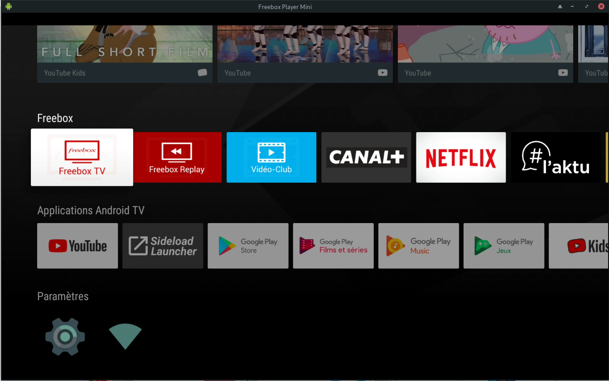{:width="400"}

## android TV launcher

### Ugoos Launcher

[Ugoos TV Launcher](https://apkpure.com/fr/ugoos-tv-launcher/com.app.ugooslauncher)

- Télécommande adaptative et support de souris aérienne
- Variété de neuf thèmes de couleur pour les principaux éléments du lanceur
- Arrière-plan personnalisable : vous pouvez choisir dans une liste ou utiliser l'arrière-plan système
- Icônes de bureau personnalisables : quantité sur un écran, taille de la bordure, fond des icônes
- Nouveau sélecteur de catégories : huit catégories + une avec toutes les candidatures
- Démarrage rapide de l'application principale à partir de chaque catégorie


### Sideload Launcher Android TV

[Sidebar launcher](https://www.freenews.fr/freenews-edition-nationale-299/freebox-9/guide-comment-installer-nimporte-quelle-app-android-sur-freebox-mini-4k)  
[Sideload Launcher Android TV_v1.05_apkpure.com.apk](https://apkpure.com/sideload-launcher-android-tv/eu.chainfire.tv.sideloadlauncher/download?from=details)

Renommer en **SideloadLauncherAndroidTV_v1.05.apk** et installer

    adb install SideloadLauncherAndroidTV_v1.05.apk

Réorganiser le menu  
Paramètres --> Ecran d'accueil --> Ligne des applications et des jeux  
Réorganiser la ligne des applications  
Positionner **Sideload Launcher** en tête de ligne

### HAL Launcher for Android TV (installé)

[HAL Launcher](https://www.apkmirror.com/apk/ito-akihiro/halauncher-android-tv/) ,un autre launcher plus complet...

    adb install halauncher_2018-05-27.apk

On peut modifier, ajouter, supprimer les menus [HAL Launcher for Android TV Setup & Customization With Nvidia Shield TV](https://www.youtube.com/watch?v=mpAQzJEtoUI)  

{:width="400"}


Pour avoir le launcher HAL au démarrage (NE FONCTIONNE PAS)

    adb connect 192.168.0.26  # Ip freebox mini TV 
    adb shell                 # en mode terminal sur la freebox mini
    # lancer la ligne de commande...
    pm hide com.google.android.leanbacklauncher
    # Hal launche devient mon launcher par défaut...
    # pour revenir en arriere:
    pm unhide com.google.android.leanbacklauncher

## Applications android

### f-droid

Installer des applications

    adb install fdroid.apk

Visualiser l'appli par HAL

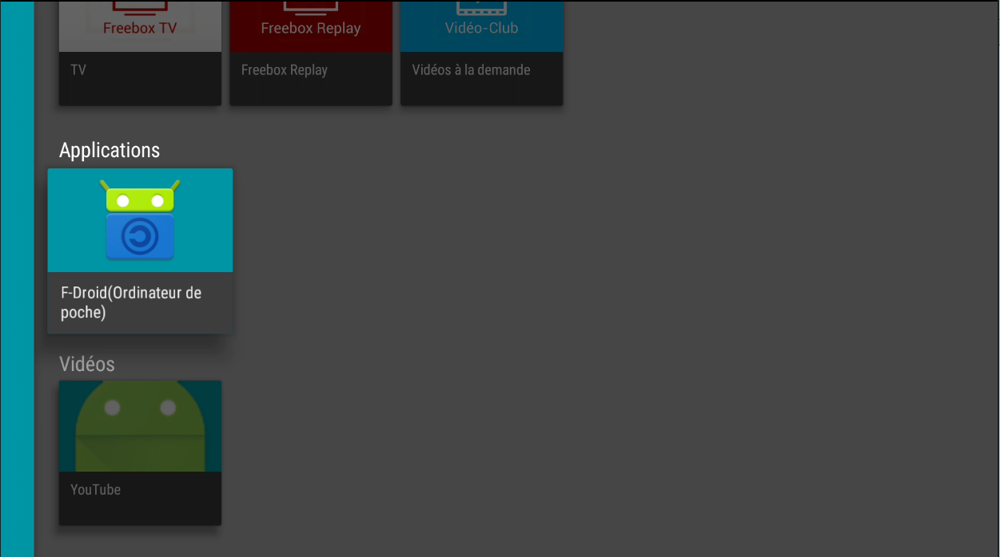{:width="400"}

Désinstaller une application Android via **Paramètres** &rarr; **Applications**

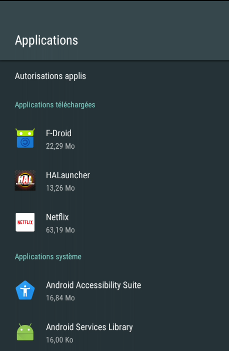{:width="200"}

### Firefox (Android TV) 4.6

[Firefox (Android TV) 4.6](https://www.apkmirror.com/apk/mozilla/firefox-android-tv/firefox-android-tv-4-6-release/firefox-android-tv-4-6-android-apk-download/download/)


## Freebox TV 

### UPnP

[Tuto Univers Freebox: Comment profiter de Freebox TV partout chez vous](https://www.universfreebox.com/article/47926/Tuto-Comment-profiter-de-Freebox-TV-partout-chez-vous) 

#### Paramétrer UPnP,sur "Freebox OS"

*Le but de l'UPnP est de permettre à des périphériques de se connecter aisément et de simplifier la mise en œuvre de réseaux à la maison (partages de fichiers, communications, divertissements) ou dans les entreprises. UPnP le permet en définissant et en publiant les protocoles de commande UPnP au-dessus des standards de communication de l'Internet.*[Universal Plug and Play(Wikipédia)](https://fr.wikipedia.org/wiki/Universal_Plug_and_Play)

Ouvrir "Freebox OS" pour l'activation 

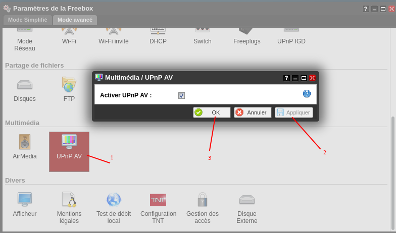{:width="600"}

#### Accéder au serveur et aux chaînes depuis mes appareils

*De nombreux appareils prennent en charge ce protocole. C’est le cas des "smart TV" compatibles UPnP / DLNA et des périphériques où il est possible d’installer un lecteur multimédia complet. Vous pouvez accéder à Freebox TV ou à des bouquets TV crées par vos soins. Si vous souhaitez créer des bouquets TV, vous pouvez suivre la démarche pour la [Freebox mini 4k et la Freebox Révolution](https://www.universfreebox.com/article/31073/Freebox-Revolution-nouveau-systeme-pour-creer-ses-bouquets-TV-et-astuce)*

#### Linux VLC

L'application VLC doit être installée  
Ouvrir VLC 

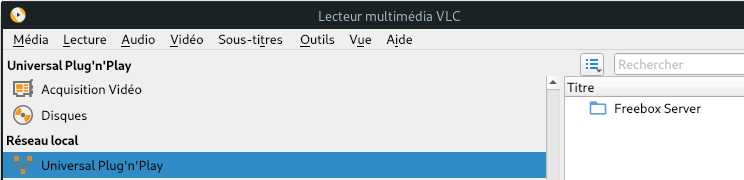{:width="400"}  
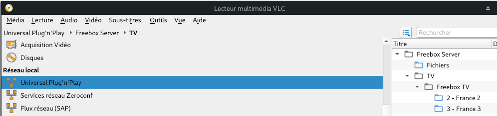{:width="400"}

### direct sur ordinateur (vlc + mafreebox.freebox.fr)

Regarder la TV en direct sur son PC avec Free, on télécharge et on installe le lecteur média VLC dont la dernière version est disponible gratuitement sur son site officiel.

Ensuite, il faut apporter quelques réglages très importants pour pouvoir lire les flux TV directement en streaming dans VLC. Il faut ouvrir les ports 32100 et 32101 du firewall; ouvrir le lecteur média VLC, sélectionner le menu **"Outils"** puis **"Préférences"**, en bas, modifier l'option ***"simple"*** en cliquant sur l'option ***"tous"*** , sélectionner **"Entrée/Codecs"** dans le menu déroulant , **"Démultiplexeurs"** et sélectionner **"RTP/RTSP"** pour mettre le **port client** à droite à **32100** et enfin **"Enregistrer"**.  
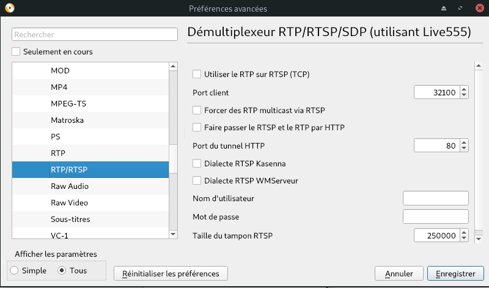{:width="400"}

Une liste de chaînes TV diffusées en live est enregistrée dans une fichier Freetv.m3u, cette liste est offerte gratuitement par l'opérateur Free à ses abonnés et elle est disponible en téléchargement sur le lien suivant: <http://mafreebox.freebox.fr/freeboxtv/playlist.m3u> qui correspond à lèadresse IP de la freebox (ici 192.168.0.254).Pour éviter les problèmes de DNS , ajouter ceci au fichier **/etc/hosts**

    192.168.0.254   mafreebox.freebox.fr

Il suffit d'aller au menu **"Médias"** et sélectionner le menu **"Ouvrir un flux réseau"**.  
Entrer l'url *http://mafreebox.freebox.fr/freeboxtv/playlist.m3u*  
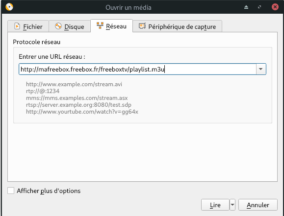{:width="400"}  
Et cliquer sur lire

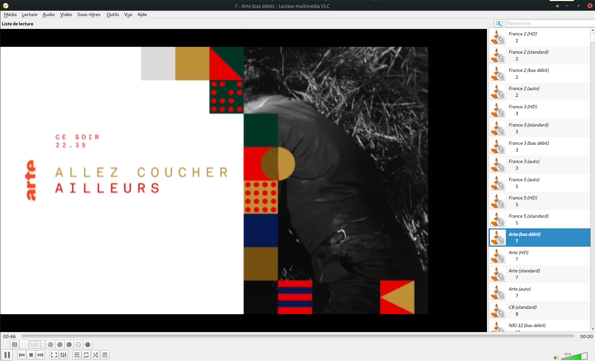{:width="600"}  

Créer un raccourci .desktop (XFCE)

    nano ~/.local/share/applications/menulibre-freebox-tv.desktop

```
[Desktop Entry]
Version=1.1
Type=Application
Name=Freebox TV
Comment=Flux réseau des chaînes
Icon=vlc
Exec=vlc http://mafreebox.freebox.fr/freeboxtv/playlist.m3u
Actions=
Categories=AudioVideo;X-XFCE;X-Xfce-Toplevel;
```

## Télécommande Freebox sur smartphone

* [FreeTelec Télécommande Freebox](https://apkpure.com/fr/freetelec-t%C3%A9l%C3%A9commande-freebox/fr.r0ro.android.FreeTelec) , lien pour télécharger l'application (.apk)

Dans les "options développeur" de votre smartphone, activer le débogage USB  
Connecter votre smartphone à l'ordinateur via un câble USB  
Exécuter les commandes suivantes

```
sudo adb start-server
adb install FreeTelec\ Télécommande\ Freebox_v1.9.5_apkpure.com.apk  # si fenêtre de confirmation sur smartphone, valider
```

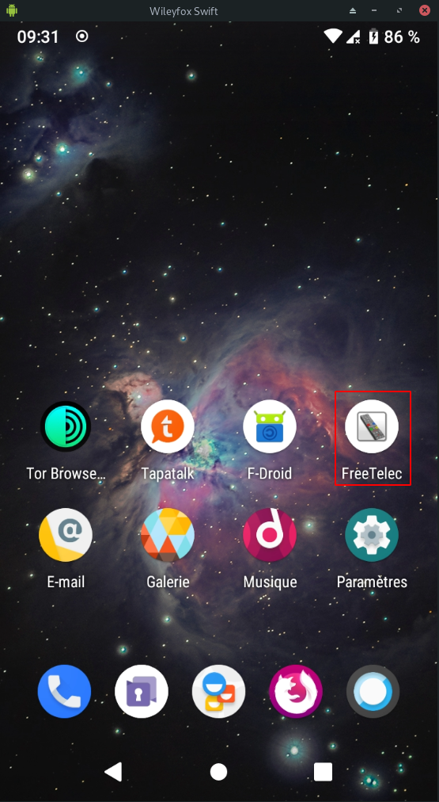{:width="200"}

Ouvrir l'application "FreeTelec

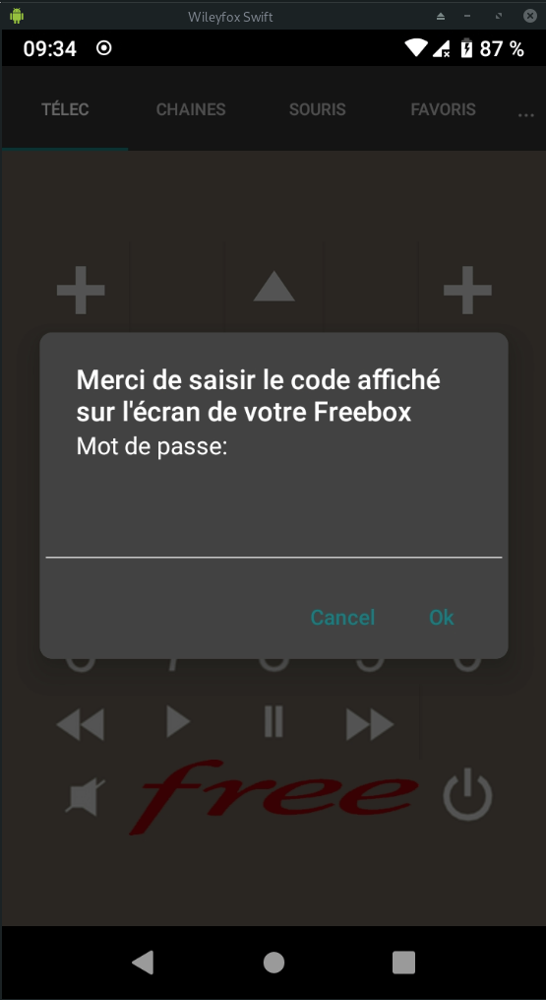{:width="200"}

Sur certains modèles de Freebox, l’appli trouvera automatiquement le code télécommande de votre box. Si ce n’est pas le cas, l’appli vous demandera de l’entrer manuellement. Et pour le trouver, vous devrez disposer… de votre télécommande freebox en état de marche.

Depuis votre téléviseur, appuyez sur le bouton "Home" de votre télécommande puis allez dans  "paramètres"  &rarr; "informations générales". Le code en question sera affiché.

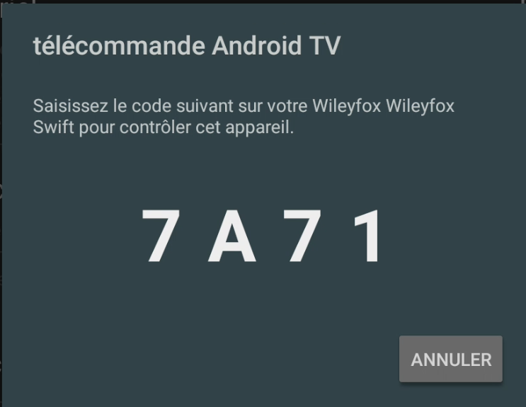{:width="200"}

Une fois le code entré, tout est configuré. Le reflet de la télécommande s’affiche alors sur votre téléphone

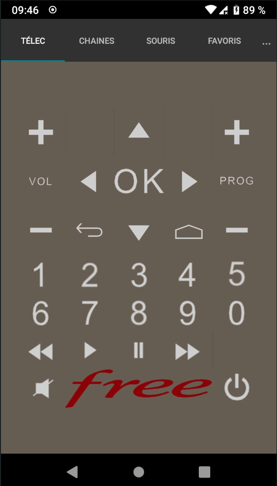{:width="200"} {:width="200"}

