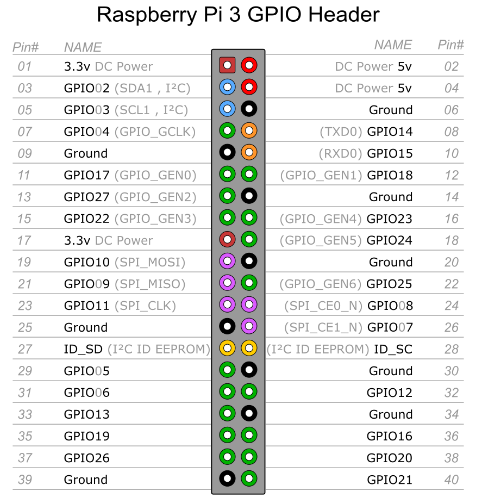
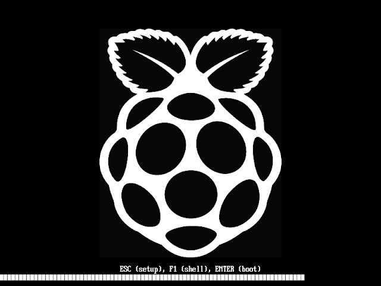
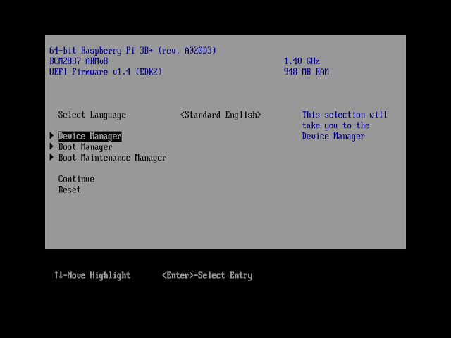

+++
title = 'Raspberry PI 3B - Installer Debian ARM64 sur une Flash Drive USB'
date = 2020-01-05 00:00:00 +0100
categories = ['raspberry']
+++
*Vous ne pouvez pas utiliser une ESP normale sur un Pi Raspberry, car GPT ou une partition MBR de type 0xef ne sont pas gérés par le bootloader du processeur Broadcom...  
On utilise la SDcard ,avec le minimum, pour installer debian desktop buster ARM64 sur le Flash Drive USB.*

* [Installer Debian ARM64 sur un Raspberry Pi 3 en mode UEFI (article original en anglais)](https://pete.akeo.ie/2019/07/installing-debian-arm64-on-raspberry-pi.html)


## Raspberry PI 3B

{:width="300px"}

* Processor 
    * Broadcom BCM2387 chipset.
    * 1.2GHz Quad-Core ARM Cortex-A53 (64Bit)
* 802.11 b/g/n Wireless LAN and Bluetooth 4.1 (Bluetooth Classic and LE)
    * IEEE 802.11 b / g / n Wi-Fi. Protocol: WEP, WPA WPA2, algorithms AES-CCMP (maximum keylength of 256 bits), the maximum range of 100 meters.
    * IEEE 802.15 Bluetooth, symmetric encryption algorithm Advanced Encryption Standard (AES)with 128-bit key, the maximum range of 50 meters.
* GPU
    * Dual Core Video Core IV® Multimedia Co-Processor. Provides Open GL ES 2.0, hardware-acceleratedOpen VG, and 1080p30 H.264 high-profile decode.
    * Capable of 1Gpixel/s, 1.5Gtexel/s or 24GFLOPs with texture filtering and DMA infrastructure
* Memory
    * 1GB LPDDR2
* Operating System
    * Boots from Micro SD card, running a version of the Linux operating system or Windows 10 IoT
* Dimensions
    * 85 x 56 x 17mm
Power
    * Micro USB socket 5V1, 2.5A

Connectors:

* Ethernet
    * 10/100 BaseT Ethernet socket
* Video Output
    * HDMI (rev 1.3 & 1.4)
    * Composite RCA (PAL and NTSC)
* Audio Output
    * Audio Output 3.5mm jack
    * HDMI
    * USB 4 x USB 2.0 Connector
* GPIO Connector
    * 40-pin 2.54 mm (100 mil) expansion header: 2x20 strip
    * Providing 27 GPIO pins as well as +3.3 V, +5 V and GND supply lines
Camera Connector
    * 15-pin MIPI Camera Serial Interface (CSI-2)
* Display Connector
    * Display Serial Interface (DSI) 15 way flat flex cable connector with two data lanes and a clock lane
* Memory Card Slot
    * Push/pull Micro SDIO

{:width="300px"} 

[SPI0 SPI1 Pin Out](https://fr.pinout.xyz/pinout/spi#)

## Samsung USB 3.0 Flash Drive FIT 32GB 

**Samsung USB 3.0 Flash Drive FIT 32GB**  
{:width="100px"}

Préparer le "Flash Drive" avec l'utilitaire **gdisk**

```
Disk /dev/sde: 62652416 sectors, 29.9 GiB
Model: Flash Drive FIT 
Sector size (logical/physical): 512/512 bytes
Disk identifier (GUID): 3D2BB145-06AB-4FC5-B971-3CEA3C34E663
Partition table holds up to 128 entries
Main partition table begins at sector 2 and ends at sector 33
First usable sector is 34, last usable sector is 62652382
Partitions will be aligned on 2048-sector boundaries
Total free space is 2014 sectors (1007.0 KiB)

Number  Start (sector)    End (sector)  Size       Code  Name
   1            2048         1050623   512.0 MiB   8300  Linux filesystem
   2         1050624         1153023   50.0 MiB    EF00  EFI System
   3         1153024         1155071   1024.0 KiB  EF02  BIOS boot partition
   4         1155072        59875327   28.0 GiB    8300  Linux filesystem
   5        59875328        62652382   1.3 GiB     8200  Linux swap
```

## SDcard 

Insérer la   **SDcard** avec son adaptateur USB  sur un des connecteurs USB de l'ordinateur linux   

Repérer sur quel périphérique  

    dmesg

```
[26666.708906]  sde: sde1
[26666.711682] sd 5:0:0:0: [sde] Attached SCSI removable disk
```

La SDcard est sur le périphérique système /dev/sde  

## Debian ARM64

### Téléchargements

* Le dernir fichier ISO d'installation Net Debian ARM64.  
    Vous pouvez le télécharger sur <https://cdimage.debian.org/debian-cd/current/arm64/iso-cd/>
    ( debian-##.#.#-arm64-netinst.iso , 250 Mo). 
* Le dernier binaire du microprogramme UEFI Raspberry Pi 3, ainsi que les fichiers de support du chargeur de démarrage Broadcom (par exemple bootcode.bin , config.txt , fixup.dat , start.elf ).  
Vous pouvez trouver une archive prête à l'emploi avec tout ce qui précède à <https://github.com/pbatard/RPi3/releases>    ( RPi3_UEFI_Firmware_v#.##.zip , 3 Mo).


### Préparer la carte SDcard

Vous pouvez utiliser un outil graphique comme GParted ou des outils en ligne de commande comme fdisk ou parted pour formater le disque et créer la partition requise. Nous utiliserons l'utilitaire parted.

On efface le bloc de boot

    sudo dd if=/dev/zero of=/dev/sdX seek=1 count=2047  # si la première partition commence au secteur 2048

Utilitaire fdisk pour partitionner la SDcard  
<font color="red">TRES IMPORTANT !!! : La partitionon doit être IMPERATIVEMENT de type FAT16<b></b></font>

    sudo fdisk /dev/sde

```
Bienvenue dans fdisk (util-linux 2.34).
Les modifications resteront en mémoire jusqu'à écriture.
Soyez prudent avant d'utiliser la commande d'écriture.


Commande (m pour l'aide) : o
Création d'une nouvelle étiquette pour disque de type DOS avec identifiant de disque 0x1409b79b.

Commande (m pour l'aide) : n
Type de partition
   p   primaire (0 primaire, 0 étendue, 4 libre)
   e   étendue (conteneur pour partitions logiques)
Sélectionnez (p par défaut) : 

Utilisation de la réponse p par défaut.
Numéro de partition (1-4, 1 par défaut) : 
Premier secteur (2048-15759359, 2048 par défaut) : 
Dernier secteur, +/-secteurs ou +/-taille{K,M,G,T,P} (2048-15759359, 15759359 par défaut) : +700M

Une nouvelle partition 1 de type « Linux » et de taille 700 MiB a été créée.

Commande (m pour l'aide) : t
Partition 1 sélectionnée
Code Hexa (taper L pour afficher tous les codes) :6
Type de partition « Linux » modifié en « FAT16 ».

Commande (m pour l'aide) : a
Partition 1 sélectionnée
L’indicateur d’amorçage de la partition 1 est maintenant activé.

Commande (m pour l'aide) : p
Disque /dev/sde : 7,53 GiB, 8068792320 octets, 15759360 secteurs
Modèle de disque : STORAGE DEVICE  
Unités : secteur de 1 × 512 = 512 octets
Taille de secteur (logique / physique) : 512 octets / 512 octets
taille d'E/S (minimale / optimale) : 512 octets / 512 octets
Type d'étiquette de disque : dos
Identifiant de disque : 0x1409b79b

Périphérique Amorçage Début     Fin Secteurs Taille Id Type
/dev/sde1    *         2048 1435647  1433600   700M  6 FAT16

Commande (m pour l'aide) : w
La table de partitions a été altérée.
Appel d'ioctl() pour relire la table de partitions.
Synchronisation des disques.
```

Formatez la partition de démarrage en FAT16 :

    sudo mkfs.vfat -F 16 /dev/sde1

```
mkfs.fat 4.1 (2017-01-24)
```

### Copie des fichiers de l'OS Debian ARM64

Maintenant que la carte SD est partitionnée, nous allons monter les partitions et copier les données du fichier tar téléchargé.

Montage sdcard

    sudo mkdir -p /mnt/sdcard
    sudo mount /dev/sde1 /mnt/sdcard

Extraire "binaire du microprogramme UEFI Raspberry Pi 3..."

    sudo unzip RPi3_UEFI_Firmware_v1.14.zip -d /mnt/sdcard
    sync

Extraire image iso 

    sudo mount -o loop debian-10.2.0-arm64-xfce-CD-1.iso /mnt/temp
    sync


copie de l'image sur la SDcard

    sudo cp -a /mnt/temp/* /mnt/sdcard/
    sync

NE PAS TENIR COMPTE DES MESSAGES

```
[...]
cp: impossible de créer le lien symbolique '/mnt/temp/doc/FAQ/html/contributing.html': Opération non permise
cp: impossible de créer le lien symbolique '/mnt/temp/doc/FAQ/html/customizing.html': Opération non permise
cp: impossible de créer le lien symbolique '/mnt/temp/doc/FAQ/html/faqinfo.html': Opération non permise
cp: impossible de créer le lien symbolique '/mnt/temp/doc/FAQ/html/ftparchives.html': Opération non permise
[...]
```

Une fois terminé, démontez les partitions :

    sudo umount /mnt/temp
    sudo umount /mnt/sdcard

Vous avez un OS Debian ARM64 bootable sur votre carte SD.

Une fois que vous avez terminé les étapes ci-dessus, éjectez votre carte SD, insérez-la dans votre Pi 3 , connecter clavier souris et allumez-la. Assurez-vous qu'aucun autre support n'est branché à part la carte SD. Surtout, assurez-vous qu'aucun lecteur flash USB ou disque dur USB n'est connecté.

{:width="400"}

Accès à la configuration du firmware UEFI en appuyant sur la touche Esc une fois que vous voyez le logo Raspberry et ensuite d'aller dans le **Raspberry Pi Configuration** &rarr; **Chipset Configuration** &rarr; **CPU Clock Rate (MHz)** pour régler l'horloge du CPU sur Max, car le firmware limite par défaut l'horloge du CPU à 600 MHz, ce qui est lent.  
Vous pouvez également définir votre propre fréquence CPU dans le même menu, valider par touche F10 (SAVE) et Esc.

{:width="400"}

Une fois que vous avez fait cela, choisissez **Reset** et laissez le processus de démarrage se dérouler jusqu'à ce que vous voyiez le menu GNU GRUB pour l'installateur Debian.

### Menu installation debian


* Choisir le ***Dark Theme opyion...***  
* Dans le menu GNU GRUB, choisissez *Install (qui devrait déjà être la valeur par défaut) et laissez le processus de l'installateur Debian démarrer.
*  Sélectionnez votre langue, votre pays et votre clavier et laissez le programme d'installation continuer jusqu'à ce qu'il signale <font color="red"><b>Aucun lecteur de CD-ROM commun n'a été détecté</b></font>.
    *  A ce stade, à l'étape ***Faut-il charger les pilotes de lecteurs de CD-ROM à partir d'un support amovible ?***, sélectionnez `Non`
    *  ***Voulez vous choisir le module et le périphérique du lecteur CD-ROM*** , `Oui`
    *  Sur ***Module pour le lecteur CD-ROM*** sélectionnez `none`
    *  Dans ***Fichier de périphérique pour le lecteur de CD-ROM*** tapez exactement ce qui suit :
        *  `-t vfat -o rw /dev/mmcblk0p1`
        *  Pourquoi avons-nous besoin d'utiliser `-t vfat -o rw /dev/mmcblk0p1` comme périphérique de CD-ROM ?
             *    Pourquoi ce nom de périphérique bizarre avec des options ? Parce que ce sont en fait des paramètres de la ligne de commande de montage et que l'installateur Debian appelle en fait mount dans les coulisses et lui fournit exactement ce que nous écrivons ici. Cela signifie que nous pouvons détourner le champ du nom du périphérique pour invoquer les paramètres de montage supplémentaires dont nous avons besoin.
             *    Pourquoi /dev/mmcblk0p1 ? C'est simplement le nom du périphérique pour la première partition (p1) sur le média SD/MMC (mmcblk0) tel que vu par le noyau Linux sur un Pi Framboise.
              *    Pourquoi -t vfat ? Parce que l'installateur Debian ajoute fstype=iso9660 à l'option de montage, ce qui empêche le montage automatique et nous force à surcharger le type de système de fichiers.
              *    Pourquoi -o rw ? Parce que l'installateur Debian ne pourra pas utiliser la première partition pour /boot/efi sinon ou charger le microprogramme WLAN depuis le média (vous avez un périphérique ou une ressource occupée lorsque vous essayez de remonter le média).
*     Avec le périphérique "CD-ROM" réglé, laissez le processus d'installation se dérouler et récupérez les paquets de base du support jusqu'à ce qu'il vous demande les fichiers de micrologiciel non libres sur la détection du matériel réseau. Si vous prévoyez d'utiliser la connexion câblée, vous pouvez sauter l'étape (facultative) ci-dessous.
    * (Facultatif) Si vous prévoyez d'utiliser le WLAN pour l'installation, choisissez Oui pour Charger les microprogrammes manquants à partir des supports amovibles. Si vous avez créé le support à partir de l'archive de micrologiciel Raspberry Pi 3 liée ci-dessus, les fichiers de micrologiciel pertinents seront détectés sous le répertoire firmware/.

>Remarque: Comme il y a plusieurs fichiers à charger, vous serez invité plusieurs fois à choisir différents fichiers de microprogramme (regardez bien leurs noms, vous verrez qu'ils sont en fait différents). Ceci est normal.A la question **"Faut-il charger le microcode manquant depuis un support amovible ?"** , sélectionner `<Oui>` pour chaque nouveau fichier.

*    ***Configurer le réseau*** , on en profite pour insérer la **Samsung USB 3.0 Flash Drive FIT 32GB** sur l'un des ports USB de la raspberry qui servira de "disque dur" pour y installer debian...   
Configurez votre réseau comme demandé par l'installateur en choisissant (optionnellement) l'interface réseau que vous voulez utiliser pour l'installation et (aussi optionnellement) en configurant votre point d'accès et vos identifiants si vous utilisez le Wifi.
*    Passez en revue le nom d'hôte, root (root/ytreuiop) l'utilisateur/mot de passe (tyu/tyughj) et personnalisez-les comme vous le souhaitez.
*    Laissez l'installateur continuer jusqu'à ce que vous arriviez à l'écran **Partitionner les disques**. Là, pour la méthode de partitionnement, sélectionnez **Manuel**. Vous devriez voir quelque chose comme ceci :

```
MMC/SD card #1 (mmcblk0) - 8.1 GB SD 2WCGO
     n°1  primary  734.0 MB  B  K  ESP
          pri/log    7.3 GB        Espace libre
SCSI1 (0,0,0) (sda) - 32.1 GB Samsung Flash Drive FIT          
          pri/log     32.1 GB        Espace libre
```

<font color="red"><b>Si "ESP" n'apparaît pas, la SDcard est mal partitionnée !  
INUTILE DE POURSUIVRE...</b></font>

* Partitionner la **Samsung USB 3.0 Flash Drive FIT 32GB**
    * Partition "swap" 
        * Se positionner sur ***pri/log 32.1 GB Espace libre*** , "Entrée"
        * ***Créer une nouvelle partition*** , "Entrée"
        * ***Nouvelle taille de la partition :*** , saisir `2 GB` , "Entrée"
        * ***Type de la nouvelle partition :*** `Primaire` , "Entrée"
        * ***Emplacement de la nouvelle partition :*** `Début` , "Entrée"
        * ***Utiliser comme :*** , "Entrée" , `espace d'échange ("swap")` , "Entrée"
     * ***Fin du paramétrage de cette partition*** , "Entrée"
    * Partition "racine" 
        * Se positionner sur ***pri/log 32.1 GB Espace libre*** , "Entrée"
        * ***Créer une nouvelle partition*** , "Entrée"
        * ***Nouvelle taille de la partition :***  , "Entrée"
        * ***Type de la nouvelle partition :*** `Primaire` , "Entrée"
        * ***Utiliser comme :*** , "Entrée" , `Système de fichiers journalisé ext4` , "Entrée"
        * ***Point de montage :*** / (racine)
        * ***Fin du paramétrage de cette partition*** , "Entrée"
* ***Terminer le partitionnement at appliquer les changements***
* ***Faut-il appliquer les changements sur les disques ?*** `Oui` , "Entrée"  
* Poursuite de l'installation...
*    Lorsque le "sondage sur l'utilisation des paquets" vous sera demandé, choisissez l'option qui vous convient le mieux.
*    Enfin, sur l'écran de sélection des logiciels, sélectionnez tout autre logiciel que vous souhaitez installer.  Xfce +  serveur SSH + fichiers systèmes
*    Laissez le processus finaliser l'installation du logiciel et du chargeur d'amorçage GRUB et sélectionnez `Continuer` pour redémarrer votre machine à l'invite ***L'installation est terminée...***


><font color="green"><b>Si la procédure s'est bien déroulée correctement, votre système va maintenant démarrer sur ARM64 Debian</b></font>

###  Correctifs post-installation

Voici quelques éléments que vous pourriez vouloir corriger après l'installation :

* Vous pouvez trouver un lecteur de cdrom0 sur votre bureau, qui ne semble pas être accessible. C'est un reste du processus d'installation qui ne sait pas comment gérer le périphérique de média d'installation. Vous devriez éditer **/etc/fstab** pour le supprimer.
* Si vous avez installé le paquet **cups**, vous pouvez obtenir une erreur lors du chargement des modules (**systemctl --failed** signalera que **systemd-modules-load.service** est dans un état d'échec). Tout ceci est dû au paquet cups actuel qui essaie de charger des modules du noyau IBM PC... sur un périphérique non PC. Pour corriger cela, **supprimez simplement /etc/modules-load.d/cups-filters.conf** et redémarrez.
*  Si vous utilisez le firmware UEFI v1.6 ou supérieur, vous pouvez activer la console série en éditant **/etc/default/grub** et en changeant `GRUB_CMDLINE_LINUX=""` en `GRUB_CMDLINE_LINUX="console=ttyS0,115200"`, puis en lançant `update-grub`
    *  Vous pouvez aussi activer l'accès à la console série pour GRUB en ajoutant ce qui suit dans le même fichier :

```
    GRUB_TERMINAL=serial 
    GRUB_SERIAL_COMMAND="serial --unit=0 --speed=115200 --stop=1" 
```

Faire une copie de la clé "flash Drive 32G"

Insérer la clé ,relever son périphérique

    dmesg

```
[ 1347.528730] sd 5:0:0:0: [sde] Attached SCSI removable disk
```

Créer une image de la clé

    sudo dd if=/dev/sde of=usb-32g-debian-arm64.img bs=4M status=progress

