+++
title = 'VirtualBox'
date = 2020-01-17 00:00:00 +0100
categories = ['virtuel']
+++
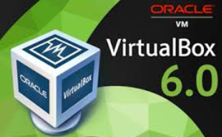{:width="200px"}

## Liens

* [How to Install Oracle VirtualBox On Ubuntu 18.04.2 LTS Headless Server](https://www.ostechnix.com/install-oracle-virtualbox-ubuntu-16-04-headless-server/)
* [How to Install VirtualBox 6 on Debian 10](https://www.tecmint.com/install-virtualbox-on-debian-10/)
* [How to set up a VirtualBox server in Debian 9: web interface, autostart, backup](https://vorkbaard.nl/how-to-set-up-a-virtualbox-server-in-debian-9-web-interface-autostart-backup/)
* [Managing A Headless VirtualBox Installation With phpvirtualbox On nginx (Ubuntu 12.04)](https://www.howtoforge.com/managing-a-headless-virtualbox-installation-with-phpvirtualbox-on-nginx-ubuntu-12.04) 


## VirtualBox sur Archlinux

*VirtualBox (ou VBox) est un produit pour la virtualisation d'un environnement 32 (x86) ou 64 bits (AMD64/Intel64) et il est aussi valable pour le milieu de l'entreprise que pour les particuliers. Il supporte un nombre important de systèmes d'exploitation, propose une interface graphique (Qt / SDL) de même qu'une interface en ligne de commande.*

VirtualBox offre des performances plus basses par-rapport à [qemu-kvm](https://wiki.archlinux.fr/Qemu).  

[VirtualBox Archlinux (fr)](https://wiki.archlinux.fr/VirtualBox)

### Etapes d'installation pour les hôtes Arch Linux

Pour lancer les machines virtuelles VirtualBox sur votre machine Arch Linux, suivez ces étapes d'installation.
Installer les paquets de base

Installez le paquet [virtualbox](https://www.archlinux.org/packages/?name=virtualbox). Vous devrez choisir un package pour fournir les modules hôtes :

*    pour le noyau [linux](https://www.archlinux.org/packages/?name=linux) choisissez [virtualbox-host-modules-modules-arch](https://www.archlinux.org/packages/?name=virtualbox-host-modules-arch)
*    pour les autres [noyaux](https://wiki.archlinux.org/index.php/Kernels) choisissez [virtualbox-host-dkms](https://www.archlinux.org/packages/?name=virtualbox-host-dkms)

Pour compiler les modules VirtualBox fournis par [virtualbox-host-dkms](https://www.archlinux.org/packages/?name=virtualbox-host-dkms), il sera également nécessaire d'installer le(s) paquet(s) d'en-têtes approprié(s) pour le(s) noyau(s) installé(s) (par exemple, [linux-lts-headers](https://www.archlinux.org/packages/?name=linux-lts-headers) pour [linux-lts](https://www.archlinux.org/packages/?name=linux-lts)).  
Lorsque VirtualBox ou le noyau est mis à jour, les modules du noyau seront automatiquement recompilés grâce au DKMS Pacman hook.

### Modules de signalisation

Lorsque vous utilisez un noyau personnalisé avec l'option **CONFIG_MODULE_SIG_FORCE** activée, vous devez signer vos modules avec une clé générée pendant la compilation du noyau.

Naviguez jusqu'au dossier de l'arborescence du noyau et exécutez la commande suivante :

    # for module in `ls /lib/modules/$(uname -r)/kernel/misc/{vboxdrv.ko,vboxnetadp.ko,vboxnetflt.ko,vboxpci.ko}` ; do ./scripts/sign-file sha1 certs/signing_key.pem certs/signing_key.x509 $module ; done

>Note : L'algorithme de hachage ne doit pas nécessairement correspondre à celui configuré, mais il doit être intégré dans le noyau.

### Charger les modules du noyau VirtualBox

[virtualbox-host-modules-modules-arch](https://www.archlinux.org/packages/?name=virtualbox-host-modules-arch) et [virtualbox-host-dkms](https://www.archlinux.org/packages/?name=virtualbox-host-dkms) utilisent **systemd-modules-load.service** pour charger les quatre modules VirtualBox automatiquement au démarrage. Pour les modules à charger après l'installation, redémarrez ou chargez les modules une fois manuellement.

>Note : **Si vous ne voulez pas que les modules VirtualBox soient automatiquement chargés au démarrage**, vous devez masquer le fichier */usr/lib/modules-load.d/virtualbox-host-modules-arch.conf* (ou */usr/lib/modules-load.d/virtualbox-host-dkms.conf*) en créant un fichier vide (ou symlink vers /dev/null) avec le même nom dans /etc/modules-load.d/.

Parmi les [modules du noyau](https://wiki.archlinux.org/index.php/Kernel_modules) utilisés par VirtualBox, il y a un module obligatoire nommé `vboxdrv`, qui doit être chargé avant que les machines virtuelles puissent fonctionner.

Pour charger le module manuellement, exécutez :

    # modprobe vboxdrv

Les modules suivants ne sont nécessaires que dans les configurations avancées :

*    `vboxnetadp` et `vboxnetflt` sont tous deux nécessaires lorsque vous avez l'intention d'utiliser la fonction de mise en [réseau pontée (bridged)](https://www.virtualbox.org/manual/ch06.html#network_bridged) ou [hôte uniquement (host-only networking)](https://www.virtualbox.org/manual/ch06.html#network_hostonly). Plus précisément, vboxnetadp est nécessaire pour créer l'interface hôte dans les préférences globales de VirtualBox, et vboxnetflt est nécessaire pour lancer une machine virtuelle utilisant cette interface réseau.
*    `vboxpci` est nécessaire lorsque votre machine virtuelle doit passer par un périphérique PCI sur votre hôte.

>Note : Si les modules du noyau VirtualBox ont été chargés dans le noyau pendant la mise à jour des modules, vous devez les recharger manuellement pour utiliser la nouvelle version mise à jour. Pour ce faire, lancez `vboxreload` en tant que root.


### Accéder aux périphériques USB hôtes dans guest

Pour utiliser les ports USB de votre machine hôte dans vos machines virtuelles, ajoutez les utilisateurs qui seront autorisés à utiliser cette fonctionnalité au [groupe d'utilisateurs](https://wiki.archlinux.org/index.php/User_group) **vboxusers**.

### Disque d'ajouts d'invités

Il est également recommandé d'installer le paquet [virtualbox-guest-iso](https://www.archlinux.org/packages/?name=virtualbox-guest-iso) sur l'hôte exécutant VirtualBox. Ce paquet agira comme une image disque qui peut être utilisée pour installer les ajouts d'invités sur des systèmes invités autres qu'Arch Linux. Le fichier **.iso** sera situé dans **/usr/lib/virtualbox/additions/VBoxGuestAdditions.iso**, et devra peut-être être monté manuellement dans la machine virtuelle. Une fois monté, vous pouvez exécuter l'installateur d'ajouts d'invités à l'intérieur de l'invité.

### Kit d'extension

Oracle Extension Pack offre des [fonctionnalités supplémentaires](https://www.virtualbox.org/manual/ch01.html#intro-installing) et est disponible sous une licence non-libre uniquement pour un usage personnel. Pour l'installer, le paquet [virtualbox-ext-oracleAUR](https://aur.archlinux.org/packages/virtualbox-ext-oracle/) est disponible, et une version pré-installée peut être trouvée dans le dépôt [seblu](https://wiki.archlinux.org/index.php/Unofficial_user_repositories#seblu).

Si vous préférez utiliser la méthode traditionnelle et manuelle : téléchargez l'extension manuellement et installez-la via l'interface graphique (Fichier > Préférences > Extensions) ou via `VBoxManage extpack install <.vbox-extpack>`, assurez-vous que vous avez un toolkit comme [Polkit](https://wiki.archlinux.org/index.php/Polkit) pour accorder un accès privilégié à VirtualBox. L'installation de cette extension nécessite un [accès root](https://www.virtualbox.org/ticket/8473).

### Faces avant (Front-ends)

VirtualBox est livré avec trois frontaux :

*    Si vous voulez utiliser VirtualBox avec l'interface graphique standard, utilisez `VirtualBox`.
*    Si vous voulez lancer et gérer vos machines virtuelles depuis la ligne de commande, utilisez la commande `VBoxSDL`, qui ne fournit qu'une simple fenêtre pour la machine virtuelle sans aucun recouvrement.
*    Si vous souhaitez utiliser VirtualBox sans exécuter d'interface graphique (par exemple sur un serveur), utilisez la commande `VBoxHeadless`. Avec l'extension VRDP, vous pouvez toujours accéder à distance aux affichages de vos machines virtuelles.

Enfin, vous pouvez également utiliser [phpVirtualBox](https://wiki.archlinux.org/index.php/PhpVirtualBox) pour administrer vos machines virtuelles via une interface web.

Reportez-vous au [manuel VirtualBox](https://www.virtualbox.org/manual) pour savoir comment créer des machines virtuelles.

>**Avertissement** : Si vous avez l'intention de stocker des images de disque virtuel sur un système de fichiers Btrfs, avant de créer des images, vous devriez envisager de désactiver la fonction de copie sur écriture pour le répertoire de destination de ces images.

## VirtualBox sur Debian 9 (Stretch)

La VirtualBox est la plateforme de virtualisation la plus utilisée par les utilisateurs. C'est un hyperviseur gratuit et open source pour les ordinateurs x86. Vous pouvez facilement installer VirtualBox sur un système Debian Linux en quelques étapes simples.

### Pré-requis

Connectez-vous à votre serveur Debian avec un utilisateur root ou sudo  et mettez à jour les paquets actuels de votre système avec la dernière version.

    sudo apt-get update
    sudo apt-get upgrade

### Ajouter le dépôt (PPA) VirtualBox

Maintenant, vous devez ajouter Oracle VirtualBox PPA au système. Vous pouvez le faire en exécutant la commande ci-dessous sur votre système.

    echo "deb http://download.virtualbox.org/virtualbox/debian stretch contrib" | sudo tee /etc/apt/sources.list.d/virtualbox.list

Cette commande créera un fichier  /etc/apt/sources.list.d/virtualbox.list

### Importer la clé publique Oracle

Après avoir ajouté le référentiel apt requis sur votre système, téléchargez et importez la clé publique Oracle pour apt-secure en utilisant les commandes suivantes.

    wget -q https://www.virtualbox.org/download/oracle_vbox_2016.asc -O- | sudo apt-key add -
    wget -q https://www.virtualbox.org/download/oracle_vbox.asc -O- | sudo apt-key add -

### Installer VirtualBox sur Debian

Vous êtes maintenant prêt à installer VirtualBox sur un système Debian. Exécutez les commandes suivantes sur le terminal pour terminer l'installation de VirtualBox sur un système Debian.

    sudo apt-get update
    sudo apt-get installer virtualbox-6.0

### Lancer VirtualBox

Nous pouvons utiliser le lien de lancement sur votre système de bureau pour démarrer VirtualBox ou simplement utiliser la commande depuis un terminal.

    virtualbox


## Machines virtuelles VirtualBox en ligne de commande (VBoxManage)

La virtualisation est aujourd'hui une composante majeure de l'industrie informatique. Nous pouvons constater que la virtualisation gagne en popularité dans les domaines du serveur, du réseau et du stockage. Pour répondre aux besoins des utilisateurs, de nombreuses solutions de virtualisation open source ont vu le jour, dont Oracle VirtualBox.

Dans cet article, nous aborderons l'utilitaire `VBoxManage` utilisé pour gérer VirtualBox à partir d'une interface de ligne de commande. Voici la syntaxe de l'utilitaire VBoxManage

    $ VBoxManage [<option générale>] <commande> 

Dans la commande ci-dessus, l’option générale peut être le mode commenté, supprimer le logo, le fichier de réponses, etc.

### VBoxGérer list

La commande liste donne des informations pertinentes sur votre système et des informations sur les paramètres actuels d'Oracle VM VirtualBox.

Les sous-commandes suivantes sont disponibles avec la commande `VBoxManage list` :

* **vms** : Liste toutes les machines virtuelles actuellement enregistrées avec Oracle VM VirtualBox. Par défaut, cela affiche une liste compacte avec le nom et l'UUID de chaque VM. Si vous spécifiez également --long ou -l, cette liste sera détaillée comme avec la commande showvminfo
* **runningvms** : Liste toutes les machines virtuelles en cours d'exécution par leurs identifiants uniques (UUIDs) dans le même format qu'avec vms.
* **ostypes** : Liste tous les systèmes d'exploitation invités actuellement connus d'Oracle VM VirtualBox, ainsi que les identifiants utilisés pour s'y référer avec la commande modifyvm.
* **hostdvds, hostfloppies** : Liste les interfaces DVD, disquette, mise en réseau pontée et mise en réseau de l'hôte uniquement sur l'hôte, ainsi que le nom utilisé pour y accéder à partir d'Oracle VM VirtualBox.
* **intnets** : Affiche des informations sur les réseaux internes.
* **bridgedifs, hostonlyifs, natnets, dhcpservers** : Liste les interfaces réseau pontées, les interfaces réseau hôtes uniquement, les interfaces réseau NAT et les serveurs DHCP actuellement disponibles sur l'hôte.
* **hostinfo** : Affiche des informations sur le système hôte, telles que les CPU, la taille de la mémoire et la version du système d'exploitation.
* **hostcpuids** : Liste les paramètres CPUID pour les CPU hôtes. Ceci peut être utilisé pour une analyse plus fine des capacités de virtualisation de l'hôte.
* **hddbackends** : Liste tous les back-ends de disques virtuels connus d'Oracle VM VirtualBox. Pour chacun de ces formats, tels que VDI, VMDK ou RAW, cette sous-commande liste les capacités et la configuration du back-end.
* **hdds, dvds, floppies** : Affiche des informations sur les images de disque virtuel actuellement utilisées par Oracle VM VirtualBox, y compris tous leurs paramètres, les identificateurs uniques (UUID) qui leur sont associés par Oracle VM VirtualBox et tous les fichiers qui y sont associés. C'est l'équivalent en ligne de commande du Virtual Media Manager. Voir Section 5.3, "Le gestionnaire de médias virtuels".
* **usbhost** : Affiche des informations sur les périphériques USB connectés à l'hôte, y compris des informations utiles pour la construction de filtres USB et si ceux-ci sont actuellement utilisés par l'hôte.
* **usbfilters** : Liste tous les filtres USB globaux enregistrés avec Oracle VM VirtualBox et affiche les paramètres du filtre. Les filtres USB globaux sont pour les périphériques qui sont accessibles à toutes les machines virtuelles.
* **systemproperties** : Affiche certains paramètres globaux d'Oracle VM VirtualBox, tels que la taille minimale et maximale de la RAM et du disque dur virtuel invités, les paramètres du dossier et la bibliothèque d'authentification actuellement utilisée.
* **extpacks** : Affiche tous les packs d'extension Oracle VM VirtualBox actuellement installés. Voir Section 1.6, "Installation d'Oracle VM VirtualBox et des Extension Packs" et Section 7.43, "VBoxManage extpack".
* **groups** : Affiche les détails des groupes VM. Voir Section 1.10, "Utilisation des groupes VM".
* **webcams** : Affiche une liste des webcams attachées à la machine virtuelle en cours d'exécution. Le format de sortie est une liste de chemins absolus ou d'alias qui ont été utilisés pour attacher les webcams à la VM en utilisant la commande Attacher la webcam.
* **screenshotformats** : Affiche une liste des formats de capture d'écran disponibles.
* **cloudproviders** : Affiche une liste des fournisseurs de cloud qui sont pris en charge par Oracle VM VirtualBox. Oracle Cloud Infrastructure est un exemple de fournisseur de cloud computing.
* **cloudprofiles** : Affiche une liste des profils de nuages qui ont été configurés.


### Créer une VM en utilisant VBoxManage

Pour créer une machine virtuelle, nous devons utiliser la commande `createvm` avec VBoxManage. Voici la syntaxe 

```
createvm     --name <name>
              [--groups <group>, ...]
              [--ostype <ostype>]
              [--register]
              [--basefolder <path>]
              [--uuid <uuid>]
```

Nous pouvons lister les types de système d'exploitation supportés en utilisant la commande ci-dessous:

    VBoxManage list ostypes 

Créons Ubuntu-64 vm à partir de la CLI:

    VBoxManage createvm --name ubuntu-server --ostype Ubuntu_64 --register

Lorsque vous exécutez la commande ci-dessus, il générera le résultat suivant:

```
Virtual machine 'ubuntu-server' is created and registered.
UUID: 7433725a-f314-44c7-8625-91d61cc6125d
Settings file: '/home/linux-techi/VirtualBox VMs/ubuntu-server/ubuntu-server.vbox'
```

Nous pouvons maintenant voir la nouvelle machine virtuelle créée dans VirtualBox Manager

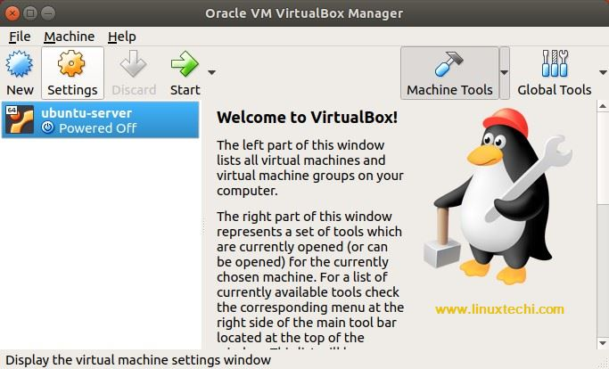{:width="500"}

### Mettre à jour la VM

Nous avons créé une VM à partir de la CLI. Mais cette machine virtuelle n’est pas utilisable en l'état. Nous pouvons le rendre utilisable en attribuant une carte réseau, en allouant de la mémoire et en y attachant un disque.

### Créer un réseau via VBoxManage

Pour créer un réseau ponté (bridged network), exécutez les deux commandes suivantes:

    VBoxManage modifyvm ubuntu-server --bridgeadapter1 vmnet1
    VBoxManage modifyvm ubuntu-server --nic1 bridged

Dans l'exemple ci-dessus, j'ai utilisé le réseau vmnet1. Il est créé par défaut lors de l'installation d'Oracle VirtualBox.

### Allouer de la mémoire

Pour allouer de la mémoire, exécutez la commande suivante:

    VBoxManage modifyvm ubuntu-server --memory 2048

### Créer un disque dur

Pour créer un disque dur, exécutez la commande suivante:

    VBoxManage createhd --filename VirtualBox\ VMs/ubuntu-server/ubuntu-server.vdi --size 10000 --format VDI

Lorsque vous exécutez la commande ci-dessus, il générera la sortie suivante:

```
0%...10%...20%...30%...40%...50%...60%...70%...80%...90%...100%
Medium created. UUID: 5f530d25-da57-4030-bf56-32d5a29c91b5
```

>Cette commande créera un disque dur virtuel. À l'heure actuelle, il n'est associé à aucune machine virtuelle.

### Ajouter un contrôleur SATA

Dans la section précédente, nous avons créé un disque dur virtuel. Nous avons besoin d’un contrôleur SATA pour connecter ce disque. La commande ci-dessous crée un contrôleur SATA.

    VBoxManage storagectl ubuntu-server --name "SATA Controller" --add sata --controller IntelAhci

### Attacher le disque virtuel au controleur SATA

Nous avons maintenant un contrôleur SATA et un disque dur virtuel. Attacher le disque virtuel au contrôleur SATA  

    VBoxManage storageattach ubuntu-server --storagectl "SATA Controller" --port 0 --device 0 --type hdd --medium VirtualBox\ VMs/ubuntu-server/ubuntu-server.vdi

### Ajouter un contrôleur IDE pour les images ISO

Après création de la machine virtuelle ,il faut installer un système d'exploitation à partir d'une image ISO. Ajoutons donc le contrôleur IDE en utilisant la commande suivante:

    VBoxManage storagectl ubuntu-server --name "IDE Controller" --add ide --controller PIIX4

### Joindre une image ISO au contrôleur IDE

Pour attacher une image ISO au contrôleur IDE, exécutez la commande suivante:

    VBoxManage storageattach ubuntu-server --storagectl "IDE Controller" --port 1 --device 0 --type dvddrive --medium /home/linux-techi/ubuntu-18.04-desktop-amd64.iso

### Démarrer la VM

La VM est configurée et prête pour l'installation. Démarrer la VM en utilisant la commande suivante

    VBoxManage startvm ubuntu-server

Cette commande ouvrira VirtualBox Manager à partir duquel l'installation du système d'exploitation peut être effectuée.

### Arrêter la VM

    VboxManage controlvm ubuntu-server poweroff

### Travailler avec des instantanés (snapshots)

Snapshot est une copie ponctuelle de la machine virtuelle. Nous pouvons prendre un instantané en utilisant la commande suivante:

    VBoxManage snapshot ubuntu-server take "first-snapshot"

Lorsque vous exécutez la commande ci-dessus, il générera la sortie suivante:

```
0%...10%...20%...30%...40%...50%...60%...70%...80%...90%...100%
Snapshot taken. UUID: cd5dadc1-dd8f-427e-a6b8-5a3e93307ef9
```

Nous pouvons voir cet instantané dans le gestionnaire VirtualBox:

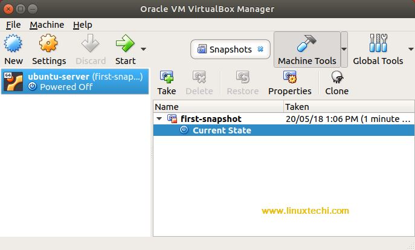{:width="500"}

Pour revenir à l'instantané, exécutez la commande suivante:

    VBoxManage snapshot ubuntu-server restore "first-snapshot"

Lorsque vous exécutez la commande ci-dessus, il générera la sortie suivante:

```
Restoring snapshot ' first-snapshot' (cd5dadc1-dd8f-427e-a6b8-5a3e93307ef9)
0%...10%...20%...30%...40%...50%...60%...70%...80%...90%...100%
```

### Supprimer la VM

Pour supprimer la machine virtuelle, exécutez la commande suivante:

    VBoxManage unregistervm ubuntu-server --delete

Lorsque vous exécutez la commande ci-dessus, il générera le résultat suivant:

    0%...10%...20%...30%...40%...50%...60%...70%...80%...90%...100%

>Veuillez noter que cette commande supprimera tous les fichiers de la machine virtuelle (fichiers de configuration ainsi que les disques durs virtuels) du système.

### Dupliquer un disque en changeant son format (VMDK => VDI)

    VBoxManage clonemedium MonDisque.vmdk --format VDI MonDisqueDuplique.vdi

### Agrandir un disque virtuel VDI

Vous avez prévu un disque top petit ? Voici comment agrandir le disque (ici avec un disque de 25Go que je passe à 35Go) :

    VBoxManage modifymedium --resize 35000 win8.vdi 


### Compacter un disque virtuel VDI

Un disque dur virtuel VDI en taille dynamiquement allouée ne grossit que lorsqu'il contient de nouveaux fichiers dans la machine virtuelle.
Or, s'il est plein à 50% et que des fichiers y sont supprimés, la taille ne diminue pas.

Si au bout d'un certain temps le disque devient trop gros, le remplir à 100%.

    sudo dd if=/dev/zero of=/un_point_de_montage_du_disque

Une fois que dd ne sait plus écrire, c'est que le disque est plein.  
Éteindre la machine virtuelle, puis exécuter dans la machine hôte:

    VBoxManage modifymedium MonDisqueDur.vdi --compact

### Conclusion

Pour plus de détails se référer à la [documentation officielle](https://www.virtualbox.org/manual/ch08.html) 


## Pack d'extension VirtualBox

* [Install VirtualBox Extension Pack on VirtualBox 6.0](https://kifarunix.com/install-virtualbox-extension-pack-on-virtualbox-6-0/)

Alors, quel est le pack d'extension VirtualBox? Le pack d'extension VirtualBox est un package binaire utilisé pour améliorer les fonctionnalités du package de base Oracle VM VirtualBox, notamment:

*    Prise en charge des périphériques virtuels USB 2.0 (EHCI) et USB 3.0 (xHCI)
*    Prise en charge du protocole VRDP (Virtual Desktop Protocol)
*    Prise en charge de l'hôte webcam passthrough
*    ROM de démarrage Intel PXE.
*    Prise en charge expérimentale de la liaison PCI sur des hôtes Linux
*    Cryptage d'image disque avec algorithme AES 

### Vérifier la version de VirtualBox

Avant de pouvoir installer le pack d'extension VirtualBox, vous devez vérifier la version du package de base de VirtualBox actuellement installé afin de pouvoir installer la version correspondante du pack d'extension. Vous pouvez vérifier la version de VirtualBox à l'aide de la commande vboxmanage .

    vboxmanage --version

6.0.8r130347  

>ATTENTION ,il faut prendre uniquement la version , dans notre exemple ci-dessus ce sera **6.0.8**

Une fois que vous avez confirmé la version de la VirtualBox actuellement installée, accédez à la [page des téléchargements de VirtualBox](https://www.virtualbox.org/wiki/Downloads) et accédez au programme d'installation du pack d'extension.   
Vous pouvez simplement exécuter la commande ci-dessous pour télécharger le pack d'extension.  

    wget https://download.virtualbox.org/virtualbox/6.0.8/Oracle_VM_VirtualBox_Extension_Pack-6.0.8.vbox-extpack

### Installer le pack d'extension VirtualBox

Le pack d'extension VirtualBox peut être installé directement à partir de la fenêtre principale de VirtualBox ou du terminal à l'aide de la commande VBoxManage .

Pour installer le pack d'extension à l'aide de la commande vboxmanage , vous devez d'abord désinstaller l'ancienne version, le cas échéant.

    sudo VBoxManage extpack uninstall "Oracle VM VirtualBox Extension Pack"

Une fois l'installation terminée, exécutez la commande ci-dessous pour installer le pack d'extension que vous venez de télécharger.

    sudo VBoxManage extpack install Oracle_VM_VirtualBox_Extension_Pack-6.0.8.vbox-extpack

```
[...]
Do you agree to these license terms and conditions (y/n)? y

License accepted. For batch installation add
--accept-license=56be48f923303c8cababb0bb4c478284b688ed23f16d775d729b89a2e8e5f9eb
to the VBoxManage command line.

0%...10%...20%...30%...40%...50%...60%...70%...80%...90%...100%
Successfully installed "Oracle VM VirtualBox Extension Pack".

```

Vérifiez l'installation en exécutant la commande ci-dessous.

    VBoxManage list extpacks

```
Extension Packs: 1
Pack no. 0:   Oracle VM VirtualBox Extension Pack
Version:      6.0.8
Revision:     130520
Edition:      
Description:  USB 2.0 and USB 3.0 Host Controller, Host Webcam, VirtualBox RDP, PXE ROM, Disk Encryption, NVMe.
VRDE Module:  VBoxVRDP
Usable:       true 
Why unusable: 
```

Pour installer le pack d'extension à partir de l'interface utilisateur de VirtualBox, l<u>ancez VirtualBox en mode su</u>  
`sudo virtualbox`  
et accédez à Fichier> Paramètres> Extensions . Si l'ancienne version de l'extension pack est installée, sélectionnez-la et cliquez sur l'icône avec x pour la détacher. Ensuite, cliquez sur l'icône avec le signe plus pour ajouter le package d'extension téléchargé. Une fois le package sélectionné, vous serez invité à l’installation.

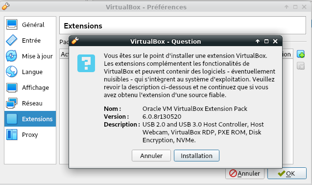{:width="400px"}

installer le pack d'extension virtualbox

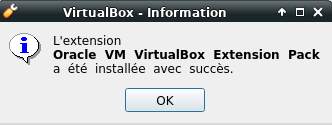{:width="200px"}

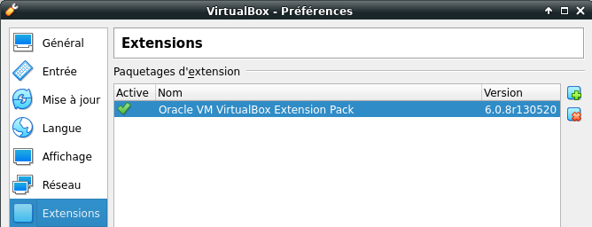{:width="400px"}


### Configurer la machine virtuelle pour un accès au réseau partagé.  

**''Configuration'' --> ''Dossiers partagés''**  
Ajouter le dossier et cocher **''Montage automatique''**  

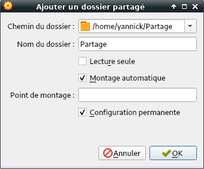{:width="200"}

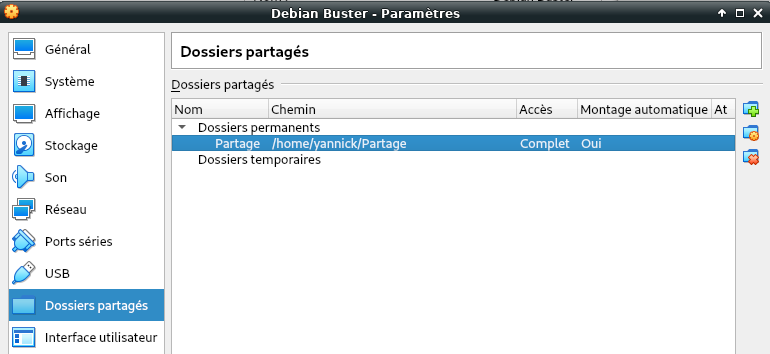{:width="400"}

>Avant de pouvoir continuer, vous devez installer certains packages requis, tels que les en-têtes de noyau Linux, les versions essentielles, s'ils ne sont pas installés.  

Installer les additions client dans un Debian en cours d'exécution dans une machine virtuelle.

  - Installez gcc ,make et  **kernel headers** (installateur a besoin d'eux pour construire le module du noyau):
      -  `sudo apt install gcc make linux-headers-$(uname -r)`
  - Allez dans le menu **''Périphériques'' --> ''Insérer l'image des additions invité...''** de la machine virtuelle en cours d'exécution ,si non présent , la télécharger.  
  - Monter le cd dans la machine virtuelle : `sudo mount /dev/cdrom /media/cdrom`
  - Allez dans le dossier monté : `cd /media/cdrom`
  - Exécutez : `sudo ./VBoxLinuxAdditions.run`

```
Verifying archive integrity... All good.
Uncompressing VirtualBox 6.0.8 Guest Additions for Linux........
VirtualBox Guest Additions installer
Copying additional installer modules ...
Installing additional modules ...
VirtualBox Guest Additions: Starting.
VirtualBox Guest Additions: Building the VirtualBox Guest Additions kernel 
modules.  This may take a while.
VirtualBox Guest Additions: To build modules for other installed kernels, run
VirtualBox Guest Additions:   /sbin/rcvboxadd quicksetup <version>
VirtualBox Guest Additions: or
VirtualBox Guest Additions:   /sbin/rcvboxadd quicksetup all
VirtualBox Guest Additions: Building the modules for kernel 4.19.0-5-amd64.
update-initramfs: Generating /boot/initrd.img-4.19.0-5-amd64
VirtualBox Guest Additions: Running kernel modules will not be replaced until 
the system is restarted
```

  - Pas d'environnement graphique : <u>ne pas tenir compte de l'erreur</u> **''Could not find the X.Org or XFree86 Window System, skipping.''**
  - Il faut ajouter le group **vboxsf** à votre utilisateur : 
    - `sudo usermod -a -G vboxsf $USER`
  - Pour la prise en compte, redémarrer la machine virtuelle : 
    - `sudo reboot`

**/media/** est le répertoire qui contient le(s) dossier(s) partagé(s)  
Dans notre exemple **/media/sf_Partage**  


## Créer des clones et des instantanés de machines virtuelles dans VirtualBox

*Les clones sont une copie exacte d'une machine virtuelle en état de marche, tandis que les instantanés vous permettent de sauvegarder un état particulier d'une machine virtuelle.*

### Créer un clone

Comme indiqué, les clones constituent l’un des meilleurs moyens de créer une copie exacte d’une machine virtuelle. Un moyen très pratique d'utiliser des clones est de créer une machine virtuelle propre de, par exemple, Ubuntu Server, puis de cloner l'original pour obtenir une nouvelle base utilisable à toutes fins. Ainsi, avec une machine virtuelle propre Ubuntu Server 18.04 en place (et désactivée ou dans un état enregistré, car les clones ne peuvent pas être créés tant qu'une machine virtuelle est en cours d'exécution), vous pouvez créer un clone en procédant comme suit:

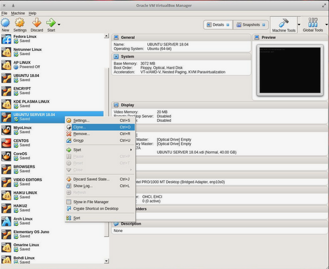

1. Ouvrez VirtualBox.
2. Sélectionnez la machine virtuelle à cloner dans le volet gauche.
3. Cliquez avec le bouton droit sur la machine virtuelle à cloner.
4. Cliquez sur Cloner dans le menu contextuel.
5. Lorsque vous y êtes invité, attribuez un nom au clone, puis cliquez sur Suivant .
6. Sélectionnez Full clone dans la fenêtre Clone Type et cliquez sur le bouton Clone . 

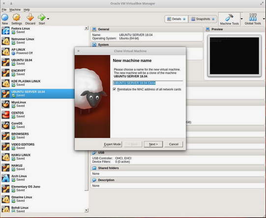

>Selon la taille de votre machine virtuelle, le processus de clonage peut durer de cinq à vingt minutes. Assurez-vous de donner au clone un nom approprié à son utilisation, sinon vous risquez de vous retrouver avec beaucoup de clones portant des noms similaires (ce qui pourrait être déroutant).

Une fois le processus terminé, votre clone est prêt à être utilisé. 

### Création et utilisation d'instantanés

**Création**  
Les instantanés sont un excellent moyen de sauvegarder un état particulier d'une machine virtuelle (VM). Supposons, par exemple, que vous envisagiez d’installer quelque chose de nouveau sur (ou de modifier) ​​une machine virtuelle qui fonctionne et que vous voulez vous assurer que vous avez un «point enregistré» sur lequel vous pouvez revenir (au cas où tout ne se passerait pas bien). Utilisons la même machine virtuelle Ubuntu Server pour créer un instantané. Supposons que vous êtes sur le point d'installer une pile LAMP (ou une mise à niveau majeure) et que vous souhaitez être sûr de pouvoir restaurer, à tout hasard, l'installation / la mise à niveau annule quelque chose que vous avez installé et configuré. 

1. Pour créer un instantané, sélectionnez la machine virtuelle en cours d'utilisation dans le volet de gauche  
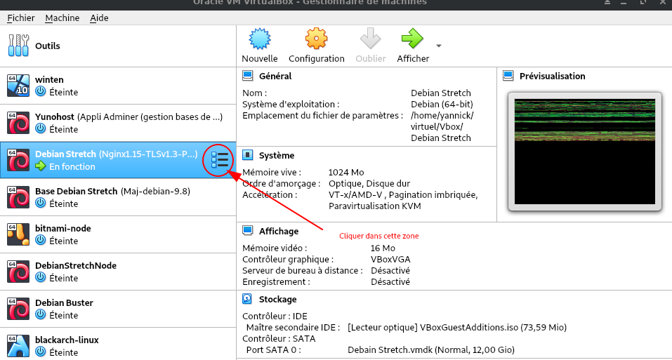{:width="600"}
2. cliquer dans la zone droite , un menu s'ouvre , sélectionner **Instantanés**  
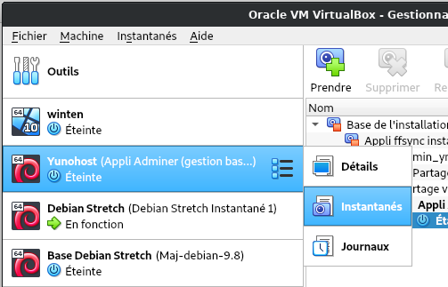{:width="300"}
3. Cliquer sur **Prendre**  
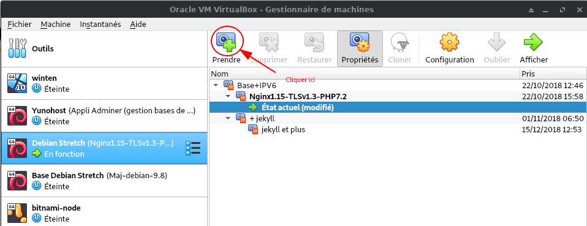{:width="600"}  
4. Dans la fenêtre résultante, attribuez un nom et une description à l’instantané. Assurez-vous de laisser des notes adéquates dans la description, de sorte que vous sachiez pourquoi cet instantané a été pris et / ou comment était l'état de la machine virtuelle avant ce qui avait été fait après l'instantané. Cliquez sur le bouton OK et l'instantané sera pris.  
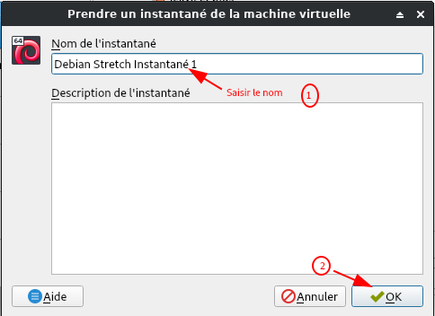{:width="300"}
5. Vous devriez maintenant voir le nom de l'instantané répertorié avec État actuel ci-dessous.  
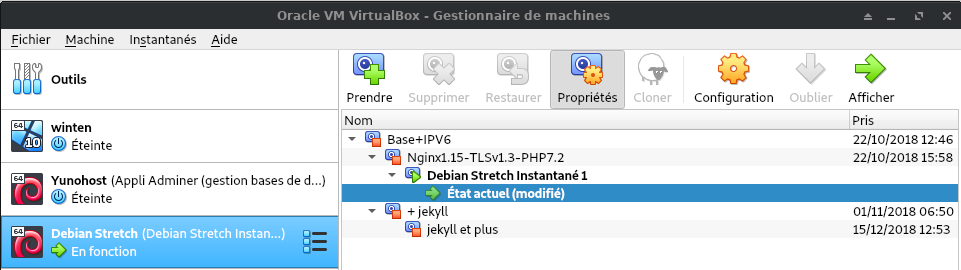{:width="600"}  

**Restauration**  

Pour restaurer un instantané, procédez comme suit:

1. Sélectionner la machine virtuelle concernée dans le volet gauche de la fenêtre principale.
2. cliquer dans la zone droite , un menu s'ouvre , sélectionner **Instantanés**  
3. Sélectionner l'instantané que vous souhaitez restaurer.
4. Cliquer sur le bouton  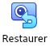{:width="40"}
5. Dans la fenêtre résultante, décochez la case **Créer un instantané de l'état actuel de la machine**  
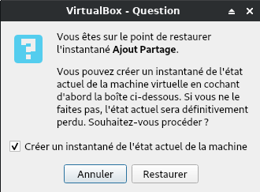{:width="300"}

>NOTE :  La raison pour laquelle vous décochez la case Créer un instantané de l'état actuel de la machine est simple. Si vous revenez à un état précédent, parce que l'état actuel est cassé, vous ne voulez pas prendre un instantané de cet état cassé. Lorsque vous décochez cette case, l'état brisé sera ignoré.