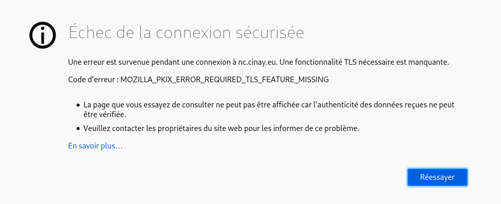

+++
title = 'Mise en cache nginx OCSP , pour éviter erreur firefox à la première connexion'
date = 2020-02-12 00:00:00 +0100
categories = nginx
+++
## Amorçage du cache OCSP dans Nginx

### Firefox  

Au **premier appel** sur un lien https vers un site ayant validé OCSP , on a l'erreur suivante  

{:width="600"}

Au **second appel** avec le même lien , tout est ok !!!  

On peut reproduire le problème en ligne de commande  
Au **premier appel**

    openssl s_client -connect xoyize.xyz:443 -status < /dev/null |grep -i ocsp

```
depth=2 O = Digital Signature Trust Co., CN = DST Root CA X3
verify return:1
depth=1 C = US, O = Let's Encrypt, CN = Let's Encrypt Authority X3
verify return:1
depth=0 CN = xoyize.xyz
verify return:1
DONE
OCSP response: no response sent
```

Au **second appel**

    openssl s_client -connect xoyize.xyz:443 -status < /dev/null |grep -i ocsp

```
depth=2 O = Digital Signature Trust Co., CN = DST Root CA X3
verify return:1
depth=1 C = US, O = Let's Encrypt, CN = Let's Encrypt Authority X3
verify return:1
depth=0 CN = xoyize.xyz
verify return:1
DONE
OCSP response: 
OCSP Response Data:
    OCSP Response Status: successful (0x0)
    Response Type: Basic OCSP Response
```

### Analyse

* [Priming the OCSP cache in Nginx](https://unmitigatedrisk.com/?p=241)


Donc, récemment, GlobalSign, DigiCert et Comodo ont travaillé avec Nginx pour obtenir l'agrafage OCSP pris en charge dans Nginx 1.3.7, malheureusement, les restrictions architecturales ont rendu la mise en œuvre impossible de sorte que la pré-récupération de la réponse OCSP au démarrage du serveur soit donc la première connexion. au serveur amorce le cache utilisé pour les connexions ultérieures.

C'est un bon compromis, mais que faire si vous voulez vraiment que la première connexion ait également l'avantage? Eh bien, vous pouvez adopter deux approches:

1.    Juste après avoir démarré le serveur, vous effectuez une demande SSL pour amorcer le cache.
*    Vous obtenez manuellement la réponse ocsp et l'aplombez là où Nginx la recherche. 

Le <u>premier modèle</u> est facile, juste après avoir démarré votre serveur, utilisez le `s_client` OpenSSL pour vous connecter au serveur avec l'agrafage OCSP activé comme je l'ai documenté dans cet [article](https://unmitigatedrisk.com/?p=100) , la première demande déclenchera la récupération de la réponse OCSP par Nginx.
Le <u>deuxième modèle</u> peut être fait avant de démarrer le serveur, vous devez trouver l'URI du répondeur OCSP, faire une demande OCSP et remplir manuellement le cache Nginx, cela ressemblerait à:

```
#!/bin/sh
ISSUER_CER=$1
SERVER_CER=$2

URL=$(openssl x509 -in $SERVER_CER -text | grep “OCSP – URI:” | cut -d: -f2,3)

openssl ocsp -noverify -no_nonce -respout ocsp.resp -issuer \
$ISSUER_CER -cert $SERVER_CER -url $URL
```

Où «ocsp.resp» correspond au fichier que vous avez configuré dans Nginx pour le « ssl_stapling_file ».

Chaque approche a ses avantages et ses inconvénients, par exemple avec la première approche, votre exécution de l'appel s_client peut ne pas être la première demande que le serveur voit, avec la deuxième approche si vous utilisez un certificat qui ne contient pas de pointeur OCSP et que vous avez dit manuellement à Nginx où récupérer l'état du certificat, alors cela ne fonctionnera pas.

Il convient de noter que vous pouvez exécuter ce même script dans un script cron pour vous assurer que votre serveur n'a jamais besoin de toucher le câble (et potentiellement de le bloquer en le faisant) lorsqu'il essaie de garder son cache OCSP à jour. 

### SOLUTION

Créer un bash universel avec le nom de domaine comme paramètre  
Les noms de de fichier pour chaque domaine ou sous domaine sont de la forme `*domaine.conf`  
Les fichiers `*.conf` dans le dossier **/etc/nginx/conf.d/**  

Créer le bash nommé **ocsp_cache** dans le dossier **/usr/local/bin/**

    sudo nano /usr/local/bin/ocsp_cache

```
#! /bin/sh

# ocsp_cache

# $1 domaine passé en paramètre
echo "Premier passage"
for fichier in /etc/nginx/conf.d/*$1.conf
do
    echo $(basename $fichier .${fichier##*.})
    openssl s_client -connect $(basename $fichier .${fichier##*.}):443 -status < /dev/null |grep -i ocsp
done
# pause de 1 seconde
sleep 1
echo "Second passage"
for fichier in /etc/nginx/conf.d/*$1.conf
do
    echo $(basename $fichier .${fichier##*.})
    openssl s_client -connect $(basename $fichier .${fichier##*.}):443 -status < /dev/null |grep -i ocsp
done
echo "Fin mise en cache nginx OCSP..."
```

Droits en exécution

    sudo chmod +x /usr/local/bin/ocsp_cache

Exécution

    ocsp_cache <nom de domaine>


## OpenSSL OCSP vérification certificat 

Cet article vous montre comment vérifier manuellement un certificat sur un serveur OCSP. OCSP est l'acronyme de Online Certificate Status Protocol et est un moyen de valider un état de certificat. Il s'agit d'une alternative à la liste de révocation de certificats CRL.

Par rapport aux CRL:

*    Dans la mesure où une réponse OCSP contient moins d'informations qu'une CRL (liste de révocation de certificats) classique, OCSP peut utiliser plus efficacement les réseaux et les ressources client.
*    Avec OCSP, les clients n'ont pas besoin d'analyser eux-mêmes les listes de révocation de certificats, ce qui réduit la complexité côté client. Cependant, cela est contrebalancé par la nécessité pratique de maintenir un cache. Dans la pratique, de telles considérations sont peu importantes, car la plupart des applications s'appuient sur des bibliothèques tierces pour toutes les fonctions X.509.
*    OCSP révèle au répondant qu'un hôte réseau particulier a utilisé un certificat particulier à un moment particulier. OCSP ne rend pas obligatoire le cryptage, donc d'autres parties peuvent intercepter ces informations. 
*    [OCSP wikipedia](https://en.wikipedia.org/wiki/Online_Certificate_Status_Protocol)


Version openssl : `openssl version` &rarr; OpenSSL 1.1.1d  10 Sep 2019

### Lire un certificat avec un OCSP

Nous aurons d'abord besoin d'un certificat d'un site Web. Je vais utiliser xoyize.xyz comme exemple ici. Nous pouvons récupérer le certificat avec la commande openssl suivante:

    openssl s_client -connect xoyize.xyz:443 2>&1 < /dev/null | sed -n '/-----BEGIN/,/-----END/p' > xoyize.xyz.pem 

Maintenant, vérifiez si ce certificat a un URI OCSP:

    openssl x509 -noout -ocsp_uri -in xoyize.xyz.pem
        http://ocsp.int-x3.letsencrypt.org

S'il ne donne aucune sortie, le certificat n'a pas d'URI OCSP. Vous ne pouvez pas le valider contre un OCSP.

### Obtenir la chaîne de certificats

Il est nécessaire d'envoyer la chaîne de certificats avec le certificat que vous souhaitez valider. Nous devons donc obtenir la chaîne de certificats pour notre domaine, wikipedia.org. En utilisant l'option -showcerts avec openssl s_client , nous pouvons voir tous les certificats, y compris la chaîne:

    openssl s_client -connect xoyize.xyz:443 -showcerts 2>&1 < /dev/null

Il en résulte une sortie très complète, mais ce qui nous intéresse est ce qui suit

```
 1 s:C = US, O = Let's Encrypt, CN = Let's Encrypt Authority X3
   i:O = Digital Signature Trust Co., CN = DST Root CA X3
-----BEGIN CERTIFICATE-----
MIIEkjCCA3qgAwIBAgIQCgFBQgAAAVOFc2oLheynCDANBgkqhkiG9w0BAQsFADA/
MSQwIgYDVQQKExtEaWdpdGFsIFNpZ25hdHVyZSBUcnVzdCBDby4xFzAVBgNVBAMT
DkRTVCBSb290IENBIFgzMB4XDTE2MDMxNzE2NDA0NloXDTIxMDMxNzE2NDA0Nlow
SjELMAkGA1UEBhMCVVMxFjAUBgNVBAoTDUxldCdzIEVuY3J5cHQxIzAhBgNVBAMT
GkxldCdzIEVuY3J5cHQgQXV0aG9yaXR5IFgzMIIBIjANBgkqhkiG9w0BAQEFAAOC
AQ8AMIIBCgKCAQEAnNMM8FrlLke3cl03g7NoYzDq1zUmGSXhvb418XCSL7e4S0EF
q6meNQhY7LEqxGiHC6PjdeTm86dicbp5gWAf15Gan/PQeGdxyGkOlZHP/uaZ6WA8
SMx+yk13EiSdRxta67nsHjcAHJyse6cF6s5K671B5TaYucv9bTyWaN8jKkKQDIZ0
Z8h/pZq4UmEUEz9l6YKHy9v6Dlb2honzhT+Xhq+w3Brvaw2VFn3EK6BlspkENnWA
a6xK8xuQSXgvopZPKiAlKQTGdMDQMc2PMTiVFrqoM7hD8bEfwzB/onkxEz0tNvjj
/PIzark5McWvxI0NHWQWM6r6hCm21AvA2H3DkwIDAQABo4IBfTCCAXkwEgYDVR0T
AQH/BAgwBgEB/wIBADAOBgNVHQ8BAf8EBAMCAYYwfwYIKwYBBQUHAQEEczBxMDIG
CCsGAQUFBzABhiZodHRwOi8vaXNyZy50cnVzdGlkLm9jc3AuaWRlbnRydXN0LmNv
bTA7BggrBgEFBQcwAoYvaHR0cDovL2FwcHMuaWRlbnRydXN0LmNvbS9yb290cy9k
c3Ryb290Y2F4My5wN2MwHwYDVR0jBBgwFoAUxKexpHsscfrb4UuQdf/EFWCFiRAw
VAYDVR0gBE0wSzAIBgZngQwBAgEwPwYLKwYBBAGC3xMBAQEwMDAuBggrBgEFBQcC
ARYiaHR0cDovL2Nwcy5yb290LXgxLmxldHNlbmNyeXB0Lm9yZzA8BgNVHR8ENTAz
MDGgL6AthitodHRwOi8vY3JsLmlkZW50cnVzdC5jb20vRFNUUk9PVENBWDNDUkwu
Y3JsMB0GA1UdDgQWBBSoSmpjBH3duubRObemRWXv86jsoTANBgkqhkiG9w0BAQsF
AAOCAQEA3TPXEfNjWDjdGBX7CVW+dla5cEilaUcne8IkCJLxWh9KEik3JHRRHGJo
uM2VcGfl96S8TihRzZvoroed6ti6WqEBmtzw3Wodatg+VyOeph4EYpr/1wXKtx8/
wApIvJSwtmVi4MFU5aMqrSDE6ea73Mj2tcMyo5jMd6jmeWUHK8so/joWUoHOUgwu
X4Po1QYz+3dszkDqMp4fklxBwXRsW10KXzPMTZ+sOPAveyxindmjkW8lGy+QsRlG
PfZ+G6Z6h7mjem0Y+iWlkYcV4PIWL1iwBi8saCbGS5jN2p8M+X+Q7UNKEkROb3N6
KOqkqm57TH2H3eDJAkSnh6/DNFu0Qg==
-----END CERTIFICATE-----
```

Comme vous pouvez le voir, c'est le numéro 1. Le numéro 0 est le certificat pour **xoyize.xyz**, nous l'avons déjà. Si votre site a plus de certificats dans sa chaîne, vous en verrez plus ici. Enregistrez-les tous, dans l'ordre où OpenSSL les envoie (d'abord celui qui a émis directement votre certificat de serveur, puis celui qui émet ce certificat et ainsi de suite, avec la racine ou la plus racine à la fin du fichier) à un fichier, nommé **chain.pem**

### Envoi de la demande OCSP

Nous avons maintenant toutes les données dont nous avons besoin pour faire une demande OCSP. En utilisant la commande Openssl suivante, nous pouvons envoyer une requête OCSP et obtenir uniquement la sortie texte:

    openssl ocsp -issuer chain.pem -cert wikipedia.pem -text -url http://ocsp.digicert.com 

```
OCSP Request Data:
    Version: 1 (0x0)
    Requestor List:
        Certificate ID:
          Hash Algorithm: sha1
          Issuer Name Hash: ED48ADDDCB7B00E20E842AA9B409F1AC3034CF96
          Issuer Key Hash: 50EA7389DB29FB108F9EE50120D4DE79994883F7
          Serial Number: 0114195F66FAFF8FD66E12496E516F4F
    Request Extensions:
        OCSP Nonce:
            0410DA634F2ADC31DC48AE89BE64E8252D12
OCSP Response Data:
    OCSP Response Status: successful (0x0)
    Response Type: Basic OCSP Response
    Version: 1 (0x0)
    Responder Id: 50EA7389DB29FB108F9EE50120D4DE79994883F7
    Produced At: Apr  9 08:45:00 2014 GMT
    Responses:
    Certificate ID:
      Hash Algorithm: sha1
      Issuer Name Hash: ED48ADDDCB7B00E20E842AA9B409F1AC3034CF96
      Issuer Key Hash: 50EA7389DB29FB108F9EE50120D4DE79994883F7
      Serial Number: 0114195F66FAFF8FD66E12496E516F4F
    Cert Status: good
date: 2020-02-12 00:00:00 +0100
last_modified_at: 2020-02-12
date: 2020-02-12 00:00:00 +0100
last_modified_at: 2020-02-12

    Signature Algorithm: sha1WithRSAEncryption
         56:21:4c:dc:84:21:f7:a8:ac:a7:b9:bc:10:19:f8:19:f1:34:
         c1:63:ca:14:7f:8f:5a:85:2a:cc:02:b0:f8:b5:05:4a:0f:28:
         50:2a:4a:4d:04:01:b5:05:ef:a5:88:41:d8:9d:38:00:7d:76:
         1a:aa:ff:21:50:68:90:d2:0c:93:85:49:e7:8e:f1:58:08:77:
         a0:4e:e2:22:98:01:b7:e3:27:75:11:f5:b7:8f:e0:75:7d:19:
         9b:74:cf:05:dc:ae:1c:36:09:95:b6:08:bc:e7:3f:ea:a2:e3:
         ae:d7:8f:c0:9d:8e:c2:37:67:c7:5b:d8:b0:67:23:f1:51:53:
         26:c2:96:b0:1a:df:4e:fb:4e:e3:da:a3:98:26:59:a8:d7:17:
         69:87:a3:68:47:08:92:d0:37:04:6b:49:9a:96:9d:9c:b1:e8:
         cb:dc:68:7b:4a:4d:cb:08:f7:92:67:41:99:b6:54:56:80:0c:
         18:a7:24:53:ac:c6:da:1f:4d:f4:3c:7d:68:44:1d:a4:df:1d:
         48:07:85:52:86:59:46:d1:35:45:1a:c7:6b:6b:92:de:24:ae:
         c0:97:66:54:29:7a:c6:86:a6:da:9f:06:24:dc:ac:80:66:95:
         e0:eb:49:fd:fb:d4:81:6a:2b:81:41:57:24:78:3b:e0:66:70:
         d4:2e:52:92
wikipedia.pem: good
date: 2020-02-12 00:00:00 +0100
last_modified_at: 2020-02-12
date: 2020-02-12 00:00:00 +0100
last_modified_at: 2020-02-12
```

Si vous souhaitez avoir une sortie plus résumée, -text option -text . La plupart du temps, je l'inclus pour trouver des problèmes avec un OCSP.

Voici à quoi ressemble un bon certificat:

    openssl ocsp -issuer chain.pem -cert wikipedia.pem -url http://ocsp.digicert.com

```
wikipedia.pem: good
date: 2020-02-12 00:00:00 +0100
last_modified_at: 2020-02-12
date: 2020-02-12 00:00:00 +0100
last_modified_at: 2020-02-12
```

### Certificat révoqué

Si vous avez un certificat révoqué, vous pouvez également le tester de la même manière que ci-dessus. La réponse ressemble à ceci:

```
Response verify OK
test-revoked.pem: revoked
date: 2020-02-12 00:00:00 +0100
last_modified_at: 2020-02-12
date: 2020-02-12 00:00:00 +0100
last_modified_at: 2020-02-12
    Revocation Time: Mar 25 15:45:55 2014 GMT
```

Vous pouvez tester cela en utilisant le certificat et la chaîne sur la page de test de certificat révoqué Verisign 

### Autres erreurs

Si nous envoyons cette demande à un autre OCSP, celui qui n'a pas émis ce certificat, nous devrions recevoir une erreur non autorisée:

    openssl ocsp -issuer chain.pem -cert wikipedia.pem -url http://rapidssl-ocsp.geotrust.com
    Responder Error: unauthorized (6)

L'option -text ici montre plus d'informations:

```
OCSP Request Data:
    Version: 1 (0x0)
    Requestor List:
        Certificate ID:
          Hash Algorithm: sha1
          Issuer Name Hash: ED48ADDDCB7B00E20E842AA9B409F1AC3034CF96
          Issuer Key Hash: 50EA7389DB29FB108F9EE50120D4DE79994883F7
          Serial Number: 0114195F66FAFF8FD66E12496E516F4F
    Request Extensions:
        OCSP Nonce:
            041015BB718C43C46C41122E841DB2282ECE
Responder Error: unauthorized (6)
```

Certains OCSP sont configurés différemment et donnent cette erreur:

    openssl ocsp -issuer chain.pem -cert wikipedia.pem -url http://ocsp.digidentity.eu/L4/services/ocsp

```
Response Verify Failure
140735308649312:error:2706B06F:OCSP routines:OCSP_CHECK_IDS:response contains no revocation data:ocsp_vfy.c:269:
140735308649312:error:2706B06F:OCSP routines:OCSP_CHECK_IDS:response contains no revocation data:ocsp_vfy.c:269:
wikipedia.pem: ERROR: No Status found.
```
Si nous incluons l'option -text ici, nous pouvons voir qu'une réponse est envoyée, cependant, qu'elle ne contient aucune donnée:

```
OCSP Response Data:
    OCSP Response Status: successful (0x0)
    Response Type: Basic OCSP Response
    Version: 1 (0x0)
    Responder Id: C = NL, O = Digidentity B.V., CN = Digidentity OCSP
    Produced At: Apr  9 12:02:00 2014 GMT
    Responses:
    Response Extensions:
OCSP Nonce:
    0410EB540472EA2D8246E88F3317B014BEEF
Signature Algorithm: sha256WithRSAEncryption
```

D'autres OCSP donnent le statut "unknown":

```
openssl ocsp -issuer chain.pem -cert wikipedia.pem  -url http://ocsp.quovadisglobal.com/
Response Verify Failure
140735308649312:error:27069070:OCSP routines:OCSP_basic_verify:root ca not trusted:ocsp_vfy.c:152:
wikipedia.pem: unknown
date: 2020-02-12 00:00:00 +0100
last_modified_at: 2020-02-12
```

Les options -text nous en montrent plus:

```
OCSP Response Data:
    OCSP Response Status: successful (0x0)
    Response Type: Basic OCSP Response
    Version: 1 (0x0)
    Responder Id: C = CH, O = QuoVadis Limited, OU = OCSP Responder, CN = QuoVadis OCSP Authority Signature
    Produced At: Apr  9 12:09:10 2014 GMT
    Responses:
    Certificate ID:
      Hash Algorithm: sha1
      Issuer Name Hash: ED48ADDDCB7B00E20E842AA9B409F1AC3034CF96
      Issuer Key Hash: 50EA7389DB29FB108F9EE50120D4DE79994883F7
      Serial Number: 0114195F66FAFF8FD66E12496E516F4F
    Cert Status: unknown
date: 2020-02-12 00:00:00 +0100
last_modified_at: 2020-02-12

    Response Extensions:
```

### Sources

*    https://www.openssl.org/docs/apps/s_client.html
*    https://www.openssl.org/docs/apps/ocsp.html
*    https://en.wikipedia.org/wiki/Online Certificate Status_Protocol 

---

