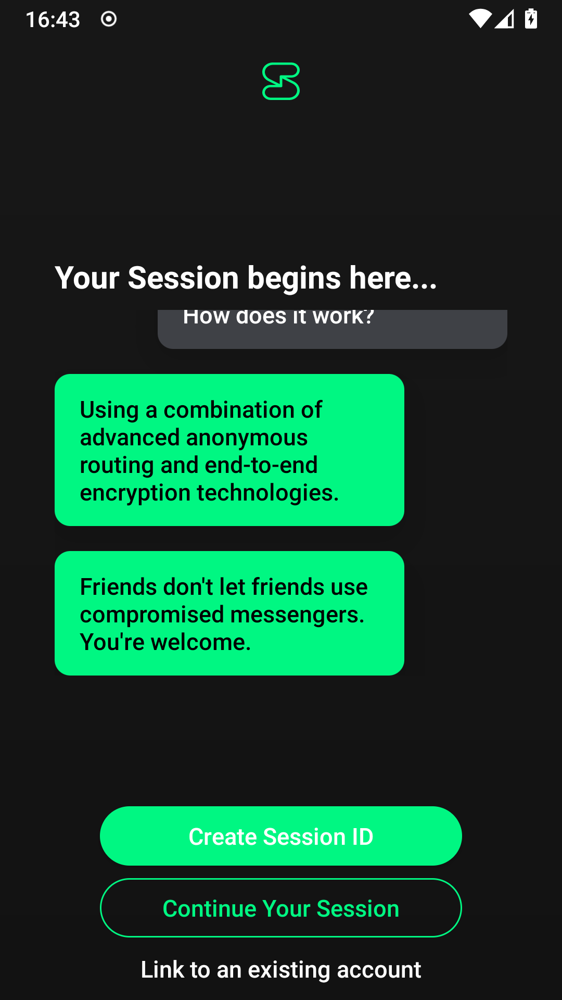
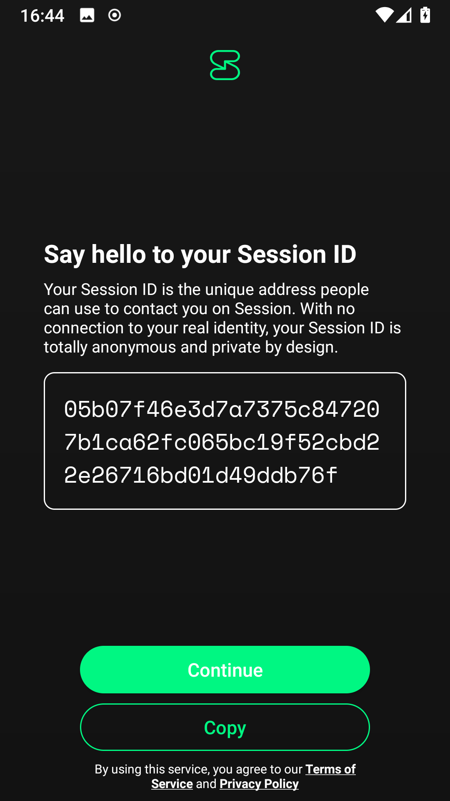
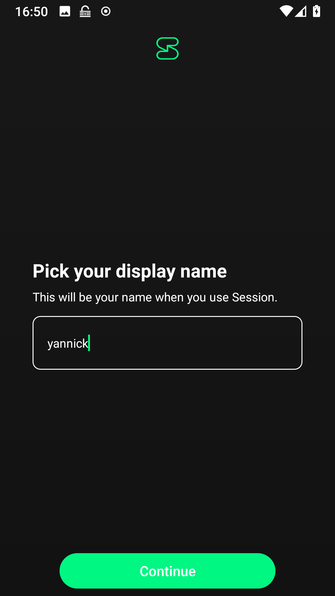
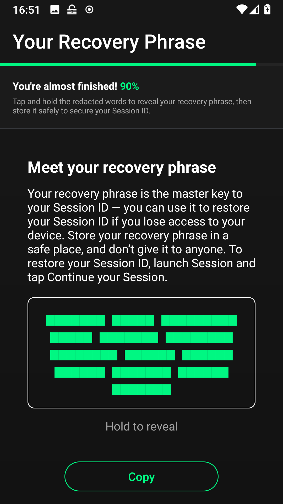
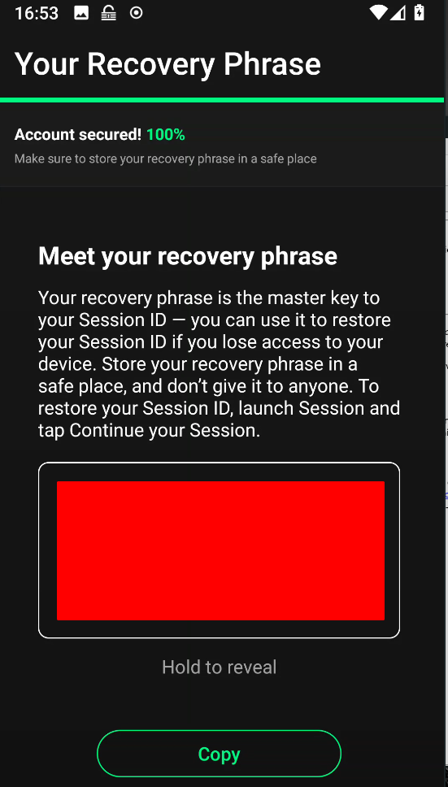

+++
title = 'Application de messagerie sécurisée (chat)'
date = 2020-02-19 00:00:00 +0100
categories = ['messagerie']
+++
*[Session](https://getsession.org/) est une messagerie cryptée de bout en bout qui enlève la partie sensible des métadonnées (**Send Message Not Metadata**).   
Elle est conçue pour les personnes qui veulent préserver vie privée et liberté de toute forme de surveillance.*

* Article original publié par [gueidan](https://tkpx.eu/author/gueidan/) le 19 février 2020 ([Nouvelles applications de messagerie sécurisée](https://tkpx.eu/2020/02/19/nouvelles-applications-de-messagerie-securisee/)) 

## Session

[Session](https://getsession.org/), application disponible sur Android, iPhone et ordinateur de bureau (Windows, Mac, Linux) qui annonce ne pas transmettre de “métadonnées” ( date et heure message + numéro expéditeur et destinataire + adresse IP + nom des opérateurs télécoms de tous les inervenants).

### Session sur android

Il est possible d'installer Session par Google Play ou en [direct](https://github.com/loki-project/session-android/releases)  
Télécharger le version *universelle* <https://github.com/loki-project/session-android/releases/download/1.0.2/session-1.0.2-universal.apk>  
Installation via adb : `adb install session-1.0.2-universal.apk`  

{:height="300"}
{:height="300"}
{:height="300"}  
{:height="300"}
{:height="300"}

