+++
title = 'VirtualBox sur serveur xoyize.xyz (srvxo, ex PC2) + Machine virtuelle yunohost ouestline.net'
date = 2020-02-20 00:00:00 +0100
categories = ['virtuel']
+++
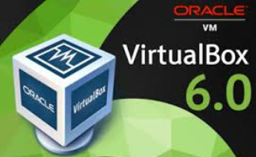{:width="200px"}

## VirtualBox on Headless Server

*Installer virtualBox sur un serveur sans carte graphique*

* [How to Install Oracle VirtualBox On Ubuntu 18.04.2 LTS Headless Server](https://www.ostechnix.com/install-oracle-virtualbox-ubuntu-16-04-headless-server/)
* [How to Install VirtualBox 6 on Debian 10](https://www.tecmint.com/install-virtualbox-on-debian-10/)
* [How to set up a VirtualBox server in Debian 9: web interface, autostart, backup](https://vorkbaard.nl/how-to-set-up-a-virtualbox-server-in-debian-9-web-interface-autostart-backup/)
* [Managing A Headless VirtualBox Installation With phpvirtualbox On nginx (Ubuntu 12.04)](https://www.howtoforge.com/managing-a-headless-virtualbox-installation-with-phpvirtualbox-on-nginx-ubuntu-12.04) 
* [How to set up a VirtualBox server in Debian 9: web interface, autostart, backup](https://vorkbaard.nl/how-to-set-up-a-virtualbox-server-in-debian-9-web-interface-autostart-backup/)

VirtualBox 6.0 est la dernière version majeure publiée par l'équipe Oracle. Cette version est publiée avec diverses améliorations de performances par rapport aux versions majeures précédentes. Cet article vous aide à installer VirtualBox sur le système Debian 10 Buster Linux.


### Prérequis

Connectez-vous à votre système de bureau Debian 10 Buster Linux avec les privilèges sudo utilisateur. Mettez ensuite à jour les packages actuellement installés sur votre système. Pour ce faire, exécutez simplement les commandes suivantes.

    sudo apt update
    sudo apt upgrade
    sudo apt install build-essential dkms unzip wget

> Un redémarrage de la machine est nécessaire `sudo systemctl reboot`

### Configuration du référentiel Apt

Maintenant, importez la clé publique Oracle sur votre système, qui a signé les paquets Debian. Vous pouvez ajouter ces clés à l'aide des commandes suivantes.

    wget --no-check-certificate -q https://www.virtualbox.org/download/oracle_vbox_2016.asc -O- | sudo apt-key add -
    wget --no-check-certificate -q https://www.virtualbox.org/download/oracle_vbox.asc -O- | sudo apt-key add -

> L'option `--no-check-certificate` est obligatoire sinon erreur **gpg: aucune donnée OpenPGP valable n'a été trouvée.**

Configurez ensuite le référentiel apt sur votre système Debian 10 Buster. Cette commande ajoutera une entrée au fichier /etc/apt/sources.list à la fin du fichier.

    sudo add-apt-repository "deb http://download.virtualbox.org/virtualbox/debian buster contrib"

### Installer VirtualBox sur Debian 10

Après avoir terminé les étapes ci-dessus, installons VirtualBox à l'aide des commandes suivantes. Si vous avez déjà installé une ancienne version de VirtualBox, la commande ci-dessous la mettra à jour automatiquement.

    sudo apt update
    sudo apt install virtualbox-6.0

Ajout d'utilisateurs au groupe VirtualBox

Nous devons créer et ajouter notre utilisateur système au groupe **vboxusers** . Vous pouvez soit créer un utilisateur distinct et l'affecter au groupe vboxusers, soit utiliser l'utilisateur existant. 

<u>Créer un utilisateur *vbox*</u>   
Configurer un compte pour VirtualBox afin qu'il ne fonctionne pas en tant que root.   

    sudo useradd -d /home/vbox -m -g vboxusers -s /bin/bash vbox
    sudo passwd vbox

<u>Utilisateur existant</u>  
Exécuter la commande suivante pour l'ajouter au groupe vboxusers.

    sudo usermod -aG vboxusers $USER 

>Veuillez noter que si vous utilisez un utilisateur distinct pour virtualbox, vous devez vous déconnecter et vous connecter à cet utilisateur particulier et effectuer les autres étapes.

Maintenant, exécutez la commande suivante pour vérifier si les modules du noyau de virtualbox sont chargés ou non.

    sudo systemctl status vboxdrv 

Comme vous pouvez le voir dans la capture d'écran ci-dessus, le module vboxdrv est chargé et fonctionne!

```
● vboxdrv.service - VirtualBox Linux kernel module
   Loaded: loaded (/usr/lib/virtualbox/vboxdrv.sh; enabled; vendor preset: enabled)
   Active: active (exited) since Fri 2019-12-20 08:19:49 CET; 3min 1s ago
    Tasks: 0 (limit: 4915)
   Memory: 0B
   CGroup: /system.slice/vboxdrv.service

déc. 20 08:19:49 xoyize.xyz systemd[1]: Starting VirtualBox Linux kernel module...
déc. 20 08:19:49 xoyize.xyz vboxdrv.sh[13280]: vboxdrv.sh: Starting VirtualBox services.
déc. 20 08:19:49 xoyize.xyz systemd[1]: Started VirtualBox Linux kernel module.
```

### Installer le pack d'extension VirtualBox

* [Install VirtualBox Extension Pack on VirtualBox 6.0](https://kifarunix.com/install-virtualbox-extension-pack-on-virtualbox-6-0/)


Le pack d'extension VirtualBox fournit les fonctionnalités suivantes aux invités VirtualBox.

*    Le périphérique USB 2.0 virtuel (EHCI)
*    Prise en charge de VirtualBox Remote Desktop Protocol (VRDP)
*    Passthrough webcam hôte
*    ROM de démarrage Intel PXE
*    Prise en charge expérimentale du passthrough PCI sur les hôtes Linux 

Vérifier la version 

    vboxmanage --version
    # 6.0.14r133895

Téléchargez ici le dernier pack d'extension pour VirtualBox 6.0.x.

    wget https://download.virtualbox.org/virtualbox/6.0.14/Oracle_VM_VirtualBox_Extension_Pack-6.0.14.vbox-extpack

Installez le pack d'extension à l'aide de la commande:

    sudo VBoxManage extpack install Oracle_VM_VirtualBox_Extension_Pack-6.0.14.vbox-extpack 

Successfully installed "Oracle VM VirtualBox Extension Pack".

Nous avons installé avec succès Oracle VirtualBox avec pack d'extension dans le serveur Ubuntu 18.04 LTS. Il est temps de déployer des machines virtuelles. Reportez-vous au [guide officiel de virtualbox](http://www.virtualbox.org/manual/ch08.html) pour commencer à créer et gérer des machines virtuelles en ligne de commande.

### Créer/démarrer une machine virtuelle en ligne de commande

>L'utilisateur "vbox" est seul autorisé à gérer virtualbox , il faut précéder les commandes de `sudo -u vbox`

* [How to Manage Oracle VirtualBox Virtual Machines from Command Line-Lien HS](/files/html/How to Manage Oracle VirtualBox Virtual Machines from Command Line.htm)
* [VBoxManage (User Manual for Release 6.0)](https://docs.oracle.com/cd/E97728_01/E97727/html/vboxmanage.html) 

On se connecte sur le serveur qui héberge VirtualBox via SSH  

Liste des machines virtuelles sur le serveur

    sudo -u vbox VBoxManage list vms
    
"debian9" {bbe16841-97ac-4ff8-85e3-d6c9dc0ce470}

Si l'extension d'affichage à distance VirtualBox n'a pas été activée, la procédure peut être répétée

    sudo -u vbox VBoxManage modifyvm "debian9" --vrde on

Il y a une machine virtuelle nommée "debian9".  
Le mode Headless peut être activé par la suite de deux manières :  

    sudo -u vbox VBoxHeadless -s debian9

```
Oracle VM VirtualBox Headless Interface 4.1.8
(C) 2008-2019 Oracle Corporation
Tous droits réservés.

Le serveur VRDE est à l'écoute sur le port 3389.
```

ou :

    VBoxManage startvm ubuntu-server --type headless

```
Attendre que la VM "ubuntu-server" s'allume...
La VM "ubuntu-server" a été démarrée avec succès.
```

La machine virtuelle est maintenant en cours d'exécution sans affichage  
A la place, on se connecte à la machine par RDP ou SSH (en supposant que les configurations réseau et SSH correspondantes existent).


## phpVirtualBox (VirtualBox web vm.xoyize.xyz)

* Créer et gérer des machines virtuelles graphiquement avec [phpVirtualBox](https://github.com/phpvirtualbox/phpvirtualbox) 
* [vboxweb service Configuration in Linux](https://github.com/phpvirtualbox/phpvirtualbox/wiki/vboxweb-service-Configuration-in-Linux)

*PhpVirtualBox est un frontal gratuit basé sur le Web pour Oracle VirtualBox. Il est écrit en langage PHP. En utilisant phpVirtualBox, nous pouvons facilement créer, supprimer, gérer et administrer des machines virtuelles via un navigateur Web à partir de n'importe quel système distant sur le réseau.*

Nous utilisons un logiciel libre de serveur Web (ou HTTP) **nginx**  

### Installer

Installer phpVirtualBox 

    git clone https://github.com/phpvirtualbox/phpvirtualbox.git
    sudo mv phpvirtualbox /var/www/phpvirtualbox

Configurer phpVirtualBox.  

Copiez l'exemple de fichier de configuration comme indiqué ci-dessous.

    sudo cp /var/www/phpvirtualbox/config.php-example /var/www/phpvirtualbox/config.php

Editez le fichier config.php de phpVirtualBox:

    sudo nano /var/www/phpvirtualbox/config.php

Recherchez les lignes suivantes et remplacez le nom d'utilisateur et le mot de passe 

```
/* Username / Password for system user that runs VirtualBox */
var $username = 'vbox';
var $password = 'pass';

/* Default language. See languages folder for more language options.
 * Can also be changed in File -> Preferences -> Language in
 * phpVirtualBox.
 */
var $language = 'fr';

```

>Remplacer 'pass' par le mot de passe

Créer un nouveau fichier appelé **/etc/default/virtualbox** :

    sudo nano /etc/default/virtualbox 

Ajoutez la ligne suivante. 

    VBOXWEB_USER = vbox
    VBOXWEB_HOST=127.0.0.1
 

### Vhost vm.xoyize.xyz (authentification par certificat client)

Créer le vhost nginx

    sudo nano /etc/nginx/conf.d/vm.xoyize.xyz.conf

```
# /etc/nginx/conf.d/vm.xoyize.xyz.conf	
	##
	# Virtual Host vm.xoyize.xyz (phpVirtualbox)
	##

	server {
	    listen 80;
	    listen [::]:80;
	
	    ## redirect http to https ##
	    server_name vm.xoyize.xyz;
	    return  301 https://$server_name$request_uri;
	}
	
	server {
	    listen 443 ssl http2;
	    listen [::]:443 ssl http2;
	    server_name vm.xoyize.xyz;
	
	    include ssl_dh_headers_ocsp;
            # Authentification par certificat client
            include auth_certificat_client;
	
	    root        /var/www/phpvirtualbox;
	    index index.html index.php;
	
	location / {
	    try_files $uri $uri/ /index.php?$args;
	}
	
	       location ~ \.php$ {
	           fastcgi_split_path_info ^(.+\.php)(/.+)$;
	           fastcgi_pass unix:/run/php/php7.3-fpm.sock;   # PHP7.3
	           fastcgi_index index.php;
	           include fastcgi_params;
		   fastcgi_param SCRIPT_FILENAME $request_filename;
	        }
	
	
	    access_log /var/log/nginx/phpvirtualbox-access.log;
	    error_log /var/log/nginx/phpvirtualbox-error.log;
	}
```

Il faut installer le module PHP SOAP extension

    sudo apt install php7.3-soap

Redémarrer les services PHP et nginx

    sudo systemctl restart php7.3-fpm
    sudo systemctl restart nginx

Enfin, redémarrez votre système ou redémarrez simplement les services suivants pour terminer la configuration.

    sudo systemctl restart vboxweb-service 
    sudo systemctl restart vboxdrv 

Accéder à la console Web phpVirtualBox https://vm.xoyize.xyz  

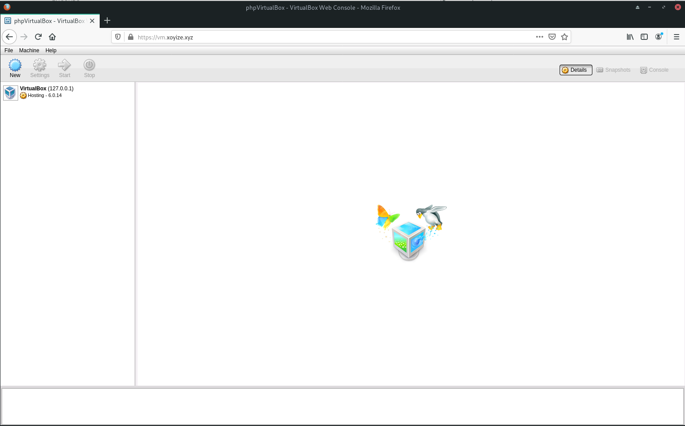{:width="600"}  
Entrez les informations d'identification de l'utilisateur administratif phpVirtualBox.  
Le nom d'utilisateur par défaut et phpVirtualBox est admin / admin .

### Récupération du mot de passe

Vous pouvez réinitialiser le mot de passe admin en renommant le fichier **recovery.php-disabled** dans le dossier de phpVirtualBox en **recovery.php** et en y accédant dans votre navigateur Web. Par exemple *http://HOST-OR-IP/phpvirtualbox/recovery.php*

Cette page vous présente un formulaire simple. Cliquez sur le bouton Récupérer pour réinitialiser le mot de passe de l'utilisateur *admin* à la valeur par défaut de *admin*. Si vous avez supprimé le compte administrateur, il sera recréé.

Une fois cela fait, renommez **recovery.php** en **recovery.php-disabled**. phpVirtualBox refusera de fonctionner tant que recovery.php existera. Vous pouvez alors vous connecter avec les identifiants par défaut de admin / admin.

### Désactivation de l'authentification par mot de passe

>Désactivation de l'authentification par mot de passe car on utilise une authentification par **certificat client**

Si vous voulez désactiver l'authentification dans *phpVirtualBox*, ajoutez la ligne suivante dans le fichier **config.php** :

    var $noAuth = true ;

Une fois que cela est fait, aucun nom d'utilisateur / mot de passe ne sera nécessaire pour accéder à phpVirtualBox. De plus, les sections de phpVirtualBox relatives à l'authentification (changement de mot de passe, utilisateurs, etc.) ne seront pas visibles.

### Créer/démarrer une machine virtuelle via phpvirtualbox

Après avoir créé une machine , activé "le bureau à distance" port 3389 puis démarré

{:width="500"}

### Accès aux machines virtuelles en mode console (RDP)

* [Remote virtual machines: Remote display (VRDP support)](http://www.virtualbox.org/manual/ch07.html#idp8971072) (Oracle VM VirtualBox User Manual, Chapter 7)
* Pour pouvoir utiliser VRPDP, le [package d'extension pour VirtualBox](#installer-le-pack-dextension-virtualbox) doit avoir été installé. 
* Installer un client RDP : `sudo pacman -S rdesktop`


L'affichage d'une machine virtuelle démarrée en mode sans affichage (headless) peut être réalisé via VRDP.  

La connexion à une machine virtuelle via RDP ne fonctionnera que si VRDE a été activé pour la machine virtuelle. Après cela, n'importe quel client RDP peut être utilisé pour se connecter à l'hôte local ou utiliser l'adresse IP de l'hôte sur la machine virtuelle   
Le serveur VRDE est à l'écoute sur le port 3389.

VirtualBox est hébergé sur un serveur (xoyize.xyz) avec un pare-feu , la seule entrée possible est le port SSH .  
On va utiliser le port SSH (55035) du serveur pour rediriger tout le traffic du port 3389 de la machine virtuelle vers un port local (15000)  de la machine appelante.

Exécuter la commande suivante sur un premier terminal

    ssh -L 15000:localhost:3389 admbust@xoyize.xyz -p 55035 -i /home/yannick/.ssh/vbox-srvbust-ed25519

Exécuter la commande suivante sur un second terminal ([man rdesktop](https://linux.die.net/man/1/rdesktop))

    rdesktop -g 100% -P -z -k fr localhost:15000  # Automatic scaling of geometry

Et vous obtenez une fenêtre console de la machine virtuelle

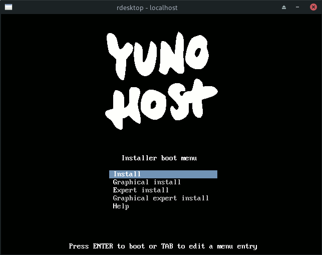{:width="200"}

## Service pour start/stop machine virtuelle

*Créer un service 'systemd' qui lancera automatiquement un serveur virtuel au démarrage*   

Le serveur à lancer est identifié par son uuid  
Exemple pour un serveur avec des "instantanés" (snapshots)   
Liste des machines  

    sudo -u vbox VBoxManage list vms  # liste des machines virtuelles

```
"ynh" {beec9cd5-8afb-4906-861d-f4c18f1545e3}
```

On veut démarrer automatiquement 'ynh'  

Création d’un service **vmdebian.service** sous systemd


>**ATTENTION!!!**  
Utilisation de systemd pour démarrer et arrêter la coexistence de **vm** et **phpvirtualbox**   
Si vous utilisez un script systemd pour démarrer et arrêter **vm**, dans votre **vmdebian.service** vous devez utiliser  
`sudo -u vboxuser /usr/bin/VBoxHeadless ...`  
et NE PAS SPECIFIER  utilisateur et groupe comme suit  
[Service] 
User=vboxuser  
Group=vboxuser  
Ajoutez également `httpd.service` au paramètre `After` dans **vmdebian.service**.  
Vous devez également démarrer et arrêter vm UNIQUEMENT à partir de systemd, sinon vous risquez de recevoir une erreur de connexion  

Le fichier **vmdebian.service** sous systemd

    sudo nano /etc/systemd/system/vmdebian.service

Contenu du fichier

```
[Unit]
Description=Vbox Yunohost Service
After=network.target vboxdrv.service httpd.service

[Service]
Type=simple
ExecStart=sudo -u vbox /usr/bin/vboxheadless -s 'ynh'
ExecStop=sudo -u vbox /usr/bin/vboxmanage controlvm 'ynh' poweroff


[Install]
WantedBy=multi-user.target
```

Lancer le service vmdebian après avoir créé ynh et installé yunohost:

    sudo systemctl daemon-reload
    sudo systemctl start vmdebian
    #Vérifier:
    sudo systemctl status vmdebian

```
● vmdebian.service - Vbox Yunohost Service
   Loaded: loaded (/etc/systemd/system/vmdebian.service; enabled; vendor preset: enabled)
   Active: active (running) since Thu 2020-02-20 11:44:26 CET; 12s ago
 Main PID: 24618 (sudo)
    Tasks: 27 (limit: 4915)
   Memory: 33.4M
   CGroup: /system.slice/vmdebian.service
           ├─24618 /usr/bin/sudo -u vbox /usr/bin/vboxheadless -s ynh
           └─24619 /usr/lib/virtualbox/VBoxHeadless -s ynh

févr. 20 11:44:26 xoyize.xyz systemd[1]: Started Vbox Yunohost Service.
févr. 20 11:44:26 xoyize.xyz sudo[24618]:     root : TTY=unknown ; PWD=/ ; USER=vbox ; COMMAND=/usr/bin/vboxheadless -s ynh
févr. 20 11:44:26 xoyize.xyz sudo[24618]: pam_unix(sudo:session): session opened for user vbox by (uid=0)
```

Activer le service pour le redémarrage

    sudo systemctl enable vmdebian


# Machine virtuelle Virtualbox - ynh (ouestline.net)

*VirtualBox est installé sur le serveur xoyize.xyz , à l'adresse 192.168.0.45 dans le réseau local. On va utliser **[phpvirtualbox](https://vm.xoyize.xyz/)** pour créer/gérer les machines virtuelles.*

## Création et configuration - ynh

### Télécharger une image "iso" yunohost virtualbox 

    mkdir ~/yunohost    # créer un dossier
    cd ~/yunohost
    # Télécharger la dernière image stable 
    wget https://build.yunohost.org/yunohost-stretch-3.6.4.6-amd64-stable.iso

### Créer "ynh"

Création "ynh" avec disque dur ynh.vmdk de 10 Go via phpvirtualbox et le lancer

{:width="500"}

Activer la liaison sécurisée SSH/RDP pour installer yunohost

    ssh -L 15000:localhost:3389 admbust@xoyize.xyz -p 55035 -i /home/yannick/.ssh/vbox-srvbust-ed25519

Exécuter la commande suivante sur un second terminal pour accès en mode console

    rdesktop -g 1024x768 -P -z -k fr localhost:15000  # Automatic scaling of geometry

{:width="200"}

### Yunohost 

Lancer l'installation de yunohost...    
puis la post installation domaine : cinay.eu  
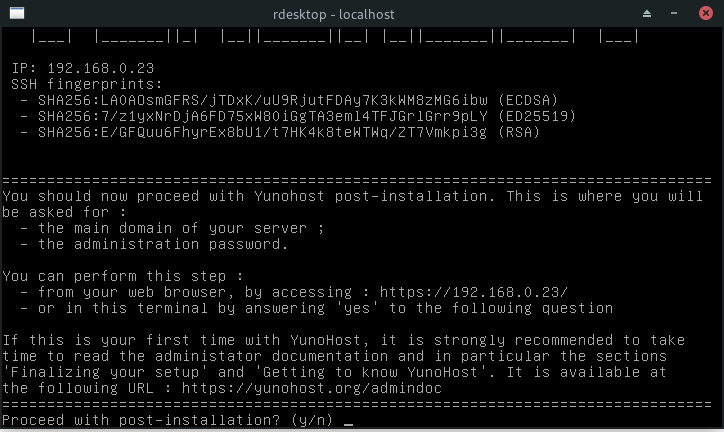{:width="400"}

Se connecter en *admin*  
Lancer une mise à jour

    sudo apt update && sudo apt -y upgrade

Relever adresse ip : 192.168.0.36  et adresse mac : 08:00:27:3c:82:f2   
inet6 fe80::a00:27ff:fe3c:82f2/64
connexion via SSH

    ssh admin@192.168.0.36

### Locales

Pour avoir l'interface en français  

    sudo -s
    nano /etc/locale.gen 

Supprimer le `#` de la ligne fr_FR.UTF-8  
Générer 

    locale-gen

```
Generating locales (this might take a while)...
  fr_FR.UTF-8... done
```

### Freebox

**DMZ**  
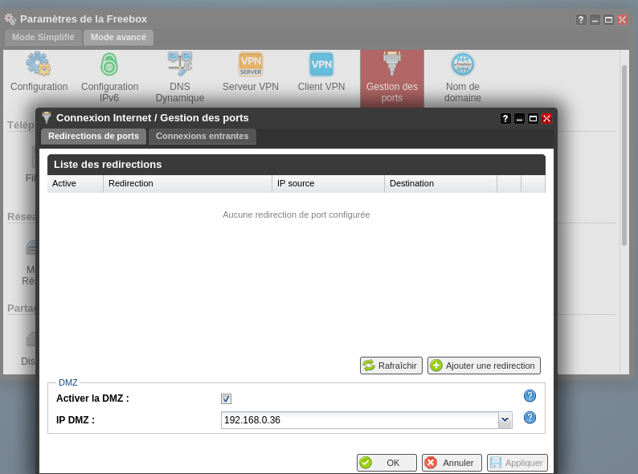{:width="600"}

A partir des éléments fournis par `ip a`, définir un **Next Hop ipv6** (2a01:e34:eebf:df2::/64) sur la freebox   
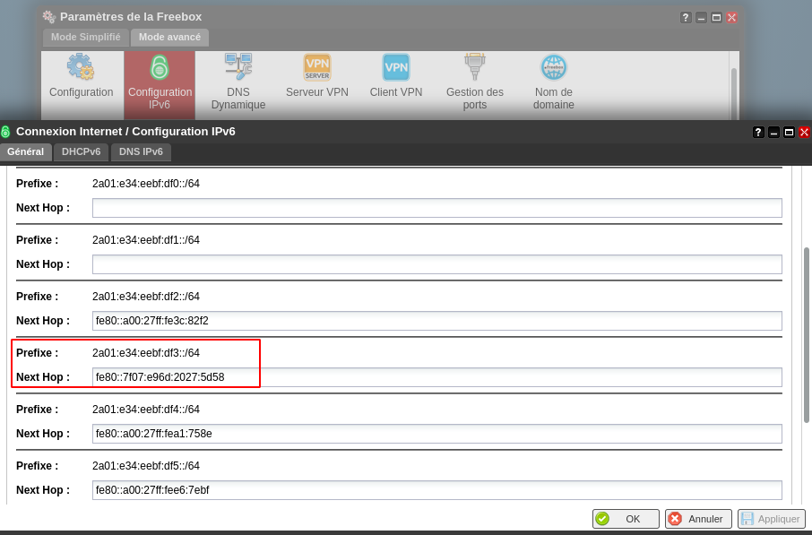{:width="600"}  

Créer le **Reverse DNS** <ouestline.net> dans l'espace abonné Free (MA FREEBOX &rarr; Reverse DNS)  

### adressage IPV6

Modifier l'interface réseau **/etc/network/interfaces** pour un adressage IPV6   

```
# This file describes the network interfaces available on your system
# and how to activate them. For more information, see interfaces(5).

source /etc/network/interfaces.d/*

# The loopback network interface
auto lo
iface lo inet loopback

# The primary network interface
allow-hotplug enp0s3
iface enp0s3 inet dhcp
# This is an autoconfigured IPv6 interface
#iface enp0s3 inet6 auto
iface enp0s3 inet6 static
 address 2a01:e34:eebf:df2::1
 netmask 64
 post-up ip -6 route add default via fe80::224:d4ff:fea6:aa20 dev enp0s3
```

Et redémarrer `sudo systemctl reboot`  

Vérification adressage IPV6

    ip a

```
1: lo: <LOOPBACK,UP,LOWER_UP> mtu 65536 qdisc noqueue state UNKNOWN group default qlen 1
    link/loopback 00:00:00:00:00:00 brd 00:00:00:00:00:00
    inet 127.0.0.1/8 scope host lo
       valid_lft forever preferred_lft forever
    inet6 ::1/128 scope host 
       valid_lft forever preferred_lft forever
2: enp0s3: <BROADCAST,MULTICAST,UP,LOWER_UP> mtu 1500 qdisc pfifo_fast state UP group default qlen 1000
    link/ether 08:00:27:3c:82:f2 brd ff:ff:ff:ff:ff:ff
    inet 192.168.0.36/24 brd 192.168.0.255 scope global enp0s3
       valid_lft forever preferred_lft forever
    inet6 2a01:e34:eebf:df2::1/64 scope global 
       valid_lft forever preferred_lft forever
    inet6 2a01:e34:eebf:df0:a00:27ff:fe3c:82f2/64 scope global mngtmpaddr dynamic 
       valid_lft 85869sec preferred_lft 85869sec
    inet6 fe80::a00:27ff:fe3c:82f2/64 scope link 
       valid_lft forever preferred_lft forever
```

### OVH - Configuration DNS ouestline.net

<font color="green"><b>On fait le choix de définir le domaine ouestline.net en IPV6 uniquement</b></font>

Informations yunohost sur le domaine ouestline.net

```
; Basic ipv4/ipv6 records
@ 3600 IN A 78.235.240.223
* 3600 IN A 78.235.240.223
@ 3600 IN AAAA 2a01:e34:eebf:df2::1
* 3600 IN AAAA 2a01:e34:eebf:df2::1

; XMPP
_xmpp-client._tcp 3600 IN SRV 0 5 5222 ouestline.net.
_xmpp-server._tcp 3600 IN SRV 0 5 5269 ouestline.net.
muc 3600 IN CNAME @
pubsub 3600 IN CNAME @
vjud 3600 IN CNAME @

; Mail
@ 3600 IN MX 10 ouestline.net.
@ 3600 IN TXT "v=spf1 a mx ip4:78.235.240.223 ip6:2a01:e34:eebf:df2::1 -all"
mail._domainkey 3600 IN TXT "v=DKIM1; h=sha256; k=rsa; p=MIGfMA0GCSqGSIb3DQEBAQUAA4GNADCBiQKBgQDOT4EhluaTJNwVu668Wn6+OVhuQQUn94KcAOAXi+xKpjH+LA4g/5p6WUUV1Qo4Vgp9Il90dZKM/vAjilchXB+vePT2XZwqWIvjxTYD6s97E/YBYbEVUJdoCoZlxaQPS+T90ikJJje8vK9SO4AMuQKGxzHeTzM4dHIVDMQCXmQUfQIDAQAB"
_dmarc 3600 IN TXT "v=DMARC1; p=none"

; Extra
@ 3600 IN CAA 128 issue "letsencrypt.org"
```

Paramétrage de la zone DNS OVH ouestline.net

```
$TTL 3600
@	IN SOA dns111.ovh.net. tech.ovh.net. (2020012301 86400 3600 3600000 300)
                       IN NS     dns111.ovh.net.
                       IN NS     ns111.ovh.net.
                       IN MX     10 ouestline.net.
                       IN A      78.235.240.223
                       IN AAAA   2a01:e34:eebf:df2::1
                       IN CAA    128 issue "letsencrypt.org"
                   600 IN TXT    "v=spf1 mx ip4:78.235.240.223 ip6:2a01:e34:eebf:df2::1 -all"
*                      IN CNAME  ouestline.net.
_dmarc                 IN TXT    "v=DMARC1;p=none;"
mail._domainkey        IN TXT    ( "v=DKIM1;h=sha256;k=rsa;s=*;p=MIGfMA0GCSqGSIb3DQEBAQUAA4GNADCBiQKBgQDOT4EhluaTJNwVu668Wn6+OVhuQQUn94KcAOAXi+xKpjH+LA4g/5p6WUUV1Qo4Vgp9Il90dZKM/vAjilchXB+vePT2XZwqWIvjxTYD6s97E/YBYbEVUJdoCoZlxaQPS+T90ikJJje8vK9SO4AMuQKGxzHeTzM4dHIVDMQCXmQUfQIDAQAB;" )
```

### Dnsmasq

Modifier l'adresse IPV6 , dernière ligne du fichier suivant **/etc/dnsmasq.d/ouestline.net**

```
address=/ouestline.net/78.235.240.223
txt-record=ouestline.net,"v=spf1 mx a -all"
mx-host=ouestline.net,ouestline.net,5
srv-host=_xmpp-client._tcp.ouestline.net,ouestline.net,5222,0,5
srv-host=_xmpp-server._tcp.ouestline.net,ouestline.net,5269,0,5
address=/ouestline.net/2a01:e34:eebf:df2::1
```

Relancer

    sudo systemctl restart dnsmasq


### Acme - Certificats letsencrypt

><font color="red"><b>On ne peut pas utiliser la création des certificats proposé par yunohost car elle utilise  l'adressage ipv4</b></font>

[Génération des certificats avec le client acme.sh](https://yann.cinay.eu/2017/08/31/Acme-Certficats-Serveurs.html#g%C3%A9n%C3%A9ration-des-certificats-avec-le-client-acmesh)

La ligne de commande

    acme.sh --dns dns_ovh --ocsp --issue --keylength ec-384 -d 'ouestline.net' -d '*.ouestline.net'

Les certificats sont sous **/home/admin/.acme.sh/ouestline.net_ecc/**

```
[lundi 13 janvier 2020, 16:39:58 (UTC+0100)] Your cert is in  /home/admin/.acme.sh/ouestline.net_ecc/ouestline.net.cer 
[lundi 13 janvier 2020, 16:39:58 (UTC+0100)] Your cert key is in  /home/admin/.acme.sh/ouestline.net_ecc/ouestline.net.key 
[lundi 13 janvier 2020, 16:39:58 (UTC+0100)] The intermediate CA cert is in  /home/admin/.acme.sh/ouestline.net_ecc/ca.cer 
[lundi 13 janvier 2020, 16:39:58 (UTC+0100)] And the full chain certs is there:  /home/admin/.acme.sh/ouestline.net_ecc/fullchain.cer 

```

Remplacer les certificats actuels

```
sudo mv /etc/yunohost/certs/ouestline.net/crt.pem /etc/yunohost/certs/ouestline.net/crt.pem.sav
sudo mv /etc/yunohost/certs/ouestline.net/key.pem /etc/yunohost/certs/ouestline.net/key.pem.sav
sudo ln -s /home/admin/.acme.sh/ouestline.net_ecc/fullchain.cer /etc/yunohost/certs/ouestline.net/crt.pem
sudo ln -s /home/admin/.acme.sh/ouestline.net_ecc/ouestline.net.key /etc/yunohost/certs/ouestline.net/key.pem
sudo systemctl restart nginx
```

Vérifier par le lien <https://ouestline.net> que la connexion est sécurisée  
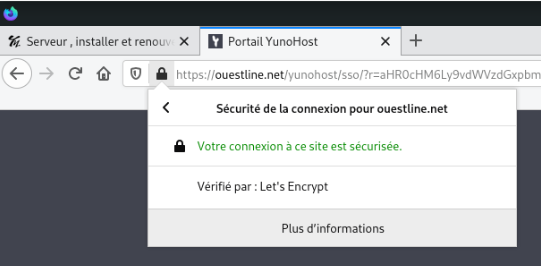{:width="300"}

Le renouvellement est fait automatiquement avec le "scheduler" admin

    crontab -l

```
25 0 * * * "/home/admin/.acme.sh"/acme.sh --cron --home "/home/admin/.acme.sh" > /dev/null
```

Vérifier le fonctionnement du script

    "/home/admin/.acme.sh"/acme.sh --cron --ocsp --home "/home/admin/.acme.sh"

```
[lundi 13 janvier 2020, 16:42:31 (UTC+0100)] ===Starting cron===
[lundi 13 janvier 2020, 16:42:31 (UTC+0100)] Renew: 'ouestline.net'
[lundi 13 janvier 2020, 16:42:31 (UTC+0100)] Skip, Next renewal time is: vendredi 13 mars 2020, 15:39:58 (UTC+0000)
[lundi 13 janvier 2020, 16:42:31 (UTC+0100)] Add '--force' to force to renew.
[lundi 13 janvier 2020, 16:42:31 (UTC+0100)] Skipped ouestline.net_ecc
[lundi 13 janvier 2020, 16:42:31 (UTC+0100)] ===End cron===
```

### ouestline.net - dh+ocsp

>Les commandes se font en mode su ou sudo

*[Wikipédia : Échange de clés Diffie-Hellman](https://fr.wikipedia.org/wiki/%C3%89change_de_cl%C3%A9s_Diffie-Hellman)  
En cryptographie, l'échange de clés Diffie-Hellman, du nom de ses auteurs Whitfield Diffie et Martin Hellman, est une méthode1, publiée en 1976, par laquelle deux agents, nommés par convention Alice et Bob, peuvent se mettre d'accord sur un nombre (qu'ils peuvent utiliser comme clé pour chiffrer la conversation suivante) sans qu'un troisième agent appelé Ève puisse découvrir le nombre, même en ayant écouté tous leurs échanges.*  
.svg){:width="300"}  
*Illustration conceptuelle d'un échange de clés Diffie-Hellman*

Générer la clé dh

    sudo -s
    openssl dhparam -out /etc/ssl/private/dh2048.pem -outform PEM -2 2048

*[Wikipédia : Online Certificate Status Protocol](https://fr.wikipedia.org/wiki/Online_Certificate_Status_Protocol) (OCSP, en français « protocole de vérification de certificat en ligne ») est un protocole Internet utilisé pour valider un certificat numérique X.509. OCSP est standardisé par l'IETF dans la RFC 69601.*  

comment la requête OCSP est formée et envoyée<br> vers le serveur OCSP. |  comment la réponse OCSP est formée<br> et envoyée vers le client OCSP.<br>Cette réponse peut être : GOOD, REVOKED ou UNKNOWN.
----------- | ------------------
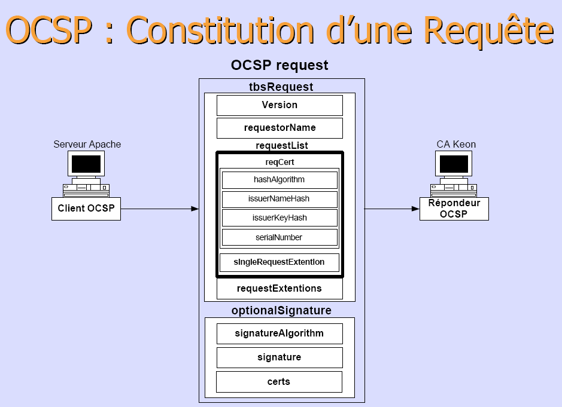{:width="300"}  | {:width="300"} 


Modifier le fichier de configuration **/etc/nginx/conf.d/ouestline.net.conf** pour activer dh et ocsp   
Supprimer le `#` qui précède la commande `ssl_dhparam /etc/ssl/private/dh2048.pem;`  
Ajouter ce qui suit la ligne suivante

```
    # OCSP settings
    ssl_stapling on;
    ssl_stapling_verify on;
    ssl_trusted_certificate /etc/yunohost/certs/ouestline.net/crt.pem;
    resolver 127.0.0.1;
```

Vérifier et relancer nginx

    nginx -t
    systemctl restart nginx

Tester la réponse OCSP

    openssl s_client -connect ouestline.net:443 -status < /dev/null

```
[...]
OCSP response: 
======================================
OCSP Response Data:
    OCSP Response Status: successful (0x0)
    Response Type: Basic OCSP Response
    Version: 1 (0x0)
    Responder Id: C = US, O = Let's Encrypt, CN = Let's Encrypt Authority X3
    Produced At: Jan 11 07:58:00 2020 GMT
    Responses:
    Certificate ID:
      Hash Algorithm: sha1
      Issuer Name Hash: 7729AB3FCF8A22064A12DEE66AE76071085D6C16
      Issuer Key Hash: ADDDBAE6D139B74565EFF384A6A63047A8ECA1A6
      Serial Number: 60B5D00F31795538F9C2C9A60354993266A5
    Cert Status: good
[...]
```

### Openssl version 1.1.1x (NON IMPLANTE)

Pour installer une version openssl plus récente et PHP7.x

```
# Nouvelle source pour installer Openssl , PHP7
apt-get -y install apt-transport-https lsb-release ca-certificates
wget -O /etc/apt/trusted.gpg.d/php.gpg https://packages.sury.org/php/apt.gpg
sh -c 'echo "deb https://packages.sury.org/php/ $(lsb_release -sc) main" > /etc/apt/sources.list.d/php.list'
apt update && apt upgrade -y
```

### Additions invité (nécessaire pour le partage)

Ouvrir **phpvirtualbox** et sélectionner *stockage* de la machine virtuelle 'ynh'  
Insérer le cdrom contenant l'image **VBoxGuestAdditions.iso** (située généralement sous **/usr/share/virtualbox**)

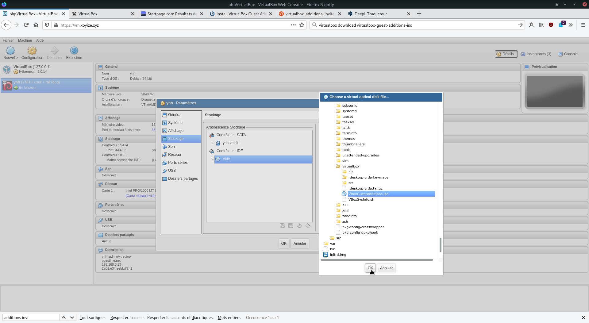{:width="600"}  
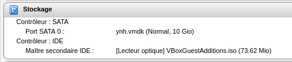{:width="300"}  

Ajouter un partage qui sera pris en compte au prochain démarrage  
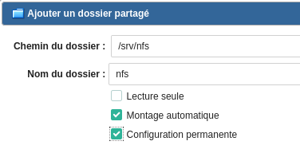{:width="200"}  

Connexion sur la machine virtuelle 'ynh' : `ssh admin@192.168.0.36`  
Installer les additions client dans un Debian en cours d’exécution dans une machine virtuelle.

*    Installez gcc ,make et kernel headers (installateur a besoin d’eux pour construire le module du noyau):`sudo apt install gcc make linux-headers-$(uname -r)`
*    Monter le cd dans la machine virtuelle : `sudo mount /dev/cdrom /media/cdrom`
*    Allez dans le dossier monté : `cd /media/cdrom`
*    Exécutez : `sudo ./VBoxLinuxAdditions.run` , patienter quelques minutes...

>Redémarrer la machine virtuelle : `sudo systemctl reboot`

## Sécurité

### Authentification SSH par clé

Sur le <u>poste appelant</u>, générer un jeu de clés

    ssh-keygen -t ed25519 -o -a 100 -f ouestline

Copier la clé publique sur le serveur ynh 

    ssh-copy-id -i ouestline.pub admin@192.168.0.36

Sur le <u>serveur ynh</u>, éditez le fichier de configuration SSH, pour désactiver l’authentification par mot de passe et changer de port

    sudo nano /etc/ssh/sshd_config

```
port 55032
PasswordAuthentication no
```

Sauvegardez et relancez le démon SSH

    sudo systemctl restart ssh

Activer et désactiver les ports dans le pare feu

    sudo yunohost firewall allow TCP 55032  # activation port 55032
    sudo yunohost firewall disallow TCP 22  # désactivation port 22

### Désactivation de l’API YunoHost

YunoHost est administrable via une API HTTP, servie sur le port 6787 par défaut (seulement sur localhost). Elle permet d’administrer une grande partie de votre serveur, et peut donc être utilisée à des fins malveillantes. La meilleure chose à faire si vous êtes habitués aux lignes de commande est de désactiver le service yunohost-api, et utiliser la ligne de commande en SSH.

    sudo systemctl disable yunohost-api
    sudo systemctl stop yunohost-api

### Modifications des mots de passe

En ligne de commande 

    ssh admin@192.168.0.36 -p 55032 -i /home/yannick/.ssh/ouestline # connexion SSH
    sudo -s
    yunohost tools adminpw -n Nouveau_mot_de_passe        # modifier mot de passe administrateur
    yunohost user update ouest -p Nouveau_mot_de_passe    # modifier mot de passe utilisateur

### Vérifications

Accès ipv4 ipv6

     ping4 -c3 ouestline.net

```
PING ouestline.net (78.235.240.223) 56(84) bytes of data.
64 bytes from smm49-1-78-235-240-223.fbx.proxad.net (78.235.240.223): icmp_seq=1 ttl=49 time=16.2 ms
64 bytes from smm49-1-78-235-240-223.fbx.proxad.net (78.235.240.223): icmp_seq=2 ttl=49 time=15.9 ms
64 bytes from smm49-1-78-235-240-223.fbx.proxad.net (78.235.240.223): icmp_seq=3 ttl=49 time=17.5 ms

--- ouestline.net ping statistics ---
3 packets transmitted, 3 received, 0% packet loss, time 2002ms
rtt min/avg/max/mdev = 15.959/16.592/17.556/0.708 ms
```

    ping6 -c3 ouestline.net

```
PING ouestline.net(2a01:e34:eebf:df2::1 (2a01:e34:eebf:df2::1)) 56 data bytes
64 bytes from 2a01:e34:eebf:df2::1 (2a01:e34:eebf:df2::1): icmp_seq=1 ttl=51 time=16.8 ms
64 bytes from 2a01:e34:eebf:df2::1 (2a01:e34:eebf:df2::1): icmp_seq=2 ttl=51 time=16.7 ms
64 bytes from 2a01:e34:eebf:df2::1 (2a01:e34:eebf:df2::1): icmp_seq=3 ttl=51 time=32.2 ms
```

Reverse DNS

    dig A ouestline.net +noall +answer

```
; <<>> DiG 9.11.5-P4-5.1-Debian <<>> A ouestline.net +noall +answer
;; global options: +cmd
ouestline.net.		3600	IN	A	78.235.240.223
```

[Blacklist Check](https://whatismyipaddress.com/blacklist-check) (vérifier si l'adresse IP 78.235.240.223 n'est pas dans une liste noire)

## Applications - ynh

### RainLoop  

*RainLoop est un client de messagerie web libre pour le protocole IMAP*  
Installation via yunohost admin

### Transmission  

*Transmission est un client BitTorrent intuitif, fonctionnel et très léger. Il dispose de fonctionnalités comme le chiffrement des échanges de données, l'échange de pairs, le support des blocklists, la limitation des débits en émission et en réception, etc...*  
Installation via yunohost admin

### Firefox Sync Server

*Le serveur de synchronisation de Mozilla, pour héberger vos données Firefox*  
Installation en ligne de commande

    sudo -s
    yunohost app install https://github.com/YunoHost-Apps/ffsync_ynh

```
AVERTISSEMENT ! L'installation d'applications tierces peut compromettre l'intégrité et la sécurité de votre système. Vous ne devriez probablement PAS l'installer si vous ne savez pas ce que vous faites. Êtes-vous prêt à prendre ce risque ? [Y/N]  : Y
Domaines disponibles :
- ouestline.net
Choisissez un domaine pour Firefox-Sync (default: ouestline.net) : 
Choisissez un chemin pour Firefox-Sync (default: /ffsync) : 
Info : Installation de l'application ffsync …
Info : [....................] > Validating installation parameters...
Info : [++++++..............] > Installing dependencies...
Info : [######+.............] > Configuring MySQL database...
Info : [#######++++++++.....] > Installing sources files...
Attention : DEPRECATION: Python 2.7 will reach the end of its life on January 1st, 2020. Please upgrade your Python as Python 2.7 won't be maintained after that date. A future version of pip will drop support for Python 2.7. More details about Python 2 support in pip, can be found at https://pip.pypa.io/en/latest/development/release-process/#python-2-support
[...]

Info : [###############+....] > Configuring nginx
Info : [################....] > Configuring system user...
Info : [################+...] > Configuring application...
Attention : Created symlink /etc/systemd/system/multi-user.target.wants/uwsgi-app@ffsync.service → /etc/systemd/system/uwsgi-app@.service.
Info : [#################+..] > Protecting directory
Info : [##################+.] > Configuring permissions
Info : [####################] > Installation of ffsync completed
Succès ! La configuration de SSOwat a été générée
Succès ! Installation terminée
```


Lancer l'application FFsync depuis le tableau de bord yunohost

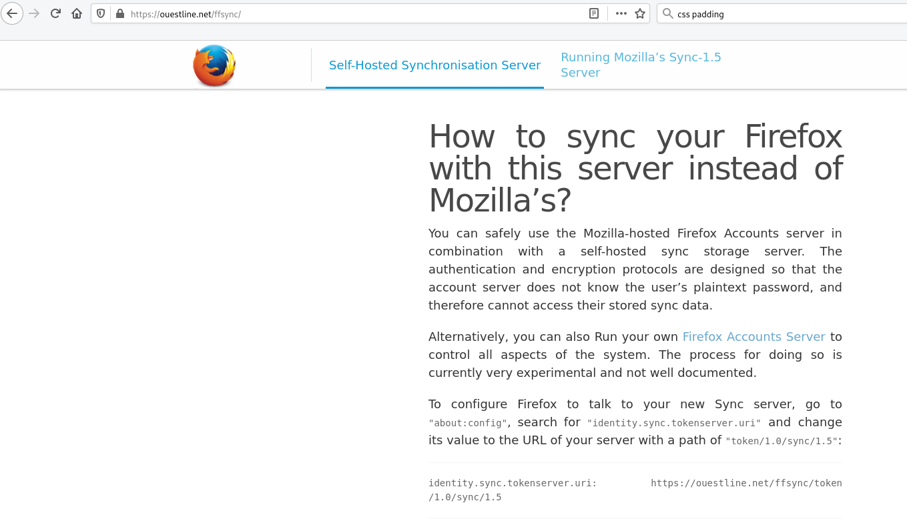{:width="600"}  

Procéder à la modification (comme indiqué)  
Pour configurer Firefox pour qu'il parle à votre nouveau serveur Sync, allez dans "`about:config`", cherchez "`identity.sync.tokenserver.uri`" et changez sa valeur en URL de votre serveur avec un chemin d'accès de "token/1.0/sync/1.5" :  
`identity.sync.tokenserver.uri` &rarr; https://ouestline.net/ffsync/token/1.0/sync/1.5   
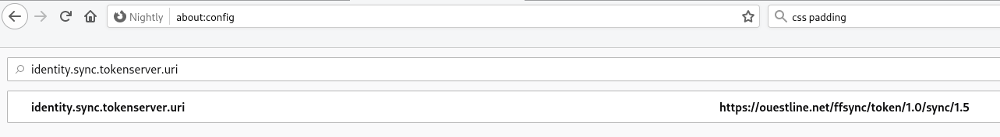{:width="400"}  

Puis se rendre dans "Préférences &rarr; Sync"  
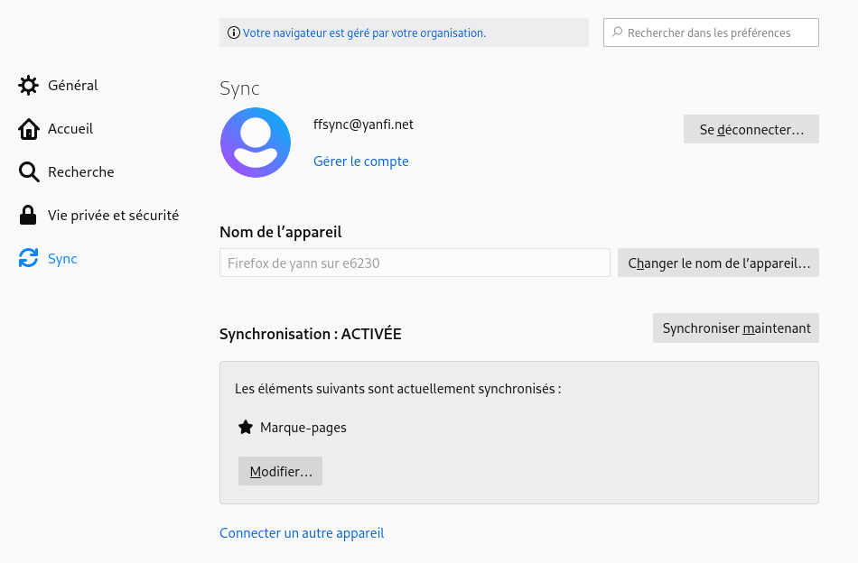{:width="400"}  


