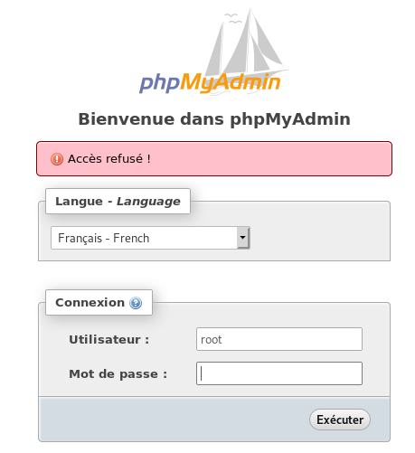
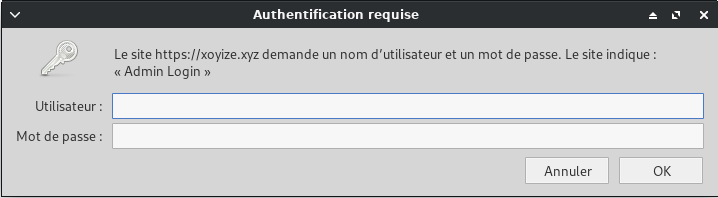
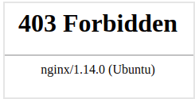

+++
title = 'PhpMyAdmin (gestionnaire bases mysql/mariadb)'
date = 2020-02-21 00:00:00 +0100
categories = ['debian', 'serveur']
+++
## PhpMyAdmin

* [How to Install and Secure phpMyAdmin with Nginx on a Debian 9 server](https://www.digitalocean.com/community/tutorials/how-to-install-and-secure-phpmyadmin-with-nginx-on-a-debian-9-server)
* [How To Install phpMyAdmin From Source on Debian 10](https://www.digitalocean.com/community/tutorials/how-to-install-phpmyadmin-from-source-debian-10)
* [How to Create MySQL Users Accounts and Grant Privileges](https://linuxize.com/post/how-to-create-mysql-user-accounts-and-grant-privileges/)

introduction

Alors que de nombreux utilisateurs ont besoin des fonctionnalités d'un système de gestion de base de données tel que MariaDB, ils peuvent ne pas se sentir à l'aise d'interagir avec le système uniquement à partir de l'invite de MariaDB.

phpMyAdmin a été créé pour permettre aux utilisateurs d'interagir avec MariaDB via une interface Web. Dans ce guide, nous verrons comment installer et sécuriser phpMyAdmin afin que vous puissiez l’utiliser en toute sécurité pour gérer vos bases de données sur un système Debian 10.
Conditions préalables

Avant de commencer avec ce guide, vous aurez besoin des éléments suivants:

* Accès à un serveur Debian 10. Ce serveur doit avoir un utilisateur non root avec des privilèges sudo et un pare-feu .
* Une pile LEMP ( Linux, Nginx, MariaDB et PHP) installée sur votre serveur Debian 10. 

>Remarque: MariaDB est un fork de MySQL développé par la communauté. Bien que les deux programmes soient étroitement liés, ils ne sont pas complètement interchangeables. Bien que phpMyAdmin ait été spécialement conçu pour gérer les bases de données MySQL et fasse référence à MySQL dans diverses boîtes de dialogue, soyez assuré que votre installation de MariaDB fonctionnera correctement avec phpMyAdmin.

Enfin, il existe des considérations de sécurité importantes lors de l’utilisation de logiciels tels que phpMyAdmin, dans la mesure où:

* Communique directement avec votre installation MariaDB
* Gère l'authentification à l'aide des informations d'identification MariaDB
* Exécute et renvoie les résultats pour des requêtes SQL arbitraires 

>*Pour ces raisons, et parce qu'il s'agit d'une application PHP largement déployée et fréquemment attaquée, vous ne devez jamais exécuter phpMyAdmin sur des systèmes distants via une simple connexion HTTP.*


### Installer phpMyAdmin et les paquetages recommandés

Avant d'installer et de configurer phpMyAdmin, la documentation officielle vous recommande d'installer quelques extensions PHP sur votre serveur pour activer certaines fonctionnalités et améliorer les performances.

Il est recommandé d'installer en supplément ces packages:

*    php-mbstring : une extension PHP utilisée pour gérer des chaînes non-ASCII et convertir des chaînes en différents encodages
*    php-zip : un module PHP qui supporte le téléchargement de fichiers .zip vers phpMyAdmin
*    php-gd : un autre module PHP, celui-ci permet de supporter la bibliothèque graphique GD 

Mettre à jour l’index de paquet de votre serveur  

      sudo apt update

Ensuite, utilisez apt pour extraire les fichiers et les installer sur votre système:

      sudo apt installer php-mbstring php-zip php-gd

Ensuite, nous pouvons installer phpMyAdmin. Au moment de la rédaction de ce document, phpMyAdmin n'est pas disponible à partir des référentiels Debian par défaut. Vous devrez donc télécharger le code source sur votre serveur à partir du site phpMyAdmin.

Pour ce faire, naviguez jusqu'à la [page de téléchargements phpMyAdmin](https://www.phpmyadmin.net/downloads/) , faites défiler jusqu'au tableau contenant les liens de téléchargement de la dernière version stable et copiez le lien de téléchargement se terminant par tar.gz Ce lien pointe vers un fichier archive connu sous le nom d' archive tar qui, une fois extrait, créera un certain nombre de fichiers sur votre système. Au moment d'écrire ces lignes, la dernière version est la version 4.9.1.

      wget https://files.phpmyadmin.net/phpMyAdmin/4.9.1/phpMyAdmin-4.9.1-all-languages.tar.gz

Extrayez ensuite l'archive:

      tar xvf phpMyAdmin-4.9.1-all-languages.tar.gz

Cela créera un certain nombre de nouveaux fichiers et répertoires sur votre serveur sous un répertoire parent nommé phpMyAdmin-4.9.1-all-languages

Puis exécutez la commande suivante. Cela déplacera le phpMyAdmin- 4.9.0.1 - all-languages et tous ses sous-répertoires vers le /usr/share/ , l'emplacement où phpMyAdmin s'attend à trouver ses fichiers de configuration par défaut. Il renommera également le répertoire en place simplement phpmyadmin :

      sudo mv phpMyAdmin-4.9.1-all-languages /usr/share/phpmyadmin

Avec cela, vous avez installé phpMyAdmin, mais vous devez effectuer plusieurs changements de configuration pour pouvoir accéder à phpMyAdmin via un navigateur Web.

### Configuration manuelle de phpMyAdmin

Lors de l'installation de phpMyAdmin avec un gestionnaire de paquets, comme c'est le cas dans un environnement Ubuntu, phpMyAdmin utilise par défaut le mode «Configuration zéro» qui effectue automatiquement plusieurs actions pour configurer le programme. Comme nous l'avons installé à partir des sources dans ce guide, nous devrons effectuer ces étapes manuellement.

Pour commencer, créez un nouveau répertoire où phpMyAdmin stockera ses fichiers temporaires:

      sudo mkdir -p /var/lib/phpmyadmin/tmp

Définissez www-data - le profil utilisateur Linux que les serveurs Web tels qu'Apache utilisent par défaut pour les opérations normales sur les systèmes Ubuntu et Debian - en tant que propriétaire de ce répertoire:

      sudo chown -R www-data:www-data /var/lib/phpmyadmin

Les fichiers que vous avez extraits précédemment incluent un exemple de fichier de configuration que vous pouvez utiliser comme fichier de configuration de base. Faites une copie de ce fichier en le conservant dans le /usr/share/phpmyadmin et renommez-le config.inc.php :

      sudo cp /usr/share/phpmyadmin/config.sample.inc.php /usr/share/phpmyadmin/config.inc.php

Ouvrez ce fichier en utilisant votre éditeur de texte préféré. Ici, nous allons utiliser le nano :

      sudo nano /usr/share/phpmyadmin/config.inc.php

phpMyAdmin utilise la méthode d'authentification par cookie par défaut, qui vous permet de vous connecter à phpMyAdmin comme n'importe quel utilisateur MariaDB valide à l'aide de cookies . Dans cette méthode, le mot de passe de l'utilisateur MariaDB est stocké et crypté avec l' algorithme Advanced Encryption Standard (AES) dans un cookie temporaire.

Historiquement, phpMyAdmin utilisait à la place le chiffre de Blowfish à cette fin, et cela est toujours reflété dans son fichier de configuration. Faites défiler jusqu'à la ligne commençant par $cfg['blowfish_secret'] . Il ressemblera à ceci:

      sudo nano /usr/share/phpmyadmin/config.inc.php

```
 . . . 
 $cfg['blowfish_secret'] = ''; /* YOU MUST FILL IN THIS FOR COOKIE AUTH! */ 
 . . . 
```

Entre les guillemets simples, entrez une chaîne de 32 caractères aléatoires. Ce n'est pas une phrase secrète dont vous devez vous rappeler, elle sera simplement utilisée en interne par l'algorithme AES:

      sudo nano /usr/share/phpmyadmin/config.inc.php

```
 . . . 
 $cfg['blowfish_secret'] = ' STRINGOFTHIRTYTWORANDOMCHARACTERS '; /* YOU MUST FILL IN THIS FOR COOKIE AUTH! */
 . . . 
```

Remarque: si la phrase secrète que vous entrez ici a moins de 32 caractères, les cookies cryptés seront moins sécurisés. Entrer une chaîne de plus de 32 caractères ne causera toutefois aucun préjudice.

Pour générer une chaîne de caractères vraiment aléatoire, vous pouvez installer et utiliser le programme pwgen :

      sudo apt install pwgen  

Par défaut, pwgen crée des pwgen faciles à prononcer, bien que moins sécurisés. Cependant, en incluant l'indicateur -s , comme dans la commande suivante, vous pouvez créer un mot de passe complètement aléatoire et difficile à mémoriser. Notez les deux derniers arguments de cette commande: 32 , qui pwgen la longueur de la chaîne de mot de passe générée par pwgen ; et 1 qui indique à pwgen le nombre de chaînes qu'il doit générer:

      pwgen -s 32 1

Ensuite, faites défiler jusqu'au commentaire qui lit `/* User used to manipulate with storage */` Cette section inclut certaines directives qui définissent un utilisateur de la base de données MariaDB nommé pma qui effectue certaines tâches administratives dans phpMyAdmin. Selon la documentation officielle , ce compte utilisateur spécial n'est pas nécessaire dans les cas où un seul utilisateur aura accès à phpMyAdmin, mais il est recommandé dans les scénarios multi-utilisateurs.

Supprimez les controlpass directives controluser et controlpass en supprimant les barres obliques précédentes. Puis mettez à jour la directive controlpass pour qu'elle pointe vers un mot de passe sécurisé de votre choix. Si vous ne le faites pas, le mot de passe par défaut restera en place et des utilisateurs inconnus pourraient facilement accéder à votre base de données via l'interface phpMyAdmin.

Après avoir apporté ces modifications, cette section du fichier ressemblera à ceci:

```
. . .
/* User used to manipulate with storage */
// $cfg['Servers'][$i]['controlhost'] = '';
// $cfg['Servers'][$i]['controlport'] = '';
$cfg['Servers'][$i]['controluser'] = 'pma';
$cfg['Servers'][$i]['controlpass'] = 'password';
. . .
```

En dessous de cette section, vous trouverez une autre section précédée d'un commentaire intitulé `/* Storage database and tables */` . Cette section inclut un certain nombre de directives qui définissent le stockage de configuration de phpMyAdmin , une base de données et plusieurs tables utilisées par l'utilisateur de la base de données administrative pma . Ces tables permettent d'activer un certain nombre de fonctionnalités de phpMyAdmin, notamment les signets, les commentaires, la génération de PDF, etc.

Supprimez la mise en commentaire de chaque ligne de cette section en supprimant les barres obliques au début de chaque ligne pour donner l’apparence suivante:

```
. . .
/* Storage database and tables */
$cfg['Servers'][$i]['pmadb'] = 'phpmyadmin';
$cfg['Servers'][$i]['bookmarktable'] = 'pma__bookmark';
$cfg['Servers'][$i]['relation'] = 'pma__relation';
$cfg['Servers'][$i]['table_info'] = 'pma__table_info';
$cfg['Servers'][$i]['table_coords'] = 'pma__table_coords';
$cfg['Servers'][$i]['pdf_pages'] = 'pma__pdf_pages';
$cfg['Servers'][$i]['column_info'] = 'pma__column_info';
$cfg['Servers'][$i]['history'] = 'pma__history';
$cfg['Servers'][$i]['table_uiprefs'] = 'pma__table_uiprefs';
$cfg['Servers'][$i]['tracking'] = 'pma__tracking';
$cfg['Servers'][$i]['userconfig'] = 'pma__userconfig';
$cfg['Servers'][$i]['recent'] = 'pma__recent';
$cfg['Servers'][$i]['favorite'] = 'pma__favorite';
$cfg['Servers'][$i]['users'] = 'pma__users';
$cfg['Servers'][$i]['usergroups'] = 'pma__usergroups';
$cfg['Servers'][$i]['navigationhiding'] = 'pma__navigationhiding';
$cfg['Servers'][$i]['savedsearches'] = 'pma__savedsearches';
$cfg['Servers'][$i]['central_columns'] = 'pma__central_columns';
$cfg['Servers'][$i]['designer_settings'] = 'pma__designer_settings';
$cfg['Servers'][$i]['export_templates'] = 'pma__export_templates';
. . .
```

Ces tables n'existent pas encore, mais nous les créerons sous peu.

Enfin, faites défiler vers le bas du fichier et ajoutez la ligne suivante. Cela configurera phpMyAdmin pour utiliser le /var/lib/phpmyadmin/tmp vous avez créé précédemment en tant que répertoire temporaire. phpMyAdmin utilisera ce répertoire temporaire comme cache de modèles, ce qui permet un chargement plus rapide des pages:

```
$cfg['TempDir'] = '/var/lib/phpmyadmin/tmp';
```

Enregistrez et fermez le fichier après avoir ajouté cette ligne. Si vous avez utilisé nano , vous pouvez le faire en appuyant sur CTRL + X , Y , puis sur ENTER .

Ensuite, vous devrez créer la base de données de stockage phpMyAdmin et ses tables. Lorsque vous avez installé phpMyAdmin à l’étape précédente, il s’est accompagné d’un fichier nommé create_tables.sql . Ce fichier SQL contient toutes les commandes nécessaires à la création de la base de données de stockage de la configuration et des tables nécessaires au bon fonctionnement de phpMyAdmin.

Exécutez la commande suivante pour utiliser le fichier create_tables.sql afin de créer la base de données de stockage de configuration et les tables:

      sudo -s
      mysql -uroot -p$(cat /etc/mysql/mdp) < /usr/share/phpmyadmin/sql/create_tables.sql

Ensuite, vous devrez créer l’utilisateur administratif pma   
Assurez-vous de changer le password de password pour l'aligner sur le mot de passe que vous avez défini dans le fichier config.inc.php :

      mysql -uroot -p$(cat /etc/mysql/mdp) -e "GRANT SELECT, INSERT, UPDATE, DELETE ON phpmyadmin.* TO 'pma'@'localhost' IDENTIFIED BY 'qzbXEHio0lwq';"

Si vous n'en avez pas déjà créé, vous devez également créer un utilisateur MariaDB habituel dans le but de gérer des bases de données via phpMyAdmin, car il est recommandé de vous connecter avec un autre compte que l'utilisateur pma .   
Vous pouvez créer un utilisateur disposant de privilèges sur toutes les tables de la base de données, ainsi que du pouvoir d'ajouter, de modifier et de supprimer des privilèges d'utilisateur, à l'aide de cette commande. Quels que soient les privilèges que vous attribuez à cet utilisateur, veillez également à lui attribuer un mot de passe fort:

      mysql -uroot -p$(cat /etc/mysql/mdp) -e "GRANT ALL PRIVILEGES ON *.* TO 'yanspm'@'localhost' IDENTIFIED BY 'DxShMzcc4v' WITH GRANT OPTION;"

## Sécuriser PhpMyAdmin

### Brouiller les pistes

L'un des moyens les plus élémentaires de protéger votre installation de phpMyAdmin est de le rendre plus difficile à trouver. Les robots rechercheront des chemins communs, tels que /phpmyadmin , /pma , /admin , /mysql et autres. Si vous modifiez l'URL de l'interface de /phpmyadmin en un nom non standard, les scripts automatisés auront beaucoup plus de difficulté à trouver votre installation phpMyAdmin et à tenter des attaques en force.

    sudo ln -s /usr/share/phpmyadmin /var/www/default-www/rienavoir


### Désactivation de la connexion root

Sur MySQL ainsi que sur les systèmes Linux classiques, le compte root est un compte administratif spécial avec un accès illimité au système. En plus d'être un compte privilégié, c'est un nom d'utilisateur connu, ce qui en fait une cible évidente pour les attaques par force brute. Pour minimiser les risques, nous allons configurer phpMyAdmin pour qu'il refuse toute tentative de connexion venant de la racine de l'utilisateur. Ainsi, même si vous fournissez des informations d'identification valides pour l'utilisateur racine , vous obtiendrez toujours une erreur «accès refusé» et vous ne serez pas autorisé à vous connecter.

Comme nous avons choisi d'utiliser dbconfig-common pour configurer et stocker les paramètres de phpMyAdmin, la configuration par défaut est actuellement stockée dans la base de données. Nous devrons créer un nouveau fichier **config.inc.php** pour définir nos paramètres personnalisés.

      sudo nano /usr/share/phpmyadmin/config.inc.php

désactiver les connexions sans mot de passe ( AllowNoPassword défini sur false ) et la connexion racine ( AllowRoot définie sur false ):


```
<?php
[...]
$cfg['Servers'][$i]['auth_type'] = 'cookie';
$cfg['Servers'][$i]['AllowNoPassword'] = false;
$cfg['Servers'][$i]['AllowRoot'] = false;
```

Les modifications s'appliqueront automatiquement. Si vous rechargez la page de connexion maintenant et essayez de vous connecter en tant que root, vous obtiendrez une erreur d' accès refusé :

{:width="300"}

La connexion racine est maintenant interdite sur votre installation de phpMyAdmin. Cette mesure de sécurité empêchera les scripts brute-force d'essayer de deviner le mot de passe de la base de données racine sur votre serveur. De plus, il imposera l'utilisation de comptes MySQL moins privilégiés pour accéder à l'interface Web de phpMyAdmin, qui constitue en soi une pratique de sécurité importante.

### Création d'une passerelle d'authentification

Cacher votre installation de phpMyAdmin à un emplacement inhabituel peut éviter certains robots automatisés analysant le réseau, mais il est inutile contre les attaques ciblées. Pour mieux protéger une application Web à accès restreint, il est généralement plus efficace d'arrêter les attaquants avant qu'ils ne puissent même accéder à l'application. De cette manière, ils ne pourront pas utiliser les exploits génériques ni les attaques par force brute pour deviner les informations d’accès.

Dans le cas spécifique de phpMyAdmin, il est encore plus important de garder l'interface de connexion sous clé. En restant ouvert au monde, vous offrez une plate-forme de force brute permettant aux attaquants de deviner les informations d'identification de votre base de données.

Ajouter une couche supplémentaire d'authentification à votre installation phpMyAdmin vous permet d'accroître la sécurité. Les utilisateurs devront passer par une invite d'authentification HTTP avant de voir l'écran de connexion phpMyAdmin. La plupart des serveurs Web, y compris Nginx, fournissent cette fonctionnalité de manière native.

Pour le configurer, nous devons d’abord créer un fichier de mots de passe pour stocker les informations d’authentification. Nginx exige que les mots de passe soient chiffrés à l'aide de la fonction crypt() . La suite OpenSSL, qui devrait déjà être installée sur votre serveur, inclut cette fonctionnalité.

Pour créer un fichier d'authentification avec un mot de passe crypté 

    sudo sh -c "echo -n 'yanspm:' >> /etc/nginx/.pma_pass"
    sudo sh -c "openssl passwd -apr1 >> /etc/nginx/.pma_pass"

Vous serez invité à entrer et à confirmer le mot de passe que vous souhaitez utiliser.
Ce fichier est constitué du nom d'utilisateur suivi de deux points (:), suivi de la version chiffrée du mot de passe.

Nous sommes maintenant prêts à modifier le fichier de configuration Nginx. Vous devez utiliser le fichier de configuration Nginx approprié pour l'emplacement Web où phpMyAdmin est actuellement hébergé. Ouvrez ce fichier dans votre éditeur de texte pour commencer:

      sudo nano /etc/nginx/conf.d//xoyize.xyz.d/phpadmin.conf

Localisez le bloc server et son location / section. Dans ce bloc, nous devrons définir deux directives différentes: auth_basic , qui définit le message qui sera affiché sur l'invite d'authentification, et auth_basic_user_file , pointant vers le fichier que nous venons de créer. Voici à quoi devrait ressembler votre fichier de configuration lorsque vous aurez terminé:

```
location /rienavoir {
    auth_basic "Admin Login";
    auth_basic_user_file /etc/nginx/.pma_pass;

    location ~ \.php$ {
           fastcgi_split_path_info ^(.+\.php)(/.+)$;
           fastcgi_pass unix:/run/php/php7.3-fpm.sock;   # PHP7.3
           fastcgi_index index.php;
           include fastcgi_params;
	   fastcgi_param SCRIPT_FILENAME $request_filename;
        }

}
```

Enregistrez et fermez le fichier lorsque vous avez terminé. Pour vérifier si le fichier de configuration est valide, vous pouvez exécuter:

      sudo nginx -t

Pour activer le nouveau portail d’authentification, vous devez recharger le serveur Web:

      sudo systemctl reload nginx

Maintenant, si vous visitez l'URL phpMyAdmin dans votre navigateur Web, le nom d'utilisateur et le mot de passe que vous avez ajoutés au fichier .pma_pass : https://xoyize.xyz/rienavoir

{:width="300"}

Une fois que vous avez entré vos identifiants, vous serez redirigé vers la page de connexion standard de phpMyAdmin.

>Remarque: Si l'actualisation de la page ne fonctionne pas, vous devrez peut-être effacer votre cache ou utiliser une session de navigateur différente si vous avez déjà utilisé phpMyAdmin.

En plus de fournir une couche de sécurité supplémentaire, cette passerelle aidera à garder vos journaux MySQL à l’abri des tentatives d’authentification spammeuses.

### Configuration de l'accès via des tunnels cryptés (facultatif)

Pour plus de sécurité, il est possible de verrouiller votre installation phpMyAdmin sur des hôtes autorisés uniquement. Vous pouvez ajouter des hôtes autorisés à la liste blanche dans votre fichier de configuration Nginx, de sorte que toute demande provenant d'une adresse IP ne figurant pas sur la liste soit refusée.

Même si cette fonctionnalité seule peut suffire dans certains cas d'utilisation, ce n'est pas toujours la meilleure solution à long terme, principalement en raison du fait que la plupart des gens n'accèdent pas à Internet à partir d'adresses IP statiques. Dès que vous obtenez une nouvelle adresse IP auprès de votre fournisseur Internet, vous ne pourrez plus accéder à l'interface phpMyAdmin tant que vous n'aurez pas mis à jour le fichier de configuration Nginx avec votre nouvelle adresse IP.

Pour une solution à long terme plus robuste, vous pouvez utiliser le contrôle d'accès basé sur IP pour créer une configuration dans laquelle les utilisateurs n'auront accès à votre interface phpMyAdmin que s'ils accèdent à partir d'une adresse IP autorisée ou d'un hôte local via un tunnel SSH . Nous verrons comment le configurer dans les sections ci-dessous.

La combinaison du contrôle d'accès basé sur IP avec le tunneling SSH augmente considérablement la sécurité car elle bloque totalement les accès provenant de l'internet public (à l'exception des IP autorisées), en plus de fournir un canal sécurisé entre l'utilisateur et le serveur via l'utilisation de tunnels chiffrés.

#### Configuration Nginx du contrôle d'accès basé sur IP

Sur Nginx, le contrôle d’accès basé sur IP peut être défini dans le bloc `location` correspondant d’un site donné, à l’aide des directives `allow` et `deny` . Par exemple, si nous voulons autoriser uniquement les demandes provenant d'un hôte donné, nous devons inclure les deux lignes suivantes, dans cet ordre, à l'intérieur du bloc `location` correspondant au site que nous souhaitons protéger:

```
allow hostname_or_IP;
deny all;
```

Vous pouvez autoriser autant d'hôtes que vous le souhaitez. Il vous suffit d'inclure une ligne d'autorisation (`allow`) pour chaque hôte / IP autorisé à l'intérieur du bloc `location` correspondant au site que vous protégez. Les directives seront évaluées dans le même ordre où elles sont répertoriées, jusqu'à ce qu'une correspondance soit trouvée ou que la demande soit finalement refusée en raison de la directive `deny all`

Nous allons maintenant configurer Nginx pour n’autoriser que les requêtes provenant de localhost ou de votre adresse IP actuelle. Tout d'abord, vous devez connaître l'adresse IP publique actuelle utilisée par votre ordinateur local pour se connecter à Internet. Il y a différentes façons d'obtenir cette information. pour plus de simplicité, nous allons utiliser le service fourni par ipinfo.io . Vous pouvez soit ouvrir l'URL <https://ipinfo.io/ip> dans votre navigateur, soit exécuter la commande suivante à partir de votre ordinateur local :

    curl https://ipinfo.io/ip

Vous devriez obtenir une adresse IP simple en sortie, comme ceci:

    203.0.113.111

C'est votre adresse IP publique actuelle. Nous allons configurer le bloc d'emplacement de phpMyAdmin pour n'autoriser que les requêtes provenant de cette adresse IP, en plus de localhost. Nous devrons éditer encore une fois le bloc de configuration pour phpMyAdmin dans /etc/nginx/sites-available/ example.com .

Ouvrez le fichier de configuration Nginx à l’aide de l’éditeur de ligne de commande de votre choix:

      sudo nano /etc/nginx/sites-available/example.com

Comme nous avons déjà une règle d'accès dans notre configuration actuelle, nous devons la combiner avec un contrôle d'accès basé sur IP à l'aide de la directive satisfy all . De cette façon, nous pouvons conserver l'invite d'authentification HTTP actuelle pour une sécurité accrue.

Voici à quoi devrait ressembler votre configuration de phpMyAdmin Nginx après l’édition:

```
server {
    . . .

    location /nothingtosee {
        satisfy all; #requires both conditions

        allow 203.0.113.111; #allow your IP
        allow 127.0.0.1; #allow localhost via SSH tunnels
        deny all; #deny all other sources

        auth_basic "Admin Login";
        auth_basic_user_file /etc/nginx/pma_pass;
    }

    . . .
}
```

Rappelez-vous de ne rien remplacer par le chemin d'accès réel où se trouve phpMyAdmin et l'adresse IP en surbrillance par votre adresse IP publique actuelle(nothingtosee et 203.0.113.111).

Enregistrez et fermez le fichier lorsque vous avez terminé. Pour vérifier si le fichier de configuration est valide, vous pouvez exécuter:

      sudo nginx -t

Rechargez maintenant le serveur Web pour que les modifications prennent effet:

      sudo systemctl reload nginx

Étant donné que votre adresse IP est explicitement répertoriée en tant qu'hôte autorisé, votre accès ne doit pas être perturbé. Toute personne essayant d'accéder à votre installation phpMyAdmin recevra maintenant une erreur 403 (interdite):

https://server_domain_or_IP/nothingtosee 



Dans la section suivante, nous verrons comment utiliser le tunneling SSH pour accéder au serveur Web via des requêtes locales. De cette façon, vous pourrez toujours accéder à l'interface de phpMyAdmin même lorsque votre adresse IP changera.

### Accéder à phpMyAdmin via un tunnel crypté

Le tunneling SSH fonctionne comme un moyen de rediriger le trafic réseau via des canaux cryptés. En exécutant une commande ssh similaire à celle que vous utiliseriez pour vous connecter à un serveur, vous pouvez créer un «tunnel» sécurisé entre votre ordinateur local et ce serveur. Tout le trafic entrant sur un port local donné peut maintenant être redirigé via le tunnel crypté et utiliser le serveur distant en tant que proxy, avant de recourir à Internet. Cela ressemble à ce qui se passe lorsque vous utilisez un VPN ( réseau privé virtuel ), mais la tunnelisation SSH est beaucoup plus simple à configurer.

Nous utiliserons le tunneling SSH pour envoyer par proxy nos demandes au serveur Web distant exécutant phpMyAdmin. En créant un tunnel entre votre machine locale et le serveur sur lequel phpMyAdmin est installé, vous pouvez rediriger les demandes locales vers le serveur Web distant. De plus, le trafic sera crypté et les demandes atteindront Nginx comme si elles venaient de localhost . Ainsi, quelle que soit l'adresse IP à laquelle vous vous connectez, vous pourrez accéder en toute sécurité à l'interface de phpMyAdmin.

Étant donné que le trafic entre votre machine locale et le serveur Web distant sera chiffré, il s'agit d'une alternative sûre dans les situations où vous ne pouvez pas installer de certificat SSL / TLS sur le serveur Web exécutant phpMyAdmin.

Depuis votre ordinateur local , lancez cette commande chaque fois que vous avez besoin d'accéder à phpMyAdmin:

      ssh user@server_domain_or_IP -L 8000:localhost:80 -L 8443:localhost:443 -N

Examinons chaque partie de la commande:

* **user** : utilisateur SSH pour se connecter au serveur sur lequel phpMyAdmin est en cours d'exécution
* **server_domain_or_IP** : hôte SSH où phpMyAdmin est en cours d'exécution
* **-L 8000:localhost:80** redirige le trafic HTTP sur le port 8000
* **-L 8443:localhost:443** redirige le trafic HTTPS sur le port 8443
* **-N** : n'exécute pas de commandes à distance 

Remarque: cette commande bloquera le terminal jusqu'à ce qu'elle soit interrompue par un CTRL+C , auquel cas elle mettra fin à la connexion SSH et arrêtera la redirection de paquets. Si vous préférez exécuter cette commande en arrière-plan, vous pouvez utiliser SSH avec l'option `-f` 

Maintenant, allez dans votre navigateur et remplacez **server_domain_or_IP** par `localhost:PORT` , où PORT correspond à 8000 pour HTTP ou 8443 à HTTPS:

    http://localhost:8000/nothingtosee
    https://localhost:443/nothingtosee

Ecran de connexion phpMyAdmin

>Remarque: Si vous accédez à phpMyAdmin via https , vous pourriez recevoir un message d'alerte mettant en cause la sécurité du certificat SSL. Cela se produit parce que le nom de domaine que vous utilisez (localhost) ne correspond pas à l'adresse enregistrée dans le certificat (domaine dans lequel phpMyAdmin est actuellement desservi). Il est prudent de procéder.

Toutes les demandes sur **localhost:8000** (HTTP) et **localhost:8443** (HTTPS) sont maintenant redirigées via un tunnel sécurisé vers votre application phpMyAdmin distante. Non seulement vous avez renforcé la sécurité en désactivant l'accès public à votre phpMyAdmin, mais vous avez également protégé tout le trafic entre votre ordinateur local et le serveur distant en utilisant un tunnel crypté pour envoyer et recevoir des données.

Si vous souhaitez imposer l'utilisation du tunnel SSH à toute personne souhaitant accéder à votre interface phpMyAdmin (vous inclus), vous pouvez le faire en supprimant toute autre adresse IP autorisée du fichier de configuration de Nginx, en laissant **127.0.0.1** comme seule autorisation autorisée. hôte pour accéder à cet emplacement. Étant donné que personne ne sera en mesure de faire des demandes directes à phpMyAdmin, il est prudent de supprimer l'authentification HTTP afin de simplifier votre configuration. Voici à quoi ressemblerait votre fichier de configuration dans un tel scénario:

    /etc/nginx/sites-available/example.com

```
server {
    . . .

    location /nothingtosee { 
        allow 127.0.0.1; #allow localhost only
        deny all; #deny all other sources
    }

    . . .
}

```

Une fois que vous rechargerez la configuration de Nginx avec sudo systemctl reload nginx , votre installation de phpMyAdmin sera verrouillée et les utilisateurs devront utiliser des tunnels SSH pour accéder à l'interface de phpMyAdmin via des requêtes redirigées.

