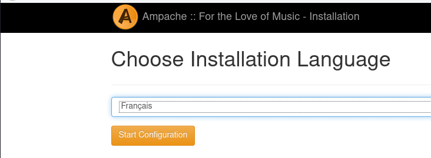
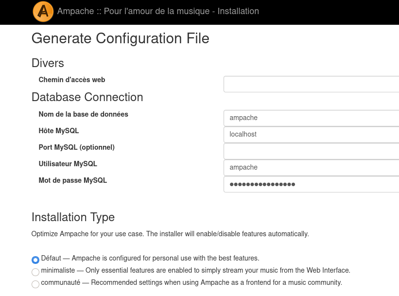
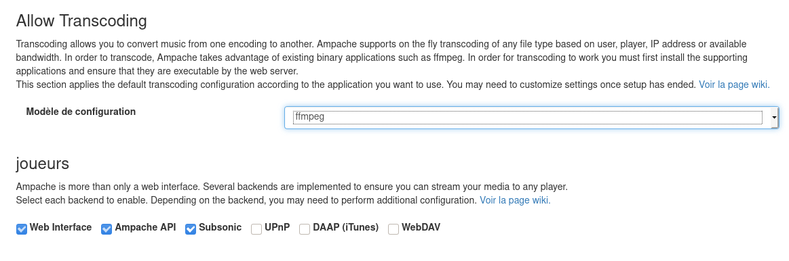
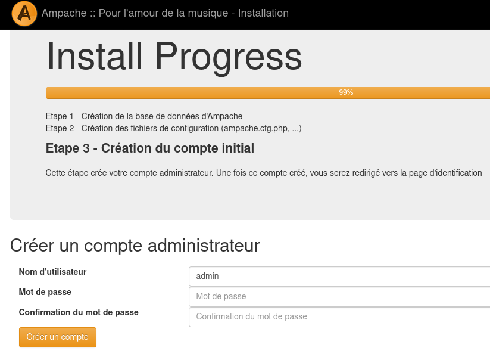
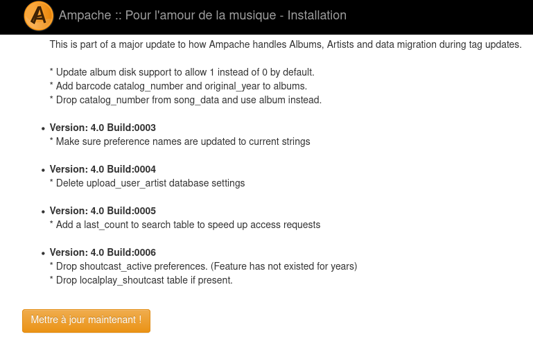
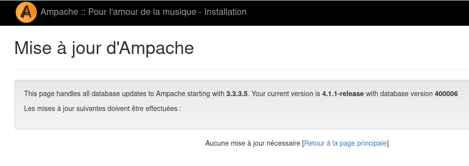
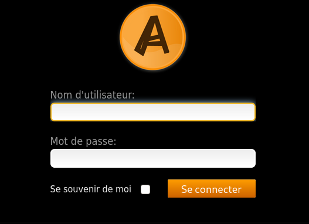

+++
title = 'Ampache, logiciel libre de streaming audio'
date = 2020-03-11 00:00:00 +0100
categories = ['debian']
+++
## Ampache 


### Installer ampache

Il faut "composer" pour l'installation &rarr; [Composer ,outil de gestion de paquets PHP ](/posts/Composer-outil-gestion-paquets-PHP/)

Installation &rarr; <https://github.com/ampache/ampache/wiki/Installation>  
Procédure d'installation

    sudo -s
    cd /var/www
    git clone -b master https://github.com/ampache/ampache.git ampache
    cd ampache
    composer install --prefer-source --no-interaction

### Configuration nginx

Fichier de configuration

    nano /etc/nginx/conf.d/amp.xoyize.xyz-ampache.conf

```
# /etc/nginx/conf.d/amp.xoyize.xyz-ampache.conf	
##
# Virtual Host amp.xoyize.xyz (Ampache)
##

server {
    listen 80;
    listen [::]:80;
	
    ## redirect http to https ##
    server_name amp.xoyize.xyz;
    return  301 https://$server_name$request_uri;
}
	
server {
    listen 443 ssl http2;
    listen [::]:443 ssl http2;
    server_name amp.xoyize.xyz;
    charset utf-8;


    # Logging, error_log mode [notice] is necessary for rewrite_log on,
    # (very usefull if rewrite rules do not work as expected)

         error_log       /var/log/ampache/error.log; # notice;
       # access_log      /var/log/ampache/access.log;
       # rewrite_log     on;

    # Use secure SSL/TLS settings, see https://mozilla.github.io/server-side-tls/ssl-config-generator/
     #ssl_protocols TLSv1.2;
     #ssl_ciphers 'ECDHE-ECDSA-AES256-GCM-SHA384:ECDHE-RSA-AES256-GCM-SHA384:ECDHE-ECDSA-CHACHA20-POLY1305:ECDHE-RSA-CHACHA20-POLY1305:ECDHE-ECDSA-AES128-GCM-SHA256:ECDHE-RSA-AES128-GCM-SHA256:ECDHE-E    CDSA-AES256-SHA384:ECDHE-RSA-AES256-SHA384:ECDHE-ECDSA-AES128-SHA256:ECDHE-RSA-AES128-SHA256';
     #ssl_prefer_server_ciphers on;

    ssl_certificate /etc/ssl/private/xoyize.xyz-fullchain.pem;
    ssl_certificate_key /etc/ssl/private/xoyize.xyz-key.pem;
    ssl_session_timeout 1d;
    ssl_session_cache shared:MozSSL:10m;  # about 40000 sessions
    ssl_session_tickets off;

    ssl_dhparam /etc/ssl/private/dh2048.pem;

    # intermediate configuration
    ssl_protocols TLSv1.2 TLSv1.3;
    ssl_ciphers ECDHE-ECDSA-AES128-GCM-SHA256:ECDHE-RSA-AES128-GCM-SHA256:ECDHE-ECDSA-AES256-GCM-SHA384:ECDHE-RSA-AES256-GCM-SHA384:ECDHE-ECDSA-CHACHA20-POLY1305:ECDHE-RSA-CHACHA20-POLY1305:DHE-RSA-AES128-GCM-SHA256:DHE-RSA-AES256-GCM-SHA384;
    ssl_prefer_server_ciphers off;

     add_header Strict-Transport-Security max-age=15768000;

    # Use secure headers to avoid XSS and many other things
    add_header X-Content-Type-Options nosniff;
    add_header X-XSS-Protection "1; mode=block";
    add_header X-Robots-Tag none;
    add_header X-Download-Options noopen;
    add_header X-Permitted-Cross-Domain-Policies none;
    add_header X-Frame-Options "SAMEORIGIN" always;
    add_header Referrer-Policy "no-referrer";
    add_header Content-Security-Policy "script-src 'self' 'unsafe-inline' 'unsafe-eval'; frame-src 'self'; object-src 'self'";

    # Avoid information leak
    server_tokens off;
    fastcgi_hide_header X-Powered-By;

    root /var/www/ampache;
    index index.php;

    # Somebody said this helps, in my setup it doesn't prevent temporary saving in files
    proxy_max_temp_file_size 0;

    # Rewrite rule for Subsonic backend
    if ( !-d $request_filename ) {
        rewrite ^/rest/(.*).view$ /rest/index.php?action=$1 last;
        rewrite ^/rest/fake/(.+)$ /play/$1 last;
    }

    # Rewrite rule for Channels
    if (!-d $request_filename){
      rewrite ^/channel/([0-9]+)/(.*)$ /channel/index.php?channel=$1&target=$2 last;
    }

    # Beautiful URL Rewriting
        rewrite ^/play/ssid/(\w+)/type/(\w+)/oid/([0-9]+)/uid/([0-9]+)/name/(.*)$ /play/index.php?ssid=$1&type=$2&oid=$3&uid=$4&name=$5 last;
        rewrite ^/play/ssid/(\w+)/type/(\w+)/oid/([0-9]+)/uid/([0-9]+)/client/(.*)/noscrobble/([0-1])/name/(.*)$ /play/index.php?ssid=$1&type=$2&oid=$3&uid=$4&client=$5&noscrobble=$6&name=$7 last;
        rewrite ^/play/ssid/(.*)/type/(.*)/oid/([0-9]+)/uid/([0-9]+)/client/(.*)/noscrobble/([0-1])/player/(.*)/name/(.*)$ /play/index.php?ssid=$1&type=$2&oid=$3&uid=$4&client=$5&noscrobble=$6&player=$7&name=$8 last;
        rewrite ^/play/ssid/(.*)/type/(.*)/oid/([0-9]+)/uid/([0-9]+)/client/(.*)/noscrobble/([0-1])/bitrate/([0-9]+)/player/(.*)/name/(.*)$ /play/index.php?ssid=$1&type=$2&oid=$3&uid=$4&client=$5&noscrobble=$6&bitrate=$7player=$8&name=$9 last;
        rewrite ^/play/ssid/(.*)/type/(.*)/oid/([0-9]+)/uid/([0-9]+)/client/(.*)/noscrobble/([0-1])/transcode_to/(w+)/bitrate/([0-9]+)/player/(.*)/name/(.*)$ /play/index.php?ssid=$1&type=$2&oid=$3&uid=$4&client=$5&noscrobble=$6&transcode_to=$7&bitrate=$8&player=$9&name=$10 last;

    # the following line was needed for me to get downloads of single songs to work
        rewrite ^/play/ssid/(.*)/type/(.*)/oid/([0-9]+)/uid/([0-9]+)/action/(.*)/name/(.*)$ /play/index.php?ssid=$1&type=$2&oid=$3&uid=$4action=$5&name=$6 last;
        location /play {
                if (!-e $request_filename) {
                rewrite ^/play/art/([^/]+)/([^/]+)/([0-9]+)/thumb([0-9]*)\.([a-z]+)$ /image.php?object_type=$2&object_id=$3&auth=$1 last;
                }

        rewrite ^/([^/]+)/([^/]+)(/.*)?$ /play/$3?$1=$2;
        rewrite ^/(/[^/]+|[^/]+/|/?)$ /play/index.php last;
        break;
        }

   location /rest {
      limit_except GET POST {
         deny all;
      }
   }

   location ^~ /bin/ {
      deny all;
      return 403;
   }

   location ^~ /config/ {
      deny all;
      return 403;
   }

   location / {
      limit_except GET POST HEAD{
         deny all;
      }
   }

   location ~ ^/.*.php {
        fastcgi_index index.php;

    # sets the timeout for requests in [s] , 60s are normally enough
        fastcgi_read_timeout 600s;

        include fastcgi_params;
        fastcgi_param SCRIPT_FILENAME $document_root$fastcgi_script_name;

    # Mitigate HTTPOXY https://httpoxy.org/
        fastcgi_param HTTP_PROXY "";

    # has to be set to on if encryption (https) is used:
        # fastcgi_param HTTPS on;

        fastcgi_split_path_info ^(.+?\.php)(/.*)$;

    # chose as your php-fpm is configured to listen on
        fastcgi_pass unix:/var/run/php/php7.3-fpm.sock;
        # fastcgi_pass 127.0.0.1:8000/;
   }

   # Rewrite rule for WebSocket
   location /ws {
        rewrite ^/ws/(.*) /$1 break;
        proxy_http_version 1.1;
        proxy_set_header Upgrade $http_upgrade;
        proxy_set_header Connection "upgrade";
        proxy_set_header Host $host;
        proxy_pass http://127.0.0.1:8100/;
   }	
	
}
```

Créer log

      mkdir /var/log/ampache
      touch /var/log/ampache/error.log

Vérifier et relancer

    nginx -t
    systemctl restart nginx

On va créer une base un mot de passe ampache

    echo $(head -c 12 /dev/urandom | openssl enc -base64) > /etc/mysql/ampache
    mysql -u root -p$(cat /etc/mysql/mdp) -e "CREATE DATABASE ampache; GRANT ALL PRIVILEGES ON ampache.* TO    'ampache'@'localhost' IDENTIFIED BY '$(cat /etc/mysql/ampache)'; FLUSH PRIVILEGES;"

    
Ouvrir la page web et poursuivre l'installation

{:width="400"}  

{:width="400"}  

{:width="400"}  

{:width="400"}  

{:width="400"}  

{:width="400"}  

{:width="400"}  


