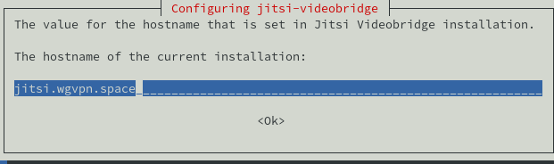
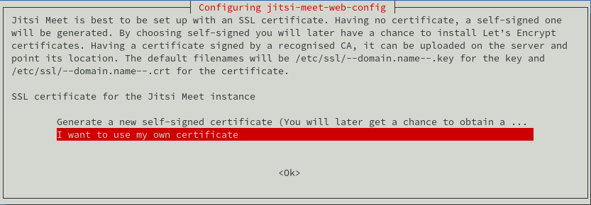
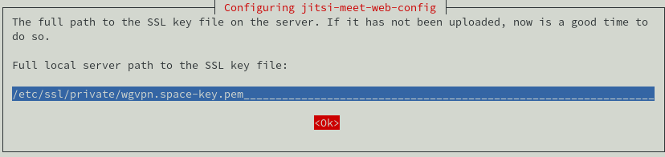
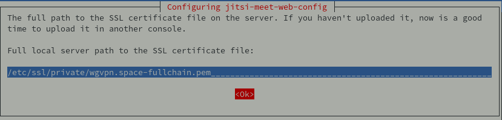

+++
title = 'Visio-conférence Jitsi Meet + Matrix Riot vps789461 (wgvpn.space) debian buster (INACTIF)'
date = 2020-03-21 00:00:00 +0100
categories = vps
+++
# Serveur VPS OVH 

{:width="50"}  
*OVH vps789461 (1 vCore/2GoRam/20GoSSD) Debian Buster*

### Debian 10

{:width="150"}  
PARAMETRES D'ACCES:  
L'adresse IPv4 du VPS est : 51.77.151.245  
L'adresse IPv6 du VPS est : 2001:41d0:0404:0200::01cf  

Le nom du VPS est : vps789461.ovh.net  
Connexion SSH en "root"

    ssh root@51.77.151.245


### Réseau

{:width="70"}

Créer un bash pour désactiver l'initialisation réseau par le cloud sur le VPS OVH  

	nano initres.sh 

```
#!/bin/bash
#
# To disable cloud-init's network configuration capabilities, write a file
# /etc/cloud/cloud.cfg.d/99-disable-network-config.cfg with the following:
# network: {config: disabled}
#
#Création du fichier **/etc/cloud/cloud.cfg.d/99-disable-network-config.cfg** en mode su
echo "network: {config: disabled}" > /etc/cloud/cloud.cfg.d/99-disable-network-config.cfg
#
# Effacerle fichier /etc/network/interfaces  
rm /etc/network/interfaces
# Recréer le fichier /etc/network/interfaces
cat > /etc/network/interfaces << EOF
auto lo
iface lo inet loopback

auto eth0
iface eth0 inet dhcp
iface eth0 inet6 static
 address 2001:41d0:0404:0200::01cf
 netmask 128
 post-up /sbin/ip -6 route add 2001:41d0:0404:0200::1 dev eth0
 post-up /sbin/ip -6 route add default via 2001:41d0:0404:0200::1 dev eth0
 pre-down /sbin/ip -6 route del default via 2001:41d0:0404:0200::1 dev eth0
 pre-down /sbin/ip -6 route del 2001:41d0:0404:0200::1 dev eth0
EOF
#
# Configuration OVH à modifier /etc/cloud/cloud.cfg 
sed -i 's/preserve_hostname: false/preserve_hostname: true/g' /etc/cloud/cloud.cfg
sed -i 's/manage_etc_hosts: true/manage_etc_hosts: false/g' /etc/cloud/cloud.cfg
#
# Redémarrage de la machine
systemctl reboot
```

Droits et exécution

    chmod +x initres.sh && ./initres.sh

Patienter quelques minutes avant la reconnexion...

Se connecter en root via SSH  

    ssh root@51.77.151.245

Vérifier le réseau `ip a` 

```
1: lo: <LOOPBACK,UP,LOWER_UP> mtu 65536 qdisc noqueue state UNKNOWN group default qlen 1000
    link/loopback 00:00:00:00:00:00 brd 00:00:00:00:00:00
    inet 127.0.0.1/8 scope host lo
       valid_lft forever preferred_lft forever
    inet6 ::1/128 scope host 
       valid_lft forever preferred_lft forever
2: eth0: <BROADCAST,MULTICAST,UP,LOWER_UP> mtu 1500 qdisc pfifo_fast state UP group default qlen 1000
    link/ether fa:16:3e:f2:6b:33 brd ff:ff:ff:ff:ff:ff
    inet 51.77.151.245/32 brd 51.77.151.245 scope global dynamic eth0
       valid_lft 86332sec preferred_lft 86332sec
    inet6 2001:41d0:404:200::1cf/128 scope global 
       valid_lft forever preferred_lft forever
    inet6 fe80::f816:3eff:fef2:6b33/64 scope link 
       valid_lft forever preferred_lft forever
```

Locales **fr UTF8** : `dpkg-reconfigure locales` (facultatif)  
Fuseau **Europe/Paris** : `dpkg-reconfigure tzdata` (facultatif)  

### domaine wgvpn.space 

{:width=70"}  

Zone dns OVH

```
$TTL 3600
@	IN SOA dns20.ovh.net. tech.ovh.net. (2020032100 86400 3600 3600000 300)
              IN NS     dns20.ovh.net.
              IN NS     ns20.ovh.net.
              IN MX     10 wgvpn.space.
              IN A      51.77.151.245
              IN AAAA   2001:41d0:404:200::1cf
              IN TXT    "v=spf1 a mx ip4:51.77.151.245 ip6:2001:41d0:404:200::1cf -all"
jitsi         IN CNAME  wgvpn.space.
_dmarc        IN TXT    "v=DMARC1; p=none;"
```

Reverse dns serveur vps789641 sur IPV4 : jitsi.wgvpn.space

**hostname** 

    hostnamectl set-hostname wgvpn.space
    hostnamectl

```
   Static hostname: wgvpn.space
         Icon name: computer-vm
           Chassis: vm
        Machine ID: 0ef30511d74646618d92e464efb187ce
           Boot ID: 7a925207f91e4e97a2eccca9f970583d
    Virtualization: kvm
  Operating System: Debian GNU/Linux 10 (buster)
            Kernel: Linux 4.19.0-5-cloud-amd64
      Architecture: x86-64
```


### Création utilisateur

Utilisateur **admini**  

    useradd -m -d /home/admini/ -s /bin/bash admini

Mot de passe **admini**  

    passwd admini 

Visudo pour les accès root via utilisateur **admini**  

```bash
apt install sudo  # sudo installé par défaut
echo "admini     ALL=(ALL) NOPASSWD: ALL" >> /etc/sudoers
```

Changer le mot de passe root

    passwd root

### OpenSSH, clé et script

{:width="100"}

**connexion avec clé**  
<u>sur l'ordinateur de bureau</u>
Générer une paire de clé curve25519-sha256 (ECDH avec Curve25519 et SHA2) nommé **kvm-cinay** pour une liaison SSH avec le serveur KVM.  

    ssh-keygen -t ed25519 -o -a 100 -f ~/.ssh/kvm-vps789461

Envoyer la clé publique sur le serveur KVM   

    scp ~/.ssh/kvm-vps789461.pub admini@51.77.151.245:/home/admini/

<u>sur le serveur KVM vps789461</u>
On se connecte  

    ssh admini@51.77.151.245

Copier le contenu de la clé publique dans /home/$USER/.ssh/authorized_keys  

    cd ~

Sur le KVM vps789461   

```bash
mkdir .ssh  # création dossier .ssh
cat $HOME/kvm-vps789461.pub >> $HOME/.ssh/authorized_keys # copie clé publique
chmod 600 $HOME/.ssh/authorized_keys  # donner les droits
rm $HOME/kvm-vps789461.pub # effacer le fichier de la clé
```

Modifier la configuration serveur SSH  

    sudo nano /etc/ssh/sshd_config

Modifier

```conf
Port 55039
PermitRootLogin no
PasswordAuthentication no
```


<u>session SSH ne se termine pas correctement lors d'un "reboot" à distance</u>  
Si vous tentez de **redémarrer/éteindre** une machine distance par **ssh**, vous pourriez constater que votre session ne se termine pas correctement, vous laissant avec un terminal inactif jusqu'à l'expiration d'un long délai d'inactivité. Il existe un bogue 751636 à ce sujet. Pour l'instant, la solution de contournement à ce problème est d'installer :  

    sudo apt install libpam-systemd  # installé par défaut sur debian buster

cela terminera la session ssh avant que le réseau ne tombe.  
Veuillez noter qu'il est nécessaire que PAM soit activé dans sshd.  

Relancer openSSH  

    sudo systemctl restart sshd

Accès depuis le poste distant avec la clé privée  

    ssh -p 55039 -i ~/.ssh/kvm-vps789461 admini@51.77.151.245

### Mise à jour et installer utilitaires  

    sudo apt update && sudo apt -y upgrade
    sudo apt install rsync curl tmux jq figlet git dnsutils tree gnupg -y


### Scripts motd et ssh_rc_bash

Motd

    sudo nano /etc/motd  # effacer le contenu avant de copier ce qui suit

```
                        ____  ___  ___   __  _ _   _        
        __ __ _ __  ___|__  |( _ )/ _ \ / / | | | / |       
        \ V /| '_ \(_-<  / / / _ \\_, // _ \|_  _|| |       
         \_/ | .__//__/ /_/  \___/ /_/ \___/  |_| |_|       
 __ __ __ __ |_|_ __ _ __  _ _      ___ _ __  __ _  __  ___ 
 \ V  V // _` |\ V /| '_ \| ' \  _ (_-<| '_ \/ _` |/ _|/ -_)
  \_/\_/ \__, | \_/ | .__/|_||_|(_)/__/| .__/\__,_|\__|\___|
         |___/      |_|                |_|                  
```


Script **ssh_rc_bash**  
>**ATTENTION!!! Les scripts sur connexion peuvent poser des problèmes pour des appels externes autres que ssh*

    nano ssh_rc_bash

```
#!/bin/bash

get_infos() {
    seconds="$(< /proc/uptime)"
    seconds="${seconds/.*}"
    days="$((seconds / 60 / 60 / 24)) jour(s)"
    hours="$((seconds / 60 / 60 % 24)) heure(s)"
    mins="$((seconds / 60 % 60)) minute(s)"
    
    # Remove plural if < 2.
    ((${days/ *} == 1))  && days="${days/s}"
    ((${hours/ *} == 1)) && hours="${hours/s}"
    ((${mins/ *} == 1))  && mins="${mins/s}"
    
    # Hide empty fields.
    ((${days/ *} == 0))  && unset days
    ((${hours/ *} == 0)) && unset hours
    ((${mins/ *} == 0))  && unset mins
    
    uptime="${days:+$days, }${hours:+$hours, }${mins}"
    uptime="${uptime%', '}"
    uptime="${uptime:-${seconds} seconds}"

   if [[ -f "/sys/devices/virtual/dmi/id/board_vendor" ||
                    -f "/sys/devices/virtual/dmi/id/board_name" ]]; then
	model="$(< /sys/devices/virtual/dmi/id/board_vendor)"
	model+=" $(< /sys/devices/virtual/dmi/id/board_name)"
   fi

   if [[ -f "/sys/devices/virtual/dmi/id/bios_vendor" ||
                    -f "/sys/devices/virtual/dmi/id/bios_version" ]]; then
        bios="$(< /sys/devices/virtual/dmi/id/bios_vendor)"
        bios+=" $(< /sys/devices/virtual/dmi/id/bios_version)"
        bios+=" $(< /sys/devices/virtual/dmi/id/bios_date)"
   fi
}

#clear
PROCCOUNT=`ps -Afl | wc -l`  		# nombre de lignes
PROCCOUNT=`expr $PROCCOUNT - 5`		# on ote les non concernées
GROUPZ=`users`
ipinfo=$(curl -s ipinfo.io) 		# info localisation format json
#ipinfo=$(curl -s iplocality.com) 		# info localisation format json
publicip=$(echo $ipinfo | jq -r '.ip')  # extraction des données , installer préalablement "jq"
ville=$(echo $ipinfo | jq -r '.city')
pays=$(echo $ipinfo | jq -r '.country')
cpuname=`cat /proc/cpuinfo |grep 'model name' | cut -d: -f2 | sed -n 1p`
iplink=`ip link show |grep -m 1 "2:" | awk '{print $2}' | cut -d: -f1`

if [[ $GROUPZ == *irc* ]]; then
ENDSESSION=`cat /etc/security/limits.conf | grep "@irc" | grep maxlogins | awk {'print $4'}`
PRIVLAGED="IRC Account"
else
ENDSESSION="Unlimited"
PRIVLAGED="Regular User"
fi
get_infos
logo=$(figlet "`hostname --fqdn`")
#meteo=$(curl fr.wttr.in/$ville?0)
sdx=$(df -h |grep "/dev/sd") # les montages /dev/sd
distri=$(lsb_release -sd)
distri+=" $(uname -m)"

echo -e "
\e[1;31m$logo
\e[1;35m   \e[1;37mHostname \e[1;35m= \e[1;32m`hostname`
\e[1;35m \e[1;37mWired IpV4 \e[1;35m= \e[1;32m`ip addr show $iplink | grep 'inet\b' | awk '{print $2}' | cut -d/ -f1`
\e[1;35m \e[1;37mWired IpV6 \e[1;35m= \e[1;32m`ip addr show $iplink | grep -E 'inet6' |grep -E 'scope link' | awk '{print $2}' | cut -d/ -f1`
\e[1;35m     \e[1;37mKernel \e[1;35m= \e[1;32m`uname -r`
\e[1;35m    \e[1;37mDistrib \e[1;35m= \e[1;32m$distri
\e[1;35m     \e[1;37mUptime \e[1;35m= \e[1;32m`echo $uptime`
\e[1;35m       \e[1;37mBios \e[1;35m= \e[1;32m`echo $bios`
\e[1;35m      \e[1;37mBoard \e[1;35m= \e[1;32m`echo $model`
\e[1;35m        \e[1;37mCPU \e[1;35m= \e[1;32m`echo $cpuname`
\e[1;35m \e[1;37mMemory Use \e[1;35m= \e[1;32m`free -m | awk 'NR==2{printf "%s/%sMB (%.2f%%)\n", $3,$2,$3*100/$2 }'`
\e[1;35m   \e[1;37mUsername \e[1;35m= \e[1;32m`whoami`
\e[1;35m   \e[1;37mSessions \e[1;35m= \e[1;32m`who | grep $USER | wc -l`
\e[1;35m\e[1;37mPublic IpV4 \e[1;35m= \e[1;32m`echo $publicip`
\e[1;35m\e[1;37mPublic IpV6 \e[1;35m= \e[1;32m`ip addr show $iplink | grep -m 1 'inet6\b'  | awk '{print $2}' | cut -d/ -f1`
\e[1;35m\e[1;33m$sdx
\e[1;0m
"
```

	chmod +x ssh_rc_bash # rendre le bash exécutable
	./ssh_rc_bash        # exécution

### Certificats letsencrypt - domaine wgvpn.space

{:width="100"}  
Installation gestionnaire des certificats Let's Encrypt

    cd ~
    sudo apt install socat # prérequis


```
git clone https://github.com/Neilpang/acme.sh.git
cd acme.sh
./acme.sh --install 
```

>Se déconnecter puis se reconnecter pour la prise en compte

Se connecter sur l'api OVH pour les paramètres (clé et secret)

    export OVH_AK="votre application key"
    export OVH_AS="votre application secret"

Premier lancement pour la génération des certificats

    acme.sh --dns dns_ovh --issue --ocsp --keylength ec-384 -d wgvpn.space -d jitsi.wgvpn.space

Rechercher le lien qui suit le texte suivant **Please open this link to do authentication:**  
Se connecter sur le lien , s'authentifier puis sélectionner "unlimited" et valider.Le message suivant s'affiche 

    OVH authentication Success ! 

Lancer une seconde fois la génération des certificats et patienter quelques minutes...

    acme.sh --dns dns_ovh --issue --ocsp --keylength ec-384 -d wgvpn.space -d jitsi.wgvpn.space

Les certificats sont disponibles

```
[Sat 21 Mar 2020 02:15:00 PM CET] Your cert is in  /home/admini//.acme.sh/wgvpn.space_ecc/wgvpn.space.cer 
[Sat 21 Mar 2020 02:15:00 PM CET] Your cert key is in  /home/admini//.acme.sh/wgvpn.space_ecc/wgvpn.space.key 
[Sat 21 Mar 2020 02:15:00 PM CET] The intermediate CA cert is in  /home/admini//.acme.sh/wgvpn.space_ecc/ca.cer 
[Sat 21 Mar 2020 02:15:00 PM CET] And the full chain certs is there:  /home/admini//.acme.sh/wgvpn.space_ecc/fullchain.cer 
```

Créer des liens avec **/etc/ssl/private/**

```
# domaine wgvpn.space
sudo ln -s /home/admini//.acme.sh/wgvpn.space_ecc/fullchain.cer /etc/ssl/private/wgvpn.space-fullchain.pem   # full chain certs
sudo ln -s /home/admini//.acme.sh/wgvpn.space_ecc/wgvpn.space.key /etc/ssl/private/wgvpn.space-key.pem     # cert key
sudo ln -s /home/admini//.acme.sh/wgvpn.space_ecc/wgvpn.space.cer /etc/ssl/private/wgvpn.space-chain.pem   # cert domain
sudo ln -s /home/admini//.acme.sh/wgvpn.space_ecc/ca.cer /etc/ssl/private/wgvpn.space-ca.pem                 # intermediate CA cert
```

# Jitsi Meet 

*Jitsi Meet est un logiciel libre distribué sous licence Apache 2 qui a pour objectif de fournir une solution de visio-conférence accessible depuis un navigateur web.[Framasoft : Installation de Jitsi Meet](https://framacloud.org/fr/cultiver-son-jardin/jitsi-meet.html)*

>Toutes les commandes se font en mode su (sudo -s)

### Prérequis

Le dépôt fourni par Jitsi utilisant le chiffrement, nous allons devoir installer apt-transport-https :

    apt install apt-transport-https

Afin d'installer Jitsi nous installerons le Java Runtime Environment  
Ajouter l'adresse du dépôt jitsi :

    echo 'deb https://download.jitsi.org stable/' > /etc/apt/sources.list.d/jitsi-stable.list

Importer les clés des packageurs de Jitsi dans le trousseau de notre système de paquet :

    wget -qO -  https://download.jitsi.org/jitsi-key.gpg.key | apt-key add -

>Un petit mot sur les clés : les paquets sont signés avec GPG par ceux qui les créent. La vérification de la signature d'un paquet permet de s'assurer de son intégrité (de vérifier qu'il n'a pas été trafiqué par une personne malveillante). Mais pour vérifier la signature, il faut s'assurer qu'elle a été créée par une clé dont nous connaissons la légitimité (nous vérifions là l'authenticité du paquet).
D'où le `wget… | apt-key add -` pour intégrer les clés des packageurs de Jitsi dans le trousseau de clés considérées comme fiables par notre système de paquet

Mettons à jour notre liste de paquets disponibles :

    apt update && apt -y upgrade

Installation de Java Runtime Environment 

    apt -y install default-jre-headless ca-certificates-java

### Installer Jitsi

Installation jitsi-meet

    apt -y install jitsi-meet

Outre des composants propres à Jitsi Meet (jicofo et jitsi-videobridge), ceci installera aussi le serveur XMPP Prosody. En effet, Jitsi Meet utilise le protocole XMPP et nécessite donc un tel serveur.

L'installeur va vous demander le nom DNS de votre instance , jitsi.wgvpn.space

{:width="500"}  
jitsi.wgvpn.space

{:width="500"}  
{:width="500"}  
/etc/ssl/private/wgvpn.space-key.pem

{:width="500"}  
/etc/ssl/private/wgvpn.space-fullchain.pem

```
You can now switch to a Let’s Encrypt certificate. To do so, execute:
/usr/share/jitsi-meet/scripts/install-letsencrypt-cert.sh
```

>La génération d'un certificat n'étant pas le sujet de ce tutoriel, on choisira le certificat auto-signé. Retenez simplement que si vous souhaitez changer de certificat, il faudra modifier le fichier de configuration /etc/prosody/conf.avail/meet.example.org.cfg.lua et relancer prosody (service prosody restart).  
Si vous changez de certificat, vous devrez aussi modifier **/etc/nginx/sites-available/jitsi.wgvpn.space.conf** pour qu'il utilise votre certificat.

Pour la configuration, cela se passe dans le fichier **/etc/jitsi/meet/jitsi.wgvpn.space-config.js** 

    nano /etc/jitsi/meet/jitsi.wgvpn.space-config.js

```
// Pour choisir la langue par défaut
defaultLanguage: "fr",
// Éviter de faire des requêtes à d'autres sites (google analytics, gravatar et callstats.io)
disableThirdPartyRequests: true,
```

### Configurer

Un fichier **/etc/nginx/sites-available/jitsi.wgvpn.space.conf** et un lien dans **/etc/nginx/sites-enabled** ont été créés à l'installation de jitsi-meet   
    
#### page d'accueil (facultatif)

Pour pouvoir avoir une page d'accueil personnalisée, effectuer une redirection au niveau de Nginx dans **/etc/nginx/sites-available/jitsi.wgvpn.space.conf**

```
rewrite ^\/$ https://jitsi.wgvpn.space/accueil/ break;
location ~ /accueil/ {
     # La page d'accueil personnalisée dans /var/www/accueil/
     alias /var/www/accueil/;
}
```

>**Attention !** Notre `location ~ /accueil/ {…}` doit impérativement être placé avant le bloc `location ~ ^/([a-zA-Z0-9=\?]+)$ {…}` pour être pris en compte !

#### Configuration js et nginx

Nous avons aussi modifié un fichier de configuration caché, la configuration de l'interface 

```
mkdir /var/www/jitsi-custom
cp /usr/share/jitsi-meet/interface_config.js /var/www/jitsi-custom
```

Ceci nous permet d'éviter que nos modifications soient écrasées lors d'une mise à jour. Editer **/var/www/jitsi-custom/interface_config.js**

```
    // Un peu de traduction des termes
    DEFAULT_REMOTE_DISPLAY_NAME: "Autre participant·e",
    DEFAULT_LOCAL_DISPLAY_NAME: "moi",
    // Un peu de personnalisation
    JITSI_WATERMARK_LINK: 'https://jitsi.wgvpn.space',
    APP_NAME: 'Jitsi Yann',
    // Ici, vous pouvez modifier ce qu'il y a dans la barre d'outils
    TOOLBAR_BUTTONS: ['microphone', 'camera', etc],
```

Pour que ce soit notre fichier modifié qui soit utilisé et non celui de Jitsi, il faut ajouter à la configuration Nginx **/etc/nginx/sites-available/jitsi.wgvpn.space.conf** :

```
    location = /interface_config.js {
        alias /var/www/jitsi-custom/interface_config.js;
    }
```

Notez que vous pouvez faire ça pour d'autres fichiers (facultatif)  

```
location = /images/watermark.png {
    alias /var/www/jitsi-custom/mon_watermark.png;
}
```

### Configurer SSL,TLS et OCSP 

* ssl (tls1.2 tls1.3) , Headers et OCSP  
* Diffie-Hellman : `openssl dhparam -out /etc/ssl/private/dh2048.pem -outform PEM -2 2048`  

Regroupement dans un fichier  **/etc/nginx/ssl_dh_header_ocsp**

```
    ##
    # SSL Settings
    ##
    ssl_certificate /etc/ssl/private/wgvpn.space-fullchain.pem;
    ssl_certificate_key /etc/ssl/private/wgvpn.space-key.pem;
    ssl_session_timeout 1d;
    ssl_session_cache shared:MozSSL:10m;  # about 40000 sessions
    ssl_session_tickets off;

    ssl_dhparam /etc/ssl/private/dh2048.pem;

    # intermediate configuration
    ssl_protocols TLSv1.2 TLSv1.3;
    ssl_ciphers ECDHE-ECDSA-AES128-GCM-SHA256:ECDHE-RSA-AES128-GCM-SHA256:ECDHE-ECDSA-AES256-GCM-SHA384:ECDHE-RSA-AES256-GCM-SHA384:ECDHE-ECDSA-CHACHA20-POLY1305:ECDHE-RSA-CHACHA20-POLY1305:DHE-RSA-AES128-GCM-SHA256:DHE-RSA-AES256-GCM-SHA384;
    ssl_prefer_server_ciphers off;

    add_header Strict-Transport-Security "max-age=31536000";


    # OCSP settings
    ssl_stapling on;
    ssl_stapling_verify on;
    ssl_trusted_certificate /etc/ssl/private/wgvpn.space-fullchain.pem;
    #ssl_trusted_certificate /etc/ssl/private/ocsp-certs.pem;
    # resolver , voir /etc/resolv.conf
    resolver 213.186.33.99;
```


le fichier de configuration **/etc/nginx/sites-available/jitsi.wgvpn.space.conf**

    nano /etc/nginx/sites-available/jitsi.wgvpn.space.conf

SUPPRIMER la zone suivante

```
    ssl_protocols TLSv1 TLSv1.1 TLSv1.2;
    ssl_prefer_server_ciphers on;
    ssl_ciphers "EECDH+ECDSA+AESGCM:EECDH+aRSA+AESGCM:EECDH+ECDSA+SHA256:EECDH+aRSA+SHA256:EECDH+ECDSA+SHA384:EECDH+ECDSA+SHA256:EECDH+aRSA+SHA384:EDH+aRSA+AESGCM:EDH+aRSA+SHA256:EDH+aRSA:EECDH:!aNULL:!eNULL:!MEDIUM:!LOW:!3DES:!MD5:!EXP:!PSK:!SRP:!DSS:!RC4:!SEED";

    add_header Strict-Transport-Security "max-age=31536000";

    ssl_certificate /etc/ssl/private/wgvpn.space-fullchain.pem;
    ssl_certificate_key /etc/ssl/private/wgvpn.space-key.pem;
```

REMPLACER par

```
    include ssl_dh_header_ocsp;
```

Ce qui donne au final le fichier **/etc/nginx/sites-available/jitsi.wgvpn.space.conf**

```
server_names_hash_bucket_size 64;

server {
    listen 80;
    server_name jitsi.wgvpn.space;
    return 301 https://$host$request_uri;
}
server {
    listen 443 ssl http2;
    listen [::]:443 ssl http2;
    server_name jitsi.wgvpn.space;

    include ssl_dh_header_ocsp;

    root /usr/share/jitsi-meet;
    ssi on;
    index index.html index.htm;
    error_page 404 /static/404.html;

    location = /config.js {
        alias /etc/jitsi/meet/jitsi.wgvpn.space-config.js;
    }

    location = /external_api.js {
        alias /usr/share/jitsi-meet/libs/external_api.min.js;
    }

    location = /interface_config.js {
        alias /var/www/jitsi-custom/interface_config.js;
    }

    #ensure all static content can always be found first
    location ~ ^/(libs|css|static|images|fonts|lang|sounds|connection_optimization|.well-known)/(.*)$
    {
        add_header 'Access-Control-Allow-Origin' '*';
        alias /usr/share/jitsi-meet/$1/$2;
    }

    # BOSH
    location = /http-bind {
        proxy_pass      http://localhost:5280/http-bind;
        proxy_set_header X-Forwarded-For $remote_addr;
        proxy_set_header Host $http_host;
    }

    location ~ ^/([^/?&:'"]+)$ {
        try_files $uri @root_path;
    }

    location @root_path {
        rewrite ^/(.*)$ / break;
    }
}
```

Après modification configuration Nginx

```
nginx -t # (nginx -t permet de vérifier que la configuration de Nginx est valide avant de le relancer)
systemctl reload nginx
```

## Parefeu - UFW

{:width="100"}

* [UFW Parefeu (firewall)-Lien HS](/files/html/UFW%20Parefeu%20(firewall).htm)

Installation 

    sudo apt install ufw

Status

    sudo ufw status verbose
        Status: inactive

Ouvrir les ports suivants :

    sudo ufw allow 55039/tcp         # port SSH , 55039
    sudo ufw allow 443/tcp           # Serveur Web
    sudo ufw allow 4443/tcp          # jitsi-meet videostream
    sudo ufw allow 10000:20000/tcp   # plage TCP/UDP
    sudo ufw allow 10000:20000/udp

Activer le parefeu

    sudo ufw enable

```
Command may disrupt existing ssh connections. Proceed with operation (y|n)? y
Firewall is active and enabled on system startup
```

Status

     sudo ufw status verbose

```
Status: active
Logging: on (low)
Default: deny (incoming), allow (outgoing), disabled (routed)
New profiles: skip

To                         Action      From
--                         ------      ----
55039/tcp                  ALLOW IN    Anywhere                  
443/tcp                    ALLOW IN    Anywhere                  
4443/tcp                   ALLOW IN    Anywhere                  
10000:20000/tcp            ALLOW IN    Anywhere                  
10000:20000/udp            ALLOW IN    Anywhere                  
55039/tcp (v6)             ALLOW IN    Anywhere (v6)             
443/tcp (v6)               ALLOW IN    Anywhere (v6)             
4443/tcp (v6)              ALLOW IN    Anywhere (v6)             
10000:20000/tcp (v6)       ALLOW IN    Anywhere (v6)             
10000:20000/udp (v6)       ALLOW IN    Anywhere (v6)             
```

## Liens

* [Ta visio Open Source comme un pro avec Jitsi](https://blog.zwindler.fr/2020/03/17/ta-visio-open-source-comme-un-pro-avec-jitsi/)

# Synapse/Matrix client Riot

## Serveur Synapse/Matrix

Ajout matrix au domaine wgvpn.space  
Ajout Certificat ssl Let's Encrypt matrix.wgvpn.space  

    acme.sh --dns dns_ovh --issue --ocsp --keylength ec-384 -d wgvpn.space -d jitsi.wgvpn.space -d matrix.wgvpn.space

Matrix.org produit des paquers Debian/Ubuntu de la dernière version stable de Synapse via https://packages.matrix.org/debian/  
Pour les utiliser

```
sudo apt install -y lsb-release wget apt-transport-https
sudo wget -O /usr/share/keyrings/matrix-org-archive-keyring.gpg https://packages.matrix.org/debian/matrix-org-archive-keyring.gpg
echo "deb [signed-by=/usr/share/keyrings/matrix-org-archive-keyring.gpg] https://packages.matrix.org/debian/ $(lsb_release -cs) main" | sudo tee /etc/apt/sources.list.d/matrix-org.list
sudo apt update
sudo apt install matrix-synapse-py3
```

>**Note**: if you followed a previous version of these instructions which
recommended using `apt-key add` to add an old key from
`https://matrix.org/packages/debian/`, you should note that this key has been
revoked. You should remove the old key with `sudo apt-key remove
C35EB17E1EAE708E6603A9B3AD0592FE47F0DF61`, and follow the above instructions to
update your configuration.  
The fingerprint of the repository signing key (as shown by `gpg
/usr/share/keyrings/matrix-org-archive-keyring.gpg`) is
`AAF9AE843A7584B5A3E4CD2BCF45A512DE2DA058`.

Service **matrix-synapse.service**

### Mise en place de Synapse

Une fois que vous avez installé synapse comme ci-dessus, vous devez le configurer.

#### Reverse proxy

La configuration par défaut expose un seul port HTTP sur le réseau local
l'interface : `http://localhost:8008`. Il convient pour des tests locaux,
mais pour toute utilisation pratique, vous aurez besoin des API de Synapse pour être servi
sur HTTPS.

Le moyen recommandé est de mettre en place un reverse proxy  

* Si vous utilisez votre propre certificat, assurez-vous d'utiliser un fichier ".pem" qui
  comprend la chaîne complète de certificats, y compris les certificats intermédiaires
  (par exemple, si vous utilisez certbot, utilisez `fullchain.pem` comme certificat, et non
  `cert.pem`).

Utilisation d'un proxy inverse avec Synapse

Il est recommandé de placer un proxy inverse tel que nginx, Apache, Caddy ou HAProxy devant Synapse. L'un des avantages de cette méthode est que vous pouvez exposer le port https par défaut (443) aux clients Matrix sans avoir besoin d'exécuter Synapse avec les privilèges de l'utilisateur root.

>NOTE : Votre reverse proxy ne doit en aucun cas canoniser ou normaliser l'URI demandé (par exemple, en décodant les échappements %xx). Attention, Apache canonisera les URI à moins que vous ne spécifiiez nocanon.

Lorsque vous configurez un reverse proxy, n'oubliez pas que les clients et autres serveurs Matrix ne doivent pas nécessairement se connecter à votre serveur via le même nom de serveur ou le même port  
En effet, les clients utiliseront le port 443 par défaut, alors que les serveurs utilisent par défaut le port 8448. Lorsque ces ports sont différents, nous parlons de "port client" et de "port de fédération".  
Voir la spécification de la matrice pour plus de détails sur l'algorithme utilisé pour les connexions de fédération, et delegate.md pour des instructions sur la mise en place de la délégation.

Supposons que nous attendons des clients qu'ils se connectent à notre serveur à l'adresse https://matrix.wgvpn.space, et des autres serveurs qu'ils se connectent à l'adresse https://wgvpn.space:8448. Les sections suivantes détaillent la configuration du reverse proxy et du homeserver.

    sudo nano /etc/nginx/sites-available/matrix.wgvpn.space.conf

```
    server {
        listen 443 ssl;
        listen [::]:443 ssl;
        server_name matrix.wgvpn.space;
        # SSL
        include ssl_dh_header_ocsp;

        location /_matrix {
            proxy_pass http://localhost:8008;
            proxy_set_header X-Forwarded-For $remote_addr;
        }
    }

    server {
        listen 8448 ssl default_server;
        listen [::]:8448 ssl default_server;
        server_name wgvpn.space;
        # SSL
        include ssl_dh_header_ocsp;

        location / {
            proxy_pass http://localhost:8008;
            proxy_set_header X-Forwarded-For $remote_addr;
        }
    }
```

Activer le vhost

    sudo ln -s /etc/nginx/sites-available/matrix.wgvpn.space.conf /etc/nginx/sites-enabled/matrix.wgvpn.space.conf
    nginx -t # vérifier
    systemctl reload nginx # recharger

Ouvrir le port 8448

    sudo ufw allow 8448/tcp

#### Configuration du serveur d'accueil

Vous devrez également vérifier `bind_addresses: ['127.0.0.1']` et `x_forwarded : true` pour le port 8008 dans **/etc/matrix-synapse/homeserver.yaml** afin de s'assurer que les adresses IP des clients sont enregistrées correctement.  
Cela fait, vous pouvez alors utiliser https://matrix.wgvpn.space (au lieu de https://matrix.wgvpn.space:8448) comme "serveur personnalisé" lorsque vous vous connectez à Synapse à partir d'un client.

#### Courriel 

Il est souhaitable que Synapse ait la capacité d'envoyer des courriels. Cela permet à Synapse d'envoyer des courriels de réinitialisation de mot de passe, d'envoyer des vérifications lorsqu'une adresse électronique est ajoutée au compte d'un utilisateur, et d'envoyer des notifications par courriel aux utilisateurs lorsqu'ils reçoivent de nouveaux messages.

Pour configurer un serveur SMTP pour Synapse, modifiez la section de configuration intitulée "email" et assurez-vous que les champs smtp_host, smtp_port et notif_from sont remplis. Vous devrez peut-être aussi définir smtp_user, smtp_pass et require_transport_security.

>Si le courrier électronique n'est pas configuré, la réinitialisation du mot de passe, l'inscription et les notifications par courrier électronique seront désactivées.


#### Enregistrement d'un utilisateur

La façon la plus simple de créer un nouvel utilisateur est de le faire à partir d'un client comme **Riot**.

Vous pouvez également le faire à partir de la ligne de commande si vous l'avez installé via pip.  
Cela peut se faire de la manière suivante :

```
$ source ~/synapse/env/bin/activate
$ synctl start # if not already running
$ register_new_matrix_user -c homeserver.yaml http://localhost:8008
New user localpart: erikj
Password:
Confirm password:
Make admin [no]:
Success!
```

Ce processus utilise un paramètre registration_shared_secret dans homeserver.yaml, qui est partagé entre Synapse lui-même et le script register_new_matrix_user. Peu importe ce que c'est (une valeur aléatoire est générée par --generate-config), mais cela doit rester secret, car quiconque le connaît peut enregistrer des utilisateurs, y compris des comptes d'administrateur, sur votre serveur même si enable_registration est faux.

## Riot

*Riot est un client web opensource pour Matrix. Matrix est un protocole de chat libre et décentralisé. Couplé avec Turn il permet de faire chat, appel vidéo et appel audio.*

Ajout riot au domaine wgvpn.space  
Ajout Certificat ssl Let's Encrypt riot.wgvpn.space  

    acme.sh --dns dns_ovh --issue --ocsp --keylength ec-384 -d wgvpn.space -d jitsi.wgvpn.space -d matrix.wgvpn.space -d riot.wgvpn.space

Installer riot sur son propre serveur

    sudo -s

```
# logiciel le plus récent , voir https://github.com/vector-im/riot-web/releases/
cd /tmp/
wget https://github.com/vector-im/riot-web/releases/download/v1.5.13/riot-v1.5.13.tar.gz
# extraction et déplacement
tar -xvf riot-v1.5.13.tar.gz
mv riot-v1.5.13 /var/www/riot
# utilisateur
useradd -g www-data -M riot
# droits
chown -R riot:www-data /var/www/riot
# copiez le `config.sample.json` en `config.json`
cd /var/www/riot
cp config.sample.json config.json
```

Le fichier config.json

    sudo nano /var/www/riot/config.json

```
[...]
            "base_url": "https://matrix.wgvpn.space",
            "server_name": "wgvpn.space"
[...]
            "defaultCountryCode": "FR",
[...]
```

Le fichier nginx riot

    sudo nano /etc/nginx/sites-available/riot.wgvpn.space.conf

```
server {
    listen 443 ssl;
    listen [::]:443 ssl;
	server_name riot.wgvpn.space;
	root /var/www/riot/;
	index index.html index.php index.htm;

	access_log /var/log/nginx/riot.domain.tld.access.log;
	error_log /var/log/nginx/riot.domain.tld.error.log;
    # SSL
    include ssl_dh_header_ocsp;

	location / {
		try_files $uri $uri/ =404;
	}

    location = /robots.txt {
		allow all;
		log_not_found off;
		access_log off;
     }

     location = /favicon.ico {
		log_not_found off;
		access_log off;
     }

     location /.well-known/acme-challenge {
         root /var/www/letsencrypt/riot.domain.tld;
         allow all;
     }
}
```

Activer le vhost

    sudo ln -s /etc/nginx/sites-available/riot.wgvpn.space.conf /etc/nginx/sites-enabled/riot.wgvpn.space.conf
    nginx -t # vérifier
    systemctl reload nginx # recharger

