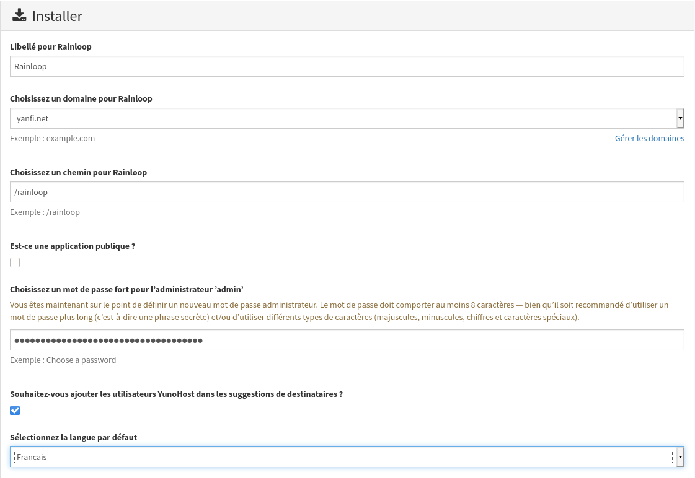

+++
title = 'OVH VPS506197 Debian Stretch Yunohost yanfi.net'
date = 2020-03-23 00:00:00 +0100
categories = ['yunohost']
+++
# Serveur VPS OVH 

{:width="50"}  
*OVH KVM OpenStack vps789461 (1 vCore 2.4Ghz/4Go Ram/20Go SSD/Local Raid10/Strasbourg)*

```
Debian 9 (Stretch) (en version 64 bits)


PARAMETRES D'ACCES:
L'adresse IPv4 du VPS est : 164.132.104.145
L'adresse IPv6 du VPS est : 2001:41d0:0401:3200:0000:0000:0000:06e7

Le nom du VPS est : vps506197.ovh.net

Le compte administrateur suivant a été configuré sur le VPS :
Nom d'utilisateur : root
Mot de passe :      blvjE3Xn
```

## Debian Stretch

  

### Réseau

{:width="70"}

Première connexion

    ssh root@164.132.104.145

Réseau par défaut

    ip a

```
1: lo: <LOOPBACK,UP,LOWER_UP> mtu 65536 qdisc noqueue state UNKNOWN group default qlen 1
    link/loopback 00:00:00:00:00:00 brd 00:00:00:00:00:00
    inet 127.0.0.1/8 scope host lo
       valid_lft forever preferred_lft forever
    inet6 ::1/128 scope host 
       valid_lft forever preferred_lft forever
2: ens3: <BROADCAST,MULTICAST,UP,LOWER_UP> mtu 1500 qdisc pfifo_fast state UP group default qlen 1000
    link/ether fa:16:3e:aa:66:8d brd ff:ff:ff:ff:ff:ff
    inet 164.132.104.145/32 brd 164.132.104.145 scope global ens3
       valid_lft forever preferred_lft forever
    inet6 fe80::f816:3eff:feaa:668d/64 scope link 
       valid_lft forever preferred_lft forever
```

Créer un bash pour désactiver l'initialisation réseau par le cloud sur le VPS OVH  

	nano initres.sh 

```
#!/bin/bash
#
# To disable cloud-init's network configuration capabilities, write a file
# /etc/cloud/cloud.cfg.d/99-disable-network-config.cfg with the following:
# network: {config: disabled}
#
#Création du fichier **/etc/cloud/cloud.cfg.d/99-disable-network-config.cfg** en mode su
echo "network: {config: disabled}" > /etc/cloud/cloud.cfg.d/99-disable-network-config.cfg
#
# Effacer le fichier /etc/network/interfaces  
rm /etc/network/interfaces
# Recréer le fichier /etc/network/interfaces
cat > /etc/network/interfaces << EOF
auto lo
iface lo inet loopback

auto ens3
iface ens3 inet dhcp
iface ens3 inet6 static
 address 2001:41d0:401:3200::6e7
 netmask 128
 post-up /sbin/ip -6 route add 2001:41d0:401:3200::1 dev ens3
 post-up /sbin/ip -6 route add default via 2001:41d0:401:3200::1 dev ens3
 pre-down /sbin/ip -6 route del default via 2001:41d0:401:3200::1 dev ens3
 pre-down /sbin/ip -6 route del 2001:41d0:401:3200::1 dev ens3
EOF
#
# Configuration OVH à modifier /etc/cloud/cloud.cfg 
sed -i 's/preserve_hostname: false/preserve_hostname: true/g' /etc/cloud/cloud.cfg
sed -i 's/manage_etc_hosts: true/manage_etc_hosts: false/g' /etc/cloud/cloud.cfg
#
# Redémarrage de la machine
systemctl reboot
```

Droits et exécution

    chmod +x initres.sh && ./initres.sh

Patienter quelques minutes avant la reconnexion...

Se connecter en root via SSH  

    ssh root@164.132.104.145

Vérifier le réseau `ip a` 

```
1: lo: <LOOPBACK,UP,LOWER_UP> mtu 65536 qdisc noqueue state UNKNOWN group default qlen 1
    link/loopback 00:00:00:00:00:00 brd 00:00:00:00:00:00
    inet 127.0.0.1/8 scope host lo
       valid_lft forever preferred_lft forever
    inet6 ::1/128 scope host 
       valid_lft forever preferred_lft forever
2: ens3: <BROADCAST,MULTICAST,UP,LOWER_UP> mtu 1500 qdisc pfifo_fast state UP group default qlen 1000
    link/ether fa:16:3e:aa:66:8d brd ff:ff:ff:ff:ff:ff
    inet 164.132.104.145/32 brd 164.132.104.145 scope global ens3
       valid_lft forever preferred_lft forever
    inet6 2001:41d0:401:3200::6e7/128 scope global 
       valid_lft forever preferred_lft forever
    inet6 fe80::f816:3eff:feaa:668d/64 scope link 
       valid_lft forever preferred_lft forever
```

Mises à jour

    apt update && apt -y upgrade

Changer le mot de passe root

    passwd

Redémarrage

    reboot

## Yunohost

{:width="50px"}

Se connecter en root via SSH  

    ssh root@164.132.104.145

### Installation Yunohost

Lancer le bash et patienter

    bash <(wget -q -O- https://install.yunohost.org/)

Lancer la "post-installation" 

    yunohost tools postinstall   

Main domain: yanfi.net    
Mot de passe administrateur  

### Créer un utilisateur

    yunohost user create yanfi

```
fullname: Yan Fi
mail: yanfi@yanfi.net
username: yanfi
```

### Installation des certificats

    yunohost domain cert-install

```
Info: Now attempting install of certificate for domain yanfi.net!
Success! The SSOwat configuration has been generated
Success! The configuration has been updated for category 'dnsmasq'
Info: Parsing account key...
Info: Parsing CSR...
Info: Found domains: yanfi.net
Info: Getting directory...
Info: Directory found!
Info: Registering account...
Info: Registered!
Info: Creating new order...
Info: Order created!
Info: Verifying yanfi.net...
Info: yanfi.net verified!
Info: Signing certificate...
Info: Certificate signed!
Success! The configuration has been updated for category 'nginx'
Success! Successfully installed Let's Encrypt certificate for domain yanfi.net!
```

### Administration OVH (DNS et VPS)

Se connecter sur le manager OVH  

Modifier le reverse DNS du VPS vps591606.ovh.net (IPV4 er IPV6) : yanfi.net  
Modifier la configuration DNS du domaine yanfi.net


Se connecter en administrateur sur le site **yanfi.net**  
Domaines &rarr; yanfi.net &rarr; Configuration DNS # pour récupérer les paramètres  
Modifier la DNS du domaine yanfi.net : 

```
$TTL 3600
@	IN SOA dns112.ovh.net. tech.ovh.net. (2018092426 86400 3600 3600000 300)
                    3600 IN NS     dns112.ovh.net.
                    3600 IN NS     ns112.ovh.net.
                    3600 IN MX 10  yanfi.net.
                    3600 IN A      51.75.120.106
                    3600 IN AAAA   2001:41d0:305:2100::4dc0
                     600 IN TXT    "v=spf1 a mx ip4:51.75.120.106 ip6:2001:41d0:305:2100::4dc0 -all"
*                   3600 IN CNAME  yanfi.net.
_dmarc                   IN TXT    ( "v=DMARC1; p=none;" )
_xmpp-client._tcp   3600 IN SRV    0 5 5222 yanfi.net.
_xmpp-server._tcp   3600 IN SRV    0 5 5269 yanfi.net.
mail._domainkey     3600 IN TXT    ( "v=DKIM1; k=rsa; h=sha256; p=MIGfMA0GCSqDOltTHam7WsBs1Fn26v7hSqe4bkNsruffIpinULglGcLHR8H0Cbks1jPuAZKuKLH1J7KxwelLT8aEs3vD6L8tn9Aow1b2hEr2HQR6B6Ad90QYliI1BIVjrTjCpJyWYv3PUNow4QnUw/UhxX2bEK19apUwIDAQAB" )
muc                 3600 IN CNAME  yanfi.net.
pubsub              3600 IN CNAME  yanfi.net.
vjud                3600 IN CNAME  yanfi.net.
```

Modifier le dns reverse IPV4 sur le serveur : yanfi.net

### OpenSSH avec clés

  

**connexion avec clé**  
<u>sur l'ordinateur de bureau</u>
Générer une paire de clé curve25519-sha256 (ECDH avec Curve25519 et SHA2) nommé **kvm-vps506197** pour une liaison SSH avec le serveur KVM.  

    ssh-keygen -t ed25519 -o -a 100 -f ~/.ssh/kvm-vps506197   

Envoyer la clé publique sur le serveur KVM   

    scp ~/.ssh/kvm-vps506197.pub admin@yanfi.net:/home/admin/

<u>sur le serveur KVM</u>
On se connecte  
  `ssh admin@yanfi.net`  
Copier le contenu de la clé publique dans /home/$USER/.ssh/authorized_keys  
  `$ cd ~`  
Sur le KVM ,créer un dossier .ssh  

```
pwd  #pour vérifier que l'on est sous /home/$USER
mkdir .ssh
cat /home/$USER/kvm-vps506197.pub >> /home/$USER/.ssh/authorized_keys
```

et donner les droits  
  `chmod 600 /home/$USER/.ssh/authorized_keys`  
effacer le fichier de la clé  
  `rm /home/$USER/kvm-vps506197.pub`  
Modifier la configuration serveur SSH  
  `sudo nano /etc/ssh/sshd_config`  
Modifier

```
Port = 55030
PermitRootLogin no
PasswordAuthentication no
```

<u>session SSH ne se termine pas correctement lors d'un "reboot" à distance</u>  
Si vous tentez de **redémarrer/éteindre** une machine distance par **ssh**, vous pourriez constater que votre session ne se termine pas correctement, vous laissant avec un terminal inactif jusqu'à l'expiration d'un long délai d'inactivité. Il existe un bogue 751636 à ce sujet. Pour l'instant, la solution de contournement à ce problème est d'installer :  

      sudo apt install libpam-systemd
      
cela terminera la session ssh avant que le réseau ne tombe.  
Veuillez noter qu'il est nécessaire que PAM soit activé dans sshd.  

Ouvrir le port 55030 et fermer le port 22

    sudo yunohost firewall allow TCP 55030
    sudo yunohost firewall disallow TCP 22
    
Relancer openSSH  

    sudo systemctl restart sshd

Accès depuis le poste distant avec la clé privée  

    ssh -p 55030 -i ~/.ssh/kvm-vps506197 admin@yanfi.net

**Affichage à la connexion ssh**  

Exécuter un fichier *utilisateur* nommé **$HOME/.ssh/rc** si *présent (NON PRESENT)*  
Pour *tous les utilisateurs* exécuter un fichier nommé **/etc/ssh/sshrc** si *présent (NON PRESENT)*  
Installer les utilitaires *curl jq figlet tmux*  

    sudo apt install curl jq figlet tmux    # outils supplémentaires

Créer le fichier **~/ssh_rc_bash** 

```
#!/bin/bash

get_infos() {
    seconds="$(< /proc/uptime)"
    seconds="${seconds/.*}"
    days="$((seconds / 60 / 60 / 24)) jour(s)"
    hours="$((seconds / 60 / 60 % 24)) heure(s)"
    mins="$((seconds / 60 % 60)) minute(s)"
    
    # Remove plural if < 2.
    ((${days/ *} == 1))  && days="${days/s}"
    ((${hours/ *} == 1)) && hours="${hours/s}"
    ((${mins/ *} == 1))  && mins="${mins/s}"
    
    # Hide empty fields.
    ((${days/ *} == 0))  && unset days
    ((${hours/ *} == 0)) && unset hours
    ((${mins/ *} == 0))  && unset mins
    
    uptime="${days:+$days, }${hours:+$hours, }${mins}"
    uptime="${uptime%', '}"
    uptime="${uptime:-${seconds} seconds}"

   if [[ -f "/sys/devices/virtual/dmi/id/board_vendor" ||
                    -f "/sys/devices/virtual/dmi/id/board_name" ]]; then
	model="$(< /sys/devices/virtual/dmi/id/board_vendor)"
	model+=" $(< /sys/devices/virtual/dmi/id/board_name)"
   fi

   if [[ -f "/sys/devices/virtual/dmi/id/bios_vendor" ||
                    -f "/sys/devices/virtual/dmi/id/bios_version" ]]; then
        bios="$(< /sys/devices/virtual/dmi/id/bios_vendor)"
        bios+=" $(< /sys/devices/virtual/dmi/id/bios_version)"
        bios+=" $(< /sys/devices/virtual/dmi/id/bios_date)"
   fi
}

#clear
PROCCOUNT=`ps -Afl | wc -l`  		# nombre de lignes
PROCCOUNT=`expr $PROCCOUNT - 5`		# on ote les non concernées
GROUPZ=`users`
ipinfo=$(curl -s ipinfo.io) 		# info localisation format json
#ipinfo=$(curl -s iplocality.com) 		# info localisation format json
publicip=$(echo $ipinfo | jq -r '.ip')  # extraction des données , installer préalablement "jq"
ville=$(echo $ipinfo | jq -r '.city')
pays=$(echo $ipinfo | jq -r '.country')
cpuname=`cat /proc/cpuinfo |grep 'model name' | cut -d: -f2 | sed -n 1p`
iplink=`ip link show |grep -m 1 "2:" | awk '{print $2}' | cut -d: -f1`

if [[ $GROUPZ == *irc* ]]; then
ENDSESSION=`cat /etc/security/limits.conf | grep "@irc" | grep maxlogins | awk {'print $4'}`
PRIVLAGED="IRC Account"
else
ENDSESSION="Unlimited"
PRIVLAGED="Regular User"
fi
get_infos
logo=$(figlet "`hostname --fqdn`")
meteo=$(curl fr.wttr.in/$ville?0)
lvm_entet="Sys. fichiers\tTaille\tUtilisé\tDispo\tUti%\tMonté sur"
lvm=$(df -h |grep mapper)    # les montages lvm
sdx=$(df -h |grep "/dev/sd") # les montages /dev/sd
distri=$(lsb_release -sd)
distri+=" $(uname -m)"

echo -e "
\e[1;31m$logo
\e[1;35m   \e[1;37mHostname \e[1;35m= \e[1;32m`hostname`
\e[1;35m \e[1;37mWired IpV4 \e[1;35m= \e[1;32m`ip addr show $iplink | grep 'inet\b' | awk '{print $2}' | cut -d/ -f1`
\e[1;35m \e[1;37mWired IpV6 \e[1;35m= \e[1;32m`ip addr show $iplink | grep -E 'inet6' |grep -E 'scope link' | awk '{print $2}' | cut -d/ -f1`
\e[1;35m     \e[1;37mKernel \e[1;35m= \e[1;32m`uname -r`
\e[1;35m    \e[1;37mDistrib \e[1;35m= \e[1;32m$distri
\e[1;35m     \e[1;37mUptime \e[1;35m= \e[1;32m`echo $uptime`
\e[1;35m       \e[1;37mBios \e[1;35m= \e[1;32m`echo $bios`
\e[1;35m      \e[1;37mBoard \e[1;35m= \e[1;32m`echo $model`
\e[1;35m        \e[1;37mCPU \e[1;35m= \e[1;32m`echo $cpuname`
\e[1;35m \e[1;37mMemory Use \e[1;35m= \e[1;32m`free -m | awk 'NR==2{printf "%s/%sMB (%.2f%%)\n", $3,$2,$3*100/$2 }'`
\e[1;35m   \e[1;37mUsername \e[1;35m= \e[1;32m`whoami`
\e[1;35m   \e[1;37mSessions \e[1;35m= \e[1;32m`who | grep $USER | wc -l`
\e[1;35m\e[1;37mPublic IpV4 \e[1;35m= \e[1;32m`echo $publicip`
\e[1;35m\e[1;37mPublic IpV6 \e[1;35m= \e[1;32m`ip addr show $iplink | grep -m 1 'inet6\b'  | awk '{print $2}' | cut -d/ -f1`
\e[1;35m\e[1;96m$lvm_entet\e[1;35m\e[1;49m
\e[1;35m\e[1;33m$sdx
\e[1;35m\e[1;33m$lvm
\e[1;35m\e[1;32m$meteo
\e[1;0m
"
```

Le rendre exécutable

    chmod +x ~/ssh_rc_bash

Recréer motd  

    sudo rm /etc/motd && sudo nano /etc/motd  

```
                 ___   __    __  _  ___  ____ 
 __ __ _ __  ___| __| /  \  / / / |/ _ \|__  |
 \ V /| '_ \(_-<|__ \| () |/ _ \| |\_, /  / / 
  \_/ | .__//__/|___/_\__/ \___/|_| /_/  /_/  
  _  _|_|_ _  _ _   / _|(_)    _ _   ___ | |_ 
 | || |/ _` || ' \ |  _|| | _ | ' \ / -_)|  _|
  \_, |\__,_||_||_||_|  |_|(_)|_||_|\___| \__|
  |__/                                        
```

Déconnexion puis connexion  

## Applications

### rainloop

Webmail léger multi-comptes

{:width="600px"}

## Sauvegarde BorgBackup


### Préparation de la machine à sauvegarder

On se connecte sur la machine et on passe en mode su  

    sudo -s

Installer borgbackup avec les dépôts “backports” de Debian Stretch

    sudo apt edit-sources # pour ajouter la ligne pour les dépôts "backports"
    OU
    sudo nano /etc/apt/sources.list

```
deb http://deb.debian.org/debian stretch-backports main contrib non-free
```

Votre fichier « /etc/apt/sources.list » a changé, veuillez lancer « apt-get update »

    sudo apt update

Installer borgbackup

    sudo apt -V -t=stretch-backports install borgbackup

**<u>Créer un jeu de clé sur machine à sauvegarder (yanfi.net)</u>**  
Créer un utilisateur borg (sans home) dédié aux sauvegardes par BorgBackup :

    useradd -M borg

Générer un jeu de clé sur **/root/.ssh** 

    mkdir -p /root/.ssh
    ssh-keygen -t ed25519 -o -a 100 -f /root/.ssh/yanfi_ed25519

Le jeu de clé

    ls /root/.ssh
        yanfi_ed25519  yanfi_ed25519.pub

Les droits

     chmod 600 /root/.ssh/yanfi_*
     
Autoriser utilisateur **borg** à exécuter */usr/bin/borg* uniquement

    echo "borg ALL=NOPASSWD: /usr/bin/borg" >> /etc/sudoers

### Ajout clé publique au serveur backup xoyaz.xyz

>Pour une connexion via ssh vous devez ajouter la clé publique *yanfi_ed25519.pub* du **serveur client  yanfi.net** au fichier *~/.ssh/authorized_keys* du  **serveur backup xoyaz.xyz**  

Se connecter au **serveur backup xoyaz.xyz** depuis un terminal autorisé

	ssh usernl@5.2.79.107 -p 55036 -i /home/yannick/.ssh/OVZ-STORAGE-128 # connexion SSH serveur backup depuis PC1
	sudo -s # passer en super utilisateur
	cat >> /srv/data/borg-backups/.ssh/authorized_keys

Copier/coller le contenu du fichier du fichier de clef publique (fichier **/root/.ssh/yanfi_ed25519.pub** de la machine à sauvegarder **cinay.xyz** ) dans ce terminal, et presser **[Ctrl]+[D]** pour valider.

Test depuis le serveur client **yanfi.net**  (c'est lui qui possède la clé privée).  
*Si parefeu avec les sorties bloquées sur **yanfi.net** , il faut ouvrir en sortie le port TCP 55036.*

**AU PREMIER passage une question est posée , saisir oui ou yes**

    sudo -s
    ssh -p 55036 -i /root/.ssh/yanfi_ed25519 borg@xoyaz.xyz

```
The authenticity of host '[xoyaz.xyz]:55036 ([2a04:52c0:101:7ae::7a5e]:55036)' can't be established.
ECDSA key fingerprint is SHA256:PDXQBhTh4oj0cSzgnjCun+J60JDUEk7VeLH2YHZbwMc.
Are you sure you want to continue connecting (yes/no)? yes
Warning: Permanently added '[xoyaz.xyz]:55036,[2a04:52c0:101:7ae::7a5e]:55036' (ECDSA) to the list of known hosts.
Linux backup 2.6.32-042stab140.1 #1 SMP Thu Aug 15 13:32:22 MSK 2019 x86_64
  _               _               
 | |__  __ _  __ | |__ _  _  _ __ 
 | '_ \/ _` |/ _|| / /| || || '_ \
 |_.__/\__,_|\__||_\_\ \_,_|| .__/
                            |_|   
Last login: Sun Sep 15 15:13:35 2019 from 2a01:e34:eef2:570:2c83:bd30:365a:ff54
$ 
```

saisir `exit` pour sortir

>NOTE : **/srv/data/borg-backups** est le home de l'utilisateur *borg* sur le serveur backup *xoyaz.xyz*

**Création du dépôt distant (A FAIRE UNE SEULE FOIS)**

    export BORG_RSH='ssh -i /root/.ssh/yanfi_ed25519' # ce n'est pas la clé par défaut id_rsa
    borg init --encryption=repokey-blake2 ssh://borg@xoyaz.xyz:55036/srv/data/borg-backups/yanfi.net

```
The authenticity of host '[xoyize.xyz]:55029 ([2a01:e34:eebf:df3::1]:55029)' can't be established.
ECDSA key fingerprint is SHA256:RQJzuV1z2w3o8NHlbQ3110/822ozKiosobS6ohpIrTs.
Are you sure you want to continue connecting (yes/no)? yes
Remote: Warning: Permanently added '[xoyize.xyz]:55029,[2a01:e34:eebf:df3::1]:55029' (ECDSA) to the list of known hosts.
Enter new passphrase: 
Enter same passphrase again: 
Do you want your passphrase to be displayed for verification? [yN]: 

By default repositories initialized with this version will produce security
errors if written to with an older version (up to and including Borg 1.0.8).

If you want to use these older versions, you can disable the check by running:
borg upgrade --disable-tam ssh://borg@xoyize.xyz:55029/srv/ssd-two/borg-backups/yanfi

See https://borgbackup.readthedocs.io/en/stable/changes.html#pre-1-0-9-manifest-spoofing-vulnerability for details about the security implications.

IMPORTANT: you will need both KEY AND PASSPHRASE to access this repo!
Use "borg key export" to export the key, optionally in printable format.
Write down the passphrase. Store both at safe place(s).
```

Sauvegarder la "passphrase" dans un fichier pour une procédure automatique 

    mkdir -p /root/.borg
    nano /root/.borg/passphrase

**Générer une sauvegarde d'un dossier local vers le dépôt distant**  pour test (facultatif)

    borg create ssh://borg@xoyize.xyz:55029/srv/ssd-two/borg-backups/yanfi.net::2019-01-11 /home/yanfi

```
Enter passphrase for key ssh://borg@xoyize.xyz:55029/srv/ssd-two/borg-backups/yanfi.net: 
```

**Automatiser la procédure de sauvegarde pour le client yanfi.net**  
script de sauvegarde (notez l'usage de borg prune pour supprimer les archives trop anciennes)  

    nano /root/.borg/borg-backup  

```
#!/bin/sh
#
# Script de sauvegarde.
#
# Envoie les sauvegardes sur un serveur distant, via le programme Borg.
# Les sauvegardes sont chiffrées
#
 
set -e
 
BACKUP_DATE=`date +%Y-%m-%d-%Hh%M`
LOG_PATH=/var/log/borg-backup.log
 
export BORG_PASSPHRASE="`cat ~root/.borg/passphrase`"
export BORG_RSH='ssh -i /root/.ssh/yanfi_ed25519'
BORG_REPOSITORY=ssh://borg@xoyaz.xyz:55036/srv/data/borg-backups/yanfi.net
BORG_ARCHIVE=${BORG_REPOSITORY}::${BACKUP_DATE}
 
borg create \
-v --stats --compression lzma,9 \
--exclude-from /root/.borg/exclusions.xoyaz.xyz --exclude-caches \
$BORG_ARCHIVE \
/ \
>> ${LOG_PATH} 2>&1
 
# Nettoyage des anciens backups
# On conserve
# - une archive par jour les 7 derniers jours,
# - une archive par semaine pour les 4 dernières semaines,
# - une archive par mois pour les 6 derniers mois.
 
borg prune \
-v --list --stats --keep-daily=7 --keep-weekly=4 --keep-monthly=6 \
$BORG_REPOSITORY \
>> ${LOG_PATH} 2>&1
```

Le rendre exécutable

    chmod +x /root/.borg/borg-backup

Les fichiers exclus de la sauvegarde

    nano /root/.borg/exclusions.xoyaz.xyz

```
/dev
/proc
/sys
/tmp
/run
/mnt
/media
lost+found
```

Programmer la tâche à 2h30 du matin

    crontab -e

```
# Sauvegarde sur distant avec BorgBackup
30 02 * * * /root/.borg/borg-backup > /dev/null
```


