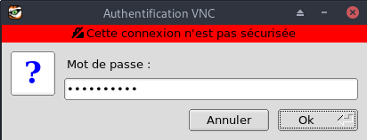
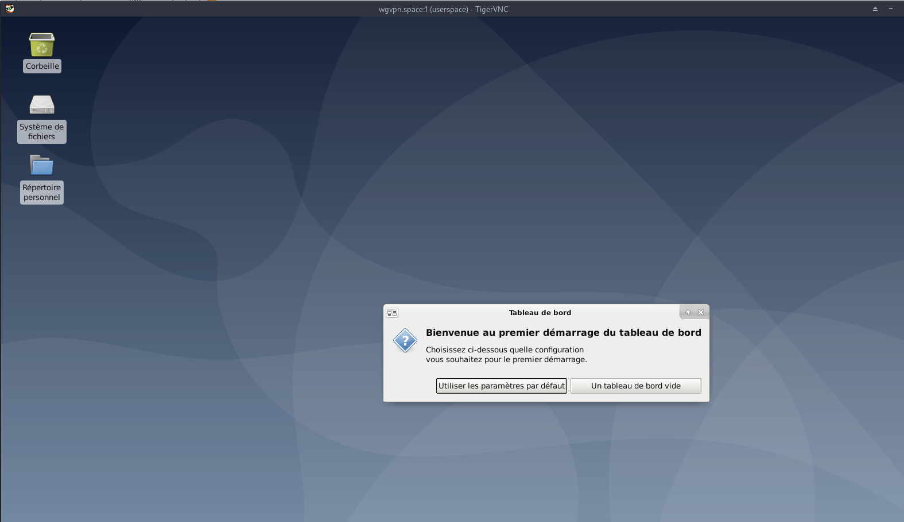

+++
title = 'vps789461 (wgvpn.space) debian buster desktop + serveur VNC + Backup (INACTIF)'
date = 2020-03-26 00:00:00 +0100
categories = vps
+++
*OVH vps789461 (1 vCore/2GoRam/20GoSSD) Debian Buster*

# Serveur VPS OVH 

{:width="50"}

## Debian 10

{:width="150"}  

```
Debian 10 (Buster) (en version 64 bits)


PARAMETRES D'ACCES:
L'adresse IPv4 du VPS est : 51.77.151.245
L'adresse IPv6 du VPS est : 2001:41d0:0404:0200::01cf

Le nom du VPS est : vps789461.ovh.net

Le compte administrateur suivant a été configuré sur le VPS :
Nom d'utilisateur : root
Mot de passe :      LJpgsV0N
```

Connexion SSH en "root"

    ssh root@51.77.151.245


### Réseau

{:width="70"}

Créer un bash pour désactiver l'initialisation réseau par le cloud sur le VPS OVH  

    nano initres.sh

```
1: lo: <LOOPBACK,UP,LOWER_UP> mtu 65536 qdisc noqueue state UNKNOWN group default qlen 1000
    link/loopback 00:00:00:00:00:00 brd 00:00:00:00:00:00
    inet 127.0.0.1/8 scope host lo
       valid_lft forever preferred_lft forever
    inet6 ::1/128 scope host 
       valid_lft forever preferred_lft forever
2: eth0: <BROADCAST,MULTICAST,UP,LOWER_UP> mtu 1500 qdisc pfifo_fast state UP group default qlen 1000
    link/ether fa:16:3e:f5:2d:0e brd ff:ff:ff:ff:ff:ff
    inet 51.77.151.245/32 brd 51.77.151.245 scope global dynamic eth0
       valid_lft 86242sec preferred_lft 86242sec
    inet6 2001:41d0:404:200::1cf/128 scope global 
       valid_lft forever preferred_lft forever
    inet6 fe80::f816:3eff:fef5:2d0e/64 scope link 
       valid_lft forever preferred_lft forever
```

Droits et exécution

    chmod +x initres.sh && ./initres.sh

Patienter quelques minutes avant la reconnexion...

Se connecter en root via SSH  

    ssh root@51.77.151.245

Vérifier le réseau `ip a` 

```
1: lo: <LOOPBACK,UP,LOWER_UP> mtu 65536 qdisc noqueue state UNKNOWN group default qlen 1000
    link/loopback 00:00:00:00:00:00 brd 00:00:00:00:00:00
    inet 127.0.0.1/8 scope host lo
       valid_lft forever preferred_lft forever
    inet6 ::1/128 scope host 
       valid_lft forever preferred_lft forever
2: eth0: <BROADCAST,MULTICAST,UP,LOWER_UP> mtu 1500 qdisc pfifo_fast state UP group default qlen 1000
    link/ether fa:16:3e:fc:9a:0d brd ff:ff:ff:ff:ff:ff
    inet 51.77.151.245/32 brd 51.77.151.245 scope global dynamic eth0
       valid_lft 86360sec preferred_lft 86360sec
    inet6 2001:41d0:401:3200::d48/128 scope global 
       valid_lft forever preferred_lft forever
    inet6 fe80::f816:3eff:fefc:9a0d/64 scope link 
       valid_lft forever preferred_lft forever
```

Locales **fr UTF8** : `dpkg-reconfigure locales` (facultatif)  
Fuseau **Europe/Paris** : `dpkg-reconfigure tzdata` (facultatif)  

### domaine wgvpn.space

{:width=70"}  

Zone dns OVH

```
$TTL 3600
@	IN SOA dns20.ovh.net. tech.ovh.net. (2020022809 86400 3600 3600000 300)
        IN NS     ns20.ovh.net.
        IN NS     dns20.ovh.net.
        IN A      51.77.151.245
        IN AAAA   2001:41d0:404:200::1cf
```

### Création utilisateur

Utilisateur **userspace**  

    useradd -m -d /home/userspace/ -s /bin/bash userspace

Mot de passe **userspace**  

    passwd userspace 

Visudo pour les accès root via utilisateur **userspace**  

```bash
echo "userspace     ALL=(ALL) NOPASSWD: ALL" >> /etc/sudoers
```

Changer le mot de passe root

    passwd root
    
Mise à jour et reboot

    apt update && apt -y upgrade && systemctl reboot

### OpenSSH, clé et script

{:width="100"}

**connexion avec clé**  
<u>sur l'ordinateur de bureau</u>
Générer une paire de clé curve25519-sha256 (ECDH avec Curve25519 et SHA2) nommé **kvm-cinay** pour une liaison SSH avec le serveur KVM.  

    ssh-keygen -t ed25519 -o -a 100 -f ~/.ssh/kvm-vps789461

Envoyer la clé publique sur le serveur KVM   

    scp ~/.ssh/kvm-vps789461.pub userspace@51.77.151.245:/home/userspace/

<u>sur le serveur KVM</u>
On se connecte  

    ssh userspace@51.77.151.245

Copier le contenu de la clé publique dans /home/$USER/.ssh/authorized_keys  

    cd ~

Sur le KVM ,créer un dossier .ssh  

```bash
mkdir .ssh
cat $HOME/kvm-vps789461.pub >> $HOME/.ssh/authorized_keys
chmod 600 $HOME/.ssh/authorized_keys  # et donner les droits  
rm $HOME/kvm-vps789461.pub # effacer le fichier de la clé  
```

Modifier la configuration serveur SSH  

    sudo nano /etc/ssh/sshd_config

Modifier

```conf
Port 55039
PermitRootLogin no
PasswordAuthentication no
```


<u>session SSH ne se termine pas correctement lors d'un "reboot" à distance</u>  
Si vous tentez de **redémarrer/éteindre** une machine distance par **ssh**, vous pourriez constater que votre session ne se termine pas correctement, vous laissant avec un terminal inactif jusqu'à l'expiration d'un long délai d'inactivité. Il existe un bogue 751636 à ce sujet. Pour l'instant, la solution de contournement à ce problème est d'installer :  

    sudo apt install libpam-systemd  # installé par défaut sur debian buster

cela terminera la session ssh avant que le réseau ne tombe.  
Veuillez noter qu'il est nécessaire que PAM soit activé dans sshd.  

Relancer openSSH  

    sudo systemctl restart sshd

Accès depuis le poste distant avec la clé privée  

    ssh -p 55039 -i ~/.ssh/kvm-vps789461 userspace@51.77.151.245

### Installer utilitaires  

    sudo apt install rsync curl tmux jq figlet git dnsutils tree -y


### Scripts motd et ssh_rc_bash

Motd

    sudo nano /etc/motd # supprimer le contenu avant de copier/coller le contenu ci-dessous

```
                      ____  ___  ___  _ _    __  _          
      __ __ _ __  ___|__  |( _ )/ _ \| | |  / / / |         
      \ V /| '_ \(_-<  / / / _ \\_, /|_  _|/ _ \| |         
       \_/ | .__//__/ /_/  \___/ /_/   |_| \___/|_|         
 __ __ __ _|_| __ __ _ __  _ _      ___ _ __  __ _  __  ___ 
 \ V  V // _` |\ V /| '_ \| ' \  _ (_-<| '_ \/ _` |/ _|/ -_)
  \_/\_/ \__, | \_/ | .__/|_||_|(_)/__/| .__/\__,_|\__|\___|
         |___/      |_|                |_|                  
```


Script **ssh_rc_bash**  
>**ATTENTION!!! Les scripts sur connexion peuvent poser des problèmes pour des appels externes autres que ssh**

    nano ssh_rc_bash

```
#!/bin/bash

get_infos() {
    seconds="$(< /proc/uptime)"
    seconds="${seconds/.*}"
    days="$((seconds / 60 / 60 / 24)) jour(s)"
    hours="$((seconds / 60 / 60 % 24)) heure(s)"
    mins="$((seconds / 60 % 60)) minute(s)"
    
    # Remove plural if < 2.
    ((${days/ *} == 1))  && days="${days/s}"
    ((${hours/ *} == 1)) && hours="${hours/s}"
    ((${mins/ *} == 1))  && mins="${mins/s}"
    
    # Hide empty fields.
    ((${days/ *} == 0))  && unset days
    ((${hours/ *} == 0)) && unset hours
    ((${mins/ *} == 0))  && unset mins
    
    uptime="${days:+$days, }${hours:+$hours, }${mins}"
    uptime="${uptime%', '}"
    uptime="${uptime:-${seconds} seconds}"

   if [[ -f "/sys/devices/virtual/dmi/id/board_vendor" ||
                    -f "/sys/devices/virtual/dmi/id/board_name" ]]; then
	model="$(< /sys/devices/virtual/dmi/id/board_vendor)"
	model+=" $(< /sys/devices/virtual/dmi/id/board_name)"
   fi

   if [[ -f "/sys/devices/virtual/dmi/id/bios_vendor" ||
                    -f "/sys/devices/virtual/dmi/id/bios_version" ]]; then
        bios="$(< /sys/devices/virtual/dmi/id/bios_vendor)"
        bios+=" $(< /sys/devices/virtual/dmi/id/bios_version)"
        bios+=" $(< /sys/devices/virtual/dmi/id/bios_date)"
   fi
}

#clear
PROCCOUNT=`ps -Afl | wc -l`  		# nombre de lignes
PROCCOUNT=`expr $PROCCOUNT - 5`		# on ote les non concernées
GROUPZ=`users`
ipinfo=$(curl -s ipinfo.io) 		# info localisation format json
#ipinfo=$(curl -s iplocality.com) 		# info localisation format json
publicip=$(echo $ipinfo | jq -r '.ip')  # extraction des données , installer préalablement "jq"
ville=$(echo $ipinfo | jq -r '.city')
pays=$(echo $ipinfo | jq -r '.country')
cpuname=`cat /proc/cpuinfo |grep 'model name' | cut -d: -f2 | sed -n 1p`
iplink=`ip link show |grep -m 1 "2:" | awk '{print $2}' | cut -d: -f1`

if [[ $GROUPZ == *irc* ]]; then
ENDSESSION=`cat /etc/security/limits.conf | grep "@irc" | grep maxlogins | awk {'print $4'}`
PRIVLAGED="IRC Account"
else
ENDSESSION="Unlimited"
PRIVLAGED="Regular User"
fi
get_infos
logo=$(figlet "`hostname --fqdn`")
#meteo=$(curl fr.wttr.in/$ville?0)
sdx=$(df -h |grep "/dev/sd") # les montages /dev/sd
distri=$(lsb_release -sd)
distri+=" $(uname -m)"

echo -e "
\e[1;31m$logo
\e[1;35m   \e[1;37mHostname \e[1;35m= \e[1;32m`hostname`
\e[1;35m \e[1;37mWired IpV4 \e[1;35m= \e[1;32m`ip addr show $iplink | grep 'inet\b' | awk '{print $2}' | cut -d/ -f1`
\e[1;35m \e[1;37mWired IpV6 \e[1;35m= \e[1;32m`ip addr show $iplink | grep -E 'inet6' |grep -E 'scope link' | awk '{print $2}' | cut -d/ -f1`
\e[1;35m     \e[1;37mKernel \e[1;35m= \e[1;32m`uname -r`
\e[1;35m    \e[1;37mDistrib \e[1;35m= \e[1;32m$distri
\e[1;35m     \e[1;37mUptime \e[1;35m= \e[1;32m`echo $uptime`
\e[1;35m       \e[1;37mBios \e[1;35m= \e[1;32m`echo $bios`
\e[1;35m      \e[1;37mBoard \e[1;35m= \e[1;32m`echo $model`
\e[1;35m        \e[1;37mCPU \e[1;35m= \e[1;32m`echo $cpuname`
\e[1;35m \e[1;37mMemory Use \e[1;35m= \e[1;32m`free -m | awk 'NR==2{printf "%s/%sMB (%.2f%%)\n", $3,$2,$3*100/$2 }'`
\e[1;35m   \e[1;37mUsername \e[1;35m= \e[1;32m`whoami`
\e[1;35m   \e[1;37mSessions \e[1;35m= \e[1;32m`who | grep $USER | wc -l`
\e[1;35m\e[1;37mPublic IpV4 \e[1;35m= \e[1;32m`echo $publicip`
\e[1;35m\e[1;37mPublic IpV6 \e[1;35m= \e[1;32m`ip addr show $iplink | grep -m 1 'inet6\b'  | awk '{print $2}' | cut -d/ -f1`
\e[1;35m\e[1;33m$sdx
\e[1;0m
"
```

    chmod +x ssh_rc_bash # rendre le bash exécutable
    ./ssh_rc_bash        # exécution

### Hostname

	sudo hostnamectl set-hostname wgvpn.space
	
## Environnement bureau XFCE

{:width="50"}  

Installer le package TightVNC disponible dans le dépôt officiel debian .  

    sudo apt install xfce4 xfce4-goodies # goodies pour pouvoir notamment pour la langue

Pour avoir xfce en français ajouter les 3 lignes suivantes au fichier **/etc/profile**  

```
export LANGUAGE=fr_FR.utf8
export LANG=fr_FR.utf8
export LC_ALL=fr_FR.utf8
```

La prise en compte sera effective après redémarrage  

## Serveur vnc

{:width="50"}  

### Installer le serveur vnc

    sudo apt install vnc4server

Lancer le serveur vnc pour générer un mot de passe

	vncserver

```
You will require a password to access your desktops.

Password:
Verify:
Would you like to enter a view-only password (y/n)? n

New 'wgvpn.space:1 (userspace)' desktop at :1 on machine wgvpn.space

Starting applications specified in /etc/X11/Xvnc-session
Log file is /home/userspace/.vnc/wgvpn.space:1.log

Use xtigervncviewer -SecurityTypes VncAuth -passwd /home/userspace/.vnc/passwd :1 to connect to the VNC server.
```

>Si vous avez vu cette option "voir uniquement le mot de passe (view-only password)", cela signifie que vous n'avez aucun contrôle sur le serveur distant. Vous devrez choisir "n", afin d'avoir un accès complet.

### Configurer le serveur vnc

Tout d'abord, nous devons indiquer à notre serveur VNC quelles commandes effectuer lors de son démarrage. Ces commandes sont situées dans un fichier de configuration appelé **xstartup** dans le dossier **.vnc** sous votre répertoire personnel.  
Le script de démarrage a été créé lorsque vous avez exécuté vncserver à l'étape précédente, mais nous avons besoin de modifier certaines des commandes pour le bureau Xfce.  
Lorsque VNC est configuré pour la première fois, il lance une instance de serveur par défaut sur le port 5901. Ce port s'appelle un port d'affichage et est désigné par VNC comme **:1**. VNC peut lancer plusieurs instances sur d'autres ports d'affichage, comme **:2**,**:3**, etc. Lorsque vous travaillez avec des serveurs VNC, rappelez-vous que **:X** est un port d'affichage qui fait référence à **5900+X**.  


Pour modifier la configuration du serveur VNC, nous devrons d'abord arrêter l'instance du serveur VNC en cours d'exécution sur le port 5901.  

    vncserver -kill :1

```
Killing Xtigervnc process ID 3509... success!
```

Avant de commencer à configurer le nouveau fichier **xstartup**, sauvegardons l'original (Si EXISTANT).  

    mv ~/.vnc/xstartup ~/.vnc/xstartup.bak

Le fichier **xstartup**  

    nano ~/.vnc/xstartup

Collez ces commandes dans le fichier afin qu'elles soient effectuées automatiquement chaque fois que vous démarrez ou redémarrez le serveur VNC, puis enregistrez et fermez le fichier.  

```
#!/bin/bash
xrdb $HOME/.Xresources
startxfce4 &
```

>*La première commande du fichier, **xrdb $HOME/.Xresources**, indique au framework GUI de VNC de lire le fichier **.Xresources** de l'utilisateur du serveur.  
**.Xresources** est l'endroit où un utilisateur peut apporter des modifications à certains paramètres du bureau graphique, comme les couleurs des terminaux, les thèmes du curseur et le rendu des polices.  
La seconde commande indique simplement au serveur de lancer l'environnement graphique (xfce,gnome,lxde,etc...), où vous trouverez tous les logiciels graphiques dont vous avez besoin pour gérer votre serveur de façon confortable.*  

accorder des privilèges exécutables

    chmod +x ~/.vnc/xstartup

Maintenant, redémarrez le serveur VNC pour le test.  

    vncserver

```
New 'wgvpn.space:1 (userspace)' desktop at :1 on machine wgvpn.space

Starting applications specified in /home/userspace/.vnc/xstartup
Log file is /home/userspace/.vnc/wgvpn.space:1.log

Use xtigervncviewer -SecurityTypes VncAuth -passwd /home/userspace/.vnc/passwd :1 to connect to the VNC server.

```

### Tester le bureau Vnc depuis un poste client

Dans cette étape, nous testerons la connectivité de votre serveur VNC.

Tout d'abord, nous devons créer une connexion SSH sur votre ordinateur local qui remplace de manière sécurisée la connexion localhost pour VNC.  
Vous pouvez le faire via le terminal sous Linux ou OS X avec la commande suivante.  

    ssh -l utilisateur -L 55444:localhost:5901 192.168.1.10 sans clé SSH  

* c’est l’option `L` (majuscule) qui permet de créer le tunnel ssh
* **55444** sera le nouveau port à utiliser sur sa machine locale
* **localhost** dans ce cas-ci est la machine à atteindre à partir du serveur distant 192.168.1.10
* **5901** est le port de la machine à atteindre pour la connexion VNC (écran :1), dans ce cas on travail sur localhost car c’est la même machine
* **192.168.1.10** est l’IP de la machine distante ayant sshd (elle pourrait être différente de la machine à atteindre dans un autre cas)

Ensuite, vous pouvez utiliser un client VNC pour tenter une connexion au serveur VNC sur **localhost:55444**, vous serez invité à vous authentifier.  

    vncviewer localhost:55444


**Cas d'un serveur avec clé authentification SSH**  

    ssh -p 55039 -i /home/yannick/.ssh/kvm-vps789461 -L 55444:localhost:5901 -N -f -l userspace 51.77.151.245 

* Le commutateur `-L` précise les liaisons portuaires. Dans ce cas, nous relions le port **5901** de la connexion à distance au port **55444** de votre machine locale. 
* Le commutateur `-C` permet la compression, tandis 
* Le commutateur `-N` indique à ssh que nous ne voulons pas exécuter une commande à distance. 
* Le commutateur `-l` spécifie le nom de la connexion distante.

Depuis le poste qui a ouvert la session SSH pour le serveur vnc  

    vncviewer localhost:550444 

{:width="300"}  
{:width="600"}  


### Créer un service vnc sur le serveur

Nous configurons le serveur VNC en tant que service système pour démarrer, arrêter et redémarrer   
Créer un nouveau fichier d'unité appelé **/etc/systemd/system/vncserver@.service** 

    sudo nano /etc/systemd/system/vncserver@.service
    
Copiez et collez le suivant. Assurez-vous de modifier **User** et  PIDFILE pour correspondre à votre nom d'utilisateur.  

```
[Unit]
Description=Start TightVNC server at startup
After=syslog.target network.target

[Service]
Type=forking
User=userspace
Group=userspace
WorkingDirectory=/home/userspace

PIDFile=/home/userspace/.vnc/%H:%i.pid
ExecStartPre=-/usr/bin/vncserver -kill :%i > /dev/null 2>&1
ExecStart=/usr/bin/vncserver -depth 24 -geometry 1280x800 :%i
ExecStop=/usr/bin/vncserver -kill :%i

[Install]
WantedBy=multi-user.target
```

* La commande `ExecStartPre` arrête VNC si elle est déjà en cours d'exécution. 
* La commande `ExecStart` lance VNC et définit la profondeur de couleur sur 24 bits avec une résolution de 1280x800. Vous pouvez également modifier ces options de démarrage pour répondre à vos besoins.

Enregistrez et fermez le fichier.  
Informer le système du nouveau fichier.  

    sudo systemctl daemon-reload

Activer le fichier système  

    sudo systemctl enable vncserver@1.service
    
Arrêter l'instance actuelle du serveur VNC (si elle est toujours en cours d'exécution).  

    vncserver -kill :1
    
Ensuite, démarrer le service  

    sudo systemctl start vncserver@1

Vérifier l'état avec cette commande:  

    sudo systemctl status vncserver@1

```
● vncserver@1.service - Start TightVNC server at startup
   Loaded: loaded (/etc/systemd/system/vncserver@.service; enabled; vendor preset: enabled)
   Active: active (running) since Thu 2020-03-26 16:15:25 CET; 2min 8s ago
  Process: 469 ExecStartPre=/usr/bin/vncserver -kill :1 > /dev/null 2>&1 (code=exited, status=0/SUCCESS
  Process: 532 ExecStart=/usr/bin/vncserver -depth 24 -geometry 1280x800 :1 (code=exited, status=0/SUCC
 Main PID: 540 (Xtigervnc)
    Tasks: 53 (limit: 2313)
   Memory: 204.8M
```
    
Votre serveur VNC sera désormais disponible après redémarrage de la machine.


### Connexion/Déconnexion vnc depuis un poste client 

Ouvrir une fenêtre "terminal"  

**Connexion**   
Etablir le tunnel ssh sécurisé  

    ssh -p 55039 -i /home/yannick/.ssh/kvm-vps789461 -L 55444:localhost:5901 -N -f -l userspace 51.77.151.245 

* `-L` précise les liaisons portuaires. Dans ce cas, nous relions le port **5901** de la connexion à distance au port **55444** de votre machine locale. 
* `-C` permet la compression, tandis 
* `-N` indique à ssh que nous ne voulons pas exécuter une commande à distance. 
* `-l` spécifie le nom de la connexion distante.

Puis lancer la connexion VNC  

    vncviewer localhost:55444

**Déconnexion**  
Après fermeture de la session vnc, il faut supprimer le tunnel ssh  

    kill $(pidof -s ssh)

**Changer le mot de passe**  
Une fois connecté, il suffit de modifier votre mot de passe, grâce à la commande `vncpasswd`

```
Using password file ~/.vnc/passwd
Password: 
Verify:   
Would you like to enter a view-only password (y/n)? n=
```

Entrez deux fois votre nouveau mot de passe (attention, pour des raisons de sécurité le mot de passe n'apparait pas à l'écran).  
Puis répondez 'n' à la question Would you like to enter a view-only password, pour dire que vous ne voulez pas de mot de passe "lecture seul".  
Voila votre mot de passe VNC à été modifé.

### Parefeu - UFW

{:width="100"}

* [UFW Parefeu (firewall)-Lien HS](/files/html/UFW%20Parefeu%20(firewall).htm)

Installation 

    sudo apt install ufw

Status

    sudo ufw status verbose
        Status: inactive

Les règles 

    sudo ufw allow 55039/tcp  # port SSH , 55039
    sudo ufw allow DNS        # port 53 tcp et udp

Activer le parefeu

    sudo ufw enable

```
Command may disrupt existing ssh connections. Proceed with operation (y|n)? y
Firewall is active and enabled on system startup
```

Status

     sudo ufw status verbose

```
Status: active
Logging: on (low)
Default: deny (incoming), allow (outgoing), disabled (routed)
New profiles: skip

To                         Action      From
--                         ------      ----
55039/tcp                  ALLOW IN    Anywhere                  
53 (DNS)                   ALLOW IN    Anywhere                  
55039/tcp (v6)             ALLOW IN    Anywhere (v6)             
53 (DNS (v6))              ALLOW IN    Anywhere (v6)             
```

---

# Sauvegarde BorgBackup


### Préparation de la machine à sauvegarder

On se connecte sur la machine et on passe en mode su  

    sudo -s
    apt update

Installer borgbackup

    apt install borgbackup

**<u>Créer un jeu de clé sur machine à sauvegarder (wgvpn.space)</u>**  
Créer un utilisateur borg (sans home) dédié aux sauvegardes par BorgBackup :

    useradd -M borg

Générer un jeu de clé sur **/root/.ssh** 

    mkdir -p /root/.ssh
    ssh-keygen -t ed25519 -o -a 100 -f /root/.ssh/wgvpn_space_ed25519

Le jeu de clé

    ls /root/.ssh
        wgvpn_space_ed25519  wgvpn_space_ed25519.pub

Autoriser utilisateur **borg** à exécuter */usr/bin/borg* uniquement

    echo "borg ALL=NOPASSWD: /usr/bin/borg" >> /etc/sudoers

### Ajout clé publique au serveur backup xoyaz.xyz

>Pour une connexion via ssh vous devez ajouter la clé publique *wgvpn_space_ed25519.pub* du **serveur client  wgvpn.space** au fichier *~/.ssh/authorized_keys* du  **serveur backup xoyaz.xyz**  

Se connecter au **serveur backup xoyaz.xyz** depuis un terminal autorisé

	ssh usernl@5.2.79.107 -p 55036 -i /home/yannick/.ssh/OVZ-STORAGE-128 # connexion SSH serveur backup depuis PC1
	sudo -s # passer en super utilisateur
	cat >> /srv/data/borg-backups/.ssh/authorized_keys

Copier/coller le contenu du fichier du fichier de clef publique (fichier **/root/.ssh/wgvpn_space_ed25519.pub** de la machine à sauvegarder **cinay.xyz** ) dans ce terminal, et presser **[Ctrl]+[D]** pour valider.

Test depuis le serveur client **wgvpn.space**  (c'est lui qui possède la clé privée).  
*Si parefeu avec les sorties bloquées sur **wgvpn.space** , il faut ouvrir en sortie le port TCP 55036.*

**AU PREMIER passage une question est posée , saisir oui ou yes**

    sudo -s
    ssh -p 55036 -i /root/.ssh/wgvpn_space_ed25519 borg@xoyaz.xyz

```
The authenticity of host '[xoyaz.xyz]:55036 ([2a04:52c0:101:7ae::7a5e]:55036)' can't be established.
ECDSA key fingerprint is SHA256:PDXQBhTh4oj0cSzgnjCun+J60JDUEk7VeLH2YHZbwMc.
Are you sure you want to continue connecting (yes/no)? yes
Warning: Permanently added '[xoyaz.xyz]:55036,[2a04:52c0:101:7ae::7a5e]:55036' (ECDSA) to the list of known hosts.
Linux backup 2.6.32-042stab140.1 #1 SMP Thu Aug 15 13:32:22 MSK 2019 x86_64
  _               _               
 | |__  __ _  __ | |__ _  _  _ __ 
 | '_ \/ _` |/ _|| / /| || || '_ \
 |_.__/\__,_|\__||_\_\ \_,_|| .__/
                            |_|   
Last login: Sun Sep 15 15:13:35 2019 from 2a01:e34:eef2:570:2c83:bd30:365a:ff54
$ 
```

saisir `exit` pour sortir

>NOTE : **/srv/data/borg-backups** est le home de l'utilisateur *borg* sur le serveur backup *xoyaz.xyz*

### Création dépôt et lancement des sauvegardes depuis la machine à sauvegarder

**<u>machine cliente wgvpn.space</u>**  
On se connecte sur la machine et on passe en mode su  

    sudo -s

**Création du dépôt distant sur le serveur backup xoyaz.xyz (A FAIRE UNE SEULE FOIS)**

    export BORG_RSH='ssh -i /root/.ssh/wgvpn_space_ed25519' # ce n'est pas la clé par défaut id_rsa
    borg init --encryption=repokey-blake2 ssh://borg@xoyaz.xyz:55036/srv/data/borg-backups/wgvpn.space

```
Enter new passphrase: 
Enter same passphrase again: 
Do you want your passphrase to be displayed for verification? [yN]: 

By default repositories initialized with this version will produce security
errors if written to with an older version (up to and including Borg 1.0.8).

If you want to use these older versions, you can disable the check by running:
borg upgrade --disable-tam ssh://borg@xoyaz.xyz:55036/srv/data/borg-backups/wgvpn.space

See https://borgbackup.readthedocs.io/en/stable/changes.html#pre-1-0-9-manifest-spoofing-vulnerability for details about the security implications.

IMPORTANT: you will need both KEY AND PASSPHRASE to access this repo!
Use "borg key export" to export the key, optionally in printable format.
Write down the passphrase. Store both at safe place(s).
```

Sauvegarder la "passphrase" dans un fichier pour une procédure automatique 

    mkdir -p /root/.borg
    nano /root/.borg/passphrase

**Générer une sauvegarde d'un dossier local vers le dépôt distant** pour test (facultatif)

    borg create ssh://borg@xoyize.xyz:55029/srv/ssd-two/borg-backups/wgvpn.space::2019-01-11 /home/yanfi

```
Enter passphrase for key ssh://borg@xoyize.xyz:55029/srv/ssd-two/borg-backups/wgvpn.space: 
```

**Automatiser la procédure de sauvegarde pour le client wgvpn.space**  
script de sauvegarde (notez l'usage de borg prune pour supprimer les archives trop anciennes)  

    nano /root/.borg/borg-backup 

```
#!/bin/sh
#
# Script de sauvegarde.
#
# Envoie les sauvegardes sur un serveur distant, via le programme Borg.
# Les sauvegardes sont chiffrées
#
 
set -e
 
BACKUP_DATE=`date +%Y-%m-%d-%Hh%M`
LOG_PATH=/var/log/borg-backup.log
 
export BORG_PASSPHRASE="`cat ~root/.borg/passphrase`"
export BORG_RSH='ssh -i /root/.ssh/wgvpn_space_ed25519'
BORG_REPOSITORY=ssh://borg@xoyaz.xyz:55036/srv/data/borg-backups/wgvpn.space
BORG_ARCHIVE=${BORG_REPOSITORY}::${BACKUP_DATE}
 
borg create \
-v --stats --compression lzma,9 \
$BORG_ARCHIVE \
/bin /boot /etc /home /lib /lib64 /opt /root /sbin /srv /usr /var \
>> ${LOG_PATH} 2>&1
 
# Nettoyage des anciens backups
# On conserve
# - une archive par jour les 7 derniers jours,
# - une archive par semaine pour les 4 dernières semaines,
# - une archive par mois pour les 6 derniers mois.
 
borg prune \
-v --list --stats --keep-daily=7 --keep-weekly=4 --keep-monthly=6 \
$BORG_REPOSITORY \
>> ${LOG_PATH} 2>&1
```

Le rendre exécutable

    chmod +x /root/.borg/borg-backup

Programmer la tâche à 2h40 du matin

    crontab -e

```
# Sauvegarde sur distant avec BorgBackup
40 02 * * * /root/.borg/borg-backup > /dev/null
```


