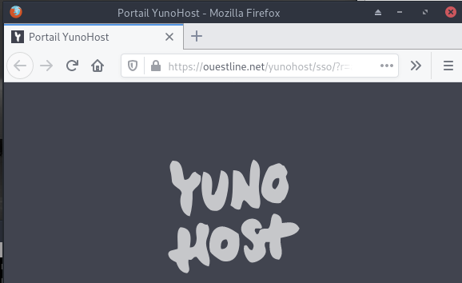
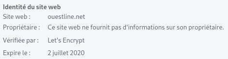
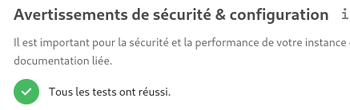

+++
title = 'Machine Virtuelle "Debian Stretch" ouestline.net (VirtualBox/PC1)'
date = 2020-03-28 00:00:00 +0100
categories = ['virtuel']
+++
## Machine virtuelle VirtualBox yunohost sur PC1 (ouestline.net)

Créer une machine "Debian Stretch" sur VirtualBox :   
Ram : 1024 Mo  
Disque : "Debain Stretch.vmdk" 12 Go  
Lecteur optique : (Installation à partir d'une image ISO)  
Réseau : Pont enp0s31f6  

### Debian Stretch

  

* Serveur virtuel 64 bits VirtualBox : **Debian Stretch** 
* machine : **dbs** 
* domaine :   
* root : **ytreu49** 
* Utilisateur : **dbsuser** 
* Mot de passe : **dbsuser49** 
* Adresse IP : **192.168.0.47**
* Accès 
    * SSH : <s>**ssh dbsuser@192.168.0.47**</s>
    * SSH + clé : **ssh -i ~/.ssh/vbox-dbs-ed25519 dbsuser@192.168.0.47**  
    * Transfert de fichier : **scp -P 55022 -i ~/.ssh/vbox-dbs-ed25519 fichiera fichierb dbsuser@192.168.0.47:/home/dbsuser**  

Connexion utilisateur  
On vérifie l'adresse ip : `ip a`  
On passe en root et on supprime l'utilisateur 

    su
    cd ~
    userdel dbsuser  
    
On autorise l'accès root via ssh (temporairement ,pour installer yunohost)

    nano /etc/ssh/sshd_config

PermitRootLogin yes # ligne à modifier

On mofifie le réseau pour l'accès {:width="30"}

    nano /etc/network/interfaces

```
source /etc/network/interfaces.d/*

# The loopback network interface
auto lo
iface lo inet loopback

# The primary network interface
allow-hotplug enp0s3
iface enp0s3 inet dhcp
# This is an autoconfigured IPv6 interface
iface enp0s3 inet6 static
 address 2a01:e34:ee6a:b274::1
 netmask 64
 post-up ip -6 route add default via fe80::224:d4ff:fea6:aa20 dev enp0s3
```

On redémarre la machine

    reboot

Accès root via ssh

    ssh root@192.168.0.47

Réseau

    ip a

```
1: lo: <LOOPBACK,UP,LOWER_UP> mtu 65536 qdisc noqueue state UNKNOWN group default qlen 1
    link/loopback 00:00:00:00:00:00 brd 00:00:00:00:00:00
    inet 127.0.0.1/8 scope host lo
       valid_lft forever preferred_lft forever
    inet6 ::1/128 scope host 
       valid_lft forever preferred_lft forever
2: enp0s3: <BROADCAST,MULTICAST,UP,LOWER_UP> mtu 1500 qdisc pfifo_fast state UP group default qlen 1000
    link/ether 08:00:27:a1:75:8e brd ff:ff:ff:ff:ff:ff
    inet 192.168.0.47/24 brd 192.168.0.255 scope global enp0s3
       valid_lft forever preferred_lft forever
    inet6 2a01:e34:ee6a:b274::1/64 scope global 
       valid_lft forever preferred_lft forever
    inet6 fe80::a00:27ff:fea1:758e/64 scope link 
       valid_lft forever preferred_lft forever

```

Supprimer le dossier utilisateur dbsuser

    rm -r /home/dbsuser

### DNS

>{:width="30"} <font color="red">**A configurer avant d'installer yunohost**</font>


Le domaine **ouestline.net** pointe sur l'adresse IPV6 **2a01:e34:ee6a:b274::1**

depuis un poste distant  
`ping -6 -c5 2a01:e34:ee6a:b274::1`  
`ping -6 -c5 ouestline.xyz`  

OVH

```
$TTL 3600
@	IN SOA dns111.ovh.net. tech.ovh.net. (2018110102 86400 3600 3600000 300)
         3600 IN NS     ns111.ovh.net.
         3600 IN NS     dns111.ovh.net.
         3600 IN AAAA   2a01:e34:ee6a:b274::1
*        3600 IN CNAME  ouestline.net.
```


## Yunohost

{:width="50px"}

### Installation Yunohost

Lancer le bash et patienter

    bash <(wget -q -O- https://install.yunohost.org/)

```
===============================================================================
You should now proceed with Yunohost post-installation. This is where you will
be asked for :
  - the main domain of your server ;
  - the administration password.

You can perform this step :
  - from the command line, by running 'yunohost tools postinstall' as root
  - or from your web browser, by accessing : 
    - https://192.168.0.47/ (local IP, if self-hosting at home)
    - https://78.235.240.223/ (global IP, if you're on a VPS)

If this is your first time with YunoHost, it is strongly recommended to take
time to read the administator documentation and in particular the sections
'Finalizing your setup' and 'Getting to know YunoHost'. It is available at
the following URL : https://yunohost.org/admindoc
===============================================================================
```


Lancer la "post-installation" ou lancer

    yunohost tools postinstall   

Main domain: ouestline.net    
Mot de passe administrateur  

Créer un utilisateur 

    yunohost user create ouest

```
fullname: ouest line
mail: ouest@ouestline.net
username: ouest
```

Certificats let's encrypt pour le domaine

    yunohost domain cert-install

```
Info : Now attempting install of certificate for domain ouestline.net!
Erreur : Aucun enregistrement DNS 'A' n’a été trouvé pour ouestline.net. Vous devez faire pointer votre nom de domaine vers votre machine pour être en mesure d’installer un certificat Let’s Encrypt ! (Si vous savez ce que vous faites, utilisez --no-checks pour désactiver ces contrôles)
```

>l'accès est uniquement IPV6 !!!

Se connecter en admin via ssh

    ssh admin@192.168.0.47

### OpenSSH avec clés

{:width="80px"}
  

**connexion avec clé**  
<u>sur l'ordinateur de bureau</u>
Générer une paire de clé curve25519-sha256 (ECDH avec Curve25519 et SHA2) nommé **vbox-ouestline** pour une liaison SSH avec le serveur KVM.  

    ssh-keygen -t ed25519 -o -a 100 -f ~/.ssh/vbox-ouestline   

Envoyer la clé publique sur le serveur KVM   

    scp ~/.ssh/vbox-ouestline.pub admin@192.168.0.47:/home/admin/

<u>sur le serveur KVM</u>
On se connecte  

	ssh admin@192.168.0.47
	
Copier le contenu de la clé publique dans /home/$USER/.ssh/authorized_keys  

	cd ~
	
Sur le KVM ,créer un dossier .ssh  

```
mkdir .ssh
cat /home/$USER/vbox-ouestline.pub >> /home/$USER/.ssh/authorized_keys
```

et donner les droits  

	chmod 600 /home/$USER/.ssh/authorized_keys
	
effacer le fichier de la clé  

	rm /home/$USER/vbox-ouestline.pub
	
Modifier la configuration serveur SSH  

	sudo nano /etc/ssh/sshd_config

Modifier

```
Port = 55040
PermitRootLogin no
PasswordAuthentication no
```

<u>session SSH ne se termine pas correctement lors d'un "reboot" à distance</u>  
Si vous tentez de **redémarrer/éteindre** une machine distance par **ssh**, vous pourriez constater que votre session ne se termine pas correctement, vous laissant avec un terminal inactif jusqu'à l'expiration d'un long délai d'inactivité. Il existe un bogue 751636 à ce sujet. Pour l'instant, la solution de contournement à ce problème est d'installer :  

      sudo apt install libpam-systemd
      
cela terminera la session ssh avant que le réseau ne tombe.  
Veuillez noter qu'il est nécessaire que PAM soit activé dans sshd.  

Ouvrir le port 55040 et fermer le port 22

    sudo yunohost firewall allow TCP 55040
    sudo yunohost firewall disallow TCP 22
    
Relancer openSSH  

    sudo systemctl restart sshd

Accès depuis le poste distant avec la clé privée  

    ssh -p 55040 -i ~/.ssh/vbox-ouestline admin@192.168.0.47

**Affichage à la connexion ssh**  

Exécuter un fichier *utilisateur* nommé **$HOME/.ssh/rc** si *présent (NON PRESENT)*  
Pour *tous les utilisateurs* exécuter un fichier nommé **/etc/ssh/sshrc** si *présent (NON PRESENT)*  
Installer les utilitaires *curl jq figlet tmux*  

    sudo apt install curl jq figlet tmux    # outils supplémentaires

Créer le fichier **~/ssh_rc_bash** 

```
#!/bin/bash

get_infos() {
    seconds="$(< /proc/uptime)"
    seconds="${seconds/.*}"
    days="$((seconds / 60 / 60 / 24)) jour(s)"
    hours="$((seconds / 60 / 60 % 24)) heure(s)"
    mins="$((seconds / 60 % 60)) minute(s)"
    
    # Remove plural if < 2.
    ((${days/ *} == 1))  && days="${days/s}"
    ((${hours/ *} == 1)) && hours="${hours/s}"
    ((${mins/ *} == 1))  && mins="${mins/s}"
    
    # Hide empty fields.
    ((${days/ *} == 0))  && unset days
    ((${hours/ *} == 0)) && unset hours
    ((${mins/ *} == 0))  && unset mins
    
    uptime="${days:+$days, }${hours:+$hours, }${mins}"
    uptime="${uptime%', '}"
    uptime="${uptime:-${seconds} seconds}"

   if [[ -f "/sys/devices/virtual/dmi/id/board_vendor" ||
                    -f "/sys/devices/virtual/dmi/id/board_name" ]]; then
	model="$(< /sys/devices/virtual/dmi/id/board_vendor)"
	model+=" $(< /sys/devices/virtual/dmi/id/board_name)"
   fi

   if [[ -f "/sys/devices/virtual/dmi/id/bios_vendor" ||
                    -f "/sys/devices/virtual/dmi/id/bios_version" ]]; then
        bios="$(< /sys/devices/virtual/dmi/id/bios_vendor)"
        bios+=" $(< /sys/devices/virtual/dmi/id/bios_version)"
        bios+=" $(< /sys/devices/virtual/dmi/id/bios_date)"
   fi
}

#clear
PROCCOUNT=`ps -Afl | wc -l`  		# nombre de lignes
PROCCOUNT=`expr $PROCCOUNT - 5`		# on ote les non concernées
GROUPZ=`users`
ipinfo=$(curl -s ipinfo.io) 		# info localisation format json
#ipinfo=$(curl -s iplocality.com) 		# info localisation format json
publicip=$(echo $ipinfo | jq -r '.ip')  # extraction des données , installer préalablement "jq"
ville=$(echo $ipinfo | jq -r '.city')
pays=$(echo $ipinfo | jq -r '.country')
cpuname=`cat /proc/cpuinfo |grep 'model name' | cut -d: -f2 | sed -n 1p`
iplink=`ip link show |grep -m 1 "2:" | awk '{print $2}' | cut -d: -f1`

if [[ $GROUPZ == *irc* ]]; then
ENDSESSION=`cat /etc/security/limits.conf | grep "@irc" | grep maxlogins | awk {'print $4'}`
PRIVLAGED="IRC Account"
else
ENDSESSION="Unlimited"
PRIVLAGED="Regular User"
fi
get_infos
logo=$(figlet "`hostname --fqdn`")
meteo=$(curl fr.wttr.in/$ville?0)
lvm_entet="Sys. fichiers\tTaille\tUtilisé\tDispo\tUti%\tMonté sur"
lvm=$(df -h |grep mapper)    # les montages lvm
sdx=$(df -h |grep "/dev/sd") # les montages /dev/sd
distri=$(lsb_release -sd)
distri+=" $(uname -m)"

echo -e "
\e[1;31m$logo
\e[1;35m   \e[1;37mHostname \e[1;35m= \e[1;32m`hostname`
\e[1;35m \e[1;37mWired IpV4 \e[1;35m= \e[1;32m`ip addr show $iplink | grep 'inet\b' | awk '{print $2}' | cut -d/ -f1`
\e[1;35m \e[1;37mWired IpV6 \e[1;35m= \e[1;32m`ip addr show $iplink | grep -E 'inet6' |grep -E 'scope link' | awk '{print $2}' | cut -d/ -f1`
\e[1;35m     \e[1;37mKernel \e[1;35m= \e[1;32m`uname -r`
\e[1;35m    \e[1;37mDistrib \e[1;35m= \e[1;32m$distri
\e[1;35m     \e[1;37mUptime \e[1;35m= \e[1;32m`echo $uptime`
\e[1;35m       \e[1;37mBios \e[1;35m= \e[1;32m`echo $bios`
\e[1;35m      \e[1;37mBoard \e[1;35m= \e[1;32m`echo $model`
\e[1;35m        \e[1;37mCPU \e[1;35m= \e[1;32m`echo $cpuname`
\e[1;35m \e[1;37mMemory Use \e[1;35m= \e[1;32m`free -m | awk 'NR==2{printf "%s/%sMB (%.2f%%)\n", $3,$2,$3*100/$2 }'`
\e[1;35m   \e[1;37mUsername \e[1;35m= \e[1;32m`whoami`
\e[1;35m   \e[1;37mSessions \e[1;35m= \e[1;32m`who | grep $USER | wc -l`
\e[1;35m\e[1;37mPublic IpV4 \e[1;35m= \e[1;32m`echo $publicip`
\e[1;35m\e[1;37mPublic IpV6 \e[1;35m= \e[1;32m`ip addr show $iplink | grep -m 1 'inet6\b'  | awk '{print $2}' | cut -d/ -f1`
\e[1;35m\e[1;96m$lvm_entet\e[1;35m\e[1;49m
\e[1;35m\e[1;33m$sdx
\e[1;35m\e[1;33m$lvm
\e[1;35m\e[1;32m$meteo
\e[1;0m
"
```

Le rendre exécutable

    chmod +x ~/ssh_rc_bash

Recréer motd  

    sudo rm /etc/motd && sudo nano /etc/motd  

```
     _       _     _                       _       _               _ 
  __| | ___ | |__ (_) __ _  _ _  ___ __ __(_) _ _ | |_  _  _  ___ | |
 / _` |/ -_)| '_ \| |/ _` || ' \|___|\ V /| || '_||  _|| || |/ -_)| |
 \__,_|\___||_.__/|_|\__,_||_||_|     \_/ |_||_|   \__| \_,_|\___||_|
                        _    _  _                           _        
    ___  _  _  ___  ___| |_ | |(_) _ _   ___     _ _   ___ | |_      
   / _ \| || |/ -_)(_-<|  _|| || || ' \ / -_) _ | ' \ / -_)|  _|     
   \___/ \_,_|\___|/__/ \__||_||_||_||_|\___|(_)|_||_|\___| \__|     
                                                                     
```

Déconnexion puis connexion  

### PC1 - Service pour démarrer la machine virtuelle

On va créer un service utilisateur pour démaarer la machine virtuelle à la connexion utilisateur  
On place l’unit propre à un utilisateur dans le dossier ~/.config/systemd/user, créer le dossier

mkdir -p ~/.config/systemd/user

Le fichier unit debian-virtuel.service

nano ~/.config/systemd/user/debian-virtuel.service

```
[Unit]
Description=Debian Stretch vm service
After=network.target vboxdrv.service

[Service]
ExecStart=/usr/bin/vboxheadless -s 'Debian Stretch'
ExecStop=/usr/bin/vboxmanage controlvm 'Debian Stretch' poweroff

[Install]
WantedBy=default.target
```

Une fois ce fichier placé au bon endroit, il suffit de reloader systemd pour ensuite démarrer le service:

```
systemctl --user daemon-reload
systemctl start --user debian-virtuel.service
systemctl enable --user debian-virtuel.service
systemctl status --user debian-virtuel.service
```


### Certificats SSL letsencrypt (acme)

{:width="100"}  

Prérequis

    sudo apt install socat # prérequis

Installation gestionnaire des certificats Let's Encrypt

```
cd ~
git clone https://github.com/Neilpang/acme.sh.git
cd acme.sh
./acme.sh --install 
```

>Se déconnecter puis se reconnecter pou la prise en compte

Se connecter sur l'api OVH pour les paramètres (clé et secret)

    export OVH_AK="votre application key"
    export OVH_AS="votre application secret"

Domaine ouestline.xyz

```
acme.sh --dns dns_ovh --issue --keylength ec-384 -d 'ouestline.net' -d '*.ouestline.net'
```

Les certificats

```
[Sat Mar 28 12:16:19 CET 2020] Your cert is in  /home/admin/.acme.sh/ouestline.net_ecc/ouestline.net.cer 
[Sat Mar 28 12:16:19 CET 2020] Your cert key is in  /home/admin/.acme.sh/ouestline.net_ecc/ouestline.net.key 
[Sat Mar 28 12:16:19 CET 2020] The intermediate CA cert is in  /home/admin/.acme.sh/ouestline.net_ecc/ca.cer 
[Sat Mar 28 12:16:19 CET 2020] And the full chain certs is there:  /home/admin/.acme.sh/ouestline.net_ecc/fullchain.cer 
```

On ne peut pas installer des certificats let's encrypt sans adresse IPV4 ,erreur  `Aucun enregistrement DNS 'A' n’a été trouvé pour ouestline.net`  
<u>Solution</u>  

Pour contourner le problème , on va créer un dossier de la forme **aaaammdd.hhmmss-letsencrypt** (en mode su)

	mkdir -p /etc/yunohost/certs/ouestline.net-history/20200328.131000-letsencrypt

Puis on va créer les liens

Les liens pour les certificats

```
sudo ln -s /home/admin/.acme.sh/ouestline.net_ecc/ouestline.net.key /etc/yunohost/certs/ouestline.net-history/20200328.131000-letsencrypt/key.pem     # cert key
sudo ln -s /home/admin/.acme.sh/ouestline.net_ecc/fullchain.cer /etc/yunohost/certs/ouestline.net-history/20200328.131000-letsencrypt/crt.pem   # full chain certs
```

Enfin on va informer yunohost par un lien que l'on utilise des certificats let's encrypt

	sudo rm /etc/yunohost/certs/ouestline.net # efface le lien certificat non signé
	sudo ln -s /etc/yunohost/certs/ouestline.net-history/20200328.131000-letsencrypt /etc/yunohost/certs/ouestline.net # Création lien sur les certificats let's encrypt 


Structure yunohost pour les certificats

```
/etc/yunohost/certs/
├── ouestline.net -> /etc/yunohost/certs/ouestline.net-history/20200328.131000-letsencrypt
├── ouestline.net-history
│   ├── 20200328.094607-selfsigned
│   │   ├── ca.pem -> /etc/ssl/certs/ca-yunohost_crt.pem
│   │   ├── crt.pem
│   │   ├── key.pem
│   │   └── openssl.cnf
│   └── 20200328.131000-letsencrypt
│       ├── crt.pem -> /home/admin/.acme.sh/ouestline.net_ecc/fullchain.cer
│       └── key.pem -> /home/admin/.acme.sh/ouestline.net_ecc/ouestline.net.key
└── yunohost.org
    ├── ca.pem
    ├── crt.pem
    └── key.pem
```

Redémarrer la machine

	sudo systemctl reboot


### SSL + Diffie-Hellmann + Entêtes 

{:width="60"}

Toutes les commandes se font en mode su

Générer Diffie-Hellman 

    openssl dhparam -out /etc/ssl/private/dh2048.pem -outform PEM -2 2048

Modification fichier de configuration **/etc/nginx/conf.d/ouestline.net.conf**

* Décommenter la ligne `ssl_dhparam /etc/ssl/private/dh2048.pem;` 

Le fichier **/etc/nginx/conf.d/ouestline.net.conf** après les modifications

```
map $http_upgrade $connection_upgrade {
    default upgrade;
    ''      close;
}

server {
    listen 80;
    listen [::]:80;
    server_name ouestline.net;

    access_by_lua_file /usr/share/ssowat/access.lua;

    include /etc/nginx/conf.d/ouestline.net.d/*.conf;

    location /yunohost/admin {
        return 301 https://$http_host$request_uri;
    }

    location /.well-known/autoconfig/mail/ {
        alias /var/www/.well-known/ouestline.net/autoconfig/mail/;
    }

    access_log /var/log/nginx/ouestline.net-access.log;
    error_log /var/log/nginx/ouestline.net-error.log;
}

server {
    listen 443 ssl http2;
    listen [::]:443 ssl http2;
    server_name ouestline.net;

    ssl_certificate /etc/yunohost/certs/ouestline.net/crt.pem;
    ssl_certificate_key /etc/yunohost/certs/ouestline.net/key.pem;
    ssl_session_timeout 5m;
    ssl_session_cache shared:SSL:50m;

    
    # As suggested by Mozilla : https://wiki.mozilla.org/Security/Server_Side_TLS and https://en.wikipedia.org/wiki/Curve25519
    ssl_ecdh_curve secp521r1:secp384r1:prime256v1;
    ssl_prefer_server_ciphers on;

    # Ciphers with intermediate compatibility
    # https://mozilla.github.io/server-side-tls/ssl-config-generator/?server=nginx-1.6.2&openssl=1.0.1t&hsts=yes&profile=intermediate
    ssl_protocols TLSv1 TLSv1.1 TLSv1.2;
    ssl_ciphers 'ECDHE-ECDSA-CHACHA20-POLY1305:ECDHE-RSA-CHACHA20-POLY1305:ECDHE-ECDSA-AES128-GCM-SHA256:ECDHE-RSA-AES128-GCM-SHA256:ECDHE-ECDSA-AES256-GCM-SHA384:ECDHE-RSA-AES256-GCM-SHA384:DHE-RSA-AES128-GCM-SHA256:DHE-RSA-AES256-GCM-SHA384:ECDHE-ECDSA-AES128-SHA256:ECDHE-RSA-AES128-SHA256:ECDHE-ECDSA-AES128-SHA:ECDHE-RSA-AES256-SHA384:ECDHE-RSA-AES128-SHA:ECDHE-ECDSA-AES256-SHA384:ECDHE-ECDSA-AES256-SHA:ECDHE-RSA-AES256-SHA:DHE-RSA-AES128-SHA256:DHE-RSA-AES128-SHA:DHE-RSA-AES256-SHA256:DHE-RSA-AES256-SHA:ECDHE-ECDSA-DES-CBC3-SHA:ECDHE-RSA-DES-CBC3-SHA:EDH-RSA-DES-CBC3-SHA:AES128-GCM-SHA256:AES256-GCM-SHA384:AES128-SHA256:AES256-SHA256:AES128-SHA:AES256-SHA:DES-CBC3-SHA:!DSS';

    # Uncomment the following directive after DH generation
    # > openssl dhparam -out /etc/ssl/private/dh2048.pem -outform PEM -2 2048
    ssl_dhparam /etc/ssl/private/dh2048.pem;
    

    # Follows the Web Security Directives from the Mozilla Dev Lab and the Mozilla Obervatory + Partners
    # https://wiki.mozilla.org/Security/Guidelines/Web_Security
    # https://observatory.mozilla.org/ 
    
    more_set_headers "Content-Security-Policy : upgrade-insecure-requests";
    more_set_headers "Content-Security-Policy-Report-Only : default-src https: data: 'unsafe-inline' 'unsafe-eval'";
    more_set_headers "X-Content-Type-Options : nosniff";
    more_set_headers "X-XSS-Protection : 1; mode=block";
    more_set_headers "X-Download-Options : noopen";
    more_set_headers "X-Permitted-Cross-Domain-Policies : none";
    more_set_headers "X-Frame-Options : SAMEORIGIN";


    # Disable gzip to protect against BREACH
    # Read https://trac.nginx.org/nginx/ticket/1720 (text/html cannot be disabled!)
    gzip off;

    access_by_lua_file /usr/share/ssowat/access.lua;

    include /etc/nginx/conf.d/ouestline.net.d/*.conf;

    include /etc/nginx/conf.d/yunohost_admin.conf.inc;
    include /etc/nginx/conf.d/yunohost_api.conf.inc;

    access_log /var/log/nginx/ouestline.net-access.log;
    error_log /var/log/nginx/ouestline.net-error.log;
```

Vérifier et relancer nginx

	nginx -t
	systemctl restart nginx

Vérifier ssl sur le lien https://ouestline.net

{:width="400"}  
{:width="400"}

### Ajuster la DNS (messagerie)

{:width="30"} 

Ajout MX ,spf,dmarc et dkim (gestion Mail)  
Ajout CAA pour lets't encrypt  

Sur une dns ovh , les ajouts

```
                       IN MX     10 ouestline.net.
_dmarc                 IN TXT    "v=DMARC1;p=none;"
mail._domainkey        IN TXT    ( "v=DKIM1;h=sha256;k=rsa;p=MKKKJJJ........hgFRD888jk;" )
```

pour récupérer les paramètres à ajouter

    yunohost domain dns-conf ouestline.net

## Maintenance yunohost

### Nextcloud

```
 Avertissements de sécurité & configuration

Il est important pour la sécurité et la performance de votre instance que celle-ci soit correctement configurée. Afin de vous aider, votre instance Nextcloud effectue des vérifications automatiques. Pour de plus amples informations, veuillez consulter la documentation liée.
Il y a quelques avertissements concernant votre configuration.

    MySQL est utilisée comme base de données mais ne supporte pas les caractères codés sur 4 octets. Pour pouvoir manipuler les caractères sur 4 octets (comme les émoticônes) sans problème dans les noms de fichiers ou les commentaires par exemple, il est recommandé d'activer le support 4 octets dans MySQL. Pour plus de détails, lisez la page de documentation à ce sujet

Merci de consulter les guides d'installation ↗ et de vérifier les erreurs ou avertissements des logs.

Vérifier la sécurité de votre Nextcloud grâce à notre scan de sécurité ↗	
```

**Corrections MariaDb/nextcloud**

* [Enabling MySQL 4-byte support](https://docs.nextcloud.com/server/18/go.php?to=admin-mysql-utf8mb4) 

Ouvrir 2 terminaux sur le site    
Respecter l'ordre des opérations  

**&rarr; PREMIER TERMINAL**

mysql -uroot -p$(cat /etc/yunohost/mysql )

```
Welcome to the MariaDB monitor.  Commands end with ; or \g.
Your MariaDB connection id is 76
Server version: 10.1.44-MariaDB-0+deb9u1 Debian 9.11

Copyright (c) 2000, 2018, Oracle, MariaDB Corporation Ab and others.

Type 'help;' or '\h' for help. Type '\c' to clear the current input statement.

MariaDB [(none)]> show variables like 'innodb_file_format';
+--------------------+----------+
| Variable_name      | Value    |
+--------------------+----------+
| innodb_file_format | Antelope |
+--------------------+----------+
1 row in set (0.01 sec)

MariaDB [nextcloud]> SET GLOBAL innodb_file_format=Barracuda;
Query OK, 0 rows affected (0.00 sec)

MariaDB [nextcloud]> show variables like 'innodb_file_per_table';
+-----------------------+-------+
| Variable_name         | Value |
+-----------------------+-------+
| innodb_file_per_table | ON    |
+-----------------------+-------+
1 row in set (0.00 sec)

MariaDB [(none)]> quit

```

**&rarr; SECOND TERMINAL**

ATTENTION /usr/bin/php7.3 est utilisé pour nextcloud  

On passe en mode maintenance

	cd /var/www/nextcloud
	sudo -u nextcloud /usr/bin/php7.3 occ maintenance:mode --on

Maintenance mode enabled

Redémarrer mysql suite aux manipulations effectuées dans le premier terminal

	systemctl restart mysqld

**&rarr; PREMIER TERMINAL**

	mysql -uroot -p$(cat /etc/yunohost/mysql )

```
MariaDB [(none)]> ALTER DATABASE nextcloud CHARACTER SET utf8mb4 COLLATE utf8mb4_general_ci;
Query OK, 1 row affected (0.00 sec)

MariaDB [(none)]> quit
```

Pour éviter l'ERREUR

```
An exception occurred while executing ‘ALTER TABLE [TABLE_NAME] CONVERT TO CHARACTER SET utf8mb4 COLLATE utf8mb4_bin;’:
SQLSTATE[42000]: Syntax error or access violation: 1071 Specified key was too long; max key length is 767 bytes
```

	mysql -uroot -p$(cat /etc/yunohost/mysql ) nextcloud

```
MariaDB [nextcloud]> set global innodb_large_prefix=on;
Query OK, 0 rows affected (0.00 sec)

MariaDB [nextcloud]> set global innodb_file_format=Barracuda;
Query OK, 0 rows affected (0.00 sec)

MariaDB [nextcloud]> quit
Bye
```

**&rarr; SECOND TERMINAL**

    sudo -u nextcloud /usr/bin/php7.3 occ config:system:set mysql.utf8mb4 --type boolean --value="true"    

```
Nextcloud is in maintenance mode - no apps have been loaded

System config value mysql.utf8mb4 set to boolean true
```

    sudo -u nextcloud /usr/bin/php7.3 occ maintenance:repair # patienter
    
désactiver la maintenance

	sudo -u nextcloud /usr/bin/php7.3 occ maintenance:mode --off

Maintenance mode disabled
	
**Correction tâche cron**

La tâche cron n'est jamais exécuté (normalement tous les 5 minutes) car elle n'existe pas

```
 Avertissements de sécurité & configuration

Il est important pour la sécurité et la performance de votre instance que celle-ci soit correctement configurée. Afin de vous aider, votre instance Nextcloud effectue des vérifications automatiques. Pour de plus amples informations, veuillez consulter la documentation liée.
Il y a quelques erreurs concernant votre configuration.

    Dernière tâche de fond a fonctionné il y a Il y a 1 heure. Quelque chose s'est mal passé. Vérifier les paramètres des tâches de fond

Merci de consulter les guides d'installation ↗ et de vérifier les erreurs ou avertissements des logs.

Vérifier la sécurité de votre Nextcloud grâce à notre scan de sécurité ↗	
```

Créer la tâche dans un "scheduleur" cron

    sudo -s
    crontab -u nextcloud -e

Ajouter

```
*/5 * * * * /usr/bin/php7.3 -f /var/www/nextcloud/cron.php > /dev/null 2>&1
```

Vérifier sur le site nextcloud 



