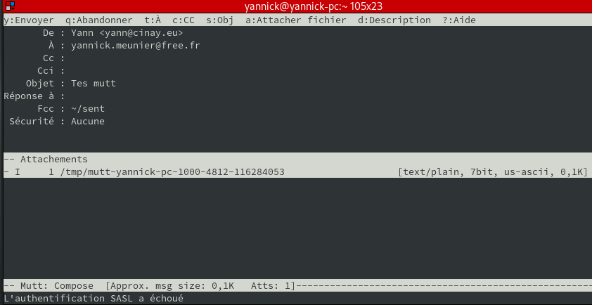

+++
title = 'Mutt, client de messagerie rapide et hautement configurable'
date = 2020-03-29 00:00:00 +0100
categories = ['messagerie']
+++
## Mutt pour un compte de messagerie

*Mutt est connu pour être un client de messagerie rapide et hautement configurable, et comme il est basé sur du texte, il est idéal pour vérifier rapidement les e-mails via SSH.*

### Installation mutt

    sudo pacman -S mutt  # archlinux

### Configuration de mutt

1. Le fichier de configuration de mutt se trouve dans le répertoire de base de chaque utilisateur sous la forme **~/.muttrc**  
Voici un exemple de configuration pour le fichier .muttrc.C'est tout ce dont vous avez besoin pour que mutt soit opérationnel.

    nano ~/.muttrc

```
 # À propos de moi
 set from = "user@domain.com"
 set realname = "Firstname Lastname"

 # Mes informations d'identification
 set smtp_url = "smtp://user@domain.com@smtp.domain.com:587/"
 set smtp_pass = "mot de passe"
 set imap_user = "user@domain.com"
 set imap_pass = "mot de passe"

 # Mes boîtes aux lettres
 set folder = "imaps://imap.domain.com:993"
 # set folder = "imaps://user@imap.domain.com:993"  # plusieurs utilisateurs dans le domaine
 set spoolfile = "+ INBOX"


 # Où mettre les trucs
 set header_cache = "~/.mutt/cache/headers"
 set message_cachedir = "~/.mutt/cache/bodies"
 set certificate_file = "~/.mutt/certificates"

 # Etc
 set mail_check = 30
 set move = no
 set imap_keepalive = 900
 set sort = threads
 set editor = "nano"

 # Bootstrap GnuPG
 # source ~/.mutt/gpg.rc 
```

2. Une fois la configuration terminée, créez le répertoire de cache.

  # mkdir -p ~/.mutt/cache 

Vérifier

Pour vérifier si tout est correctement configuré, envoyez un e-mail de test à partir du serveur.

`echo "" |  mutt -s "sujet" -i body.txt destinataire@example.com -a attachment.txt`  

* -s utilisé pour spécifier l'objet du courrier.
* -i utilisé pour spécifier le fichier contenant le corps du message.
* -a utilisé pour spécifier le fichier joint. 

Quelques autres options couramment utilisées avec mutt sont:

* -b utilisé pour ajouter l'adresse Cci.
* -c utilisé pour ajouter l'adresse Cc.
* -e si vous souhaitez spécifier l'adresse de l'expéditeur (autre chose que par défaut). 

### Les mots de passe

Il peut être intéressant de "cacher" les mots de passe  

Créer un répertoire et le fichier qui contiendra le mot de passe

    mkdir -p ~/Private/mdp/mutt
    touch ~/Private/mdp/mutt/user@domain.com # qui contiendra le mot de passe
    chmod 600 ~/Private/mdp/mutt/user@domain.com

Modifier le fichier **~/.muttrc**

en -

```
 set smtp_pass = "mot de passe"
 set imap_pass = "mot de passe"
```

en +

```
 set smtp_pass = "`cat ~/Private/mdp/mutt/user@domain.com`"
 set imap_pass = "`cat ~/Private/mdp/mutt/user@domain.com`"
```

## Comment configurer plusieurs comptes avec le client de messagerie [Mutt](http://www.mutt.org/)

* [How to set up multiple accounts with Mutt E-mail Client (original en)](https://gist.github.com/miguelmota/9456162)
* *Voir [article de Christoph Berg](http://www.df7cb.de/blog/2010/Using_multiple_IMAP_accounts_with_Mutt.html)*

### Instructions

Répertoires et fichiers

```bash
~/
|── Private/.mutt/
|   ├── account.ouestline.net.ouest
|   ├── account.cinay.eu.yann
|   ├── ouestline.net.ouest/
|   └── cinay.eu.yann/
└── .muttrc
```

Création répertoire

    mkdir -p ~/Private/.mutt/cache

### Configuration Mutt :  `~/.muttrc`

```bash
# dossier hooks
folder-hook 'account.ouestline.net.ouest' 'source ~/Private/.mutt/account.ouestline.net.ouest'
folder-hook 'account.cinay.eu.yann' 'source ~/Private/.mutt/account.cinay.eu.yann'

# Default account
source ~/Private/.mutt/account.ouestline.net.ouest         

# Macros for switching accounts
macro index <f2> '<sync-mailbox><enter-command>source ~/Private/.mutt/account.ouestline.net.ouest<enter><change-folder>!<enter>'
macro index <f3> '<sync-mailbox><enter-command>source ~/Private/.mutt/account.cinay.eu.yann<enter><change-folder>!<enter>'

# Raccourci pour récupérer le courrier
bind index G imap-fetch-mail
```

### Compte ouestline.net 

    ~/Private/.mutt/account.ouestline.net.ouest

```bash
set imap_user = "ouest@ouestline.net"                       
set imap_pass = '"Q>),2_Cf8o&HQj!'                                   
set smtp_url = "smtp://ouest@ouestline.net:587/"       
set smtp_pass = '"Q>),2_Cf8o&HQj!'                                    
set from = "ouest@ouestline.net"                            
set realname = "Ouest"                                  
set folder = "imaps://ouestline.net:993"                     
set spoolfile = "+INBOX"                                      
set postponed="=Drafts"
set header_cache = ~/Private/.mutt/ouestline.net.ouest/cache/headers            
set message_cachedir = ~/Private/.mutt/ouestline.net.ouest/cache/bodies         
set certificate_file = ~/Private/.mutt/ouestline.net.ouest/certificates         
```

### Compte cinay.eu

    ~/Private/.mutt/account.cinay.eu.yann

```bash
set ssl_starttls=yes
set ssl_force_tls=yes

set imap_user = "yann@cinay.eu"                       
set imap_pass = "bkc86s6xMV"                                    
set smtp_url = "smtp://yann@cinay.eu:587/"       
set smtp_pass = "bkc86s6xMV"                                    
set from = "yann@cinay.eu"                            
set realname = "Yann"                                  
set folder = "imaps://cinay.eu:993"                     
set spoolfile = "+INBOX"                                      
set postponed="=Drafts"
set header_cache = ~/Private/.mutt/cinay.eu.yann/cache/headers            
set message_cachedir = ~/Private/.mutt/cinay.eu.yann/cache/bodies         
set certificate_file = ~/Private/.mutt/cinay.eu.yann/certificates         
```


### Erreur et correction 

Sur le compte cinay.eu

{:width="600"}  
authentification SASL a échoué

**Dovecot - Authentifier sans la partie domaine de l'adresse électronique**  
Avec les paramètres par défaut, le client doit utiliser l'adresse électronique complète comme nom d'utilisateur pour la connexion POP3/IMAP/SMTP/webmail. Si vous souhaitez vous connecter sans la partie nom de domaine dans l'adresse électronique,ouvrir le fichier de configuration de Dovecot **/etc/dovecot/dovecot.conf** (Linux/OpenBSD) ou /usr/local/etc/dovecot/dovecot.conf (FreeBSD), trouvez le paramètre `auth_default_realm`, définissez le nom de domaine que vous souhaitez autoriser à l'utilisateur à se connecter sans la partie nom de domaine dans l'adresse électronique. 

	auth_default_realm = cinay.eu

>Modification à effectuer sur le serveur de messagerie cinay.eu

## Liens

### [Configuration de mutt](https://desfontain.es/blog/client-mail-3-mutt.html)

### [Configuration de mutt - supplément](https://desfontain.es/blog/client-mail-3bis-mutt.html)