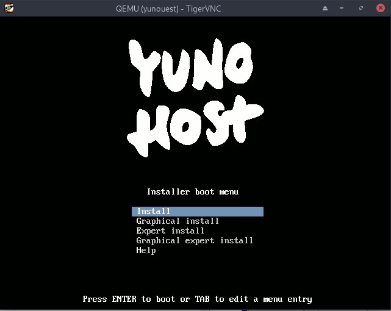
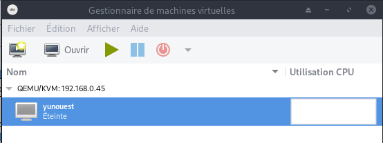
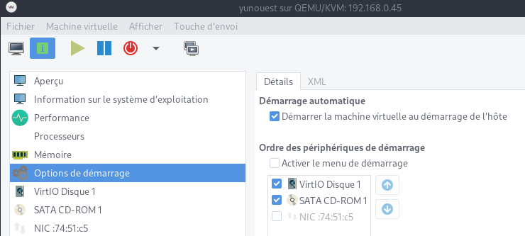
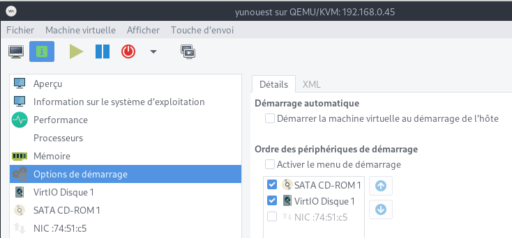
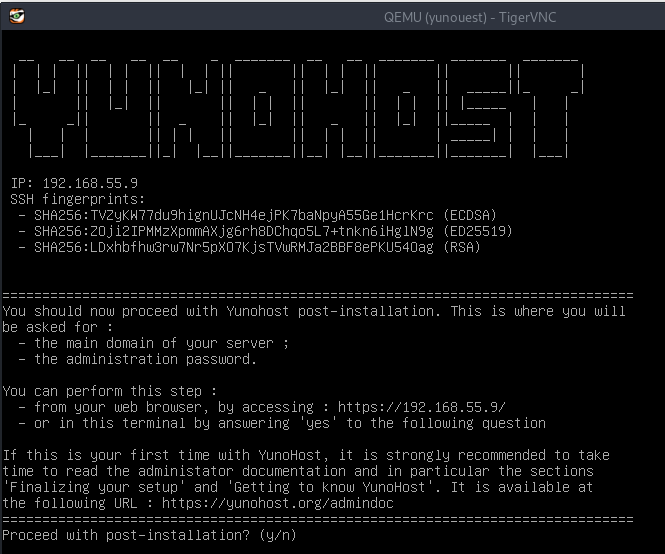
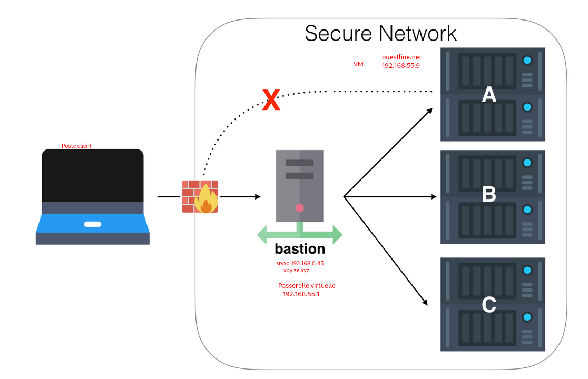
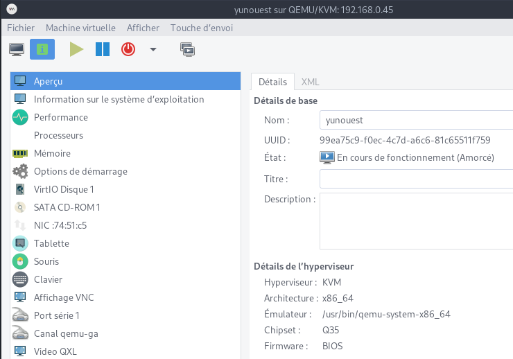
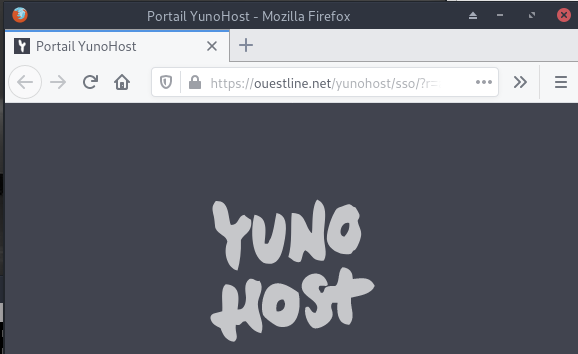
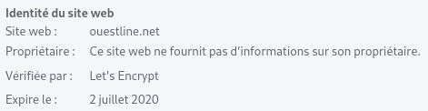

+++
title = 'KVM/QEMU - Virtualisation vmserveur.tld  yunohost sur srvxo hoteserveur.tld'
date = 2020-04-03 00:00:00 +0100
categories = ['virtuel']
+++
# Virtualisation linux KVM/QEMU

{:width="80"}   

* [How To Install KVM Hypervisor on Debian 10 (Buster)](https://computingforgeeks.com/how-to-install-kvm-virtualization-on-debian/)
* [Installing KVM on Debian 10](https://linuxhint.com/install_kvm_debian_10/)
* [VirtualNetworking (libvirt virsh)](https://wiki.libvirt.org/page/VirtualNetworking)
* [Qemu (archlinux)](https://wiki.archlinux.fr/Qemu)
* [La Gestion réseau dans une machine virtuelle](https://chrtophe.developpez.com/tutoriels/gestion-reseau-machine-virtuelle/#L4-2-2)

## Prérequis

* <u>Poste linux</u> avec tous les utilitaires graphiques QEMU/KVM
    * Voir [KVM/QEMU (virtualisation linux),Virtual Machine Manager (VMM),virsh , montage disque VDI,etc...](/posts/KVM-QEMU-virtualisation-linux-Virtual-Machine-Manager-VMM-virsh-montage-disque-VDI/)
* <u>Serveur hoteserveur.tld</u> sur lequel les vm vont être lancées
    * Voir [Serveur srvxo Debian10 hoteserveur.tld](404/) 
* <font color="red">**A MODIFIER SUIVANT VOTRE CONFIGURATION**</font>
    * Adresses IP publiques et domaines 
        * IP Publique Box IPV4 : <font color="red">**79.45.252.154**</font>  
        * IP Publique Box IPV6 : <font color="red">**2bef:a51:ced9:fc3::**</font>  
        * Serveur hôte : <font color="red">**hoteserveur.tld**</font>   
        * Virtual Machine : <font color="red">**vmserveur.tld**</font>  

## 1 - Terminal serveur

### KVM supporté par le CPU ?

Exécutez la commande *egrep* suivante pour vérifier que **Intel VMX** ou **AMD SVM** est supporté sur votre CPU 

    egrep --color 'vmx|svm' /proc/cpuinfo

vmx (Intel) ou svm (Amd) doit apparaître d'une autre couleur dans le résultat 

### Installer KVM/QEMU sur le serveur

Serveur hoteserveur.tld (srvxo 192.168.0.45)

On utilise ssh pour se connecter au serveur  
Installation, exécuter la commande suivante

    sudo apt install qemu-kvm libvirt-clients libvirt-daemon-system bridge-utils libguestfs-tools genisoimage virtinst libosinfo-bin

Chargez et activez le module vhost_net

    sudo modprobe vhost_net
    lsmod | grep vhost

```
vhost_net              24576  0
tun                    49152  1 vhost_net
vhost                  49152  1 vhost_net
tap                    28672  1 vhost_net
```

Vérifier si le service **libvirtd** est lancé et activé (enabled)

    sudo systemctl status libvirtd

```
● libvirtd.service - Virtualization daemon
   Loaded: loaded (/lib/systemd/system/libvirtd.service; enabled; vendor preset: enabled)
   Active: active (running) since Thu 2019-12-12 11:28:02 CET; 2 days ago
     Docs: man:libvirtd(8)
           https://libvirt.org
 Main PID: 759 (libvirtd)
    Tasks: 17 (limit: 32768)
   Memory: 34.7M
   CGroup: /system.slice/libvirtd.service
           └─759 /usr/sbin/libvirtd

déc. 12 11:28:00 hoteserveur.tld systemd[1]: Starting Virtualization daemon...
déc. 12 11:28:02 hoteserveur.tld systemd[1]: Started Virtualization daemon.
```

### Ajout utilisateur au groupe libvirt

Si vous voulez que l'utilisateur normal/régulier puisse gérer les machines virtuelles. Ajouter l'utilisateur $USER à libvirt et libvirt-qemu en utilisant la commande *usermod*

    sudo adduser $USER libvirt
    sudo adduser $USER libvirt-qemu

Recharger l'adhésion à un groupe avec l'aide de la commande *newgrp*

    newgrp libvirt
    newgrp libvirt-qemu

Vérifiez votre appartenance à un groupe à l'aide de la commande *id*

    $ id

```
gid=64055(libvirt-qemu) groupes=64055(libvirt-qemu),118(libvirt)
```

Veuillez noter que vous devez utiliser une des commandes suivantes pour vous connecter au serveur KVM

    virsh --connect qemu:///system

```
Welcome to virsh, the virtualization interactive terminal.

Type:  'help' for help with commands
       'quit' to quit

virsh # 
```

    virsh --connect qemu:///system list --all  # avec la commande list par exemple

### Réseau par défaut

Il n'est pas actif

    sudo virsh net-list --all

```
 Name      State      Autostart   Persistent
----------------------------------------------
 default   inactive   no          yes
```

Editer et modifier la configuration par défaut

    sudo virsh net-edit default

```
<network>
  <name>default</name>
  <uuid>81e35158-b288-46bb-9536-53b0f97d1748</uuid>
  <forward mode='nat'/>
  <bridge name='virbr0' stp='on' delay='0'/>
  <mac address='52:54:00:06:87:ba'/>
  <ip address='192.168.55.1' netmask='255.255.255.0'>
    <dhcp>
      <range start='192.168.55.2' end='192.168.55.10'/>
    </dhcp>
  </ip>
</network>
```

Avant la création d'une machine virtuelle, le réseau doit être actif

    sudo virsh net-start default    # virsh net-autostart default

Configurer le réseau pour un lancement au démarrage du serveur

    sudo virsh net-autostart default    # Network default marked as autostarted

Vérifications

    sudo virsh net-list --all

```
 Name      State    Autostart   Persistent
--------------------------------------------
 default   active   yes         yes
```

    ip a

```
[...]
3: virbr0: <NO-CARRIER,BROADCAST,MULTICAST,UP> mtu 1500 qdisc noqueue state DOWN group default qlen 1000
    link/ether 52:54:00:06:87:ba brd ff:ff:ff:ff:ff:ff
    inet 192.168.55.1/24 brd 192.168.55.255 scope global virbr0
       valid_lft forever preferred_lft forever
4: virbr0-nic: <BROADCAST,MULTICAST> mtu 1500 qdisc pfifo_fast master virbr0 state DOWN group default qlen 1000
    link/ether 52:54:00:06:87:ba brd ff:ff:ff:ff:ff:ff
```

Arrêt du réseau

    sudo virsh net-destroy default  # Network default destroyed

Pas de lancement au démarrage

    sudo virsh net-autostart default --disable   # Network default unmarked as autostarted


### Création machine virtuelle "yunohost" 

Image iso **yunohost-stretch-3.6.4.6-amd64-stable.iso** dans le dossier **/srv/data/virtuel/iso/**  

Virtuel **yunouest**  
Linux Debian 9  
Ram 4 Go
Disque 12 Go SSD   /srv/data/virtuel/vm/yunouest.img  
cdrom /srv/data/virtuel/iso/yunohost-stretch-3.6.4.6-amd64-stable.iso  
boot cdrom,hd  

Ouvrir un terminal en mode su sur hoteserveur.tld copier/coller ce qui suit puis entrée

```
sudo virt-install --name yunouest \
--os-type linux \
--os-variant debian9 \
--ram=4096 \
--disk /srv/data/virtuel/vm/yunouest.img,device=disk,bus=virtio,size=12,format=qcow2 \
--graphics vnc,listen=0.0.0.0 \
--noautoconsole \
--hvm \
--cdrom /srv/data/virtuel/iso/yunohost-stretch-3.6.4.6-amd64-stable.iso \
--boot cdrom,hd
```

## 2 - Poste linux 

### Poursuite installation "yunohost" via VNC/SSH

Après quelques minutes , on poursuit l'installation


     ssh -p 55035 -i /home/yannick/.ssh/vbox-srvbust-ed25519 -L 55444:localhost:5900 -N -f -l xoyi 192.168.0.45
     vncviewer localhost:55444


{:width="600"}  
Lancement installation  

### Virtual Manager 

Saisir **Alt F2** sur poste client linux , puis saisir: 

    virt-manager -c 'qemu+ssh://xoyi@192.168.0.45:55035/system?keyfile=/home/yannick/.ssh/vbox-srvbust-ed25519'

{:width="400"}   
Démarrer la machine

{:width="600"}   
Démarrage de la machine virtuelle au démarrage de l'hôte

{:width="600"}   
Mettre le disque dur en premier au boot 
Arrêter puis redémarrer la machine

### Connexion VNC/SSH

     ssh -p 55035 -i /home/yannick/.ssh/vbox-srvbust-ed25519 -L 55444:localhost:5900 -N -f -l xoyi 192.168.0.45
     vncviewer localhost:55444

{:width="600"}   
Lancer la **post-installation**  
domaine : **vmserveur.tld**  
Mot de passe **admin** : *****

Après reboot , relever l'adresses ip : 192.168.55.9  

NE PAS OUBLIER de tuer la tâche après fermeture du "viewer" VNC

    kill $(pidof -s ssh)

## 3 - Terminal serveur

### Connexion SSH (avec clés) entre le serveur hoteserveur.tld et la vm "yunohost" 

Depuis le terminal hoteserveur.tld , on se connecte SSH sur la VM 192.168.55.9

    ssh admin@192.168.55.9

{:width="50px"}**connexion avec clé**  

<u>**hoteserveur.tld**</u>  
Générer une paire de clé curve25519-sha256 (ECDH avec Curve25519 et SHA2) nommé **vm-ouestline** pour une liaison SSH avec le serveur KVM.  

    ssh-keygen -t ed25519 -o -a 100 -f ~/.ssh/vm-ouestline   

Envoyer la clé publique sur la VM   

    scp ~/.ssh/vm-ouestline.pub admin@192.168.55.9:/home/admin/

<u>**VM 192.168.55.9 (vmserveur.tld)**</u>  
On se connecte  

	ssh admin@192.168.55.9
	
Copier le contenu de la clé publique dans /home/$USER/.ssh/authorized_keys  

	cd ~
	
Sur le KVM ,créer un dossier .ssh  

```
mkdir .ssh
cat /home/$USER/vm-ouestline.pub >> /home/$USER/.ssh/authorized_keys
```

et donner les droits  

	chmod 600 /home/$USER/.ssh/authorized_keys
	
effacer le fichier de la clé  

	rm /home/$USER/vm-ouestline.pub
	
Modifier la configuration serveur SSH  

	sudo nano /etc/ssh/sshd_config

Modifier

```
#Port = 22               # si changement de port, oter le commentaire (#)           
PermitRootLogin no
PasswordAuthentication no
```

<u>session SSH ne se termine pas correctement lors d'un "reboot" à distance</u>  
Si vous tentez de **redémarrer/éteindre** une machine distance par **ssh**, vous pourriez constater que votre session ne se termine pas correctement, vous laissant avec un terminal inactif jusqu'à l'expiration d'un long délai d'inactivité. Il existe un bogue 751636 à ce sujet. Pour l'instant, la solution de contournement à ce problème est d'installer :  

      sudo apt install libpam-systemd
      
cela terminera la session ssh avant que le réseau ne tombe.  
Veuillez noter qu'il est nécessaire que PAM soit activé dans sshd.  

**UNIQUEMENT si changement de port**
Ouvrir le port 55040 et fermer le port 22 

    sudo yunohost firewall allow TCP 55040
    sudo yunohost firewall disallow TCP 22
    
Relancer openSSH  

    sudo systemctl restart sshd

<u>**hoteserveur.tld**</u>  
Accès depuis srvxo (192.168.0.45) avec la clé privée  

    ssh -i ~/.ssh/vm-ouestline admin@192.168.55.9

## 4 - Poste linux

### Connexion ssh entre le "Poste linux" et la vm "yunohost  via proxy serveur hoteserveur.tld 

[Effectuer plusieurs sauts SSH avec la configuration SSH et un hôte de saut-Lien HS](/files//Perform multiple SSH hops with SSH config and a jump host/)


{:width="700"}   
**Poste client linux --> Bastion (hoteserveur.tld 192.168.0.45) --> VM vmserveur.tld 192.168.55.9**

**Poste client**  
1- Il faut copier la clé privée d'accès au VM depuis hoteserveur.tld (~/.ssh/vm-ouestline) dans le dossier **~/.ssh/** du poste client avec un autre nom ( vm-proxy-ouestline)

    cat >> ~/.ssh/vm-proxy-ouestline

Copier/coller le contenu du fichier du fichier de clé privée (fichier ~/.ssh/vm-ouestline de la machine hoteserveur.tld ) dans ce terminal, et presser [Ctrl]+[D] pour valider.

Modifier les droits

    chmod 600 ~/.ssh/vm-proxy-ouestline
 
2- Modifier ou créer la configuration SSH **~/.ssh/config** du poste client (PC1 , Portable,etc...)

```
Host bastion
  Hostname hoteserveur.tld
  User xoyi
  IdentityFile ~/.ssh/vbox-srvbust-ed25519
  Port 55035

Host vmyuno
  Hostname 192.168.55.9
  User admin
  IdentityFile ~/.ssh/vm-proxy-ouestline
  ProxyCommand ssh bastion -W %h:%p
```

La connexion du poste client vers la vm se fera via le proxy bastion (xoxize.xyz) avec la commande suivante :

    sshm vmyuno

La ligne de commande pour un proxy ssh

```
----------------          ------------------           -------------------
| Poste client |          | Proxy SSH      |           | Destinataire    |
|   Linux      |<-------->| hoteserveur.tld|<--------->| vm vmserveur.tld|
|              |          | 192.168.0.45   |           | 192.168.55.9    |
----------------          ------------------           -------------------
```

Syntaxe

    ssh -o ProxyCommand="ssh -W %h:%p userprox@proxy.tld"  userdest@destinataire.tld

La commande complète avec les clés

    ssh -o ProxyCommand="ssh -W %h:%p -p 55035 -i /home/yannick/.ssh/vbox-srvbust-ed25519 xoyi@192.168.0.45" -i /home/yannick/.ssh/vm-proxy-ouestline admin@192.168.55.9


### VMM (Virtual Machine Manager, gestion graphique des vm)

Ouvrir "Virtual Machine Manager" , pour afficher les information sur la vm "yunouest" 

{:width="600"}  

Se connecter SSH sur vmserveur.tld directement depuis lun terminal du "poste linux"

    ssh vmyuno

## Réseau

[KVM/QEMU - Réseau IPV4/IPV6 accessible depuis l'internet via box free.fr](404/) 

## Partage de dossiers/fichiers entre le l'hôte et la vm

[KVM/QEMU - Partage de répertoires avec des machines virtuelles et libvirt](/posts/KVM_QEMU-Partage-de-repertoires-avec-des-machines-virtuelles-et-libvirt/)

---

# Yunohost

{:width="50px"}

Connexion ssh et passage en su

## Système

### DNS

Le domaine **vmserveur.tld** pointe sur l'adresse IPV6 **2bef:a51:ced9:fc3::3**  

{:width="30"} 

Ajout MX ,spf,dmarc et dkim (gestion Mail)  
Ajout CAA pour lets't encrypt  

Les infos pour la mise à jour DNS

    yunohost domain dns-conf vmserveur.tld

```
Info : Cette page montre la configuration *recommandée*. Elle ne configure *pas* le DNS pour vous. Il est de votre responsabilité que de configurer votre zone DNS chez votre fournisseur/registrar DNS avec cette recommandation.
; Basic ipv4/ipv6 records
@ 3600 IN A 79.45.252.154
* 3600 IN A 79.45.252.154
@ 3600 IN AAAA 2bef:a51:ced9:fc3::3
* 3600 IN AAAA 2bef:a51:ced9:fc3::3

; XMPP
_xmpp-client._tcp 3600 IN SRV 0 5 5222 vmserveur.tld.
_xmpp-server._tcp 3600 IN SRV 0 5 5269 vmserveur.tld.
muc 3600 IN CNAME @
pubsub 3600 IN CNAME @
vjud 3600 IN CNAME @

; Mail
@ 3600 IN MX 10 vmserveur.tld.
@ 3600 IN TXT "v=spf1 a mx ip4:79.45.252.154 ip6:2bef:a51:ced9:fc3::3 -all"
mail._domainkey 3600 IN TXT "v=DKIM1; h=sha256; k=rsa; p=MIGfMA0GCSqGSIb3DQEBAQUAA4GNADCBiQKBgQC/mZh/yIqQDzO3eAqD7AMA6FPzhOqlw+VEbkPTvrV0vS5qZseJ9gtefgKQi+gj63eU4WUjxmMacX+X25ERPRxkdnDR1P13IIy/ujz0nzfg6wK46Dn/wp86L2P4nV77WT8lXVP0yf+b21ZdqKMI9JhKEwqlwLiFW9nXhQrRMRlfqQIDAQAB"
_dmarc 3600 IN TXT "v=DMARC1; p=none"

; Extra
@ 3600 IN CAA 128 issue "letsencrypt.org"
```

**DNS OVH** , les ajouts

```
$TTL 3600
@	IN SOA dns111.ovh.net. tech.ovh.net. (2020040300 86400 3600 3600000 300)
                       IN NS     ns111.ovh.net.
                       IN NS     dns111.ovh.net.
                       IN MX     10 vmserveur.tld.
                       IN AAAA   2bef:a51:ced9:fc3::3
                       IN CAA    128 issue "letsencrypt.org"
                   600 IN TXT    "v=spf1 mx ip4:79.45.252.154 ip6:2bef:a51:ced9:fc3::3 -all"
*                      IN CNAME  vmserveur.tld.
_dmarc                 IN TXT    "v=DMARC1;p=none;"
mail._domainkey        IN TXT    ( "v=DKIM1;h=sha256;k=rsa;p=MIGfMA0GCSqGSIb3DQEBAQUAA4GNADCBiQKBgQC/mZh/yIqQDzO3eAqD7AMA6FPzhOqlw+VEbkPTvrV0vS5qZseJ9gtefgKQi+gj63eU4WUjxmMacX+X25ERPRxkdnDR1P13IIy/ujz0nzfg6wK46Dn/wp86L2P4nV77WT8lXVP0yf+b21ZdqKMI9JhKEwqlwLiFW9nXhQrRMRlfqQIDAQAB;" )
```

### Créer un utilisateur 

    yunohost user create ouest

```
fullname: ouest line
mail: ouest@vmserveur.tld
username: ouest
```

### Bash ,motd

**Affichage informations**  

Exécuter un fichier *utilisateur* nommé **$HOME/.ssh/rc** si *présent (NON PRESENT)*  
Pour *tous les utilisateurs* exécuter un fichier nommé **/etc/ssh/sshrc** si *présent (NON PRESENT)*  
Installer les utilitaires *curl jq figlet tmux*  

    sudo apt install curl jq figlet tmux tree    # outils supplémentaires

Créer le fichier **~/ssh_rc_bash** 

```
#!/bin/bash

get_infos() {
    seconds="$(< /proc/uptime)"
    seconds="${seconds/.*}"
    days="$((seconds / 60 / 60 / 24)) jour(s)"
    hours="$((seconds / 60 / 60 % 24)) heure(s)"
    mins="$((seconds / 60 % 60)) minute(s)"
    
    # Remove plural if < 2.
    ((${days/ *} == 1))  && days="${days/s}"
    ((${hours/ *} == 1)) && hours="${hours/s}"
    ((${mins/ *} == 1))  && mins="${mins/s}"
    
    # Hide empty fields.
    ((${days/ *} == 0))  && unset days
    ((${hours/ *} == 0)) && unset hours
    ((${mins/ *} == 0))  && unset mins
    
    uptime="${days:+$days, }${hours:+$hours, }${mins}"
    uptime="${uptime%', '}"
    uptime="${uptime:-${seconds} seconds}"

   if [[ -f "/sys/devices/virtual/dmi/id/board_vendor" ||
                    -f "/sys/devices/virtual/dmi/id/board_name" ]]; then
	model="$(< /sys/devices/virtual/dmi/id/board_vendor)"
	model+=" $(< /sys/devices/virtual/dmi/id/board_name)"
   fi

   if [[ -f "/sys/devices/virtual/dmi/id/bios_vendor" ||
                    -f "/sys/devices/virtual/dmi/id/bios_version" ]]; then
        bios="$(< /sys/devices/virtual/dmi/id/bios_vendor)"
        bios+=" $(< /sys/devices/virtual/dmi/id/bios_version)"
        bios+=" $(< /sys/devices/virtual/dmi/id/bios_date)"
   fi
}

#clear
PROCCOUNT=`ps -Afl | wc -l`  		# nombre de lignes
PROCCOUNT=`expr $PROCCOUNT - 5`		# on ote les non concernées
GROUPZ=`users`
ipinfo=$(curl -s ipinfo.io) 		# info localisation format json
#ipinfo=$(curl -s iplocality.com) 		# info localisation format json
publicip=$(echo $ipinfo | jq -r '.ip')  # extraction des données , installer préalablement "jq"
ville=$(echo $ipinfo | jq -r '.city')
pays=$(echo $ipinfo | jq -r '.country')
cpuname=`cat /proc/cpuinfo |grep 'model name' | cut -d: -f2 | sed -n 1p`
iplink=`ip link show |grep -m 1 "2:" | awk '{print $2}' | cut -d: -f1`

if [[ $GROUPZ == *irc* ]]; then
ENDSESSION=`cat /etc/security/limits.conf | grep "@irc" | grep maxlogins | awk {'print $4'}`
PRIVLAGED="IRC Account"
else
ENDSESSION="Unlimited"
PRIVLAGED="Regular User"
fi
get_infos
logo=$(figlet "`hostname --fqdn`")
meteo=$(curl fr.wttr.in/$ville?0)
lvm_entet="Sys. fichiers\tTaille\tUtilisé\tDispo\tUti%\tMonté sur"
lvm=$(df -h |grep mapper)    # les montages lvm
sdx=$(df -h |grep "/dev/sd") # les montages /dev/sd
distri=$(lsb_release -sd)
distri+=" $(uname -m)"

echo -e "
\e[1;31m$logo
\e[1;35m   \e[1;37mHostname \e[1;35m= \e[1;32m`hostname`
\e[1;35m \e[1;37mWired IpV4 \e[1;35m= \e[1;32m`ip addr show $iplink | grep 'inet\b' | awk '{print $2}' | cut -d/ -f1`
\e[1;35m \e[1;37mWired IpV6 \e[1;35m= \e[1;32m`ip addr show $iplink | grep -E 'inet6' |grep -E 'scope link' | awk '{print $2}' | cut -d/ -f1`
\e[1;35m     \e[1;37mKernel \e[1;35m= \e[1;32m`uname -r`
\e[1;35m    \e[1;37mDistrib \e[1;35m= \e[1;32m$distri
\e[1;35m     \e[1;37mUptime \e[1;35m= \e[1;32m`echo $uptime`
\e[1;35m       \e[1;37mBios \e[1;35m= \e[1;32m`echo $bios`
\e[1;35m      \e[1;37mBoard \e[1;35m= \e[1;32m`echo $model`
\e[1;35m        \e[1;37mCPU \e[1;35m= \e[1;32m`echo $cpuname`
\e[1;35m \e[1;37mMemory Use \e[1;35m= \e[1;32m`free -m | awk 'NR==2{printf "%s/%sMB (%.2f%%)\n", $3,$2,$3*100/$2 }'`
\e[1;35m   \e[1;37mUsername \e[1;35m= \e[1;32m`whoami`
\e[1;35m   \e[1;37mSessions \e[1;35m= \e[1;32m`who | grep $USER | wc -l`
\e[1;35m\e[1;37mPublic IpV4 \e[1;35m= \e[1;32m`echo $publicip`
\e[1;35m\e[1;37mPublic IpV6 \e[1;35m= \e[1;32m`ip addr show $iplink | grep -m 1 'inet6\b'  | awk '{print $2}' | cut -d/ -f1`
\e[1;35m\e[1;96m$lvm_entet\e[1;35m\e[1;49m
\e[1;35m\e[1;33m$sdx
\e[1;35m\e[1;33m$lvm
\e[1;35m\e[1;32m$meteo
\e[1;0m
"
```

Le rendre exécutable

    chmod +x ~/ssh_rc_bash

Recréer motd  

    sudo rm /etc/motd && sudo nano /etc/motd  

```
 __   __ __  __                                         _     
 \ \ / /|  \/  |  _  _  _  _  _ _   ___  _  _  ___  ___| |_   
  \ V / | |\/| | | || || || || ' \ / _ \| || |/ -_)(_-<|  _|  
   \_/  |_|  |_|  \_, | \_,_||_||_|\___/ \_,_|\___|/__/ \__|  
  ___  _  _  ___  |__/ |_ | |(_) _ _   ___     _ _   ___ | |_ 
 / _ \| || |/ -_)(_-<|  _|| || || ' \ / -_) _ | ' \ / -_)|  _|
 \___/ \_,_|\___|/__/ \__||_||_||_||_|\___|(_)|_||_|\___| \__|

```

Déconnexion puis connexion  


### Certificats SSL letsencrypt (acme)

{:width="100"}  

On ne peut valider pas les certificats par la commande yunohost car elle utilise le lien publique IPV4 qui n'existe pas var le domaine est seulement accessible en IPV6

    yunohost domain cert-install

```
Info : Now attempting install of certificate for domain vmserveur.tld!
Erreur : Aucun enregistrement DNS 'A' n’a été trouvé pour vmserveur.tld. Vous devez faire pointer votre nom de domaine vers votre machine pour être en mesure d’installer un certificat Let’s Encrypt ! (Si vous savez ce que vous faites, utilisez --no-checks pour désactiver ces contrôles)
```

>l'accès est uniquement IPV6 !!!

On utilise acme qui installe les certificats DNS via une API OVH

Prérequis

    sudo apt install socat # prérequis

Installation gestionnaire des certificats Let's Encrypt

```
cd ~
git clone https://github.com/Neilpang/acme.sh.git
cd acme.sh
./acme.sh --install 
```

>Se déconnecter puis se reconnecter pou la prise en compte

Se connecter sur l'api OVH pour les paramètres (clé et secret)

    export OVH_AK="votre application key"
    export OVH_AS="votre application secret"

Domaine ouestline.xyz

```
acme.sh --dns dns_ovh --issue --keylength ec-384 -d 'vmserveur.tld' -d '*.vmserveur.tld'
```

Les certificats

```
[vendredi 3 avril 2020, 14:21:51 (UTC+0200)] Your cert is in  /home/admin/.acme.sh/vmserveur.tld_ecc/vmserveur.tld.cer 
[vendredi 3 avril 2020, 14:21:51 (UTC+0200)] Your cert key is in  /home/admin/.acme.sh/vmserveur.tld_ecc/vmserveur.tld.key 
[vendredi 3 avril 2020, 14:21:51 (UTC+0200)] The intermediate CA cert is in  /home/admin/.acme.sh/vmserveur.tld_ecc/ca.cer 
[vendredi 3 avril 2020, 14:21:51 (UTC+0200)] And the full chain certs is there:  /home/admin/.acme.sh/vmserveur.tld_ecc/fullchain.cer 
```

On ne peut pas installer des certificats let's encrypt sans adresse IPV4 ,erreur  `Aucun enregistrement DNS 'A' n’a été trouvé pour vmserveur.tld`  
<u>Solution</u>  

Pour contourner le problème , on va créer un dossier de la forme **aaaammdd.hhmmss-letsencrypt** (en mode su),avec la date et heure du jour

	sudo mkdir -p /etc/yunohost/certs/vmserveur.tld-history/20200403.142000-letsencrypt

Puis on va créer les liens

Les liens pour les certificats

```
sudo ln -s /home/admin/.acme.sh/vmserveur.tld_ecc/vmserveur.tld.key /etc/yunohost/certs/vmserveur.tld-history/20200403.142000-letsencrypt/key.pem     # cert key
sudo ln -s /home/admin/.acme.sh/vmserveur.tld_ecc/fullchain.cer /etc/yunohost/certs/vmserveur.tld-history/20200403.142000-letsencrypt/crt.pem   # full chain certs
```

Enfin on va informer yunohost par un lien que l'on utilise des certificats let's encrypt

	sudo rm /etc/yunohost/certs/vmserveur.tld # efface le lien certificat non signé
	sudo ln -s /etc/yunohost/certs/vmserveur.tld-history/20200403.142000-letsencrypt /etc/yunohost/certs/vmserveur.tld # Création lien sur les certificats let's encrypt 


Structure yunohost pour les certificats

```
/etc/yunohost/certs/
/etc/yunohost/certs/
├── vmserveur.tld -> /etc/yunohost/certs/vmserveur.tld-history/20200403.142000-letsencrypt
├── vmserveur.tld-history
│   ├── 20200402.212217-selfsigned
│   │   ├── ca.pem -> /etc/ssl/certs/ca-yunohost_crt.pem
│   │   ├── crt.pem
│   │   ├── key.pem
│   │   └── openssl.cnf
│   └── 20200403.142000-letsencrypt
│       ├── crt.pem -> /home/admin/.acme.sh/vmserveur.tld_ecc/fullchain.cer
│       └── key.pem -> /home/admin/.acme.sh/vmserveur.tld_ecc/vmserveur.tld.key
└── yunohost.org
    ├── ca.pem
    ├── crt.pem
    └── key.pem
```

### SSL + Diffie-Hellmann + Entêtes 

{:width="60"}

Toutes les commandes se font en mode su

Générer Diffie-Hellman 

    openssl dhparam -out /etc/ssl/private/dh2048.pem -outform PEM -2 2048

Modification fichier de configuration **/etc/nginx/conf.d/vmserveur.tld.conf**

* Décommenter la ligne `ssl_dhparam /etc/ssl/private/dh2048.pem;` 

Le fichier **/etc/nginx/conf.d/vmserveur.tld.conf** après les modifications

```
map $http_upgrade $connection_upgrade {
    default upgrade;
    ''      close;
}

server {
    listen 80;
    listen [::]:80;
    server_name vmserveur.tld;

    access_by_lua_file /usr/share/ssowat/access.lua;

    include /etc/nginx/conf.d/vmserveur.tld.d/*.conf;

    location /yunohost/admin {
        return 301 https://$http_host$request_uri;
    }

    location /.well-known/autoconfig/mail/ {
        alias /var/www/.well-known/vmserveur.tld/autoconfig/mail/;
    }

    access_log /var/log/nginx/vmserveur.tld-access.log;
    error_log /var/log/nginx/vmserveur.tld-error.log;
}

server {
    listen 443 ssl http2;
    listen [::]:443 ssl http2;
    server_name vmserveur.tld;

    ssl_certificate /etc/yunohost/certs/vmserveur.tld/crt.pem;
    ssl_certificate_key /etc/yunohost/certs/vmserveur.tld/key.pem;
    ssl_session_timeout 5m;
    ssl_session_cache shared:SSL:50m;

    
    # As suggested by Mozilla : https://wiki.mozilla.org/Security/Server_Side_TLS and https://en.wikipedia.org/wiki/Curve25519
    ssl_ecdh_curve secp521r1:secp384r1:prime256v1;
    ssl_prefer_server_ciphers on;

    # Ciphers with intermediate compatibility
    # https://mozilla.github.io/server-side-tls/ssl-config-generator/?server=nginx-1.6.2&openssl=1.0.1t&hsts=yes&profile=intermediate
    ssl_protocols TLSv1 TLSv1.1 TLSv1.2;
    ssl_ciphers 'ECDHE-ECDSA-CHACHA20-POLY1305:ECDHE-RSA-CHACHA20-POLY1305:ECDHE-ECDSA-AES128-GCM-SHA256:ECDHE-RSA-AES128-GCM-SHA256:ECDHE-ECDSA-AES256-GCM-SHA384:ECDHE-RSA-AES256-GCM-SHA384:DHE-RSA-AES128-GCM-SHA256:DHE-RSA-AES256-GCM-SHA384:ECDHE-ECDSA-AES128-SHA256:ECDHE-RSA-AES128-SHA256:ECDHE-ECDSA-AES128-SHA:ECDHE-RSA-AES256-SHA384:ECDHE-RSA-AES128-SHA:ECDHE-ECDSA-AES256-SHA384:ECDHE-ECDSA-AES256-SHA:ECDHE-RSA-AES256-SHA:DHE-RSA-AES128-SHA256:DHE-RSA-AES128-SHA:DHE-RSA-AES256-SHA256:DHE-RSA-AES256-SHA:ECDHE-ECDSA-DES-CBC3-SHA:ECDHE-RSA-DES-CBC3-SHA:EDH-RSA-DES-CBC3-SHA:AES128-GCM-SHA256:AES256-GCM-SHA384:AES128-SHA256:AES256-SHA256:AES128-SHA:AES256-SHA:DES-CBC3-SHA:!DSS';

    # Uncomment the following directive after DH generation
    # > openssl dhparam -out /etc/ssl/private/dh2048.pem -outform PEM -2 2048
    ssl_dhparam /etc/ssl/private/dh2048.pem;
    

    # Follows the Web Security Directives from the Mozilla Dev Lab and the Mozilla Obervatory + Partners
    # https://wiki.mozilla.org/Security/Guidelines/Web_Security
    # https://observatory.mozilla.org/ 
    
    more_set_headers "Content-Security-Policy : upgrade-insecure-requests";
    more_set_headers "Content-Security-Policy-Report-Only : default-src https: data: 'unsafe-inline' 'unsafe-eval'";
    more_set_headers "X-Content-Type-Options : nosniff";
    more_set_headers "X-XSS-Protection : 1; mode=block";
    more_set_headers "X-Download-Options : noopen";
    more_set_headers "X-Permitted-Cross-Domain-Policies : none";
    more_set_headers "X-Frame-Options : SAMEORIGIN";


    # Disable gzip to protect against BREACH
    # Read https://trac.nginx.org/nginx/ticket/1720 (text/ cannot be disabled!)
    gzip off;

    access_by_lua_file /usr/share/ssowat/access.lua;

    include /etc/nginx/conf.d/vmserveur.tld.d/*.conf;

    include /etc/nginx/conf.d/yunohost_admin.conf.inc;
    include /etc/nginx/conf.d/yunohost_api.conf.inc;

    access_log /var/log/nginx/vmserveur.tld-access.log;
    error_log /var/log/nginx/vmserveur.tld-error.log;
```

Vérifier et relancer nginx

	nginx -t
	systemctl restart nginx

Vérifier ssl sur le lien https://vmserveur.tld

{:width="400"}  
{:width="400"}

### Ajouter un domaine

Il faut ajouter le domaine avec certificat auto signé

    yunohost domain add nc.vmserveur.tld

```
Attention : Le fichier de configuration '/etc/nginx/conf.d/vmserveur.tld.conf' a été modifié manuellement et ne sera pas mis à jour
Succès ! Le certificat auto-signé est maintenant installé pour le domaine « nc.vmserveur.tld »
Succès ! La configuration a été mise à jour pour 'postfix'
Attention : Le fichier de configuration '/etc/nginx/conf.d/vmserveur.tld.conf' a été modifié manuellement et ne sera pas mis à jour
Succès ! La configuration a été mise à jour pour 'dnsmasq'
Succès ! La configuration a été mise à jour pour 'metronome'
Succès ! Le domaine a été créé
```

**Yunohost erreur DNS A**  
On ne peut pas installer des certificats **let's encrypt** sans adresse IPV4 ,erreur 
<font color="red">**Aucun enregistrement DNS 'A' n’a été trouvé pour vmserveur.tld**</font>   

<u>**Solution**</u>  

Pour contourner le problème , on va créer un dossier de la forme **domaine-history/aaaammdd.hhmmss-letsencrypt** (en mode su),avec la date et heure du jour 

**Exemple**  
Créer un domaine **nc.vmserveur.tld** le 3 avril à 17h40  
Le dossier se nomme **nc.vmserveur.tld-history/20200403.165000-letsencrypt**  

en mode su , procédure semi auto

```bash
DOMAIN="nc.vmserveur.tld"
DATE="20200403"
HEURE="174000"
# Créer le dossier sur le système
mkdir -p /etc/yunohost/certs/$DOMAIN-history/$DATE.$HEURE-letsencrypt
# Les liens pour les certificats
#
# efface le lien certificat non signé si existant
rm -f /etc/yunohost/certs/$DOMAIN
# Création lien sur les certificats let's encrypt 
ln -s /etc/yunohost/certs/$DOMAIN-history/$DATE.$HEURE-letsencrypt /etc/yunohost/certs/$DOMAIN 
#
# créer les liens key et cert
# cert key
ln -s /home/admin/.acme.sh/vmserveur.tld_ecc/vmserveur.tld.key /etc/yunohost/certs/$DOMAIN-history/$DATE.$HEURE-letsencrypt/key.pem     
# full chain certs
ln -s /home/admin/.acme.sh/vmserveur.tld_ecc/fullchain.cer /etc/yunohost/certs/$DOMAIN-history/$DATE.$HEURE-letsencrypt/crt.pem   
#
# Vérification
tree /etc/yunohost/certs/$DOMAIN*
# 
yunohost domain list
```

## Applications

### Nextcloud

[YunoHost-Apps /nextcloud_ynh](https://github.com/YunoHost-apps/nextcloud_ynh)

Installation

    yunohost app install https://github.com/YunoHost-Apps/nextcloud_ynh

```
root@ouestline:/home/admin# yunohost app install https://github.com/YunoHost-Apps/nextcloud_ynh
Domaines disponibles :
- vmserveur.tld
- nc.vmserveur.tld
Choisissez un domaine pour Nextcloud (default: vmserveur.tld) : nc.vmserveur.tld
Choisissez un chemin pour Nextcloud (default: /nextcloud) : /
Liste des utilisateurs disponibles :
- ouest
Choisissez l'administrateur de Nextcloud (doit être un utilisateur YunoHost existant) : ouest
Accéder au dossier personnel des utilisateurs depuis Nextcloud ? [yes | no] (default: no) : yes
Info : Installation de l'application nextcloud …
[...]

Attention : warning: commands will be executed using /bin/sh
Attention : job 1 at Fri Apr  3 18:17:00 2020
Info : [#################+..] > Adding multimedia directories...
Attention : 2020-04-03 18:07:13 URL:https://codeload.github.com/YunoHost-Apps/yunohost.multimedia/tar.gz/v1.2 [15921] -> "v1.2.tar.gz" [1]
Info : [##################..] > Configuring log rotation...
Info : [##################+.] > Configuring fail2ban...
Info : [###################.] > Configuring SSOwat...
Attention : /!\ Packagers! This app is still using the skipped/protected/unprotected_uris/regex settings which are now obsolete and deprecated... Instead, you should use the new helpers 'ynh_permission_{create,urls,update,delete}' and the 'visitors' group to initialize the public/private access. Check out the documentation at the bottom of yunohost.org/groups_and_permissions to learn how to use the new permission mechanism.
Attention : /!\ Packagers! This app is still using the skipped/protected/unprotected_uris/regex settings which are now obsolete and deprecated... Instead, you should use the new helpers 'ynh_permission_{create,urls,update,delete}' and the 'visitors' group to initialize the public/private access. Check out the documentation at the bottom of yunohost.org/groups_and_permissions to learn how to use the new permission mechanism.
Info : [###################.] > Reloading nginx web server...
Info : [####################] > Installation of nextcloud completed
Succès ! Installation terminée

```

## Maintenance yunohost

### Nextcloud

```
 Avertissements de sécurité & configuration

Il est important pour la sécurité et la performance de votre instance que celle-ci soit correctement configurée. Afin de vous aider, votre instance Nextcloud effectue des vérifications automatiques. Pour de plus amples informations, veuillez consulter la documentation liée.
Il y a quelques avertissements concernant votre configuration.

    MySQL est utilisée comme base de données mais ne supporte pas les caractères codés sur 4 octets. Pour pouvoir manipuler les caractères sur 4 octets (comme les émoticônes) sans problème dans les noms de fichiers ou les commentaires par exemple, il est recommandé d'activer le support 4 octets dans MySQL. Pour plus de détails, lisez la page de documentation à ce sujet

Merci de consulter les guides d'installation ↗ et de vérifier les erreurs ou avertissements des logs.

Vérifier la sécurité de votre Nextcloud grâce à notre scan de sécurité ↗	
```

**Corrections MariaDb/nextcloud**

* [Enabling MySQL 4-byte support](https://docs.nextcloud.com/server/18/go.php?to=admin-mysql-utf8mb4) 

Ouvrir 2 terminaux sur le site    
Respecter l'ordre des opérations  

**&rarr; PREMIER TERMINAL**

mysql -uroot -p$(cat /etc/yunohost/mysql )

```
Welcome to the MariaDB monitor.  Commands end with ; or \g.
Your MariaDB connection id is 76
Server version: 10.1.44-MariaDB-0+deb9u1 Debian 9.11

Copyright (c) 2000, 2018, Oracle, MariaDB Corporation Ab and others.

Type 'help;' or '\h' for help. Type '\c' to clear the current input statement.

MariaDB [(none)]> show variables like 'innodb_file_format';
+--------------------+----------+
| Variable_name      | Value    |
+--------------------+----------+
| innodb_file_format | Antelope |
+--------------------+----------+
1 row in set (0.01 sec)

MariaDB [nextcloud]> SET GLOBAL innodb_file_format=Barracuda;
Query OK, 0 rows affected (0.00 sec)

MariaDB [nextcloud]> show variables like 'innodb_file_per_table';
+-----------------------+-------+
| Variable_name         | Value |
+-----------------------+-------+
| innodb_file_per_table | ON    |
+-----------------------+-------+
1 row in set (0.00 sec)

MariaDB [(none)]> quit

```

**&rarr; SECOND TERMINAL**

ATTENTION /usr/bin/php7.3 est utilisé pour nextcloud  

On passe en mode maintenance

	cd /var/www/nextcloud
	sudo -u nextcloud /usr/bin/php7.3 occ maintenance:mode --on

Maintenance mode enabled

Redémarrer mysql suite aux manipulations effectuées dans le premier terminal

	systemctl restart mysqld

**&rarr; PREMIER TERMINAL**

	mysql -uroot -p$(cat /etc/yunohost/mysql )

```
MariaDB [(none)]> ALTER DATABASE nextcloud CHARACTER SET utf8mb4 COLLATE utf8mb4_general_ci;
Query OK, 1 row affected (0.00 sec)

MariaDB [(none)]> quit
```

Pour éviter l'ERREUR

```
An exception occurred while executing ‘ALTER TABLE [TABLE_NAME] CONVERT TO CHARACTER SET utf8mb4 COLLATE utf8mb4_bin;’:
SQLSTATE[42000]: Syntax error or access violation: 1071 Specified key was too long; max key length is 767 bytes
```

	mysql -uroot -p$(cat /etc/yunohost/mysql ) nextcloud

```
MariaDB [nextcloud]> set global innodb_large_prefix=on;
Query OK, 0 rows affected (0.00 sec)

MariaDB [nextcloud]> set global innodb_file_format=Barracuda;
Query OK, 0 rows affected (0.00 sec)

MariaDB [nextcloud]> quit
Bye
```

**&rarr; SECOND TERMINAL**

    sudo -u nextcloud /usr/bin/php7.3 occ config:system:set mysql.utf8mb4 --type boolean --value="true"    

```
Nextcloud is in maintenance mode - no apps have been loaded

System config value mysql.utf8mb4 set to boolean true
```

    sudo -u nextcloud /usr/bin/php7.3 occ maintenance:repair # patienter
    
désactiver la maintenance

	sudo -u nextcloud /usr/bin/php7.3 occ maintenance:mode --off

Maintenance mode disabled
	
**Correction tâche cron**

La tâche cron n'est jamais exécuté (normalement tous les 5 minutes) car elle n'existe pas

```
 Avertissements de sécurité & configuration

Il est important pour la sécurité et la performance de votre instance que celle-ci soit correctement configurée. Afin de vous aider, votre instance Nextcloud effectue des vérifications automatiques. Pour de plus amples informations, veuillez consulter la documentation liée.
Il y a quelques erreurs concernant votre configuration.

    Dernière tâche de fond a fonctionné il y a Il y a 1 heure. Quelque chose s'est mal passé. Vérifier les paramètres des tâches de fond

Merci de consulter les guides d'installation ↗ et de vérifier les erreurs ou avertissements des logs.

Vérifier la sécurité de votre Nextcloud grâce à notre scan de sécurité ↗	
```

Créer la tâche dans un "scheduleur" cron

    sudo -s
    crontab -u nextcloud -e

Ajouter

```
*/5 * * * * /usr/bin/php7.3 -f /var/www/nextcloud/cron.php > /dev/null 2>&1
```

Vérifier sur le site nextcloud 


---

