+++
title = 'vps789461 (wgvpn.space) debian buster - Icinga (INACTIF)'
date = 2020-04-09 00:00:00 +0100
categories = vps
+++
*OVH vps789461 (1 vCore/2GoRam/20GoSSD) Debian Buster*

# Serveur VPS OVH 

{:width="50"}

Debian 10 (Buster) (en version 64 bits)  
L'adresse IPv4 du VPS est : 51.77.151.245  
L'adresse IPv6 du VPS est : 2001:41d0:0404:0200::01cf  

Le nom du VPS est : vps789461.ovh.net

Le compte administrateur suivant a été configuré sur le VPS :
Nom d'utilisateur : root
Mot de passe :      kE3DeWny

Connexion SSH en "root"

    ssh root@51.77.151.245

Mise à jour

    apt update && apt -y upgrade

### Réseau

Créer un bash pour désactiver l'initialisation réseau par le cloud sur le VPS OVH  

    nano initres.sh

```
#!/bin/bash
#
# To disable cloud-init's network configuration capabilities, write a file
# /etc/cloud/cloud.cfg.d/99-disable-network-config.cfg with the following:
# network: {config: disabled}
#
#Création du fichier **/etc/cloud/cloud.cfg.d/99-disable-network-config.cfg** en mode su
echo "network: {config: disabled}" > /etc/cloud/cloud.cfg.d/99-disable-network-config.cfg
#
# Effacerle fichier /etc/network/interfaces  
rm /etc/network/interfaces
# Recréer le fichier /etc/network/interfaces
cat > /etc/network/interfaces << EOF
auto lo
iface lo inet loopback

auto eth0
iface eth0 inet dhcp
iface eth0 inet6 static
 address 2001:41d0:0404:0200:0000:0000:0000:01cf
 netmask 128
 post-up /sbin/ip -6 route add 2001:41d0:0404:0200:0000:0000:0000:0001 dev eth0
 post-up /sbin/ip -6 route add default via 2001:41d0:0404:0200:0000:0000:0000:0001 dev eth0
 pre-down /sbin/ip -6 route del default via 2001:41d0:0404:0200:0000:0000:0000:0001 dev eth0
 pre-down /sbin/ip -6 route del 2001:41d0:0404:0200:0000:0000:0000:0001 dev eth0
EOF
#
# Configuration OVH à modifier /etc/cloud/cloud.cfg 
sed -i 's/preserve_hostname: false/preserve_hostname: true/g' /etc/cloud/cloud.cfg
sed -i 's/manage_etc_hosts: true/manage_etc_hosts: false/g' /etc/cloud/cloud.cfg
#
# Redémarrage de la machine
systemctl reboot

```

Droits et exécution

    chmod +x initres.sh && ./initres.sh

Patienter quelques minutes avant la reconnexion...

Se connecter en root via SSH  

    ssh root@51.77.151.245

Vérifier le réseau `ip a` 

```
1: lo: <LOOPBACK,UP,LOWER_UP> mtu 65536 qdisc noqueue state UNKNOWN group default qlen 1000
    link/loopback 00:00:00:00:00:00 brd 00:00:00:00:00:00
    inet 127.0.0.1/8 scope host lo
       valid_lft forever preferred_lft forever
    inet6 ::1/128 scope host 
       valid_lft forever preferred_lft forever
2: eth0: <BROADCAST,MULTICAST,UP,LOWER_UP> mtu 1500 qdisc pfifo_fast state UP group default qlen 1000
    link/ether fa:16:3e:95:91:65 brd ff:ff:ff:ff:ff:ff
    inet 51.77.151.245/32 brd 51.77.151.245 scope global dynamic eth0
       valid_lft 86157sec preferred_lft 86157sec
    inet6 2001:41d0:404:200::1cf/128 scope global 
       valid_lft forever preferred_lft forever
    inet6 fe80::f816:3eff:fe95:9165/64 scope link 
       valid_lft forever preferred_lft forever
```

Locales **fr UTF8** : `dpkg-reconfigure locales`  
Fuseau **Europe/Paris** : `dpkg-reconfigure tzdata`  

### domaine wgvpn.space

Zone dns OVH

```
$TTL 3600
@	IN SOA dns20.ovh.net. tech.ovh.net. (2020022809 86400 3600 3600000 300)
        IN NS     ns20.ovh.net.
        IN NS     dns20.ovh.net.
        IN A      51.77.151.245
        IN AAAA   2001:41d0:404:200::1cf
```

### Création utilisateur

Utilisateur **admspace**  

    useradd -m -d /home/admspace/ -s /bin/bash admspace

Mot de passe **admspace**  

    passwd admspace 

Visudo pour les accès root via utilisateur **admspace**  

```bash
apt install sudo  # sudo installé par défaut
echo "admspace     ALL=(ALL) NOPASSWD: ALL" >> /etc/sudoers
```

Changer le mot de passe root

    passwd root

### OpenSSH, clé et script

**connexion avec clé**  
<u>sur l'ordinateur de bureau</u>
Générer une paire de clé curve25519-sha256 (ECDH avec Curve25519 et SHA2) nommé **kvm-cinay** pour une liaison SSH avec le serveur KVM.  

    ssh-keygen -t ed25519 -o -a 100 -f ~/.ssh/kvm-vps789461

Envoyer la clé publique sur le serveur KVM   

    scp ~/.ssh/kvm-vps789461.pub admspace@51.77.151.245:/home/admspace/

<u>sur le serveur KVM</u>
On se connecte  

    ssh admspace@51.77.151.245

Copier le contenu de la clé publique dans /home/$USER/.ssh/authorized_keys  

    cd ~

Sur le KVM ,créer un dossier .ssh  

    mkdir .ssh
    cat $HOME/kvm-vps789461.pub >> $HOME/.ssh/authorized_keys

et donner les droits  

    chmod 600 $HOME/.ssh/authorized_keys

effacer le fichier de la clé  

    rm $HOME/kvm-vps789461.pub

Modifier la configuration serveur SSH  

    sudo nano /etc/ssh/sshd_config

ATTENTION SUPPRIMER LES 2 DERNIERES LIGNES  

```
PasswordAuthentication yes
PermitRootLogin yes
```

Modifier

    sudo sed -i "s/#Port 22/Port 55039/g" /etc/ssh/sshd_config
    sudo sed -i "s/#PasswordAuthentication yes/PasswordAuthentication no/g" /etc/ssh/sshd_config
    


<u>session SSH ne se termine pas correctement lors d'un "reboot" à distance</u>  
Si vous tentez de **redémarrer/éteindre** une machine distance par **ssh**, vous pourriez constater que votre session ne se termine pas correctement, vous laissant avec un terminal inactif jusqu'à l'expiration d'un long délai d'inactivité. Il existe un bogue 751636 à ce sujet. Pour l'instant, la solution de contournement à ce problème est d'installer :  

    sudo apt install libpam-systemd  # installé par défaut sur debian buster

cela terminera la session ssh avant que le réseau ne tombe.  
Veuillez noter qu'il est nécessaire que PAM soit activé dans sshd.  

Relancer openSSH  

    sudo systemctl restart sshd

Accès depuis le poste distant avec la clé privée  

    ssh -p 55039 -i ~/.ssh/kvm-vps789461 admspace@51.77.151.245

### Installer utilitaires  

    sudo apt install rsync curl tmux jq figlet git dnsutils tree -y


### Scripts motd et ssh_rc_bash

Installer les utilitaires 

    sudo apt install jq figlet curl git


Motd

    sudo rm /etc/motd && sudo nano /etc/motd

```
                      ____  ___  ___  _ _    __  _          
      __ __ _ __  ___|__  |( _ )/ _ \| | |  / / / |         
      \ V /| '_ \(_-<  / / / _ \\_, /|_  _|/ _ \| |         
       \_/ | .__//__/ /_/  \___/ /_/   |_| \___/|_|         
 __ __ __ _|_| __ __ _ __  _ _      ___ _ __  __ _  __  ___ 
 \ V  V // _` |\ V /| '_ \| ' \  _ (_-<| '_ \/ _` |/ _|/ -_)
  \_/\_/ \__, | \_/ | .__/|_||_|(_)/__/| .__/\__,_|\__|\___|
         |___/      |_|                |_|                  
```


Script **ssh_rc_bash**  
>**ATTENTION!!! Les scripts sur connexion peuvent poser des problèmes pour des appels externes autres que ssh**

    nano ssh_rc_bash

```
#!/bin/bash

get_infos() {
    seconds="$(< /proc/uptime)"
    seconds="${seconds/.*}"
    days="$((seconds / 60 / 60 / 24)) jour(s)"
    hours="$((seconds / 60 / 60 % 24)) heure(s)"
    mins="$((seconds / 60 % 60)) minute(s)"
    
    # Remove plural if < 2.
    ((${days/ *} == 1))  && days="${days/s}"
    ((${hours/ *} == 1)) && hours="${hours/s}"
    ((${mins/ *} == 1))  && mins="${mins/s}"
    
    # Hide empty fields.
    ((${days/ *} == 0))  && unset days
    ((${hours/ *} == 0)) && unset hours
    ((${mins/ *} == 0))  && unset mins
    
    uptime="${days:+$days, }${hours:+$hours, }${mins}"
    uptime="${uptime%', '}"
    uptime="${uptime:-${seconds} seconds}"

   if [[ -f "/sys/devices/virtual/dmi/id/board_vendor" ||
                    -f "/sys/devices/virtual/dmi/id/board_name" ]]; then
	model="$(< /sys/devices/virtual/dmi/id/board_vendor)"
	model+=" $(< /sys/devices/virtual/dmi/id/board_name)"
   fi

   if [[ -f "/sys/devices/virtual/dmi/id/bios_vendor" ||
                    -f "/sys/devices/virtual/dmi/id/bios_version" ]]; then
        bios="$(< /sys/devices/virtual/dmi/id/bios_vendor)"
        bios+=" $(< /sys/devices/virtual/dmi/id/bios_version)"
        bios+=" $(< /sys/devices/virtual/dmi/id/bios_date)"
   fi
}

#clear
PROCCOUNT=`ps -Afl | wc -l`  		# nombre de lignes
PROCCOUNT=`expr $PROCCOUNT - 5`		# on ote les non concernées
GROUPZ=`users`
ipinfo=$(curl -s ipinfo.io) 		# info localisation format json
#ipinfo=$(curl -s iplocality.com) 		# info localisation format json
publicip=$(echo $ipinfo | jq -r '.ip')  # extraction des données , installer préalablement "jq"
ville=$(echo $ipinfo | jq -r '.city')
pays=$(echo $ipinfo | jq -r '.country')
cpuname=`cat /proc/cpuinfo |grep 'model name' | cut -d: -f2 | sed -n 1p`
iplink=`ip link show |grep -m 1 "2:" | awk '{print $2}' | cut -d: -f1`

if [[ $GROUPZ == *irc* ]]; then
ENDSESSION=`cat /etc/security/limits.conf | grep "@irc" | grep maxlogins | awk {'print $4'}`
PRIVLAGED="IRC Account"
else
ENDSESSION="Unlimited"
PRIVLAGED="Regular User"
fi
get_infos
logo=$(figlet "`hostname --fqdn`")
#meteo=$(curl fr.wttr.in/$ville?0)
sdx=$(df -h |grep "/dev/sd") # les montages /dev/sd
distri=$(lsb_release -sd)
distri+=" $(uname -m)"

echo -e "
\e[1;31m$logo
\e[1;35m   \e[1;37mHostname \e[1;35m= \e[1;32m`hostname`
\e[1;35m \e[1;37mWired IpV4 \e[1;35m= \e[1;32m`ip addr show $iplink | grep 'inet\b' | awk '{print $2}' | cut -d/ -f1`
\e[1;35m \e[1;37mWired IpV6 \e[1;35m= \e[1;32m`ip addr show $iplink | grep -E 'inet6' |grep -E 'scope link' | awk '{print $2}' | cut -d/ -f1`
\e[1;35m     \e[1;37mKernel \e[1;35m= \e[1;32m`uname -r`
\e[1;35m    \e[1;37mDistrib \e[1;35m= \e[1;32m$distri
\e[1;35m     \e[1;37mUptime \e[1;35m= \e[1;32m`echo $uptime`
\e[1;35m       \e[1;37mBios \e[1;35m= \e[1;32m`echo $bios`
\e[1;35m      \e[1;37mBoard \e[1;35m= \e[1;32m`echo $model`
\e[1;35m        \e[1;37mCPU \e[1;35m= \e[1;32m`echo $cpuname`
\e[1;35m \e[1;37mMemory Use \e[1;35m= \e[1;32m`free -m | awk 'NR==2{printf "%s/%sMB (%.2f%%)\n", $3,$2,$3*100/$2 }'`
\e[1;35m   \e[1;37mUsername \e[1;35m= \e[1;32m`whoami`
\e[1;35m   \e[1;37mSessions \e[1;35m= \e[1;32m`who | grep $USER | wc -l`
\e[1;35m\e[1;37mPublic IpV4 \e[1;35m= \e[1;32m`echo $publicip`
\e[1;35m\e[1;37mPublic IpV6 \e[1;35m= \e[1;32m`ip addr show $iplink | grep -m 1 'inet6\b'  | awk '{print $2}' | cut -d/ -f1`
\e[1;35m\e[1;33m$sdx
\e[1;0m
"
```

    chmod +x ssh_rc_bash # rendre le bash exécutable
    ./ssh_rc_bash        # exécution

### Parefeu - UFW

* [UFW Parefeu (firewall)-Lien HS](/files//UFW%20Parefeu%20(firewall).htm)

en mode su

Les serveurs Debian peuvent utiliser des pare-feu pour s'assurer que seules certaines connexions à des services spécifiques sont autorisées.  
Nous allons installer et utiliser le pare-feu UFW pour aider à définir les règles du pare-feu et à gérer les exceptions.

Installation 

    apt install ufw
    
Les profils de pare-feu permettent à l'UFW de gérer des ensembles de règles de pare-feu nommés pour les applications installées. Les profils de certains logiciels courants sont fournis par défaut avec UFW et les paquets peuvent enregistrer des profils supplémentaires avec UFW pendant le processus d'installation. OpenSSH, le service qui nous permet de nous connecter à notre serveur maintenant, dispose d'un profil de pare-feu que nous pouvons utiliser.

Vous pouvez lister tous les profils d'application disponibles en tapant :

    ufw app list

```
Available applications:
  AIM
  Bonjour
  CIFS
  DNS
  Deluge
  IMAP
  IMAPS
  IPP
  KTorrent
  Kerberos Admin
  Kerberos Full
  Kerberos KDC
  Kerberos Password
  LDAP
  LDAPS
  LPD
  MSN
  MSN SSL
  Mail submission
  NFS
  OpenSSH
  POP3
  POP3S
  PeopleNearby
  SMTP
  SSH
  Socks
  Telnet
  Transmission
  Transparent Proxy
  VNC
  WWW
  WWW Cache
  WWW Full
  WWW Secure
  XMPP
  Yahoo
  qBittorrent
  svnserve
```

Nous devons nous assurer que le pare-feu autorise les connexions SSH afin de pouvoir nous reconnecter la prochaine fois.  
ATTENTION SI PORT DIFFERENT !!!  

    ufw allow OpenSSH    # SSH port 22 par défaut
    ufw allow 55039/tcp  # SSH port 55039  PORT DIFFERENT !!!

Ensuite, nous pouvons activer le pare-feu 

    ufw enable         # Tapez y et appuyez sur ENTER pour continuer.
    
```
Command may disrupt existing ssh connections. Proceed with operation (y|n)? y
Firewall is active and enabled on system startup
```    

Vous pouvez voir que les connexions SSH sont toujours autorisées

    ufw status    # SSH port 22 par défaut

```
Status: active

To             Action   From
--             ------   ----
OpenSSH          ALLOW    Anywhere
OpenSSH (v6)     ALLOW    Anywhere (v6)
```

    ufw status    # SSH port 55039  PORT DIFFERENT !!!
    
```
Status: active

To                         Action      From
--                         ------      ----
55039/tcp                  ALLOW       Anywhere                  
55039/tcp (v6)             ALLOW       Anywhere (v6)             
```    

Comme le pare-feu bloque actuellement toutes les connexions, à l'exception de la connexion SSH, si vous installez et configurez des services supplémentaires, vous devrez ajuster les paramètres du pare-feu pour permettre un trafic d'entrée acceptable. Vous pouvez apprendre quelques opérations UFW courantes dans notre guide [UFW Essentials: Common Firewall Rules and Commands](https://www.digitalocean.com/community/tutorials/ufw-essentials-common-firewall-rules-and-commands)

Ouvrir des accès complémentaires

http https dns

    ufw allow proto tcp from any to any port 80,443
    ufw allow DNS

Status

    ufw status verbose

```
Status: active
Logging: on (low)
Default: deny (incoming), allow (outgoing), disabled (routed)
New profiles: skip

To                         Action      From
--                         ------      ----
55039/tcp                  ALLOW IN    Anywhere                  
80,443/tcp                 ALLOW IN    Anywhere                  
53 (DNS)                   ALLOW IN    Anywhere                  
55039/tcp (v6)             ALLOW IN    Anywhere (v6)             
80,443/tcp (v6)            ALLOW IN    Anywhere (v6)             
53 (DNS (v6))              ALLOW IN    Anywhere (v6)             
```

### msmtp (client SMTP)

*Dans son mode de fonctionnement par défaut, il lit un courrier à partir d’une entrée standard et l’envoie à un serveur SMTP prédéfini qui s’occupe de sa bonne distribution. Les options de la ligne de commande et les codes de sortie sont compatibles avec sendmail.*

* [msmtp - Envoi de mail en ligne de commande](/posts/msmtp-EnvoiMail-en-ligne-de-commande/)
    * msmtp : `sudo apt install msmtp` , fichier de configuration **~/.msmtprc**
* [Utiliser GPG pour chiffrer-déchiffrer un mot de passe ](/posts/Utiliser-GPG-pour-chiffrer-dechiffrer-un-mot-de-passe/)

Le mot de passe à chiffrer + validation par phrase secrète

    gpg --encrypt -o .msmtp-wgvpn-space.gpg -r wgvpn-space@wgvpn.space - 

Saisir , entrée puis Ctrl D  
Déchiffrer une première fois avec la phrase secrète 

    gpg --no-tty -q -d .msmtp-wgvpn-space.gpg

### Certificats SSL letsencrypt (acme)

{:width="100"}  

Prérequis

    sudo apt install socat # prérequis

Installation gestionnaire des certificats Let's Encrypt

```
cd ~
git clone https://github.com/Neilpang/acme.sh.git
cd acme.sh
./acme.sh --install 
```

>Se déconnecter puis se reconnecter pou la prise en compte

Se connecter sur l'api OVH pour les paramètres (clé et secret)

    export OVH_AK="votre application key"
    export OVH_AS="votre application secret"

Domaine wgvpn.space

```
acme.sh --dns dns_ovh --issue --keylength ec-384 -d 'wgvpn.space' -d 'moni.wgvpn.space'
```

Les certificats

```
[mardi 31 mars 2020, 20:04:10 (UTC+0200)] Your cert is in  /home/admspace//.acme.sh/wgvpn.space_ecc/wgvpn.space.cer 
[mardi 31 mars 2020, 20:04:10 (UTC+0200)] Your cert key is in  /home/admspace//.acme.sh/wgvpn.space_ecc/wgvpn.space.key 
[mardi 31 mars 2020, 20:04:10 (UTC+0200)] The intermediate CA cert is in  /home/admspace//.acme.sh/wgvpn.space_ecc/ca.cer 
[mardi 31 mars 2020, 20:04:10 (UTC+0200)] And the full chain certs is there:  /home/admspace//.acme.sh/wgvpn.space_ecc/fullchain.cer 
```

Les liens pour les certificats

{:width="100"}


```
sudo ln -s/home/admspace/.acme.sh/wgvpn.space_ecc/wgvpn.space.cer /etc/ssl/private/wgvpn.space-chain.pem   # cert domain
sudo ln -s /home/admspace/.acme.sh/wgvpn.space_ecc/wgvpn.space.key /etc/ssl/private/wgvpn.space-key.pem     # cert key
sudo ln -s /home/admspace/.acme.sh/wgvpn.space_ecc/ca.cer /etc/ssl/private/wgvpn.space-ca.pem                 # intermediate CA cert
sudo ln -s /home/admspace/.acme.sh/wgvpn.space_ecc/fullchain.cer /etc/ssl/private/wgvpn.space-fullchain.pem   # full chain certs
```

### Compilation Nginx + OpenSSL (TLS v1.3) + PHP7.2 + MariaDB

{:width="15%"}  

* [Debian Buster, compilation Nginx + PHP7.2 + MariaDB + SSL/TLS1.3](404/) 

    sudo -s
    wget -O compil.sh https://yann.cinay.eu/files/debian10-compilation-nginx-tls1.3-php7.2-MariaDB.sh
    chmod +x compil.sh
    ./compil.sh

Si tout est OK

```
nginx version: nginx/1.16.1
OpenSSL 1.1.1d  10 Sep 2019
mysql  Ver 15.1 Distrib 10.3.22-MariaDB, for debian-linux-gnu (x86_64) using readline 5.2
Mot de passe MySql/MariaDB : /etc/mysql/mdp
PHP 7.2.29-1+0~20200320.39+debian10~1.gbp513c2e (cli) (built: Mar 20 2020 14:37:12) ( NTS )
Copyright (c) 1997-2018 The PHP Group
Zend Engine v3.2.0, Copyright (c) 1998-2018 Zend Technologies
    with Zend OPcache v7.2.29-1+0~20200320.39+debian10~1.gbp513c2e, Copyright (c) 1999-2018, by Zend Technologies
```

Supprimer des dossiers

    sudo rm /etc/nginx/conf.d/default.conf 
    sudo rm -r /etc/nginx/conf.d/ouestline.xyz.d/


### ssl diffie hellmann headers

*    Les certificats Let’s Encrypt du domaine dans /etc/ssl/private/
*    Remplacer le domaine wgvpn.space par le votre
*    Diffie-Hellman : `openssl dhparam -out /etc/ssl/private/dh2048.pem -outform PEM -2 2048`

fichier /etc/nginx/ssl_dh_headers 

```
    ssl_certificate /etc/ssl/private/wgvpn.space-fullchain.pem;
    ssl_certificate_key /etc/ssl/private/wgvpn.space-key.pem;
    ssl_session_timeout 1d;
    ssl_session_cache shared:MozSSL:10m;  # about 40000 sessions
    ssl_session_tickets off;

    ssl_dhparam /etc/ssl/private/dh2048.pem;

    # intermediate configuration
    ssl_protocols TLSv1.2 TLSv1.3;
    ssl_ciphers ECDHE-ECDSA-AES128-GCM-SHA256:ECDHE-RSA-AES128-GCM-SHA256:ECDHE-ECDSA-AES256-GCM-SHA384:ECDHE-RSA-AES256-GCM-SHA384:ECDHE-ECDSA-CHACHA20-POLY1305:ECDHE-RSA-CHACHA20-POLY1305:DHE-RSA-AES128-GCM-SHA256:DHE-RSA-AES256-GCM-SHA384;
    ssl_prefer_server_ciphers off;

    # Add headers to serve security related headers
    add_header X-Content-Type-Options nosniff;
    add_header X-XSS-Protection "1; mode=block";
    add_header X-Robots-Tag none;
    add_header X-Download-Options noopen;
    add_header X-Permitted-Cross-Domain-Policies none;
    add_header X-Frame-Options "SAMEORIGIN"; 
    add_header Strict-Transport-Security 'max-age=31536000; includeSubDomains;';
    add_header Referrer-Policy "no-referrer" always;

```

Le fichier est à inclure dans tous les fichiers de configuration des VHOST

## Icinga 2

### Liens

* [Installation et configuration du monitoring](https://admin.chapril.org/doku.php?id=admin:monitoring:start)
* https://www.howtoforge.com/how-to-install-icinga-2-on-debian-10/
* [How To Use Icinga To Monitor Your Servers and Services On Ubuntu 14.04](https://www.digitalocean.com/community/tutorials/how-to-use-icinga-to-monitor-your-servers-and-services-on-ubuntu-14-04)

### Installer dépôts APT Icinga Web 2 

en mode sudo

Nettoyage  de toute trace apache

    sudo apt -y remove --purge apache*

installer les repos en exécutant les commandes ci-dessous

    apt install -y apt-transport-https wget gnupg
    wget -O - https://packages.icinga.com/icinga.key | apt-key add -
    echo "deb https://packages.icinga.com/debian icinga-buster main" > /etc/apt/sources.list.d/icinga.list
    echo "deb-src https://packages.icinga.com/debian icinga-buster main" >> /etc/apt/sources.list.d/icinga.list
    apt update

### Installer Icinga 2 Web

Installez les progiciels de gestion Icinga 2 web et CLI.

    apt install icinga2 monitoring-plugins

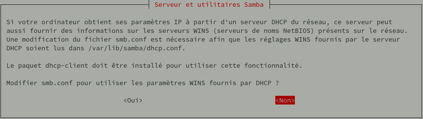{:width=400"}

Icinga doit être lancé

    systemctl status icinga2

```
● icinga2.service - Icinga host/service/network monitoring system
   Loaded: loaded (/lib/systemd/system/icinga2.service; enabled; vendor preset: enabled)
  Drop-In: /etc/systemd/system/icinga2.service.d
           └─limits.conf
   Active: active (running) since Tue 2020-03-31 20:27:38 CEST; 1min 2s ago
```

### base de données

    apt install mariadb-server mariadb-client
    apt install icinga2-ido-mysql


Si besoin les details d'accès à la BDD (user,password,database) seront dans **/etc/icinga2/features-{en,dis}abled/ido-mysql.conf**  


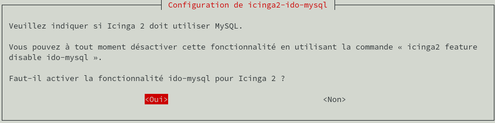{:width=400"}  
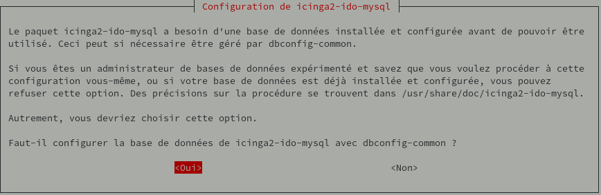{:width=400"}  
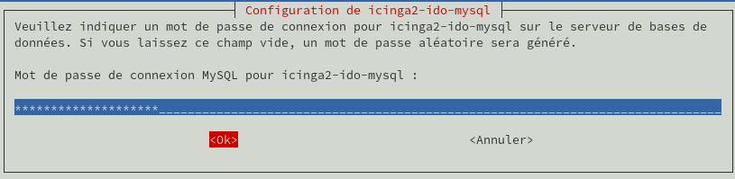{:width=400"}   

base : icingaweb2
mot de passe : spree _frays _bankable _embargo _gander _astronomy

mysql -uroot -p$(cat /etc/mysql/mdp) -e "CREATE DATABASE icingaweb2;GRANT ALL PRIVILEGES ON icingaweb2.* TO 'icingaweb2'@'localhost' IDENTIFIED BY 'spree _frays _bankable _embargo _gander _astronomy';FLUSH PRIVILEGES;"

Activation des fonctions utiles :

    icinga2 feature enable ido-mysql
    icinga2 feature enable command

Redémarrage pour la prise en compte :

    systemctl restart icinga2
    

### Interface web icinga nginx

 L'interface web d'Icinga2 est fort séparée du cœur d'exécution (qui sera commun aux maîtres et esclaves). On parle d'Icingaweb2. Celui-ci échange avec Icinga2 via la base de données et via une possibilité de commande locale. On installera également icingacli qui aide sur la gestion des modules d'Icingaweb2.
  
    apt install icingacli icingaweb2 icingaweb2-module-monitoring php7.2-mysql php7.2-intl
    usermod -a -G icingaweb2 www-data

    apt remove --purge apache2*  # des résidus polluants
    apt autoremove

Configuration moni.wgvpn.space

    nano /etc/nginx/conf.d/moni.wgvpn.space.conf

```
server {
    listen 80;
    listen [::]:80;

    ## redirect http to https ##
    server_name moni.wgvpn.space;
    return  301 https://$server_name$request_uri;
}

server {
    listen 443 ssl http2;
    listen [::]:443 ssl http2;

    access_log /var/log/nginx/moni.wgvpn.space-access.log;
    error_log /var/log/nginx/moni.wgvpn.space-error.log;

    server_name moni.wgvpn.space;

    include ssl_dh_headers;

    # if folder moni.wgvpn.space.d , uncomment the following directive
    include conf.d/wgvpn.space.d/icingaweb2.conf;

}
```

Créer les dossiers

    mkdir -p /etc/nginx/conf.d/wgvpn.space.d

Puis on génére la conf à l'aide de icingacli : 

    icingacli setup config webserver nginx --document-root /usr/share/icingaweb2/public >> /etc/nginx/conf.d/wgvpn.space.d/icingaweb2.conf
    
    

On va la modifier pour l'adapter (définir `fastcgi_pass`)  

    nano /etc/nginx/conf.d/wgvpn.space.d/icingaweb2.conf

```
location ~ ^/icingaweb2/index\.php(.*)$ {
  fastcgi_pass unix:/run/php/php7.2-fpm.sock;
  fastcgi_index index.php;
  include fastcgi_params;
  fastcgi_param SCRIPT_FILENAME /usr/share/icingaweb2/public/index.php;
  fastcgi_param ICINGAWEB_CONFIGDIR /etc/icingaweb2;
  fastcgi_param REMOTE_USER $remote_user;
}

location ~ ^/icingaweb2(.+)? {
  alias /usr/share/icingaweb2/public;
  index index.php;
  try_files $1 $uri $uri/ /icingaweb2/index.php$is_args$args;
}
```

Paramètre date php `date.timezone = Europe/Paris` dans **/etc/php/7.2/fpm/php.ini**  
Rechargement 

    systemctl reload php7.2-fpm nginx


### Finaliser l'installation

Le setup d'icinga va exiger un jeton d'authentification, qu'on génère ainsi :

    icingacli setup token create

The newly generated setup token is: 0b17237d99235d46

Il suffit ensuite d'ouvrir <https://moni.ouestline.xyz/icingaweb2/setup> dans un butineur, et de placer le jeton 

Si vous avez oubliez le jeton :

    icingacli setup token show

Ensuite laissez vous faire. Il faudra configurer l'accès à la base de données d'Icinga2 pour lire l'état du monitoring, et configurer une base propre à Icingaweb2 pour son fonctionnement propre. 

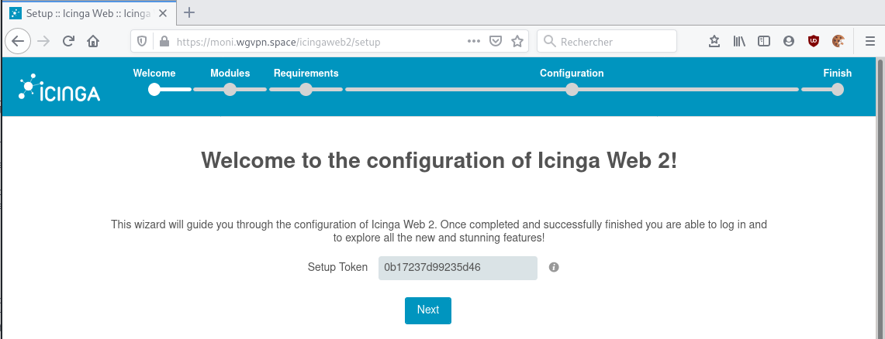{:width=600"}   
Fournissez le jeton de configuration Icinga web 2 que vous avez généré précédemment et cliquez sur le bouton Suivant. Vous devriez voir la page suivante :

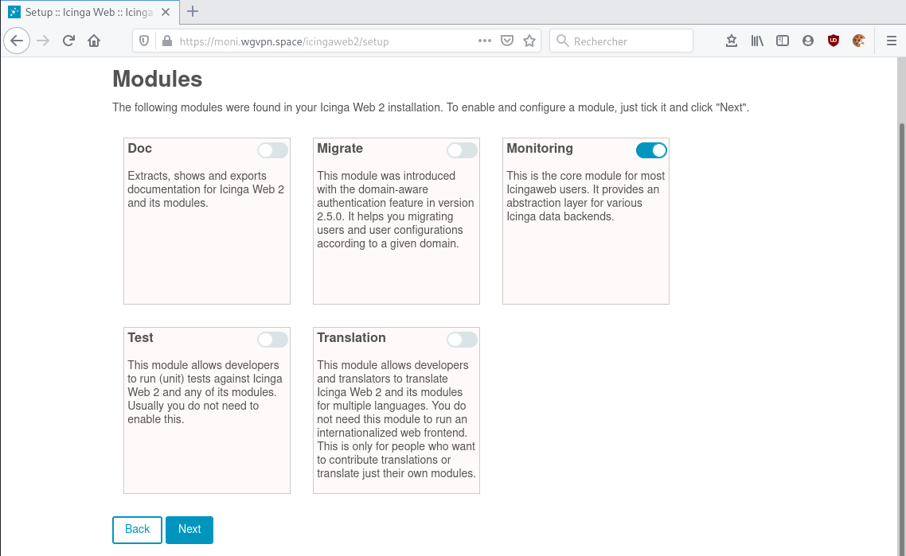{:width=600"}   
Sélectionnez maintenant le module souhaité et cliquez sur le bouton Suivant. Vous devriez voir la page suivante :

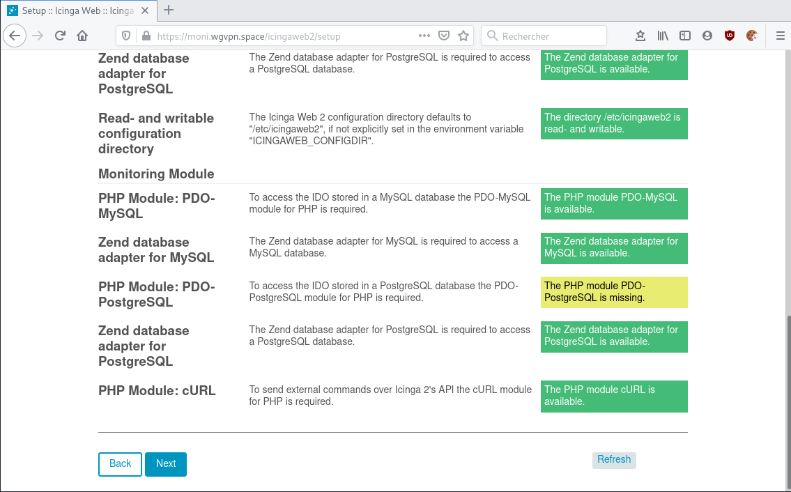{:width=600"}   
Assurez-vous que tous les modules PHP requis sont installés. Ensuite, cliquez sur le bouton Suivant. Vous devriez voir la page suivante :

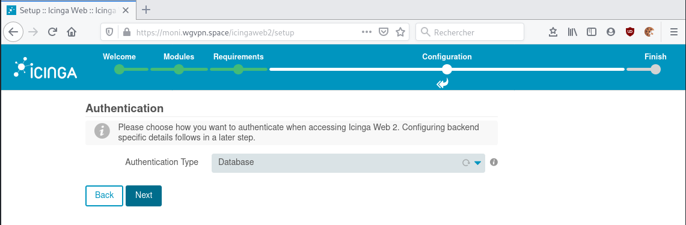{:width=600"}   
Sélectionnez le type d'authentification comme base de données et cliquez sur le bouton Suivant. Vous devriez voir la page suivante :

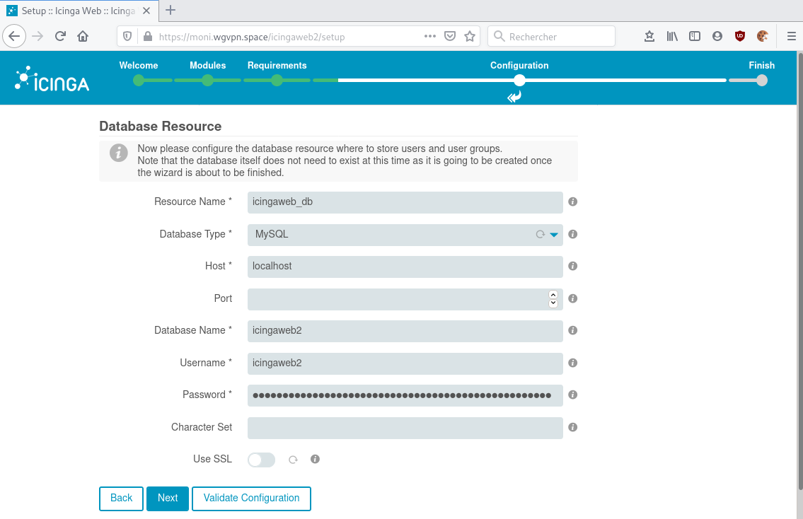{:width=600"}   
Fournissez les détails de votre base de données comme le nom de la base de données, le nom d'utilisateur de la base de données, le mot de passe et cliquez sur le bouton Suivant. Vous devriez voir la page suivante :

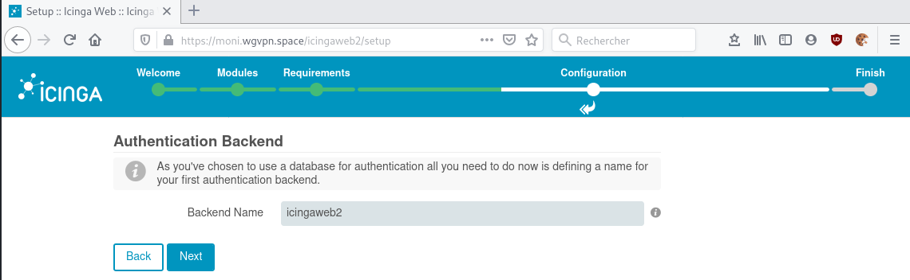{:width=600"}   
Indiquez votre nom de backend et cliquez sur le bouton Suivant. Vous devriez voir la page suivante :

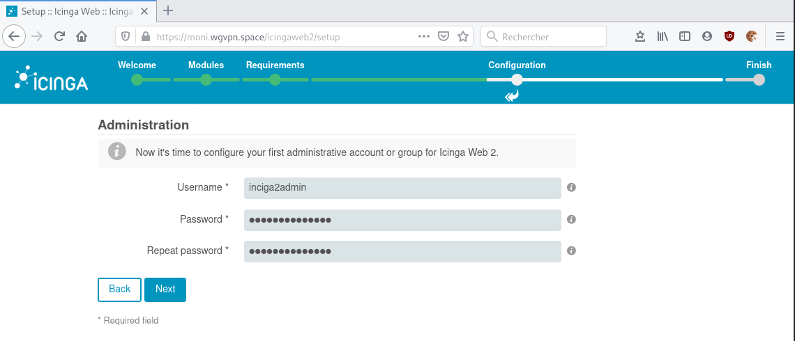{:width=600"}   
Créez votre utilisateur d'administration Icingaweb2 et cliquez sur le bouton Suivant. Vous devriez voir la page suivante :

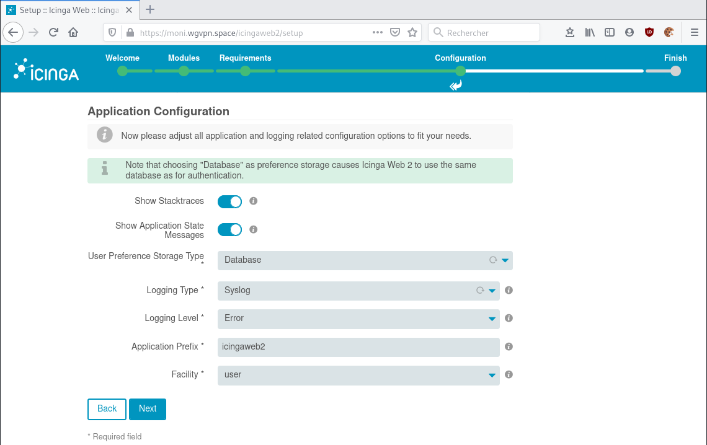{:width=600"}   
Cliquez sur le bouton Suivant. Vous devriez voir la page suivante :

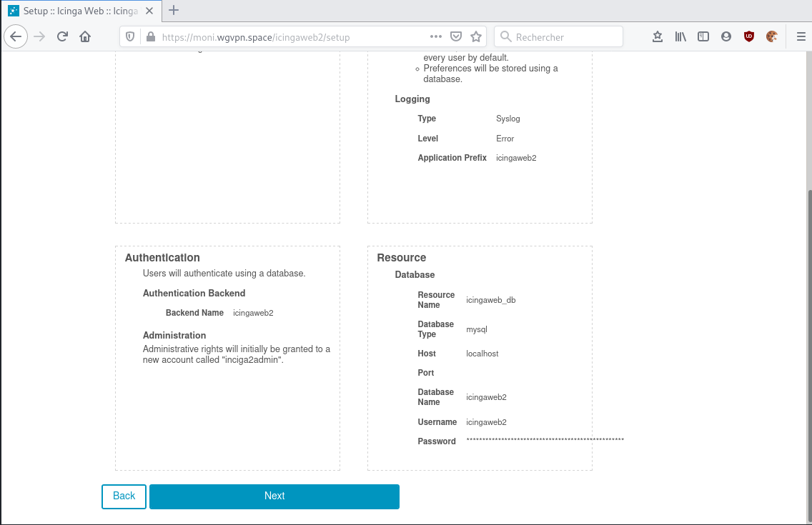{:width=600"}   
Passez en revue toutes les modifications que vous avez apportées et cliquez sur le bouton Suivant. Vous devriez voir la page suivante :

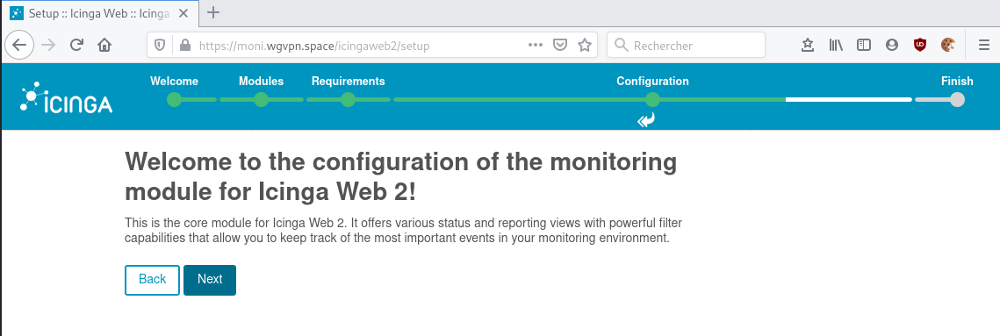{:width=600"}   
Cliquez sur le bouton Suivant pour configurer le module de surveillance. Vous devriez voir la page suivante :

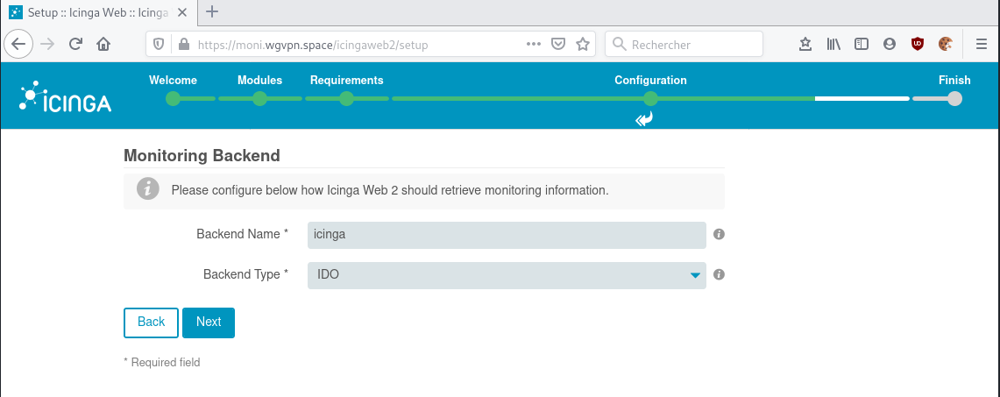{:width=600"}   
Indiquez votre nom et votre type de backend, puis cliquez sur le bouton Suivant. Vous devriez voir la page suivante :

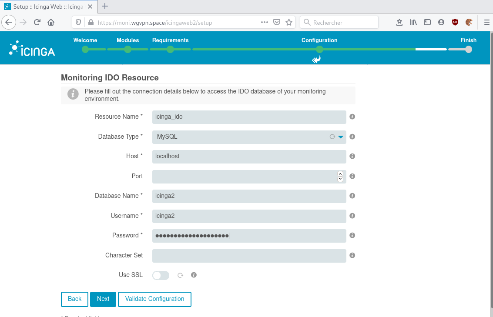{:width=600"}   

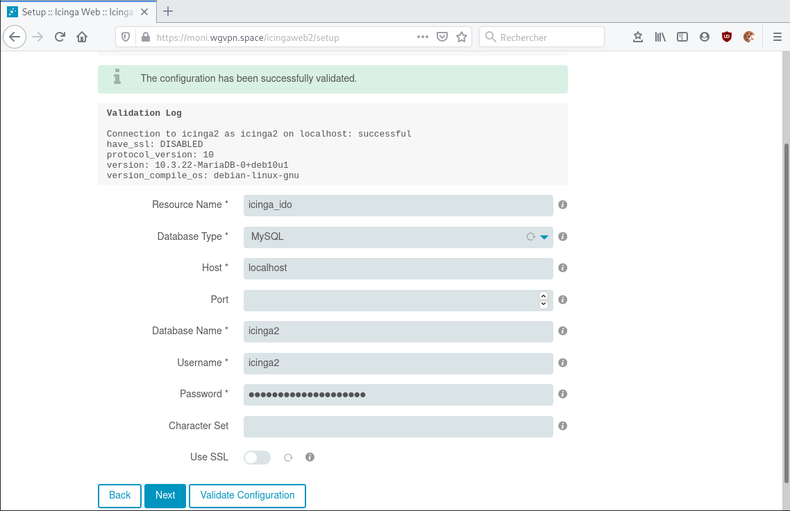{:width=600"}   
Fournissez les détails de votre base de données que vous avez créée lors de l'installation de l'OID et cliquez sur le bouton Suivant. Vous devriez voir la page suivante :

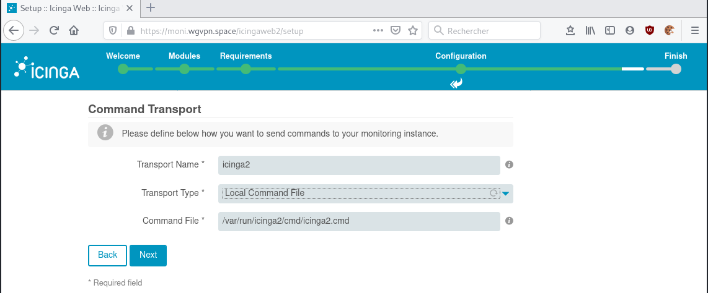{:width=600"}   
Indiquez votre nom de transport, sélectionnez une **ligne de commande locale** et cliquez sur le bouton Suivant. Vous devriez voir la page suivante :

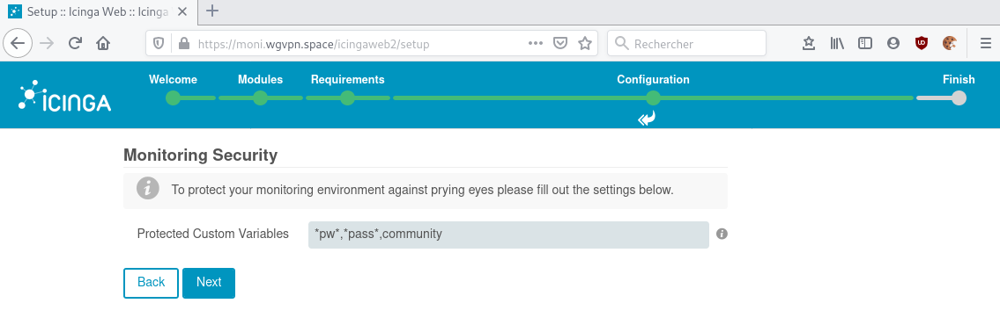{:width=600"}   
Cliquez sur le bouton Suivant. Vous devriez voir la page suivante :

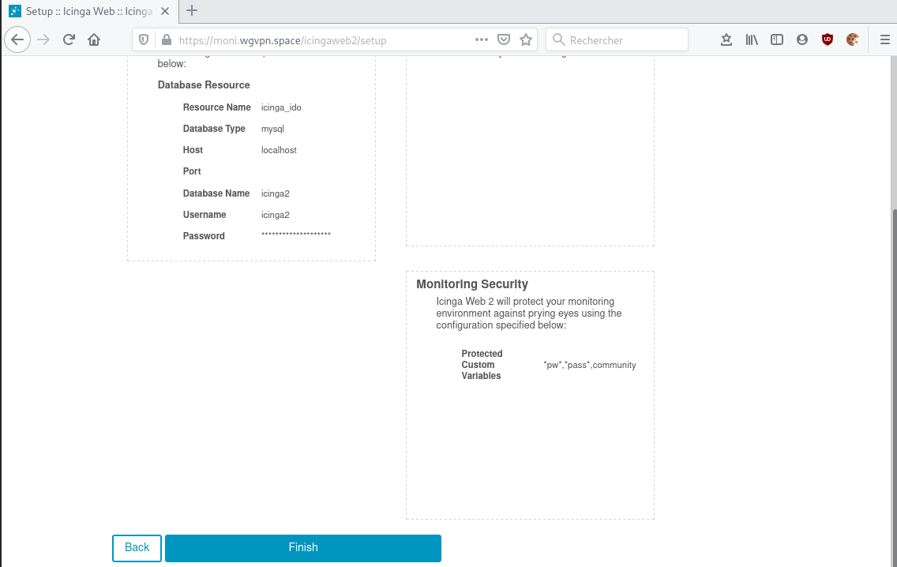{:width=600"}   
Maintenant, passez en revue toutes les modifications que vous avez apportées et cliquez sur le bouton Terminer. Une fois l'installation terminée avec succès, vous devriez voir la page suivante :

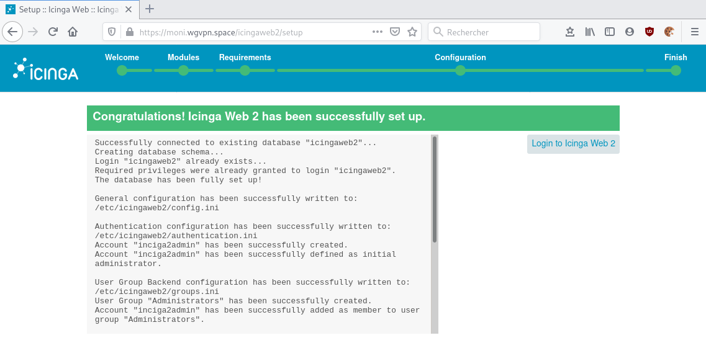{:width=600"}   
Cliquez sur le bouton "Login to Icinga Web 2", vous serez redirigé vers la page suivante :

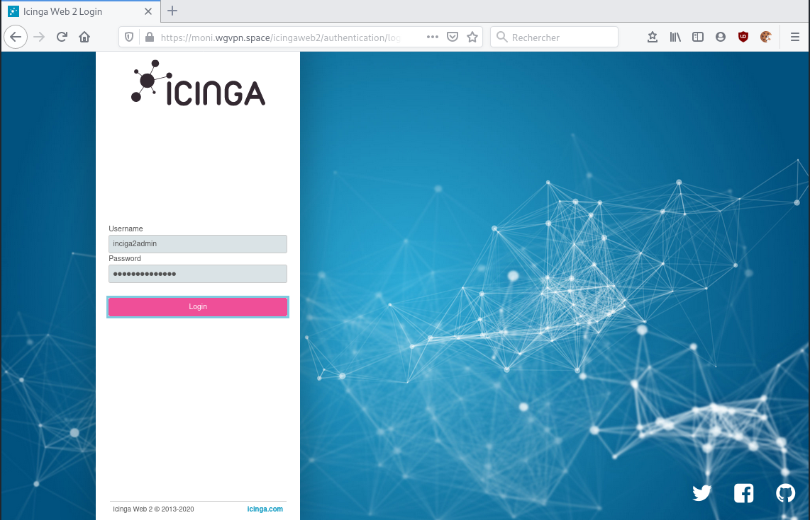{:width=600"}   
Indiquez votre nom d'utilisateur et votre mot de passe Icinga2 admin et cliquez sur le bouton Login. Vous devriez voir le tableau de bord d'Icinga2 sur la page suivante :

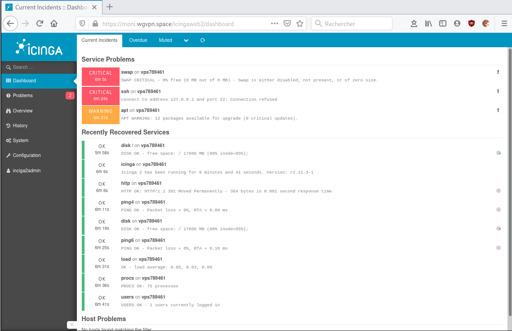{:width=600"}   

Vous avez réussi à installer et à configurer Icinga2 et Icinga web 2 sur le serveur Debian 10. Vous pouvez maintenant facilement ajouter des hôtes de surveillance à votre serveur et démarrer la surveillance.

## Comment surveiller les hôtes et les services avec Icinga

[How To Monitor Hosts and Services with Icinga ](https://www.digitalocean.com/community/tutorials/how-to-monitor-hosts-and-services-with-icinga-on-ubuntu-16-04)

### 1 - Configuration de la surveillance simple de l'hôte

Une façon simple de surveiller un serveur avec Icinga est de mettre en place une vérification régulière de ses services disponibles en externe. Donc, pour un hébergeur, nous testons régulièrement l'adresse IP du serveur et essayons également d'accéder à une page Web. Cela nous dira si l'hôte est en place et si le serveur Web fonctionne correctement.

>Remarque: Icinga utilise toujours par défaut le nom de domaine complet (FQDN) de tout hôte avec lequel il traite. Un nom de domaine complet est un nom d'hôte plus son nom de domaine, donc web-1.example.com , par exemple. Si vous n'avez pas de domaine approprié configuré pour un hôte, le nom de domaine complet sera quelque chose comme web-1.localdomain  
si vous n'avez pas de «vrai» FQDN, utilisez toujours l'adresse IP du serveur dans n'importe quel champ d' address Icinga que vous configurez.

Connectez-vous au nœud maître. Pour ajouter un nouvel hôte, nous devons modifier le fichier **hosts.conf**

      sudo nano /etc/icinga2/conf.d/hosts.conf

Cela ouvrira un fichier avec quelques commentaires explicatifs et un seul bloc hôte défini. Le bloc de configuration object Host NodeName existant définit l' hôte icinga-master , qui est l'hôte sur lequel nous avons installé Icinga et Icinga Web. Positionnez votre curseur au bas du fichier et ajoutez un nouvel hôte:

    /etc/icinga2/conf.d/hosts.conf

```
/*
 * Host definitions with object attributes
 * used for apply rules for Service, Notification,
 * Dependency and ScheduledDowntime objects.
 *
 * Tip: Use `icinga2 object list --type Host` to
 * list all host objects after running
 * configuration validation (`icinga2 daemon -C`).
 */

/*
 * This is an example host based on your
 * local host's FQDN. Specify the NodeName
 * constant in `constants.conf` or use your
 * own description, e.g. "db-host-1".
 */

object Host NodeName {
  /* Import the default host template defined in `templates.conf`. */
  import "generic-host"

  /* Specify the address attributes for checks e.g. `ssh` or `http`. */
  address = "127.0.0.1"
  address6 = "::1"

  /* Set custom variable `os` for hostgroup assignment in `groups.conf`. */
  vars.os = "Linux"

  /* Define http vhost attributes for service apply rules in `services.conf`. */
  vars.http_vhosts["http"] = {
    http_uri = "/"
  }
  /* Uncomment if you've sucessfully installed Icinga Web 2. */
  //vars.http_vhosts["Icinga Web 2"] = {
  //  http_uri = "/icingaweb2"
  //}

  /* Define disks and attributes for service apply rules in `services.conf`. */
  vars.disks["disk"] = {
    /* No parameters. */
  }
  vars.disks["disk /"] = {
    disk_partitions = "/"
  }

  /* Define notification mail attributes for notification apply rules in `notifications.conf`. */
  vars.notification["mail"] = {
    /* The UserGroup `icingaadmins` is defined in `users.conf`. */
    groups = [ "icingaadmins" ]
  }
}

object Host "cinay.eu" {
  import "generic-host"
  address = "51.77.151.245"
  vars.http_vhosts["http"] = {
    http_uri = "/"
  }
  vars.notification["mail"] = {
    groups = [ "icingaadmins" ]
  }
}
```

Cela définit un hôte appelé **cinay.eu** , à partir d'un hôte par défaut et d'un modèle appelé generic-host , pointe Icinga vers la bonne adresse IP, puis définit quelques variables qui indiquent à Icinga de vérifier une réponse HTTPS à l'URL racine ( / ) et avertir le groupe **icingaadmins** par e-mail en cas de problème.

Enregistrez et fermez le fichier, puis redémarrez Icinga:

      sudo systemctl restart icinga2

Revenez à l'interface Web Icinga dans votre navigateur. L'interface se met à jour assez rapidement, vous n'avez donc pas besoin de rafraîchir la page. Les nouvelles informations sur l'hôte devraient être remplies rapidement et les "health checks" passeront de Pending (En attente) à Ok une fois qu'Icinga aura rassemblé suffisamment d'informations.

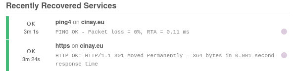

Ensuite, nous allons configurer la surveillance via un agent Icinga, afin que nous puissions garder un œil sur des informations système plus détaillées.

### 2 - Configuration de la surveillance basée sur l'agent

Icinga fournit un mécanisme de communication sécurisée entre un nœud maître et client afin d'exécuter des contrôles d'intégrité à distance plus étendus.  
Au lieu de seulement savoir que notre serveur Web sert des pages avec succès, nous pourrions également surveiller la charge du processeur, le nombre de processus, l'espace disque, etc.

Nous allons mettre en place un deuxième serveur à surveiller. Nous l'appellerons web-2.example.com . Nous devons installer le logiciel Icinga sur la machine distante, exécuter des assistants de configuration pour établir la connexion, puis mettre à jour certains fichiers de configuration sur le nœud maître Icinga.

>Remarque: Il existe de nombreuses façons d'architecturer une installation Icinga, avec plusieurs niveaux de nœuds maître / satellite / client , un basculement haute disponibilité et plusieurs façons de partager les détails de configuration entre les nœuds. Nous mettons en place une structure simple à deux niveaux avec un nœud maître et plusieurs nœuds clients . De plus, toute la configuration sera effectuée sur le nœud maître , et nos commandes de vérification de l'état seront planifiées sur le nœud maître et transmises aux clients. Le projet Icinga appelle ce mode de configuration de point de terminaison de commande descendante .

#### Configurer le nœud maître wgvpn.space

Tout d'abord, nous devons configurer le nœud maître pour établir des connexions client. Nous le faisons en exécutant l' assistant de configuration de nœud sur notre nœud maître:

      sudo icinga2 node wizard

Cela lancera un script qui nous posera quelques questions et mettra les choses en place pour nous. Dans ce qui suit, nous avons ENTER sur ENTER pour accepter la plupart des valeurs par défaut. Les réponses non par défaut sont mises en évidence. Certaines sorties d'informations ont été supprimées pour plus de clarté:

```
Welcome to the Icinga 2 Setup Wizard!

We will guide you through all required configuration details.

Please specify if this is an agent/satellite setup ('n' installs a master setup) [Y/n]: n

Starting the Master setup routine...

Please specify the common name (CN) [wgvpn.space]: 
Reconfiguring Icinga...
Checking for existing certificates for common name 'wgvpn.space'...
Certificate '/var/lib/icinga2/certs//wgvpn.space.crt' for CN 'wgvpn.space' already existing. Skipping certificate generation.
Generating master configuration for Icinga 2.
'api' feature already enabled.

Master zone name [master]:wgvpn.space 

Default global zones: global-templates director-global
Do you want to specify additional global zones? [y/N]:n 
Please specify the API bind host/port (optional):
Bind Host []: 
Bind Port []: 

Do you want to disable the inclusion of the conf.d directory [Y/n]:n 
Disabling the inclusion of the conf.d directory...
Checking if the api-users.conf file exists...

Done.

Now restart your Icinga 2 daemon to finish the installation!
```

Redémarrez Icinga pour terminer la mise à jour de la configuration:

      sudo systemctl restart icinga2

Ouvrez un port pare-feu pour autoriser les connexions externes à Icinga:

      sudo ufw allow 5665

Nous allons maintenant passer au nœud client, installer Icinga et exécuter le même assistant.

### Configurer le nœud client wgvpn.ovh

Connectez-vous au serveur **wgvpn.ovh**  
Nous devons réinstaller le référentiel Icinga, puis installer Icinga lui-même. Il s'agit de la même procédure que nous avons utilisée sur le nœud maître.  
Installer les repos en exécutant les commandes ci-dessous

    sudo -s
    apt install -y apt-transport-https wget gnupg
    wget -O - https://packages.icinga.com/icinga.key | apt-key add -
    echo "deb https://packages.icinga.com/debian icinga-buster main" > /etc/apt/sources.list.d/icinga.list
    echo "deb-src https://packages.icinga.com/debian icinga-buster main" >> /etc/apt/sources.list.d/icinga.list
    apt update

Ensuite, installez icinga2 . Notez que nous n'avons pas besoin du icinga2-ido-mysql que nous avons installé sur le nœud maître:

      sudo apt install icinga2

Maintenant, nous exécutons l'assistant de nœud sur ce serveur, mais nous faisons une configuration satellite au lieu de maître :

      sudo icinga2 node wizard

```
Welcome to the Icinga 2 Setup Wizard!

We will guide you through all required configuration details.

Please specify if this is an agent/satellite setup ('n' installs a master setup) [Y/n]: y

Starting the Agent/Satellite setup routine...

Please specify the common name (CN) [wgvpn.ovh]: 

Please specify the parent endpoint(s) (master or satellite) where this node should connect to:
Master/Satellite Common Name (CN from your master/satellite node): wgvpn.space

Do you want to establish a connection to the parent node from this node? [Y/n]: y
Please specify the master/satellite connection information:
Master/Satellite endpoint host (IP address or FQDN): wgvpn.space
Master/Satellite endpoint port [5665]: 

Add more master/satellite endpoints? [y/N]:n 
Parent certificate information:

 Subject:     CN = wgvpn.space
 Issuer:      CN = Icinga CA
 Valid From:  Apr  9 18:19:11 2020 GMT
 Valid Until: Apr  6 18:19:11 2035 GMT
 Fingerprint: 6C 27 81 36 E3 DE EE 05 59 29 83 E5 93 0F EE C4 36 CE 20 2F 
```

L'assistant va maintenant récupérer le certificat public de notre nœud maître et nous afficher ses détails. Confirmez les informations, puis continuez:

```
Is this information correct? [y/N]: y

Please specify the request ticket generated on your Icinga 2 master (optional).
 (Hint: # icinga2 pki ticket --cn 'wgvpn.ovh'): 

```

À ce stade, revenez à votre serveur master wgvpn.space et exécutez la commande à laquelle l'assistant vous a invité. N'oubliez pas sudo devant:

      sudo icinga2 pki ticket --cn 'wgvpn.ovh'

La commande produira une clé `fa84ecb7c0f516bc58cdaaf8cccf82eb3ddb88d9`  
Copiez-le dans votre presse-papiers, puis revenez au nœud client, collez-le et ENTER sur ENTER pour continuer avec l'assistant.

```
Please specify the request ticket generated on your Icinga 2 master (optional).
 (Hint: # icinga2 pki ticket --cn 'wgvpn.ovh'): fa84ecb7c0f516bc58cdaaf8cccf82eb3ddb88d9
Please specify the API bind host/port (optional):
Bind Host []: 
Bind Port []: 

Accept config from parent node? [y/N]: n
Accept commands from parent node? [y/N]: y

Reconfiguring Icinga...

Local zone name [wgvpn.ovh]: wgvpn.ovh
Parent zone name [master]: wgvpn.space

Default global zones: global-templates director-global
Do you want to specify additional global zones? [y/N]: n

Do you want to disable the inclusion of the conf.d directory [Y/n]:n 
Disabling the inclusion of the conf.d directory...

Done.

Now restart your Icinga 2 daemon to finish the installation!
```

Ouvrez maintenant le port Icinga sur votre pare-feu:

      sudo ufw allow 5665

Et redémarrez Icinga pour mettre à jour complètement la configuration:

      sudo systemctl restart icinga2

Vous pouvez vérifier qu'il existe une connexion entre les deux serveurs avec netstat :

      netstat | grep :5665

La connexion peut prendre un moment. Finalement, netstat affichera une ligne montrant une connexion ESTABLISHED sur le bon port.

```
tcp        0      0 wgvpn.ovh:33422         wgvpn.space:5665        ESTABLISHED
```

Cela montre que nos serveurs se sont connectés et nous sommes prêts à configurer les vérifications client.

### Configurer la surveillance des agents

Même si le maître et le client sont maintenant connectés, il reste encore une configuration à faire sur le maître pour activer la surveillance. Nous devons configurer un nouveau fichier hôte. 

**Revenir sur le maître wgvpn.space**

Un niveau d'organisation important dans une installation Icinga est le concept de zone  
Tous les nœuds clients doivent créer leur propre zone et faire rapport à une zone parent, dans ce cas notre nœud maître.   
Par défaut, la zone de notre nœud maître est nommée d'après son <u>nom de domaine complet</u>.  
Nous allons créer un répertoire nommé d'après notre zone maître dans le répertoire **zones.d**  
Cela contiendra les informations de tous les clients de la zone maître.

Créez le répertoire de zone:

      sudo mkdir /etc/icinga2/zones.d/wgvpn.space

Nous allons créer un fichier de configuration des services. Cela définira certaines vérifications de service que nous effectuerons sur n'importe quel nœud client distant. 

      sudo nano /etc/icinga2/zones.d/wgvpn.space/services.conf

Collez ce qui suit, puis enregistrez et fermez:

```
apply Service "load" {
  import "generic-service"
  check_command = "load"
  command_endpoint = host.vars.client_endpoint
  assign where host.vars.client_endpoint
}

apply Service "procs" {
  import "generic-service"
  check_command = "procs"
  command_endpoint = host.vars.client_endpoint
  assign where host.vars.client_endpoint
}

```

Cela définit deux contrôles de service.  

* Le premier rendra compte de la charge du processeur
* le second vérifiera le nombre de processus sur le serveur. 

Les deux dernières lignes de chaque définition de service sont importantes. `command_endpoint` indique à Icinga que cette vérification de service doit être envoyée à un point de terminaison de commande distant.  
La ligne `assign where` attribue automatiquement la vérification de service à tout hôte sur lequel une variable `client_endpoint` est définie.

Créons un tel hôte maintenant. Ouvrez un nouveau fichier dans le répertoire de zone que nous avons créé précédemment. Ici, nous avons nommé le fichier d'après l'hôte distant:

      sudo nano /etc/icinga2/zones.d/wgvpn.space/wgvpn.ovh.conf

Collez dans la configuration suivante, puis enregistrez et fermez le fichier:

```
object Zone "wgvpn.ovh" {
  endpoints = [ "wgvpn.ovh" ]
  parent = "wgvpn.space"
}

object Endpoint "wgvpn.ovh" {
  host = "51.91.249.57"
}

object Host "wgvpn.ovh" {
  import "generic-host"
  address = "51.91.249.57"
  vars.http_vhosts["http"] = {
    http_uri = "/"
  }
  vars.notification["mail"] = {
    groups = [ "icingaadmins" ]
  }
  vars.client_endpoint = name
}
```

Ce fichier définit une zone pour notre hôte distant et la lie à la zone parent. Il définit également l'hôte comme un point de terminaison, puis définit l'hôte lui-même, en important certaines règles par défaut à partir du modèle  **generic-host** . Il définit également des `vars` pour créer une vérification HTTP et activer les notifications par e-mail. Notez que parce que cet hôte a **vars.client_endpoint = name** , il sera également affecté aux vérifications de service que nous venons de définir dans **services.conf** .

Redémarrez Icinga pour mettre à jour la configuration:

      sudo systemctl restart icinga2

Revenez à l'<u>interface Web Icinga</u>  
le nouvel hôte s'affichera avec des contrôles en attente . Après quelques instants, ces contrôles devraient devenir OK .  
Cela signifie que notre nœud client exécute correctement les vérifications du nœud maître.

### Conclusion

Dans ce didacticiel, nous avons configuré deux types différents de surveillance avec Icinga, les vérifications de service externes et les vérifications d'hôtes basées sur des agents. Il y a beaucoup plus à apprendre sur la configuration et le travail avec Icinga, donc vous voudrez probablement approfondir la documentation complète d'Icya .

Notez que si vous arrivez à un point où vous avez besoin de commandes de vérification personnalisées, vous devrez les synchroniser du maître aux nœuds clients à l'aide d'une zone de configuration globale . Vous pouvez en savoir plus sur cette fonctionnalité spécifique ici .

Enfin, si vous avez un grand nombre de serveurs à surveiller, vous pourriez envisager d'utiliser un logiciel de gestion de configuration pour automatiser vos mises à jour de configuration Icinga. Notre série de didacticiels Prise en main de la gestion de la configuration donne un aperçu complet des concepts et des logiciels impliqués.
